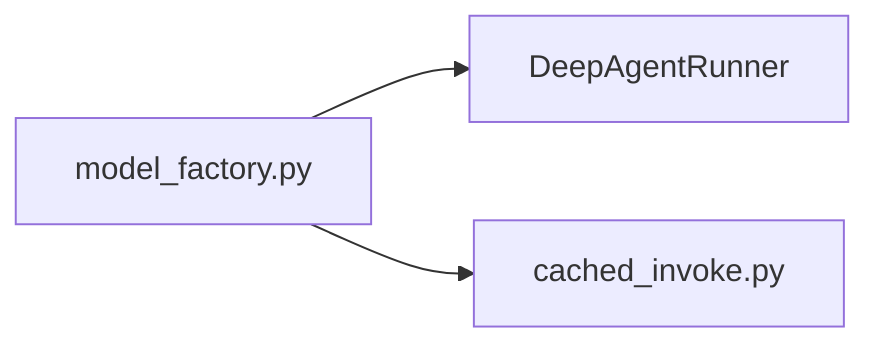

# Prompt — author or refresh a DOMAIN card

You are writing the analysis for ONE domain card in a Velocity knowledge base.

Substitute before running:

- `{{CARD}}` — repo-relative path to the `DOMAIN-*.md`
- `{{CHANGED_FILES}}` — the changeset that triggered this run: one path per
  line, and where available a `Symbols that moved` block listing `+` added and
  `-` removed `file::symbol` pairs. Or `(none — first authoring)`.

  When that symbol block is present it is the sharpest instruction you will
  get: a `-` paired with a `+` in the same file is a **rename**, and every
  place the prose or a diagram names the old symbol is now wrong. Fix those
  first, then read the file for what the delta cannot show — a changed call
  order or an altered guard moves no symbol at all.

**A domain is not a folder.** The `MOD-*.md` cards already describe folders and
they are generated — they answer "what is in `backend/agents`". A domain answers
what a directory listing cannot: *how does this concern actually work, across
whatever files it happens to live in.* Its members are declared by hand and
deliberately overlap other domains.

If what you write could have been produced by listing a directory, you have not
done the job.

---

## Two modes

**If `{{CHANGED_FILES}}` names files** this is an INCREMENTAL update. The prose
was true when it was written. Read the changed files, find every claim the card
makes that those changes invalidate, and fix exactly those. Leave everything
else alone — rewriting a paragraph nothing invalidated is how a good one gets
replaced by a worse one. Say at the end what you changed and what you left.

**If it says `(none — first authoring)`** write all four sections from scratch.

## Read first

1. `{{CARD}}` in full. Frontmatter carries `members` (declared globs),
   `member_count`, `modules_spanned` and `watched_files`. The block between
   `<!-- AUTO-GENERATED BELOW THIS LINE` and `<!-- /AUTO-GENERATED -->` lists
   every resolved member grouped by module, plus what imports INTO the domain
   and what it imports OUT. **Trust it. Never restate it.**
2. The changed files, if any.
3. Otherwise every member file — not a sample. A domain is 5–40 files and you
   are claiming to explain how they work together.
4. The inbound/outbound lists: they show who actually depends on this domain,
   which is usually where its real contract lives.
5. `.knowledge/ARCHITECTURE.md` § "What Velocity is" for the system-level
   claims (SC-001, the capability-registry seam, the kernel's workflow
   ignorance). If this domain implements or enforces one, say so.

## Write

Replace everything BELOW `<!-- /AUTO-GENERATED -->` with exactly four sections
in this order. Touch nothing above that line — the frontmatter and the
generated block belong to `build_architecture.py`, and `members:` is a human
decision you must not edit.

### `## Purpose`

Two paragraphs. What concern this domain owns and what breaks without it. Then
where it begins and ends — what is deliberately *not* here and which
neighbouring domain has it instead. A reader should finish knowing whether
their question belongs here or next door.

### `## Shape`

**Cap the diagram at 8–12 nodes.** This is the one lifted into
`ARCHITECTURE.md` and read beside thirteen siblings, so it must be
comprehensible at a glance. It shows *what the domain is made of*, not how a
request travels — the journey belongs in the next section. Resist adding nodes;
if it needs fifteen, you are drawing the trace, not the shape.

Lead with the single load-bearing fact in bold — the chokepoint, the invariant,
the one-way dependency, the contract every member honours. Then:

- `flowchart LR` or `TD`. Collapse siblings into one node
  (`gates["gates/*.py"]`) rather than drawing each.
- **Every node is a real file or symbol.** No conceptual boxes — "Business
  Logic" is unverifiable and can never go stale, which makes it worse than
  nothing.
- Label the node, id the identifier: `engine["engine.py"]`.
- **Never use a mermaid keyword as a node id.** `graph`, `flowchart`,
  `subgraph`, `end`, `class`, `classDef`, `click`, `style`, `linkStyle`,
  `direction`, `default`, `href`, `call`, `callback` are all parse errors, and
  the card then renders as a red error box everywhere it is viewed. The trap is
  that the natural id is often the reserved one — `graph.py` invites
  `graph["graph.py"]`. Prefix it instead: `artifact_graph["artifacts/graph.py"]`.
- No styling, no colours, no nested subgraphs.
- Do not draw external package dependencies — they are listed above.

Then a bulleted breakdown, one bullet per structural role, naming the files
that fill it. Where control or data crosses a module boundary, say so and in
which direction — that crossing is usually what a maintainer gets wrong.

### `## In practice`

What actually happens when someone uses this. Four parts:

**1. `### The path, by call`** — a `sequenceDiagram`, not a flowchart.
Participants are modules. Two hard rules, both learned the hard way:

- **No participant aliases.** Write the module id out in full so every arrow
  reads `MOD-backend-agents->>MOD-backend-app-agents`. An agent reading the
  source must not have to resolve a lookup table.
- **Every arrow label is `file.py::symbol`.** Never a bare function name.
  These strings are what someone greps to land on the definition.

Use `activate`/`deactivate` for what is still on the stack, `loop` for
streaming or repetition, `alt`/`else` for genuinely different branches
(retryable vs fatal). Mark where a response returns early — a request that
completes before the work does is the single most misread thing in a trace.

**2. `### Step by step`** — the same journey as a numbered list, grouped under
short phase headings. This is what agents actually consume: linear,
unambiguous, no syntax to parse. Start at the **true entry point** — the HTTP
route, the WebSocket frame, the CLI command, and the frontend call that issued
it — not at this domain's edge. End where the caller gets something back. Name
real functions in real call order; if you cannot follow it in the source, trace
a shorter journey you can verify. 10–20 steps.

**3. `### What breaks if you get it wrong`** — the specific failure a
maintainer will cause and how it will present: a compile error, a silent no-op,
a run that hangs, a security check skipped. Prefer failures that are silent;
those are the ones worth documenting. Note which failures are loud (a CI gate,
an exception) so the reader knows what they do *not* have to worry about.

**4. `### The other paths`** — one short paragraph each for the genuinely
different second and third journeys: the error path, the resume path, the
cache-hit path. Not full traces.

### `## Why this shape`

Why it is built this way and not the obvious alternative. Anchor every claim in
something real: an invariant ID, a CI gate, an import-linter contract, a card
in `.knowledge/cards/`, a design that was removed. Where you cannot find a
recorded reason, **say the reason is not recorded** — never invent one.

## Rules

- **Every symbol you name must exist right now.** Verify in the source. This
  whole mechanism exists because a rename left a stale name in prose.
- **Never restate the generated block** — no file lists, no import lists.
- **Reference by name, plainly** — `` `engine.py` ``, `CapabilityRegistry`,
  `FIX-233`. The build turns file, module-id and card-id references into
  working links on the next run. Never hand-write a markdown link; yours break
  when a card is renamed and the generated ones do not.
- **Disambiguate a shared basename by writing more of the path** —
  `capabilities/registry.py::discover`, because there are two `registry.py`.
  An ambiguous reference is reported and dropped from the watch set, so the
  card silently stops being tracked for that file.
- **Do not edit `members:`.** If a file looks missing or wrongly included, say
  so at the end of your reply and leave the frontmatter alone.
- **Do not stamp `prose_signature`.** The signature is derived from the files
  your prose names, so it cannot be known until after you write. The build
  computes it and `--stamp` sets it.
- **Do not touch any other file** — not `ARCHITECTURE.md` (the build inlines
  your `## Shape` diagram there), not another domain card, not a module card.
