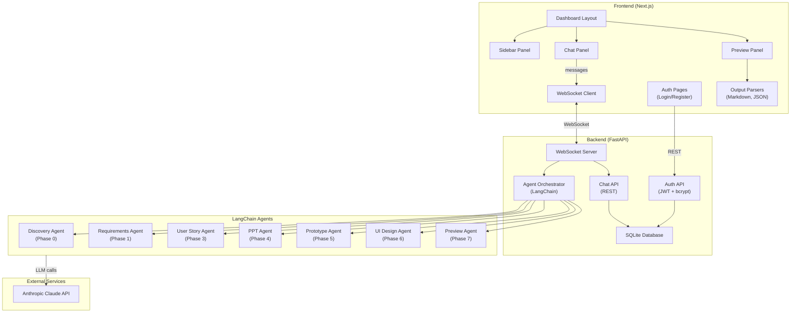

# Design Document: AI SaaS Platform

## Overview

This document describes the technical design for an enterprise-grade AI SaaS platform. The platform provides a three-panel dashboard (Sidebar, Chat, Preview) where authenticated users interact with a multi-agent AI system via real-time WebSocket streaming. The AI system follows a multi-phase execution flow (Phases 0–7) powered by LangChain agents using the Anthropic Claude API to generate structured deliverables: User Stories (Markdown), PowerPoint slides (JSON), and UI Prototypes.

The system is split into two main codebases:
- **Frontend**: React/Next.js (Node v20.9.0) — handles the dashboard UI, authentication flows, WebSocket client, and real-time preview rendering
- **Backend**: Python/FastAPI (Python 3.12.2) — handles authentication, chat session persistence, WebSocket server, and LangChain-based agent orchestration

Key design goals:
- Token-by-token streaming via WebSockets for responsive AI interactions
- Enterprise-dark themed UI with a consistent design system
- Structured, parseable output formats with round-trip fidelity
- Cross-platform compatibility (Windows and macOS)
- SQLite for development database

## Architecture

The platform follows a client-server architecture with WebSocket-based real-time communication.



### Communication Flow

1. **Authentication**: REST API calls from frontend to `/api/auth/register` and `/api/auth/login`. JWT tokens stored client-side and sent with all subsequent requests.
2. **Chat Sessions**: REST API for CRUD operations on chat sessions (`/api/chats`).
3. **Real-time Streaming**: WebSocket connection established on dashboard load, authenticated via JWT. All AI responses stream through this channel as `Stream_Message` objects.
4. **Agent Execution**: The Agent Orchestrator receives prompts via WebSocket, routes them through the multi-phase pipeline, and streams results back token-by-token.

### Project Structure

```
ai-saas-platform/
├── frontend/                    # Next.js application
│   ├── src/
│   │   ├── app/                 # Next.js App Router pages
│   │   │   ├── login/
│   │   │   ├── register/
│   │   │   └── dashboard/
│   │   ├── components/          # React components
│   │   │   ├── layout/          # Dashboard layout components
│   │   │   ├── chat/            # Chat panel components
│   │   │   ├── preview/         # Preview panel components
│   │   │   ├── sidebar/         # Sidebar components
│   │   │   └── ui/              # Design system primitives
│   │   ├── hooks/               # Custom React hooks
│   │   ├── lib/                 # Utilities, parsers, WebSocket client
│   │   ├── styles/              # Global styles, theme tokens
│   │   └── types/               # TypeScript type definitions
│   ├── package.json
│   └── tsconfig.json
├── backend/                     # FastAPI application
│   ├── app/
│   │   ├── api/                 # API route handlers
│   │   │   ├── auth.py
│   │   │   ├── chats.py
│   │   │   └── websocket.py
│   │   ├── agents/              # LangChain agent definitions
│   │   │   ├── orchestrator.py
│   │   │   ├── discovery.py
│   │   │   ├── user_stories.py
│   │   │   ├── ppt.py
│   │   │   ├── prototype.py
│   │   │   └── base.py
│   │   ├── models/              # SQLAlchemy/Pydantic models
│   │   ├── services/            # Business logic services
│   │   ├── core/                # Config, security, dependencies
│   │   └── main.py              # FastAPI app entry point
│   ├── requirements.txt
│   └── pyproject.toml
├── README.md
└── .env.example
```

## Components and Interfaces

### Frontend Components

#### 1. Auth Pages (`/login`, `/register`)

- **LoginPage**: Form with email/password fields, submits to `POST /api/auth/login`, stores JWT in `localStorage`, redirects to `/dashboard`
- **RegisterPage**: Form with email/password fields (password min 8 chars client-side validation), submits to `POST /api/auth/register`, stores JWT, redirects to `/dashboard`
- Both pages display server-side validation errors inline

#### 2. Dashboard Layout (`/dashboard`)

- **DashboardLayout**: Three-panel flex layout. On screens ≥1024px, renders Sidebar (fixed 280px), ChatPanel (flex-grow), PreviewPanel (fixed 420px). On screens <1024px, Sidebar collapses to a toggleable overlay.
- Establishes WebSocket connection on mount, tears down on unmount.
- Redirects to `/login` if no valid JWT is present.

#### 3. Sidebar

- **Sidebar**: Contains a "New Chat" button and a scrollable list of `ChatSessionItem` components ordered by `last_activity` descending.
- **ChatSessionItem**: Displays chat title/timestamp, highlights active session, triggers session load on click.

#### 4. Chat Panel

- **ChatPanel**: Renders a scrollable message list and an input bar at the bottom.
- **MessageBubble**: Renders user messages (right-aligned, dark background) and AI messages (left-aligned, lighter background) with distinct styling per the Design System.
- **TypingIndicator**: Animated dots displayed while streaming is in progress.
- **ChatInput**: Text input with send button. Supports Enter-to-send. Includes "Regenerate" and "Edit" actions on completed messages.
- Auto-scrolls to bottom during streaming.

#### 5. Preview Panel

- **PreviewPanel**: Tabbed container with three tabs: User Stories, PPT, Prototype.
- **UserStoryPreview**: Renders parsed Markdown as formatted HTML with Epics/Stories/Acceptance Criteria hierarchy.
- **PPTPreview**: Renders slides in a carousel with prev/next navigation. Each slide rendered as a card following the approved color palette.
- **PrototypePreview**: Renders the UI prototype definition showing Pages, Components, Navigation, and Behavior.
- Tab switching preserves rendered state of inactive tabs (no re-render on switch).

#### 6. WebSocket Client Hook (`useWebSocket`)

- Custom React hook managing WebSocket lifecycle.
- Connects to `ws://<backend>/ws/chat?token=<jwt>`.
- Parses incoming `Stream_Message` JSON and dispatches to chat and preview state.
- Implements reconnection with exponential backoff (base 1s, max 5 retries).
- Exposes `send(message)`, `connectionStatus`, and `reconnect()`.

### Backend Components

#### 7. Auth API (`/api/auth`)

- `POST /api/auth/register`: Validates email format and password length (≥8), checks for duplicate email, hashes password with bcrypt, creates user, returns JWT.
- `POST /api/auth/login`: Validates credentials against stored bcrypt hash, returns JWT with 24h expiry. Returns generic 401 on failure (no email/password distinction).
- `GET /api/auth/me`: Returns current user info from JWT. Used for session validation.

**JWT Structure**:
```json
{
  "sub": "<user_id>",
  "exp": "<unix_timestamp_24h_from_now>",
  "iat": "<unix_timestamp_now>"
}
```

#### 8. Chat API (`/api/chats`)

- `POST /api/chats`: Creates a new chat session for the authenticated user.
- `GET /api/chats`: Lists all chat sessions for the authenticated user, ordered by `last_activity` descending.
- `GET /api/chats/{id}`: Returns full chat session with message history and any associated `Final_Output`.
- `PUT /api/chats/{id}/messages`: Appends a message to the chat session, updates `last_activity`.

#### 9. WebSocket Server (`/ws/chat`)

- Accepts WebSocket connections with JWT authentication via query parameter.
- On message received: routes to Agent Orchestrator, streams response chunks as `Stream_Message` objects.
- On completion: sends a `complete` type message with the full `Final_Output`.
- Handles connection lifecycle (open, message, close, error).

#### 10. Agent Orchestrator

- Manages the multi-phase execution pipeline (Phases 0–7).
- Maintains phase context that is passed forward to subsequent agents.
- Routes each phase to the appropriate specialized agent.
- On agent error: logs the error, marks the phase as failed, continues to next phase.
- On completion: compiles all phase outputs into the `Final_Output` JSON structure.
- Skipped phases (not in `Output_Selection`) produce `null` value with `"status": "skipped"`.

**Phase-to-Agent Mapping**:

| Phase | Name | Agent Role | Output |
|-------|------|-----------|--------|
| 0 | Dynamic Discovery | Discovery Agent | Output_Selection |
| 1 | Requirements | Senior Product Manager | Requirements doc |
| 2 | Conditional Routing | Orchestrator | Agent activation plan |
| 3 | User Stories | Agile Coach | Markdown user stories |
| 4 | PPT Generation | Presentation Designer | Slide JSON data |
| 5 | Prototype | UX Designer + Frontend Architect | Prototype definition |
| 6 | UI Design | UX Designer | Design specifications |
| 7 | Preview Assembly | Solution Architect | Final_Output compilation |

#### 11. LangChain Agent Base

- All agents extend a base class that configures the Anthropic Claude LLM.
- Reads `ANTHROPIC_API_KEY` from environment variables.
- No fallback to other LLM providers — raises a configuration error if the key is missing.
- Each agent has a system prompt defining its specialized role.
- Agents use LangChain's streaming callback to emit tokens to the WebSocket.

### API Interfaces

#### REST Endpoints

| Method | Path | Auth | Request Body | Response |
|--------|------|------|-------------|----------|
| POST | `/api/auth/register` | No | `{email, password}` | `{token, user}` |
| POST | `/api/auth/login` | No | `{email, password}` | `{token, user}` |
| GET | `/api/auth/me` | JWT | — | `{user}` |
| POST | `/api/chats` | JWT | `{title?}` | `{chat_session}` |
| GET | `/api/chats` | JWT | — | `{chat_sessions[]}` |
| GET | `/api/chats/{id}` | JWT | — | `{chat_session, messages[], final_output?}` |
| PUT | `/api/chats/{id}/messages` | JWT | `{content, role}` | `{message}` |

#### WebSocket Protocol

**Connection**: `ws://<host>/ws/chat?token=<jwt_token>`

**Client → Server Message**:
```json
{
  "type": "user_message",
  "content": "string",
  "chat_session_id": "string"
}
```

**Server → Client Stream Message**:
```json
{
  "type": "stream" | "complete" | "error" | "phase_start" | "phase_end",
  "chunk": "string (token content for stream type)",
  "section": "user_stories" | "ppt" | "prototype" | "discovery" | "requirements" | ...,
  "data": "object (full Final_Output for complete type, error details for error type)"
}
```

## Data Models

### Backend Models (SQLite + SQLAlchemy)

#### User
```python
class User(Base):
    __tablename__ = "users"
    
    id: str            # UUID primary key
    email: str         # Unique, indexed
    password_hash: str # bcrypt hash
    created_at: datetime
    updated_at: datetime
```

#### ChatSession
```python
class ChatSession(Base):
    __tablename__ = "chat_sessions"
    
    id: str              # UUID primary key
    user_id: str         # Foreign key → users.id
    title: str           # Display title (auto-generated or user-provided)
    last_activity: datetime  # Updated on each new message
    created_at: datetime
    final_output: str    # JSON string of Final_Output (nullable)
```

#### Message
```python
class Message(Base):
    __tablename__ = "messages"
    
    id: str              # UUID primary key
    chat_session_id: str # Foreign key → chat_sessions.id
    role: str            # "user" | "assistant" | "system"
    content: str         # Message text content
    created_at: datetime
```

### Frontend Types (TypeScript)

```typescript
interface User {
  id: string;
  email: string;
}

interface AuthResponse {
  token: string;
  user: User;
}

interface ChatSession {
  id: string;
  title: string;
  lastActivity: string; // ISO 8601
  createdAt: string;
}

interface ChatMessage {
  id: string;
  chatSessionId: string;
  role: "user" | "assistant" | "system";
  content: string;
  createdAt: string;
}

interface StreamMessage {
  type: "stream" | "complete" | "error" | "phase_start" | "phase_end";
  chunk?: string;
  section?: string;
  data?: FinalOutput | ErrorDetail;
}

interface FinalOutput {
  auth: object | null;
  realtime: object | null;
  dashboard: object | null;
  discovery: object | null;
  requirements: object | null;
  user_stories: object | null;
  ppt: SlideData | null;
  prototype: PrototypeDefinition | null;
  ui_design: object | null;
  ui_preview: object | null;
}

interface SlideData {
  slides: Slide[];
}

interface Slide {
  title: string;
  content: BulletPoint[];
  type: "text" | "chart" | "table" | "comparison" | "icon";
  colorScheme: {
    background: string;
    text: string;
    accent: string;
  };
}

interface BulletPoint {
  text: string;
  subPoints?: string[];
}

interface PrototypeDefinition {
  pages: PrototypePage[];
  navigation: NavigationConfig;
  behavior: BehaviorConfig;
}

interface PrototypePage {
  name: string;
  route: string;
  components: PrototypeComponent[];
}

interface PrototypeComponent {
  type: string;
  props: Record<string, unknown>;
  children?: PrototypeComponent[];
}

interface UserStoryDocument {
  epics: Epic[];
}

interface Epic {
  title: string;
  description: string;
  stories: Story[];
}

interface Story {
  title: string;
  description: string;
  acceptanceCriteria: string[];
}
```

### Pydantic Models (Backend API)

```python
class RegisterRequest(BaseModel):
    email: EmailStr
    password: str  # min_length=8

class LoginRequest(BaseModel):
    email: EmailStr
    password: str

class StreamMessageModel(BaseModel):
    type: Literal["stream", "complete", "error", "phase_start", "phase_end"]
    chunk: str | None = None
    section: str | None = None
    data: dict | None = None

class FinalOutputModel(BaseModel):
    auth: dict | None = None
    realtime: dict | None = None
    dashboard: dict | None = None
    discovery: dict | None = None
    requirements: dict | None = None
    user_stories: dict | None = None
    ppt: dict | None = None
    prototype: dict | None = None
    ui_design: dict | None = None
    ui_preview: dict | None = None
```


## Correctness Properties

*A property is a characteristic or behavior that should hold true across all valid executions of a system — essentially, a formal statement about what the system should do. Properties serve as the bridge between human-readable specifications and machine-verifiable correctness guarantees.*

### Property 1: Registration produces a valid JWT with correct structure

*For any* valid email and password (≥8 characters), registering a new user SHALL return a JWT token whose decoded payload contains a `sub` field (user ID) and an `exp` field (expiration timestamp).

**Validates: Requirements 1.1, 2.3**

### Property 2: Duplicate email registration is rejected

*For any* valid email and password, registering a user and then attempting to register again with the same email SHALL result in a 409 Conflict error.

**Validates: Requirements 1.2**

### Property 3: Invalid email format is rejected

*For any* string that is not a valid email format, submitting a registration request with that string as the email SHALL result in a 422 Validation Error with field-level error details.

**Validates: Requirements 1.3**

### Property 4: Short passwords are rejected

*For any* string with length less than 8 characters, submitting a registration request with that string as the password SHALL result in a 422 Validation Error indicating the password policy violation.

**Validates: Requirements 1.4**

### Property 5: Password hashing round-trip

*For any* valid password, after registration the stored hash SHALL be a valid bcrypt hash that verifies against the original password, and the raw password SHALL NOT appear in the stored value.

**Validates: Requirements 1.5**

### Property 6: Login returns JWT with 24-hour expiry

*For any* registered user, logging in with correct credentials SHALL return a JWT token whose `exp` claim is approximately 24 hours from the current time (within a 60-second tolerance).

**Validates: Requirements 2.1**

### Property 7: Invalid credentials produce generic error

*For any* login attempt with incorrect credentials (wrong email, wrong password, or both), the Auth_Service SHALL return a 401 Unauthorized error with a generic message that does not distinguish between wrong email and wrong password.

**Validates: Requirements 2.2**

### Property 8: Valid JWT tokens are accepted

*For any* JWT token generated by the Auth_Service that has not expired, requests to authenticated endpoints with that token SHALL be authorized.

**Validates: Requirements 3.1**

### Property 9: Tampered JWT tokens are rejected

*For any* JWT token string that has been modified (payload altered, signature changed, or structurally malformed), the Auth_Service SHALL return a 401 Unauthorized error.

**Validates: Requirements 3.3, 3.5**

### Property 10: Chat sessions are ordered by last activity

*For any* list of chat sessions belonging to a user, the Sidebar SHALL display them sorted by `last_activity` in descending order (most recent first).

**Validates: Requirements 5.2**

### Property 11: User Story Markdown round-trip

*For any* valid `UserStoryDocument` object, formatting it to Markdown and then parsing the Markdown back SHALL produce an equivalent `UserStoryDocument` structure.

**Validates: Requirements 8.4, 17.1, 17.2, 17.3**

### Property 12: PPT slide data validation

*For any* valid `SlideData` object, the number of slides SHALL be ≤ 10, the number of bullet points per slide SHALL be ≤ 5, and all color values SHALL be from the approved palette (#001f3f, #FFFFFF, #AAAAAA, #000000).

**Validates: Requirements 9.2, 9.3, 9.4**

### Property 13: PPT slide JSON round-trip

*For any* valid `SlideData` object, serializing to JSON and then parsing back SHALL produce an equivalent `SlideData` structure.

**Validates: Requirements 18.1, 18.2, 18.3**

### Property 14: PPT malformed JSON produces descriptive error

*For any* malformed JSON string, the PPT slide parser SHALL return a descriptive error rather than crashing or producing undefined behavior.

**Validates: Requirements 18.4**

### Property 15: Stream message round-trip

*For any* valid `StreamMessage` object, serializing to JSON and then deserializing back SHALL produce an equivalent `StreamMessage` object.

**Validates: Requirements 7.2, 19.1, 19.2, 19.3**

### Property 16: Malformed stream messages are handled gracefully

*For any* malformed JSON string, the stream message parser SHALL handle the error gracefully (log and discard) without throwing an unhandled exception or crashing.

**Validates: Requirements 19.4**

### Property 17: Final Output round-trip

*For any* valid `FinalOutput` object, serializing to JSON and then deserializing back SHALL produce an equivalent `FinalOutput` object.

**Validates: Requirements 15.3**

### Property 18: Final Output structural completeness

*For any* `FinalOutput` object and any `Output_Selection`, the object SHALL contain all 10 required top-level sections, and sections corresponding to skipped phases SHALL have a `null` value with a `"status": "skipped"` indicator.

**Validates: Requirements 15.2, 15.4**

### Property 19: Phase execution respects Output_Selection

*For any* `Output_Selection` combination, the Agent_Orchestrator SHALL execute only the phases corresponding to the selected outputs, in sequential order (3→4→5→6→7), skipping unselected phases, and SHALL activate only the agents corresponding to the selected outputs.

**Validates: Requirements 13.4, 13.5**

### Property 20: Agent error resilience

*For any* phase that encounters an error during agent execution, the Agent_Orchestrator SHALL log the error and continue executing subsequent phases rather than halting the entire pipeline.

**Validates: Requirements 14.3**

### Property 21: Phase context accumulation

*For any* sequence of completed phases, the Agent_Orchestrator SHALL pass the accumulated context from all prior phases to each subsequent agent.

**Validates: Requirements 14.4**

### Property 22: Chat session persistence round-trip

*For any* chat session with messages, saving the session and then loading it SHALL restore the full message history and any associated `Final_Output`.

**Validates: Requirements 16.2**

### Property 23: Message updates last activity timestamp

*For any* chat session, sending a new message SHALL update the session's `last_activity` timestamp to a value ≥ the message's creation time.

**Validates: Requirements 16.3**

### Property 24: Preview tab state preservation

*For any* sequence of tab switches in the Preview_Panel, returning to a previously visited tab SHALL display the same rendered content as before the switch.

**Validates: Requirements 12.5**

## Error Handling

### Authentication Errors

| Error Condition | HTTP Status | Response | User Experience |
|----------------|-------------|----------|-----------------|
| Duplicate email on registration | 409 Conflict | `{"detail": "Email already registered"}` | Inline error on email field |
| Invalid email format | 422 Unprocessable Entity | `{"detail": [{"field": "email", "message": "Invalid email format"}]}` | Inline validation error |
| Password too short | 422 Unprocessable Entity | `{"detail": [{"field": "password", "message": "Password must be at least 8 characters"}]}` | Inline validation error |
| Invalid login credentials | 401 Unauthorized | `{"detail": "Invalid credentials"}` | Generic error message (no email/password distinction) |
| Expired JWT | 401 Unauthorized | `{"detail": "Token expired", "code": "TOKEN_EXPIRED"}` | Redirect to login page |
| Malformed/tampered JWT | 401 Unauthorized | `{"detail": "Invalid token"}` | Redirect to login page |
| Missing JWT | 401 Unauthorized | `{"detail": "Not authenticated"}` | Redirect to login page |

### WebSocket Errors

| Error Condition | Behavior | User Experience |
|----------------|----------|-----------------|
| Connection lost | Automatic reconnection with exponential backoff (1s, 2s, 4s, 8s, 16s) up to 5 retries | Brief "Reconnecting..." indicator |
| All reconnection attempts failed | Stop retrying, show error | Error notification with "Reconnect" button |
| Malformed incoming message | Log error, discard message | No visible impact (silent discard) |
| JWT expired during WebSocket session | Server closes connection with 4001 code | Redirect to login |

### Agent Execution Errors

| Error Condition | Behavior | User Experience |
|----------------|----------|-----------------|
| Agent throws exception during phase | Log error, mark phase as failed, continue to next phase | Phase output shows error message, other phases continue |
| Anthropic API key missing | Raise configuration error on startup | Platform does not start; error in server logs |
| Anthropic API rate limit | Retry with backoff (up to 3 attempts) | Brief delay in streaming, then continues |
| Anthropic API timeout | Log error, mark phase as failed, continue | Phase output shows timeout error |

### Data Parsing Errors

| Error Condition | Behavior | User Experience |
|----------------|----------|-----------------|
| Malformed PPT slide JSON | Return descriptive parsing error | Error message displayed in PPT preview tab |
| Malformed User Story Markdown | Best-effort parsing, display raw Markdown as fallback | Raw Markdown displayed with parsing warning |
| Malformed stream message | Log error, discard message | No visible impact |

### Frontend Error Boundaries

- Each panel (Sidebar, Chat, Preview) is wrapped in a React Error Boundary.
- If a panel crashes, it displays a "Something went wrong" message with a retry button.
- Other panels continue functioning independently.
- All unhandled errors are logged to the browser console with context information.

## Testing Strategy

### Testing Framework Selection

- **Frontend**: Vitest + React Testing Library for unit/component tests, fast-check for property-based tests
- **Backend**: pytest for unit/integration tests, Hypothesis for property-based tests
- **E2E**: Playwright for end-to-end tests (optional, not in initial scope)

### Dual Testing Approach

This project uses both unit tests and property-based tests for comprehensive coverage:

- **Unit tests** verify specific examples, edge cases, integration points, and UI behavior
- **Property-based tests** verify universal properties across randomly generated inputs

### Property-Based Testing Configuration

- **Frontend (fast-check)**: Minimum 100 iterations per property test
- **Backend (Hypothesis)**: Minimum 100 examples per property test (`@settings(max_examples=100)`)
- Each property test MUST reference its design document property with a tag comment:
  - Format: `Feature: ai-saas-platform, Property {number}: {property_text}`

### Test Categories

#### 1. Backend Unit Tests (pytest)

- Auth API: registration, login, JWT validation (specific examples and edge cases)
- Chat API: CRUD operations, message persistence
- Agent Orchestrator: phase sequencing, error handling, context passing
- Configuration: API key validation, environment setup

#### 2. Backend Property Tests (Hypothesis)

- **Property 1**: Registration produces valid JWT with correct structure
- **Property 2**: Duplicate email registration is rejected
- **Property 3**: Invalid email format is rejected
- **Property 4**: Short passwords are rejected
- **Property 5**: Password hashing round-trip (bcrypt verify)
- **Property 6**: Login returns JWT with 24-hour expiry
- **Property 7**: Invalid credentials produce generic error
- **Property 8**: Valid JWT tokens are accepted
- **Property 9**: Tampered JWT tokens are rejected
- **Property 17**: Final Output JSON round-trip
- **Property 18**: Final Output structural completeness
- **Property 19**: Phase execution respects Output_Selection
- **Property 20**: Agent error resilience
- **Property 21**: Phase context accumulation
- **Property 22**: Chat session persistence round-trip
- **Property 23**: Message updates last activity timestamp

#### 3. Frontend Unit Tests (Vitest + React Testing Library)

- Dashboard layout: three-panel rendering, responsive behavior
- Sidebar: chat list rendering, new chat creation, session switching
- Chat Panel: message rendering, typing indicator, auto-scroll
- Preview Panel: tab rendering, tab switching, carousel navigation
- Design System: theme application, hover effects, transitions
- WebSocket hook: connection lifecycle, reconnection logic

#### 4. Frontend Property Tests (fast-check)

- **Property 10**: Chat sessions are ordered by last activity
- **Property 11**: User Story Markdown round-trip
- **Property 12**: PPT slide data validation
- **Property 13**: PPT slide JSON round-trip
- **Property 14**: PPT malformed JSON produces descriptive error
- **Property 15**: Stream message round-trip
- **Property 16**: Malformed stream messages are handled gracefully
- **Property 24**: Preview tab state preservation

#### 5. Integration Tests

- WebSocket connection establishment and authentication
- Full streaming flow: prompt → agent execution → token streaming → preview update
- Chat session persistence: create → send messages → reload → verify
- Agent pipeline: Phase 0 through Phase 7 execution with mock LLM

#### 6. Smoke Tests

- Platform starts on both Windows and macOS
- All agent roles are registered in the orchestrator
- Anthropic API key configuration validation
- Cross-platform build/start/test scripts execute successfully

### Test Organization

```
frontend/
├── src/
│   └── __tests__/
│       ├── unit/           # Unit tests
│       ├── properties/     # Property-based tests
│       └── integration/    # Integration tests

backend/
├── tests/
│   ├── unit/               # Unit tests
│   ├── properties/         # Property-based tests
│   ├── integration/        # Integration tests
│   └── conftest.py         # Shared fixtures
```
