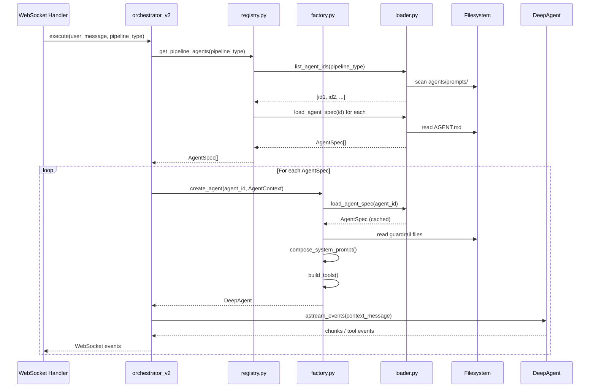

# Design Document: Folder-Per-Agent Architecture

## Overview

This design refactors the IdeaFlowAI backend agent system from 85 agent prompts hardcoded as Python string literals across 6 files into a folder-per-agent architecture. The goal is to make every agent a self-contained, file-system-resident artifact that can be read, edited, and reviewed without touching Python source code.

The key architectural shift is:

- **Before**: `AgentDefinition` dataclasses in `registry.py` carry both metadata and the full prompt string. Six Python files (`registry.py`, `app_builder_sdlc.py`, `migration_pipelines.py`, `ppt_pipeline.py`, `custom_agents.py`, `od_runner.py`) own agent definitions.
- **After**: Each agent lives in `agents/prompts/{id}/AGENT.md` with YAML frontmatter for metadata and a markdown body for the prompt. A `Loader` reads files, a `Factory` composes prompts, and a slim `Registry` holds only pipeline-to-ID mappings.

The Python orchestrator remains the deterministic sequencer — it reads `PIPELINE_AGENTS[pipeline_type]` to get an ordered list of IDs and calls `create_agent()` for each. The LLM never decides which agent runs next.

### Design Decisions

**Why YAML frontmatter in markdown?** YAML frontmatter is the de-facto standard for metadata in markdown files (used by Jekyll, Hugo, Obsidian, and GitHub). It keeps metadata and prompt body in one file, is human-readable, and is parseable by the standard `python-frontmatter` library without custom parsers.

**Why keep DeepAgent as the universal executor?** DeepAgent already handles both text-only (tools=[]) and tool-using agents. Text-only agents complete in one LLM call — the same cost as BaseAgent. Unifying on DeepAgent removes the BaseAgent/DeepAgent branching logic from the orchestrator.

**Why a slim registry instead of auto-discovery?** Pipeline ordering is deterministic and intentional — the orchestrator must know which agents run and in what order. A registry that maps pipeline types to ordered ID lists makes this explicit and auditable. Auto-discovery from the filesystem would make ordering implicit and fragile.

## Architecture

### Directory Layout

```
backend/
├── agents/
│   ├── prompts/                        # One folder per agent
│   │   ├── domain-analyst/
│   │   │   └── AGENT.md
│   │   ├── epic-architect/
│   │   │   └── AGENT.md
│   │   ├── ... (85 agents total)
│   ├── guardrails/                     # Shared rule sets
│   │   ├── agile.md
│   │   ├── typescript.md
│   │   ├── react.md
│   │   ├── accessibility.md
│   │   ├── html-prototype.md
│   │   ├── openapi.md
│   │   ├── java-spring.md
│   │   ├── mulesoft.md
│   │   └── dotnet.md
│   ├── loader.py                       # Reads + parses AGENT.md files
│   ├── factory.py                      # create_agent() entry point
│   └── registry.py                     # Slim: pipeline-to-ID maps only
├── app/
│   └── agents/
│       ├── deep_agent.py               # Unchanged
│       ├── orchestrator_v2.py          # Updated to use factory
│       ├── skills.py                   # Unchanged
│       ├── tools/                      # Unchanged
│       │   ├── workspace.py
│       │   └── prototype.py
│       └── od_runner.py                # Retained (non-prompt logic)
└── CLAUDE.md                           # Architecture guide
```

### Module Responsibilities

| Module | Responsibility |
|--------|---------------|
| `agents/loader.py` | Read `AGENT.md` files from disk, parse YAML frontmatter, validate fields, cache results, expose `load_agent_spec()` and `list_agent_ids()` |
| `agents/factory.py` | Compose system prompts (guardrails + skills + hooks + body), build tool lists, instantiate `DeepAgent`, expose `create_agent()` and `AgentContext` |
| `agents/registry.py` | Hold `PIPELINE_AGENTS`, `PIPELINE_CONTEXT_MAPS`, `SUPPORTED_PIPELINE_TYPES`, `REVISION_BASE_MAP`; expose `get_pipeline_agents()` |
| `app/agents/orchestrator_v2.py` | Deterministic pipeline sequencer; reads registry for agent order; calls `create_agent()` per agent; streams WebSocket events |
| `agents/guardrails/*.md` | Terse, prompt-injectable rule sets; injected verbatim by the factory |
| `agents/prompts/{id}/AGENT.md` | Single source of truth for each agent's identity, metadata, and prompt body |

### Data Flow



## Components and Interfaces

### AGENT.md File Format

Every agent is defined by a single markdown file with YAML frontmatter:

```markdown
---
id: domain-analyst
name: Domain Discovery Agent
role: Market & Persona Research
pipeline_type: user_stories
order: 1
max_tokens: 4000
tools: []
guardrails: []
context_from: []
icon: "🔍"
estimated_duration: 5.0
---

You are a Senior Product Strategist. Analyze the user's product idea thoroughly.

## Domain Analysis
...
```

**Required fields:**

| Field | Type | Constraint |
|-------|------|-----------|
| `id` | string | kebab-case, non-empty, must match directory name |
| `name` | string | non-empty |
| `role` | string | non-empty |
| `pipeline_type` | string | one of the supported pipeline type values |
| `order` | integer | positive integer, unique within pipeline_type |
| `max_tokens` | integer | 1–32768 inclusive |

**Optional fields with defaults:**

| Field | Type | Default | Purpose |
|-------|------|---------|---------|
| `tools` | list[str] | `[]` | Tool sets to bind: `"workspace"`, `"prototype"` |
| `guardrails` | list[str] | `[]` | Guardrail file names to inject |
| `context_from` | list[str] | `[]` | Prior-agent output routing: `[]`, `["$previous"]`, or explicit IDs |
| `icon` | string | `"🤖"` | Emoji icon for UI display |
| `estimated_duration` | float | `3.0` | Estimated seconds for UI progress display |

### Loader (`agents/loader.py`)

```python
from dataclasses import dataclass, field
from typing import Optional

@dataclass
class AgentSpec:
    # Required
    id: str
    name: str
    role: str
    pipeline_type: str
    order: int
    max_tokens: int
    prompt_body: str
    # Optional with defaults
    tools: list[str] = field(default_factory=list)
    guardrails: list[str] = field(default_factory=list)
    context_from: list[str] = field(default_factory=list)
    icon: str = "🤖"
    estimated_duration: float = 3.0

class AgentSpecError(Exception):
    """Raised when an AGENT.md file has invalid or missing fields."""
    pass

def load_agent_spec(agent_id: str) -> AgentSpec:
    """Read agents/prompts/{agent_id}/AGENT.md and return a parsed AgentSpec.

    Raises:
        FileNotFoundError: if the directory or AGENT.md does not exist.
        PermissionError: if the file cannot be read.
        AgentSpecError: if a required field is missing or invalid.
    """
    ...

def list_agent_ids(pipeline_type: str) -> list[str]:
    """Return all agent IDs for the given pipeline_type, sorted by order ascending.

    Returns an empty list if no agents match.
    """
    ...
```

**Caching strategy**: The loader maintains a module-level `_SPEC_CACHE: dict[str, AgentSpec]` dictionary. On first call for a given `agent_id`, the file is read and parsed; subsequent calls return the cached instance. The cache is never invalidated during a process lifetime (agents are static configuration, not runtime data).

**Validation rules** enforced by the loader:
- All required fields must be present and non-empty (non-zero for integers).
- `max_tokens` must be in range 1–32768.
- `order` must be a positive integer.
- `pipeline_type` must be one of the values in `SUPPORTED_PIPELINE_TYPES`.
- Within a pipeline_type, `order` values must be unique (checked lazily when `list_agent_ids` is called).
- The prompt body (text after the closing `---`) must contain at least one non-whitespace character.

### Factory (`agents/factory.py`)

```python
from dataclasses import dataclass, field
from app.agents.deep_agent import DeepAgent
from app.agents.tools.workspace import AgentWorkspace

@dataclass
class AgentContext:
    user_request: str
    agent_outputs: dict[str, str] = field(default_factory=dict)
    attached_skills: list[dict] = field(default_factory=list)
    attached_hooks: list[dict] = field(default_factory=list)
    workspace: AgentWorkspace | None = None

def create_agent(agent_id: str, ctx: AgentContext) -> DeepAgent:
    """Instantiate a DeepAgent for the given agent ID and context.

    Raises:
        FileNotFoundError: propagated from loader if agent_id is unknown.
        AgentSpecError: propagated from loader if AGENT.md is malformed.
        ValueError: if spec.tools contains an unrecognized tool name.
    """
    ...
```

**System prompt composition order** (implemented in `_compose_system_prompt`):

1. For each name in `spec.guardrails` (in order):
   - Read `agents/guardrails/{name}.md`
   - Prepend `## Guardrail: {name}\n\n`
   - If file missing: log warning, use empty string
2. For each skill dict in `ctx.attached_skills` (in order):
   - Extract `content` key
3. For each hook dict in `ctx.attached_hooks` (in order):
   - Extract `content` key
4. Append `spec.prompt_body`

All blocks are joined with `\n\n` separators.

**Tool set resolution** (implemented in `_build_tools`):

| `spec.tools` value | Tools passed to DeepAgent |
|-------------------|--------------------------|
| `[]` | `[]` (one LLM call, no loop) |
| `["workspace"]` | `write_file`, `read_file`, `list_workspace_files` |
| `["prototype"]` | `read_template_seed`, `read_layout_reference`, `read_checklist`, `todo_write`, `emit_artifact` |
| `["workspace", "prototype"]` | union of both sets |
| any other string | raises `ValueError` |

### Slim Registry (`agents/registry.py`)

```python
from agents.loader import load_agent_spec, list_agent_ids, AgentSpec

SUPPORTED_PIPELINE_TYPES: frozenset[str] = frozenset({
    "user_stories", "ppt", "ppt_revision", "prototype", "prototype_revision",
    "app_builder", "app_builder_revision", "mulesoft_to_springboot",
    "dotnet_to_azure", "reverse_engineer", "custom",
})

PIPELINE_AGENTS: dict[str, list[str]] = {
    "user_stories": [
        "domain-analyst", "epic-architect", "story-estimator",
        "nfr-specialist", "backlog-reviewer", "backlog-compiler",
    ],
    "ppt": ["ppt-content-strategist", "ppt-slide-architect",
            "ppt-code-generator", "ppt-assembler"],
    # ... all other pipelines
}

PIPELINE_CONTEXT_MAPS: dict[str, dict[str, list[str]]] = {
    "app_builder": {
        "material-analyzer": [],
        "app-user-stories": ["material-analyzer"],
        # ... full app_builder routing map (preserved from orchestrator_v2)
    }
}

REVISION_BASE_MAP: dict[str, str] = {
    "ppt_revision": "ppt",
    "user_stories_revision": "user_stories",
    "prototype_revision": "prototype",
    "app_builder_revision": "app_builder",
}

def get_pipeline_agents(pipeline_type: str) -> list[AgentSpec]:
    """Return AgentSpec objects for the pipeline, sorted by ascending order.

    Returns empty list for unknown pipeline types.
    Propagates FileNotFoundError or AgentSpecError from the loader.
    """
    if pipeline_type not in SUPPORTED_PIPELINE_TYPES:
        return []
    ids = list_agent_ids(pipeline_type)
    specs = [load_agent_spec(aid) for aid in ids]
    return sorted(specs, key=lambda s: s.order)
```

The registry contains **no** `AgentDefinition` instances, no prompt strings, and no `DEEP_AGENT_CONFIG` dictionaries.

### Updated Orchestrator (`app/agents/orchestrator_v2.py`)

The orchestrator's `execute()` loop is updated to:

1. Call `get_pipeline_agents(pipeline_type)` to get `list[AgentSpec]` (replaces `get_pipeline_agents` returning `list[AgentDefinition]`).
2. For each `AgentSpec`, build an `AgentContext` by reading `spec.context_from` to determine which prior outputs to include.
3. Call `create_agent(spec.id, ctx)` to get a `DeepAgent`.
4. Stream events from `agent.astream_events(context_message)`.

**Context routing logic** (moved from `_build_agent_context` to the orchestrator's loop, driven by `spec.context_from`):

| `spec.context_from` | `AgentContext.agent_outputs` |
|--------------------|------------------------------|
| `[]` | `{}` |
| `["$previous"]` and agent is first | `{}` |
| `["$previous"]` and agent is not first | `{prev_agent_id: prev_output}` |
| `["agent-a", "agent-b"]` | `{"agent-a": output_a, "agent-b": output_b}` (silently omits IDs with no output yet) |

The orchestrator no longer contains skill injection, hook injection, or guardrail injection code — those responsibilities move entirely to `factory._compose_system_prompt`.

All existing WebSocket event types are preserved with their required fields unchanged.

## Data Models

### AgentSpec

The central data model produced by the loader and consumed by the factory and registry.

```python
@dataclass
class AgentSpec:
    # ── Required ──────────────────────────────────────────────────────────
    id: str                    # kebab-case, matches directory name
    name: str                  # Human-readable display name
    role: str                  # Short role description for UI
    pipeline_type: str         # One of SUPPORTED_PIPELINE_TYPES
    order: int                 # Execution order within pipeline (ascending)
    max_tokens: int            # Output token limit (1–32768)
    prompt_body: str           # Raw markdown text after YAML closing ---

    # ── Optional with defaults ────────────────────────────────────────────
    tools: list[str] = field(default_factory=list)
    guardrails: list[str] = field(default_factory=list)
    context_from: list[str] = field(default_factory=list)
    icon: str = "🤖"
    estimated_duration: float = 3.0
```

`AgentSpec` is immutable after construction (the loader caches instances and never mutates them). It is a pure data container — no methods, no business logic.

### AgentContext

The input to `create_agent()`, carrying all runtime context needed to compose the system prompt.

```python
@dataclass
class AgentContext:
    user_request: str                          # Original user message
    agent_outputs: dict[str, str]              # Prior agent outputs keyed by agent ID
    attached_skills: list[dict]                # UI-attached skills: [{name, content, source}]
    attached_hooks: list[dict]                 # UI-attached hooks: [{name, event, content}]
    workspace: AgentWorkspace | None = None    # Shared workspace for tool-using agents
```

`AgentContext` is constructed fresh for each agent invocation by the orchestrator. The `agent_outputs` dict is populated according to `spec.context_from` — it is never the full accumulated outputs dict; it is always a filtered view.

### WorkflowState (unchanged)

`WorkflowState` in `orchestrator_v2.py` is unchanged in structure. The only behavioral change is that `agent_outputs` is now populated by the factory's context routing rather than `_build_agent_context`.

### Guardrail File

A guardrail is a plain markdown file at `agents/guardrails/{name}.md`. No frontmatter, no fenced code blocks. Fewer than 60 lines. Example:

```markdown
## Agile Guardrail

- Write user stories in "As a / I want / So that" format.
- Every story must have at least two Given/When/Then acceptance criteria.
- Prioritize stories as P0 (must-have), P1 (should-have), or P2 (nice-to-have).
- Stories must be estimable in Fibonacci story points (1, 2, 3, 5, 8, 13).
- Do not include implementation details in acceptance criteria.
```

### Migration Mapping

The following Python source files are deleted after migration:

| File | Destination |
|------|-------------|
| `app/agents/app_builder_sdlc.py` | Prompts → individual `AGENT.md` files |
| `app/agents/ppt_pipeline.py` | Prompts → individual `AGENT.md` files |
| `app/agents/custom_agents.py` | Prompts → individual `AGENT.md` files |
| `app/agents/migration_pipelines.py` | Prompts → individual `AGENT.md` files |

`od_runner.py` is retained — it contains non-prompt logic (template loading, artifact store wiring, design system injection) that is not migrated.

The `AgentDefinition` dataclass in `registry.py` is deleted. The `get_pipeline_agents` function signature changes from returning `list[AgentDefinition]` to `list[AgentSpec]`. All call sites in `orchestrator_v2.py` are updated accordingly.

## Correctness Properties

*A property is a characteristic or behavior that should hold true across all valid executions of a system — essentially, a formal statement about what the system should do. Properties serve as the bridge between human-readable specifications and machine-verifiable correctness guarantees.*

### Property 1: AgentSpec round-trip

*For any* valid `AgentSpec` (with all required fields set to conforming values and any combination of optional fields), serializing it to an `AGENT.md` file and parsing it back with `load_agent_spec` SHALL produce an `AgentSpec` whose required fields (`id`, `name`, `role`, `pipeline_type`, `order`, `max_tokens`, `prompt_body`) are equal to the originals, and whose optional fields match the originals or their defaults when omitted.

**Validates: Requirements 1.1, 1.2, 2.1, 2.5, 2.8**

---

### Property 2: Invalid AGENT.md always raises AgentSpecError

*For any* `AGENT.md` file that is missing at least one required field, or where a required field contains an invalid value (empty string for `id` or `name`, non-integer for `order`, `max_tokens` outside 1–32768, unrecognized `pipeline_type`), calling `load_agent_spec` SHALL raise an `AgentSpecError` whose message includes the file path and the name of the invalid or missing field.

**Validates: Requirements 1.10, 9.8**

---

### Property 3: Duplicate order within pipeline raises AgentSpecError

*For any* set of `AGENT.md` files belonging to the same `pipeline_type` where two or more files share the same `order` value, calling `list_agent_ids` for that `pipeline_type` SHALL raise an `AgentSpecError` that identifies both conflicting agent IDs and the shared `order` value.

**Validates: Requirements 1.11**

---

### Property 4: list_agent_ids always returns strictly ascending order

*For any* `pipeline_type` with one or more valid agents, `list_agent_ids(pipeline_type)` SHALL return a list of agent IDs such that, when each ID is resolved to its `AgentSpec.order`, the sequence is strictly ascending with no duplicate values.

**Validates: Requirements 2.2, 5.6, 9.3**

---

### Property 5: context_from routing produces exactly the right agent_outputs keys

*For any* pipeline execution and any agent at any position, the `AgentContext.agent_outputs` dict passed to `create_agent` SHALL contain exactly the keys specified by `spec.context_from`: an empty dict when `context_from` is `[]`; a dict with exactly one key (the immediately preceding agent's ID) when `context_from` is `["$previous"]` and the agent is not first; and a dict containing exactly the explicitly named agent IDs (that have outputs available) when `context_from` contains explicit IDs.

**Validates: Requirements 6.2, 6.3, 6.4, 6.5, 9.5**

---

### Property 6: System prompt composition preserves order

*For any* agent with a non-empty `guardrails` list, non-empty `attached_skills`, non-empty `attached_hooks`, and a non-empty `prompt_body`, the composed `system_prompt` string SHALL contain the guardrail content blocks before the skill content blocks, the skill content blocks before the hook content blocks, and the hook content blocks before the `prompt_body` — and each guardrail block SHALL be preceded by a `## Guardrail: {name}` heading.

**Validates: Requirements 3.2, 3.5, 4.3**

---

### Property 7: Guardrail content appears verbatim in system prompt

*For any* agent that declares one or more guardrails, the full text content of each referenced `agents/guardrails/{name}.md` file SHALL appear verbatim (without modification) in the agent's composed `system_prompt`.

**Validates: Requirements 3.2, 9.4**

---

### Property 8: All guardrail files satisfy structural constraints

*For all* nine guardrail files (`agile.md`, `typescript.md`, `react.md`, `accessibility.md`, `html-prototype.md`, `openapi.md`, `java-spring.md`, `mulesoft.md`, `dotnet.md`), each file SHALL have fewer than 60 lines, contain no fenced code blocks (no ` ``` ` delimiters), and contain no YAML frontmatter (no leading `---` block).

**Validates: Requirements 3.4**

---

### Property 9: All AGENT.md files produce valid AgentSpec with matching id

*For all* agent IDs discoverable by scanning `agents/prompts/`, `load_agent_spec(id)` SHALL return an `AgentSpec` with no missing required fields, and `AgentSpec.id` SHALL equal the directory name used to look it up.

**Validates: Requirements 2.8, 9.1**

---

### Property 10: WebSocket events are complete and well-formed for any pipeline run

*For any* pipeline execution with a mocked LLM that returns a non-empty string for every invocation, the sequence of WebSocket events emitted by the orchestrator SHALL include at least one `pipeline_start` event (with `data.pipeline_type`), one `agent_start` event per agent (with `data.agent_id` and `data.agent_name`), one `agent_complete` event per agent (with `data.agent_id` and `data.output`), and one `pipeline_complete` event (with `data.final_output`).

**Validates: Requirements 6.7, 9.6**

---

**Property Reflection:**

Properties 1 and 9 both test that `load_agent_spec` returns a valid `AgentSpec`. They are not redundant: Property 1 is a round-trip test (serialize then parse), while Property 9 is a forward-only test against the actual files on disk. Both are retained.

Properties 4 and 5 both involve ordering/routing. They are not redundant: Property 4 tests the loader's sort behavior, while Property 5 tests the orchestrator's context routing logic. Both are retained.

Properties 6 and 7 both involve guardrail injection. They are not redundant: Property 6 tests ordering (guardrails before skills before hooks before body), while Property 7 tests verbatim content preservation. Both are retained.

## Error Handling

### Loader Errors

| Condition | Exception | Message includes |
|-----------|-----------|-----------------|
| `agents/prompts/{id}/` directory missing | `FileNotFoundError` | Expected file path |
| `AGENT.md` file missing | `FileNotFoundError` | Expected file path |
| File exists but unreadable (permissions) | `PermissionError` | Expected file path |
| Required field missing from frontmatter | `AgentSpecError` | Field name, expected type, file path |
| Required field has invalid value | `AgentSpecError` | Field name, constraint violated, file path |
| Prompt body is empty or whitespace-only | `AgentSpecError` | "prompt body", file path |
| Duplicate `order` within pipeline_type | `AgentSpecError` | Both conflicting agent IDs, shared order value |

### Factory Errors

| Condition | Exception | Behavior |
|-----------|-----------|---------|
| Unknown `agent_id` | `FileNotFoundError` | Propagated from loader, not swallowed |
| Malformed `AGENT.md` | `AgentSpecError` | Propagated from loader, not swallowed |
| Unrecognized tool name in `spec.tools` | `ValueError` | Raised by factory, includes tool name and agent ID |
| Guardrail file missing | `None` (warning logged) | Empty string used; agent still runs |

### Orchestrator Error Handling

The orchestrator's existing retry logic for transient Bedrock errors is preserved unchanged:

- `ThrottlingException`, `ModelTimeoutException`, `ServiceUnavailableException`, `InternalServerException`, `TooManyRequestsException`, `RemoteProtocolError`, `ReadTimeout` → retry up to 2 times with backoff
- All other exceptions → emit `agent_error` WebSocket event and halt the pipeline

When `create_agent()` raises `FileNotFoundError` or `AgentSpecError` (configuration errors, not transient), the orchestrator treats these as non-retryable and immediately emits `agent_error` and halts.

### Guardrail Missing File

When a guardrail name referenced in `spec.guardrails` has no corresponding file in `agents/guardrails/`, the factory:
1. Logs a warning: `"Guardrail file not found: agents/guardrails/{name}.md — skipping"`
2. Uses an empty string for that guardrail's content block
3. Continues composing the system prompt with the remaining guardrails and prompt body

This ensures a missing guardrail file never prevents an agent from running.

## Testing Strategy

### Overview

This feature is well-suited for property-based testing. The loader, factory, and registry are pure functions over structured data (AGENT.md files, AgentSpec objects, AgentContext objects). The input space is large (85 agents, 11 pipeline types, arbitrary combinations of optional fields), and many correctness properties hold universally across all valid inputs.

The testing strategy uses a dual approach:
- **Property-based tests** (using [Hypothesis](https://hypothesis.readthedocs.io/)) for universal properties that should hold across all valid inputs
- **Example-based unit tests** for specific behaviors, edge cases, and error conditions
- **Integration tests** for end-to-end pipeline execution with mocked LLM

### Property-Based Tests

Each property test uses Hypothesis with a minimum of 100 iterations. Tests are tagged with the design property they validate.

**Library**: `hypothesis` (Python)

**Tag format**: `# Feature: folder-per-agent-architecture, Property {N}: {property_text}`

**Property 1 — AgentSpec round-trip**
Generate random valid `AgentSpec` instances using Hypothesis strategies. Serialize to a temp `AGENT.md`, parse back with `load_agent_spec`, assert all fields match.
```python
# Feature: folder-per-agent-architecture, Property 1: AgentSpec round-trip
@given(valid_agent_spec())
@settings(max_examples=100)
def test_agent_spec_round_trip(spec: AgentSpec): ...
```

**Property 2 — Invalid AGENT.md raises AgentSpecError**
Generate `AGENT.md` content with each required field missing or invalid. Assert `AgentSpecError` is raised with the field name and file path in the message.
```python
# Feature: folder-per-agent-architecture, Property 2: Invalid AGENT.md raises AgentSpecError
@given(invalid_agent_md())
@settings(max_examples=100)
def test_invalid_agent_md_raises_spec_error(md_content: str, missing_field: str): ...
```

**Property 3 — Duplicate order raises AgentSpecError**
Generate sets of agents for a pipeline where two share the same `order`. Assert `AgentSpecError` is raised.

**Property 4 — list_agent_ids returns strictly ascending order**
For each pipeline type, call `list_agent_ids`, resolve each ID to its `AgentSpec.order`, assert the sequence is strictly ascending.

**Property 5 — context_from routing produces correct agent_outputs keys**
Generate pipeline states with varying `context_from` configurations. Assert `AgentContext.agent_outputs` contains exactly the right keys.

**Property 6 — System prompt composition preserves order**
Generate agents with random combinations of guardrails, skills, hooks, and body. Assert the composed prompt contains them in the correct order.

**Property 7 — Guardrail content appears verbatim**
For each agent that declares guardrails, assert the guardrail file content appears verbatim in the composed system prompt.

**Property 8 — Guardrail files satisfy structural constraints**
For all nine guardrail files, assert line count < 60, no fenced code blocks, no YAML frontmatter.

**Property 9 — All AGENT.md files produce valid AgentSpec with matching id**
Scan `agents/prompts/`, call `load_agent_spec` for each, assert no missing required fields and `spec.id == directory_name`.

**Property 10 — WebSocket events are complete for any pipeline run**
Run each pipeline type with a mocked LLM. Assert all required event types are emitted with required fields.

### Example-Based Unit Tests

Focused on specific behaviors and edge cases not covered by property tests:

- `load_agent_spec` with non-existent agent ID → `FileNotFoundError` with path in message
- `load_agent_spec` with unreadable file → `PermissionError` with path in message
- `load_agent_spec` called twice for same ID → second call returns cached instance (mock file I/O)
- `list_agent_ids` with unknown pipeline type → returns `[]`
- `create_agent` with `tools: []` → `DeepAgent` has empty tools list
- `create_agent` with `tools: ["workspace"]` → `DeepAgent` has workspace tools only
- `create_agent` with `tools: ["prototype"]` → `DeepAgent` has prototype tools only
- `create_agent` with `tools: ["workspace", "prototype"]` → `DeepAgent` has both tool sets
- `create_agent` with unknown tool name → `ValueError` with tool name and agent ID
- `create_agent` with unknown agent ID → `FileNotFoundError` propagated
- `get_pipeline_agents` with unsupported pipeline type → returns `[]`
- Missing guardrail file → warning logged, agent still runs with empty guardrail block
- `context_from: []` → `agent_outputs == {}`
- `context_from: ["$previous"]` on first agent → `agent_outputs == {}`
- `context_from: ["$previous"]` on non-first agent → `agent_outputs` has exactly one key
- Orchestrator retry on `ThrottlingException` → retries up to 2 times

### Integration Tests

- **End-to-end `user_stories` pipeline** with mocked LLM: fire all 6 agents in order, assert `len(WorkflowState.agent_outputs) == 6` after completion.
- **Factory error halts pipeline**: mock `create_agent` to raise for one agent, assert `agent_error` event is emitted and pipeline halts.
- **Factory smoke test**: for the first agent (by `order`) of each pipeline type, call `create_agent` and assert the returned `DeepAgent` has a non-empty `system_prompt`.

### Diff Tests (Migration Verification)

For each migrated agent, a diff test confirms the `AGENT.md` prompt body is semantically equivalent to the original Python string literal:
- No instruction sentences dropped
- No role descriptions altered
- No output format rules removed
- No constraint clauses changed

These tests compare the normalized text (stripping leading/trailing whitespace, collapsing multiple blank lines) of the original Python string against the parsed `AgentSpec.prompt_body`.

### Test File Layout

```
backend/
└── tests/
    └── agents/
        ├── test_loader.py          # Unit + property tests for loader
        ├── test_factory.py         # Unit + property tests for factory
        ├── test_registry.py        # Unit tests for slim registry
        ├── test_guardrails.py      # Property tests for guardrail files
        ├── test_orchestrator.py    # Integration tests for orchestrator
        ├── test_migration_diff.py  # Diff tests for migrated prompts
        └── conftest.py             # Shared fixtures (temp AGENT.md, mock LLM)
```
