# Velocity — Architecture

> Base architecture and module map. The per-module detail lives in
> `.knowledge/architecture/MOD-*.md`; the machine-readable graph lives in
> `.knowledge/architecture/modules.json`.

## What Velocity is

Velocity (internally **Flowin**) is a **workflow-agnostic agent execution runtime**.

A workflow is described by a declarative, file-backed **manifest**. A thin
compiler — no DSL — turns that manifest into a typed `CompiledWorkflow` /
`ExecutionPlan`. A small **kernel** executes the plan. The kernel knows no
workflow by name: there is no `if pipeline_type == "prototype"` anywhere in it.

Everything that makes a workflow powerful is a **registered capability** that a
manifest opts into by declaration — execution strategies, validators,
deliverable resolvers, context providers, gates, merge strategies, task
parsers, worker agents, runtimes, skills, hooks, tools, MCP servers,
integrations.

### The load-bearing invariant

**A brand-new custom workflow can replicate the built-in `prototype` workflow
using a manifest and an `AGENT.md` alone — with zero engine edits.**

This is SC-001. If everything else is negotiable, this is not. It is what
"workflow-agnostic" actually means here, and it is proven by an executable test
rather than asserted.

### Design seams

- **Manifest -> compiler -> plan -> kernel.** The compiler validates every
  declared capability reference and rejects unknown names at compile time, not
  at run time.
- **`CapabilityRegistry`.** A central name-seam. Capabilities are resolved by
  `(kind, name)` and sit behind Protocol ports, so an implementation can be
  swapped without touching a caller.
- **`Workspace` / `RuntimeEnvironment` ports.** Only a local implementation
  exists today. ECS/containers are designed-for as a backend swap, deliberately
  not built. An import-linter contract locks this seam shut.
- **Durable state, agent-agnostic resume.** The kernel — never an agent —
  reads durable state, computes what remains, re-materializes completed work to
  disk, and continues. This holds across process restart, crash, sandbox loss,
  a paused gate, or a user-failed run, at task/worker granularity, including
  when the task list was edited in between.
- **Additive migrations only.** The persistence schema grows; it does not
  rewrite.
- **`deepagents` is mandatory.** The real LangChain library, always. A
  hand-rolled or vendored deep-agent runtime is banned and enforced by a
  banned-pattern CI gate.

### Shape

```
        manifest (file)                    frontend (Next.js)
              |                                    |
              v                                    | SSE / WebSocket
      WorkflowCompiler  --no DSL-->                v
              |                            FastAPI  (backend/app/api)
              v                                    |
       CompiledWorkflow / ExecutionPlan            |
              |                                    v
              v                             backend/app/models
        Kernel (backend/agents)  <---------  durable run state
              |                              run_events, artifact_refs,
              |  resolve(kind, name)         gate_events, subagent_runs, ...
              v
       CapabilityRegistry
        strategies · validators · deliverables
        context providers · gates · merge
        runtimes · hooks · tools · MCP
              |
              v
       Workspace / RuntimeEnvironment  (local only today; ECS is a swap)
```

## Domains

A **domain** is a system concern, declared by hand. A **module** is a folder,
derived by script. They are different questions and both are kept: a module
answers "what is in `backend/agents`", which no one has to maintain because
pydeps computes it; a domain answers "how does the execution kernel work",
which nothing can compute.

Domains overlap on purpose — `run_event.py` is in durable-state *and*
run-streaming — so they are a cover over the tree, not a partition of it. Each
card declares its `members:` as globs; membership, the file rollup and the
staleness signature are all resolved from that. A domain whose member files
change gets flagged the moment its `code_signature` moves away from the
`prose_signature` its prose was written against.

The diagrams below are lifted from the domain cards, never written twice.

<!-- DOMAIN-DIAGRAMS -->

### [Agent runtime — model selection and the deepagents adapter](architecture/DOMAIN-agent-runtime.md)

This domain answers one question for every LLM call the system makes: *which model, built how, and what happens when the provider says no.* It owns the model list itself (`ModelEntry` / `ModelCatalog`), the per-agent precedence that picks an id (`ModelResolver`), the single constructor that turns an id into a live chat client (`build_model`), the deepagents graph that client is handed to (`DeepAgentRunner`), the cheap non-agent path for one-shot calls (`cached_invoke`), the classifier that decides whether a provider failure is worth another attempt (`_is_transient_throttle`), the mapping from a provider exception to something a user can read (`map_exception`), and the cost arithmetic derived from the same catalog (`estimate_cost_usd`).

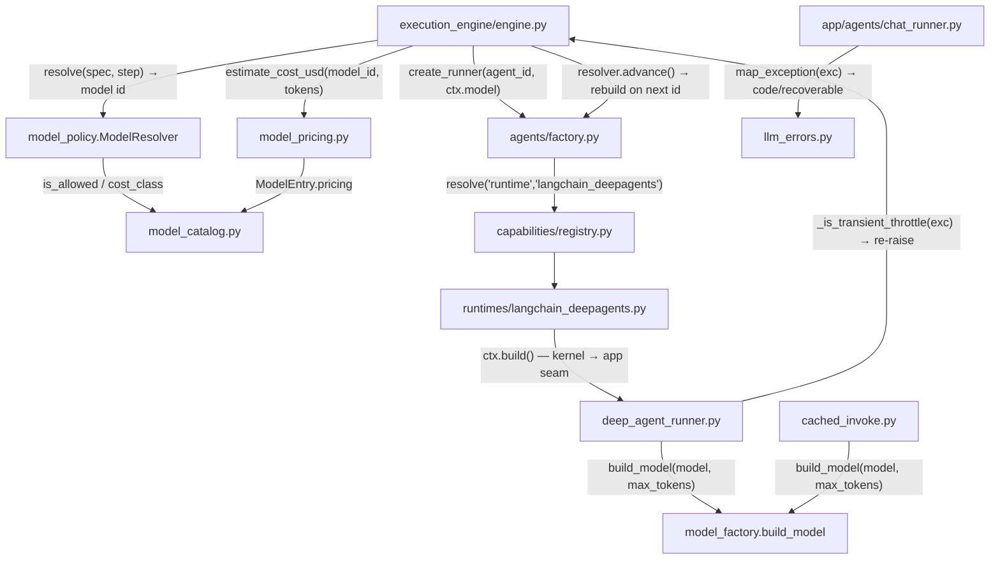

### [Auth and entitlements — who may run what](architecture/DOMAIN-auth-and-entitlements.md)

This domain answers three questions that the rest of the system is not allowed to answer for itself: *who is calling* (a JWT or a long-lived API key resolved to a `User` row), *what plan are they on* (`users.tier`, checked against `TIER_PIPELINES` before a run is launched), and *which rows may they see* (`owner_id` + `workspace_id`, enforced on every durable read by `ScopedStore`).

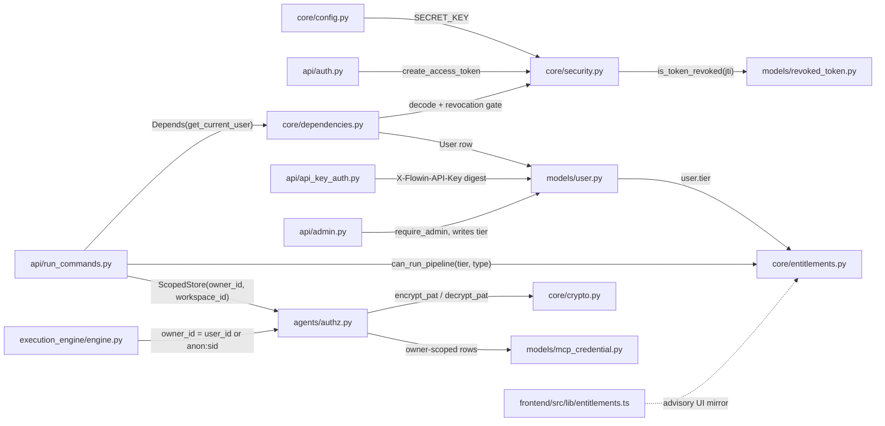

### [Capability registry — the (kind, name) seam](architecture/DOMAIN-capability-registry.md)

This domain owns the **name seam**: the single `(kind, name)` namespace through which every declared capability in the system is validated, trust-checked, described and finally resolved to a live object.

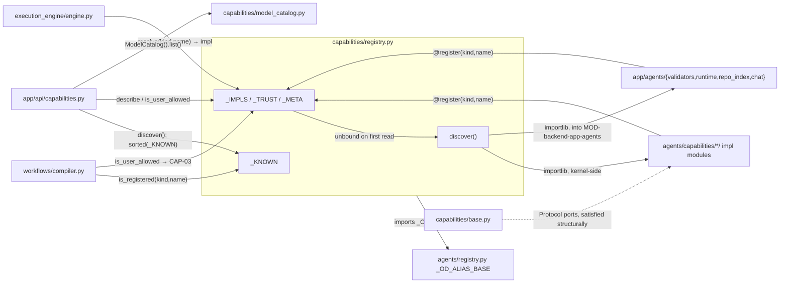

### [Chat and handoff — the conversational surfaces](architecture/DOMAIN-chat-and-handoff.md)

This domain owns every place a human talks to Velocity in prose rather than by starting a workflow — and, crucially, owns the rule that prose is never allowed to become an action on its own.

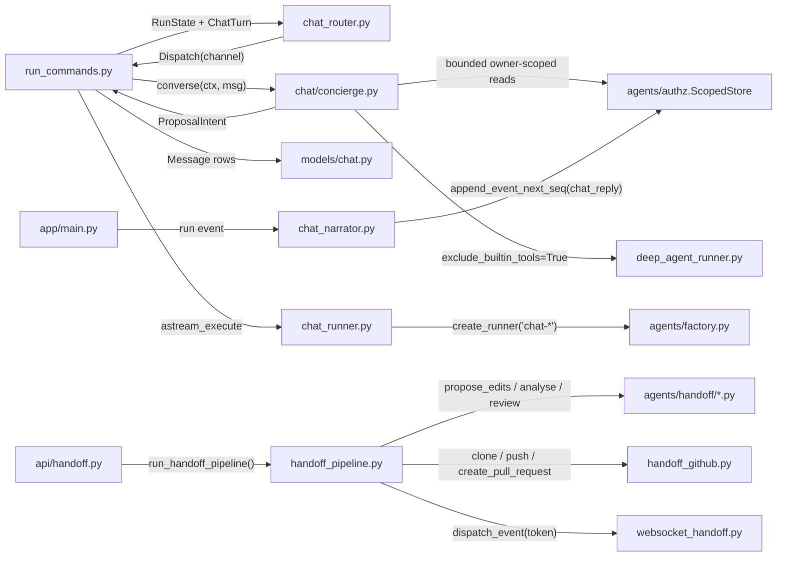

### [Context assembly — what an agent is told](architecture/DOMAIN-context-assembly.md)

This domain owns the answer to one question: **when the kernel is about to invoke an agent, what text does that agent actually see?** It covers both halves of that text — the system prompt (identity, guardrails, skills, hooks, constitution, body) and the per-dispatch context message (the user brief, upstream outputs, design-system and template blocks, uploaded documents, chat history, revision subjects, steering notes) — plus the transforms that keep either half from outgrowing the model's window.

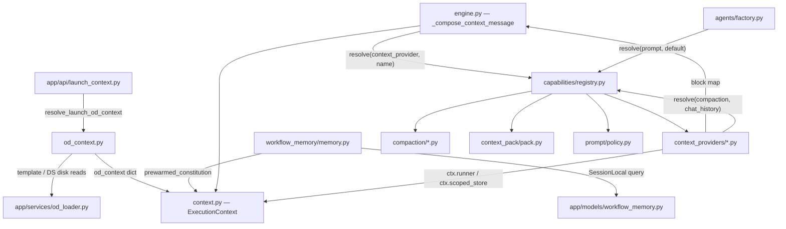

### [Deliverables and artifacts — turning output into a result](architecture/DOMAIN-deliverables-and-artifacts.md)

This domain owns the answer to "what did the run actually produce, and how do I get it back later." It has three jobs that share one contract.

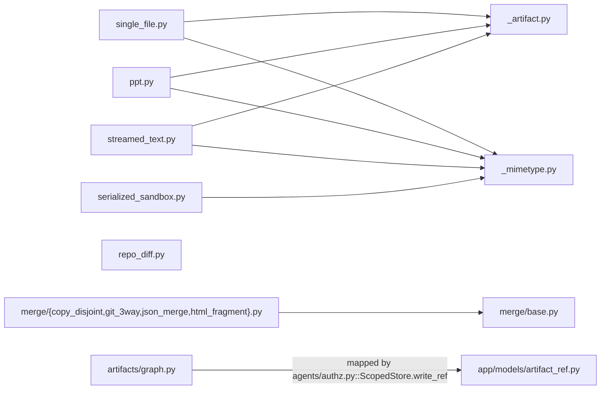

### [Durable state and resume — surviving restart and crash](architecture/DOMAIN-durable-state-resume.md)

This domain owns the answer to one question: **after the process dies, what does the next process know?** It is the durable substrate a run is reconstructed from — the append-only event log (run_event.py), the per-child and per-wave progress rows (subagent_run.py, wave_run.py), the per-run capability snapshot (run_capabilities.py), the exec audit trail (exec_runs.py) — plus the SQLAlchemy engine/session/`Base` those tables hang off (database.py).

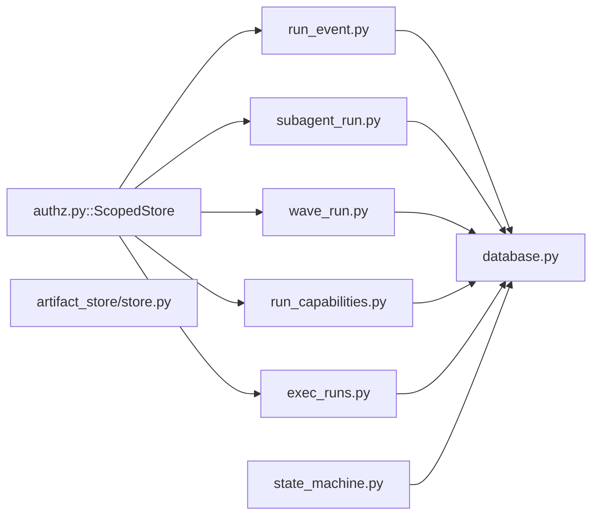

### [Execution kernel — running a compiled plan](architecture/DOMAIN-execution-kernel.md)

This domain is the thing that actually *runs* a workflow.

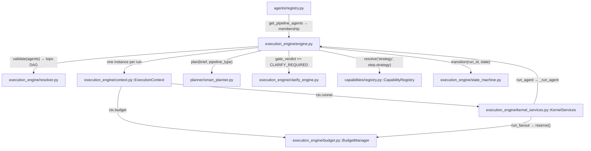

### [Execution strategies — how a step is driven](architecture/DOMAIN-execution-strategies.md)

This domain owns the answer to one question: **given a compiled step, how is its work actually driven?** Five strategies answer it five ways — run the agent once (`single_shot`), split a plan into tasks and run one isolated sub-agent per task against a cumulative file (`task_loop`), fan a task list out to parallel workers in one batch (`fanout_batch`), partition a dependency-carrying task list into topological waves and fan each wave out in turn (`wave_scheduler`), or run already- distinct sibling sub-agents concurrently then run the parent over their results (`parallel_group`).

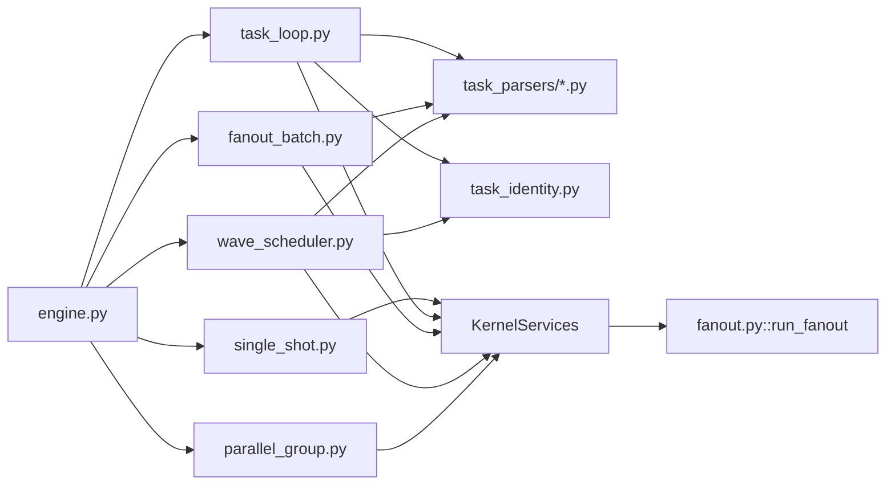

### [Human-in-the-loop gating — pause, approve, resume](architecture/DOMAIN-hitl-gating.md)

This domain owns the **step boundary as a decision point**: before (and after) a step runs, something other than the model gets to say *pass*, *block*, or *stop and ask a human* — and if it asks, the run has to survive the wait.

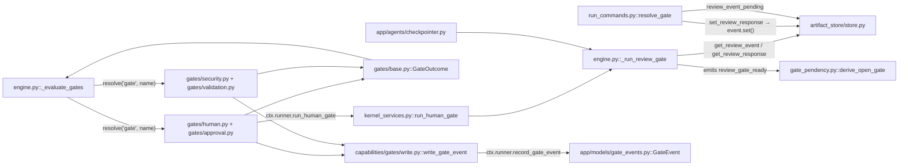

### [Run streaming — the backend-to-browser event contract](architecture/DOMAIN-run-streaming.md)

This domain owns the **event contract between a running pipeline and a browser tab**: how an engine event becomes an SSE frame, how a client that was not attached when the event happened catches up, and how a client that was attached is released when the run (or the process) ends.

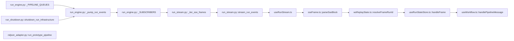

### [Validation and quality gates — judging agent output](architecture/DOMAIN-validation-and-quality.md)

This domain owns the question **"is what the agent just produced actually any good?"** — and, crucially, it owns only the *judging*.

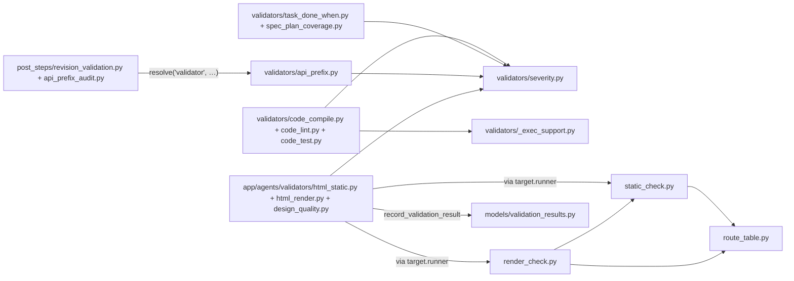

### [Workflow compilation — manifest to ExecutionPlan](architecture/DOMAIN-workflow-compilation.md)

This domain owns the transform from **authored declaration to typed executable object**, and it owns the moment every declared name is checked.

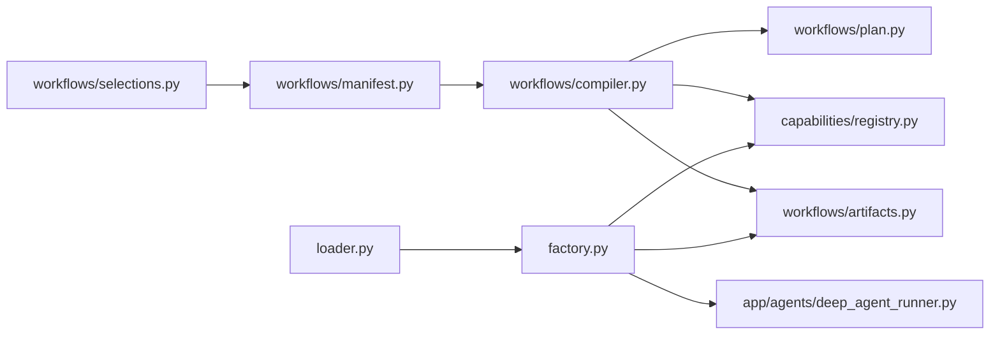

### [Workspace isolation — sandboxes and the runtime seam](architecture/DOMAIN-workspace-isolation.md)

This domain owns the answer to *where does a run's bytes live, and who can reach them*.

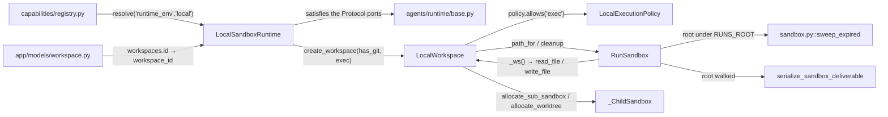

<!-- /DOMAIN-DIAGRAMS -->

## Module map

<!-- MODULE-MAP -->

36 logical modules over 628 tracked source files. Each entry links to its
architecture card, which carries an auto-generated file and import rollup. Module
cards describe FOLDERS and carry no diagrams — for how a concern actually works,
read the domains above.

### Backend — Python (287 files)

| Module | Path | Files |
|---|---|---|
| [MOD-backend-agents](architecture/MOD-backend-agents.md) | `backend/agents` | 121 |
| [MOD-backend-app-agents](architecture/MOD-backend-app-agents.md) | `backend/app/agents` | 38 |
| [MOD-backend-alembic-versions](architecture/MOD-backend-alembic-versions.md) | `backend/alembic/versions` | 32 |
| [MOD-backend-app-api](architecture/MOD-backend-app-api.md) | `backend/app/api` | 30 |
| [MOD-backend-app-models](architecture/MOD-backend-app-models.md) | `backend/app/models` | 24 |
| [MOD-backend](architecture/MOD-backend.md) | `backend` | 10 |
| [MOD-backend-evals](architecture/MOD-backend-evals.md) | `backend/evals` | 9 |
| [MOD-backend-app-core](architecture/MOD-backend-app-core.md) | `backend/app/core` | 7 |
| [MOD-backend-scripts](architecture/MOD-backend-scripts.md) | `backend/scripts` | 6 |
| [MOD-backend-app-services](architecture/MOD-backend-app-services.md) | `backend/app/services` | 5 |
| [MOD-backend-app](architecture/MOD-backend-app.md) | `backend/app` | 2 |
| [MOD-backend-app-scripts](architecture/MOD-backend-app-scripts.md) | `backend/app/scripts` | 2 |
| [MOD-backend-alembic](architecture/MOD-backend-alembic.md) | `backend/alembic` | 1 |

### Frontend — TypeScript (341 files)

| Module | Path | Files |
|---|---|---|
| [MOD-frontend-src-components-workflow](architecture/MOD-frontend-src-components-workflow.md) | `frontend/src/components/workflow` | 56 |
| [MOD-frontend-src-lib](architecture/MOD-frontend-src-lib.md) | `frontend/src/lib` | 42 |
| [MOD-frontend-src-components-chat](architecture/MOD-frontend-src-components-chat.md) | `frontend/src/components/chat` | 38 |
| [MOD-frontend-src](architecture/MOD-frontend-src.md) | `frontend/src` | 33 |
| [MOD-frontend-src-hooks](architecture/MOD-frontend-src-hooks.md) | `frontend/src/hooks` | 32 |
| [MOD-frontend-src-app](architecture/MOD-frontend-src-app.md) | `frontend/src/app` | 28 |
| [MOD-frontend-src-components-results](architecture/MOD-frontend-src-components-results.md) | `frontend/src/components/results` | 27 |
| [MOD-frontend-src-components-preview](architecture/MOD-frontend-src-components-preview.md) | `frontend/src/components/preview` | 18 |
| [MOD-frontend-src-components-history](architecture/MOD-frontend-src-components-history.md) | `frontend/src/components/history` | 12 |
| [MOD-frontend-src-components-ui](architecture/MOD-frontend-src-components-ui.md) | `frontend/src/components/ui` | 11 |
| [MOD-frontend-src-components-handoff](architecture/MOD-frontend-src-components-handoff.md) | `frontend/src/components/handoff` | 8 |
| [MOD-frontend-src-components-layout](architecture/MOD-frontend-src-components-layout.md) | `frontend/src/components/layout` | 7 |
| [MOD-frontend-src-components-analytics](architecture/MOD-frontend-src-components-analytics.md) | `frontend/src/components/analytics` | 6 |
| [MOD-frontend-src-components-catalog](architecture/MOD-frontend-src-components-catalog.md) | `frontend/src/components/catalog` | 4 |
| [MOD-frontend-src-components-library](architecture/MOD-frontend-src-components-library.md) | `frontend/src/components/library` | 3 |
| [MOD-frontend-src-components-savedworkflows](architecture/MOD-frontend-src-components-savedworkflows.md) | `frontend/src/components/savedworkflows` | 3 |
| [MOD-frontend-src-components-settings](architecture/MOD-frontend-src-components-settings.md) | `frontend/src/components/settings` | 3 |
| [MOD-frontend-src-components-sidebar](architecture/MOD-frontend-src-components-sidebar.md) | `frontend/src/components/sidebar` | 2 |
| [MOD-frontend-src-providers](architecture/MOD-frontend-src-providers.md) | `frontend/src/providers` | 2 |
| [MOD-frontend-src-styles](architecture/MOD-frontend-src-styles.md) | `frontend/src/styles` | 2 |
| [MOD-frontend-src-types](architecture/MOD-frontend-src-types.md) | `frontend/src/types` | 2 |
| [MOD-frontend-src-components-home](architecture/MOD-frontend-src-components-home.md) | `frontend/src/components/home` | 1 |
| [MOD-frontend-src-context](architecture/MOD-frontend-src-context.md) | `frontend/src/context` | 1 |

<!-- /MODULE-MAP -->

`MOD-backend-agents` is the execution kernel and the capability registry — the
centre of gravity of the whole system. Read it first.

## Knowledge base conventions

```
.knowledge/
├── cards/            482 cards, {YYYYMMDD}[-{HHMM}]-{ID}.md
├── architecture/     14 DOMAIN-*.md  — hand-authored system concerns
│                     36 MOD-*.md     — one per folder, generated
│                     789 files/**.md — one per source file, generated
│                     + modules.json
├── .stage/           delta approval queue — proposals land here before applying
├── INDEX.md          one line per card
├── ARCHITECTURE.md   this file
├── CONTEXT.md        compacted context pack, built by `/velocity prime`
└── state.yaml        last sync commit + date, corpus counts
```

**Card types.** Four, and no others: `fix` (266), `issue` (162), `bug` (42),
`adr` (12). `requirement`, `phase` and `doc` were retired — every card of those
types was a generated stub whose body only pointed into `.planning/`, so they
were deleted rather than migrated. `kind: state` describes how things *are*;
`kind: event` records something that *happened*.

**Staleness is tracked, not assumed.** Every architecture card carries a
`code_signature` (derived from the files it is answerable for and their
symbols) and a `prose_signature` (stamped when its prose was last written).
Equal means current; different means the code moved underneath the analysis.

```
tools/knowledge/build_architecture.py --affected [FILE…]   which cards a changeset touches
tools/knowledge/build_architecture.py --stale-prose        which cards are out of date
tools/knowledge/build_architecture.py --stamp CARD         mark a card current after re-authoring
```

A domain's watch set is its `members:` globs **plus every file its prose
names** — so a change in a file the card merely passes through still flags it.

**IDs are permanent.** They are wikilink targets. A card is never renumbered
and never deleted. Corrections happen by **supersession** — write a new card,
link it to the old one, and set the old one's `status` to `superseded`. Never
rewrite a trusted card's meaning in place.

**Resolve a `[[CARD-ID]]`** by globbing `.knowledge/cards/*-<ID>.md`.

**The divider contract.** In every `MOD-*.md`, content above
the line beginning `<!-- AUTO-GENERATED BELOW THIS LINE`
is hand-authored and preserved across
regeneration; content below it is produced by `tools/knowledge/build_architecture.py` and
is overwritten. Never hand-edit below the divider.

## Regenerating

| Artifact | Command | Notes |
|---|---|---|
| `INDEX.md`, `state.yaml` | `python3 tools/knowledge/build_index.py` | Fully derived from `cards/` |
| `architecture/`, `modules.json` | `python3 tools/knowledge/build_architecture.py` | Preserves above-divider prose |
| `CONTEXT.md` | `/velocity prime` | Rebuilds only when the sync commit moved |

Git is the user's responsibility. No tool or skill in this system commits,
stages, or branches.
