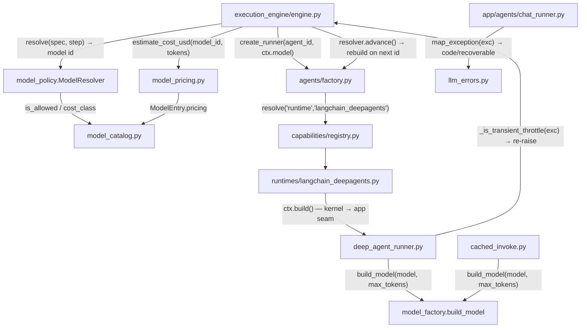
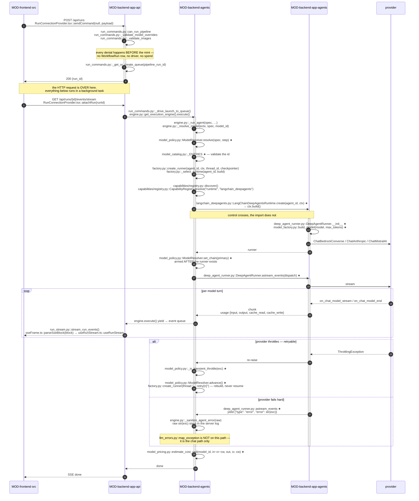

<!-- AUTO-GENERATED BELOW THIS LINE — regenerated by tools/knowledge/build_architecture.py -->

### Members (9 files across 2 modules)

**[MOD-backend-agents](MOD-backend-agents.md)**
- [backend/agents/capabilities/model_catalog.py](../../backend/agents/capabilities/model_catalog.py)
- [backend/agents/capabilities/model_pricing.py](../../backend/agents/capabilities/model_pricing.py)
- [backend/agents/capabilities/runtimes/__init__.py](../../backend/agents/capabilities/runtimes/__init__.py)
- [backend/agents/capabilities/runtimes/langchain_deepagents.py](../../backend/agents/capabilities/runtimes/langchain_deepagents.py)
- [backend/agents/model_policy.py](../../backend/agents/model_policy.py)

**[MOD-backend-app-agents](MOD-backend-app-agents.md)**
- [backend/app/agents/cached_invoke.py](../../backend/app/agents/cached_invoke.py)
- [backend/app/agents/deep_agent_runner.py](../../backend/app/agents/deep_agent_runner.py)
- [backend/app/agents/llm_errors.py](../../backend/app/agents/llm_errors.py)
- [backend/app/agents/model_factory.py](../../backend/app/agents/model_factory.py)

### Imported by, from outside this domain (16)
- [backend/agents/execution_engine/clarify_engine.py](../../backend/agents/execution_engine/clarify_engine.py)
- [backend/agents/execution_engine/engine.py](../../backend/agents/execution_engine/engine.py)
- [backend/agents/factory.py](../../backend/agents/factory.py)
- [backend/agents/planner/smart_planner.py](../../backend/agents/planner/smart_planner.py)
- [backend/agents/workflows/selections.py](../../backend/agents/workflows/selections.py)
- [backend/app/agents/chat/concierge.py](../../backend/app/agents/chat/concierge.py)
- [backend/app/agents/chat_runner.py](../../backend/app/agents/chat_runner.py)
- [backend/app/agents/handoff/classifier.py](../../backend/app/agents/handoff/classifier.py)
- [backend/app/agents/handoff/coder.py](../../backend/app/agents/handoff/coder.py)
- [backend/app/agents/handoff/compliance_agent.py](../../backend/app/agents/handoff/compliance_agent.py)
- [backend/app/agents/handoff/test_agent.py](../../backend/app/agents/handoff/test_agent.py)
- [backend/app/api/capabilities.py](../../backend/app/api/capabilities.py)
- [backend/app/api/run_commands.py](../../backend/app/api/run_commands.py)
- [backend/app/api/run_engine.py](../../backend/app/api/run_engine.py)
- [backend/app/api/settings.py](../../backend/app/api/settings.py)
- [backend/app/api/user_workflows.py](../../backend/app/api/user_workflows.py)

### Imports, from outside this domain (11)
- [backend/agents/__init__.py](../../backend/agents/__init__.py)
- [backend/agents/capabilities/__init__.py](../../backend/agents/capabilities/__init__.py)
- [backend/agents/capabilities/registry.py](../../backend/agents/capabilities/registry.py)
- [backend/agents/workflows/__init__.py](../../backend/agents/workflows/__init__.py)
- [backend/agents/workflows/plan.py](../../backend/agents/workflows/plan.py)
- [backend/app/__init__.py](../../backend/app/__init__.py)
- [backend/app/agents/__init__.py](../../backend/app/agents/__init__.py)
- [backend/app/agents/sandbox.py](../../backend/app/agents/sandbox.py)
- [backend/app/agents/types.py](../../backend/app/agents/types.py)
- [backend/app/core/__init__.py](../../backend/app/core/__init__.py)
- [backend/app/core/config.py](../../backend/app/core/config.py)

### External
boto3, botocore, deepagents, langchain, langchain_core, langchain_ollama
<!-- /AUTO-GENERATED -->

## Purpose

This domain answers one question for every LLM call the system makes: *which model,
built how, and what happens when the provider says no.* It owns the model list itself
(`ModelEntry` / `ModelCatalog`), the per-agent precedence that picks an id
(`ModelResolver`), the single constructor that turns an id into a live chat client
(`build_model`), the deepagents graph that client is handed to (`DeepAgentRunner`), the
cheap non-agent path for one-shot calls (`cached_invoke`), the classifier that decides
whether a provider failure is worth another attempt (`_is_transient_throttle`), the
mapping from a provider exception to something a user can read (`map_exception`), and the
cost arithmetic derived from the same catalog (`estimate_cost_usd`). Without it each of
the forty-odd inbound call sites would carry its own provider chain, its own botocore
timeout guesses, its own copy of the model-id list, and its own idea of what a
`ThrottlingException` means — which is exactly the state `FIX-038` recorded and reversed
for pricing alone.

It stops at the edges of *composition* and *policy execution*. What the agent is told —
prompt assembly, guardrail and skill injection, tool resolution — belongs to
`DOMAIN-context-assembly` and the composition root [agents/factory.py](../../backend/agents/factory.py); this domain only
receives the finished prompt and tool list through the runner's constructor. *When* an
agent runs, and the retry loop that actually re-invokes it, belong to
`DOMAIN-execution-kernel` — the kernel owns the loop, this domain supplies the predicate
and the ordered chain the loop walks. The `(kind, name)` lookup that finds the runtime
adapter is `DOMAIN-capability-registry`; the pause/resume semantics behind the runner's
`gate` event are `DOMAIN-hitl-gating`; the disk root the graph writes into is
`DOMAIN-workspace-isolation`; and where the token counts and cost land afterwards is
`DOMAIN-durable-state-resume`. If your question is "why did this agent get Sonnet" or
"why did the run survive a 429", it is here. If it is "why did this agent get that
prompt" or "why did it run third", it is next door.

## Shape

**Every model id in the system traces back to [model_catalog.py](../../backend/agents/capabilities/model_catalog.py), and every live client
is built by [model_factory.build_model](../../backend/app/agents/model_factory.py) — id selection and client construction are two
separate chokepoints, and nothing bypasses either.** [app/api/settings.py](../../backend/app/api/settings.py) derives
`AVAILABLE_MODELS` and `_VALID_MODEL_IDS` from `ModelCatalog()` rather than listing ids;
[model_pricing.py](../../backend/agents/capabilities/model_pricing.py) holds no id literals at all and reads rates off each `ModelEntry`'s
co-located `Pricing`; `ModelResolver` catalog-validates the tiers a user or an `AGENT.md`
can reach before an id ever leaves the kernel.

- **The id list.** [model_catalog.py](../../backend/agents/capabilities/model_catalog.py) is pure data — seven `ModelEntry` records, each
  carrying both `tier` (display) and `cost_class` (policy), plus `user_allowed`, `vision`,
  and `Pricing`. `ModelCatalog` exposes only `list` / `get` / `is_allowed` / `ids`.
- **Selection.** `ModelResolver.resolve(spec, step)` in [model_policy.py](../../backend/agents/model_policy.py) walks five
  tiers — user override, `step.model`, `AgentSpec.model`, `workflow.model`, then the
  session id or the settings Haiku default. Validation is deliberately lazy: a tier is
  catalog-checked only when it is the *selected* tier, so a retired id in an `AGENT.md`
  cannot block a run a user override would have rescued.
- **Fallback composition.** The same object holds the chain and the cursor
  (`chain_for` / `set_chain` / `current` / `advance`). With no explicit
  `ModelPolicy.fallback`, `_derive_tier_descent` reads `cost_class` and walks
  premium → standard → cheap, picking one user-allowed catalog id per lower class.
- **Failure classification.** `_is_transient_throttle` is a three-layer defensive test —
  botocore `response["Error"]["Code"]`, an integer `status_code`/`http_status`, then a
  substring match on the type name and stringified message. Non-matching errors return
  `False`, meaning the caller re-raises without switching models.
- **Client construction.** `build_model` resolves the provider chain (Anthropic key →
  Bedrock profile + region → Mistral), bridges `AWS_BEARER_TOKEN_BEDROCK` from pydantic
  settings into the process env because botocore only reads it there, clamps the extended-
  thinking budget below *this call's* `max_tokens`, and embeds the botocore read-timeout
  and adaptive retries. `model_identifier` reads the id back off whichever client type
  was built.
- **The agent path.** `DeepAgentRunner` builds the `create_deep_agent` graph and maps
  LangGraph's `astream_events` v2 stream onto the engine's vocabulary
  (`chunk` / `usage` / `tool_call` / `tool_result` / `done` / `gate` / `error`). Two local
  middlewares ride the graph: `_ToolFilterMiddleware` (drops `task` always, the whole
  `_BUILTIN_TOOLS` suite for text-only agents) and `_BedrockCachePointsMiddleware`
  (Bedrock-only `cache_control`, no-op on ChatAnthropic so deepagents' own caching is not
  double-applied).
- **The non-agent path.** `cached_invoke` exists so one-shot callers — the planner,
  clarify, the handoff classifier and compliance agents — get the *same* cache point and
  the same usage accounting without a graph. It mirrors `_bedrock_cache_control`,
  `_extract_text` and the cache-split extraction from the runner rather than inventing a
  second scheme.
- **Error surfacing.** [llm_errors.map_exception](../../backend/app/agents/llm_errors.py) maps a botocore exception to a frozen
  `LLMErrorPayload(message, code, recoverable)` — the triple [ErrorMessage.tsx](../../frontend/src/components/chat/ErrorMessage.tsx) keys on,
  where `recoverable` decides whether a "Try Again" button renders. Its `_BEDROCK_CODE_MAP`
  is the only place an AWS error code becomes one of the six stable codes
  (`api_key_missing`, `auth_error`, `rate_limit`, `timeout`, `connection_error`,
  `internal_error`); botocore is imported lazily inside the function so a missing module
  degrades to `internal_error` rather than breaking startup. Note the asymmetry: only the
  chat path ([chat_runner.py](../../backend/app/agents/chat_runner.py), three call sites) calls it. The pipeline runner yields
  `{"type": "error", "error": str(exc)}` and [engine.py::_sanitize_agent_error](../../backend/agents/execution_engine/engine.py) replaces
  that string wholesale with one fixed message.

**Module crossings.** Three matter, and two of them are one-way:

1. **Kernel → app, at run time only.** [agents/capabilities/runtimes/langchain_deepagents.py](../../backend/agents/capabilities/runtimes/langchain_deepagents.py)
   lives in `MOD-backend-agents` but the runner it selects lives in `MOD-backend-app-agents`.
   It cannot import it: the adapter's `create(agent_id, ctx)` invokes `ctx.build`, a zero-arg
   closure that [agents/factory.py](../../backend/agents/factory.py) (the composition root, which *is* allowed to import
   `app`) bound over the already-composed prompt, tools and sandbox. Control crosses the
   module boundary; the import does not.
2. **App → kernel, for classification.** [deep_agent_runner.astream_events](../../backend/app/agents/deep_agent_runner.py) imports
   `agents.model_policy._is_transient_throttle` *inside* its `except` block, so a throttle
   is re-raised into the kernel's retry loop while every other exception stays swallowed
   into an `error` event. This is the one place an app-side module reaches back into the
   kernel, and it is a leaf pure function.
3. **Kernel-side data, read from both sides.** [model_catalog.py](../../backend/agents/capabilities/model_catalog.py) and [model_pricing.py](../../backend/agents/capabilities/model_pricing.py)
   are imported by [app/api/settings.py](../../backend/app/api/settings.py) and [app/api/run_commands.py](../../backend/app/api/run_commands.py) as well as by the
   engine. The direction is fixed: app imports kernel data, never the reverse.

## In practice

One launch, end to end. The domain owns the shaded steps; everything else is
here so the chain is unbroken.

### The path, by call

Participants are modules; the vertical axis is time. Every arrow is a real call
labelled with its file and symbol, so any identifier here can be grepped straight to
its definition. `★` marks a call into a member of this domain.

No participant aliases: each lane is written out as its module id, so an agent
reading the source resolves every arrow without a lookup table. The numbered
walkthrough below is the same journey in linear form.

### Step by step

**Ingress — before any model exists**

1. The wizard calls [lib/api.ts](../../frontend/src/lib/api.ts), which issues `POST /api/runs` with a
   `LaunchCommand` body. [app/main.py](../../backend/app/main.py) routes it to
   [run_commands.launch_run](../../backend/app/api/run_commands.py).
2. `launch_run` runs every ingress denial **before** minting anything: empty
   brief, `can_run_pipeline` tier check, `_validate_model_overrides`,
   `_revalidate_selections_trust_user`, `_validate_images`. A rejection here
   means no `WorkflowRun` row, no driver, no spend.
3. It mints `pipeline_run_id = uuid4()` and the `WorkflowRun` row, calls
   `_get_or_create_queue(pipeline_run_id)`, spawns
   `asyncio.create_task(_drive_launch_to_queue(...))`, and **returns
   `{"run_id": …}` immediately**. The HTTP request is over; everything below
   runs in the background task.
4. The browser separately opens `GET /api/runs/{id}/events/stream`
   ([run_stream.py](../../backend/app/api/run_stream.py)), which drains the same queue. Nothing after this point
   reaches the user except through that queue.

**Kernel — choosing the model**

5. `_drive_launch_to_queue` calls `get_execution_engine()` and iterates
   `async for update in engine.execute(...)`, putting each event on the queue.
6. Once per run, after compilation, [engine.execute](../../backend/agents/execution_engine/engine.py) constructs
   `ModelResolver(model_overrides=…, workflow_model=…, session_model_id=…,
   haiku_default=…)` and parks it on `ectx.model_resolver`. **Once per run, not
   per step.**
7. Per agent step, [engine._run_agent](../../backend/agents/execution_engine/engine.py) calls `_resolve_model(ectx, spec,
   model_id)` → `ModelResolver.resolve(spec, step)`, which walks its tier
   ladder and returns a model **id string**. Every id it can return comes from
   [model_catalog._ENTRIES](../../backend/agents/capabilities/model_catalog.py) — the single source of truth, CI-enforced.
8. `engine` builds `AgentContext(model=<resolved id>, …)` and captures
   `_resolved_model_id` **before** construction, because the retry path
   reassigns `ctx.model` later.

**Crossing into the app layer**

9. `engine` calls `factory.create_runner(spec.id, ctx, thread_id=…,
   checkpointer=…)`. `factory` is the composition root — the one kernel file
   permitted to import `app`.
10. [factory._select_runtime](../../backend/agents/factory.py) calls [registry.discover()](../../backend/agents/capabilities/registry.py) (idempotent), then
    `CapabilityRegistry().resolve("runtime", "langchain_deepagents")` and hands
    the adapter a `RuntimeBuildContext(agent_id, build)`.
11. `adapter.create(...)` invokes `ctx.build()`. **This is the kernel → app
    crossing: control crosses, the import does not.** The adapter selects and
    wraps; it never imports `create_deep_agent` itself (INV-13).
12. `DeepAgentRunner.__init__` calls `model_factory.build_model(model,
    max_tokens=…)`, which picks the provider by environment —
    `ANTHROPIC_API_KEY` → `ChatAnthropic`, Bedrock id + region →
    `ChatBedrockConverse`, `MISTRAL_API_KEY` → `ChatMistralAI` — then
    `create_deep_agent(middleware=[_ToolFilterMiddleware,
    _BedrockCachePointsMiddleware])`.

**Streaming back out**

13. Back in `engine`, `_resolver.set_chain(_resolved_model_id)` arms the
    fallback chain and `_max_attempts = len(_resolver._chain)`. **The chain is
    armed after the runner exists**, with the cursor on the primary.
14. `async for event in agent.astream_events(_dispatch)` maps LangGraph events
    onto the engine's vocabulary: `on_chat_model_stream` → `chunk`,
    `on_chat_model_end` → `usage` read from `usage_metadata`. Each becomes an
    [engine.execute](../../backend/agents/execution_engine/engine.py) yield → the queue → SSE → [sseFrame.ts](../../frontend/src/lib/sseFrame.ts) →
    [useRunStream.ts](../../frontend/src/hooks/useRunStream.ts).
15. At run end `engine` calls `model_pricing.estimate_cost_usd(model_id, input
    − cache_read − cache_write, output, cache_read, cache_write)`.

### What breaks if you get it wrong

[model_policy._is_transient_throttle](../../backend/agents/model_policy.py) decides whether a provider exception is
retryable, and **both directions of getting it wrong are silent**.

- **Too wide** (add a loose substring to `_TRANSIENT_SUBSTRINGS`): a genuine
  `ValidationException` is treated as a throttle. The engine burns the entire
  fallback chain re-streaming a broken prompt across three models before
  surfacing the original error. The user sees a long hang and repeated
  `agent_model_fallback` events — never an error message.
- **Too narrow** (or if the runner swallows the throttle into an `error` event
  instead of re-raising): the fallback chain never fires. The run dies on the
  first 429 with no signal that a cheaper model would have finished it.

The one failure that is *not* silent: adding a model id anywhere other than
[model_catalog._ENTRIES](../../backend/agents/capabilities/model_catalog.py) fails immediately — `ModelResolver.resolve` raises
`ValueError` before `build_model` is reached, and
`test_model_catalog::test_single_source_grep` fails in CI.

### The other two paths

- **Throttle/retry** — `astream_events` re-raises; `engine` rolls back
  `ectx.completed_tasks[-_attempt_task_count:]`, calls `_resolver.advance()`,
  reassigns `ctx.model`, and rebuilds via `create_runner` on a fresh
  `f"{thread_id}:retry{n}"` so LangGraph re-streams rather than resuming the
  throttled attempt's partial state.
- **One-shot, no graph** — the planner, clarify, and handoff classifier/test/
  compliance agents skip steps 9–12 entirely: `cached_invoke` → `build_model`
  → `llm.ainvoke` → `_usage_from_response` → `usage_sink`, reaching the same
  token accounting the runner's `usage` events feed.

## Why this shape

**The catalog is one hand-maintained list because it stopped being one twice.** `FIX-038`
records the concrete regression: [model_pricing.py](../../backend/agents/capabilities/model_pricing.py) had grown its own model-family
literals, duplicating the catalog and breaking `test_model_catalog::test_single_source_grep`.
The fix moved the rates onto a `Pricing` dataclass co-located on `ModelEntry`, which is why
the pricing module today manipulates only prefix and suffix tokens and never a model id.
`FIX-019` is the other pull on the same data — the frontend needed tier, context window and
description, which is why `ModelEntry` carries both `tier` (for the `/api/settings`
projection) and `cost_class` (for resolution and fallback) instead of collapsing them.

**The runtime adapter is thin on purpose, and CI keeps it that way.** The obvious design is
for the capability to construct its own runner. It cannot: `agents.capabilities` may not
import `app` (the import-linter contract *"agents.capabilities must not import the execution
kernel or the web layer"* in `backend/pyproject.toml`), and `create_deep_agent` may appear
in exactly one file — `_ALLOWED_CREATE_DEEP_AGENT = frozenset({"app/agents/deep_agent_runner.py"})`
in backend/tests/agents/test_banned_patterns.py, which additionally asserts the allow-listed file
*does* use it so the gate cannot rot. The `build`-seam indirection is what satisfies both at
once, and it is the mechanism by which a future `claude_code_cli` runtime slots in with no
kernel edit — the capability-registry seam ARCHITECTURE.md names, applied to the runtime port.

**The resolver's precedence is deliberately parity-preserving.** Every manifest and
`AGENT.md` tier is `None` today, so tier 5 (`session model_id or Haiku`) is what actually
fires, and every agent resolves to the exact id `build_model` received before the resolver
existed. The five tiers are scaffolding for declarative model policy that is wired but
unexercised — stated as such in [model_policy.py](../../backend/agents/model_policy.py)'s own header, not inferred here.

**Retry lives in the kernel, classification lives with the catalog.** The alternative —
retrying inside `DeepAgentRunner` — was rejected because a mid-stream restart cannot un-emit
already-streamed tokens; only the engine holds the accumulators and the `completed_tasks`
list it must roll back before re-streaming. So the runner's job ends at *classifying and
re-raising*, and `_is_transient_throttle` sits next to the fallback chain that consumes its
verdict rather than next to the code that raises it. The comments in [engine.py](../../backend/agents/execution_engine/engine.py) around the
retry loop record this ("Pitfall 4") explicitly.

**Prompt caching is one global switch, and that is a known defect, not a design.**
`ISS-120` (open, minor) records that `BEDROCK_PROMPT_CACHE_ENABLED` has no per-workflow
override, and that on short runs which write cache but never re-read it the flag is a
measured net cost *increase* of roughly 25%. The gating is duplicated across
[deep_agent_runner._BedrockCachePointsMiddleware](../../backend/app/agents/deep_agent_runner.py) and [cached_invoke._bedrock_cache_control](../../backend/app/agents/cached_invoke.py)
because the middleware cannot reach a direct `ainvoke`; both read the flag at call time so
tests can monkeypatch it.

**Bedrock pricing for the 4.6 tier is derived, not published.** [model_catalog.py](../../backend/agents/capabilities/model_catalog.py) flags
this in-line: Opus 4.6 and Sonnet 4.6 rates mirror their 4.5 tier pending real AWS numbers,
with an explicit "operator confirm" note. Any cost figure for those two ids is an estimate.

**The engine does not reuse `map_exception`, and the reason is recorded.** The obvious
unification — route the pipeline's fatal path through the same mapper the chat path uses —
is impossible with the current seam: [deep_agent_runner.astream_events](../../backend/app/agents/deep_agent_runner.py) swallows the
exception and yields `str(exc)`, so [engine.py](../../backend/agents/execution_engine/engine.py) holds a *string*, never the botocore
`ClientError`. It cannot reach `response["Error"]["Code"]`, and `map_exception` on a
non-exception input falls straight through to `internal_error`, so routing through it would
buy no granularity while still risking a leak. The engine therefore emits the fixed
`_GENERIC_AGENT_ERROR_MESSAGE` ("The model rejected this request.") and keeps the raw
provider text — which can carry ARNs, region, model id and config — server-side in the
warning log only. That rationale is written out in [engine.py](../../backend/agents/execution_engine/engine.py)'s comment block above
`_sanitize_agent_error` and in the phase-16 review it labels *WR-02*
(`.planning/phases/16-terminal-state-integrity-and-reconnect-frame-contract/16-REVIEW.md`).
**Not recorded:** whether the runner should instead raise, which would let one mapper serve
both paths — the review notes the runner "stays as-is" but gives no reason beyond scope.
