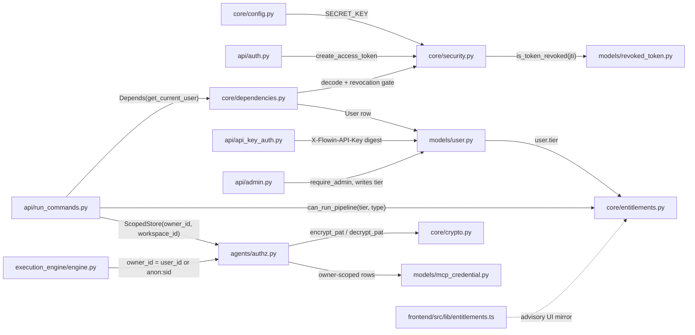
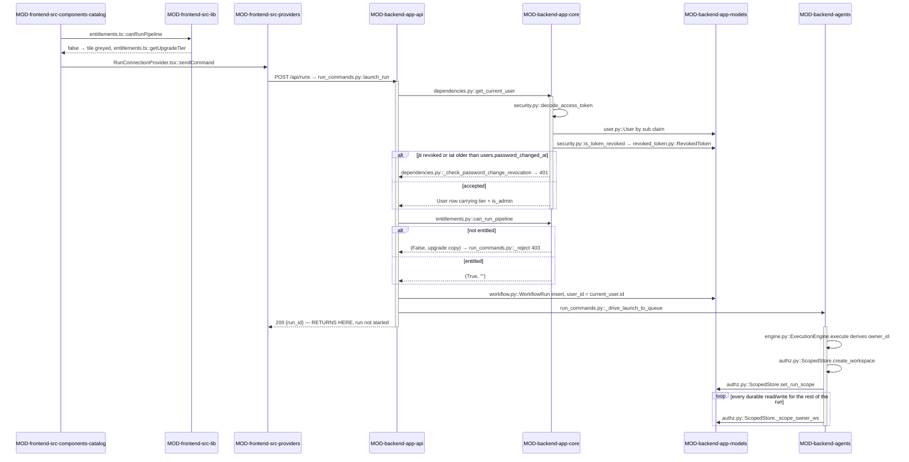

<!-- AUTO-GENERATED BELOW THIS LINE — regenerated by tools/knowledge/build_architecture.py -->

### Members (18 files across 5 modules)

**[MOD-backend-agents](MOD-backend-agents.md)**
- [backend/agents/authz.py](../../backend/agents/authz.py)

**[MOD-backend-app-api](MOD-backend-app-api.md)**
- [backend/app/api/admin.py](../../backend/app/api/admin.py)
- [backend/app/api/api_key_auth.py](../../backend/app/api/api_key_auth.py)
- [backend/app/api/auth.py](../../backend/app/api/auth.py)

**[MOD-backend-app-core](MOD-backend-app-core.md)**
- [backend/app/core/__init__.py](../../backend/app/core/__init__.py)
- [backend/app/core/auth_events.py](../../backend/app/core/auth_events.py)
- [backend/app/core/cognito.py](../../backend/app/core/cognito.py)
- [backend/app/core/config.py](../../backend/app/core/config.py)
- [backend/app/core/crypto.py](../../backend/app/core/crypto.py)
- [backend/app/core/dependencies.py](../../backend/app/core/dependencies.py)
- [backend/app/core/entitlements.py](../../backend/app/core/entitlements.py)
- [backend/app/core/identity.py](../../backend/app/core/identity.py)
- [backend/app/core/logging.py](../../backend/app/core/logging.py)
- [backend/app/core/security.py](../../backend/app/core/security.py)

**[MOD-backend-app-models](MOD-backend-app-models.md)**
- [backend/app/models/mcp_credential.py](../../backend/app/models/mcp_credential.py)
- [backend/app/models/revoked_token.py](../../backend/app/models/revoked_token.py)
- [backend/app/models/user.py](../../backend/app/models/user.py)

**[MOD-frontend-src-lib](MOD-frontend-src-lib.md)**
- [frontend/src/lib/entitlements.ts](../../frontend/src/lib/entitlements.ts)

### Imported by, from outside this domain (44)
- [backend/agents/execution_engine/clarify_engine.py](../../backend/agents/execution_engine/clarify_engine.py)
- [backend/agents/execution_engine/engine.py](../../backend/agents/execution_engine/engine.py)
- [backend/agents/planner/smart_planner.py](../../backend/agents/planner/smart_planner.py)
- [backend/app/agents/cached_invoke.py](../../backend/app/agents/cached_invoke.py)
- [backend/app/agents/chat/concierge.py](../../backend/app/agents/chat/concierge.py)
- [backend/app/agents/checkpointer.py](../../backend/app/agents/checkpointer.py)
- [backend/app/agents/deep_agent_runner.py](../../backend/app/agents/deep_agent_runner.py)
- [backend/app/agents/handoff/coder.py](../../backend/app/agents/handoff/coder.py)
- [backend/app/agents/model_factory.py](../../backend/app/agents/model_factory.py)
- [backend/app/agents/runtime/local.py](../../backend/app/agents/runtime/local.py)
- [backend/app/agents/sandbox.py](../../backend/app/agents/sandbox.py)
- [backend/app/agents/validators/html_render.py](../../backend/app/agents/validators/html_render.py)
- [backend/app/api/agents.py](../../backend/app/api/agents.py)
- [backend/app/api/analytics.py](../../backend/app/api/analytics.py)
- [backend/app/api/capabilities.py](../../backend/app/api/capabilities.py)
- [backend/app/api/chats.py](../../backend/app/api/chats.py)
- [backend/app/api/file_extract.py](../../backend/app/api/file_extract.py)
- [backend/app/api/handoff.py](../../backend/app/api/handoff.py)
- [backend/app/api/hooks.py](../../backend/app/api/hooks.py)
- [backend/app/api/install.py](../../backend/app/api/install.py)
- [backend/app/api/mcp.py](../../backend/app/api/mcp.py)
- [backend/app/api/ppt_templates.py](../../backend/app/api/ppt_templates.py)
- [backend/app/api/prototype_templates.py](../../backend/app/api/prototype_templates.py)
- [backend/app/api/run_commands.py](../../backend/app/api/run_commands.py)
- [backend/app/api/run_engine.py](../../backend/app/api/run_engine.py)
- …and 19 more

### Imports, from outside this domain (17)
- [backend/app/__init__.py](../../backend/app/__init__.py)
- [backend/app/models/__init__.py](../../backend/app/models/__init__.py)
- [backend/app/models/artifact_ref.py](../../backend/app/models/artifact_ref.py)
- [backend/app/models/database.py](../../backend/app/models/database.py)
- [backend/app/models/exec_runs.py](../../backend/app/models/exec_runs.py)
- [backend/app/models/gate_events.py](../../backend/app/models/gate_events.py)
- [backend/app/models/handoff.py](../../backend/app/models/handoff.py)
- [backend/app/models/hook_runs.py](../../backend/app/models/hook_runs.py)
- [backend/app/models/repository.py](../../backend/app/models/repository.py)
- [backend/app/models/run_capabilities.py](../../backend/app/models/run_capabilities.py)
- [backend/app/models/run_event.py](../../backend/app/models/run_event.py)
- [backend/app/models/schemas.py](../../backend/app/models/schemas.py)
- [backend/app/models/subagent_run.py](../../backend/app/models/subagent_run.py)
- [backend/app/models/validation_results.py](../../backend/app/models/validation_results.py)
- [backend/app/models/wave_run.py](../../backend/app/models/wave_run.py)
- [backend/app/models/workflow.py](../../backend/app/models/workflow.py)
- [backend/app/models/workspace.py](../../backend/app/models/workspace.py)

### External
bcrypt, boto3, botocore, cryptography, fastapi, httpx, pydantic, pydantic_settings
<!-- /AUTO-GENERATED -->

## Purpose

This domain answers three questions that the rest of the system is not allowed to
answer for itself: *who is calling* (a JWT or a long-lived API key resolved to a
`User` row), *what plan are they on* (`users.tier`, checked against `TIER_PIPELINES`
before a run is launched), and *which rows may they see* (`owner_id` +
`workspace_id`, enforced on every durable read by `ScopedStore`). Without it the
kernel would have no principal to stamp on the rows it writes — and `ScopedStore`'s
default-deny filter would have nothing to filter on, which is the same thing as
having no isolation at all. `ISS-055` is the recorded proof that the entitlement half
can go missing without anything else noticing: for a period every user could launch
every pipeline regardless of tier, because the launch endpoints simply never called
`can_run_pipeline`.

What is deliberately *not* here: the run's own lifecycle and the durable event log it
writes (durable-state and run-streaming own those; this domain only supplies the
`(owner_id, workspace_id)` predicate they are read under), the sandbox path isolation
that keeps one run's *files* off another's disk ([app/agents/sandbox.py](../../backend/app/agents/sandbox.py), agent
runtime — note that the disk key is deliberately the `user_id`, never the possibly-
`anon:` `owner_id`), the exec allow/deny policy that decides which *commands* a run
may spawn, and MCP server selection and catalog. The credential *storage* for MCP
servers is here — [mcp_credential.py](../../backend/app/models/mcp_credential.py) and the Fernet round-trip in [crypto.py](../../backend/app/core/crypto.py) — but
deciding which servers a workflow gets is the capability-registry's call, not this
domain's. If the question is "may this principal see this row", it belongs here; if
it is "what is this run allowed to do", it belongs next door.

## Shape

**There are two gates, they run at different layers, and neither can see the other.**
Identity and tier are settled once at the HTTP edge, in FastAPI dependencies, and
then thrown away — nothing downstream re-checks a tier. Ownership is enforced far
below that, inside `ScopedStore`, on every single durable read and write, and the
kernel reaches it *without ever importing the web layer*. The only thing that crosses
between the two is a string: the resolved `owner_id`.

- **Credential minting and verification** — [security.py](../../backend/app/core/security.py) owns bcrypt hashing and the
  HS256 JWT, giving every token a fresh `jti` so it can be revoked individually.
  [crypto.py](../../backend/app/core/crypto.py) is the separate at-rest path: an HKDF-derived Fernet key, deliberately
  *not* `SECRET_KEY` itself, so a leaked signing key does not also decrypt stored
  PATs.
- **The request-time gate** — [dependencies.py](../../backend/app/core/dependencies.py) is the chokepoint. `get_current_user`
  decodes, loads the `User`, then layers *two* revocation checks: per-token (`jti` in
  `revoked_tokens`) and blanket (`iat` older than `users.password_changed_at`, compared
  at whole-second resolution). `get_user_for_logout` is the one deliberate hole — it
  skips the per-`jti` check so `/logout` stays idempotent. Every failure returns the
  same opaque 401.
- **The second front door** — [api_key_auth.py](../../backend/app/api/api_key_auth.py) resolves `X-Flowin-API-Key` by SHA-256
  digest for the IDE and MCP clients, which cannot live inside a 24-hour JWT. It
  returns the same `User`, so everything downstream is identical; note it does *not*
  consult `revoked_tokens` (an API key is revoked by its own `revoked_at` column).
- **Tier** — [entitlements.py](../../backend/app/core/entitlements.py) is a pure table plus `can_run_pipeline`, returning
  `(allowed, reason)` where the reason is already user-facing upgrade copy. It has no
  DB access and no FastAPI coupling; the callers in [run_commands.py](../../backend/app/api/run_commands.py) and
  [user_workflows.py](../../backend/app/api/user_workflows.py) are what make it load-bearing. [admin.py](../../backend/app/api/admin.py) is the only writer of
  `users.tier`, behind its own `require_admin` 403 gate.
- **The ownership gate** — `ScopedStore` in [agents/authz.py](../../backend/agents/authz.py) is the single enforced
  read/write surface for the typed-artifact substrate. Constructed from
  `(owner_id, workspace_id)`, it applies `owner_id = :owner AND workspace_id = :ws`
  to every read (widened to `OR visibility IN ('workspace','public')` for `ArtifactRef`,
  the only member carrying that column). `assert_owns`, `assert_repo_owned` and
  `assert_mcp_cred_owned` are the loud counterparts: they read the row's *true* owner
  unscoped and raise `PermissionError` on mismatch.
- **The advisory mirror** — [frontend/src/lib/entitlements.ts](../../frontend/src/lib/entitlements.ts) re-declares the same
  tier table in TypeScript so `HomeLaunchGrid` and `CreationHub` can grey out a tile
  and name the upgrade tier. It is a copy, not a source, and it has already drifted:
  the backend's `pro` includes `od_prototype_revision` which does not appear in the
  TypeScript table; the frontend's basic/pro/enterprise all include `hello_html` which
  the backend tables lack. The backend additionally defines a `hexaware` tier scoped for
  deployments requiring only prototype + user_stories (KAN-161 / [ISS-055](../cards/20260812-0036-ISS-055.md)).

**Module crossings, in the direction that matters.** `app/api` → `app/core` is
inbound and ordinary — 128 files outside this domain reach in, nearly all of them for
`get_current_user` or `settings`. The crossing that constrains design is
`backend/agents` → [agents/authz.py](../../backend/agents/authz.py) → `app/models`: the kernel gets its ownership
enforcement without ever touching `app.api`, and [authz.py](../../backend/agents/authz.py) keeps every model import
*inside the method body* rather than at module scope specifically to hold that line.
The last crossing, `frontend/src/lib` mirroring `backend/app/core`, has no mechanism
holding it at all — nothing compiles both tables against each other.

## In practice

### The path, by call

### Step by step

**Client-side, advisory only**

1. [HomeLaunchGrid.tsx](../../frontend/src/components/catalog/HomeLaunchGrid.tsx) renders each catalog tile and calls
   `entitlements.ts::canRunPipeline(userTier, type)`; a `false` greys the tile and
   [entitlements.ts::getUpgradeTier](../../backend/app/core/entitlements.py) names the tier to upgrade to. Nothing is
   enforced here — this is UI copy. [CreationHub.tsx](../../frontend/src/components/home/CreationHub.tsx) does the same.
2. On click the handler re-checks `canRunPipeline` and returns early if the tile is
   not entitled; otherwise the launch wizard collects the brief.
3. `useWorkflow.ts::startPipeline` assembles the `run_pipeline` payload
   (`pipeline_type`, `message`, optional `agent_ids` / `attached_hooks` / 
   merged `context`) and calls `RunConnectionProvider.tsx::sendCommand(null, payload)`.
   ([ADR-0010](../cards/20260811-ADR-0010.md): `attached_skills` was removed from the positional arguments — skills are
   now per-agent, riding the manifest as `Step.skills` rather than a run-level bag.)
4. `sendCommand` attaches `Authorization: Bearer <token>` and POSTs to `/api/runs`.

**Identity, settled once at the edge**

5. FastAPI resolves [run_commands.py::launch_run](../../backend/app/api/run_commands.py)'s `Depends(get_current_user)`
   before the handler body runs.
6. [dependencies.py::get_current_user](../../backend/app/core/dependencies.py) delegates to `get_current_user_with_payload`,
   which calls `_decode_and_load_user` → [security.py::decode_access_token](../../backend/app/core/security.py) (HS256
   against [settings.SECRET_KEY](../../backend/app/api/settings.py)) and loads [user.py::User](../../backend/app/models/user.py) by the `sub` claim. Every
   unrecoverable case raises the same opaque [dependencies.py::_invalid_token](../../backend/app/core/dependencies.py) 401.
7. [security.py::is_token_revoked](../../backend/app/core/security.py) checks the payload's `jti` against
   [revoked_token.py::RevokedToken](../../backend/app/models/revoked_token.py); a hit is a 401 "Token has been revoked".
8. [dependencies.py::_check_password_change_revocation](../../backend/app/core/dependencies.py) compares the token's `iat`
   against `users.password_changed_at` at whole-second resolution; strictly older is
   a 401.
9. [dependencies.py::_maybe_run_lazy_gc](../../backend/app/core/dependencies.py) fires roughly 1 request in 1000 and may run
   [revoked_token.py::cleanup_expired_revocations](../../backend/app/models/revoked_token.py); any failure is swallowed and
   rolled back.

**Tier, checked once and then discarded**

10. `launch_run` rejects an empty brief (`run_commands.py::_reject("empty_brief", …)`)
    and resolves the agent set via [run_commands.py::_resolve_launch_agents](../../backend/app/api/run_commands.py).
11. `launch_run` calls `entitlements.py::can_run_pipeline(current_user.tier,
    pipeline_type)` with the RAW `pipeline_type` — `od_prototype` and `prototype` are
    distinct keys in `TIER_PIPELINES`, so the alias-collapsed base would mis-key the
    lookup. Denial is `_reject("pipeline_not_entitled", reason, 403)`, before any row
    exists.
12. Remaining ingress validation runs (`allowed_custom_agent_ids`,
    `_revalidate_selections_trust_user`, `_validate_images`), then a
    [workflow.py::WorkflowRun](../../backend/app/models/workflow.py) row is inserted with `user_id = current_user.id`.
13. `launch_run` spawns [run_commands.py::_drive_launch_to_queue](../../backend/app/api/run_commands.py) as a background task
    and returns `{run_id}`. **The HTTP response completes before the run does**, and
    tier is never consulted again for the lifetime of that run.

**Ownership, enforced for everything after**

14. `_drive_launch_to_queue` calls [engine.py::ExecutionEngine.execute](../../backend/agents/execution_engine/engine.py) with
    `user_id=user.id` and `session_id=user.id`.
15. `execute` composes `owner_id = user_id or f"anon:{session_id or
    pipeline_run_id}"` — never `None` (AUTHZ-03) — and keeps it separate from
    `ectx.disk_principal`, which is what the sandbox path is keyed on.
16. `execute` constructs [authz.py::ScopedStore(owner_id=owner_id)](../../backend/agents/authz.py).
17. [authz.py::ScopedStore.create_workspace](../../backend/agents/authz.py) mints the run's `workspaces` row and its
    id is stamped onto the store as `_workspace_id`, so every later write carries it.
18. [authz.py::ScopedStore.set_run_scope](../../backend/agents/authz.py) writes `(owner_id, workspace_id)` back onto
    the `workflow_runs` row the API minted, which had a NULL `workspace_id`.
19. [authz.py::ScopedStore.record_capabilities](../../backend/agents/authz.py) writes the single `run_capabilities`
    audit row — the first of many writes that exist only because the store stamps a
    principal on them.
20. From here every durable read and write goes through `ScopedStore`, applying
    [authz.py::ScopedStore._scope_owner_ws](../../backend/agents/authz.py) (or `_scope_with_visibility` for
    `ArtifactRef`). A caller with a different `owner_id` gets `None` or `[]`, which the
    API renders as 404.

### What breaks if you get it wrong

**Silent, and the ones worth documenting:**

- **A new launch endpoint that never calls `can_run_pipeline`.** Nothing fails.
  Every tier runs every pipeline. This is `ISS-055` verbatim — it is the recorded
  precedent, not a hypothetical. There is no CI gate, no import-linter contract and
  no test that asserts "every launch path checks entitlement", and the frontend
  mirror keeps greying the tile, so the UI still *looks* correct.
- **Editing one tier table and not the other.** `TIER_PIPELINES` in
  [entitlements.py](../../backend/app/core/entitlements.py) and [entitlements.ts](../../frontend/src/lib/entitlements.ts) are hand-kept copies with no generator and
  no comparison test. They are already out of sync today. The presentation is either
  a tile greyed for a pipeline the backend would happily run, or a click that greys
  nothing and returns an unexplained 403 from `_reject`.
- **Reaching a model with `db.query(...)` instead of `ScopedStore`.** This is a
  plain IDOR. The query works, returns rows, and passes tests written with one
  owner. Nothing forbids importing `app.models` — the import-linter contract only
  guards `app.api`.
- **Constructing `ScopedStore` with a falsy `owner_id`.** The two write seams
  (`write_ref`, `set_run_scope`) fail loud with `ValueError`, but every *read* is
  silent: it matches nothing, so the run simply looks empty — no artifacts, no
  events, no resume.
- **Adding a `visibility` column to a model without moving it onto
  `_scope_with_visibility`.** Rows marked `workspace` or `public` stay invisible;
  sharing appears to be written but never read back.
- **Rotating `SECRET_KEY` with stored secrets in the DB.** [crypto.py::decrypt_pat](../../backend/app/core/crypto.py)
  raises `InvalidToken` for every previously-encrypted MCP credential and PAT. Loud
  per credential, but only at the moment one is used — possibly long after the
  rotation.

**Loud, so not your problem:**

- Importing `app.api` from anything under `backend/agents`, directly or through
  [authz.py](../../backend/agents/authz.py), fails the `pyproject.toml` import-linter contract *"kernel imports only
  capability ports (scaffold)"* in CI.
- A default or under-32-character `SECRET_KEY` in any non-`development` `ENV` raises
  [config.py::SecretKeyMisconfigured](../../backend/app/core/config.py) at process start.
- A cross-owner `set_run_scope`, `assert_owns`, `assert_repo_owned` or
  `assert_mcp_cred_owned` raises `PermissionError`, and the engine deliberately
  propagates it above its graceful-degrade `try`.

### The other paths

**The API-key front door.** [api_key_auth.py::get_user_via_api_key](../../backend/app/api/api_key_auth.py) reads
`X-Flowin-API-Key`, requires the `flowin_` prefix, hashes it with
[api_key_auth.py::hash_api_key](../../backend/app/api/api_key_auth.py) (SHA-256) and looks up the `UserApiKey` row by
`token_hash`. It returns the same `User` object, so steps 10 onward are identical —
but it consults neither `revoked_tokens` nor `password_changed_at`. An API key is
revoked only by its own `revoked_at` column, so a password change does *not* kill it.
Every successful hit stamps `last_used_at`.

**Logout and blanket revocation.** [auth.py::logout](../../backend/app/api/auth.py) depends on
[dependencies.py::get_user_for_logout](../../backend/app/core/dependencies.py) rather than `get_current_user`: it runs the
decode and the password-change check but deliberately skips the per-`jti` lookup, so
a second logout with the same token still returns 204 instead of 401. The handler
then inserts the `RevokedToken` row. [auth.py::change_password](../../backend/app/api/auth.py) takes the other
route — it bumps `users.password_changed_at`, invalidating every outstanding token
for that user without enumerating a single one.

**Resume.** On resume the engine must *not* mint a fresh workspace.
[engine.py::ExecutionEngine._recover_workspace_id](../../backend/agents/execution_engine/engine.py) reads a durable row scoped by
`owner_id` alone and rebinds the run's original `workspace_id`, because every
`run_events` / `artifact_refs` / `wave_runs` row was written under it and
`_scope_owner_ws` would otherwise resolve to ∅ — a mid-wave resume would silently
re-run completed workers, and a reconnecting client would never see the resumed tail.

**Denial.** Cross-owner access has two deliberate shapes. Ordinary reads
(`get_run`, `get_ref`, `read_events`, `get_repository`, `read_mcp_credential`)
default-deny to `None`/`[]`, which the API surfaces as 404 so the response is not an
existence oracle. The `assert_*` trio does the opposite: an UNSCOPED-by-owner lookup
of the row's true owner, then `PermissionError` on mismatch — used where silence
would be worse, namely seeding a revision from a parent run, opening a repository,
and reading an MCP credential.

## Why this shape

**Why ownership is enforced in one class rather than at each caller.** The
[agents/authz.py](../../backend/agents/authz.py) docstring records this directly: the ownership boundary is mandated
to live in ONE place, and the module is the relocated-and-grown successor to a pure
`agents/execution_engine/authz.py` predicate that was deleted in the same change
(move-don't-copy, `INV-12`). The scattered alternative fails the way IDOR always
fails — by omission in the one query nobody remembered.

**Why a cross-owner read returns nothing instead of 403.** The default-deny filter
resolves a foreign id to `None`, which the API surfaces as 404 — the stated
[app/api/runs.py](../../backend/app/api/runs.py) IDOR→404 precedent. A 403 would confirm the row exists. The
`assert_*` methods exist for the cases where silence is worse than noise (seeding from
a parent run, reading a repo or an MCP credential), and those fail loud with
`PermissionError`.

**Why `owner_id` is never `NULL`.** `AUTHZ-03` requires a real principal string —
`user_id`, or `anon:<session_id>` for unauthenticated runs. [engine.py](../../backend/agents/execution_engine/engine.py) composes it
that way, and both write seams (`write_ref`, `set_run_scope`) reject a falsy owner
rather than persisting a row that no scoped read could ever match. `set_run_scope`
additionally refuses to re-scope a row already owned by a different principal (`IN-02`).

**Why the kernel cannot import the web layer.** The `pyproject.toml` import-linter
contract *"kernel imports only capability ports (scaffold)"* forbids
[agents.execution_engine.engine](../../backend/app/api/agents.py) from reaching `app.api`. Since the engine imports
[authz.py](../../backend/agents/authz.py), an `authz → app.api` edge would surface as a forbidden chain in CI — which
is why the module's own docstring names the constraint.

**Why the app refuses to boot on a weak secret.** `SecretKeyMisconfigured` in
[config.py](../../backend/app/core/config.py) hard-fails any non-`development` `ENV` on the shipped default key or one
under 32 characters. Forging a JWT needs only the signing key, so the failure is
placed at process start rather than at first exploitation.

**Why revoked-token GC is a coin flip.** `_maybe_run_lazy_gc` sweeps expired rows on
roughly 1 request in 1000, wrapped so a GC failure can never break a real request.
The code says outright this belongs behind a cron or sidecar at higher traffic and is
a deliberate zero-infrastructure trade at current scale.

**Why the tier table is duplicated into TypeScript.** No reason is recorded. There is
no generator, no shared schema, and no test comparing the two tables — the drift noted
above is the consequence, not a bug report against a mechanism that exists.
