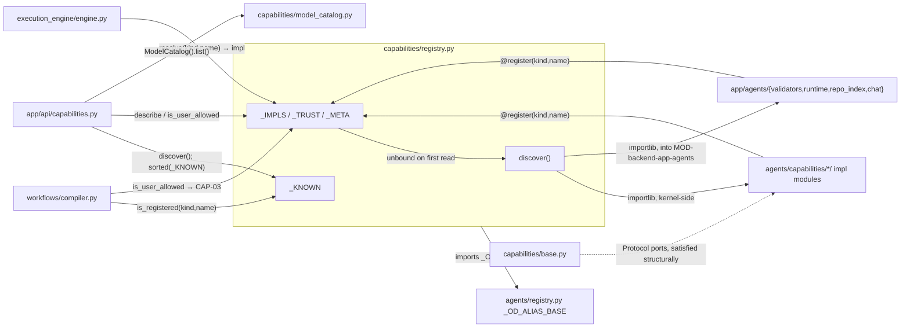
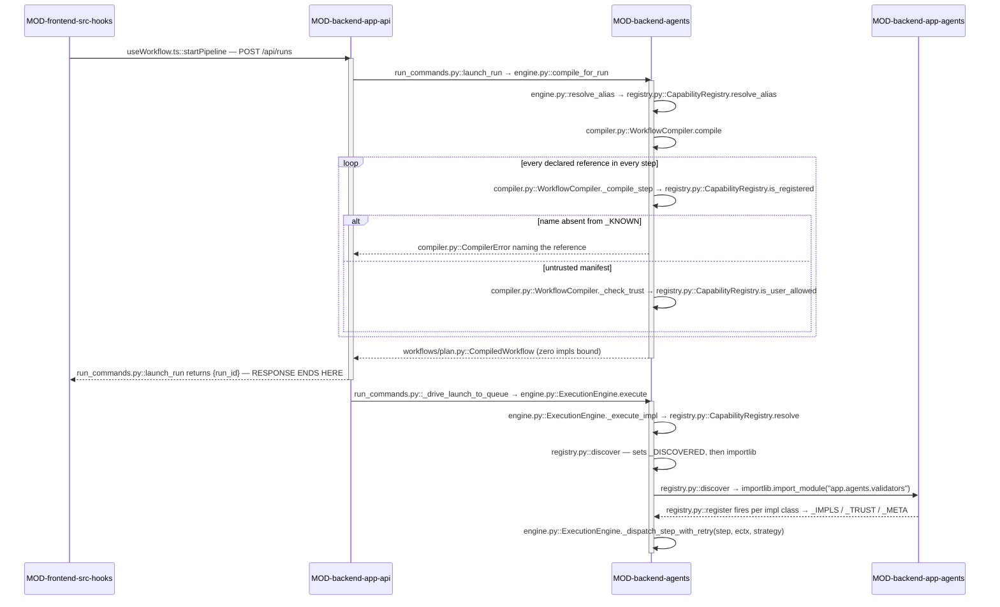

<!-- AUTO-GENERATED BELOW THIS LINE — regenerated by tools/knowledge/build_architecture.py -->

### Members (4 files across 2 modules)

**[MOD-backend-agents](MOD-backend-agents.md)**
- [backend/agents/capabilities/__init__.py](../../backend/agents/capabilities/__init__.py)
- [backend/agents/capabilities/base.py](../../backend/agents/capabilities/base.py)
- [backend/agents/capabilities/registry.py](../../backend/agents/capabilities/registry.py)

**[MOD-backend-app-api](MOD-backend-app-api.md)**
- [backend/app/api/capabilities.py](../../backend/app/api/capabilities.py)

### Imported by, from outside this domain (82)
- [backend/agents/capabilities/compaction/chat_history.py](../../backend/agents/capabilities/compaction/chat_history.py)
- [backend/agents/capabilities/compaction/html_skeleton.py](../../backend/agents/capabilities/compaction/html_skeleton.py)
- [backend/agents/capabilities/context_pack/__init__.py](../../backend/agents/capabilities/context_pack/__init__.py)
- [backend/agents/capabilities/context_pack/pack.py](../../backend/agents/capabilities/context_pack/pack.py)
- [backend/agents/capabilities/context_providers/conversation.py](../../backend/agents/capabilities/context_providers/conversation.py)
- [backend/agents/capabilities/context_providers/opendesign.py](../../backend/agents/capabilities/context_providers/opendesign.py)
- [backend/agents/capabilities/context_providers/previous_run.py](../../backend/agents/capabilities/context_providers/previous_run.py)
- [backend/agents/capabilities/context_providers/repo.py](../../backend/agents/capabilities/context_providers/repo.py)
- [backend/agents/capabilities/context_providers/uploaded_files.py](../../backend/agents/capabilities/context_providers/uploaded_files.py)
- [backend/agents/capabilities/deliverables/ppt.py](../../backend/agents/capabilities/deliverables/ppt.py)
- [backend/agents/capabilities/deliverables/repo_diff.py](../../backend/agents/capabilities/deliverables/repo_diff.py)
- [backend/agents/capabilities/deliverables/serialized_sandbox.py](../../backend/agents/capabilities/deliverables/serialized_sandbox.py)
- [backend/agents/capabilities/deliverables/single_file.py](../../backend/agents/capabilities/deliverables/single_file.py)
- [backend/agents/capabilities/deliverables/streamed_text.py](../../backend/agents/capabilities/deliverables/streamed_text.py)
- [backend/agents/capabilities/gates/__init__.py](../../backend/agents/capabilities/gates/__init__.py)
- [backend/agents/capabilities/gates/approval.py](../../backend/agents/capabilities/gates/approval.py)
- [backend/agents/capabilities/gates/conditional.py](../../backend/agents/capabilities/gates/conditional.py)
- [backend/agents/capabilities/gates/human.py](../../backend/agents/capabilities/gates/human.py)
- [backend/agents/capabilities/gates/security.py](../../backend/agents/capabilities/gates/security.py)
- [backend/agents/capabilities/gates/validation.py](../../backend/agents/capabilities/gates/validation.py)
- [backend/agents/capabilities/hooks/__init__.py](../../backend/agents/capabilities/hooks/__init__.py)
- [backend/agents/capabilities/hooks/audit_logger.py](../../backend/agents/capabilities/hooks/audit_logger.py)
- [backend/agents/capabilities/hooks/behavioral.py](../../backend/agents/capabilities/hooks/behavioral.py)
- [backend/agents/capabilities/hooks/otel_tracing.py](../../backend/agents/capabilities/hooks/otel_tracing.py)
- [backend/agents/capabilities/hooks/secret_scan.py](../../backend/agents/capabilities/hooks/secret_scan.py)
- …and 57 more

### Imports, from outside this domain (8)
- [backend/agents/__init__.py](../../backend/agents/__init__.py)
- [backend/agents/capabilities/model_catalog.py](../../backend/agents/capabilities/model_catalog.py)
- [backend/agents/registry.py](../../backend/agents/registry.py)
- [backend/app/__init__.py](../../backend/app/__init__.py)
- [backend/app/core/__init__.py](../../backend/app/core/__init__.py)
- [backend/app/core/dependencies.py](../../backend/app/core/dependencies.py)
- [backend/app/models/__init__.py](../../backend/app/models/__init__.py)
- [backend/app/models/user.py](../../backend/app/models/user.py)

### External
fastapi, pydantic
<!-- /AUTO-GENERATED -->

## Purpose

This domain owns the **name seam**: the single `(kind, name)` namespace through
which every declared capability in the system is validated, trust-checked,
described and finally resolved to a live object. [registry.py](../../backend/agents/capabilities/registry.py) holds the
namespace and the four accessors over it; [base.py](../../backend/agents/capabilities/base.py) holds the `typing.Protocol`
ports those objects satisfy structurally; [app/api/capabilities.py](../../backend/app/api/capabilities.py) projects the
namespace outward as the composer's palette. Without it, SC-001 collapses
immediately — the kernel would have to know capability names to dispatch them,
which is exactly the `if pipeline_type == …` the architecture forbids. The
kernel instead says `resolve("strategy", step.strategy)` and stays ignorant of
what came back. That is why 154 files reach into these four.

The domain owns the *seam*, not what sits behind it. Every concrete capability
belongs to a neighbour: execution strategies and task parsers to
DOMAIN-execution-strategies, validators and post-steps to
DOMAIN-validation-and-quality, gates to DOMAIN-hitl-gating, deliverable
resolvers to DOMAIN-deliverables-and-artifacts, context providers to
DOMAIN-context-assembly, runtime adapters and the `model_catalog` data
capability to DOMAIN-agent-runtime. The port *declarations* in [base.py](../../backend/agents/capabilities/base.py) are
here; the classes satisfying them are not. Likewise, deciding *whether a
manifest is legal* is DOMAIN-workflow-compilation's job — [compiler.py](../../backend/agents/workflows/compiler.py) is this
domain's largest caller, not a member of it. The rule of thumb: if the question
is "how is this capability named, trusted, or found", it is here; if it is "what
does this capability do when it runs", it is next door.

## Shape

**`_KNOWN` (the name set) and `_IMPLS` (the bound objects) are two separate maps
on purpose — the compiler validates every manifest reference through
`is_registered` with zero capability implementations imported, and only the
first `resolve()` (or `is_user_allowed` / `describe`) trips `discover()` into
importing them.** Every other property of this domain follows from that split.

- **The name set** — `_KNOWN` in [registry.py](../../backend/agents/capabilities/registry.py) is a module-level literal
  populated at *registry* import, with no implementation attached. It is the
  only thing `is_registered` consults. `register` may add pairs to it, so it is
  a floor rather than a fixed list, and `kind` is a free string: there is no
  central `if/elif` over kinds anywhere, which is how `chat`, `mcp_server` and
  `integration_provider` were added without editing dispatch code.
- **The binder** — `register(kind, name, *, user_allowed, description,
  config_schema)` is a class decorator with four side effects *per invocation*
  (add to `_KNOWN`, bind an instance into `_IMPLS`, record the trust flag in
  `_TRUST`, record display metadata in `_META`) and it returns the class
  unchanged. A single class may carry multiple `@register` decorators, each
  with a distinct (kind, name) pair — e.g., `HumanGate` is registered under
  both `("gate", "human")` and `("gate", "before-human")`. Capability modules
  across the whole tree carry such decorators; none of them is named here.
- **The importer** — `discover()` in [registry.py](../../backend/agents/capabilities/registry.py) walks an explicit, hand-written
  tuple of module paths plus a tuple of forward packages. It sets `_DISCOVERED`
  *before* importing, so a capability module that imports the registry at import
  time cannot recurse. A forward package that does not exist yet is skipped
  silently; one that exists but fails to import is logged at `warning` and
  skipped, so a single broken package degrades to "those capabilities are
  unavailable" rather than aborting all discovery.
- **The accessors** — `CapabilityRegistry` exposes `is_registered` (pure
  `_KNOWN` membership, never triggers discovery), `is_user_allowed` (the CAP-03
  trust read, default `False`), `describe` (the `{description, config_schema}`
  projection, default empty), `resolve` (checks `_KNOWN` *first*, then a static
  dict lookup on `_IMPLS`; `KeyError` for an unknown name, `RuntimeError` for a
  known name with nothing bound) and `resolve_alias`.
- **The ports** — [base.py](../../backend/agents/capabilities/base.py) declares fifteen `@runtime_checkable` Protocols, each
  with a `name: str` attribute and exactly one method: `TaskParser`,
  `ExecutionStrategy`, `Validator`, `DeliverableResolver`, `ContextProvider`,
  `InputContentProvider`, `PostStep`, `GateHandler`, `PromptAssemblyPolicy`,
  `AgentRuntimeAdapter`, `HookHandler`, `ToolProvider`, `SkillProvider`,
  `HookProvider`, `IntegrationProvider`. It imports `typing` and nothing else;
  runtime objects are typed `Any` so the port module never gains an inbound
  dependency on the plan dataclasses.
- **The palette projection** — [app/api/capabilities.py](../../backend/app/api/capabilities.py) calls
  `registry_mod.discover()`, iterates `sorted(registry_mod._KNOWN)`, drops the
  `model_catalog` kind (surfaced expanded instead), and per pair reads
  `describe` + `is_user_allowed`, deriving `security_gated` as `not
  user_allowed` rather than storing it.

**Module crossings.** Two, both worth knowing. Outbound: `discover()` lives in
[MOD-backend-agents](MOD-backend-agents.md) but reaches *into* [MOD-backend-app-agents](MOD-backend-app-agents.md), importing
`app.agents.validators`, `app.agents.runtime`, `app.agents.repo_index` and
`app.agents.chat` purely to fire their `@register` decorators. It does so
through `importlib.import_module` on a string, which is why the import-linter
contract `agents.capabilities must not import the execution kernel or the web
layer` stays green over a package that demonstrably pulls in `app.*` at
runtime — the contract is static and cannot see it. The app-side impls import
the port back, which is the legal direction; nothing app-side is imported by
name at module top-level. Inbound: [app/api/capabilities.py](../../backend/app/api/capabilities.py) in
[MOD-backend-app-api](MOD-backend-app-api.md) reads the private `_KNOWN` set directly rather than through
an accessor, which is the one place the namespace is enumerated instead of
queried.

## In practice

### The path, by call

### Step by step

**Launch (the request the browser makes)**

1. `useWorkflow.ts::startPipeline` builds the `run_pipeline` payload and hands it
   to `runConnection.sendCommand`, which sends it as `POST /api/runs`.
2. [run_commands.py::launch_run](../../backend/app/api/run_commands.py) authenticates via `get_current_user`, runs the
   ingress validation (pipeline-type entitlement, agent allow-list,
   `model_overrides`, images), and mints the `WorkflowRun`.

**Compile — the membership pass, impl-free**

3. [engine.py::compile_for_run](../../backend/agents/execution_engine/engine.py) (an `lru_cache`d module function) calls
   [engine.py::resolve_alias](../../backend/agents/execution_engine/engine.py), which delegates to
   [registry.py::CapabilityRegistry.resolve_alias](../../backend/agents/capabilities/registry.py) — the one place
   `od_prototype` becomes `prototype`.
4. `manifest.py::load_manifest` reads `agents/workflows/<id>/workflow.yaml`. An
   unresolvable id raises `FileNotFoundError` here, before the registry is
   touched.
5. [compiler.py::WorkflowCompiler.compile](../../backend/agents/workflows/compiler.py) walks the manifest. Nothing in this
   domain has imported a capability implementation yet.
6. For each step, [compiler.py::WorkflowCompiler._compile_step](../../backend/agents/workflows/compiler.py) calls
   [registry.py::CapabilityRegistry.is_registered](../../backend/agents/capabilities/registry.py) once per declared reference —
   strategy, each gate, each hook, each validator, compaction, post_step,
   `task_source.parser` — plus the workflow-level `context_provider` /
   `input_provider` lists and the deliverable resolver.
7. `is_registered` is a bare `(kind, name) in _KNOWN` test. It never calls
   `discover()`, so the whole compile completes with `_IMPLS` still empty. An
   unknown name raises `CompilerError` naming the reference and the step.
8. At the *same* call site, [compiler.py::WorkflowCompiler._check_trust](../../backend/agents/workflows/compiler.py) runs. For
   a file-backed manifest `trusted` is `True` and it returns immediately; for a
   `user`/`db` manifest it calls [registry.py::CapabilityRegistry.is_user_allowed](../../backend/agents/capabilities/registry.py),
   which *does* force `discover()` so `_TRUST` is bound.
9. The compiler returns a typed `CompiledWorkflow`.

**The response returns before the work does**

10. [run_commands.py::launch_run](../../backend/app/api/run_commands.py) spawns [run_commands.py::_drive_launch_to_queue](../../backend/app/api/run_commands.py)
    as a background task and returns `{run_id}` to the browser. Every step below
    happens after the HTTP response has already been sent; the frontend attaches
    to the run's event stream to see it.

**Execute — the resolution pass, impls bound**

11. [engine.py::ExecutionEngine.execute](../../backend/agents/execution_engine/engine.py) delegates to
    [engine.py::ExecutionEngine._execute_impl](../../backend/agents/execution_engine/engine.py), which re-enters `compile_for_run`
    (cache hit) and asserts the compiled step agent-ids equal
    `agents/registry.py::get_pipeline_agents` membership.
12. Per step, `_execute_impl` calls [registry.py::CapabilityRegistry.resolve](../../backend/agents/capabilities/registry.py) with
    `("strategy", step.strategy)`. The engine never names a strategy in source —
    this is the SC-001 seam.
13. `resolve` re-checks `_KNOWN` **first** and raises `KeyError` for a name outside
    it, so a manifest-sourced string never reaches the impl map.
14. On this first `resolve`, `_DISCOVERED` is still `False`, so [registry.py::discover](../../backend/agents/capabilities/registry.py)
    runs. It sets `_DISCOVERED = True` *before* importing, so a capability module
    that imports the registry at its own import time cannot recurse.
15. `discover` `importlib.import_module`s each entry of its hand-written
    `_builtin_modules` tuple, then each `_forward_packages` entry inside a
    `try`. A `ModuleNotFoundError` is a silent skip; any other `ImportError` is
    logged at `warning` and skipped.
16. Four of those forward packages are app-side — `app.agents.validators`,
    `app.agents.runtime`, `app.agents.repo_index`, `app.agents.chat`. Importing
    them fires their [registry.py::register](../../backend/agents/capabilities/registry.py) decorators, which populate `_IMPLS`,
    `_TRUST` and `_META` and return each class unchanged.
17. `resolve` returns `_IMPLS[(kind, name)]`, or raises `RuntimeError` if the name
    is known but nothing bound it.
18. [engine.py::ExecutionEngine._dispatch_step_with_retry](../../backend/agents/execution_engine/engine.py) runs the returned
    object. The engine treats it as an opaque port — the structural contract in
    [capabilities/base.py](../../backend/agents/capabilities/base.py) is all it relies on.
19. The same `resolve` seam is re-entered for gates
    ([engine.py::ExecutionEngine._evaluate_gates](../../backend/agents/execution_engine/engine.py)), workflow context providers
    ([engine.py::ExecutionEngine._seed_workflow_context](../../backend/agents/execution_engine/engine.py)), executable hooks
    ([engine.py::ExecutionEngine._resolve_executable_hooks](../../backend/agents/execution_engine/engine.py)) and finally the
    deliverable resolver. Every one of these is a cheap dict lookup —
    `_DISCOVERED` short-circuits `discover` after the first.

### What breaks if you get it wrong

**Silent, and the ones worth fearing:**

- **You add a `(kind, name)` to the `_KNOWN` literal but forget its module in
  `discover`'s `_builtin_modules`.** The compile passes — `is_registered` only
  reads `_KNOWN` — and the run starts. It dies mid-execution at
  `resolve` with `RuntimeError: … is known but has no bound impl`, after the
  earlier steps have already burned tokens and written to the sandbox. The two
  lists are coupled by convention only; nothing checks them against each other.
- **A forward package acquires a broken import** — a missing optional dependency,
  a circular import in a sibling. `discover` catches it, logs one `warning`, and
  continues. Every capability in that package is now silently unregistered, and
  the first run that references one fails at `resolve` with the same
  `RuntimeError`, far from the actual cause. The log line is the only evidence.
- **You register the same `(kind, name)` twice from two modules.** `register`
  overwrites `_IMPLS`, `_TRUST` and `_META` with no warning; the winner is
  whichever module `discover` imports last, which is import-order, not intent.
- **You omit `user_allowed=True` on a capability meant for the composer.** File-
  backed manifests keep working (`_check_trust` is a no-op when trusted), so
  nothing fails in the repo's own workflows. It surfaces only as a
  `security_gated: true` row the UI greys out, and as a `CompilerError` the first
  time a user-authored workflow references it.
- **You drop the `registry_mod.discover()` call from
  `app/api/capabilities.py::list_capabilities`.** `describe` and `is_user_allowed`
  each self-discover, so the palette still renders — but `sorted(registry_mod._KNOWN)`
  is enumerated on the line before, so any capability that exists *only* because
  its `@register` added it (rather than being in the literal) vanishes from the
  palette with no error anywhere.

**Loud, so stop worrying about them:**

- Importing a capability implementation module from [compiler.py](../../backend/agents/workflows/compiler.py), or anything
  the compiler pulls in, binds `_IMPLS` at compiler import and fails
  tests/agents/test_registry_capabilities.py in CI.
- Renaming a capability without updating the manifests that reference it fails
  at run entry with a `CompilerError` that names the bad reference and the step.
- Referencing a name outside `_KNOWN` at `resolve` is a `KeyError`, raised before
  any map access.
- Making `agents.capabilities` import the kernel or the web layer at module top
  level fails the import-linter contract.

### The other paths

**The palette read.** [CanvasConfigRail.tsx](../../frontend/src/components/workflow/composer/CanvasConfigRail.tsx) and [AgentsPopup.tsx](../../frontend/src/components/workflow/AgentsPopup.tsx) call the shared
`AgentsPopup.tsx::useAgentCapabilities` hook, which calls `api.ts::getCapabilities`
→ `GET /api/capabilities` → [capabilities.py::list_capabilities](../../backend/app/api/capabilities.py). This is the only
path that calls `registry_mod.discover()` eagerly and up front, and the only one
that *enumerates* the namespace rather than querying it: it iterates
`sorted(registry_mod._KNOWN)` directly, skips the `model_catalog` kind, and per
pair reads `CapabilityRegistry.describe` and `CapabilityRegistry.is_user_allowed`,
deriving `security_gated` as `not user_allowed`. Because the enumeration is live,
a newly `@register`'d capability appears in the composer with no edit to this
file — that is the API-02 property.

**The untrusted-manifest path.** A user-authored workflow is compiled with
`WorkflowCompiler().compile(manifest, CapabilityRegistry(), trust="user")` at both
ends: on save in [user_workflows.py](../../backend/app/api/user_workflows.py), and again at launch in
[run_engine.py::_revalidate_selections_trust_user](../../backend/app/api/run_engine.py). Same `is_registered` walk,
but `_check_trust` is now live, so `tool:spawn_subagents`, `mcp_server:filesystem`
and `mcp_server:postgres` raise `CompilerError`. Note the side effect: because
`is_user_allowed` self-discovers, this path binds every implementation at
*compile* time, which the trusted path does not.

**The warm path.** Every run after the first is almost free here.
[engine.py::compile_for_run](../../backend/agents/execution_engine/engine.py) is `lru_cache`d per `pipeline_type`, so a repeat
launch of the same workflow skips manifest load and the entire membership walk;
`_DISCOVERED` short-circuits `discover` on the first line; and `resolve` is a dict
lookup returning the same singleton instance `register` built at import. Capability
implementations are therefore process-global and stateless by construction — any
per-run state has to live in the context object passed to the call, never on the
instance.

## Why this shape

The two-map split is the load-bearing decision and it is a security property,
not a performance one. The compiler must be able to reject an unknown capability
reference at compile time; if validation went through `_IMPLS`, validating a
manifest would mean importing every capability in the tree, including the
heavy-dependency app-side ones. test_registry_capabilities.py asserts the
membership path stays impl-free at compiler import, and its module docstring
states the intent outright. The same split is what lets `resolve` be a static
dict lookup with the `_KNOWN` check ahead of it — the docstrings tie this to
T-04-01 / T-07-01-01: no attribute fetch, no expression evaluation, no dynamic
import on a name that came from a manifest.

`discover()` uses a hand-maintained tuple rather than a package auto-walk, and
the reason is recorded in its own docstring under D-01: auto-discovery gives
non-deterministic ordering, drags in unintended modules, and — the decisive
one — the import-linter cannot reason about it. This is a deliberately accepted
maintenance cost: adding a capability package means adding a line. It also
replaced something: the Phase-7 eager `install()` / `_register_builtin` binder
was deleted, and `discover()` is documented as its *single* successor under
INV-12, explicitly not a parallel path.

Trust defaults to `False` and `_check_trust` is called at the same per-reference
site as `is_registered`, so the validation path is not forked — the compiler
docstring says so directly. That is what keeps `tool:spawn_subagents`,
`mcp_server:filesystem` and `mcp_server:postgres` off a user-authored manifest
under CAP-03, while `user_allowed=True` capabilities pass. A capability with no
recorded flag — a name-only data capability like `model_catalog:default` — falls
to the safe side by construction rather than by a check.

Display metadata lives in `_META` on the registry rather than in a table in the
API layer, and [registry.py](../../backend/agents/capabilities/registry.py) records why: a static metadata map in `app/api/`
would be a second hardcoded source, and a newly `@register`'d capability would
then appear in the live `_KNOWN` enumeration but with no description — eroding
the API-02 property that a new capability needs no endpoint edit. `security_gated`
is derived from the trust flag for the same reason. Similarly, the
`od_prototype -> prototype` alias is lifted from `agents.registry._OD_ALIAS_BASE`
instead of being restated, under MAN-05 / D-04.

One thing is not recorded: why [app/api/capabilities.py](../../backend/app/api/capabilities.py) enumerates the private
`_KNOWN` directly instead of the registry exposing a public listing accessor. No
design note, card, or test explains it, and there is no comment at the call site.
