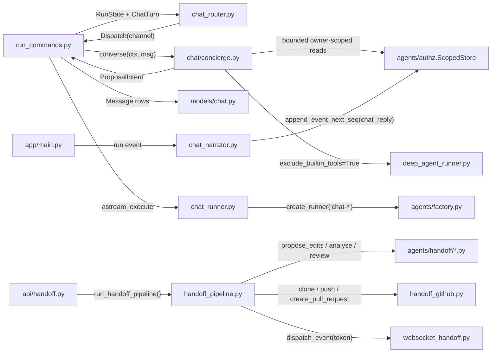
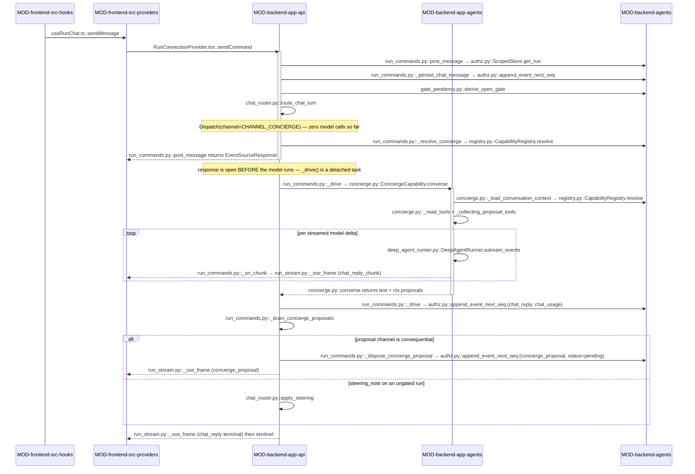

<!-- AUTO-GENERATED BELOW THIS LINE — regenerated by tools/knowledge/build_architecture.py -->

### Members (17 files across 4 modules)

**[MOD-backend-app-agents](MOD-backend-app-agents.md)**
- [backend/app/agents/chat/__init__.py](../../backend/app/agents/chat/__init__.py)
- [backend/app/agents/chat/concierge.py](../../backend/app/agents/chat/concierge.py)
- [backend/app/agents/chat_narrator.py](../../backend/app/agents/chat_narrator.py)
- [backend/app/agents/chat_runner.py](../../backend/app/agents/chat_runner.py)
- [backend/app/agents/handoff/__init__.py](../../backend/app/agents/handoff/__init__.py)
- [backend/app/agents/handoff/classifier.py](../../backend/app/agents/handoff/classifier.py)
- [backend/app/agents/handoff/coder.py](../../backend/app/agents/handoff/coder.py)
- [backend/app/agents/handoff/compliance_agent.py](../../backend/app/agents/handoff/compliance_agent.py)
- [backend/app/agents/handoff/test_agent.py](../../backend/app/agents/handoff/test_agent.py)

**[MOD-backend-app-api](MOD-backend-app-api.md)**
- [backend/app/api/chat_router.py](../../backend/app/api/chat_router.py)
- [backend/app/api/chats.py](../../backend/app/api/chats.py)
- [backend/app/api/handoff.py](../../backend/app/api/handoff.py)
- [backend/app/api/websocket_handoff.py](../../backend/app/api/websocket_handoff.py)

**[MOD-backend-app-models](MOD-backend-app-models.md)**
- [backend/app/models/chat.py](../../backend/app/models/chat.py)
- [backend/app/models/handoff.py](../../backend/app/models/handoff.py)

**[MOD-backend-app-services](MOD-backend-app-services.md)**
- [backend/app/services/handoff_github.py](../../backend/app/services/handoff_github.py)
- [backend/app/services/handoff_pipeline.py](../../backend/app/services/handoff_pipeline.py)

### Imported by, from outside this domain (7)
- [backend/app/api/api_key_auth.py](../../backend/app/api/api_key_auth.py)
- [backend/app/api/mcp.py](../../backend/app/api/mcp.py)
- [backend/app/api/run_commands.py](../../backend/app/api/run_commands.py)
- [backend/app/api/run_stream.py](../../backend/app/api/run_stream.py)
- [backend/app/api/settings.py](../../backend/app/api/settings.py)
- [backend/app/main.py](../../backend/app/main.py)
- [backend/app/models/__init__.py](../../backend/app/models/__init__.py)

### Imports, from outside this domain (26)
- [backend/agents/__init__.py](../../backend/agents/__init__.py)
- [backend/agents/authz.py](../../backend/agents/authz.py)
- [backend/agents/capabilities/__init__.py](../../backend/agents/capabilities/__init__.py)
- [backend/agents/capabilities/gate_pendency.py](../../backend/agents/capabilities/gate_pendency.py)
- [backend/agents/capabilities/registry.py](../../backend/agents/capabilities/registry.py)
- [backend/agents/execution_engine/__init__.py](../../backend/agents/execution_engine/__init__.py)
- [backend/agents/execution_engine/engine.py](../../backend/agents/execution_engine/engine.py)
- [backend/agents/factory.py](../../backend/agents/factory.py)
- [backend/app/__init__.py](../../backend/app/__init__.py)
- [backend/app/agents/__init__.py](../../backend/app/agents/__init__.py)
- [backend/app/agents/cached_invoke.py](../../backend/app/agents/cached_invoke.py)
- [backend/app/agents/deep_agent_runner.py](../../backend/app/agents/deep_agent_runner.py)
- [backend/app/agents/llm_errors.py](../../backend/app/agents/llm_errors.py)
- [backend/app/agents/model_factory.py](../../backend/app/agents/model_factory.py)
- [backend/app/api/__init__.py](../../backend/app/api/__init__.py)
- [backend/app/api/api_key_auth.py](../../backend/app/api/api_key_auth.py)
- [backend/app/api/run_engine.py](../../backend/app/api/run_engine.py)
- [backend/app/core/__init__.py](../../backend/app/core/__init__.py)
- [backend/app/core/config.py](../../backend/app/core/config.py)
- [backend/app/core/crypto.py](../../backend/app/core/crypto.py)
- [backend/app/core/dependencies.py](../../backend/app/core/dependencies.py)
- [backend/app/models/__init__.py](../../backend/app/models/__init__.py)
- [backend/app/models/database.py](../../backend/app/models/database.py)
- [backend/app/models/schemas.py](../../backend/app/models/schemas.py)
- [backend/app/models/user.py](../../backend/app/models/user.py)
- …and 1 more

### External
fastapi, httpx, langchain_core, pydantic
<!-- /AUTO-GENERATED -->

## Purpose

This domain owns every place a human talks to Velocity in prose rather than by
starting a workflow — and, crucially, owns the rule that prose is never allowed
to become an action on its own. Three surfaces live here: the **run chat lane**
(a user typing at a run that is mid-flight, paused at a gate, or finished), the
**milestone narrator** (the run talking back, as `chat_reply` cards), and the
**IDE handoff** (`/flowin-handoff` — a task + transcript arrives from an editor
over `POST /api/handoff/receive` and leaves as a GitHub pull request). Without
it the kernel would still run workflows, but a run would be a fire-and-forget
black box: no way to steer it mid-flight, no way to answer a clarify gate or
approve a review gate by typing, no way to ask what it produced, and no path in
from an IDE at all. It is also where the system's most dangerous input lives —
free text, plus untrusted deliverable content the model reads back — so the
domain's real job is converting that into a *proposal* the app layer disposes,
never into a write.

It begins at the up-channel turn and ends at the moment a decision is handed to
an existing command seam; it does not own the seams themselves. Deciding that a
turn is a gate action belongs here; arming, pausing and resuming that gate is
[DOMAIN-hitl-gating](DOMAIN-hitl-gating.md). Deciding that a post-terminal turn
is a revision belongs here; minting and running the child family run is
[DOMAIN-execution-kernel](DOMAIN-execution-kernel.md). The narrator writes
`chat_reply` rows, but the `run_events` stamping boundary, seq allocation and
replay are [DOMAIN-durable-state-resume](DOMAIN-durable-state-resume.md), and
delivering those rows to the browser is
[DOMAIN-run-streaming](DOMAIN-run-streaming.md). The Concierge and
`HandoffCoder` both call a model, but *how* a model is built and streamed is
[DOMAIN-agent-runtime](DOMAIN-agent-runtime.md); the owner-scoped read surface
they call through (`ScopedStore`) is
[DOMAIN-auth-and-entitlements](DOMAIN-auth-and-entitlements.md). One member is
a deliberate outlier: [chat_runner.py](../../backend/app/agents/chat_runner.py) is the *legacy free-chat* sequencer
(phases Discovery → Requirements → … → Preview), a subsystem parallel to the
kernel with its own event vocabulary — it is here because it is a
conversational surface, not because it shares the mechanism below.

## Shape

**Nothing in this domain executes a consequential state change. Every member is
either pure, a projection of an event that already happened, or a producer of a
structured intent — and the write always happens outside, on a seam that
existed before chat did.** `route_chat_turn` is a pure function with zero model
calls; `ConciergeCapability`'s tools are read-or-propose only and its
`propose_*` tools return a `ProposalIntent` dataclass with no behaviour;
`project_milestone_card` maps an already-emitted run event to a card;
`HandoffCoder.propose_edits` returns a JSON edit plan that
`run_handoff_pipeline` applies under `_safe_workspace_join` path validation.
That is the invariant a maintainer must not break.

- **Mechanical routing (zero model calls).** [chat_router.py](../../backend/app/api/chat_router.py) holds
  `RunState`, `ChatTurn`, `Dispatch` and `route_chat_turn`. `RunState.phase`
  collapses the run's generic signals into one of four phases —
  `PHASE_CLARIFY_WAITING`, `PHASE_GATE_PAUSED`, `PHASE_RUNNING`,
  `PHASE_TERMINAL` — and the turn maps onto `CHANNEL_ANSWERS`, `CHANNEL_GATE`,
  `CHANNEL_STEERING`, `CHANNEL_REVISION` or `CHANNEL_CONCIERGE`. The refusals
  matter as much as the routes: a turn at a gate with no explicit
  `GATE_ACTIONS` value falls through to the Concierge rather than defaulting to
  approve, a bare text turn at a clarify gate does not silently submit as a
  freeform answer, and a gate action after a `TERMINAL_STATUSES` run returns
  `Dispatch(fenced=True, code="pipeline_not_running")` with no write at all.
- **Two escape hatches into a live run.** `apply_steering` and
  `apply_turn_images` append onto `ectx.steering_notes` /
  `ectx.pending_turn_images` on a live `ExecutionContext` — consume-once queues
  the kernel drains at the *next* dispatch, never mid-generation. Both are
  best-effort: an `ectx` without the attribute is a no-op, because the durable
  chat row is the real record.
- **The Concierge ([chat/concierge.py](../../backend/app/agents/chat/concierge.py)).** One per-run conversational
  orchestrator. Its eight read tools (`get_run_progress`, `list_agents`,
  `get_agent_output`, `list_artifacts`, `get_artifact`, `read_recent_events`,
  `read_gate_history`, `get_token_usage`) are closures over a `ScopedStore` and
  the `run_id` — `run_id` is deliberately not a tool parameter, so the model has
  no syntax for naming another run, and `get_artifact` re-checks the row's
  `run_id` because `ScopedStore.get_ref` scopes by owner but not by run. Every
  result is hard-capped (`_clip`, `_EVENT_ROW_CHARS`, `_ARTIFACT_CHARS_MAX`,
  `_CONCIERGE_EVENT_TYPES` as an allow-list). Proposals are captured on a
  per-request collector built by `_collecting_proposal_tools` and stashed on the
  *ctx*, not on `self`, because the capability is a shared singleton. When a
  child revision run is active, `get_run_progress` and `list_agents` read the
  revision run's events instead of the parent's (via `active_revision_run_id`,
  passed from the app layer) so the Concierge reports accurate progress on the
  child pipeline.
- **The narrator ([chat_narrator.py](../../backend/app/agents/chat_narrator.py)).** `project_milestone_card` classifies a
  generic engine event into one of `CARD_CLARIFY` / `CARD_GATE` /
  `CARD_PIPELINE` / `CARD_DELIVERABLE` / `CARD_SPEC_REVISION`;
  `persist_milestone_card` writes it as a `chat_reply` row through
  `ScopedStore.append_event_next_seq` and, only when the row was actually
  created, mints the card's single-use `deep_link` nonce via
  `mint_deep_link_nonce`. `consume_deep_link` burns it once.
- **Handoff.** [api/handoff.py](../../backend/app/api/handoff.py) mints a token, guards the start with a
  conditional `UPDATE` (so a double-click cannot open two PRs), and detaches
  `run_handoff_pipeline` as a background task on a fresh session.
  [handoff_pipeline.py](../../backend/app/services/handoff_pipeline.py) is an async generator over WS-shaped events walking
  clone → classify → code → test → compliance → commit → push → PR;
  [handoff_github.py](../../backend/app/services/handoff_github.py) is the only place `git` is invoked, under rlimits, a
  90-second wall clock and a scrubbed env. [websocket_handoff.py](../../backend/app/api/websocket_handoff.py) fans events
  to the browser through an in-process `_SUBSCRIBERS` dict keyed by token.
- **Persistence.** [models/handoff.py](../../backend/app/models/handoff.py) carries `HandoffSession`,
  `UserGithubCredential` (Fernet-encrypted PAT) and `UserApiKey` (SHA-256 hash,
  8-char prefix only). [models/chat.py](../../backend/app/models/chat.py) + [api/chats.py](../../backend/app/api/chats.py) are the older
  per-user `ChatSession`/`Message` CRUD that the free-chat `ChatRunner` path
  writes into — separate from the run-chat lane's `run_events` rows.

Module crossings, and the direction each one runs:

- `app.api → app.agents`: [run_commands.post_message](../../backend/app/api/run_commands.py) calls
  `route_chat_turn` and then, only on `CHANNEL_CONCIERGE`, invokes the model.
  The router classifies; the caller invokes. Putting a model call in
  [chat_router.py](../../backend/app/api/chat_router.py) would break the property its tests rest on.
- `app.agents.chat → agents.capabilities` (port direction only): the Concierge
  imports `register` and `ScopedStore`, never `agents.execution_engine`. The
  registry pulls the impl in by importing `app.agents.chat`, so the arrow is
  `capabilities → app`, never the reverse.
- `app.agents.chat_runner → agents.factory`: `ChatRunner.__init__` builds seven
  `chat-*` runners via `create_runner`. This is the free-chat path reaching the
  kernel's agent-construction layer while bypassing `ExecutionEngine` entirely.
- `app.api.handoff → app.services → app.agents.handoff`: the HTTP layer never
  touches an agent directly; `run_handoff_pipeline` is the only caller of
  `CodingAgent`/`HandoffCoder`, `TestAgent`, `ComplianceAgent` and
  `classify_task`, and the only writer of the workspace.

## In practice

The journey below is the one that exercises the whole domain: a user types a
free-text question into the lane of a run that is paused at a review gate, the
Concierge answers it from real run data, and it surfaces a gate-approval
proposal that is *held* rather than executed.

### The path, by call

### Step by step

**The turn leaves the browser**

1. The lane's composer calls `useRunChat.ts::sendMessage`, which renders the
   user's bubble optimistically and folds `{ concierge: true }` onto the
   payload — the generic free-form marker, set by
   `DashboardLayout.tsx::onRunChatSend`, never by a workflow-name branch.
2. `RunConnectionProvider.tsx::sendCommand` POSTs it to
   `POST /api/runs/{run_id}/messages`.

**Ownership, then the durable record**

3. [run_commands.py::post_message](../../backend/app/api/run_commands.py) filters `WorkflowRun` by `id` **and**
   `user_id` (missing or cross-owner → 404, never 403), and captures
   `wr.title` + the first 400 characters of `wr.output` as the run summary the
   Concierge will see without spending a tool call.
4. It builds a `ScopedStore(owner_id, workspace_id)` and re-resolves the run
   through [authz.py::ScopedStore.get_run](../../backend/agents/authz.py) — the default-deny check, so the
   ownership boundary lives in one place.
5. Any attached images pass `_validate_images` **before** anything is written;
   a cap violation is a 400 with nothing persisted. Attached files are merged
   into a steering note with the user's message as the instruction (if any),
   so agents know both *that* a file was provided and *what to do with it*.
6. [run_commands.py::_persist_chat_message](../../backend/app/api/run_commands.py) appends the turn as a
   `chat_message` row via [authz.py::ScopedStore.append_event_next_seq](../../backend/agents/authz.py), keyed
   `chat:{message_id}` — so a double-submitted turn is a no-op, and the command
   that follows is always backed by a durable record. Attachment bytes are
   never stored; only `retained:false` refs.

**Mechanical classification — still zero model calls**

7. `post_message` reads the run's own events and calls
   [gate_pendency.py::derive_open_gate](../../backend/agents/capabilities/gate_pendency.py); for a review gate it additionally
   requires [run_commands.py::_gate_is_pending](../../backend/app/api/run_commands.py), so a gate the engine skipped
   never fabricates a pause.
8. It assembles [chat_router.py::RunState](../../backend/app/api/chat_router.py) + [chat_router.py::ChatTurn](../../backend/app/api/chat_router.py) and
   calls [chat_router.py::route_chat_turn](../../backend/app/api/chat_router.py). The turn carries the concierge
   marker and no `action`/`responses`, so it returns
   `Dispatch(channel=CHANNEL_CONCIERGE)` — had it carried `action="approve"`
   it would have gone straight to `set_review_response` with no model involved.

**The model, behind an already-returned response**

9. [run_commands.py::_resolve_concierge](../../backend/app/api/run_commands.py) resolves `chat:concierge` through
   `capabilities/registry.py::CapabilityRegistry.resolve` after `discover()`.
10. `post_message` builds [run_commands.py::_ConciergeCtx](../../backend/app/api/run_commands.py) (scoped store,
    `compile_for_run(wr_type)` as data, run summary, `open_gate`, chain hints,
    and `active_revision_run_id` if a child revision is running)
    and **returns an `EventSourceResponse` immediately**. The work runs in
    [run_commands.py::_drive](../../backend/app/api/run_commands.py), held in `_CONCIERGE_STREAM_TASKS` and never
    cancelled on client disconnect.
11. [concierge.py::ConciergeCapability.converse](../../backend/app/agents/chat/concierge.py) builds the eight read tools
    closed over the store and `run_id`, plus a per-request collector from
    [concierge.py::_collecting_proposal_tools](../../backend/app/agents/chat/concierge.py), and loads the bounded
    transcript through [concierge.py::_load_conversation_context](../../backend/app/agents/chat/concierge.py).
    The `active_revision_run_id` is threaded into the read tools so
    `get_run_progress` and `list_agents` can read the child revision run's events.
12. It constructs [deep_agent_runner.py::DeepAgentRunner](../../backend/app/agents/deep_agent_runner.py) with
    `exclude_builtin_tools=True` and drains `astream_events`, summing every
    `usage` event and handing each text delta to [run_commands.py::_on_chunk](../../backend/app/api/run_commands.py),
    which puts a transient `chat_reply_chunk` frame on the queue.

**Durable side effects, then the terminal frame**

13. `_drive` writes the answer as one `chat_reply` row (`chat-reply:{message_id}`)
    and, when usage was observed, a `chat_usage` row priced by
    `estimate_cost_usd` — never folded into the run's own `token_usage`.
14. [run_commands.py::_drain_concierge_proposals](../../backend/app/api/run_commands.py) reads and clears the
    ctx-scoped buffer via [concierge.py::ConciergeCapability.drain_proposals](../../backend/app/agents/chat/concierge.py).
15. For each intent, [run_commands.py::_dispose_concierge_proposal](../../backend/app/api/run_commands.py) runs. A
    `gate_action` is in `_CONSEQUENTIAL_PROPOSAL_CHANNELS`, so with
    `confirmed=False` it writes a `concierge_proposal` row with
    `status="pending"` and executes nothing.
16. `_drive` emits one `concierge_proposal` SSE frame per held proposal —
    carrying the *same* `event_id` as the durable row so the frontend's
    `seenRef` dedup drops the later re-fetch — then the terminal `chat_reply`
    frame and the `None` sentinel that ends the stream.
17. `sendCommand` content-negotiates on `text/event-stream`, drains the body,
    and fans each frame to `useRunChat.ts::handleFrame`; the user sees the
    answer plus a confirm chip.
18. Clicking the chip re-POSTs with `confirm_proposal`. `post_message` locates
    the pending row through [run_commands.py::_load_pending_proposal](../../backend/app/api/run_commands.py) and
    rebuilds `ProposalIntent.params` **from that row, not the request body** —
    then `_dispose_concierge_proposal(confirmed=True)` calls
    `set_review_response` and a `concierge-proposal-resolved:*` row is written.
    No model runs on the confirm turn.

### What breaks if you get it wrong

- **Drop `exclude_builtin_tools=True` in [concierge.py](../../backend/app/agents/chat/concierge.py).** Silent. The adapter
  then excludes only the sub-agent `task` tool and hands the model
  `write_file`/`edit_file` on an authenticated REST path. Nothing errors; the
  domain's stated invariant is simply false from then on.
- **Add a member to [chat_router.py::GATE_ACTIONS](../../backend/app/api/chat_router.py) without a matching branch
  in `post_message`.** Loud, and deliberately so:
  [run_commands.py::_deny_unknown_gate_action](../../backend/app/api/run_commands.py) fails closed rather than
  falling through to approve. The same guard exists in
  `_dispose_concierge_proposal`.
- **Trust `body.confirm_proposal["params"]` instead of the durable row.**
  Silent and security-relevant: a crafted confirm body would execute an intent
  the Concierge never proposed. The 404-on-missing behaviour is what keeps a
  cross-owner or replayed confirm from resolving anything.
- **Put a model call, an `await`, or an I/O read inside
  [chat_router.py::route_chat_turn](../../backend/app/api/chat_router.py).** Loud in CI —
  test_mechanical_router.py and test_rest_gate_commands.py pin purity and
  the refusal branches — but if it slipped through, a gate action would become
  as unreliable as an LLM guess.
- **Return the answer from the request coroutine instead of the detached
  `_drive` task.** Silent data loss: a user closing the tab mid-answer would
  lose the `chat_reply` row and any held proposal, so the transcript would show
  a question with no reply on reload.
- **Change [chat_narrator.py::_reply_event_id](../../backend/app/agents/chat_narrator.py) so the live frame and the DB
  row disagree.** Silent and cosmetic-looking: the frontend `seenRef` dedup
  misses, and every milestone card appears twice ([FIX-175](../cards/20260805-1853-FIX-175.md), and KAN-120 for the
  resumed-run "Run started" case).
- **Widen [concierge.py::_CONCIERGE_EVENT_TYPES](../../backend/app/agents/chat/concierge.py) to a deny-list.** Silent and
  expensive: it is an allow-list precisely so a new bulk event type is excluded
  by default rather than quietly re-inflating the prompt.
- **Forget to pass `active_revision_run_id` to the Concierge's read tools when a
  child revision run is active.** Silent: `get_run_progress` and `list_agents`
  will report the parent run's stale status instead of the child revision's
  actual progress, so the model answers from outdated data.
- **Bypass [handoff_pipeline.py::_safe_workspace_join](../../backend/app/services/handoff_pipeline.py) when applying an edit
  plan.** Silent until exploited: the model's `path` is attacker-influencable
  data, and this is the only check between it and the clone.

**Not your problem:** an import from `agents.capabilities` into the execution
kernel or the web layer is caught by the import-linter contract in
`backend/pyproject.toml`, and any new site that builds a deepagents graph
directly is caught by tests/agents/test_banned_patterns.py.

### The other paths

**The narrator (a run talking, with no user turn).** The engine's sink calls
the injected [chat_narrator.py::persist_milestone_card](../../backend/app/agents/chat_narrator.py), wired as
`milestone_sink=` by [run_commands.py::_drive_launch_to_queue](../../backend/app/api/run_commands.py) /
`_drive_revision_to_queue` and as `_resume_milestone_sink` in
[app/main.py](../../backend/app/main.py). `project_milestone_card` classifies the generic event, the card
is appended, and only on `created=True` is the deep-link nonce minted.
`execution_engine/engine.py::emit_milestone_card` then advances the engine's
own seq allocator past the card's seq — without that, the next engine event
collides on the per-run seq constraint and is dropped from the durable log.
With no sink injected the whole seam is dormant, which is what keeps the
characterization goldens byte-identical.

**The terminal fence (the error path).** A gate action arriving after the run
reached a `TERMINAL_STATUSES` value returns `Dispatch(fenced=True,
code="pipeline_not_running")`; `post_message` raises 409 and performs no write.
The `chat_message` row is still there — the turn is recorded even though the
command was refused. The same fence is re-checked inside
`_dispose_concierge_proposal`, because a proposal can be confirmed long after
the run it was made about has stopped.

**The revision proposal path (from Concierge).** When a user proposes a revision
via `propose_revision` in the Concierge (target=`prototype_output`, OR no target
specified and base type = `prototype`), [run_commands.py](../../backend/app/api/run_commands.py) runs the
revision analyzer via agents/revision_analyzer.py::run_analyzer
before minting the child run. The analyzer emits a `revision_analyzer_complete`
event carrying the detected `tier` (small / large / feature) and
`solution_preview`, then `_dispose_concierge_proposal` seeds the new run with
the correct tiered manifest (`prototype_revision` / `prototype_large_revision` /
`prototype_feature_revision`) and the analyzer's solution in `ectx.analyzer_solution` so the build agents inherit the analysis.

**The IDE handoff (a wholly separate journey).** `POST /api/handoff/receive`
authenticates on `X-Flowin-API-Key`, size-checks the transcript and mints a
`HandoffSession` token. The browser opens `/handoff/{token}`, and
`handoff.py::start_handoff` decrypts the stored PAT, flips the row to running
with a conditional `UPDATE` — the guard that stops a double-click opening two
PRs — and detaches `handoff.py::_run_pipeline_background`. That drives
[handoff_pipeline.py::run_handoff_pipeline](../../backend/app/services/handoff_pipeline.py), an async generator over
clone → classify → `HandoffCoder.propose_edits` → `_apply_edits` →
`TestAgent.analyse` → `ComplianceAgent.review` → commit → push →
[handoff_github.py::create_pull_request](../../backend/app/services/handoff_github.py), forwarding every yielded event to
[websocket_handoff.py::dispatch_event](../../backend/app/api/websocket_handoff.py) and persisting the final
`pipeline_complete` payload on a fresh session in `finally`. The workspace is
removed in the generator's own `finally` whether or not the PR opened. WebSocket
re-authorization happens periodically (on event cadence and timeout) so a
revoked token closes the connection with code 4003.

**The legacy free-chat path.** [chat_runner.py::ChatRunner](../../backend/app/agents/chat_runner.py) is reached from a
different entry point entirely, builds its seven `chat-*` runners through
`agents/factory.py::create_runner`, and writes into the per-user
[models/chat.py](../../backend/app/models/chat.py) tables via [api/chats.py](../../backend/app/api/chats.py) — not into `run_events`. Nothing in
the run-chat lane above touches it.

## Why this shape

**Proposal-only is a boundary, not a style.** The Concierge reads deliverable
text the pipeline produced, which is untrusted by construction — a prompt
injection buried in an artifact would otherwise reach a gate approval or a
revision mint. Because every `propose_*` tool returns an inert `ProposalIntent`
and the app layer holds it behind a confirm chip, the worst an injection
achieves is a suggestion the user must click. The confirm path was hardened
further: `run_commands` reconstructs the intent's `params` from the durable
`concierge_proposal` row located by `concierge-proposal:{message_id}:{channel}`,
not from the request body, and a missing, cross-owner or already-resolved row is
a 404 rather than a 403.

**Zero model calls in the router is what keeps chat honest about a stopped
run.** The alternative — letting an LLM read the run and decide what the user
meant — was rejected because a gate action must be exactly as reliable as
clicking the button. The terminal fence (`pipeline_not_running`) and the
"never default to approve" branches exist because both failures were seen:
test_mechanical_router.py and test_rest_gate_commands.py pin them.

**The kernel-ignorance rule reaches in here too.** [chat_router.py](../../backend/app/api/chat_router.py) and
[chat_narrator.py](../../backend/app/agents/chat_narrator.py) key only on the generic event vocabulary
(`questionnaire_ready`, `review_gate_ready`, `pipeline_*`) and generic
discriminators (`spec_revision_attempt`, a `_revision` suffix) — never on a
workflow name, `pipeline_type` or `spec.id`. That is SC-001 applied to the
conversational layer: a brand-new manifest-declared workflow gets a working
chat lane with no edit here. It also keeps the narrator dormant on scripted
golden runs, so the characterization goldens stay byte-identical.

**Why the Concierge impl lives app-side rather than under
`agents/capabilities/`.** The import-linter contract *"agents.capabilities must
not import the execution kernel or the web layer"* (`backend/pyproject.toml`)
forbids the reverse placement, and the Concierge needs `DeepAgentRunner`, which
is app-side. The resolution is the registry importing the app package to fire
`@register` — `capabilities → app`, which the contract permits.

**Every model call goes through `DeepAgentRunner`, and one bypass was deleted to
make that true.** `HandoffCoder` supersedes an older `CodingAgent` that called
`build_model(...).ainvoke(...)` directly, skipping `create_deep_agent`
entirely; the class is gone and `CodingAgent` is now an alias in
[app/agents/handoff/__init__.py](../../backend/app/agents/handoff/__init__.py), so the pipeline and its contract test bind the
same name against the compliant implementation. The banned-pattern gate
(tests/agents/test_banned_patterns.py) fails on any other site that builds a
deepagents graph. [classifier.py](../../backend/app/agents/handoff/classifier.py), [test_agent.py](../../backend/app/agents/handoff/test_agent.py) and [compliance_agent.py](../../backend/app/agents/handoff/compliance_agent.py)
still take the cheaper `cached_invoke` path — that is a real inconsistency with
the coder, and no recorded reason distinguishes them.

**Bounded reads exist because the unbounded version was measured, not
suspected.** The superseded `read_events` / `list_refs` / `get_ref` tools handed
the model an entire run: 9,227,107 characters (≈2.3M tokens) for a single
question, more input than the pipeline that produced the run. The replacement is
an allow-list (`_CONCIERGE_EVENT_TYPES`) rather than a deny-list, so a new bulk
event type is excluded by default; the fat classes (`agent_input`,
`agent_chunk`, `tool_call`, `tool_result`, `planner_complete`) are absent on
purpose. Deleting those tools would have killed multi-turn memory as a side
effect — the Concierge has no checkpointer, so `thread_id` is inert — which is
why `_load_conversation_context` resolves `context_provider:conversation` through
the registry instead of rebuilding a transcript reader.
`exclude_builtin_tools=True` on the runner is load-bearing for the same class of
reason: without it the adapter excludes only the sub-agent tool and hands the
model `write_file`/`edit_file` on a REST path.

**`active_revision_run_id` threads the child revision's existence into the
Concierge's read tools.** When a parent run's Concierge answers questions about
progress while a child revision is building, it must read the revision run's
events, not the stale parent run. The app layer (`post_message`) optionally
resolves `active_child_revision` from the current executor's registry and
threads `active_revision_run_id` into the context; the Concierge's
`get_run_progress` and `list_agents` check it and degrade to parent events on
error. Without this, the model would see "pipeline completed" in the
parent's events while the child is still running, and would refuse to answer
questions about the revision's progress.

**Idempotency in the narrator is keyed by what can legitimately repeat.**
`_reply_event_id` namespaces on the source event id in general, but "Run
started" is keyed on the run instead, because a resumed run emits a fresh
`pipeline_start` with a new `event_id` and produced a duplicate card
(KAN-120). The returned `reply_eid` is handed back so the live SSE frame carries
the same id the DB row has — otherwise the frontend's dedup misses the match and
appends the card twice ([FIX-175](../cards/20260805-1853-FIX-175.md)). The deep-link nonce moved from a
process-global in-memory set to a `deep_link_nonces` row for the ordinary
reasons: the set was unbounded, unscoped and lost on restart.

**Tier classification for prototype revision is lifted into the REST boundary
(app-side, not kernel-side).** When the Concierge's `propose_revision` targets
`prototype_output`, [run_commands.py::_dispose_concierge_proposal](../../backend/app/api/run_commands.py) calls
agents/revision_analyzer.py::run_analyzer to detect whether the
revision is small / large / feature-scoped before the child run is minted. The
analyzer runs synchronously in the REST handler (INV-1 compliance: the kernel
never reads the tier), seeds the child's `ectx.analyzer_solution` with its output
(so build agents inherit the analysis), and the tier determines which manifest is
used (`prototype_revision` / `prototype_large_revision` / `prototype_feature_revision`).
This is why the Concierge's proposal path must route through the app layer
instead of the kernel: SC-001 forbids workflow-type literals in the kernel, and
the analyzer's tier classification produces one.

**Handoff is deliberately the most conservative surface in the domain.** It
executes no user code — the only subprocess is `git`, under rlimits and a
scrubbed env — and the model's edit plan is data until
`_safe_workspace_join` clears each path against absolute paths, `..` segments,
`.git` writes and symlink escapes. The `_SUBSCRIBERS` fan-out is in-process and
single-node on purpose, matching the single-container deployment; the module
records Redis pub/sub as the swap if the backend is ever sharded. Why the whole
handoff feature sits in a domain otherwise about run chat is not recorded
anywhere beyond the declared `members:` — the shared property is that both are
conversational entry points that reach a model outside `ExecutionEngine`.
