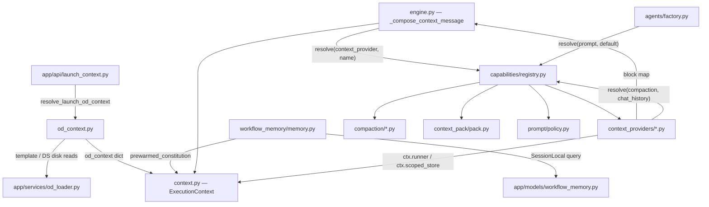
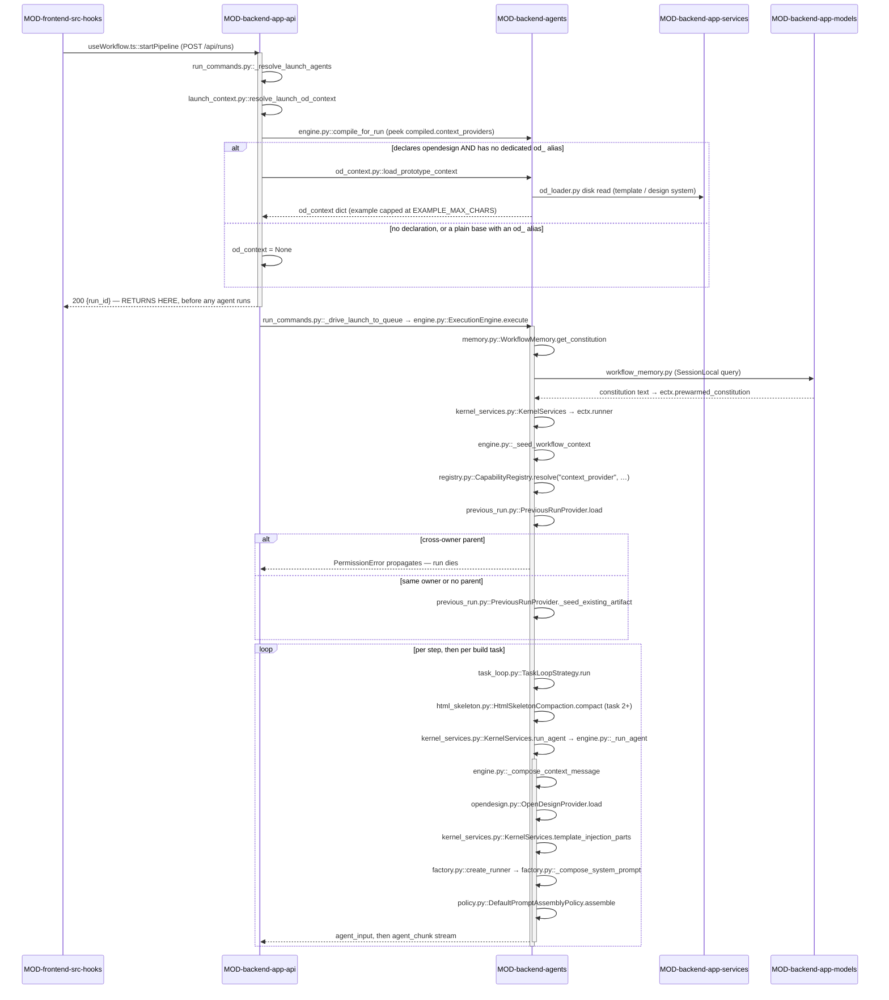

<!-- AUTO-GENERATED BELOW THIS LINE — regenerated by tools/knowledge/build_architecture.py -->

### Members (17 files across 1 modules)

**[MOD-backend-agents](MOD-backend-agents.md)**
- [backend/agents/capabilities/compaction/__init__.py](../../backend/agents/capabilities/compaction/__init__.py)
- [backend/agents/capabilities/compaction/chat_history.py](../../backend/agents/capabilities/compaction/chat_history.py)
- [backend/agents/capabilities/compaction/html_skeleton.py](../../backend/agents/capabilities/compaction/html_skeleton.py)
- [backend/agents/capabilities/context_pack/__init__.py](../../backend/agents/capabilities/context_pack/__init__.py)
- [backend/agents/capabilities/context_pack/pack.py](../../backend/agents/capabilities/context_pack/pack.py)
- [backend/agents/capabilities/context_providers/__init__.py](../../backend/agents/capabilities/context_providers/__init__.py)
- [backend/agents/capabilities/context_providers/conversation.py](../../backend/agents/capabilities/context_providers/conversation.py)
- [backend/agents/capabilities/context_providers/opendesign.py](../../backend/agents/capabilities/context_providers/opendesign.py)
- [backend/agents/capabilities/context_providers/previous_run.py](../../backend/agents/capabilities/context_providers/previous_run.py)
- [backend/agents/capabilities/context_providers/repo.py](../../backend/agents/capabilities/context_providers/repo.py)
- [backend/agents/capabilities/context_providers/uploaded_files.py](../../backend/agents/capabilities/context_providers/uploaded_files.py)
- [backend/agents/capabilities/prompt/__init__.py](../../backend/agents/capabilities/prompt/__init__.py)
- [backend/agents/capabilities/prompt/policy.py](../../backend/agents/capabilities/prompt/policy.py)
- [backend/agents/execution_engine/context.py](../../backend/agents/execution_engine/context.py)
- [backend/agents/execution_engine/od_context.py](../../backend/agents/execution_engine/od_context.py)
- [backend/agents/workflow_memory/__init__.py](../../backend/agents/workflow_memory/__init__.py)
- [backend/agents/workflow_memory/memory.py](../../backend/agents/workflow_memory/memory.py)

### Imported by, from outside this domain (33)
- [backend/agents/execution_engine/engine.py](../../backend/agents/execution_engine/engine.py)
- [backend/agents/execution_engine/kernel_services.py](../../backend/agents/execution_engine/kernel_services.py)
- [backend/agents/execution_engine/ndjson_adapter.py](../../backend/agents/execution_engine/ndjson_adapter.py)
- [backend/app/api/launch_context.py](../../backend/app/api/launch_context.py)
- [backend/app/api/settings.py](../../backend/app/api/settings.py)
- [backend/tests/agents/test_chat_history_compaction.py](../../backend/tests/agents/test_chat_history_compaction.py)
- [backend/tests/agents/test_constitution_prod.py](../../backend/tests/agents/test_constitution_prod.py)
- [backend/tests/agents/test_context_message_oracle.py](../../backend/tests/agents/test_context_message_oracle.py)
- [backend/tests/agents/test_context_pack.py](../../backend/tests/agents/test_context_pack.py)
- [backend/tests/agents/test_context_providers.py](../../backend/tests/agents/test_context_providers.py)
- [backend/tests/agents/test_conversation_provider.py](../../backend/tests/agents/test_conversation_provider.py)
- [backend/tests/agents/test_execution_context.py](../../backend/tests/agents/test_execution_context.py)
- [backend/tests/agents/test_hooks.py](../../backend/tests/agents/test_hooks.py)
- [backend/tests/agents/test_image_input_wiring.py](../../backend/tests/agents/test_image_input_wiring.py)
- [backend/tests/agents/test_iss056_clarify_quality_fixes.py](../../backend/tests/agents/test_iss056_clarify_quality_fixes.py)
- [backend/tests/agents/test_model_fallback.py](../../backend/tests/agents/test_model_fallback.py)
- [backend/tests/agents/test_per_task_capture.py](../../backend/tests/agents/test_per_task_capture.py)
- [backend/tests/agents/test_phase3_compaction.py](../../backend/tests/agents/test_phase3_compaction.py)
- [backend/tests/agents/test_prototype_image_optin.py](../../backend/tests/agents/test_prototype_image_optin.py)
- [backend/tests/agents/test_redo_gate_safety.py](../../backend/tests/agents/test_redo_gate_safety.py)
- [backend/tests/agents/test_restart_resume.py](../../backend/tests/agents/test_restart_resume.py)
- [backend/tests/agents/test_revision_gating.py](../../backend/tests/agents/test_revision_gating.py)
- [backend/tests/agents/test_sc001_reconcile.py](../../backend/tests/agents/test_sc001_reconcile.py)
- [backend/tests/agents/test_skill_directive_block.py](../../backend/tests/agents/test_skill_directive_block.py)
- [backend/tests/agents/test_steering_seam.py](../../backend/tests/agents/test_steering_seam.py)
- …and 8 more

### Imports, from outside this domain (11)
- [backend/agents/__init__.py](../../backend/agents/__init__.py)
- [backend/agents/artifacts/__init__.py](../../backend/agents/artifacts/__init__.py)
- [backend/agents/artifacts/graph.py](../../backend/agents/artifacts/graph.py)
- [backend/agents/capabilities/__init__.py](../../backend/agents/capabilities/__init__.py)
- [backend/agents/capabilities/registry.py](../../backend/agents/capabilities/registry.py)
- [backend/app/__init__.py](../../backend/app/__init__.py)
- [backend/app/models/__init__.py](../../backend/app/models/__init__.py)
- [backend/app/models/database.py](../../backend/app/models/database.py)
- [backend/app/models/workflow_memory.py](../../backend/app/models/workflow_memory.py)
- [backend/app/services/__init__.py](../../backend/app/services/__init__.py)
- [backend/app/services/od_loader.py](../../backend/app/services/od_loader.py)

### External
(none)
<!-- /AUTO-GENERATED -->

## Purpose

This domain owns the answer to one question: **when the kernel is about to invoke an
agent, what text does that agent actually see?** It covers both halves of that text —
the system prompt (identity, guardrails, skills, hooks, constitution, body) and the
per-dispatch context message (the user brief, upstream outputs, design-system and
template blocks, uploaded documents, chat history, revision subjects, steering notes) —
plus the transforms that keep either half from outgrowing the model's window. Without
it, every one of those sources would have to be a branch inside [engine.py](../../backend/agents/execution_engine/engine.py) keyed on the
workflow being run, which is precisely the thing SC-001 forbids; the L12 per-pipeline
injection branches that used to live in the kernel were deleted in favour of what is
here.

It begins at the `ExecutionContext` ([context.py](../../backend/agents/execution_engine/context.py)) — the per-run carrier every piece of
context is threaded onto — and ends at the string handed to `KernelServices.run_agent`.
It deliberately excludes three neighbours. *Which* upstream outputs reach an agent is
the `produces`/`consumes` artifact contract, owned by DOMAIN-deliverables-and-artifacts;
this domain only renders whatever `_filter_consumed_outputs` returns. *When* an agent is
dispatched at all, and the scratch fields (`build_task_number`, `current_task_block`)
that the build region reads, belong to DOMAIN-execution-kernel and
DOMAIN-execution-strategies. And the `(kind, name)` lookup itself is
DOMAIN-capability-registry — this domain is a set of registrants, not the registrar.
Ownership *checks* do run here (`assert_owns`, before any cross-run read), but the
scoping machinery they call is DOMAIN-auth-and-entitlements.

## Shape

**Nothing under `backend/agents/capabilities/` may import `app.*` or the execution
kernel — an import-linter contract in `pyproject.toml` ("agents.capabilities must not
import the execution kernel or the web layer") enforces it in CI. So every heavy read a
provider needs — design-system disk, DB rows, sandbox files, the parent run — arrives
through an object-typed handle stashed on `ExecutionContext` (`ctx.runner`,
`ctx.scoped_store`) and is reached by `getattr`, never by an import.** That single
constraint explains the shape of all thirteen capability files, and it is why the two
members that *do* import `app.*` live outside `capabilities/`.

- **The carrier.** [context.py](../../backend/agents/execution_engine/context.py) defines `ExecutionContext`, a plain mutable dataclass
  that imports only stdlib and `agents.artifacts.graph`. Every field a provider reads is
  declared here — `od_context`, `seed_files`, `is_revision_workflow`, the consume-once
  family (`redo_directive`, `spec_revision_context`,
  `spec_revision_prior_artifact`, `steering_notes`, `turn_images_once`) — and the
  handles (`runner`, `scoped_store`) are typed `object | None` specifically so the module
  stays import-pure.

- **The per-dispatch composer.** [engine._compose_context_message](../../backend/agents/execution_engine/engine.py) is the sole path.
  It builds the agnostic base (brief, planning context), then — only if the agent's
  `AGENT.md` declares any `injects` — threads `current_spec_tools` and
  `current_spec_injects` onto the context and walks `compiled.context_providers` in
  declared order, resolving each through the registry and wrapping the returned
  `dict[str, str]` in `=== NAME ===` envelopes. Keys prefixed with `RAW_BLOCK_PREFIX`
  (the one sentinel [engine.py](../../backend/agents/execution_engine/engine.py) imports from [opendesign.py](../../backend/agents/capabilities/context_providers/opendesign.py)) are appended verbatim
  because those blocks carry their own envelope.

- **The run-entry composer.** [engine._seed_workflow_context](../../backend/agents/execution_engine/engine.py) calls the *same*
  providers once at run entry, for their side effects rather than their blocks — this is
  where `PreviousRunProvider` seeds the parent run's `spec.md`/`design.md`/`tasks.md`
  and the in-place-editable artifact into the sandbox. Two invocation points, one
  provider set.

- **The five providers**, each self-gating on a declared token, never a workflow name:
  [opendesign.py](../../backend/agents/capabilities/context_providers/opendesign.py) (design system, template body, `example.html`, template injection
  parts; gated on `design_system`/`template`/`template_example` in `injects` plus the
  opaque builder tool set and `build_task_number`), [previous_run.py](../../backend/agents/capabilities/context_providers/previous_run.py) (gated on
  `is_revision_workflow`), [uploaded_files.py](../../backend/agents/capabilities/context_providers/uploaded_files.py) and [conversation.py](../../backend/agents/capabilities/context_providers/conversation.py) (gated on their own
  inject token), and [repo.py](../../backend/agents/capabilities/context_providers/repo.py) (brownfield packs).

- **The bounding transforms.** [compaction/html_skeleton.py](../../backend/agents/capabilities/compaction/html_skeleton.py) reduces a growing
  `prototype.html` to a ~1–3k state map for build task 2+; [compaction/chat_history.py](../../backend/agents/capabilities/compaction/chat_history.py)
  keeps the `keep_recent` newest turns byte-verbatim and replaces the older tail with a
  marker; [context_pack/pack.py](../../backend/agents/capabilities/context_pack/pack.py) picks a target file plus up to `MAX_NEIGHBORS`
  selector-chosen neighbours via the pure `context_selector`. Providers reach these the
  same way the kernel does — back through the registry.

- **The system-prompt half.** [prompt/policy.py](../../backend/agents/capabilities/prompt/policy.py) holds `DEFAULT_ORDER`
  (`tool_availability → injects → guardrails → skills → hooks → constitution →
  prompt_body`) and joins with `"\n\n"`. `[agents/factory.py](../../backend/agents/factory.py)::_compose_system_prompt`
  builds a category→block mapping and delegates order and join to it via the registry:
  it imports `CapabilityRegistry` and calls `resolve("prompt", "default")` to fetch the
  policy instance (08-05 / F1). The factory reads `ctx.prewarmed_constitution` by
  `getattr` so the sync factory avoids awaiting inside the running event loop (F4 / R12).

**Module crossings.** Only two members cross into `app.*`, and both do so outbound.
[od_context.py](../../backend/agents/execution_engine/od_context.py) imports `app.services.od_loader` and is called from
[app/api/launch_context.py](../../backend/app/api/launch_context.py) at the WS/NDJSON boundary — so template and design-system
bytes are read *before* `execute()` and travel inward as the plain `od_context` dict.
[workflow_memory/memory.py](../../backend/agents/workflow_memory/memory.py) imports `app.models.database` and is called from
[app/api/settings.py](../../backend/app/api/settings.py) for CRUD; the engine awaits `get_constitution` once at run entry
and stashes the result on `ectx.prewarmed_constitution` so the *synchronous* factory can
read it without awaiting inside a running loop. Every other crossing is inbound-only:
the kernel calls in, the domain never calls back out.

## In practice

### The path, by call

### Step by step

**Launch — the od_context is read before the kernel exists**

1. `useWorkflow.ts::startPipeline` hands a payload to
   `RunConnectionProvider.tsx::sendCommand`, which POSTs it to `/api/runs`.
2. `run_commands.py::launch_run` rejects an empty brief, then calls
   `run_commands.py::_resolve_launch_agents`.
3. That delegates to [launch_context.py::resolve_launch_od_context](../../backend/app/api/launch_context.py), which
   alias-resolves the label and peeks [engine.py::compile_for_run](../../backend/agents/execution_engine/engine.py) for the manifest's
   declared `context_providers`.
4. If `opendesign` is declared and the label is not a plain base with a dedicated
   `od_` alias, [od_context.py::load_prototype_context](../../backend/agents/execution_engine/od_context.py) (or `load_ppt_od_context`)
   reads the template and design system through [od_loader.py](../../backend/app/services/od_loader.py), capping
   `example.html` at `EXAMPLE_MAX_CHARS`. Otherwise `od_context` is `None`.
5. `launch_run` stamps the dict onto the `WorkflowRun` row as `od_context_json`
   and **returns `200 {run_id}` to the browser**. Nothing in this domain has yet
   composed a single prompt — the run is driven in the background.

**Run entry — the per-run carrier is filled once**

6. `run_commands.py::_drive_launch_to_queue` calls
   [engine.py::ExecutionEngine.execute](../../backend/agents/execution_engine/engine.py) with that `od_context`.
7. `execute` awaits [memory.py::WorkflowMemory.get_constitution](../../backend/agents/workflow_memory/memory.py) **once** and stashes
   the result on `ectx.prewarmed_constitution` (the sync factory cannot await later).
8. `execute` threads `compiled.context_providers` onto
   `ectx.compiled_context_providers` and constructs
   [kernel_services.py::KernelServices](../../backend/agents/execution_engine/kernel_services.py) as `ectx.runner` — the single handle every
   provider reaches the kernel through.
9. [engine.py::_seed_workflow_context](../../backend/agents/execution_engine/engine.py) resolves each declared provider by name and
   calls `load` once. [previous_run.py::PreviousRunProvider.load](../../backend/agents/capabilities/context_providers/previous_run.py) returns `{}` unless
   `ctx.is_revision_workflow`; when it fires it seeds the existing artifact, runs
   `assert_owns` on the parent, and writes the parent's `spec.md` / `design.md` /
   `tasks.md` into this run's sandbox.

**Per dispatch — the two halves of the prompt**

10. The per-step loop resolves `step.strategy` and calls
    `task_loop.py::TaskLoopStrategy.run` (build) or the `single_shot` strategy.
11. From build task 2 on, `task_loop` pulls the prior HTML off the typed graph and
    runs it through [html_skeleton.py::HtmlSkeletonCompaction.compact](../../backend/agents/capabilities/compaction/html_skeleton.py), passing the
    result as the `skeleton` argument.
12. [kernel_services.py::KernelServices.run_agent](../../backend/agents/execution_engine/kernel_services.py) sets `build_task_number`,
    `build_task_total`, `current_task_block` and `current_prototype_skeleton` on the
    shared `ExecutionContext`, then calls [engine.py::_run_agent](../../backend/agents/execution_engine/engine.py).
13. [engine.py::_compose_context_message](../../backend/agents/execution_engine/engine.py) builds the agnostic base — original request,
    planning context — then, **only if the agent's `AGENT.md` declares any `injects`**,
    threads `current_spec_tools` and `current_spec_injects` onto the context and walks
    the declared providers in order.
14. [opendesign.py::OpenDesignProvider.load](../../backend/agents/capabilities/context_providers/opendesign.py) reads `ctx.od_context`, self-gates each
    block on the declared inject plus the opaque tool set, and reaches
    `KernelServices.template_example` / `KernelServices.template_injection_parts` for
    the bytes it does not carry. [conversation.py](../../backend/agents/capabilities/context_providers/conversation.py) and [uploaded_files.py](../../backend/agents/capabilities/context_providers/uploaded_files.py) self-gate on
    their own inject token and return `{}` otherwise.
15. Non-`RAW_BLOCK_PREFIX` keys get wrapped in `=== NAME === … === END NAME ===`;
    prefixed keys are appended verbatim.
16. The consumed upstream outputs ([engine.py::_filter_consumed_outputs](../../backend/agents/execution_engine/engine.py)), then the
    consume-once blocks — prior artifact, redo directive, spec-revision report, user
    guidance — then the `=== CURRENT TASK ===` / skeleton / template-compliance build
    region are appended, and the joined string becomes `context_message`.
17. `factory.py::create_runner` builds the system prompt half:
    `factory.py::_compose_system_prompt` assembles a category→block mapping (injects,
    guardrails, skills, hooks, the pre-warmed constitution, body) and hands ordering
    and joining to [policy.py::DefaultPromptAssemblyPolicy.assemble](../../backend/agents/capabilities/prompt/policy.py).
18. The engine yields `agent_input` carrying the composed `context_message`, then
    streams `agent_chunk` events into the queue the SSE reader is draining.

### What breaks if you get it wrong

- **Import a kernel or app symbol into a `capabilities/` module.** Loud: the
  import-linter contract "agents.capabilities must not import the execution kernel or
  the web layer" in `pyproject.toml` fails in CI. You do not have to worry about
  shipping this one.
- **Branch on a workflow name inside the injection path.** Also loud, but only because
  a banned-pattern grep gate exists for kernel agent-id equality. A `pipeline_type`
  comparison inside a *provider* is not caught by that grep — it just silently breaks
  SC-001 for the next deliverable that declares the same capability.
- **Read `ctx.current_spec_injects` outside `_compose_context_message`'s
  `if injects:` block.** Silent and dangerous: the field is set once and never reset,
  so a later agent that declares no injects inherits the previous agent's set. This is
  exactly the leak [engine.py::_compose_input_blocks](../../backend/agents/execution_engine/engine.py) documents and avoids by deriving
  its gate locally from `spec.injects ∪ ectx.current_step.injects`.
- **Swallow `PermissionError` in a provider or in a provider loop.** Silent
  cross-run disclosure: the parent run's `spec.md` / `design.md` / `tasks.md` land in
  another owner's sandbox and the run looks healthy. Both `_seed_workflow_context` and
  the per-dispatch loop re-raise it deliberately.
- **Add a second truncation of `example.html` in the provider.** Silent: real deck
  templates get clipped to whatever the second cap is and the model sees a torn
  document. This already happened once; the fix was the single cap at
  [od_context.py::get_example_html](../../backend/agents/execution_engine/od_context.py).
- **Reorder `DEFAULT_ORDER` or emit `prompt_body` conditionally.** Loud on the five
  characterization snapshots, silent everywhere else — and the module says never to
  re-baseline them.
- **Forget that `prewarmed_constitution` is awaited at run entry.** Silent: the
  factory is synchronous, so a constitution fetched lazily under the running loop is
  dropped and every agent runs ungoverned with no error anywhere.
- **Let a provider raise on a bad read.** Loud but wrong: a broken chat log or a
  TTL-swept parent aborts the whole run. Every provider except the ownership path is
  written to degrade to `{}`.

### The other paths

**The revision path.** `ctx.is_revision_workflow` (from
`compiled.deliverable.revises_existing`) is the gate — not a stray `parent_run_id`.
`PreviousRunProvider._seed_existing_artifact` pulls the artifact out of the
`=== EXISTING PROTOTYPE HTML ===` framing the frontend emits, writes it to the sandbox
under `deliverable.name`, replaces that block in `runner.user_message` with a one-line
`read_file` pointer, and stashes `revision_original_html` / `revision_instruction`.
Every subsequent dispatch sees the slimmed message, and the document itself renders
through the `PRIOR ARTIFACT UNDER REVISION` block — subject first, instructions second.

**The redo path.** `_run_agent` publishes `redo_directive` and
`spec_revision_prior_artifact` onto the context immediately around the compose call and
restores them in a `finally`, so a compose-time exception cannot strand them on the
shared per-run context. Each redo re-run also gets a fresh checkpoint `thread_id`
suffix (`:redo{n}`, `:rev{n}`) — reusing the thread makes the model replay its rejected
turn and answer "it's already done".

**The steering path.** `steering_notes` arrive asynchronously from
`POST /api/runs/{id}/messages` and render as one `=== USER GUIDANCE ===` block at the
*next* dispatch — mid-generation injection is impossible. The read-and-clear happens
inside composition rather than in the caller, and sticky notes survive it while
one-shot notes do not.

**The resumed / fallback path.** [uploaded_files.py](../../backend/agents/capabilities/context_providers/uploaded_files.py) prefers the disk manifest under
`.uploads/`, but a wiped sandbox falls back to the durable `upload_text` rows via
`ctx.scoped_store`, picking the greatest-version row per location. Both routes flow
through the same `_compose`, so the block is byte-identical either way.

**The NDJSON path.** [ndjson_adapter.py::run_od_prototype_pipeline](../../backend/agents/execution_engine/ndjson_adapter.py) bypasses the launch
seam entirely: it calls [od_context.py::load_prototype_context](../../backend/agents/execution_engine/od_context.py) directly and flattens
the engine's `{type, data}` envelopes for the legacy REST prototype endpoint. Same
domain, different entry.

## Why this shape

**Why providers gate on declared tokens instead of the workflow.** SC-001 requires a new
manifest plus an `AGENT.md` to reproduce `prototype` with zero engine edits. Any
`if pipeline_type ==` in the injection path would break that, so the kernel passes the
agent's *opaque* tool set and inject list onto the context and the provider does the
gating. The comments in [opendesign.py](../../backend/agents/capabilities/context_providers/opendesign.py) are explicit that this is where the legacy L12
branch's `set(spec.tools) & {"prototype_emit_only", "prototype"}` test was moved to, and
`_compose_context_message` records that the kernel-side branches were deleted in 07-05.
The engine's positional first-agent check (`index == 0`) exists in the same spirit —
rewritten off an agent-id comparison so the banned-pattern CI grep returns zero.

**Why the handles are `object | None`.** The import-linter contract above is the reason,
not style. Typing `scoped_store` as its concrete `agents.authz.ScopedStore` would drag
an `app.models` import into a module the kernel must be able to hold, so the field stays
untyped and callers use `getattr`. [uploaded_files.py](../../backend/agents/capabilities/context_providers/uploaded_files.py) goes further and *replicates* the
`.uploads/` literal rather than importing `app.agents.sandbox._UPLOADS_PREFIX`, with the
reason written at the constant.

**Why ownership denial is the one error that never degrades.** Every provider degrades
to `{}` on a bad read — a broken chat log or a TTL-swept parent must not fail a run. But
[previous_run.py](../../backend/agents/capabilities/context_providers/previous_run.py) and [repo.py](../../backend/agents/capabilities/context_providers/repo.py) re-raise `PermissionError` out of `load`, and both
`_seed_workflow_context` and the per-dispatch loop re-raise it in turn. An *unexpected*
store error during `assert_owns` fails closed (skip the seed) rather than open, because
the blast radius is cross-run disclosure. This is the L16 ratchet, and the comments name
[test_parent_run_ownership.py](../../backend/tests/agents/test_parent_run_ownership.py) as its gate.

**Why the prompt order is frozen.** [policy.py](../../backend/agents/capabilities/prompt/policy.py) reproduces the factory's former inline
append order byte-for-byte, including always emitting `prompt_body` even when empty, so
the join boundary is unchanged. Five characterization snapshots gate it and the module
says never to re-baseline them. The same discipline explains [html_skeleton.py](../../backend/agents/capabilities/compaction/html_skeleton.py), a
verbatim lift whose algorithm must not be altered because the ≥50% reduction gate is
calibrated to its exact output, and the pervasive "DORMANT on golden runs" notes — a new
provider that returns `{}` when un-gated changes no existing run's bytes.

**Why `EXAMPLE_MAX_CHARS` lives in [od_context.py](../../backend/agents/execution_engine/od_context.py) and nowhere else.** A second clip in
the provider had silently re-truncated real deck templates to 8000 chars; the fix was one
authoritative cap at the read, with [opendesign.py](../../backend/agents/capabilities/context_providers/opendesign.py) injecting the runner-capped string
directly. The comment marks this INV-12 single-truncation.

**Not recorded.** The `compaction` kind has no formal Protocol port — that omission *is*
recorded ([chat_history.py](../../backend/agents/capabilities/compaction/chat_history.py) states the contract is satisfied structurally and no
`base.py` edit was made). But there is no recorded reason why `workflow_memory/` sits
outside `capabilities/` as a bare module rather than a registered capability, nor why
`context_pack` has a single `default` implementation while the sibling kinds are named.
Both read as "not yet needed", but nothing in the tree says so.
