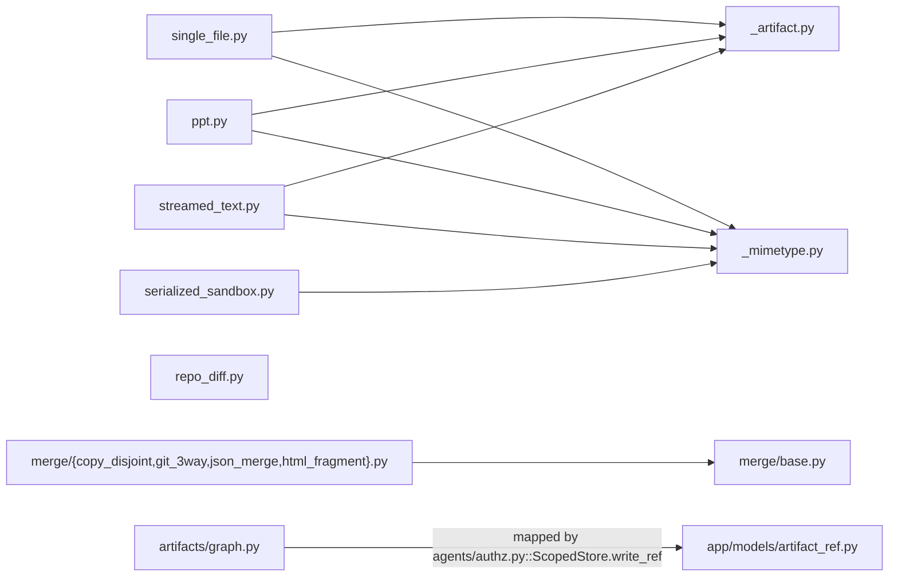
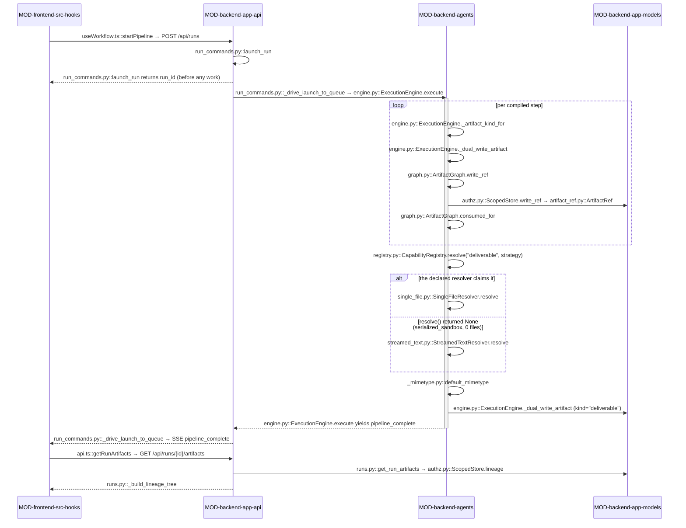

<!-- AUTO-GENERATED BELOW THIS LINE — regenerated by tools/knowledge/build_architecture.py -->

### Members (17 files across 2 modules)

**[MOD-backend-agents](MOD-backend-agents.md)**
- [backend/agents/artifacts/__init__.py](../../backend/agents/artifacts/__init__.py)
- [backend/agents/artifacts/graph.py](../../backend/agents/artifacts/graph.py)
- [backend/agents/capabilities/deliverables/__init__.py](../../backend/agents/capabilities/deliverables/__init__.py)
- [backend/agents/capabilities/deliverables/_artifact.py](../../backend/agents/capabilities/deliverables/_artifact.py)
- [backend/agents/capabilities/deliverables/_mimetype.py](../../backend/agents/capabilities/deliverables/_mimetype.py)
- [backend/agents/capabilities/deliverables/ppt.py](../../backend/agents/capabilities/deliverables/ppt.py)
- [backend/agents/capabilities/deliverables/repo_diff.py](../../backend/agents/capabilities/deliverables/repo_diff.py)
- [backend/agents/capabilities/deliverables/serialized_sandbox.py](../../backend/agents/capabilities/deliverables/serialized_sandbox.py)
- [backend/agents/capabilities/deliverables/single_file.py](../../backend/agents/capabilities/deliverables/single_file.py)
- [backend/agents/capabilities/deliverables/streamed_text.py](../../backend/agents/capabilities/deliverables/streamed_text.py)
- [backend/agents/capabilities/merge/__init__.py](../../backend/agents/capabilities/merge/__init__.py)
- [backend/agents/capabilities/merge/base.py](../../backend/agents/capabilities/merge/base.py)
- [backend/agents/capabilities/merge/copy_disjoint.py](../../backend/agents/capabilities/merge/copy_disjoint.py)
- [backend/agents/capabilities/merge/git_3way.py](../../backend/agents/capabilities/merge/git_3way.py)
- [backend/agents/capabilities/merge/html_fragment.py](../../backend/agents/capabilities/merge/html_fragment.py)
- [backend/agents/capabilities/merge/json_merge.py](../../backend/agents/capabilities/merge/json_merge.py)

**[MOD-backend-app-models](MOD-backend-app-models.md)**
- [backend/app/models/artifact_ref.py](../../backend/app/models/artifact_ref.py)

### Imported by, from outside this domain (8)
- [backend/agents/authz.py](../../backend/agents/authz.py)
- [backend/agents/execution_engine/clarify_engine.py](../../backend/agents/execution_engine/clarify_engine.py)
- [backend/agents/execution_engine/context.py](../../backend/agents/execution_engine/context.py)
- [backend/agents/execution_engine/engine.py](../../backend/agents/execution_engine/engine.py)
- [backend/agents/execution_engine/kernel_services.py](../../backend/agents/execution_engine/kernel_services.py)
- [backend/app/api/run_files.py](../../backend/app/api/run_files.py)
- [backend/app/api/runs.py](../../backend/app/api/runs.py)
- [backend/app/models/__init__.py](../../backend/app/models/__init__.py)

### Imports, from outside this domain (6)
- [backend/agents/__init__.py](../../backend/agents/__init__.py)
- [backend/agents/capabilities/__init__.py](../../backend/agents/capabilities/__init__.py)
- [backend/agents/capabilities/registry.py](../../backend/agents/capabilities/registry.py)
- [backend/app/__init__.py](../../backend/app/__init__.py)
- [backend/app/models/__init__.py](../../backend/app/models/__init__.py)
- [backend/app/models/database.py](../../backend/app/models/database.py)

### External
(none)
<!-- /AUTO-GENERATED -->

## Purpose

This domain owns the answer to "what did the run actually produce, and how do I
get it back later." It has three jobs that share one contract. It **types** every
piece of output a step emits — [graph.py](../../backend/agents/artifacts/graph.py) mints an `ArtifactRef` with a
content-addressed sha256, a per-`(run_id, kind)` monotonic `version`, and lineage
edges, and [artifact_ref.py](../../backend/app/models/artifact_ref.py) gives that dataclass a durable, immutable,
owner-scoped row. It **resolves** the one blob the user is actually shown — the
five `DeliverableResolver` capabilities (`single_file`, `serialized_sandbox`,
`streamed_text`, `ppt`, `repo_diff`) each know one way to turn run state into a
final deliverable, plus [_mimetype.py](../../backend/agents/capabilities/deliverables/_mimetype.py) to declare its shape. And it **reconciles**
output that arrived from more than one worker at once — the four `MergeStrategy`
capabilities in `merge/`, which integrate fan-out fragments and report every
same-target collision as first-class conflict data. Without this domain a step's
output would be an untyped string with no version, no owner, and no way to reach
the next step; a resumed run would have nothing to re-seed; and the frontend would
have to know the workflow's name to guess how to render what it got back.

Where it ends: this domain never *decides* which resolver or merge strategy runs.
The compiled manifest declares `deliverable.strategy` and the engine picks the
merge strategy from the isolation scope — that selection lives in
DOMAIN-workflow-compilation and DOMAIN-execution-kernel. It never persists
anything itself either: `ArtifactGraph` is purely in-memory and the ORM row is
written through `agents/authz.py::ScopedStore.write_ref`, which is
DOMAIN-auth-and-entitlements' scope filter, not this domain's code. It does not
own the sandbox the resolvers read from (DOMAIN-workspace-isolation), the streamed
text they consume (DOMAIN-run-streaming), the graph re-seeding on restart
(DOMAIN-durable-state-resume), or the human adjudication of a reported merge
conflict (DOMAIN-hitl-gating). If your question is "how is this thing shaped and
versioned," it belongs here. If it is "who chose it" or "where is it stored," it
belongs next door.

## Shape

**Every member is import-pure — stdlib plus [capabilities/registry.py](../../backend/agents/capabilities/registry.py) and
nothing else. Not one file in this domain imports `app.*` or
`agents.execution_engine.*`, and that one-way direction is what lets the kernel
import the artifact substrate without dragging in the ORM.**

- **The typed substrate.** [graph.py](../../backend/agents/artifacts/graph.py) holds both halves of the type: the
  `ArtifactRef` dataclass (identity, provenance, inline content, lineage) and
  `ArtifactGraph`, the per-run in-memory registry that owns hashing, versioning,
  `consumed_for` routing and the cycle-safe `lineage` walk. `ARTIFACT_KINDS` is
  the vocabulary, and it is **advisory** — `write_ref` logs a warning for an
  unknown kind and writes anyway, with `*_output` carved out entirely.
- **The durable half, and the boundary between them.** [artifact_ref.py](../../backend/app/models/artifact_ref.py) is the
  `artifact_refs` table: one immutable row per version, `owner_id` +
  `workspace_id` on every row. The dataclass↔row mapping deliberately lives
  *outside* this domain in [agents/authz.py](../../backend/agents/authz.py). This is the only place control
  crosses from `MOD-backend-agents` into `MOD-backend-app-models`, and it crosses
  in one direction: the graph never reads the row back itself.
- **The resolver family.** Five capability classes, each satisfying the
  `DeliverableResolver` port declared in [capabilities/base.py](../../backend/agents/capabilities/base.py). Each is a `name`
  attribute plus `resolve(ctx)`, self-registered under kind `deliverable`. None of
  them touches the sandbox or git directly — [single_file.py](../../backend/agents/capabilities/deliverables/single_file.py) reads through
  `ctx.runner.sandbox`, [serialized_sandbox.py](../../backend/agents/capabilities/deliverables/serialized_sandbox.py) through
  `ctx.runner.serialize_sandbox_deliverable`, [repo_diff.py](../../backend/agents/capabilities/deliverables/repo_diff.py) through
  `ctx.runner.workspace.git_diff`. That handle is the whole reason they stay
  import-pure.
- **The shared transforms.** [_artifact.py](../../backend/agents/capabilities/deliverables/_artifact.py) holds three regex passes —
  `unwrap_artifact`, `strip_pre_slide_body_text`, `sanitize_carousel_deck_html` —
  lifted verbatim out of [engine.py](../../backend/agents/execution_engine/engine.py) so [streamed_text.py](../../backend/agents/capabilities/deliverables/streamed_text.py) and [ppt.py](../../backend/agents/capabilities/deliverables/ppt.py) share one
  byte-identical implementation. [_mimetype.py](../../backend/agents/capabilities/deliverables/_mimetype.py) computes the deliverable's
  declared shape from `strategy`/`name` only, never from the resolved bytes.
- **The merge family.** [merge/base.py](../../backend/agents/capabilities/merge/base.py) declares the `MergeStrategy` port and the
  `MergeResult` record (`applied` + `conflicts`, with a `clean` property). The
  four impls all follow the same skeleton: sort fragments by name, claim each
  target, evict on differing content, apply only what survives.
  [git_3way.py](../../backend/agents/capabilities/merge/git_3way.py) is the only one that reaches version control, and it does so
  through `frag.runner.git_3way_merge` rather than spawning a process.

## In practice

### The path, by call

### Step by step

**Launch**

1. The user submits a brief. `useWorkflow.ts::startPipeline` builds the
   `run_pipeline` payload and POSTs it to `/api/runs`.
2. `run_commands.py::launch_run` checks entitlement via
   `entitlements.py::can_run_pipeline`, creates the `WorkflowRun` row, and
   **returns the run id immediately** — the run itself is driven in the background
   by `run_commands.py::_drive_launch_to_queue`, which the browser follows over SSE.
3. `_drive_launch_to_queue` calls [engine.py::ExecutionEngine.execute](../../backend/agents/execution_engine/engine.py), which
   compiles the manifest and puts `compiled.deliverable` on the execution context.

**Per step — typing the output**

4. A step finishes streaming. [engine.py::ExecutionEngine._artifact_kind_for](../../backend/agents/execution_engine/engine.py)
   maps the step's spec onto an artifact kind (`html_file`, `spec`, `plan`, …).
5. [engine.py::ExecutionEngine._latest_typed_ref_id](../../backend/agents/execution_engine/engine.py) resolves the ref this write
   supersedes, so the new version carries a `derived_from` edge.
6. [engine.py::ExecutionEngine._dual_write_artifact](../../backend/agents/execution_engine/engine.py) is the sole artifact write
   path. It calls [graph.py::ArtifactGraph.write_ref](../../backend/agents/artifacts/graph.py), which hashes the content,
   warns if `kind` is outside `ARTIFACT_KINDS`, assigns
   `version = 1 + count(run_id, kind)`, and returns the typed ref.
7. The same call then hands that ref to [authz.py::ScopedStore.write_ref](../../backend/agents/authz.py), which
   maps it onto an [artifact_ref.py::ArtifactRef](../../backend/app/models/artifact_ref.py) row. This half is **best-effort**:
   a `SQLAlchemyError` is logged and swallowed; anything else re-raises.
8. Each kind the step declares in `produces` is written again under that kind, so
   the next step's `consumes` can find it.
9. The downstream step reads its input via
   [graph.py::ArtifactGraph.consumed_for](../../backend/agents/artifacts/graph.py), matching on `kind` equality — never a
   substring or an agent id.

**Run completion — resolving the deliverable**

10. After the last step, `execute` sets `ectx.last_streamed` to the final step's
    output and reads `compiled.deliverable.strategy`.
11. `registry.py::CapabilityRegistry.resolve("deliverable", strategy)` returns the
    declared resolver; `resolve(ectx)` produces the bytes.
12. If the resolver returned `None` — only [serialized_sandbox.py](../../backend/agents/capabilities/deliverables/serialized_sandbox.py) does this, when
    `count_sandbox_deliverables` is 0 — the engine falls back to
    [streamed_text.py::StreamedTextResolver.resolve](../../backend/agents/capabilities/deliverables/streamed_text.py) and reassigns the *effective*
    strategy.
13. [_mimetype.py::default_mimetype](../../backend/agents/capabilities/deliverables/_mimetype.py) computes the shape hint from the **effective**
    strategy, unless the manifest declared an explicit `mimetype`.
14. `_dual_write_artifact` runs once more with `kind="deliverable"` and
    `visibility="workspace"`, attributed to whichever step's ref has byte-identical
    content, so a later revision run can find it cross-run.
15. `execute` yields `pipeline_complete` carrying `final_output`,
    `deliverable_mimetype` and `deliverable_filename`; SSE delivers it and
    [useWorkflow.ts](../../frontend/src/hooks/useWorkflow.ts) folds it into state.

**Reading it back**

16. `api.ts::getRunArtifacts` hits `GET /api/runs/{id}/artifacts`.
17. [runs.py::get_run_artifacts](../../backend/app/api/runs.py) resolves the run under the owner filter, builds a
    `ScopedStore`, and re-checks ownership through `store.get_run` — a cross-owner
    id returns 404, never 403.
18. [authz.py::ScopedStore.lineage](../../backend/agents/authz.py) returns the owner+visibility-scoped rows,
    optionally narrowed by `?kind=`, and [runs.py::_build_lineage_tree](../../backend/app/api/runs.py) nests them.
    Inline `content` is omitted unless `?include=content`.

### What breaks if you get it wrong

- **A typo'd `kind` is silently unroutable.** `write_ref` only *warns*. The write
  succeeds, the row persists, and then `consumed_for` never matches it and the
  revision lookup never finds it. Downstream steps just receive nothing and carry
  on. Grep the logs for `outside ARTIFACT_KINDS`; nothing else will tell you.
- **Constructing an `ArtifactRef` by hand and calling `store.write_ref` without
  `force_db_version=True`** gives you `version=1` forever. The endpoint paths
  ([run_files.py](../../backend/app/api/run_files.py), [clarify_engine.py](../../backend/agents/execution_engine/clarify_engine.py)) have no shared `ArtifactGraph`, so the DB
  count is the only authority. Duplicate versions break the "latest ref wins"
  reads that everything downstream depends on.
- **Returning `""` instead of `None` from a resolver claims the deliverable.** The
  fallback in [engine.py](../../backend/agents/execution_engine/engine.py) is keyed on `is None`, so an empty string means "I
  produced nothing, successfully" — the run completes with a blank result and the
  `kind="deliverable"` ref is skipped because `if final_output` is falsy.
- **Content-sniffing in [_mimetype.py](../../backend/agents/capabilities/deliverables/_mimetype.py)** looks harmless and is explicitly rejected.
  The mimetype must be a pure function of the *declared* strategy and name, or the
  frontend renderer stops being deterministic for a given manifest.
- **Importing `app.*` from any member** breaks the import-linter contract loudly at
  CI, not at runtime. That one you do not have to worry about.
- **Applying a conflicted path anyway in a merge strategy.** All four impls evict
  conflicting targets from `claimed` before the apply loop. Drop that eviction and
  a worker silently overwrites another worker's file; the run reports success and
  the loss is invisible until someone reads the output.
- **Widening a conflict snippet past `_SNIPPET_CAP`** leaks whatever the worker
  wrote into the `merge_conflict` artifact and the human-gate view — including
  secrets. Silent, and persisted.

### The other paths

**Resume.** On a fresh-process restart the in-memory graph is empty but the rows
survive. [engine.py::ExecutionEngine._hydrate_artifacts_from_store](../../backend/agents/execution_engine/engine.py) reads them via
`store.tree` and calls [graph.py::ArtifactGraph.adopt](../../backend/agents/artifacts/graph.py) for each — which, unlike
`write_ref`, preserves the persisted `id`, `content_hash` and `version` verbatim
and is idempotent on a re-adopt. Skipped steps' outputs are therefore available to
the steps that consume them. If the store is unreachable the graph stays empty and
the downstream simply re-runs from scratch.

**Fan-out merge.** When a step fans out, `fanout.py::run_fanout` collects worker
fragments and `fanout.py::_select_merge_strategy` picks the strategy from the
*isolation scope* — `git_3way` for worktrees, `copy_disjoint` for sub-sandboxes.
The strategy returns a `MergeResult`. A clean result emits `merge_completed` and
ends there. A non-empty `conflicts` writes a `merge_conflict` artifact via
[kernel_services.py::KernelServices.write_merge_conflict_artifact](../../backend/agents/execution_engine/kernel_services.py), emits the
event, and hands off to `fanout.py::_resolve_conflict`, which branches on the
step's `on_conflict`: `human_gate` (default), a bounded `merge_agent` retry that
falls back to the gate, `partial` (keep what applied, drop the rest), or `abort`.

**Uploads.** [run_files.py](../../backend/app/api/run_files.py) writes extracted document text into the same
`artifact_refs` table under `kind="upload_text"`, bypassing the graph entirely and
using `force_db_version=True`. This exists so a resumed run whose sandbox was wiped
still has its uploaded-document context. It is the one artifact write with no
in-memory counterpart.

## Why this shape

**Why the typed graph is stdlib-only.** [graph.py](../../backend/agents/artifacts/graph.py) imports nothing but `hashlib`,
`logging`, `uuid` and `dataclasses`, and its own docstring names the constraint
(T-5-PURITY). The kernel's `ExecutionContext` needs to hold an `ArtifactGraph`; if
the graph imported `app.models` the kernel would transitively depend on the ORM and
the import-linter kernel→ports contract would go red. That is why the
dataclass↔row mapping was deliberately put in [agents/authz.py](../../backend/agents/authz.py) instead of next to
either half.

**Why resolvers dispatch on `deliverable.strategy` and never a workflow name.**
This is SC-001 — a new workflow must be replicable from a manifest with zero engine
edits. The domain is the direct evidence: [single_file.py](../../backend/agents/capabilities/deliverables/single_file.py) folded together what
used to be two separate workflow-name branches in [engine.py](../../backend/agents/execution_engine/engine.py) (the prototype build
branch and the prototype revision branch) into one resolver keyed on
`deliverable.name` and on whether a seeded original is present. [ppt.py](../../backend/agents/capabilities/deliverables/ppt.py) absorbed
two sanitize call sites the kernel used to gate on the PPT workflow names. Both
sets of kernel branches were deleted, not left as fallbacks.

**Why the mimetype is declared, not sniffed.** [_mimetype.py](../../backend/agents/capabilities/deliverables/_mimetype.py) records the rejected
alternative in its own docstring: `final_output.startswith("<!doctype")`. The
frontend dispatches on mimetype specifically so it need not branch on workflow name
(SC-001 again); a sniffed mimetype would make the FE's behaviour a function of what
the model happened to emit rather than of what the manifest declared.

**Why conflicts are data instead of a resolution.** `MergeResult.conflicts` carries
provenance and truncated hunks rather than a merged result, and all four impls
evict rather than overwrite. The recorded reason is Pitfall 6 / T-11-03-01: a
silent overwrite in a fan-out is undetectable after the fact. Determinism (sorted
fragment and target iteration) is part of the same commitment — the same fragment
set must produce the same `applied` list on every run.

**Why [html_fragment.py](../../backend/agents/capabilities/merge/html_fragment.py) exists with nothing routed through it.** Its docstring is
explicit (Q33 / MERGE-01 v2): the `prototype` workflow does not fan out section
fragments, and nothing routes to this strategy today. It was written to satisfy
FANOUT-07 so that a custom section-fan-out workflow could be built by manifest
alone. This is the one member that is speculative by design, and the design says so.

**Why the DB write degrades but the graph write does not.** `_dual_write_artifact`
swallows `SQLAlchemyError` and re-raises everything else. The stated reason is the
offline characterization harness, which has no `workflow_runs` FK row: artifact
persistence must never perturb the deliverable or the event stream that the parity
snapshots compare. The narrow exception type is what keeps a real
`AUTHZ-03 ValueError` from being swallowed with it.

**Why `ARTIFACT_KINDS` warns instead of raising.** Recorded as IN-01: the
vocabulary must never break a run. A wrong kind is a routing bug, not a data-loss
bug, so the write proceeds and the mistake is made observable in logs instead.
Whether that tradeoff still holds now that several kinds are load-bearing for the
revision chain is **not recorded**.
