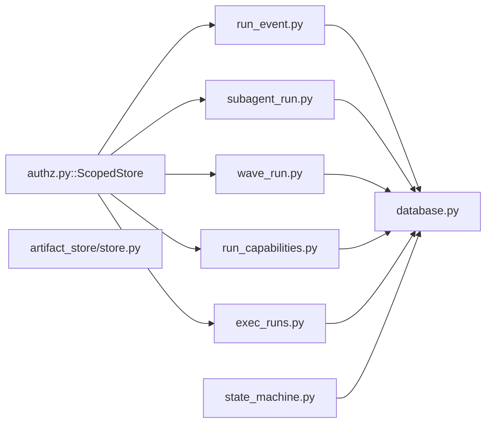

<!-- AUTO-GENERATED BELOW THIS LINE — regenerated by tools/knowledge/build_architecture.py -->

### Members (9 files across 2 modules)

**[MOD-backend-agents](MOD-backend-agents.md)**
- [backend/agents/artifact_store/__init__.py](../../backend/agents/artifact_store/__init__.py)
- [backend/agents/artifact_store/store.py](../../backend/agents/artifact_store/store.py)
- [backend/agents/execution_engine/state_machine.py](../../backend/agents/execution_engine/state_machine.py)

**[MOD-backend-app-models](MOD-backend-app-models.md)**
- [backend/app/models/database.py](../../backend/app/models/database.py)
- [backend/app/models/exec_runs.py](../../backend/app/models/exec_runs.py)
- [backend/app/models/run_capabilities.py](../../backend/app/models/run_capabilities.py)
- [backend/app/models/run_event.py](../../backend/app/models/run_event.py)
- [backend/app/models/subagent_run.py](../../backend/app/models/subagent_run.py)
- [backend/app/models/wave_run.py](../../backend/app/models/wave_run.py)

### Imported by, from outside this domain (39)
- [backend/agents/authz.py](../../backend/agents/authz.py)
- [backend/agents/execution_engine/clarify_engine.py](../../backend/agents/execution_engine/clarify_engine.py)
- [backend/agents/execution_engine/engine.py](../../backend/agents/execution_engine/engine.py)
- [backend/agents/workflow_memory/memory.py](../../backend/agents/workflow_memory/memory.py)
- [backend/app/api/admin.py](../../backend/app/api/admin.py)
- [backend/app/api/agents.py](../../backend/app/api/agents.py)
- [backend/app/api/analytics.py](../../backend/app/api/analytics.py)
- [backend/app/api/api_key_auth.py](../../backend/app/api/api_key_auth.py)
- [backend/app/api/auth.py](../../backend/app/api/auth.py)
- [backend/app/api/chats.py](../../backend/app/api/chats.py)
- [backend/app/api/handoff.py](../../backend/app/api/handoff.py)
- [backend/app/api/mcp.py](../../backend/app/api/mcp.py)
- [backend/app/api/run_commands.py](../../backend/app/api/run_commands.py)
- [backend/app/api/run_engine.py](../../backend/app/api/run_engine.py)
- [backend/app/api/run_stream.py](../../backend/app/api/run_stream.py)
- [backend/app/api/runs.py](../../backend/app/api/runs.py)
- [backend/app/api/settings.py](../../backend/app/api/settings.py)
- [backend/app/api/user_agents.py](../../backend/app/api/user_agents.py)
- [backend/app/api/user_workflows.py](../../backend/app/api/user_workflows.py)
- [backend/app/core/dependencies.py](../../backend/app/core/dependencies.py)
- [backend/app/main.py](../../backend/app/main.py)
- [backend/app/models/__init__.py](../../backend/app/models/__init__.py)
- [backend/app/models/artifact_ref.py](../../backend/app/models/artifact_ref.py)
- [backend/app/models/chat.py](../../backend/app/models/chat.py)
- [backend/app/models/gate_events.py](../../backend/app/models/gate_events.py)
- …and 14 more

### Imports, from outside this domain (6)
- [backend/agents/__init__.py](../../backend/agents/__init__.py)
- [backend/app/__init__.py](../../backend/app/__init__.py)
- [backend/app/core/__init__.py](../../backend/app/core/__init__.py)
- [backend/app/core/config.py](../../backend/app/core/config.py)
- [backend/app/models/__init__.py](../../backend/app/models/__init__.py)
- [backend/app/models/workflow.py](../../backend/app/models/workflow.py)

### External
(none)
<!-- /AUTO-GENERATED -->

## Purpose

This domain owns the answer to one question: **after the process dies, what does the
next process know?** It is the durable substrate a run is reconstructed from — the
append-only event log ([run_event.py](../../backend/app/models/run_event.py)), the per-child and per-wave progress rows
([subagent_run.py](../../backend/app/models/subagent_run.py), [wave_run.py](../../backend/app/models/wave_run.py)), the per-run capability snapshot
([run_capabilities.py](../../backend/app/models/run_capabilities.py)), the exec audit trail ([exec_runs.py](../../backend/app/models/exec_runs.py)) — plus the SQLAlchemy
engine/session/`Base` those tables hang off ([database.py](../../backend/app/models/database.py)). It also owns the two
in-process singletons that hold the *volatile* half of a run's state
([state_machine.py](../../backend/agents/execution_engine/state_machine.py), [artifact_store/store.py](../../backend/agents/artifact_store/store.py)), because the boundary between "survives
a restart" and "does not" is exactly what a maintainer gets wrong here. Without this
domain the kernel's agent-agnostic resume seam (ARCHITECTURE.md § "Design seams") has
nothing to read: a restart would have no way to tell a run that made progress from a run
that never started, and `restore_non_terminal_runs` would have to fail every in-flight
run rather than re-drive it.

Where it ends. This domain declares the **shape and scope of the rows** and holds the
volatile registries; it does not contain the reader/writer, the resume algorithm, or the
transport. [authz.py::ScopedStore](../../backend/agents/authz.py) — the default-deny accessor every one of these tables
is reached through — lives in `DOMAIN-auth-and-entitlements`. The resume *decision*
([engine.py::restore_non_terminal_runs](../../backend/agents/execution_engine/engine.py), `_is_resumable_in_flight`,
`_compute_resume_completed_task_ids`) lives in `DOMAIN-execution-kernel`. Replaying the
log to a reconnecting browser is `DOMAIN-run-streaming`; [run_event.py](../../backend/app/models/run_event.py) is deliberately a
member of both. Artifact durability ([artifact_ref.py](../../backend/app/models/artifact_ref.py), the typed `ArtifactGraph`) is
`DOMAIN-deliverables-and-artifacts` — note that [artifact_store/store.py](../../backend/agents/artifact_store/store.py), despite its
name, no longer stores artifacts at all. The gate *semantics* the `asyncio.Event`
registry serves are `DOMAIN-hitl-gating`. If your question is "what column is this in and
does it survive a restart", you are in the right card; if it is "who decides what to skip
on resume", go next door to the kernel.

## Shape

**Every durable row in this domain carries `owner_id` + `workspace_id` as
`nullable=False` and is written only through [authz.py::ScopedStore](../../backend/agents/authz.py); the two singletons
carry the rest of a run's state and are lost on restart by design.** That split is the
whole domain — the tables are what resume reads, the singletons are what resume rebuilds.



- **The session seam.** [database.py](../../backend/app/models/database.py) builds the process-wide `engine`, `SessionLocal`
  and the declarative `Base` every member model subclasses. It is not schema authority —
  the schema is applied by alembic, and [main.py::lifespan](../../backend/app/main.py) refuses to boot production
  when `alembic_version` is absent rather than calling `Base.metadata.create_all`. It
  also carries two production-shaped decisions: a right-sized `QueuePool` on the
  non-SQLite branch (BUG-004) and a per-connection `PRAGMA foreign_keys=ON` so dev SQLite
  rejects the same bad FK Postgres does.

- **The event log.** [run_event.py::RunEvent](../../backend/app/models/run_event.py) is append-only, ordered by `(run_id, seq)`,
  and carries a per-row `event_id` uuid so replay is idempotent. Two `UniqueConstraint`s
  scoped on `(run_id, owner_id, workspace_id, …)` — `uq_run_events_scope_seq` and
  `uq_run_events_scope_event` — are the domain's only *loud* invariant: they make a
  second concurrent writer's colliding insert raise `IntegrityError` instead of silently
  taking a seq that was already used. `DeepLinkNonce` shares the file and the pattern:
  DB-backed, owner-scoped, single-use via a terminal `consumed_at`.

- **The progress rows.** [subagent_run.py::SubagentRun](../../backend/app/models/subagent_run.py) (one per fan-out child, carrying
  the plan-global `task_id` that the resume skip-cursor keys on) and
  [wave_run.py::WaveRun](../../backend/app/models/wave_run.py) (one per dispatched wave, with its `task_ids` list) are what
  makes resume *task-granular* rather than step-granular.
  [run_capabilities.py::RunCapabilities](../../backend/app/models/run_capabilities.py) snapshots what the run executed under;
  [exec_runs.py::ExecRun](../../backend/app/models/exec_runs.py) records every `exec_command` outcome at the enforcement point,
  storing only a truncated `output_digest` and never raw child output.

- **The volatile half.** [state_machine.py::StateMachine](../../backend/agents/execution_engine/state_machine.py) holds `{run_id: state}` in a
  process dict and mirrors each `transition` into `workflow_runs.status` best-effort —
  the in-memory dict is authoritative for the live process, the column is what the next
  process reads. `artifact_store/store.py::ArtifactStore` holds the per-process
  `asyncio.Event` registries a paused HITL gate blocks on; these are explicitly *not*
  DB-backed, so a restart destroys the waiter and boot has to recreate it. Both expose
  `forget_run` so [run_engine.py::_cleanup_pipeline](../../backend/app/api/run_engine.py) can evict a terminal run's entries
  in one place (KAN-139).

- **The crossing.** Control enters from `MOD-backend-agents` (the kernel sink and the
  boot scan) and `MOD-backend-app-api` (the SSE replay, the cleanup call) into
  `MOD-backend-app-models`, always in that direction: [state_machine.py::_persist](../../backend/agents/execution_engine/state_machine.py) and
  [store.py](../../backend/agents/artifact_store/store.py) import from `app.models` inside the function body, never at module scope,
  which is what keeps the kernel importable without the app layer.

## In practice

### The path, by call

```mermaid
sequenceDiagram
    participant MOD-frontend-src-hooks
    participant MOD-backend-app
    participant MOD-backend-agents
    participant MOD-backend-app-models
    participant MOD-backend-app-api

    Note over MOD-backend-app: process restarts; a run was mid-flight
    MOD-backend-app->>MOD-backend-agents: main.py::lifespan → engine.py::restore_non_terminal_runs
    activate MOD-backend-agents
    MOD-backend-agents->>MOD-backend-app-models: database.py::SessionLocal (WorkflowRun.status in engine.py::NON_TERMINAL_RUN_STATUSES)
    loop each non-terminal run
        MOD-backend-agents->>MOD-backend-app-models: engine.py::_is_resumable_in_flight → authz.py::ScopedStore.read_events
        MOD-backend-app-models-->>MOD-backend-agents: run_event.py::RunEvent rows (owner+workspace scoped)
        alt durable step state exists
            MOD-backend-agents->>MOD-backend-app-models: engine.py::_stamp_resume_marker → authz.py::ScopedStore.append_event (run_resuming)
            MOD-backend-agents->>MOD-backend-app-models: engine.py::_compute_resume_completed_task_ids → authz.py::ScopedStore.read_subagent_runs
            MOD-backend-agents->>MOD-backend-agents: engine.py::resume_run (driver task)
        else waiting_for_user with an open gate
            MOD-backend-agents->>MOD-backend-agents: artifact_store/store.py::ArtifactStore.get_review_event (recreate waiter)
            MOD-backend-agents->>MOD-backend-agents: engine.py::_rearm_gate_run
        else no durable rows
            MOD-backend-agents->>MOD-backend-app-models: WorkflowRun.status = failed (WR-05 abandon)
        end
    end
    deactivate MOD-backend-agents
    Note over MOD-backend-app: boot returns; drivers keep running
    MOD-frontend-src-hooks->>MOD-backend-app-api: useRunStream.ts::connect (Last-Event-ID: <max seen seq>)
    activate MOD-backend-app-api
    MOD-backend-app-api->>MOD-backend-app-models: run_stream.py::stream_run_events → authz.py::ScopedStore.get_run
    MOD-backend-app-api->>MOD-backend-app-models: run_stream.py::_iter_sse_frames → authz.py::ScopedStore.read_events(after_seq)
    MOD-backend-app-api-->>MOD-frontend-src-hooks: replayed frames, then stream_attached
    deactivate MOD-backend-app-api
    Note over MOD-frontend-src-hooks,MOD-backend-app-api: the response is open for the run's whole life; replay returns first, live frames follow
    loop while the resumed run emits
        MOD-backend-agents->>MOD-backend-app-models: engine.py::_RunEventSink.persist → authz.py::ScopedStore.append_event_at_or_after
        MOD-backend-app-models-->>MOD-backend-agents: the seq the row ACTUALLY landed on
        MOD-backend-agents->>MOD-backend-app-api: re-stamped event → run_engine.py::_pump_run_events
        MOD-backend-app-api-->>MOD-frontend-src-hooks: SSE frame (id: seq)
    end
```

### Step by step

**Boot — reconstruct**

1. [main.py::lifespan](../../backend/app/main.py) runs; it inspects the DB and refuses to boot production if
   `alembic_version` is missing, so no run is ever reconstructed against an empty schema.
2. It awaits [engine.py::restore_non_terminal_runs](../../backend/agents/execution_engine/engine.py), wrapped so a failure is non-fatal
   and the port still serves.
3. That opens a [database.py::SessionLocal](../../backend/app/models/database.py) and selects every `WorkflowRun` whose status
   is in [engine.py::NON_TERMINAL_RUN_STATUSES](../../backend/agents/execution_engine/engine.py) — the set is the sole definition of "a
   run this boot re-adopts".
4. For each row it calls [engine.py::_is_resumable_in_flight](../../backend/agents/execution_engine/engine.py), which requires the run's
   type to compile *and* at least one durable row: `ScopedStore.read_events`,
   `ScopedStore.tree`, or `ScopedStore.read_wave_runs`. One row is enough evidence.
5. A `waiting_for_user` run takes the re-arm branch: `derive_open_gate` over the replayed
   `RunEvent` rows, then `ArtifactStore.get_review_event` / `get_resume_event` recreates
   the destroyed `asyncio.Event` and `.clear()`s it (armed == created and not set), then
   [engine.py::_rearm_gate_run](../../backend/agents/execution_engine/engine.py) is spawned — the waiter exists *before* the row is left
   in `waiting_for_user`.
6. A resumable in-flight run gets [engine.py::_stamp_resume_marker](../../backend/agents/execution_engine/engine.py) first: an additive
   `run_resuming` row appended at `max(seq)+1` under the workspace recovered from the
   log, so a crash during resume is itself resumable and the run is never driven twice.
7. Then `asyncio.create_task(engine.py::resume_run)`.
8. Inside, [engine.py::_compute_resume_completed_task_ids](../../backend/agents/execution_engine/engine.py) reads `ScopedStore.tree` and
   `ScopedStore.read_subagent_runs` and returns, per step, the completed `task_id` set —
   `wave_scheduler` steps key on the plan-global `task_id`, never the wave-local
   `worker_index`. A `running` or `failed` child is *not* completed, so it re-runs.
9. Everything else — uncompilable or with no durable rows — is marked `failed` with the
   WR-05 abandon message. There is nothing to resume from.

**Live — append**

10. As the resumed run emits, [engine.py::_RunEventSink.persist](../../backend/agents/execution_engine/engine.py) calls
    `ScopedStore.append_event_at_or_after`, which inserts a [run_event.py::RunEvent](../../backend/app/models/run_event.py) row.
11. The requested `seq` is a *request*, not a guarantee: the chat lane writes into the
    same per-run seq space, so a collision on `uq_run_events_scope_seq` makes the helper
    re-append past the racing writer and return the seq the row actually landed on.
12. The engine re-stamps that returned seq onto the event before yielding it, because the
    SSE `id:` line is `row.seq` on replay and `data["seq"]` live — the two must agree.
13. [state_machine.py::StateMachine.transition](../../backend/agents/execution_engine/state_machine.py) mirrors each lifecycle change into
    `workflow_runs.status` through its own short-lived `SessionLocal`, persisting before
    returning so a crash mid-transition lands in the *new* state.

**Reconnect — replay**

14. The browser's `useRunStream.ts::connect` re-attaches to
    `GET /api/runs/{id}/events/stream` with `Last-Event-ID` set to the max seq it has
    seen.
15. [run_stream.py::stream_run_events](../../backend/app/api/run_stream.py) does the two-layer owner check (ORM filter, then
    `ScopedStore.get_run`) — a cross-owner id is a 404, never a 403 — and builds a
    *session-less* `ScopedStore` for the generator, because FastAPI tears the request
    session down before the streaming body runs (BUG-004).
16. [run_stream.py::_iter_sse_frames](../../backend/app/api/run_stream.py) yields the durable tail via
    `ScopedStore.read_events(after_seq)`, recording each `event_id`, then the
    `stream_attached` handshake, then drains the live queue skipping any `event_id`
    already replayed.
17. If the client's cursor is past an open gate, [run_stream.py::_dangling_review_gate](../../backend/app/api/run_stream.py)
    re-derives it with one bounded `ScopedStore.last_event_of_types` query and re-emits
    the gate frame — server-derived, no client state trusted.
18. When the run reaches a terminal state, [run_engine.py::_cleanup_pipeline](../../backend/app/api/run_engine.py) calls
    `ArtifactStore.forget_run` and `StateMachine.forget_run` so the three singleton dicts
    and the `asyncio.Event` registry do not grow for the process lifetime.

### What breaks if you get it wrong

- **Adding a durable table without `owner_id`/`workspace_id` NOT NULL, or writing it
  outside `ScopedStore`.** Silent. The row lands, the run works, and a cross-owner read
  now returns it — the default-deny filter ([authz.py::ScopedStore._scope_owner_ws](../../backend/agents/authz.py)) is
  the *only* thing standing between two tenants, and a direct `db.add(...)` bypasses it
  with no error.
- **Writing a `RunEvent` by computing `max(seq)+1` yourself.** Loud on the insert
  (`IntegrityError` from `uq_run_events_scope_seq`) but silent downstream if you catch
  `SQLAlchemyError` broadly — that is exactly [FIX-240](../cards/20260812-1852-FIX-240.md) / [ISS-121](../cards/20260812-1804-ISS-121.md): `_RunEventSink.persist`
  swallowed a production seq collision through the branch written for "the offline
  harness has no schema", and the dropped row became a hole in the replay log a
  reconnecting client could never fill. Use `append_event_next_seq` or
  `append_event_at_or_after`.
- **Assuming `ArtifactStore` state survives a restart.** Silent and total: a paused run
  looks fine in the DB, but no `asyncio.Event` exists for the user's answer to set, so
  the run hangs forever with no error. This was KAN-88, and the fix is *recreate the
  waiter*, not *stop failing*.
- **Treating `StateMachine._states` as authoritative across processes.** Silent: the
  in-memory dict is empty after boot, so `get_state` returns `None` for a run whose
  `workflow_runs.status` says otherwise. The DB column is the cross-restart source; the
  dict is per-process only.
- **Widening a resume skip-cursor to "not failed" instead of "complete".** Silent data
  loss — a worker that was `running` when the process died gets skipped and its output
  never exists. Every derivation in this area is deliberately fail-safe toward *re-run*;
  a read failure leaves the step out of the dict entirely.
- **Dropping a column instead of adding one.** Loud in review, silent in production
  rollback. The recorded rule is additive migrations only (ARCHITECTURE.md § "Design
  seams"); the persistence schema grows, it does not rewrite.
- **What you do *not* have to worry about:** an invalid lifecycle state or a transition
  out of a terminal state raises [state_machine.py::StateMachineError](../../backend/agents/execution_engine/state_machine.py) immediately, and a
  bad FK fails on dev SQLite exactly as it does on Postgres thanks to the
  `PRAGMA foreign_keys=ON` connect hook in [database.py](../../backend/app/models/database.py).

### The other paths

**The clean-shutdown path.** [run_shutdown.py](../../backend/app/api/run_shutdown.py) deliberately leaves a drained run
*non-terminal* so the next boot's `restore_non_terminal_runs` classifies it like any
crash victim. There is no separate "graceful" state — the same three-way classification
handles both, which is why the durable-row evidence check is the only thing that matters.

**The abandon path.** A run with a non-terminal status but no `RunEvent`, no
`artifact_refs` and no `WaveRun` row is not resumable: nothing records where it got to.
`restore_non_terminal_runs` writes `status = failed` with the WR-05 message and stops.
Re-arming it instead would leave a row that looks live with no driver behind it — the
failure mode the fail-safe direction is chosen to avoid.

**The best-effort degrade path.** Every persist in this domain is written to survive a
missing schema: `_RunEventSink.persist` catches `SQLAlchemyError` only and re-raises
anything else, [state_machine.py::_persist](../../backend/agents/execution_engine/state_machine.py) swallows the DB write entirely, and
`ScopedStore` reads in `_is_resumable_in_flight` degrade to "not resumable". The offline
characterization harness runs with no DB at all, so the live event stream and the
deterministic deliverable are never perturbed by persistence (INV-3) — the cost is that a
genuine production write loss is a `warning`, not an exception.

## Why this shape

**Rows, not checkpoints, because the kernel must resume without the agent.**
ARCHITECTURE.md names "Durable state, agent-agnostic resume" as a design seam: the kernel
reads durable state, computes what remains, and continues — at task/worker granularity,
even when the task list changed in between. A LangGraph checkpoint would resume the
*model loop*; it could not tell the kernel which of twelve fan-out children finished. So
progress is recorded as first-class rows keyed on plan-global identity
([subagent_run.py::SubagentRun.task_id](../../backend/app/models/subagent_run.py), [wave_run.py::WaveRun.task_ids](../../backend/app/models/wave_run.py)) that the kernel
can re-derive from without asking an agent anything. That is the same SC-001 discipline
applied to persistence: the decision is in the kernel, the evidence is in the schema.

**Two constraints instead of a lock, because there is genuinely a second writer.** The
engine's sink keeps a fast in-memory seq counter and cannot afford to materialize the
whole log per event (`_max_event_seq` exists precisely because `read_events` pulls every
row — the local corpus has a 36k-row run). Serializing all writers through one allocator
was the obvious alternative and was rejected on that cost. Instead migration `0024` added
`uq_run_events_scope_seq` / `uq_run_events_scope_event` and both writers retry past a
collision, so the log holds neither a duplicate seq nor a hole. The constraints are scoped
to `(run_id, owner_id, workspace_id)` rather than `run_id` alone because a cross-owner
store legitimately starts its own seq at 1 under its own principal — a different scope,
not a collision.

**Owner + workspace on every row, `nullable=False`, because the read path is
default-deny.** AUTHZ-01 is stamped in the docstring of all five tables. The alternative —
filtering at the API layer — was not taken: the filter lives in one place
([authz.py::ScopedStore](../../backend/agents/authz.py)) and the NOT NULL columns are what make it impossible to write a
row that filter cannot see. `DeepLinkNonce` documents the migration away from the opposite
design: a process-global in-memory set that was unbounded, unscoped and lost on restart.

**HITL waiters stay in memory on purpose.** [artifact_store/store.py](../../backend/agents/artifact_store/store.py) says it plainly —
per-process `asyncio.Event`s, intentionally not DB-backed, single-asyncio-process
deployment. Making them durable would mean a distributed wakeup mechanism for a
deployment shape that does not exist yet, and the boot-time re-arm (branch (a) of
`restore_non_terminal_runs`) closes the restart gap without one. The same file records
what *was* removed: the artifact-persistence half was deleted in phase 05-07 and the thin
`workflow_artifacts` table dropped in alembic `0015`, once every consumer moved to the
typed `ArtifactGraph` plus persisted `artifact_refs`. The module name is a leftover of
that removal.

**`StateMachine`'s dual write is not recorded as a considered design.** The docstrings
describe it as a phase-2 in-memory implementation that phase 3 extended to also write
`workflow_runs.status`, with the in-memory dict kept authoritative for the current process
and the column serving cross-restart resumability. No card or ADR explains why the column
was not made the single source of truth; **the reason is not recorded.**
