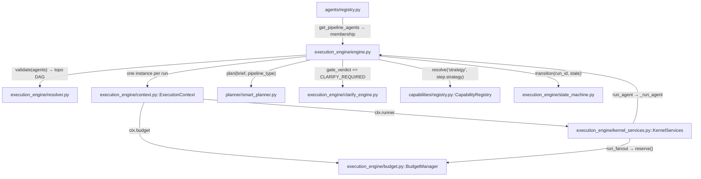

<!-- AUTO-GENERATED BELOW THIS LINE — regenerated by tools/knowledge/build_architecture.py -->

### Members (17 files across 1 modules)

**[MOD-backend-agents](MOD-backend-agents.md)**
- [backend/agents/execution_engine/__init__.py](../../backend/agents/execution_engine/__init__.py)
- [backend/agents/execution_engine/budget.py](../../backend/agents/execution_engine/budget.py)
- [backend/agents/execution_engine/clarify_engine.py](../../backend/agents/execution_engine/clarify_engine.py)
- [backend/agents/execution_engine/context.py](../../backend/agents/execution_engine/context.py)
- [backend/agents/execution_engine/engine.py](../../backend/agents/execution_engine/engine.py)
- [backend/agents/execution_engine/fanout.py](../../backend/agents/execution_engine/fanout.py)
- [backend/agents/execution_engine/kernel_services.py](../../backend/agents/execution_engine/kernel_services.py)
- [backend/agents/execution_engine/ndjson_adapter.py](../../backend/agents/execution_engine/ndjson_adapter.py)
- [backend/agents/execution_engine/od_context.py](../../backend/agents/execution_engine/od_context.py)
- [backend/agents/execution_engine/overrides.py](../../backend/agents/execution_engine/overrides.py)
- [backend/agents/execution_engine/resolver.py](../../backend/agents/execution_engine/resolver.py)
- [backend/agents/execution_engine/run_log.py](../../backend/agents/execution_engine/run_log.py)
- [backend/agents/execution_engine/state_machine.py](../../backend/agents/execution_engine/state_machine.py)
- [backend/agents/planner/__init__.py](../../backend/agents/planner/__init__.py)
- [backend/agents/planner/smart_planner.py](../../backend/agents/planner/smart_planner.py)
- [backend/agents/planner/tools.py](../../backend/agents/planner/tools.py)
- [backend/agents/registry.py](../../backend/agents/registry.py)

### Imported by, from outside this domain (13)
- [backend/agents/capabilities/registry.py](../../backend/agents/capabilities/registry.py)
- [backend/agents/factory.py](../../backend/agents/factory.py)
- [backend/app/agents/hooks_catalog.py](../../backend/app/agents/hooks_catalog.py)
- [backend/app/api/agents.py](../../backend/app/api/agents.py)
- [backend/app/api/chat_router.py](../../backend/app/api/chat_router.py)
- [backend/app/api/composition_order.py](../../backend/app/api/composition_order.py)
- [backend/app/api/launch_context.py](../../backend/app/api/launch_context.py)
- [backend/app/api/prototype_templates.py](../../backend/app/api/prototype_templates.py)
- [backend/app/api/run_commands.py](../../backend/app/api/run_commands.py)
- [backend/app/api/run_engine.py](../../backend/app/api/run_engine.py)
- [backend/app/api/user_workflows.py](../../backend/app/api/user_workflows.py)
- [backend/app/api/workflows.py](../../backend/app/api/workflows.py)
- [backend/app/main.py](../../backend/app/main.py)

### Imports, from outside this domain (63)
- [backend/agents/__init__.py](../../backend/agents/__init__.py)
- [backend/agents/artifact_store/__init__.py](../../backend/agents/artifact_store/__init__.py)
- [backend/agents/artifact_store/store.py](../../backend/agents/artifact_store/store.py)
- [backend/agents/artifacts/__init__.py](../../backend/agents/artifacts/__init__.py)
- [backend/agents/artifacts/graph.py](../../backend/agents/artifacts/graph.py)
- [backend/agents/authz.py](../../backend/agents/authz.py)
- [backend/agents/capabilities/__init__.py](../../backend/agents/capabilities/__init__.py)
- [backend/agents/capabilities/context_providers/__init__.py](../../backend/agents/capabilities/context_providers/__init__.py)
- [backend/agents/capabilities/context_providers/opendesign.py](../../backend/agents/capabilities/context_providers/opendesign.py)
- [backend/agents/capabilities/deliverables/__init__.py](../../backend/agents/capabilities/deliverables/__init__.py)
- [backend/agents/capabilities/deliverables/_artifact.py](../../backend/agents/capabilities/deliverables/_artifact.py)
- [backend/agents/capabilities/deliverables/_mimetype.py](../../backend/agents/capabilities/deliverables/_mimetype.py)
- [backend/agents/capabilities/gate_pendency.py](../../backend/agents/capabilities/gate_pendency.py)
- [backend/agents/capabilities/hooks/__init__.py](../../backend/agents/capabilities/hooks/__init__.py)
- [backend/agents/capabilities/hooks/base.py](../../backend/agents/capabilities/hooks/base.py)
- [backend/agents/capabilities/integration_providers/__init__.py](../../backend/agents/capabilities/integration_providers/__init__.py)
- [backend/agents/capabilities/integration_providers/providers.py](../../backend/agents/capabilities/integration_providers/providers.py)
- [backend/agents/capabilities/model_catalog.py](../../backend/agents/capabilities/model_catalog.py)
- [backend/agents/capabilities/model_pricing.py](../../backend/agents/capabilities/model_pricing.py)
- [backend/agents/capabilities/registry.py](../../backend/agents/capabilities/registry.py)
- [backend/agents/capabilities/task_identity.py](../../backend/agents/capabilities/task_identity.py)
- [backend/agents/capabilities/validators/__init__.py](../../backend/agents/capabilities/validators/__init__.py)
- [backend/agents/capabilities/validators/severity.py](../../backend/agents/capabilities/validators/severity.py)
- [backend/agents/factory.py](../../backend/agents/factory.py)
- [backend/agents/loader.py](../../backend/agents/loader.py)
- …and 38 more

### External
botocore, langchain_anthropic, langchain_core
<!-- /AUTO-GENERATED -->

## Purpose

This domain is the thing that actually *runs* a workflow. Given an ordered roster of
`AgentSpec` objects and a `pipeline_type` label, it resolves that label to a
`CompiledWorkflow` (`execution_engine/engine.py::compile_for_run`), validates the
produces/consumes DAG (`execution_engine/resolver.py::WorkflowResolver.validate`), decides
whether the brief needs clarification before any money is spent
(`planner/smart_planner.py::SmartPlanner.plan` → `execution_engine/clarify_engine.py::ClarifyEngine.run`),
then walks the steps one at a time — evaluating each step's declared gates, firing its
declared hooks, resolving its declared strategy off the `CapabilityRegistry`, and invoking
the agent through `execution_engine/engine.py::ExecutionEngine._run_agent`. It owns the
per-run state container that makes concurrent runs safe (`execution_engine/context.py::ExecutionContext`),
the lifecycle state machine ([execution_engine/state_machine.py](../../backend/agents/execution_engine/state_machine.py)), the fan-out spend ceiling
(`execution_engine/budget.py::BudgetManager`), the handle capabilities reach the kernel
through (`execution_engine/kernel_services.py::KernelServices`), and the single outward emit
chokepoint where every event gets its `seq` and `event_id`
(`execution_engine/engine.py::ExecutionEngine.execute`). Without it there is no sequencing,
no terminal semantics, no durable event log, and no resume — a manifest compiles to a plan
that nothing executes.

It stops precisely where a *name* is resolved. What a strategy does once resolved
(`single_shot`, `task_loop`, `wave_scheduler`, `fanout_batch`) is `DOMAIN-execution-strategies`,
which also holds the fuller treatment of [execution_engine/fanout.py](../../backend/agents/execution_engine/fanout.py). How a manifest becomes
a `CompiledWorkflow` at all is `DOMAIN-workflow-compilation`. What an agent is *told* — the
composed prompt, the injected blocks, [execution_engine/context.py](../../backend/agents/execution_engine/context.py) and
[execution_engine/od_context.py](../../backend/agents/execution_engine/od_context.py) as context carriers — is `DOMAIN-context-assembly`. Which
model the invocation gets, and the throttle/fallback chain around it, is `DOMAIN-agent-runtime`.
The gate *semantics* the kernel implements are split: `DOMAIN-hitl-gating` owns the
pause/resume (Human_Gate, before-human, Validation_Gate blocking); *routing* dispatch-loop cursor jumps
based on a `conditional` gate's match outcome (forward branching within a run, or backward looping bounded
by `loop_max_iterations` and failing closed at R-07, or triggering a child workflow that ends this run with `pipeline_diverted`) are here. The tables it reads and writes, including the durable side
of [execution_engine/state_machine.py](../../backend/agents/execution_engine/state_machine.py), are `DOMAIN-durable-state-resume`; the bytes the run finally
emits are `DOMAIN-deliverables-and-artifacts`. If your question is "why did this agent run
third", "why did the run report complete when the build was half-finished", "why did the run
jump backward to an earlier step", "why did a child workflow start", or "why does the kernel not know what a prototype is", it
is here. If it is "why did this agent get that prompt" or "what does `task_loop` actually do",
it is next door.

## Shape

**Everything the kernel does for a specific workflow, it does by resolving a declared name
off the compiled plan — there is not one `if pipeline_type ==` or `spec.id ==` anywhere under
`backend/agents/execution_engine/`, and CI hard-fails if you add one**
(`backend/tests/agents/test_banned_patterns.py::test_inv1_no_kernel_workflow_name_branch`,
with a companion non-vacuity test that injects a known-bad line to prove the scanner still
bites). Every routing decision in this domain reads a value: `compiled.planner`,
`compiled.clarify.mode`, `compiled.deliverable.strategy`, `step.strategy`, `step.gates`,
`step.hooks`, `step.tools.exec`.

- **Roster.** [agents/registry.py](../../backend/agents/registry.py) holds `PIPELINE_AGENTS` (ordered agent ids per pipeline),
  `REVISION_BASE_MAP`, and the security allow-list `allowed_custom_agent_ids` that decides
  which ids a client may legitimately name in a launch. `get_pipeline_agents` loads the
  specs and sorts by `order`, and when a pipeline reuses agents from other pipelines (e.g.
  `ppt_v2` reusing steps from `ppt`), `_own_manifest_step_agents` augments the roster with
  steps declared in the pipeline's own file manifest so the roster matches the compiled plan.
  This is *membership*, not execution order.
- **Order.** `execution_engine/resolver.py::WorkflowResolver.validate` computes the actual
  execution order from `produces`/`consumes` — Kahn's algorithm over edges resolved with a
  nearest-upstream tie-break, with `planning_context` and `constitution` exempt as
  cross-cutting. `presort` is a second, deliberately order-*independent* entry point used
  before a run starts, never inside it.
- **Compilation seam.** `execution_engine/engine.py::compile_for_run` is the one place a
  legacy `pipeline_type` string becomes a manifest id (`resolve_alias`) and then a
  `CompiledWorkflow`. Everything downstream reads the plan, never the label.
- **Per-run state.** `execution_engine/context.py::ExecutionContext` is a plain mutable
  dataclass carrying the artifact graph, the scoped store, the model resolver, the budget,
  the `KernelServices` handle, and a family of consume-once injection scratch fields
  (`redo_directive`, `steering_notes`, `spec_revision_context`, `turn_images_once`, `analyzer_solution`). It also carries
  optional `live_ectx_register` and `live_ectx_unregister` app-layer callbacks (dormant when `None`) for mid-run steering injection and cleanup.
  It imports only stdlib plus [agents.artifacts.graph](../../backend/app/api/agents.py).
- **The kernel handle.** `execution_engine/kernel_services.py::KernelServices` is the single
  object a capability touches to reach kernel and `app.*` primitives — `run_agent`,
  `run_fanout`, `run_worker`, `run_validation_fix_loop`, `record_gate_event`,
  `record_subagent_run`, the sandbox, `static_check`/`render_check`, the typed-graph reads.
  Capabilities reach it dynamically as `ctx.runner`.
- **Spend.** [execution_engine/budget.py](../../backend/agents/execution_engine/budget.py) splits caps into pre-reservable (`reserve` — total
  subagents, concurrency, depth, per-workspace aggregate) and check-at-boundary
  (`note_tokens`, `note_wall_clock`), because you cannot pre-reserve unknown token spend.
  `reserve` raises `BudgetExceeded` *before* recording, so a refused reservation leaves zero
  rows.
- **Lifecycle.** [execution_engine/state_machine.py](../../backend/agents/execution_engine/state_machine.py) guards nine states and three terminals,
  refuses transitions out of a terminal, and writes `workflow_runs.status` best-effort — the
  in-memory dict is authoritative for the process. `forget_run` evicts a finished run.
- **Gate and planning entry.** `planner/smart_planner.py::SmartPlanner.plan` is one
  structured LLM call against a built-in `DOMAIN_KB`, routed through `cached_invoke` for
  token counting and Bedrock cache eligibility, returning a coverage map plus a
  `PROCEED`/`CLARIFY_REQUIRED` verdict; `execution_engine/clarify_engine.py::ClarifyEngine`
  owns the questionnaire round, the answer merge, and the durable park.
- **Audit trace.** `execution_engine/run_log.py::RunLog` writes an append-only JSONL trace to
  `<sandbox>/.logs/run-logs.jsonl`, one JSON object per line, recording event checkpoints
  (step_start, agent_error, etc.) keyed by agent_id. `execution_engine/run_log.py::RunTrace`
  provides full-fidelity tracing fed directly from the engine's event stream, capturing every
  tool call, result, agent output, and reasoning with bounded text to keep logs readable.
  Tracing is best-effort and swallows its own exceptions so a logging failure never breaks a run.
- **Second ingress.** `execution_engine/ndjson_adapter.py::run_prototype_pipeline` runs the
  same `execute()` and flattens the `{type, data}` envelopes into flat NDJSON for
  [app/api/prototype_templates.py](../../backend/app/api/prototype_templates.py). It is deliberately *not* a second chokepoint: no `seq` is
  stamped there.

**Module crossings.** Everything in this domain lives in `MOD-backend-agents`, and the
crossings out of it are all one-way by contract:

1. **Kernel → app, by import, for a fixed short list.** [execution_engine/engine.py](../../backend/agents/execution_engine/engine.py) imports
   [agents.factory](../../backend/app/api/agents.py), `app.agents.sandbox`, and `app.core.config`, but never `app.api` — an
   import-linter contract in `backend/pyproject.toml` ("kernel imports only capability ports
   (scaffold)") locks that direction shut.
2. **App → kernel, by injection only, for live delivery.** Anything the kernel needs *from*
   `app.api` arrives as a callable set on the engine singleton or passed into `execute()`:
   `MilestoneSink`, `LiveEctxRegister`/`LiveEctxUnregister`, `ResumeOutputPersist`,
   `ResumeCancelEvent`, and the three `_resume_register_*`/`_resume_cleanup` slots wired once
   in [app/main.py](../../backend/app/main.py). All default `None`, so an offline run is byte-identical.
3. **Kernel ↔ capabilities, by name and handle.** [agents.capabilities](../../backend/app/api/agents.py) may not import
   [agents.execution_engine](../../backend/app/api/agents.py) (its own import-linter contract). Control flows in via
   `CapabilityRegistry.resolve(kind, name)` and back out via `ctx.runner`, so the two
   packages never see each other's symbols.

## In practice

One launch, end to end — a browser press to a `pipeline_complete`. This domain owns the
middle; the ends are here so the chain is unbroken.

### The path, by call

```mermaid
sequenceDiagram
    autonumber
    participant MOD-frontend-src
    participant MOD-backend-app-api
    participant MOD-backend-agents
    participant MOD-backend-app-agents

    MOD-frontend-src->>MOD-backend-app-api: POST /api/runs<br/>RunConnectionProvider.tsx::sendCommand
    activate MOD-backend-app-api
    MOD-backend-app-api->>MOD-backend-agents: run_commands.py::launch_run<br/>agents/registry.py::allowed_custom_agent_ids
    MOD-backend-app-api->>MOD-backend-agents: composition_order.py::presort_specs<br/>execution_engine/resolver.py::WorkflowResolver.presort
    MOD-backend-app-api-->>MOD-frontend-src: 200 {run_id}
    deactivate MOD-backend-app-api
    Note over MOD-frontend-src,MOD-backend-app-api: the HTTP request is OVER here —<br/>everything below runs in a background task

    MOD-frontend-src->>MOD-backend-app-api: GET /api/runs/{id}/events/stream
    MOD-backend-app-api->>MOD-backend-agents: run_commands.py::_drive_launch_to_queue<br/>execution_engine/engine.py::get_execution_engine().execute
    activate MOD-backend-agents

    MOD-backend-agents->>MOD-backend-agents: execution_engine/engine.py::ExecutionEngine._execute_impl
    MOD-backend-agents->>MOD-backend-agents: execution_engine/engine.py::compile_for_run<br/>execution_engine/engine.py::ExecutionEngine._apply_selections
    MOD-backend-agents->>MOD-backend-agents: execution_engine/budget.py::BudgetManager.from_limits
    MOD-backend-agents->>MOD-backend-agents: execution_engine/resolver.py::WorkflowResolver.validate<br/>→ yields workflow_validated
    MOD-backend-agents->>MOD-backend-agents: agents/registry.py::get_pipeline_agents<br/>membership assertion → RuntimeError on drift
    MOD-backend-agents->>MOD-backend-agents: execution_engine/state_machine.py::StateMachine.transition(run, "planning")

    alt compiled.planner == "run"
        MOD-backend-agents->>MOD-backend-agents: execution_engine/engine.py::ExecutionEngine._run_planner<br/>planner/smart_planner.py::SmartPlanner.plan
        opt gate_verdict == CLARIFY_REQUIRED
            MOD-backend-agents->>MOD-backend-agents: execution_engine/clarify_engine.py::ClarifyEngine.run
            MOD-backend-agents-->>MOD-backend-app-api: questionnaire_ready — run PARKS here
            MOD-backend-agents->>MOD-backend-agents: execution_engine/clarify_engine.py::ClarifyEngine._merge_answers
        end
    else compiled.planner == "skip" / resume / clarify replay
        MOD-backend-agents->>MOD-backend-agents: execution_engine/engine.py::ExecutionEngine._default_planning_context
    end

    MOD-backend-agents->>MOD-backend-agents: execution_engine/kernel_services.py::KernelServices.__init__<br/>→ ectx.runner
    MOD-backend-agents->>MOD-backend-agents: execution_engine/engine.py::ExecutionEngine._seed_workflow_context

    loop per step in ordered_agents
        MOD-backend-agents->>MOD-backend-agents: execution_engine/engine.py::ExecutionEngine._evaluate_gates(phase="pre")
        MOD-backend-agents->>MOD-backend-agents: execution_engine/engine.py::ExecutionEngine._fire_hooks("before_step")
        MOD-backend-agents->>MOD-backend-agents: capabilities/registry.py::CapabilityRegistry.resolve("strategy", step.strategy)
        MOD-backend-agents->>MOD-backend-agents: execution_engine/engine.py::ExecutionEngine._dispatch_step_with_retry
        activate MOD-backend-agents
        MOD-backend-agents->>MOD-backend-agents: strategy.run(step, ctx)<br/>execution_engine/kernel_services.py::KernelServices.run_agent
        MOD-backend-agents->>MOD-backend-agents: execution_engine/engine.py::ExecutionEngine._run_agent<br/>execution_engine/engine.py::ExecutionEngine._compose_context_message
        MOD-backend-agents->>MOD-backend-app-agents: agents/factory.py::create_runner<br/>deep_agent_runner.py::DeepAgentRunner.astream_events
        activate MOD-backend-app-agents
        loop per chunk
            MOD-backend-app-agents-->>MOD-backend-agents: chunk / usage / tool_call / tool_result
            MOD-backend-agents-->>MOD-backend-app-api: execute() stamps data["seq"], data["event_id"]<br/>_RunEventSink.persist → run_events row
            MOD-backend-app-api-->>MOD-frontend-src: SSE frame
        end
        deactivate MOD-backend-app-agents
        opt _should_gate(spec, ectx)
            MOD-backend-agents->>MOD-backend-agents: execution_engine/engine.py::ExecutionEngine._run_review_gate<br/>run PAUSES — approve / edit / redo / update_specs / reject
        end
        deactivate MOD-backend-agents
        MOD-backend-agents->>MOD-backend-agents: execution_engine/engine.py::ExecutionEngine._evaluate_gates(phase="post")<br/>execution_engine/engine.py::ExecutionEngine._fire_hooks("after_step")
    end

    MOD-backend-agents->>MOD-backend-agents: capabilities/registry.py::CapabilityRegistry.resolve("deliverable", compiled.deliverable.strategy)
    MOD-backend-agents->>MOD-backend-agents: execution_engine/budget.py::BudgetManager.spent<br/>ExecutionEngine._persist_budget_snapshot_if_active
    MOD-backend-agents-->>MOD-backend-app-api: pipeline_complete (+ status="degraded" if unrecovered)
    deactivate MOD-backend-agents
    MOD-backend-app-api-->>MOD-frontend-src: SSE pipeline_complete
```

No participant aliases: each lane is its module id in full, so every arrow resolves without
a lookup table. The numbered walkthrough below is the same journey (except where a
conditional gate route outcome changes the cursor; see step 18).

### Step by step

**Ingress — before the kernel exists**

1. The browser calls `POST /api/runs` via `RunConnectionProvider.tsx::sendCommand`.
   `app/api/run_commands.py::launch_run` runs every denial first: entitlement, then
   `agents/registry.py::allowed_custom_agent_ids` against the supplied `agent_ids`, then
   model-override and image validation.
2. For a composed roster only, `app/api/composition_order.py::presort_specs` delegates to
   `execution_engine/resolver.py::WorkflowResolver.presort` to reorder producer-first, and
   rejects a genuinely unsatisfiable set *pre-mint* — no `WorkflowRun` row, no spend.
3. `launch_run` mints the run id and row, spawns
   `app/api/run_commands.py::_drive_launch_to_queue` as a background task, and returns
   `{run_id}` immediately. **The HTTP response is already sent before any agent runs.** The
   browser separately opens the SSE stream, which drains the same queue.

**Run entry — the plan replaces the label**

4. `_drive_launch_to_queue` iterates
   `execution_engine/engine.py::get_execution_engine().execute(...)`. `execute` is a thin
   wrapper; the body is `ExecutionEngine._execute_impl`.
5. `_execute_impl` constructs one `ExecutionContext` for this run, then
   `compile_for_run(pipeline_type)` — `resolve_alias` maps the legacy label to a manifest id
   and the compiler returns a `CompiledWorkflow`. `_apply_selections` overlays any
   user-composed per-step selections generically, by `agent_id`.
6. It binds `ectx.deliverable`, `ectx.seed_files`, and
   `ectx.budget = BudgetManager.from_limits(compiled.limits, workspace_ceiling=…)`, then
   pre-warms the Constitution and any MCP/integration tools *once* — because
   [agents/factory.py](../../backend/agents/factory.py) composes synchronously inside this already-running event loop.
7. `WorkflowResolver.validate(agents)` yields a `workflow_validated` event and, if
   unsatisfiable, an `error` and a return. `ordered_agents = validation.dag` — **the
   execution order is the topological DAG, not the registry list.**
8. If the roster is empty or a strict subset of the compiled steps (e.g. a pipeline reusing
   agents from another pipeline), `_specs_from_plan` fills it from the compiled manifest. If
   neither condition holds but the sets differ, a `manifest/registry drift` warning is logged;
   composed workflows are exempted so every `custom-agent` reuse does not trigger it.
9. `StateMachine.transition(run_id, "planning")`, then — unless `compiled.planner == "skip"`
   or this is a resume — `_run_planner` calls `SmartPlanner.plan` under a 120 s timeout
   (`PLANNER_TIMEOUT_SECONDS`); a timeout defaults to `PROCEED` so no agent work is discarded.
10. `compiled.clarify.mode` can override the verdict either way (`skip` forces `PROCEED`,
    `auto` forces `CLARIFY_REQUIRED`). On `CLARIFY_REQUIRED`, `ClarifyEngine.run` emits
    `questionnaire_ready` and the run parks on an `asyncio.Event` until answers arrive, then
    `_merge_answers` folds them into the planning context.
11. `KernelServices` is constructed and attached as `ectx.runner`; an exec-granting plan
    additionally provisions a `runtime_env` workspace here. `_seed_workflow_context` invokes
    each declared workflow-level context provider once.

**The dispatch loop — one pass per step**

12. The dispatch loop uses a mutable `cursor` index over `ordered_agents`, starting at the
    resume offset (0 if no prior run). For each iteration: skip if this step is before the
    resume offset, emit `pipeline_cancelled` and return if the cancel event is set, then look
    up the compiled `step` by the current `spec.agent_id`. After a step completes, a
    `conditional` gate may emit a `route` outcome (see step 18) that changes `cursor` to jump
    forward or backward, rather than incrementing it by 1; loop bounds prevent infinite loops
    (see `loop_max_iterations` under "What breaks"). Absent a route, the cursor advances by 1
    *unless* the step is a leaf, in which case it advances past the end of `ordered_agents` and
    the walk stops. `is_leaf` is compiler-computed (R-26) over `compiled.steps`, but this loop
    walks `ordered_agents` — the two are 1:1 for a file manifest and NOT for a composed run,
    where an agent can sit in the roster with no compiled step of its own (step 14). A leaf
    therefore ends the walk only when the next roster entry also has a compiled step; when it
    does not, the compiled graph has no opinion about that agent and plain array-adjacency
    wins. Without that qualifier a one-step plan against a longer roster ended the run at step
    one and still reported `pipeline_complete`.
13. `_evaluate_gates(step, ectx, registry, phase="pre")` runs the step's pre-step declared gates. The gate taxonomy splits into three sets: `_POST_STEP_GATES` (`validation`, `conditional`, `human`), `_HITL_GATES` (`human`, `before-human`, `approval`), and `_FAIL_CLOSED_GATES` (`security`, `approval`, `human`, `before-human`). Pre-step evaluation runs `before-human` gates; post-step evaluation (step 18) runs the others. A `cancel` outcome cancels the run; `block`/`wait_human` halts just this step;
    `_fire_hooks("before_step", …)` follows, and a blocking hook halts the step too.
14. `CapabilityRegistry.resolve("strategy", step.strategy)` — resolving the step first from
    `_steps_by_agent` (the compiled plan), then from `_user_steps_by_agent` (a composed agent
    the base manifest never declared — the ordinary `custom` case, not an edge), and only then
    falling back to a synthesized `single_shot` — and `_dispatch_step_with_retry` drives
    `strategy.run(step, ectx)`, re-yielding every event and adding the retry/content-hash-reuse
    wrapper when the step declares `retry.max_attempts`.
15. The strategy calls back through `KernelServices.run_agent`, which delegates to
    `ExecutionEngine._run_agent`: `_compose_context_message` + `_compose_input_blocks` build the
    dispatch, `agents/factory.py::create_runner` builds the graph on a thread id of
    `f"{run_id}:{spec.id}"` (or `…:{task_num}`), and `astream_events` streams back.
16. Every event the strategy yields passes back up to the `execute()` wrapper, which stamps a
    monotonic `data["seq"]` and a uuid `data["event_id"]`, feeds it to `RunTrace.observe()` for
    full-fidelity tracing, persists one `run_events` row via `_RunEventSink.persist`, and only
    then yields it to the driver's queue. **This is the only place either field is assigned.**
17. If `_should_gate(spec, ectx)` — the AGENT.md `gate: Human_Gate` set or an explicit
    per-run opt-in — `_run_review_gate` pauses after the stream with the real output and offers
    five actions: approve, approve-with-edits, redo, update_specs, reject.
18. After the strategy completes, the step's output is persisted to the sandbox via
    `write_agent_output`, and if the step declares `produces_solution_plan: true`, the output
    is parsed and stored in `ectx.analyzer_solution` via a post-step hook (used by revision
    pipelines to capture analysis for downstream agents). Then `_evaluate_gates(..., phase="post")` runs post-step gates:
    `validation` gates emit `gate_blocked` if a validator rejects (non-terminal — the
    deliverable is still produced), and `conditional` gates
    ([agents/capabilities/gates/conditional.py](../../backend/agents/capabilities/gates/conditional.py)) evaluate
    a declared `route` by reading the condition source's typed `route_decision` artifact,
    matching the decision against declared `route.outcomes`, and emitting either `GATE_PASS`
    (proceed normally), `GATE_ROUTE` (jump the cursor or trigger a child workflow), or `GATE_BLOCK` (route has no matching outcome and no `default_next`).
    An outcome's `trigger` field specifies the route type: `trigger: step` jumps the cursor to a declared target step (possibly
    looping backward, bounded by `loop_max_iterations` and failing closed at R-07); `trigger: workflow` launches a child run and ends this run with `pipeline_diverted`. 
    An outcome's optional `feedback` string is passed to the child run as its `content`. Route targets are bare instance ids resolved by suffix fallback.
    A `GATE_ROUTE` outcome redirects `cursor` (for step triggers) or calls `ectx.runner.run_trigger_workflow` (for workflow triggers); the engine resolves the target step
    id, checks the loop visit count against `loop_max_iterations` for backward jumps, and continues the
    dispatch loop from the new position (or ends the run if workflow-triggered). `_fire_hooks("after_step", …)` fires (non-blocking),
    and an `agent_error` anywhere in the stream is recorded in `_failed_agent_ids` and
    `ectx.failed_invocations`.

**Terminal**

19. `CapabilityRegistry.resolve("deliverable", compiled.deliverable.strategy)` produces the
    final bytes; the mimetype and filename are derived from the *effective* strategy, never
    sniffed from content.
20. `_persist_budget_snapshot_if_active` writes the snapshot only if fan-out actually ran, and
    `pipeline_complete` is emitted with token totals and cost. If any `(agent_id, task_number)`
    in `failed_invocations` has no matching completion, the payload additionally carries
    `status="degraded"` and `agents_failed`.

### What breaks if you get it wrong

The dangerous failures here are all *silent completions* — the run says it finished and the
user gets a plausible, wrong deliverable.

- **A step with no compiled entry falls back to `single_shot`.** Add an agent to a roster
  without adding its step to the manifest and the kernel will not error; it will run that
  agent exactly once. For a `task_loop` agent that means task 1 gets built and tasks 2..N
  never exist, and the run reports `pipeline_complete`.
- **A terminal event yielded from inside a strategy ends only that step.** `_dispatch_step_with_retry`
  is a generator; a `return` inside it does not stop the outer loop. The kernel therefore
  watches for `pipeline_cancelled` in the stream and sets `_terminated`. Miss that and a
  rejected run keeps walking steps — and, worse, fan-out writes `subagent_runs='complete'`
  rows for work that never happened, which the resume skip-cursor later trusts, so the run can
  never produce its deliverable again ([ISS-091](../cards/20260812-0654-ISS-091.md)).
- **A new error path that skips `ectx.failed_invocations`** collapses the degraded decision
  back to agent-id granularity. In a task loop where one agent id runs N times, one completed
  task then masks a hard-errored sibling and a half-built deliverable reports clean ([ISS-028](../cards/20260614-0527-ISS-028.md)).
  A defensive floor keeps agents that completed nothing at all, but nothing catches the
  per-task case except that set.
- **Per-run state on the engine singleton.** `get_execution_engine()` returns one process-wide
  object. Anything stashed on `self` instead of `ExecutionContext` is shared by every
  concurrent run and every fan-out child — the INV-2 hazard [execution_engine/context.py](../../backend/agents/execution_engine/context.py)'s
  header exists to describe. It will not fail a test; it will corrupt whichever run is
  unluckiest.
- **Emitting outside `ExecutionEngine.execute`.** An event that bypasses the wrapper carries no
  `seq` and writes no `run_events` row, so the durable log has a hole and SSE `Last-Event-ID`
  resumption lands in the wrong place. [execution_engine/ndjson_adapter.py](../../backend/agents/execution_engine/ndjson_adapter.py) is deliberately
  downstream of the chokepoint for exactly this reason.
- **Reserving after the spawn.** `BudgetManager.reserve` raises before recording so a refused
  reservation leaves zero side effects. Call it after spawning and a breach leaves orphan
  `subagent_runs` rows.
- **`StateMachine._persist` swallows its DB write.** In-memory is authoritative for the
  process, and a failed write is a debug log. After a restart the DB status is the only truth,
  so a silently-dropped write is invisible until `restore_non_terminal_runs` re-adopts the
  wrong set.
- **Conditional gate route to an invalid step.** The manifest compiler validates route targets
  at compile time, but a typo'd or dynamically-constructed target name may pass validation
  and resolve to `None` at runtime. The engine raises `ValueError`, halting the run — this is
  loud, and you need not worry about it.
- **Workflow-triggered route without feedback passed.** A conditional gate routing to a child workflow via `trigger: workflow` may optionally include a `feedback` string to be passed to the child as its `content`. If omitted, the child run receives empty content. This is not an error — it is by design (workflows can be triggered with no additional context) — but silence here may hide a missing specification.
- **Loop iteration cap bypass (R-07).** A backward (or self) conditional route increments the target
  step's `step_visit_counts` and checks the bound against `loop_max_iterations` (default 5, or
  the declared `route.loop_max_iterations`). If you exceed the cap, `BudgetExceeded` is raised
  (caught by the graceful-abort handler, failing closed). The danger is silently hitting the limit and exiting
  the loop: the run reports complete while believing it finished a different step than it
  actually did. Forward-only routes and workflow-triggered routes bypass the counter entirely (never loop).

Two failures here are loud, and you do not have to worry about them. Adding
`if pipeline_type ==` or `spec.id ==` anywhere under `backend/agents/execution_engine/` fails
`test_banned_patterns.py::test_inv1_no_kernel_workflow_name_branch` in CI. And manifest/registry
drift raises `RuntimeError` at run entry, before a single token is spent.

### The other paths

**Restart resume.** [app/main.py](../../backend/app/main.py) calls `ExecutionEngine.restore_non_terminal_runs` at
startup. For each re-adopted run the engine computes `_first_incomplete_step`, re-enters the
*same* dispatch loop at that offset, and stamps `ectx.resume_completed_task_ids` /
`resume_completed_ordered` so `task_loop` and `wave_scheduler` skip already-finished
tasks/workers. `_rematerialize_artifacts_to_disk` restores durable refs onto the fresh
sandbox, `_redrain_steering_notes` re-queues unconsumed chat turns, and every compute here
fails *safe toward re-running* — an unreadable cursor means nothing is skipped. A run parked
at a clarify gate takes `_replay_clarify_run` instead, re-emitting the durable round without
re-invoking the planner.

**Cancel.** The Stop button sets a cooperative `asyncio.Event`. It is checked at the step
boundary in the dispatch loop, per chunk inside `_run_agent`, and inside
`execution_engine/fanout.py::_check_cancel` — which also consults
`KernelServices.is_run_terminal`, because a review-gate rejection drives the run terminal
without setting any event at all. A resumed run has no caller to hand it an Event, which is
why `ResumeCancelEvent` is injected: without it every cooperative guard bound `None` and no
resumed run could be stopped.

**Budget abort.** A `BudgetExceeded` from `reserve`, `note_tokens`, or `note_wall_clock` names
the breached dimension. The kernel surfaces already-completed workers' fragment artifacts via
`_collect_partial_fragments` and forces the budget snapshot persist, so partial results
survive an abort that pending workers never reach.

**NDJSON.** `execution_engine/ndjson_adapter.py::run_prototype_pipeline` runs the identical
`execute()` for [app/api/prototype_templates.py](../../backend/app/api/prototype_templates.py) and flattens `{type, data}` envelopes into the
flat event shapes that endpoint's reader expects. Unknown event types are forwarded flattened
rather than filtered.

## Why this shape

**The name-branch ban is a ratchet, not a preference.** `ARCHITECTURE.md` states SC-001 — a
brand-new custom workflow must replicate the built-in `prototype` workflow from a manifest and
an `AGENT.md` alone. The kernel used to contain thirteen enumerated workflow-name branches;
test_banned_patterns.py's own comments record that they were deleted (not relaxed) and the
scanner promoted to a hard fail scoped to `agents/execution_engine/`. Legitimate
`pipeline_type ==` comparisons still exist outside the kernel — display routing, and
[agents/registry.py](../../backend/agents/registry.py)'s own `custom` branch — which is exactly why the gate is scoped to a
directory rather than the tree.

**Capabilities cannot import the kernel, so the kernel hands them a handle.** Three
import-linter contracts in `backend/pyproject.toml` forbid [agents.workflows](../../backend/app/api/agents.py),
[agents.capabilities](../../backend/app/api/agents.py), and [agents.runtime](../../backend/app/api/agents.py) from importing [agents.execution_engine](../../backend/app/api/agents.py) or `app`,
and a fourth forbids the kernel from importing `app.api`. `KernelServices` is what makes that
survivable: a strategy reaches `run_agent`, `run_fanout`, the sandbox and the validators
through `ctx.runner` at run time, and the two packages never see each other's symbols. The
same constraint in the other direction is why live delivery, milestone cards, resume output
persistence and the resume cancel-event lookup all arrive as injected callables wired once in
[app/main.py](../../backend/app/main.py) rather than as imports.

**`ExecutionContext` exists because the engine is a singleton.** `get_execution_engine()`
returns a process-wide object. Before the lift, per-run data lived on `self`, so concurrent and
fan-out runs clobbered each other. [execution_engine/context.py](../../backend/agents/execution_engine/context.py)'s header records the decision
explicitly: one instance per run, threaded as an explicit parameter, never `contextvars`, and
the kernel holds only its three construction-time singletons after `__init__`.

**Two orderings coexist, and the tension is on record.** Membership comes from
[agents/registry.py](../../backend/agents/registry.py); execution order comes from `WorkflowResolver.validate`'s topological
sort. `ADR-0003` decided the compiled plan should be the single source of the roster and the
run-entry membership assertion deleted rather than relaxed, because a composed workflow's steps
are template instances with no `AGENT.md` and can never satisfy it. The roster completion from
`_own_manifest_step_agents` (spec 017 / FR-010) addresses part of this by augmenting the
registry list when a pipeline reuses agents from other pipelines. Composed workflows still take
the `_specs_from_plan` path. A full roster-from-plan lift is still future work; today the
assertion is a warning in [execution_engine/engine.py](../../backend/agents/execution_engine/engine.py). `ADR-0004` decided that manifest-declared `depends_on` order wins
over contract-derived order when the plan carries such an edge; today the kernel still takes
`validation.dag` unconditionally, and the producer-first repair for composed rosters happens
caller-side in `app/api/composition_order.py::presort_specs` before `execute()` is reached.

**One seq counter, one place.** `ExecutionEngine.execute` is a thin wrapper around
`_execute_impl` for a single reason: every event must pass one boundary so `seq` is contiguous
even across the nondeterministically-interleaved build loop, and so exactly one `run_events`
row is written per event. The manual allocator (rather than `itertools.count`) exists because
the chat lane draws from the same per-run seq space; a collision on the `(run_id, seq)`
constraint would silently drop an engine event, and the persist is best-effort by design so the
offline characterization harness — which has no `workflow_runs` FK target — still runs.

**The planner is a single call because the ReAct loop was too slow.**
[planner/smart_planner.py](../../backend/agents/planner/smart_planner.py)'s header states the tradeoff outright: a rich built-in `DOMAIN_KB`
plus one structured JSON call in 2–5 s, replacing a tool-driven ReAct loop. The call is routed
through `cached_invoke` ([ISS-033](../cards/20260704-2146-ISS-033.md)) so planner tokens are counted in run accounting and the
call benefits from Bedrock caching when available. [planner/tools.py](../../backend/agents/planner/tools.py)
is that older design's residue — `PLANNING_TOOLS` is still wired through
`agents/factory.py::_resolve_runner_tools` under the `"planning"` tool-set name, and the
`deep-planner` `AGENT.md` still declares it, but the live path never invokes that agent:
`_invoke_planner` constructs `SmartPlanner` directly. The constant `PLANNER_AGENT_ID` survives
only as the `producer_agent` stamped on the persisted planning-context artifact.

**Additive dormancy is the migration discipline throughout.** Nearly every field added to
`ExecutionContext` and every injected callable defaults to empty or `None` so that existing
runs stay byte- and event-identical, gated by five characterization goldens
(`tests/agents/test_characterization_*.py`). It is why the budget is inert until a fan-out step
runs, why the exec workspace is provisioned only when a step grants exec, and why
`status="degraded"` is a strictly conditional key rather than always present.

**Not recorded:** why [execution_engine/engine.py](../../backend/agents/execution_engine/engine.py) remains a 9,300-line module. The
`backend/pyproject.toml` comment acknowledges it ("today the 'kernel' is still the monolithic
[agents.execution_engine.engine](../../backend/app/api/agents.py)") and ships a scaffold contract in place of the intended final
one, but no card or ADR states the criteria for splitting it or what the successor decomposition
would be.
