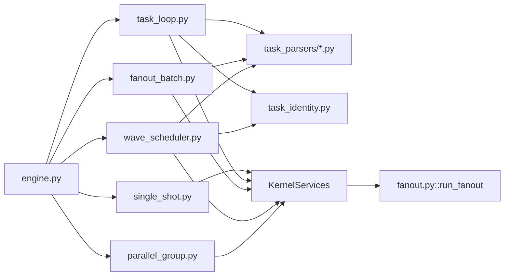
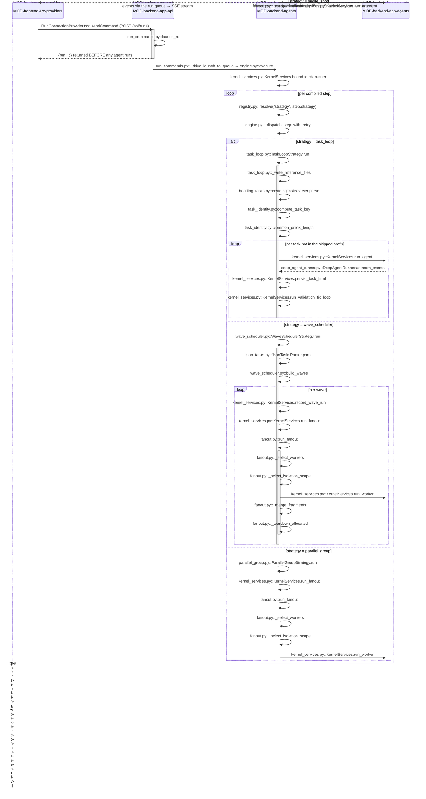

<!-- AUTO-GENERATED BELOW THIS LINE — regenerated by tools/knowledge/build_architecture.py -->

### Members (11 files across 1 modules)

**[MOD-backend-agents](MOD-backend-agents.md)**
- [backend/agents/capabilities/strategies/__init__.py](../../backend/agents/capabilities/strategies/__init__.py)
- [backend/agents/capabilities/strategies/fanout_batch.py](../../backend/agents/capabilities/strategies/fanout_batch.py)
- [backend/agents/capabilities/strategies/parallel_group.py](../../backend/agents/capabilities/strategies/parallel_group.py)
- [backend/agents/capabilities/strategies/single_shot.py](../../backend/agents/capabilities/strategies/single_shot.py)
- [backend/agents/capabilities/strategies/task_loop.py](../../backend/agents/capabilities/strategies/task_loop.py)
- [backend/agents/capabilities/strategies/wave_scheduler.py](../../backend/agents/capabilities/strategies/wave_scheduler.py)
- [backend/agents/capabilities/task_identity.py](../../backend/agents/capabilities/task_identity.py)
- [backend/agents/capabilities/task_parsers/__init__.py](../../backend/agents/capabilities/task_parsers/__init__.py)
- [backend/agents/capabilities/task_parsers/heading_tasks.py](../../backend/agents/capabilities/task_parsers/heading_tasks.py)
- [backend/agents/capabilities/task_parsers/json_tasks.py](../../backend/agents/capabilities/task_parsers/json_tasks.py)
- [backend/agents/execution_engine/fanout.py](../../backend/agents/execution_engine/fanout.py)

### Imported by, from outside this domain (2)
- [backend/agents/execution_engine/engine.py](../../backend/agents/execution_engine/engine.py)
- [backend/agents/execution_engine/kernel_services.py](../../backend/agents/execution_engine/kernel_services.py)

### Imports, from outside this domain (7)
- [backend/agents/__init__.py](../../backend/agents/__init__.py)
- [backend/agents/capabilities/__init__.py](../../backend/agents/capabilities/__init__.py)
- [backend/agents/capabilities/registry.py](../../backend/agents/capabilities/registry.py)
- [backend/agents/execution_engine/__init__.py](../../backend/agents/execution_engine/__init__.py)
- [backend/agents/execution_engine/budget.py](../../backend/agents/execution_engine/budget.py)
- [backend/agents/workflows/__init__.py](../../backend/agents/workflows/__init__.py)
- [backend/agents/workflows/plan.py](../../backend/agents/workflows/plan.py)

### External
(none)
<!-- /AUTO-GENERATED -->

## Purpose

This domain owns the answer to one question: **given a compiled step, how is its
work actually driven?** Five strategies answer it five ways — run the agent once
(`single_shot`), split a plan into tasks and run one isolated sub-agent per task
against a cumulative file (`task_loop`), fan a task list out to parallel workers
in one batch (`fanout_batch`), partition a dependency-carrying task list into
topological waves and fan each wave out in turn (`wave_scheduler`), or run already-
distinct sibling sub-agents concurrently then run the parent over their results (`parallel_group`). Supporting
them are the two parsers that turn planner prose or agent JSON into typed `Task`
objects, the content-addressed identity function every resumable task is keyed
on, and [fanout.py](../../backend/agents/execution_engine/fanout.py) — the single kernel spawn path all parallel work funnels
through. Without this domain the engine has a sequence of steps and no way to
execute any of them: [engine.py](../../backend/agents/execution_engine/engine.py) resolves a strategy by name and iterates it, and
that is the whole of its per-step execution logic.

Where it ends matters as much. The strategies decide *shape* — how many agent
invocations, in what order, over which task list. They decide nothing about
*what one agent invocation is*: model selection, prompt composition, sandbox
writes, deliverable readback and the validation fix-loop all live behind
`KernelServices` and belong to the kernel. They also decide nothing the kernel
reserves for itself: worker allow-listing, concurrency caps, isolation scope and
merge-strategy selection are [fanout.py](../../backend/agents/execution_engine/fanout.py)'s, deliberately out of manifest reach.
Manifest parsing and capability-reference validation belong to the compiler; the
`(kind, name)` seam itself belongs to [registry.py](../../backend/agents/capabilities/registry.py). If your question is "why did
this run produce three agent invocations instead of one", you are in the right
place. If it is "why did that one invocation produce this text", you are next
door in the runner/factory path.

## Shape

**Not one of these modules may import `agents.execution_engine` or `app.*` — an
import-linter contract in `backend/pyproject.toml` forbids it — so every kernel
primitive a strategy needs is reached dynamically through the object-typed
`ctx.runner` handle, and every sibling capability by name through
`CapabilityRegistry`.**

- **The dispatch seam.** [engine.py](../../backend/agents/execution_engine/engine.py) reads `step.strategy` (defaulting to
  `single_shot` when a run has no compiled step for the agent), resolves it via
  [registry.resolve](../../backend/agents/capabilities/registry.py), and drives it inside `_dispatch_step_with_retry`. Every
  strategy is an async generator of `{"type", "data"}` dicts; the engine's emit
  boundary stamps sequence numbers. No strategy emits directly.
- **The five strategies.** [single_shot.py](../../backend/agents/capabilities/strategies/single_shot.py) is one `runner.run_agent` call.
  [task_loop.py](../../backend/agents/capabilities/strategies/task_loop.py) is the largest member and the only sequential-cumulative one: it
  seeds reference files into the sandbox, parses tasks, and loops
  `run_agent` → `persist_task_html` → `run_validation_fix_loop` →
  `_run_registered_validators`. [fanout_batch.py](../../backend/agents/capabilities/strategies/fanout_batch.py), [wave_scheduler.py](../../backend/agents/capabilities/strategies/wave_scheduler.py), and [parallel_group.py](../../backend/agents/capabilities/strategies/parallel_group.py) are
  thin — they shape worker requests and hand them to `runner.run_fanout`. The difference: `fanout_batch` and `wave_scheduler` parse their worker list from upstream output; `parallel_group` sources it from the manifest's declared sibling agent ids in `step.fanout.workers`, spawns them concurrently, then runs the parent's own agent once over their results.
- **The parsers.** [heading_tasks.py](../../backend/agents/capabilities/task_parsers/heading_tasks.py) slices `## Task N:` markdown blocks (with a
  `<tasks>` fallback) and is the flat default; [json_tasks.py](../../backend/agents/capabilities/task_parsers/json_tasks.py) parses a
  structured array carrying `depends_on` / `conflict_keys` / `targets` and is the
  wave default. Both are pure `str -> list[Task]` and both are resolved by name,
  never imported by their consumers.
- **The scheduler.** `build_waves` in [wave_scheduler.py](../../backend/agents/capabilities/strategies/wave_scheduler.py) is a pure Kahn-levels
  topological sort with a stable id tie-break and a within-level conflict-key
  split; it raises `WaveBuildError` before returning any wave.
- **The identity substrate.** [task_identity.py](../../backend/agents/capabilities/task_identity.py) is pure and stdlib-only:
  `normalize_task_content`, `occurrence_ordinals`, `compute_task_key`,
  `common_prefix_length`. Both [task_loop.py](../../backend/agents/capabilities/strategies/task_loop.py) and [wave_scheduler.py](../../backend/agents/capabilities/strategies/wave_scheduler.py) key their
  resume behaviour on it; the engine's boundary reconciler calls
  `common_prefix_length` too, so the rule has one home.
- **The module-boundary crossing.** [fanout.py](../../backend/agents/execution_engine/fanout.py) sits on the *kernel* side of the
  line while the four strategies sit on the *capability* side — both inside
  `MOD-backend-agents`, but on opposite sides of the import contract. Control
  crosses one way only: strategy → `ctx.runner.run_fanout` → [fanout.py](../../backend/agents/execution_engine/fanout.py). A
  strategy that reaches for [fanout.run_fanout](../../backend/agents/execution_engine/fanout.py) directly fails CI.

## In practice

### The path, by call

### Step by step

**Launch (the request returns before the work starts)**

1. The browser calls `RunConnectionProvider.tsx::sendCommand` with a null run id,
   which POSTs to `/api/runs`.
2. `run_commands.py::launch_run` validates the payload, mints the run row, spawns
   `_drive_launch_to_queue` as a background task, and **returns `{run_id}`
   immediately**. Everything below happens after the HTTP response is already on
   the wire; the client sees it over the SSE stream.
3. `_drive_launch_to_queue` calls [engine.py::execute](../../backend/agents/execution_engine/engine.py), which compiles the
   workflow, overlays any user selections via [engine.py::_apply_selections](../../backend/agents/execution_engine/engine.py), and
   binds a `KernelServices` instance onto `ectx.runner`.

**Per-step dispatch**

4. For each compiled step the engine reads `step.strategy` (falling back to
   `single_shot`), calls [registry.py::resolve](../../backend/agents/capabilities/registry.py) with `("strategy", name)`, and
   enters [engine.py::_dispatch_step_with_retry](../../backend/agents/execution_engine/engine.py), which for a step declaring no
   `retry` simply re-yields `strategy.run(step, ectx)` unchanged.

**task_loop — the cumulative single-file path**

5. [task_loop.py::TaskLoopStrategy.run](../../backend/agents/capabilities/strategies/task_loop.py) reads the deliverable filename off
   `ctx.deliverable`, resolves the producer step ids off `step.task_source`, and
   pulls the planner's output via `runner.latest_typed_content`.
6. [task_loop.py::_write_reference_files](../../backend/agents/capabilities/strategies/task_loop.py) writes the spec/design/tasks seed files
   (and, when a template is bound, `template.html` via `runner.template_example`)
   into the run sandbox — once, before any task runs.
7. The declared parser is resolved by name; [heading_tasks.py::HeadingTasksParser.parse](../../backend/agents/capabilities/task_parsers/heading_tasks.py)
   returns the task list. Zero tasks means the planner emitted no plan: the loop
   runs exactly one pass with an empty task block.
8. [task_identity.py::compute_task_key](../../backend/agents/capabilities/task_identity.py) produces one 64-char key per task from
   `runner.upstream_context_hash(step)`, the normalized content, and the
   occurrence ordinal. [task_identity.py::common_prefix_length](../../backend/agents/capabilities/task_identity.py) compares those
   keys against `ctx.resume_completed_ordered` to get the skip count `p`.
9. For task `n > p`: optional task-2+ compaction is resolved and applied, a
   `task_loop_progress` event is yielded, then `runner.run_agent` runs the
   isolated per-task sub-agent and every event it produces is re-yielded.
10. `runner.persist_task_html` writes the post-task deliverable into the typed
    artifact graph, stamped with the task key.
11. `runner.run_validation_fix_loop` runs static + render validation and a
    bounded fix loop. It drains the fix sub-agent's stream internally and
    re-emits nothing, so the UI sees exactly one build per task.
12. [task_loop.py::_run_registered_validators](../../backend/agents/capabilities/strategies/task_loop.py) runs the step's declared
    validators against the post-fix file for audit rows only — no events. If the
    fix loop changed the file on disk, `persist_task_html` runs a second time so
    downstream consumers read the fixed HTML.

**wave_scheduler — the parallel path**

13. [wave_scheduler.py::WaveSchedulerStrategy.run](../../backend/agents/capabilities/strategies/wave_scheduler.py) sources the same way, but
    [json_tasks.py::JsonTasksParser.parse](../../backend/agents/capabilities/task_parsers/json_tasks.py) is the default parser — it validates
    the JSON, rejects duplicate ids and dangling `depends_on` refs, and returns
    tasks carrying the scheduling surface.
14. [wave_scheduler.py::build_waves](../../backend/agents/capabilities/strategies/wave_scheduler.py) partitions into topological levels, splitting
    within a level on conflict keys (defaulting to `targets`).
15. Per wave: `runner.record_wave_run` writes a `wave_runs` row, a `wave_started`
    event is yielded, and the wave's tasks become `run_fanout` requests each
    carrying its content-addressed `task_id`.
16. `runner.run_fanout` delegates to [fanout.py::run_fanout](../../backend/agents/execution_engine/fanout.py), which checks cancel,
    applies the declared `FanoutSpec` via `_apply_declared_fanout`, allow-list
    validates every worker in `_select_workers`, reserves budget, picks the
    isolation scope in `_select_isolation_scope`, and spawns workers under a
    semaphore capped by `_resolve_concurrency`.
17. Each worker's files persist as fragment artifacts before any merge;
    [fanout.py::_merge_fragments](../../backend/agents/execution_engine/fanout.py) then runs the engine-selected merge strategy and,
    on conflict, `_resolve_conflict` applies the step's `on_conflict` policy.
    `_teardown_allocated` reclaims every isolated workspace in a `finally`.
18. The strategy stamps `wave_index` and `step` onto each `subagent_spawned` /
    `subagent_result` event as it re-yields it, flips the `wave_runs` row to
    `completed`, and yields `wave_completed`.

**parallel_group — the sibling-group path**

19. [parallel_group.py::ParallelGroupStrategy.run](../../backend/agents/capabilities/strategies/parallel_group.py) reads the child agent ids from
    `step.fanout.workers` (populated by the compiler from the manifest's declared siblings),
    then spawns them concurrently via `runner.run_fanout` with heterogeneous worker requests
    (one child per request, each with its own declared `agent` id, unlike `fanout_batch`
    which clones the parent N times).
20. Per-worker behavior is identical to `wave_scheduler` workers: each worker's files persist
    as fragment artifacts, merge happens after all spawn (no per-wave batching here), and
    `_merge_fragments` → `_resolve_conflict` runs the engine-selected merge strategy.
21. After the fan-out completes and fragments merge, `runner.run_agent` runs the parent's
    own agent once over the merged results — the children's artifacts are already on disk
    (Phase 2 in the `parallel_group` design: spawn siblings, then run parent).

**Return**

22. Every event yielded by the strategy flows back up through
    `_dispatch_step_with_retry` → `execute` → the per-run queue → the SSE stream
    the frontend already attached to.

### What breaks if you get it wrong

**Silent, and the ones worth fearing:**

- **Using set membership instead of `common_prefix_length` for a `task_loop`
  resume.** Each task edits the same evolving file, so task `k`'s correctness
  depends on tasks `1..k-1`. A task whose own key matches a completed key but
  whose predecessor changed *must* re-run. Skip it and the run completes normally
  with a deliverable built on the wrong basis — no error, no warning, wrong file.
- **Indexing `[p-1]` when `common_prefix_length` returns 0.** Negative-index
  restore: you silently re-materialize the *last* completed task's state as the
  basis for a run that should have started clean.
- **Introducing non-determinism into [task_identity.py](../../backend/agents/capabilities/task_identity.py)** — `hash()`, an unsorted
  collection, a timestamp. Keys stop matching across processes, so every resume
  re-runs everything and every `wave_runs` skip misses. It looks like slowness,
  not a bug.
- **Letting a parser keep the `## Task N:` ordinal in `Task.body`.** Reordering
  tasks then rotates every key from the first move onward and the resume prefix
  collapses to zero. `_strip_leading_ordinal` is load-bearing.
- **A wave task declaring neither `conflict_keys` nor `targets`.** Its key set is
  empty, so it never conflicts with anything and co-schedules with every peer —
  including one writing the same file. The damage shows up as a merge conflict at
  best and a silent overwrite at worst, one layer downstream from the cause.
- **Registering a new strategy with `user_allowed=True` when it carries
  privilege.** The four here are user-grantable precisely because running agents
  carries no exec/secrets/spawn grant. A privileged one on the user palette is a
  security regression with no runtime symptom.
- **Swallowed-by-design failures.** [task_loop.py::_maybe_resolve_compaction](../../backend/agents/capabilities/strategies/task_loop.py)
  catches `KeyError`/`RuntimeError` and returns `None`;
  `_run_registered_validators` catches everything per validator; the reference-file
  writes catch everything. Each is deliberate — none of them may abort a build —
  but each means a genuinely broken capability degrades to a no-op and logs a
  warning nobody reads.
- **`fanout_batch` with an unparseable task list.** It logs a warning and returns
  without yielding a single event. The step "completes" having done nothing.
- **`parallel_group` with an empty or missing `step.fanout.workers` list.** It logs
  a warning, skips the fan-out, and degrades to running only the parent's agent
  via `single_shot`. The step completes silently without spawning any child workers.

**Loud, so you needn't worry:**

- Importing `agents.execution_engine` or `app.*` from any member fails the
  import-linter contract in CI, not at runtime.
- [json_tasks.py](../../backend/agents/capabilities/task_parsers/json_tasks.py) raises a named `ValueError` on malformed JSON, a duplicate id,
  or a dangling `depends_on` — before returning any task.
- `build_waves` raises `WaveBuildError` on a cycle, an unknown ref, or a duplicate
  id — before any wave is returned, so zero `wave_runs` and zero `subagent_runs`
  rows exist.
- [fanout.py::_select_workers](../../backend/agents/execution_engine/fanout.py) raises `FanoutError` naming a disallowed or unknown
  worker before any spawn, allocation, or row write.
- A capability name not in [registry.py](../../backend/agents/capabilities/registry.py)'s `_KNOWN` is a compile-time rejection
  naming the bad reference, not a run-time surprise.

### The other paths

**The bad-plan path.** Both parallel strategies validate before they schedule, and
both validators raise rather than degrade. The whole point is that a malformed
agent-emitted plan produces *zero* durable rows: nothing to reconcile, nothing to
resume, nothing for a later run to trust. This is why [json_tasks.py](../../backend/agents/capabilities/task_parsers/json_tasks.py) duplicates
the duplicate-id check that `build_waves` also performs — the parser is the gate
on untrusted JSON, the builder is defence in depth for any other caller.

**The resume path.** The kernel — never a strategy, never an agent — computes what
was already done and stamps it on the context; the strategy only consumes it. The
two strategies then consume it differently on purpose. `task_loop` uses an ordered
common-prefix skip because its tasks are cumulative edits to one file. `wave_scheduler`
uses per-key set membership over `ctx.resume_completed_task_ids` plus a wholesale
skip of any `wave_runs` row already terminal *for this step* — waves run in parallel,
so completion order is not dispatch order, and the completed-wave read is
step-filtered so a second wave step in the same run can never consume the first's
indices. A stale `running` row from a pre-crash wave is flipped to `superseded`
before the re-entry row is written, or the step would read as permanently incomplete.

**The runtime spawn path.** `fanout_batch` is the *declarative* way into
`run_fanout`; there is a second, imperative one. When an agent calls the
`spawn_subagents` tool, [engine.py::_derive_fanout](../../backend/agents/execution_engine/engine.py) parses the structured request
off the tool result, checks the step's effective `tools.spawn_subagents` grant, and
fulfils it through the same `run_fanout`. Both entry points share one spawn path, so
worker allow-listing, budget reserve, isolation and merge apply identically whether
the fan-out was declared in a manifest or requested by a model mid-run.

**The cancel path.** [fanout.py::_check_cancel](../../backend/agents/execution_engine/fanout.py) runs before the wave, between
sequential workers, and before the merge; in parallel mode `_gather_or_cancel`
races the workers against the cancel event and cancels every in-flight task.
Rows for workers that never got to run their own handler are flipped `cancelled`
by `_mark_open_cancelled`, and `_teardown_allocated` reclaims workspaces from a
`finally` on every path — happy, cancelled, or budget-exceeded. Fragments persist
*before* the merge specifically so a cancel between collect and merge still leaves
the completed workers' output durable.

## Why this shape

**Strategies are registered capabilities because SC-001 requires it.**
`.knowledge/ARCHITECTURE.md` states the load-bearing invariant: a brand-new custom
workflow must replicate the built-in `prototype` workflow from a manifest and an
`AGENT.md` alone, with zero engine edits. That is only possible if "how a step
runs" is a name a manifest declares rather than a branch the engine takes.
[engine.py](../../backend/agents/execution_engine/engine.py)'s entire per-step dispatch is `resolve("strategy", name)` followed by
iterating the result — there is no `if pipeline_type ==` anywhere on this path, and
test_sc001_reconcile.py is the executable proof.

**The `ctx.runner` handle exists because of an enforced import direction, not
taste.** The obvious design is for [task_loop.py](../../backend/agents/capabilities/strategies/task_loop.py) to import the engine and call
`_run_validation_fix_loop` directly. The import-linter contract *"agents.capabilities
must not import the execution kernel or the web layer"* in `backend/pyproject.toml`
forbids exactly that, so every kernel primitive arrives as a duck-typed attribute on
an object the kernel attached. This is why the strategies are littered with
`getattr(runner, ..., None)` guards: the handle's shape is a documented contract
rather than a type the modules can import, and an older or faked handle must degrade
rather than crash. The cost is real — a renamed `KernelServices` method fails at
runtime, not at import — and it is paid deliberately to keep the capability layer
inner.

**`run_fanout` is one function because multiple spawn paths would drift.** The
declarative routes (`fanout_batch`, `wave_scheduler`, `parallel_group`) and the
imperative `spawn_subagents` tool route all funnel through it, and no strategy holds
any spawn, worker-selection, concurrency, isolation, or merge logic of its own.
The alternative — letting each strategy spawn its own workers — would mean the
allow-list check, the budget reserve and the concurrency cap each existed thrice or
more, and a security fix would have to land in each. `_select_isolation_scope` and
`_select_merge_strategy` derive solely from the base workspace, never from
`step.fanout`, for the same reason: a user-authored manifest must not be able to
downgrade isolation.

**Task identity is content-addressed because positions lie.** A positional task id
survives none of the four things that actually happen to a task list between a
crash and a resume — reorder, edit, insert, duplicate — and an upstream spec edit
invalidates every downstream task without changing any of them. Hashing
`(upstream_context_hash · normalized_content · occurrence_ordinal)` handles all
five. The 64-char hex output also can never collide with a legacy positional id,
so an unmappable old row simply re-runs rather than matching something wrong.

**The two resume rules differ because the two execution shapes differ.** The
per-worker skip in `wave_scheduler` was deferred once and shipped later: it needed
`subagent_runs` to carry task identity, which migration 0019 did not, so until an
additive migration stamped `task_id` at spawn the strategy re-ran the whole
first-incomplete wave. The comments record the reasoning explicitly — re-running a
completed isolated worker is wasteful but correct, whereas skipping an incomplete
one is data loss.

**Not recorded:** why `fanout_batch` defaults to `heading_tasks` while
`wave_scheduler` defaults to `json_tasks` is stated as a fact in both modules
(waves need the `depends_on` surface) but no decision record explains why
`fanout_batch` was not given the structured parser as its default too. Likewise,
the choice of `2` as the default `max_fix_attempts` is described as "the Phase-7
default" without a recorded rationale.
