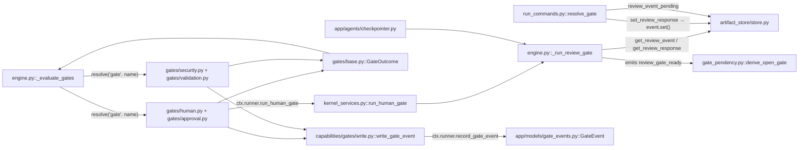
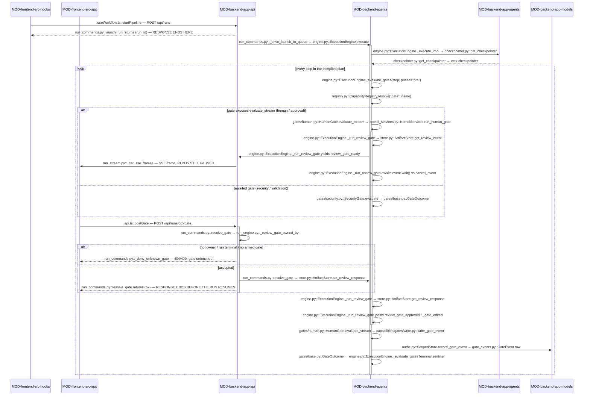

<!-- AUTO-GENERATED BELOW THIS LINE — regenerated by tools/knowledge/build_architecture.py -->

### Members (12 files across 4 modules)

**[MOD-backend-agents](MOD-backend-agents.md)**
- [backend/agents/capabilities/gate_pendency.py](../../backend/agents/capabilities/gate_pendency.py)
- [backend/agents/capabilities/gates/__init__.py](../../backend/agents/capabilities/gates/__init__.py)
- [backend/agents/capabilities/gates/approval.py](../../backend/agents/capabilities/gates/approval.py)
- [backend/agents/capabilities/gates/base.py](../../backend/agents/capabilities/gates/base.py)
- [backend/agents/capabilities/gates/conditional.py](../../backend/agents/capabilities/gates/conditional.py)
- [backend/agents/capabilities/gates/human.py](../../backend/agents/capabilities/gates/human.py)
- [backend/agents/capabilities/gates/security.py](../../backend/agents/capabilities/gates/security.py)
- [backend/agents/capabilities/gates/validation.py](../../backend/agents/capabilities/gates/validation.py)
- [backend/agents/capabilities/gates/write.py](../../backend/agents/capabilities/gates/write.py)

**[MOD-backend-app-agents](MOD-backend-app-agents.md)**
- [backend/app/agents/checkpointer.py](../../backend/app/agents/checkpointer.py)

**[MOD-backend-app-api](MOD-backend-app-api.md)**
- [backend/app/api/run_commands.py](../../backend/app/api/run_commands.py)

**[MOD-backend-app-models](MOD-backend-app-models.md)**
- [backend/app/models/gate_events.py](../../backend/app/models/gate_events.py)

### Imported by, from outside this domain (9)
- [backend/agents/authz.py](../../backend/agents/authz.py)
- [backend/agents/execution_engine/engine.py](../../backend/agents/execution_engine/engine.py)
- [backend/agents/execution_engine/kernel_services.py](../../backend/agents/execution_engine/kernel_services.py)
- [backend/app/api/chat_router.py](../../backend/app/api/chat_router.py)
- [backend/app/api/run_shutdown.py](../../backend/app/api/run_shutdown.py)
- [backend/app/api/run_stream.py](../../backend/app/api/run_stream.py)
- [backend/app/api/runs.py](../../backend/app/api/runs.py)
- [backend/app/main.py](../../backend/app/main.py)
- [backend/app/models/__init__.py](../../backend/app/models/__init__.py)

### Imports, from outside this domain (42)
- [backend/agents/__init__.py](../../backend/agents/__init__.py)
- [backend/agents/artifact_store/__init__.py](../../backend/agents/artifact_store/__init__.py)
- [backend/agents/artifact_store/store.py](../../backend/agents/artifact_store/store.py)
- [backend/agents/authz.py](../../backend/agents/authz.py)
- [backend/agents/capabilities/__init__.py](../../backend/agents/capabilities/__init__.py)
- [backend/agents/capabilities/model_pricing.py](../../backend/agents/capabilities/model_pricing.py)
- [backend/agents/capabilities/registry.py](../../backend/agents/capabilities/registry.py)
- [backend/agents/capabilities/validators/__init__.py](../../backend/agents/capabilities/validators/__init__.py)
- [backend/agents/capabilities/validators/severity.py](../../backend/agents/capabilities/validators/severity.py)
- [backend/agents/execution_engine/__init__.py](../../backend/agents/execution_engine/__init__.py)
- [backend/agents/execution_engine/engine.py](../../backend/agents/execution_engine/engine.py)
- [backend/agents/execution_engine/state_machine.py](../../backend/agents/execution_engine/state_machine.py)
- [backend/agents/loader.py](../../backend/agents/loader.py)
- [backend/agents/registry.py](../../backend/agents/registry.py)
- [backend/agents/workflows/__init__.py](../../backend/agents/workflows/__init__.py)
- [backend/agents/workflows/compiler.py](../../backend/agents/workflows/compiler.py)
- [backend/agents/workflows/manifest.py](../../backend/agents/workflows/manifest.py)
- [backend/agents/workflows/plan.py](../../backend/agents/workflows/plan.py)
- [backend/app/__init__.py](../../backend/app/__init__.py)
- [backend/app/agents/__init__.py](../../backend/app/agents/__init__.py)
- [backend/app/agents/chat/__init__.py](../../backend/app/agents/chat/__init__.py)
- [backend/app/agents/chat/concierge.py](../../backend/app/agents/chat/concierge.py)
- [backend/app/agents/chat_narrator.py](../../backend/app/agents/chat_narrator.py)
- [backend/app/agents/chat_runner.py](../../backend/app/agents/chat_runner.py)
- [backend/app/agents/modes.py](../../backend/app/agents/modes.py)
- …and 17 more

### External
fastapi, langgraph, pydantic
<!-- /AUTO-GENERATED -->

## Purpose

This domain owns the **step boundary as a decision point**: before (and after)
a step runs, something other than the model gets to say *pass*, *block*, or
*stop and ask a human* — and if it asks, the run has to survive the wait. Four
registered `GateHandler` capabilities express the policies (`human`,
`approval`, `security`, `validation`), one dataclass in [gates/base.py](../../backend/agents/capabilities/gates/base.py)
expresses their answers, one engine primitive expresses the pause, one table
records every firing, and one pure function decides — from the durable log
alone — whether a pause is still open. Without this domain a manifest could
declare `gates: [...]` and nothing would happen; more sharply, `exec` would be
authorized by whatever attached the workspace profile, because `security` is
the runtime tier that refuses an exec grant carrying no `approval` alongside
it.

Where it ends: this domain decides *whether* a step proceeds and *how the run
waits*, not what the wait is about. The validators the `validation` gate runs
belong to DOMAIN-validation-and-quality — this domain owns only the
block-critical/warn-non-critical policy applied to their findings. The
`ExecutionPolicy` / workspace profile the `approval` gate summarises for the
approver belongs to DOMAIN-workspace-isolation. Getting a `review_gate_ready`
frame onto the wire and back after a reload is DOMAIN-run-streaming; deciding
what a restarted process re-materializes is DOMAIN-durable-state-resume — this
domain contributes [gate_pendency.py](../../backend/agents/capabilities/gate_pendency.py), which both of them import, and nothing
more. The clarify/questionnaire pause is a *sibling* of the review gate that
shares that derivation but not this machinery: it never reaches a
`GateHandler`. If your question is "why did the run stop here and who can
un-stop it", it is here; if it is "what did the reviewer see" or "what happens
to the checkpoint while it waits", it is next door.

## Shape

**Every gate answers in one type — `GateOutcome` from [gates/base.py](../../backend/agents/capabilities/gates/base.py) — and
every HITL pause funnels into one primitive, [engine.py::_run_review_gate](../../backend/agents/execution_engine/engine.py); no
gate implementation imports the kernel or `app.*`, so both the pause and the
audit row are reached dynamically through the object-typed `ctx.runner`
handle.** That single constraint (an import-linter contract, not a convention)
shapes everything else in the domain.

- **The outcome contract** — [gates/base.py](../../backend/agents/capabilities/gates/base.py) is forty lines: three string
  constants (`GATE_PASS`, `GATE_BLOCK`, `GATE_WAIT_HUMAN`) and the
  `GateOutcome` dataclass carrying `outcome`, an additive `events` list, and an
  audit `detail`. Gates return a value; the kernel owns the yield. Everything
  in the domain imports these names rather than restating the strings.
- **The two gate shapes.** [security.py](../../backend/agents/capabilities/gates/security.py) and [validation.py](../../backend/agents/capabilities/gates/validation.py) implement
  `async evaluate(step, ctx) -> GateOutcome` and nothing else. [human.py](../../backend/agents/capabilities/gates/human.py) and
  [approval.py](../../backend/agents/capabilities/gates/approval.py) additionally implement `evaluate_stream`, an async generator
  yielding zero or more public event dicts and then exactly one terminal
  `GateOutcome`; their `evaluate` is a thin collector over it. `_evaluate_gates`
  duck-types on `evaluate_stream` — that is the whole capability check.
- **The single HITL delegate** — [kernel_services.py::run_human_gate](../../backend/agents/execution_engine/kernel_services.py) is the
  only route from a gate implementation into a pause. Both [human.py](../../backend/agents/capabilities/gates/human.py) and
  [approval.py](../../backend/agents/capabilities/gates/approval.py) call it off `ctx.runner`; [approval.py](../../backend/agents/capabilities/gates/approval.py) passes its exec-policy
  snapshot as `payload`, which supersedes `output` and rides the same
  `review_gate_ready.data.output` field. There is no `run_approval_gate`.
- **The pause itself** — [engine.py::_run_review_gate](../../backend/agents/execution_engine/engine.py) arms an `asyncio.Event`
  in [artifact_store/store.py](../../backend/agents/artifact_store/store.py) keyed `review:{run_id}:{agent_id}`, emits
  `review_gate_ready`, then waits on that event racing `cancel_event`. It loops:
  a refused `update_specs` clears the event and re-waits, so one firing can
  consume more than one response. Internal `_gate_rejected` / `_gate_edited` /
  `_gate_redo` / `_gate_update_specs` signals leave through the same generator
  as the public `review_gate_*` events and must be filtered by the consumer.
- **The kernel-side sequencer** — [engine.py::_evaluate_gates](../../backend/agents/execution_engine/engine.py) walks
  `step.gates` in declared order, splitting on `_POST_STEP_GATES`
  (`{"validation"}`), applying the WR-02 inline-dedupe for `human`, mapping a
  raise to `block` for `_FAIL_CLOSED_GATES` (`{"security","approval","human"}`)
  and to `pass` for everything else, converting a `block` from `_HITL_GATES`
  (`{"human","approval"}`) into a distinct `cancel` sentinel, and emitting a
  terminal `(None, outcome, detail)` tuple so a gate that halts without emitting
  an event still halts.
- **The audit trail** — `capabilities/gates/write.py::write_gate_event` is a
  five-line best-effort hop to `ctx.runner.record_gate_event`, which reaches
  [authz.py::ScopedStore.record_gate_event](../../backend/agents/authz.py) and inserts a `GateEvent` row
  stamped with the run's `owner_id`/`workspace_id`. [approval.py](../../backend/agents/capabilities/gates/approval.py) reads the same
  table back through `ctx.runner.read_gate_events` for its first-exec memory —
  the only place a gate consults its own history.
- **The durability derivation** — [gate_pendency.py](../../backend/agents/capabilities/gate_pendency.py) is pure stdlib: two
  `*_ready` type constants, two resolution frozensets, and `derive_open_gate`,
  which folds a durable `run_events` list into `(kind, gate_key)`. It touches no
  gate implementation and no `GateOutcome`; it exists so the SSE re-arm, the
  chat router, and the engine's restart scan agree on what "still paused" means.
- **The checkpointer** — `app/agents/checkpointer.py::get_checkpointer` is a
  process-wide cached singleton the engine binds onto `ectx.checkpointer` at run
  entry. It backs per-agent-invocation LangGraph state (and the in-graph
  `interrupt` the runner surfaces as a `gate` event); on a non-Postgres
  `DATABASE_URL`, or on Windows' ProactorEventLoop, it silently degrades to
  `InMemorySaver` with a warning.

**Module crossings.** Three, all one-way. Outbound from
[MOD-backend-agents](MOD-backend-agents.md): the gate implementations never
import `app.*` — `write_gate_event` and `run_human_gate` are `getattr` lookups
on an `Any`-typed handle precisely so the static contract holds, and the
`GateEvent` model in [MOD-backend-app-models](MOD-backend-app-models.md) is
imported lazily *inside* [authz.py::ScopedStore.record_gate_event](../../backend/agents/authz.py). Inbound from
[MOD-backend-app-api](MOD-backend-app-api.md): [run_commands.py](../../backend/app/api/run_commands.py) reaches down
into the kernel's [artifact_store/store.py](../../backend/agents/artifact_store/store.py) seams directly (`set_review_response`,
`review_event_pending`) rather than calling the engine — the HTTP layer resolves
a gate by setting the same event the kernel is waiting on, never by talking to
the kernel. Inbound from [MOD-backend-app-agents](MOD-backend-app-agents.md):
only [checkpointer.py](../../backend/app/agents/checkpointer.py), pulled in by an import local to
[engine.py::_execute_impl](../../backend/agents/execution_engine/engine.py).

## In practice

### The path, by call

### Step by step

**Launch — the browser starts a run and is answered immediately**

1. `useWorkflow.ts::startPipeline` builds the `run_pipeline` payload and hands it
   to `runConnection.sendCommand`, which posts it to `POST /api/runs`.
   [run_commands.py::launch_run](../../backend/app/api/run_commands.py) authenticates, validates the ingress, mints the
   `WorkflowRun`, spawns [run_commands.py::_drive_launch_to_queue](../../backend/app/api/run_commands.py) as a
   background task and returns `{run_id}`. Every step below happens after that
   response; the browser watches
   [run_stream.py::stream_run_events](../../backend/app/api/run_stream.py) (`GET /api/runs/{id}/events/stream`).
2. [engine.py::ExecutionEngine._execute_impl](../../backend/agents/execution_engine/engine.py) compiles the plan and binds
   `ectx.checkpointer` from [checkpointer.py::get_checkpointer](../../backend/app/agents/checkpointer.py).

**The step boundary — gates evaluate in declared order**

3. Per step, [engine.py::ExecutionEngine._evaluate_gates](../../backend/agents/execution_engine/engine.py) runs with
   `phase="pre"` and `inline_gated=self._should_gate(spec, ectx)`. A declared
   `human` gate is *skipped* when the inline gate already covers this agent, or
   when `ectx.gate_agent_ids` excludes it.
4. For each remaining declared name, `registry.py::CapabilityRegistry.resolve`
   returns the singleton gate object. `_evaluate_gates` checks for
   `evaluate_stream` and branches.
5. `gates/security.py::SecurityGate.evaluate` (awaited path) blocks any
   `network`/`secrets` request outright, and for `exec` requires engineer trust,
   `"approval" in step.gates`, and a non-empty `policy.exec_allow` on a bound
   workspace. It calls `write_gate_event` on every branch and returns a
   `GateOutcome`.

**The pause — one primitive, reached through the handle**

6. `gates/human.py::HumanGate.evaluate_stream` reads `ctx.last_streamed` as the
   review payload and calls `ctx.runner.run_human_gate`.
   `gates/approval.py::ApprovalGate.evaluate_stream` first calls
   `ctx.runner.read_gate_events` and short-circuits to `GATE_PASS` if this run
   already has an `approval`/`pass` row; otherwise it builds
   [approval.py::_exec_policy_snapshot](../../backend/agents/capabilities/gates/approval.py) and passes it as `payload`.
7. [kernel_services.py::KernelServices.run_human_gate](../../backend/agents/execution_engine/kernel_services.py) resolves the `AgentSpec`
   and delegates to [engine.py::ExecutionEngine._run_review_gate](../../backend/agents/execution_engine/engine.py), threading the
   run's `cancel_event`.
8. `_run_review_gate` computes `gate_key = f"{run_id}:{agent_id}"`, arms the
   `asyncio.Event` from [store.py::ArtifactStore.get_review_event](../../backend/agents/artifact_store/store.py) and clears it
   *before* emitting, transitions the state machine to `waiting_for_user`, and
   yields `review_gate_ready` carrying `redoable`, `update_specs_eligible`,
   `artifact_kind`, `revision_cycle` and `revision_in_flight`.
9. That dict is re-yielded immediately by `evaluate_stream`, by
   `_evaluate_gates`, and by `execute`, reaching
   [run_stream.py::_iter_sse_frames](../../backend/app/api/run_stream.py) and the browser **before** step 10 blocks.
   `page.tsx` maps it into `runStore`'s `reviewGateData`; [DashboardLayout.tsx](../../frontend/src/components/layout/DashboardLayout.tsx)
   projects it as `laneGate` and binds `onApprove={onApproveReview}`.
10. `_run_review_gate` enters its `while True` and awaits `event.wait()` raced
    against `cancel_event.wait()`. The run is now parked; the step has not run.

**Resolution — a separate HTTP request unblocks it**

11. The user clicks; the `onApproveReview` prop wired in `page.tsx` calls
    `api.ts::postGate` → `POST /api/runs/{id}/gate` with
    `{gate_key, action, approved, edited_content}`.
12. [run_commands.py::resolve_gate](../../backend/app/api/run_commands.py) checks, in this order: `gate_key` present
    (400), [run_engine.py::_review_gate_owned_by](../../backend/app/api/run_engine.py) (404, never 403),
    [run_engine.py::_review_gate_run_is_terminal](../../backend/app/api/run_engine.py) (409 `pipeline_not_running`),
    and [run_commands.py::_gate_is_pending](../../backend/app/api/run_commands.py) →
    [store.py::ArtifactStore.review_event_pending](../../backend/agents/artifact_store/store.py) (404 `gate_not_pending`).
13. On `update_specs` it additionally consults
    [run_engine.py::_review_gate_advertises_update_specs](../../backend/app/api/run_engine.py) and raises
    [run_commands.py::_deny_update_specs_not_offered](../../backend/app/api/run_commands.py) (409) if this firing did
    not publish the affordance.
14. It calls [store.py::ArtifactStore.set_review_response](../../backend/agents/artifact_store/store.py), which records the
    response dict and calls `event.set()`, then returns `{ok, action, gate_key}`
    to the browser. The HTTP response completes here — the run resumes
    concurrently.

**Resume — the kernel picks the response up**

15. `_run_review_gate` wakes, reads [store.py::ArtifactStore.get_review_response](../../backend/agents/artifact_store/store.py)
    and branches on the generic `action`. `redo` and an *eligible*
    `update_specs` yield an internal signal and return; an *ineligible*
    `update_specs` clears the event and loops back to step 10.
16. Otherwise it transitions back to `generating`, yields `review_gate_approved`,
    and yields `_gate_edited` when the response carried `edited_content`.
17. `HumanGate.evaluate_stream` re-yields the public `review_gate_*` events,
    consumes `_gate_rejected` into `rejected`, `_gate_edited` into
    `edited_content`, and `_gate_redo`/`_gate_update_specs` into
    `unwired_action_seen` — none of the internal signals is re-yielded.
18. It calls `write_gate_event` → `ctx.runner.record_gate_event` →
    [authz.py::ScopedStore.record_gate_event](../../backend/agents/authz.py), inserting one owner-scoped
    [gate_events.py::GateEvent](../../backend/app/models/gate_events.py) row with a content-free `detail`, then yields the
    terminal `GateOutcome` (with `events=[]`, carrying `edited_content` on
    `detail`).
19. `_evaluate_gates` maps a `block` from an `_HITL_GATES` member to `cancel`,
    otherwise yields `(None, outcome, detail)`. The dispatch loop in
    [engine.py::ExecutionEngine._execute_impl](../../backend/agents/execution_engine/engine.py) skips the `None` event when
    forwarding, applies any edit via
    [engine.py::ExecutionEngine._apply_declared_gate_edit](../../backend/agents/execution_engine/engine.py), and short-circuits
    the remaining declared gates if the outcome was `block`/`wait_human`.
20. The step's strategy runs. After it, `_evaluate_gates` runs again with
    `phase="post"` for `validation`, which resolves the step's declared
    validators, maps every issue through
    `validators/severity.py::map_severity`, blocks on `CRITICAL` and otherwise
    emits `validation_warning` and passes.

### What breaks if you get it wrong

**Silent, and the ones worth fearing:**

- **You add a new internal `_gate_*` signal to `_run_review_gate` and do not add
  a branch for it in both [gates/human.py](../../backend/agents/capabilities/gates/human.py) and [gates/approval.py](../../backend/agents/capabilities/gates/approval.py).** The
  unrecognised dict falls through to the `yield event` at the bottom of the
  filter chain, so an internal signal lands on the SSE wire — and because the
  loop then exits with `rejected`/`unwired_action_seen` both false, the outcome
  computes to `GATE_PASS`. The step signs itself off on an action the user never
  took. This has happened twice, which is why `_REDO` and `_UPDATE_SPECS` have
  named constants and multi-paragraph comments in both files.
- **You add a fifth member to `GateCommand.action` without a matching branch in
  `resolve_gate`.** The `else` arm now raises `_deny_unknown_gate_action`, so
  this fails loudly — but note *why* it refuses rather than rejecting: since
  [FIX-232](../cards/20260812-1153-FIX-232.md) a rejection is terminal, so degrading an unparsed action into a denial
  would destroy the run on a typo. If you "fix" that `else` back to an approve
  default, you restore the [ISS-070](../cards/20260812-0107-ISS-070.md) silent approval.
- **You add a gate capability and forget `_FAIL_CLOSED_GATES` in [engine.py](../../backend/agents/execution_engine/engine.py).**
  An exception anywhere inside it — including one raised by the state machine
  mid-HITL-stream — is swallowed, logged at `warning`, and the step executes as
  if the gate passed. For a policy gate that inverts the control's entire
  purpose, and the only evidence is one log line.
- **You add a resolution event type to the engine without adding it to
  `REVIEW_RESOLUTIONS` in [gate_pendency.py](../../backend/agents/capabilities/gate_pendency.py).** `derive_open_gate` keeps
  reporting the gate as open forever: [run_stream.py::_dangling_review_gate](../../backend/app/api/run_stream.py)
  re-emits `review_gate_ready` on every reconnect, and the engine's restart scan
  re-arms a waiter for a gate that was resolved hours ago. Nothing errors.
- **You write an `approval`/`pass` `gate_events` row from anywhere other than a
  genuine approval.** `ApprovalGate.evaluate_stream`'s D-03 memory matches on
  `gate == "approval" and outcome == "pass"` for the whole run — not per step —
  so any such row makes every subsequent exec step skip its sign-off silently.
- **You assume [gate_events.outcome](../../backend/app/models/gate_events.py) holds only the three `GateOutcome`
  values.** The model docstring says so, but the inline redo/update_specs
  handlers in [engine.py](../../backend/agents/execution_engine/engine.py) also write `"redo"` and `"update_specs"` rows, which
  [engine.py::_seed_gate_reentry_attempts](../../backend/agents/execution_engine/engine.py) counts to derive post-restart thread
  ids. Filtering the column to three values would silently reintroduce colliding
  `:redo{N}` checkpoint threads.
- **You buffer events inside an `evaluate_stream` instead of re-yielding them.**
  `review_gate_ready` then does not reach the consumer until *after*
  `_run_review_gate` returns — which it cannot do until the user responds to an
  event they never saw. The run hangs with no error. This is exactly the F1
  regression the two-method (`evaluate_stream` + collector `evaluate`) shape
  exists to prevent.
- **You run on a non-Postgres `DATABASE_URL`.** `get_checkpointer` warns once and
  returns `InMemorySaver`; gates work normally until a restart, after which the
  agent-side state is gone.

**Loud, so stop worrying about them:**

- A gate implementation importing `agents.execution_engine` or `app` at module
  top level fails the import-linter contract `agents.capabilities must not
  import the execution kernel or the web layer` in `pyproject.toml`.
- Declaring `exec` on a step without `approval` in its `gates` list is a
  `gate_blocked` event plus a `block` outcome from `SecurityGate`, with the
  reason string naming D-01.
- Resolving an unarmed, cross-owner, or terminal-run gate over HTTP is a
  404/409 with a `code` field; the gate is not touched either way.
- `resolve("gate", name)` on a name absent from the registry raises before any
  gate runs — the compiler already rejected it at run entry.

### The other paths

**The inline gate.** Most real pauses never touch a `GateHandler` at all.
[engine.py::ExecutionEngine._should_gate](../../backend/agents/execution_engine/engine.py) consults `ectx.gate_agent_ids` (or, if
absent, the agent's `AGENT.md` `gate: Human_Gate`) and `_run_agent` calls
`_run_review_gate` directly, post-step, with the agent's real output —
`redoable=True` and `update_specs_eligible` derived from
`_artifact_kind_for(spec)`. That is why the declared `human` gate carries the
WR-02 dedupe: both routes key on the same `gate_key`, so evaluating both would
prompt twice, once with an empty payload.

**Rejection.** `approved=False` makes `_run_review_gate` yield `_gate_rejected`;
`HumanGate` maps it to `GATE_BLOCK`; `_evaluate_gates` sees a `_HITL_GATES`
block and yields the `cancel` sentinel; the dispatch loop transitions to
`cancelled`, persists the budget snapshot and emits `pipeline_cancelled`. Before
WR-03 this merely skipped the step and the run finished "successfully" with the
state machine stranded in `waiting_for_user`.

**Reload while paused.** The gate lives in one process's `asyncio.Event`, so a
browser refresh has nothing to reconnect to. [run_stream.py::_iter_sse_frames](../../backend/app/api/run_stream.py)
replays the durable tail, then — only when `after_seq > 0`, the run is not
terminal, and `_dangling_review_gate` finds an unresolved `review_gate_ready`
at or below the client cursor — re-emits that stored frame. No new event is
fabricated and the engine is never consulted.

**Restart while paused.** [engine.py::ExecutionEngine.restore_non_terminal_runs](../../backend/agents/execution_engine/engine.py)
reads each non-terminal run's durable events through an owner-scoped
`ScopedStore`, calls `derive_open_gate`, and for an open `review` gate recreates
the store waiter *before* spawning the re-arm driver — arm-then-classify, so the
row is never left `waiting_for_user` with nothing listening.

**Stop while paused.** [run_commands.py::cancel_run](../../backend/app/api/run_commands.py) sets the per-run
`_CANCEL_EVENTS` entry; the `asyncio.wait` race inside `_run_review_gate` sees
`cancel_task` complete first and yields `_gate_rejected`. Without that race the
gate would stay blocked indefinitely and a later Redo could resume a cancelled
pipeline (KAN-100).

## Why this shape

**One HITL mechanism, and it is not new.** The `human` gate exists to make a
declared `gates: [human]` work; it does so by delegating to the *unchanged*
`_run_review_gate` rather than implementing a pause. [kernel_services.py](../../backend/agents/execution_engine/kernel_services.py) states
the rejected alternative outright — "There is NO sibling `run_approval_gate`
(rejected — a second HITL surface)" — and [approval.py](../../backend/agents/capabilities/gates/approval.py) reuses the same delegate
with a `payload` kwarg for the same reason: a second pause would mean a second
event vocabulary, a second re-arm derivation, and a frontend rebuild. The D-04
policy snapshot rides the existing `review_gate_ready.data.output` field
precisely so no new field ships.

**Gates reach the kernel dynamically because a CI contract forbids the import.**
`pyproject.toml` declares `agents.capabilities must not import the execution
kernel or the web layer` as a non-vacuous import-linter `forbidden` contract.
That is the whole reason `write_gate_event` is a `getattr` on an `Any`-typed
handle rather than a call to `ScopedStore`, and why [gate_pendency.py](../../backend/agents/capabilities/gate_pendency.py) is
restricted to pure functions over `getattr`/`get` so it can serve both the
kernel and `app/api` without either importing the other.

**The two-method gate shape is a fix, not a design flourish.** `evaluate_stream`
plus a collector `evaluate` came from the Phase-13 F1 defect: buffering the
delegate's events into a list meant `review_gate_ready` could not reach the WS
consumer until the delegate returned, which required the response to an event
nobody had received. `_evaluate_gates` duck-types on the method so
`security`/`validation` keep the awaited path byte-identically, and INV-12 keeps
`evaluate` a collector rather than a second implementation.

**The terminal `(None, outcome, detail)` sentinel decouples halting from
emitting.** WR-04 records the failure it fixed: the caller previously only
learned the outcome from inside the event loop, so a `GateOutcome` with
`outcome="block"` and an empty `events` list silently passed — at a security
boundary. Yielding the sentinel unconditionally keeps every existing event
stream byte-identical (the caller drops the `None`) while making the halt
observable.

**The `update_specs` fence is deliberately doubled.** `_run_review_gate` refuses
an ineligible `update_specs` by clearing the event and *continuing to wait* —
neither approving (fail-open at a HITL gate) nor rejecting (which since [FIX-232](../cards/20260812-1153-FIX-232.md)
would destroy the run). Its comment states the dependency explicitly: the
ingress check in [run_engine.py::_review_gate_advertises_update_specs](../../backend/app/api/run_engine.py) is allowed
to abstain when the durable row is missing *only because* the engine-side check
never abstains. [ISS-053](../cards/20260811-2101-ISS-053.md) is the recorded origin; `gate_key` naming a slot rather
than a firing is the underlying reason.

**Audit is best-effort, on purpose.** `write_gate_event`, `record_gate_event` and
`read_gate_events` all degrade to a no-op / `None` / `[]` and log, citing INV-3:
an audit write must never break the live stream. `gate_events` follows the §18
additive-table precedent set by [run_capabilities.py](../../backend/app/models/run_capabilities.py) — UUID PK, `run_id` FK,
`owner_id` and `workspace_id` both `nullable=False` under AUTHZ-01 — so a
cross-owner read returns nothing by default rather than by a check.

**[gate_pendency.py](../../backend/agents/capabilities/gate_pendency.py) exists because there were three copies.** Its docstring
names them: the clarify+review superset inline in [chat_router.py](../../backend/app/api/chat_router.py), the
review-only [run_stream._GATE_RESOLUTION_TYPES](../../backend/app/api/run_stream.py), and a third peek from
[run_commands._gate_is_pending](../../backend/app/api/run_commands.py). RESUME-17 collapsed them under INV-12 so the
restart scan re-arms exactly the gate the SSE re-emit derives, explicitly
instead of a parallel pending-arm store.

**Every discriminator is generic.** `action`, `redoable`,
`update_specs_eligible`, `artifact_kind`, `revision_cycle`, `revision_in_flight` — none is a workflow
or agent name, and `update_specs_eligible` is derived structurally from
`_artifact_kind_for(spec)`. That is SC-001 enforced at the point where it is
most tempting to break: the frontend needs to know whether to show a button, and
the cheap answer would have been to match an agent id.

**One thing is not reconciled anywhere.** [checkpointer.py](../../backend/app/agents/checkpointer.py)'s docstring opens
with "Backs durable HITL review-gate pauses", but the review gate's wait is an
in-process `asyncio.Event` in [artifact_store/store.py](../../backend/agents/artifact_store/store.py), and its cross-restart
survival comes from `derive_open_gate` re-arming that event from `run_events` —
not from the checkpointer, which backs per-agent-invocation graph state and the
in-graph `interrupt` that [deep_agent_runner.py](../../backend/app/agents/deep_agent_runner.py) surfaces as a `gate` event. No
card, comment, or test explains the overlap between the two mechanisms.
