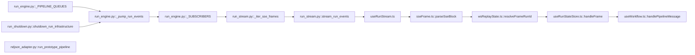
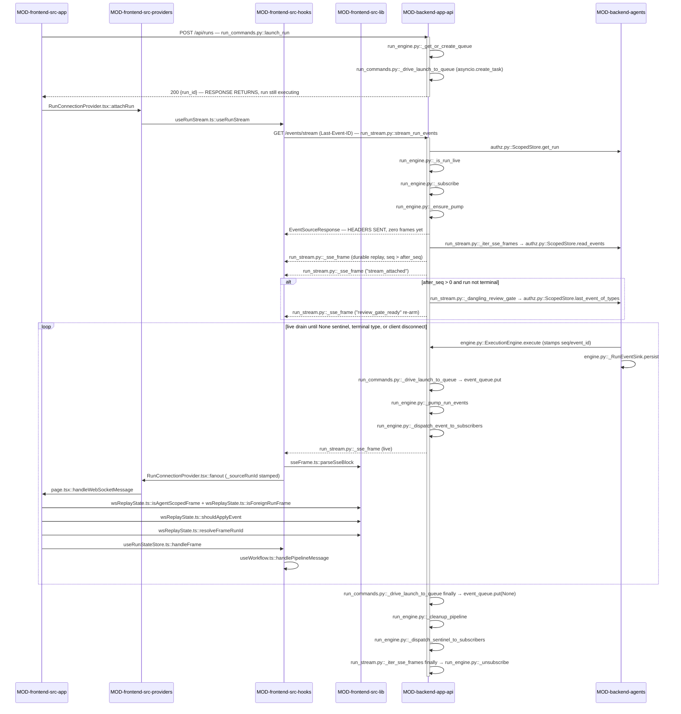

<!-- AUTO-GENERATED BELOW THIS LINE — regenerated by tools/knowledge/build_architecture.py -->

### Members (9 files across 4 modules)

**[MOD-backend-agents](MOD-backend-agents.md)**
- [backend/agents/execution_engine/ndjson_adapter.py](../../backend/agents/execution_engine/ndjson_adapter.py)

**[MOD-backend-app-api](MOD-backend-app-api.md)**
- [backend/app/api/run_engine.py](../../backend/app/api/run_engine.py)
- [backend/app/api/run_shutdown.py](../../backend/app/api/run_shutdown.py)
- [backend/app/api/run_stream.py](../../backend/app/api/run_stream.py)

**[MOD-frontend-src-hooks](MOD-frontend-src-hooks.md)**
- [frontend/src/hooks/useRunStateStore.ts](../../frontend/src/hooks/useRunStateStore.ts)
- [frontend/src/hooks/useRunStream.ts](../../frontend/src/hooks/useRunStream.ts)
- [frontend/src/hooks/useWorkflow.ts](../../frontend/src/hooks/useWorkflow.ts)

**[MOD-frontend-src-lib](MOD-frontend-src-lib.md)**
- [frontend/src/lib/sseFrame.ts](../../frontend/src/lib/sseFrame.ts)
- [frontend/src/lib/wsReplayState.ts](../../frontend/src/lib/wsReplayState.ts)

### Imported by, from outside this domain (21)
- [backend/agents/execution_engine/kernel_services.py](../../backend/agents/execution_engine/kernel_services.py)
- [backend/app/api/prototype_templates.py](../../backend/app/api/prototype_templates.py)
- [backend/app/api/run_commands.py](../../backend/app/api/run_commands.py)
- [backend/app/api/run_files.py](../../backend/app/api/run_files.py)
- [backend/app/api/websocket_handoff.py](../../backend/app/api/websocket_handoff.py)
- [backend/app/main.py](../../backend/app/main.py)
- [frontend/src/app/[...view]/bridgeTerminality.source.test.ts](../../frontend/src/app/%5B...view%5D/bridgeTerminality.source.test.ts)
- [frontend/src/app/[...view]/page.tsx](../../frontend/src/app/%5B...view%5D/page.tsx)
- [frontend/src/hooks/__fixtures__/reducerHarness.ts](../../frontend/src/hooks/__fixtures__/reducerHarness.ts)
- [frontend/src/hooks/__tests__/terminalStatusReconcile.test.ts](../../frontend/src/hooks/__tests__/terminalStatusReconcile.test.ts)
- [frontend/src/hooks/__tests__/useWorkflow.pipelineCancelled.test.ts](../../frontend/src/hooks/__tests__/useWorkflow.pipelineCancelled.test.ts)
- [frontend/src/hooks/useRunStream.test.ts](../../frontend/src/hooks/useRunStream.test.ts)
- [frontend/src/hooks/useWorkflow.clarifyRetention.test.ts](../../frontend/src/hooks/useWorkflow.clarifyRetention.test.ts)
- [frontend/src/hooks/useWorkflow.imagePayload.test.ts](../../frontend/src/hooks/useWorkflow.imagePayload.test.ts)
- [frontend/src/hooks/useWorkflow.reconnect.test.ts](../../frontend/src/hooks/useWorkflow.reconnect.test.ts)
- [frontend/src/hooks/useWorkflow.regenerateReset.test.ts](../../frontend/src/hooks/useWorkflow.regenerateReset.test.ts)
- [frontend/src/hooks/useWorkflow.specRevisionCount.test.ts](../../frontend/src/hooks/useWorkflow.specRevisionCount.test.ts)
- [frontend/src/lib/__tests__/wsRunScope.test.ts](../../frontend/src/lib/__tests__/wsRunScope.test.ts)
- [frontend/src/lib/sseFrame.test.ts](../../frontend/src/lib/sseFrame.test.ts)
- [frontend/src/lib/wsReplayState.test.ts](../../frontend/src/lib/wsReplayState.test.ts)
- [frontend/src/providers/RunConnectionProvider.tsx](../../frontend/src/providers/RunConnectionProvider.tsx)

### Imports, from outside this domain (37)
- [backend/agents/__init__.py](../../backend/agents/__init__.py)
- [backend/agents/artifact_store/__init__.py](../../backend/agents/artifact_store/__init__.py)
- [backend/agents/artifact_store/store.py](../../backend/agents/artifact_store/store.py)
- [backend/agents/authz.py](../../backend/agents/authz.py)
- [backend/agents/capabilities/__init__.py](../../backend/agents/capabilities/__init__.py)
- [backend/agents/capabilities/gate_pendency.py](../../backend/agents/capabilities/gate_pendency.py)
- [backend/agents/capabilities/model_catalog.py](../../backend/agents/capabilities/model_catalog.py)
- [backend/agents/capabilities/registry.py](../../backend/agents/capabilities/registry.py)
- [backend/agents/execution_engine/__init__.py](../../backend/agents/execution_engine/__init__.py)
- [backend/agents/execution_engine/engine.py](../../backend/agents/execution_engine/engine.py)
- [backend/agents/execution_engine/od_context.py](../../backend/agents/execution_engine/od_context.py)
- [backend/agents/execution_engine/state_machine.py](../../backend/agents/execution_engine/state_machine.py)
- [backend/agents/registry.py](../../backend/agents/registry.py)
- [backend/agents/workflows/__init__.py](../../backend/agents/workflows/__init__.py)
- [backend/agents/workflows/compiler.py](../../backend/agents/workflows/compiler.py)
- [backend/agents/workflows/selections.py](../../backend/agents/workflows/selections.py)
- [backend/app/__init__.py](../../backend/app/__init__.py)
- [backend/app/agents/__init__.py](../../backend/app/agents/__init__.py)
- [backend/app/agents/checkpointer.py](../../backend/app/agents/checkpointer.py)
- [backend/app/api/__init__.py](../../backend/app/api/__init__.py)
- [backend/app/api/chat_router.py](../../backend/app/api/chat_router.py)
- [backend/app/api/run_commands.py](../../backend/app/api/run_commands.py)
- [backend/app/api/runs.py](../../backend/app/api/runs.py)
- [backend/app/core/__init__.py](../../backend/app/core/__init__.py)
- [backend/app/core/config.py](../../backend/app/core/config.py)
- …and 12 more

### External
fastapi, react
<!-- /AUTO-GENERATED -->

## Purpose

This domain owns the **event contract between a running pipeline and a browser tab**:
how an engine event becomes an SSE frame, how a client that was not attached when the
event happened catches up, and how a client that was attached is released when the run
(or the process) ends. It is the only thing standing between "the engine produced
14,000 events" and "this tab renders the right run's agents". Without it a run still
executes and still persists — `run_events` rows are written by the kernel's own sink —
but nothing reaches a screen: no live frames, no reload recovery, no multi-tab
attachment, and no way for a paused review gate to re-open after a refresh.

Its boundaries are drawn at both ends. It does **not** own event *authorship* — `seq`
and `event_id` are stamped once, at the engine's emit boundary
([engine.py::ExecutionEngine.execute](../../backend/agents/execution_engine/engine.py)), and the durable row is written by
`_RunEventSink.persist`; that is the execution kernel's and durable-state's business.
It does **not** own the durable store itself — `ScopedStore.read_events` /
`last_event_of_types` and the owner scoping behind them belong to
`DOMAIN-durable-state-resume` and `DOMAIN-auth-and-entitlements`. It does **not** own
what a gate *means* — deciding a gate is open, resolving it, and the
`gate_pendency` vocabulary belong to `DOMAIN-hitl-gating`; this domain only *re-emits*
a gate frame on attach. And it does not own the up-channel: `POST /api/runs/{id}/gate`,
`/answers`, `/cancel`, `/messages` live in [run_commands.py](../../backend/app/api/run_commands.py), outside these members. If
your question is "why did this event exist" look next door; if it is "why did this tab
not see it", you are in the right card.

## Shape

**Every live frame crosses exactly two hops — the run's single producer queue, then a
per-subscriber fan-out queue — and no subscriber is ever fed by a pump bound to a
different queue *generation*.** That two-hop, generation-tagged path is the whole
design; every bug in this domain's history is a violation of one half of it.

- **The producer registry** is [run_engine.py](../../backend/app/api/run_engine.py): `_PIPELINE_QUEUES` (one unbounded queue
  per run, minted by `_get_or_create_queue`), `_PIPELINE_TASKS` (the driver task, which
  is the *only* authoritative liveness signal — `_is_run_live` self-heals a stale
  registration rather than trusting dict membership), `_CANCEL_EVENTS`, and
  `_QUEUE_GENERATIONS` (a monotonic token bumped on every *new* queue for a run id).
- **The fan-out bus** is also [run_engine.py](../../backend/app/api/run_engine.py): `_SUBSCRIBERS` holds `(queue, generation)`
  pairs, `_subscribe` / `_unsubscribe` bracket one SSE connection, and
  `_dispatch_event_to_subscribers` / `_dispatch_sentinel_to_subscribers` filter on that
  generation. `_evict_subscriber` closes a client whose queue hit `maxsize` instead of
  dropping the frame.
- **The bridge between them** is `_pump_run_events`, started lazily by the first
  subscriber via `_ensure_pump`. One pump per run *generation*, never per run id.
- **The wire** is [run_stream.py](../../backend/app/api/run_stream.py): `_iter_sse_frames` (durable replay → `stream_attached`
  handshake → gate re-arm → live drain) and `stream_run_events` (two-layer ownership
  check, cursor resolution, `EventSourceResponse`). `_sse_frame` / `_sse_body` render the
  frame; `_dangling_review_gate` derives the re-arm.
- **Process teardown** is [run_shutdown.py](../../backend/app/api/run_shutdown.py): `shutdown_run_infrastructure` sentinels every
  producer queue, then drains and cancels the pump tasks, before the checkpointer pool
  closes underneath them. `stop_run_driver` is the per-run `POST /cancel` backstop.
- **The browser half** is [useRunStream.ts](../../frontend/src/hooks/useRunStream.ts) (fetch + `ReadableStream`, `Last-Event-ID`
  reconnect, backoff, silent JWT refresh), `sseFrame.ts::parseSseBlock` (the one envelope
  parser, shared with the streamed POST up-channel), [wsReplayState.ts](../../frontend/src/lib/wsReplayState.ts) (the pure routing
  and dedup decisions), [useRunStateStore.ts](../../frontend/src/hooks/useRunStateStore.ts) (per-run `Map` + a single projected
  viewport), and `useWorkflow.ts::handlePipelineMessage` (the reducer).
- **Two module-boundary crossings matter.** Backend: `MOD-backend-app-api` reads *from*
  `MOD-backend-agents` (`ScopedStore`, `gate_pendency`, the engine) but the kernel never
  imports `app.*` — the resume-path hooks (`_register_resume_queue`,
  `_register_resume_task`, `_resume_cancel_event`, `_cleanup_pipeline`) are **injected
  onto the engine instance** in [main.py](../../backend/app/main.py) at startup, so control flows kernel→app through
  callbacks only. Frontend: `MOD-frontend-src-hooks` imports *down* into
  `MOD-frontend-src-lib` ([sseFrame.ts](../../frontend/src/lib/sseFrame.ts), [wsReplayState.ts](../../frontend/src/lib/wsReplayState.ts)) and never the reverse — those
  lib functions are pure precisely so they are testable outside React.
- **[ndjson_adapter.py](../../backend/agents/execution_engine/ndjson_adapter.py) is the one member not on this spine.** It flattens the engine's
  `{type, data}` envelopes into the flat NDJSON shapes [prototype_templates.py](../../backend/app/api/prototype_templates.py) streams
  from `POST /api/prototype/run` — a second, unrelated wire format over the same events.

## In practice

### The path, by call

### Step by step

**Launch (the run starts before anyone is watching)**

1. [app/layout.tsx](../../frontend/src/app/layout.tsx) mounts [RunConnectionProvider.tsx](../../frontend/src/providers/RunConnectionProvider.tsx) at the root, so it is the single
   owner of every attached stream in the tab; [DashboardLayout.tsx](../../frontend/src/components/layout/DashboardLayout.tsx) and [page.tsx](../../frontend/src/app/[...view]/page.tsx) reach
   it through `useRunConnection`.
2. The user submits a brief; [page.tsx](../../frontend/src/app/[...view]/page.tsx) calls `RunConnectionProvider.tsx::sendCommand`
   with a `null` run id, which is the launch case — `POST /api/runs`, handled by
   [run_commands.py::launch_run](../../backend/app/api/run_commands.py), resolving to the created `run_id`.
3. `launch_run` validates the untrusted payload through [run_engine.py::_validate_images](../../backend/app/api/run_engine.py),
   `_validate_model_overrides` and `_revalidate_selections_trust_user`, writes the
   `WorkflowRun` row, then calls [run_engine.py::_get_or_create_queue](../../backend/app/api/run_engine.py) — which mints the
   run's producer queue **and** bumps `_QUEUE_GENERATIONS`.
4. It spawns [run_commands.py::_drive_launch_to_queue](../../backend/app/api/run_commands.py) as a task, records it in
   `_PIPELINE_TASKS`, and **returns `{run_id}` immediately**. The HTTP request is over;
   the run has barely begun.

**Attach**

5. [page.tsx](../../frontend/src/app/[...view]/page.tsx) calls `RunConnectionProvider.tsx::attachRun`, which renders a
   `RunStreamConnection` for that run id and seeds `afterSeq` from the `sessionStorage`
   cursor.
6. `useRunStream.ts::useRunStream` runs `connect()`: `fetch` on
   `GET /api/runs/{id}/events/stream` with `Authorization` and, when a cursor exists,
   `Last-Event-ID`. It is `fetch` and not `EventSource` because `EventSource` cannot carry
   the JWT header.
7. [run_stream.py::stream_run_events](../../backend/app/api/run_stream.py) checks ownership twice — the `WorkflowRun.user_id`
   ORM filter, then [authz.py::ScopedStore.get_run](../../backend/agents/authz.py) — both 404 on failure, never 403.
8. It builds a **second, session-less** `ScopedStore` for the generator, snapshots
   `run_is_terminal` against [chat_router.py::TERMINAL_STATUSES](../../backend/app/api/chat_router.py) while the row is still
   attached, parses `Last-Event-ID` into `after_seq` (a garbage header degrades to a full
   replay, not a 422).
9. If [run_engine.py::_is_run_live](../../backend/app/api/run_engine.py) says a driver task is alive, it calls
   [run_engine.py::_subscribe](../../backend/app/api/run_engine.py), which registers a `(queue, generation)` pair and calls
   `_ensure_pump`. It returns an `EventSourceResponse` — **headers are on the wire before
   a single frame exists**.

**Replay, handshake, re-arm**

10. [run_stream.py::_iter_sse_frames](../../backend/app/api/run_stream.py) reads `ScopedStore.read_events(run_id, after_seq)`
    and yields one `_sse_frame` per durable row, merging the row's `event_id`/`seq`
    columns *last* so they beat any same-named payload key. It records every replayed
    `event_id`.
11. It emits `stream_attached {live, replayed_through_seq}` — the client's signal that the
    tail is drained.
12. When `after_seq > 0` and the run is not terminal, `_dangling_review_gate` asks
    `ScopedStore.last_event_of_types` for the newest row in the
    `review_gate_ready | REVIEW_RESOLUTIONS` vocabulary; if it is a `review_gate_ready`
    at or below the cursor, the gate frame is re-emitted so a reload re-opens the gate.

**Live drain**

13. The engine stamps `seq`/`event_id` at its emit boundary, persists via
    `_RunEventSink.persist`, and yields; `_drive_launch_to_queue` puts `{type, data}` onto
    the producer queue.
14. `_pump_run_events` takes it and calls `_dispatch_event_to_subscribers`, which copies it
    into every subscriber queue **of its own generation** (a full queue means
    `_evict_subscriber`, not a silent drop).
15. `_iter_sse_frames` wakes on `live_queue.get()`, skips anything whose `event_id` was
    already replayed in step 10, and yields the frame.

**Browser**

16. `useRunStream.ts::dispatchBlock` splits on `\n\n`, calls
    `sseFrame.ts::parseSseBlock`, advances the cursor from `data.seq` (falling back to the
    `id:` line), swallows keepalives, and stamps `_sourceRunId`.
17. `RunConnectionProvider.tsx::fanout` hands the frame to `page.tsx::handleWebSocketMessage`,
    which drops foreign per-agent frames (`wsReplayState.ts::isAgentScopedFrame` +
    `isForeignRunFrame`), dedups by `event_id` (`shouldApplyEvent`), resolves the owning
    run (`resolveFrameRunId`), **and filters by type against the `pipelineTypes` allow-list**
    (frames not in this list never reach the reducer or any handler).
18. `useRunStateStore.ts::handleFrame` **filters against the `pipelineFrameTypes`
    allow-list** — frames not in this list return early — then writes into that run's
    `Map` entry via `useWorkflow.ts::handlePipelineMessage`, recomputes
    `deriveSpecRevisionCount`, and calls `project()` **only** if this run is the
    viewport — a background run mutates state with no React render. A frame must pass
    **both** type checks (step 17 and this one) to reach the reducer.

**Close**

19. The driver's `finally` puts `None` on the producer queue and calls `_cleanup_pipeline`;
    the pump forwards the sentinel to its generation's subscribers.
20. `_iter_sse_frames` returns on the sentinel (or on a `_STREAM_TERMINAL_TYPES` frame) and
    its `finally` calls `_unsubscribe`. `useRunStream` sees the body end and, because
    `sawNonLiveAttachRef` was set by the terminal frame, settles at `disconnected` instead
    of reconnecting.

### What breaks if you get it wrong

Silent, and therefore the ones to fear:

- **Backing the streaming generator with the request-scoped `ScopedStore`.** FastAPI tears
  the `get_db` dependency down *before* the streaming body runs, so `read_events` inside
  the generator re-acquires a pool connection with `owned=False` and never releases it —
  one leaked connection per live SSE stream. Nothing fails until the pool is exhausted and
  the whole app stops serving. This is why `stream_run_events` builds `stream_store`
  separately (BUG-004).
- **Letting `_iter_sse_frames` return without `_unsubscribe`.** The subscriber queue stays
  in `_SUBSCRIBERS` for the process lifetime, buffering up to
  `SSE_SUBSCRIBER_QUEUE_MAXSIZE` events each. A slow OOM, no error (H-10 — this is why the
  whole generator body, not just the drain loop, sits in one `try/finally`).
- **Dropping instead of evicting when a subscriber queue is full.** The client's
  `Last-Event-ID` keeps advancing past the gap as it drains what did arrive, so the gap is
  never seen as a gap and is never replayed. `_evict_subscriber` exists to convert a
  silent permanent hole into a visible reconnect (H-09).
- **Keying pump liveness on `run_id` alone.** A resumed run installs a new producer queue
  under the same id while the old pump still looks alive, so nothing is ever started for
  the new generation and every attached client hangs on a queue no one feeds (C-06b).
- **Adding `review_gate_approved` to `_STREAM_TERMINAL_TYPES`.** Approve is a *resumption*,
  not a terminal — closing the stream on it forces a reconnect and a full replay on every
  gate approval (BUG-016). The gate-re-arm set `_GATE_REARM_TYPES` deliberately *does*
  include it; conflating the two sets is the trap.
- **Omitting `pipeline_diverted` from `_STREAM_TERMINAL_TYPES`.** A conditional gate with
  `trigger: workflow` (R-13) ends the parent run with this frame and NO `pipeline_complete`
  that follows, so the frame genuinely closes the stream — omitting it means the client
  rendered "Reconnecting…" and dropped, never seeing the divert event until a stale replay
  after the reconnect. It is added via union (not from `_GATE_RESOLUTION_TYPES`) because
  a cross-workflow divert is not a gate resolution, and widening that set would change
  gate re-arm semantics as a side effect (only the stream-terminal set should exclude it).
- **Re-emitting the gate without the `dangling.seq <= after_seq` guard.** When the gate row
  is past the cursor the durable replay already delivered it, so the re-arm doubles it
  (CR-01).
- **Emitting a frame with no `event_id`.** Both dedup layers — `_iter_sse_frames`'s
  `replayed_event_ids` skip and `wsReplayState.ts::shouldApplyEvent` — pass unstamped
  frames through undeduped by design, so a reconnect re-applies them.
- **Adding an accumulating case to `handlePipelineMessage` without registering it.** A
  partial re-delivery appends a second copy of the streamed text. Half loud: the guard in
  [useWorkflow.accumulators.test.ts](../../frontend/src/hooks/useWorkflow.accumulators.test.ts) reads `ACCUMULATING_FRAME_TYPES` and fails until the
  new type is added — but only for types the test knows to look for.
- **Forgetting to add a new frame type to both `pipelineTypes` and `pipelineFrameTypes`.** Frames
  are filtered at **two separate places** before reaching the reducer: (1) [page.tsx](../../frontend/src/app/[...view]/page.tsx)'s
  `handleWebSocketMessage` checks the `pipelineTypes` allow-list, (2) [useRunStateStore.ts](../../frontend/src/hooks/useRunStateStore.ts)'s
  `handleFrame` checks the `pipelineFrameTypes` allow-list. A new frame type must be added to
  **both** lists or it is silently dropped before reaching `handlePipelineMessage`. The trap is
  that a missing type in `pipelineTypes` kills the *live run* view (the frame never reaches any
  handler), while a missing type in `pipelineFrameTypes` kills the *historical/saved run* view
  (the frame is re-read from durable storage but dropped in the reducer). One context can work
  while the other is broken, with no error — only missing UI updates in one view.

Loud, so you need not worry:

- Frame-shape drift is caught by tests/unit/test_sse_stream.py, which binds the endpoint's
  frames to the real `_sse_projection.assert_wire_parity`.
- A gate-vocabulary divergence fails the differential in
  `tests/unit/test_sse_stream.py::TestGateRearm`.
- A subscriber-queue leak is covered by tests/unit/test_run_stream_pool_leak.py.
- Importing `app.*` from `backend/agents` fails the import-linter contract outright.

### The other paths

**Reconnect / reload.** The response body ends for any reason — proxy timeout, laptop
sleep, a real drop. `useRunStream`'s reader loop falls out, `scheduleReconnect` backs off
(doubling, capped at 30s, never giving up) and re-issues the same GET with
`Last-Event-ID: <max-seen seq>`. Server-side this is just the same path with a non-zero
`after_seq`: a shorter durable replay, and the *only* case in which the gate re-arm can
fire. Correctness does not depend on the cursor being right — a stale cursor means a
larger replay, and `event_id` dedup makes that idempotent at three independent layers.

**Attaching to a finished run.** `_is_run_live` returns false (self-healing any stale
registry entry on the way), so `live_queue` is `None`: the durable tail plus
`stream_attached {live:false}` *is* the entire response and the stream closes cleanly.
The client must not treat that close as a drop — `sawNonLiveAttachRef` is what stops it
re-replaying ~14k events in a loop and flapping a "Reconnecting…" banner (BUG-015).

**Stop and shutdown.** `POST /cancel` sets the run's cooperative `_CANCEL_EVENTS` entry;
the engine observes it at a boundary and yields `pipeline_cancelled` through the normal
persisted-and-drained path, so the live wire gets a real terminal.
[run_shutdown.py::stop_run_driver](../../backend/app/api/run_shutdown.py) is the bounded fallback for a driver stuck mid-model-call,
and it reconciles the row terminal afterwards so the next boot does not re-adopt the run.
At process shutdown `shutdown_run_infrastructure` runs in a load-bearing order: await
Concierge turns first (cancelling one skips its durable `chat_reply` write), then sentinel
every producer queue and drain/cancel the pumps, then close the checkpointer pool last.

**The NDJSON prototype path.** `POST /api/prototype/run` never touches queues, subscribers
or `seq` at all: [ndjson_adapter.py::run_prototype_pipeline](../../backend/agents/execution_engine/ndjson_adapter.py) drives
[engine.execute](../../backend/agents/execution_engine/engine.py) directly and flattens each `{type, data}` envelope into a flat NDJSON
object for the endpoint's own reader. No durable replay, no resume, no ownership scoping
in this layer — it is a different contract that happens to consume the same events.

## Why this shape

**SSE rather than WebSocket** because the transport cutover (44-07) retired `/ws/chat`
entirely, and the deciding property was `Last-Event-ID`: the browser resends the last
frame's `id:` on reconnect for free, so there is no client cursor protocol to design,
version or get wrong. The frames are deliberately byte-comparable to the recorded WS
drainer frames — [run_stream.py](../../backend/app/api/run_stream.py) re-implements the projection contract inline rather than
importing the test-support module, and tests/unit/test_sse_stream.py binds the two — so
the cutover was provable rather than argued.

**`fetch` + `ReadableStream` rather than the native `EventSource`** for one concrete
reason recorded in [useRunStream.ts](../../frontend/src/hooks/useRunStream.ts): `EventSource` cannot attach an
`Authorization: Bearer` header. Everything else about the hook — manual `\n\n` framing,
CRLF normalisation, backoff — is the cost of that one constraint.

**A per-subscriber fan-out bus rather than one queue per run** because a single queue
round-robins events across concurrent readers: with two tabs open on the same run each saw
roughly half the frames, silently (KAN-134). The pump (`_pump_run_events`) exists only
because the bus shipped with no producer — every real producer writes to
`_PIPELINE_QUEUES` and every subscriber reads from `_SUBSCRIBERS`, and without the bridge
every live attach parked forever (C-06). The generation token was added on top when a
resumed run proved that "one pump per run id" is the wrong key (C-06b).

**Liveness from the driver task, not from registry membership.** `_is_run_live` looks at
`_PIPELINE_TASKS[run_id].done()` because a driver that raises before its cleanup runs
leaves queue and task entries behind forever — which made the run permanently
un-attachable *and* permanently un-resumable (409 on every retry). The function heals the
stale entry as a side effect, which is why it is not named as a pure predicate.

**Callbacks instead of imports at the kernel boundary.** `backend/agents` must not import
`app.*` (an import-linter contract), so the resume-path registrars are injected onto the
engine instance in [main.py](../../backend/app/main.py). That single wiring site is the reason the kernel can stay
workflow- and transport-agnostic per SC-001; correspondingly every registry in this domain
is keyed on `run_id` alone — no workflow name, no pipeline type, no agent id.

**Per-run state in a `Map` with a projected viewport** because the dashboard originally
shared one set of React state across all concurrent runs, and isolation-by-guard kept
losing to timing: a finished run's agents were flipped back to `running` by another run's
frames. [useRunStateStore.ts](../../frontend/src/hooks/useRunStateStore.ts) makes the isolation structural — frames always write to
their own run's entry, and only the viewed run projects to React.

**The suppression of the gate re-arm on a terminal run** ([FIX-240](../cards/20260812-1852-FIX-240.md) / [ISS-121](../cards/20260812-1804-ISS-121.md)) is a
deliberately *defensive* app-boundary read, not a second source of truth: runs cancelled
before that fix have durable logs whose terminal event was evicted by a chat-lane seq
collision and those rows are not recoverable, so the persisted `WorkflowRun.status` is
consulted instead. The derivation itself stays in `gate_pendency`, which must remain free
of `app.*` imports.

**Not recorded:** why `SSE_SUBSCRIBER_QUEUE_MAXSIZE` is 1000 and
`SSE_KEEPALIVE_PING_SECONDS` is 15. Both are defaults in [config.py](../../backend/app/core/config.py) with no accompanying
rationale in the code, tests, or comments — treat them as unvalidated, not as tuned.
