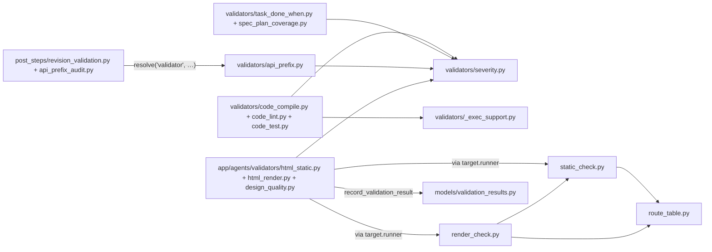
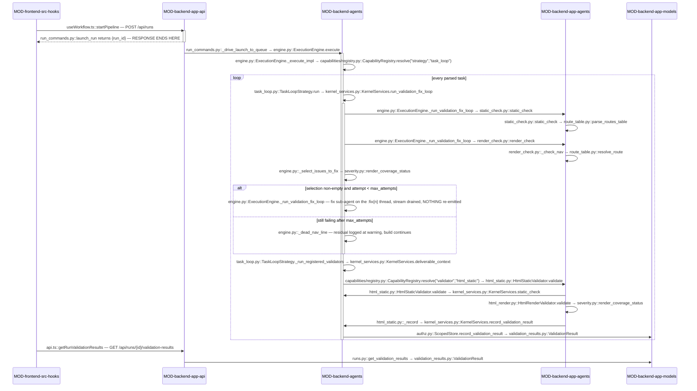

<!-- AUTO-GENERATED BELOW THIS LINE — regenerated by tools/knowledge/build_architecture.py -->

### Members (20 files across 3 modules)

**[MOD-backend-agents](MOD-backend-agents.md)**
- [backend/agents/capabilities/post_steps/__init__.py](../../backend/agents/capabilities/post_steps/__init__.py)
- [backend/agents/capabilities/post_steps/api_prefix_audit.py](../../backend/agents/capabilities/post_steps/api_prefix_audit.py)
- [backend/agents/capabilities/post_steps/revision_validation.py](../../backend/agents/capabilities/post_steps/revision_validation.py)
- [backend/agents/capabilities/validators/__init__.py](../../backend/agents/capabilities/validators/__init__.py)
- [backend/agents/capabilities/validators/_exec_support.py](../../backend/agents/capabilities/validators/_exec_support.py)
- [backend/agents/capabilities/validators/api_prefix.py](../../backend/agents/capabilities/validators/api_prefix.py)
- [backend/agents/capabilities/validators/code_compile.py](../../backend/agents/capabilities/validators/code_compile.py)
- [backend/agents/capabilities/validators/code_lint.py](../../backend/agents/capabilities/validators/code_lint.py)
- [backend/agents/capabilities/validators/code_test.py](../../backend/agents/capabilities/validators/code_test.py)
- [backend/agents/capabilities/validators/severity.py](../../backend/agents/capabilities/validators/severity.py)
- [backend/agents/capabilities/validators/spec_plan_coverage.py](../../backend/agents/capabilities/validators/spec_plan_coverage.py)
- [backend/agents/capabilities/validators/task_done_when.py](../../backend/agents/capabilities/validators/task_done_when.py)

**[MOD-backend-app-agents](MOD-backend-app-agents.md)**
- [backend/app/agents/render_check.py](../../backend/app/agents/render_check.py)
- [backend/app/agents/route_table.py](../../backend/app/agents/route_table.py)
- [backend/app/agents/static_check.py](../../backend/app/agents/static_check.py)
- [backend/app/agents/validators/__init__.py](../../backend/app/agents/validators/__init__.py)
- [backend/app/agents/validators/design_quality.py](../../backend/app/agents/validators/design_quality.py)
- [backend/app/agents/validators/html_render.py](../../backend/app/agents/validators/html_render.py)
- [backend/app/agents/validators/html_static.py](../../backend/app/agents/validators/html_static.py)

**[MOD-backend-app-models](MOD-backend-app-models.md)**
- [backend/app/models/validation_results.py](../../backend/app/models/validation_results.py)

### Imported by, from outside this domain (6)
- [backend/agents/authz.py](../../backend/agents/authz.py)
- [backend/agents/capabilities/gates/validation.py](../../backend/agents/capabilities/gates/validation.py)
- [backend/agents/execution_engine/engine.py](../../backend/agents/execution_engine/engine.py)
- [backend/agents/execution_engine/kernel_services.py](../../backend/agents/execution_engine/kernel_services.py)
- [backend/app/api/runs.py](../../backend/app/api/runs.py)
- [backend/app/models/__init__.py](../../backend/app/models/__init__.py)

### Imports, from outside this domain (10)
- [backend/agents/__init__.py](../../backend/agents/__init__.py)
- [backend/agents/capabilities/__init__.py](../../backend/agents/capabilities/__init__.py)
- [backend/agents/capabilities/base.py](../../backend/agents/capabilities/base.py)
- [backend/agents/capabilities/registry.py](../../backend/agents/capabilities/registry.py)
- [backend/app/__init__.py](../../backend/app/__init__.py)
- [backend/app/agents/__init__.py](../../backend/app/agents/__init__.py)
- [backend/app/core/__init__.py](../../backend/app/core/__init__.py)
- [backend/app/core/config.py](../../backend/app/core/config.py)
- [backend/app/models/__init__.py](../../backend/app/models/__init__.py)
- [backend/app/models/database.py](../../backend/app/models/database.py)

### External
(none)
<!-- /AUTO-GENERATED -->

## Purpose

This domain owns the question **"is what the agent just produced actually any
good?"** — and, crucially, it owns only the *judging*. A member here takes a
deliverable, decides what is wrong with it, and returns a list of `Issue`
records carrying an internal `P0`–`P3` severity. It does not decide whether the
run stops, it does not retry the agent, and it does not talk to the database
directly. [severity.py::map_severity](../../backend/agents/capabilities/validators/severity.py) is the single translation from that
internal ladder to the `CRITICAL`/`HIGH`/`MEDIUM`/`LOW` labels the API and the
Audit tab show; there is exactly one such mapping in the tree and every member
imports it. Without this domain the prototype pipeline degrades to "the model
said it was done": a build task that emits a blank page, a dead nav link, or an
undefined `onclick` handler would ship, because nothing else in the system reads
the artifact the agent wrote.

Where it ends is sharper than it looks. Acting on a verdict is not here:
[gates/validation.py](../../backend/agents/capabilities/gates/validation.py) — the thing that turns a `CRITICAL` into a `GATE_BLOCK` —
belongs to DOMAIN-hitl-gating, and the bounded N=2 fix-loop that re-invokes a
sub-agent with the issue list lives in [engine.py::_run_validation_fix_loop](../../backend/agents/execution_engine/engine.py)
under DOMAIN-execution-kernel. Naming and resolving a validator by `(kind, name)`
is DOMAIN-capability-registry; the `Validator` and `PostStep` Protocol ports are
declared there, not here. The `Workspace` handle the code validators reach exec
through, and the policy that grants `exec` at all, belong to
DOMAIN-workspace-isolation. Deciding *which* validators a step runs is a manifest
question, answered by DOMAIN-workflow-compilation. So: if your question is "what
counts as a defect, and how severe is it", it is here; if it is "what happens
next", it is next door.

## Shape

**Not one member imports the kernel or `app.*` outward.** Every validator
receives an object-typed `target` and reaches everything it needs — the heavy
checks, the sandbox, the audit writer — through `target.runner`. The single
exception is the one import that flows *inward*: [severity.py](../../backend/agents/capabilities/validators/severity.py), which is
deliberately kept free of any `@register`/`discover()` side effect so the gate,
the engine and the app-side validators can all import it without creating a
kernel→app edge.

- **The severity ladder** — [severity.py](../../backend/agents/capabilities/validators/severity.py) holds `map_severity` (`P0→CRITICAL` …
  `P3→LOW`, plus the `SKIPPED` audit-only sentinel) and `render_coverage_status`,
  the one function that answers "did the render actually run, and if not does it
  fail closed?" (`ok` / `skipped_blocked` / `skipped_allowed`). It is pure stdlib
  and imports nothing.
- **The pure-stdlib kernel validators** — [task_done_when.py](../../backend/agents/capabilities/validators/task_done_when.py) (a task's declared
  `done_when` criteria must have keyword evidence in the produced content),
  [spec_plan_coverage.py](../../backend/agents/capabilities/validators/spec_plan_coverage.py) (a spec heading with no matching plan task is a
  coverage gap), and [api_prefix.py](../../backend/agents/capabilities/validators/api_prefix.py) (infra files referencing an app endpoint
  outside `/api/v1`). All three emit only `P1`/`P2`.
- **The exec-backed code validators** — [code_compile.py](../../backend/agents/capabilities/validators/code_compile.py), [code_lint.py](../../backend/agents/capabilities/validators/code_lint.py),
  [code_test.py](../../backend/agents/capabilities/validators/code_test.py) each drive one argv (`python3 -c` compile driver, `ruff check`,
  `pytest -p no:cacheprovider`) and parse stdout, because the hardened
  `exec_command` returns stdout only. [_exec_support.py](../../backend/agents/capabilities/validators/_exec_support.py) factors the three
  helpers they share: `workspace_of`, `exec_granted`, `target_py_files`. None of
  them spawns a process itself; ungranted exec is an explicit `P1` refusal issue
  with zero spawns, never a silent pass.
- **The app-side heavy-dep validators** — [html_static.py](../../backend/app/agents/validators/html_static.py), [html_render.py](../../backend/app/agents/validators/html_render.py),
  [design_quality.py](../../backend/app/agents/validators/design_quality.py) are the only capability package living app-side. They wrap
  the two real checkers through the handle rather than importing them.
  [design_quality.py](../../backend/app/agents/validators/design_quality.py) filters its own output to `P2`/`P3` on the last line, so it
  is non-blocking by construction.
- **The checkers themselves** — [static_check.py](../../backend/app/agents/static_check.py) parses the SPA prototype with
  `html.parser` + `re` (routes↔sections, routes-map completeness, undefined
  inline handlers, one `is-active` section); [render_check.py](../../backend/app/agents/render_check.py) drives headless
  Chromium and reports console errors, uncaught page exceptions, dead nav links
  and nav coverage. [route_table.py](../../backend/app/agents/route_table.py) is the shared, pure route resolver both
  consult so a route is judged by the page it *resolves* to, not its first path
  segment; [render_check.py](../../backend/app/agents/render_check.py) also imports [static_check.py::_href_target_id](../../backend/app/agents/static_check.py) so
  the two agree on a target id.
- **The declared after-step behaviours** — [revision_validation.py](../../backend/agents/capabilities/post_steps/revision_validation.py) computes the
  pre-edit baseline on the seeded original and runs the fix-loop through the
  handle; [api_prefix_audit.py](../../backend/agents/capabilities/post_steps/api_prefix_audit.py) runs the `api_prefix` validator as a pure side
  effect with no events at all.
- **The audit row** — [validation_results.py](../../backend/app/models/validation_results.py) is one row per validator run:
  `run_id` + `owner_id` + `workspace_id` (both non-null) + step, validator,
  worst-severity label, attempt, and the issue payload as JSON.

**Module crossings.** Two matter. Outbound from
[MOD-backend-app-agents](MOD-backend-app-agents.md) *into*
[MOD-backend-agents](MOD-backend-agents.md): the app-side validators import the
kernel port and the `@register` decorator — the legal direction, which is exactly
why the heavy-dep validators sit app-side at all. There is deliberately no
crossing the other way: [html_static.py](../../backend/app/agents/validators/html_static.py) reaches [static_check.py](../../backend/app/agents/static_check.py) — a sibling in
its own module — through `target.runner.static_check`, not by import, so the
kernel handle stays the only conduit. Inbound from
[MOD-backend-app-models](MOD-backend-app-models.md): nothing in the domain
imports a model except [validation_results.py](../../backend/app/models/validation_results.py) itself; the row is written by
[authz.py::ScopedStore.record_validation_result](../../backend/agents/authz.py) on the far side of the handle.

## In practice

### The path, by call

### Step by step

**Launch — and the early return**

1. `useWorkflow.ts::startPipeline` sends the run payload as `POST /api/runs`.
2. `run_commands.py::launch_run` authenticates, validates the ingress, mints the
   `WorkflowRun`, spawns `run_commands.py::_drive_launch_to_queue` in the
   background and **returns `{run_id}` immediately**. Everything below happens
   after the HTTP response is already on the wire; the browser watches the event
   stream.
3. [engine.py::ExecutionEngine._execute_impl](../../backend/agents/execution_engine/engine.py) walks the compiled steps. On the
   `prototype-build` step it resolves `("strategy", "task_loop")` and hands over.

**Per build task — the fix-loop (this is what actually gates quality today)**

4. `task_loop.py::TaskLoopStrategy.run` runs one isolated sub-agent for the task,
   which writes `prototype.html` into the run sandbox.
5. It builds a `FixPolicy` from the declared deliverable name and calls
   [kernel_services.py::KernelServices.run_validation_fix_loop](../../backend/agents/execution_engine/kernel_services.py). The strategy
   holds no fix-loop code of its own; the loop has one home in the engine.
6. [engine.py::ExecutionEngine._run_validation_fix_loop](../../backend/agents/execution_engine/engine.py) reads the file, then runs
   [static_check.py::static_check](../../backend/app/agents/static_check.py) (sync) and [render_check.py::render_check](../../backend/app/agents/render_check.py)
   (async). A `render_check` that raises is caught and downgraded to
   `available=False` — the harness never crashes the build.
7. [static_check.py::static_check](../../backend/app/agents/static_check.py) parses the HTML once. If
   [route_table.py::parse_routes_table](../../backend/app/agents/route_table.py) returns a resolvable table it judges each
   nav route by [route_table.py::resolve_route](../../backend/app/agents/route_table.py); otherwise the legacy
   first-path-segment path plus the `_extract_routes_map` completeness checks run
   instead. The two branches emit different issue wording.
8. [render_check.py::_check_nav](../../backend/app/agents/render_check.py) discovers nav candidates (anchors plus `onclick`
   handlers that assign `location.hash` or call `navigateTo`), classifies each
   against the DOM's `data-page` id set, exercises one representative per real
   target and every distinct malformed route, and returns `NavResult`s plus the
   coverage denominator.
9. [severity.py::render_coverage_status](../../backend/agents/capabilities/validators/severity.py) decides whether the render counts at all.
   [engine.py::_select_issues_to_fix](../../backend/agents/execution_engine/engine.py) then assembles the ordered, de-duplicated
   fix list: static regressions against the baseline, then console errors, then
   uncaught exceptions, then dead nav links via [engine.py::_dead_nav_line](../../backend/agents/execution_engine/engine.py), then
   coverage findings.
10. Non-empty selection and attempts remaining → a fresh sub-agent on a distinct
    `:fix{n}` thread gets the issues injected. Its stream is drained internally
    and **nothing is re-emitted**, so the UI sees one build per task. After
    `max_attempts` the residuals are logged at `warning` and the build continues —
    this loop never blocks.

**Per build task — the audit pass**

11. `task_loop.py::TaskLoopStrategy._run_registered_validators` builds a
    `DeliverableContext` via [kernel_services.py::KernelServices.deliverable_context](../../backend/agents/execution_engine/kernel_services.py),
    threading the step's `require_render` onto it.
12. For each name in `step.validators` it resolves the capability and awaits
    `.validate(target)`. **The returned issues are discarded**; a validator that
    raises is logged and skipped. This pass exists to write audit rows, not to
    decide anything.
13. [html_static.py::HtmlStaticValidator.validate](../../backend/app/agents/validators/html_static.py) calls
    `target.runner.static_check(target.path)` and maps issues→`P0`, warnings→`P3`.
14. [html_render.py::HtmlRenderValidator.validate](../../backend/app/agents/validators/html_render.py) calls
    `target.runner.render_check(target.path)`, resolves `require_render` (falling
    back to `settings.PROTOTYPE_REQUIRE_RENDER`), and asks
    [severity.py::render_coverage_status](../../backend/agents/capabilities/validators/severity.py). A skip writes a distinct `SKIPPED` row
    through [html_render.py::HtmlRenderValidator._record_skip](../../backend/app/agents/validators/html_render.py); a skip under
    `require_render` returns one `P0` instead.
15. Each validator ends in [html_static.py::_record](../../backend/app/agents/validators/html_static.py), which picks the worst
    severity via `map_severity` and awaits
    [kernel_services.py::KernelServices.record_validation_result](../../backend/agents/execution_engine/kernel_services.py).
16. That delegates to [authz.py::ScopedStore.record_validation_result](../../backend/agents/authz.py), which
    stamps `owner_id`/`workspace_id` and inserts one
    [validation_results.py::ValidationResult](../../backend/app/models/validation_results.py). A persist failure degrades to
    `None` — the audit write may never break the live stream.

**Reading it back**

17. `api.ts::getRunValidationResults` calls
    `GET /api/runs/{id}/validation-results`; [runs.py::get_validation_results](../../backend/app/api/runs.py)
    applies the two-layer owner gate and returns the rows ascending.
18. [AuditTab.tsx](../../frontend/src/components/results/AuditTab.tsx) merges them with the gate and exec rows into one timeline,
    normalising each row's severity for display.

### What breaks if you get it wrong

**Silent — these are the ones worth documenting:**

- **You declare `validators: [...]` on a `task_loop` step and expect it to stop a
  bad build.** It will not.
  `task_loop.py::TaskLoopStrategy._run_registered_validators` awaits each
  validator and throws the result away. The only thing that ever blocks is a step
  declaring `gates: [validation]`, and today exactly one manifest step does —
  `prototype_revision`. The `prototype` build step's `require_render: true` is,
  by its own comment, deliberately behaviour-neutral for this reason: it records
  a `validator_skipped` row and declares intent, nothing more.
- **You emit a UI label (`"CRITICAL"`) from a validator instead of an internal
  `P0`.** At the gate, `map_severity` raises `ValueError`,
  `gates/validation.py::ValidationGate.evaluate` catches it, logs one warning and
  substitutes `"LOW"`. Your critical finding becomes a non-blocking residual and
  the run proceeds. The only trace is a log line.
- **You add a second severity mapping anywhere.** Nothing detects it. The gate
  compares against the literal `"CRITICAL"`, so a divergent ladder simply stops
  blocking, and the Audit tab starts showing labels the API never produced.
- **You add a `P0` finding to [design_quality.py](../../backend/app/agents/validators/design_quality.py).** The last line of `validate`
  filters the list to `P2`/`P3` and drops it without comment.
- **Exec is not granted and you assume "no issues" means "the code compiles".**
  [code_compile.py](../../backend/agents/capabilities/validators/code_compile.py) / [code_lint.py](../../backend/agents/capabilities/validators/code_lint.py) / [code_test.py](../../backend/agents/capabilities/validators/code_test.py) return a `P1` refusal issue.
  `P1` maps to `HIGH`, which the gate treats as a residual warning, not a block —
  so a run where nothing was ever compiled passes the gate with a warning that
  reads much like a lint nit.
- **You give a prototype template a resolvable `routes` table.** The `table is
  not None` branch in `[static_check.py](../../backend/app/agents/static_check.py)::static_check` supersedes the entire legacy
  block, including the routes-map completeness and extra-key checks. Those checks
  stop running; no error, different issue wording, fewer findings.
- **You wire a new audit validator as a `gate` rather than a `post_step`.** The
  gate emits a `validation_warning` event whenever residuals exist, which changes
  the run's event stream. This one is caught by the characterization goldens — but
  only if the affected workflow has a golden.
- **Your validator's `target.runner` is a fake without
  `record_validation_result`.** `_record` returns early. No row, no error, and the
  Audit tab shows nothing for a validator that ran.

**Loud, so stop worrying:**

- An unknown internal severity reaching `map_severity` outside the gate is a
  `ValueError` naming the bad value.
- Importing `app.*` or `agents.execution_engine` from anything under
  `agents/capabilities/` fails the import-linter contract in CI.
- A manifest naming a validator that is not registered fails at run entry with a
  `CompilerError` naming the reference and the step.
- [render_check.py](../../backend/app/agents/render_check.py) raising inside the fix-loop is caught explicitly and logged;
  it degrades to a skip rather than failing the build.

### The other paths

**The revision path — the one place validation actually fails closed.** The
`prototype_revision` step declares `gates: [validation]`, `validators:
[html_static, html_render]`, `require_render: true` and `post_step:
revision_validation`. After the visible agent edits `prototype.html` in place,
[revision_validation.py::RevisionValidationPostStep.run](../../backend/agents/capabilities/post_steps/revision_validation.py) computes the pre-edit
baseline on `ctx.revision_original_html` through
[kernel_services.py::KernelServices.compute_revision_baseline](../../backend/agents/execution_engine/kernel_services.py), then re-enters the
same fix-loop with those baselines and the user's instruction — so only *new*
static/console issues count as regressions while hard render breakage always
does. Separately, the post-step gate runs the declared validators against a real
`DeliverableContext`; with the browser absent, [html_render.py](../../backend/app/agents/validators/html_render.py) emits a `P0` and
the gate returns `GATE_BLOCK`. That is the genuine fail-closed in the system.

**The infra-audit path.** `app_builder`'s infra-generator step declares
`post_step: api_prefix_audit`. [api_prefix_audit.py::ApiPrefixAuditPostStep.run](../../backend/agents/capabilities/post_steps/api_prefix_audit.py)
resolves the `api_prefix` validator, hands it a small local `_AuditTarget` stub
(so it need not import the kernel's `DeliverableContext`), logs a count and
swallows every exception. It is event-free on purpose — see below.

**The registered-but-unused path.** Six of the nine registered validators —
`task_done_when`, `spec_plan_coverage`, `code_compile`, `code_lint`, `code_test`,
`design_quality` — are referenced by no file-backed manifest at all. They are all
`user_allowed=True`, so they exist for user-authored workflows to declare, and
they are exercised only by tests/agents/test_validators.py and
tests/agents/test_code_validators.py. Reading the manifests alone would not
tell you they exist.

## Why this shape

**The kernel/app split is dictated by an import-linter contract, not by taste.**
`pyproject.toml` declares `agents.capabilities must not import the execution
kernel or the web layer`. So D-04 places a validator by its dependency weight:
anything needing only stdlib stays kernel-side under
`agents/capabilities/validators/`, and anything needing a heavy `app.*`
dependency — `static_check`, Playwright, the design heuristics — goes app-side
under `app/agents/validators/`, importing the port back in the legal direction.
That is why [html_static.py](../../backend/app/agents/validators/html_static.py) reaches its own module-sibling [static_check.py](../../backend/app/agents/static_check.py)
through `target.runner` instead of importing it: an import there would be legal,
but it would establish the habit the contract exists to prevent. [severity.py](../../backend/agents/capabilities/validators/severity.py) is
kept import-clean of any `@register`/`discover()` side effect for the same
reason — its docstring says so explicitly — so the gate could consume
`map_severity` before any validator implementation existed.

**One severity mapping, because two would drift silently.** [severity.py](../../backend/agents/capabilities/validators/severity.py) states
the VALID-03 single-source rule outright and raises rather than defaulting on an
unknown value. The `SKIPPED` sentinel was added later and deliberately kept
*outside* the `P0`–`P3` blocking ladder: it lands on the audit row only, so a
render skip is recorded rather than swallowed into "no issues", without
perturbing the block-critical ordering.

**The fix-loop has one home and the strategy delegates to it.** [task_loop.py](../../backend/agents/capabilities/strategies/task_loop.py)'s
docstring names this as INV-3/INV-12 "no dual implementations": the fix wording,
the `:fix{n}` thread shape, the N=2 bound and the consume-internally-emit-nothing
contract all live in [engine.py::_run_validation_fix_loop](../../backend/agents/execution_engine/engine.py), reached only through
[kernel_services.py::KernelServices.run_validation_fix_loop](../../backend/agents/execution_engine/kernel_services.py). A copy in the
strategy would have been easier and would have diverged the moment either side
changed.

**The revision validation is a capability because it used to be an exception.**
[revision_validation.py](../../backend/agents/capabilities/post_steps/revision_validation.py) describes what it replaced: a kernel-resident,
self-described "DELIBERATE EXCEPTION" block inside `execute()` that special-cased
in-place revision. Under SC-001 the kernel may not know a workflow by name, so
the behaviour was relocated behind a declared `post_step` resolved from
`step.post_step`, with the agent id read off the compiled step rather than
hardcoded. The kernel now invokes it without knowing what it does.

**`api_prefix` is a validator because a prompt was not enough, and a `post_step`
because a gate would have been visible.** `ISS-005` records the evidence: the
`/api/v1` rule lived only as prose in three `AGENT.md` bodies and a live run
emitted it zero times in 3,083 lines. [api_prefix_audit.py](../../backend/agents/capabilities/post_steps/api_prefix_audit.py)'s docstring records
the second half — a `gates: [validation]` wiring emits a `validation_warning`
event when residuals exist, and the `app_builder` characterization golden
contains no such event, so a gate would have broken byte/event identity. A
`post_step` yields nothing, and the `validation_results` row it writes is not
golden-tracked.

**Detection is tuned to prefer a missed finding over a false one.** This is
consistent across the domain and stated in each module: [api_prefix.py](../../backend/agents/capabilities/validators/api_prefix.py) excludes
nginx `proxy_pass` targets and external FQDNs and scopes YAML `path:` keys to
`httpGet`/Ingress blocks; [static_check.py](../../backend/app/agents/static_check.py) skips method calls, JS builtins and
non-route fragments; [route_table.py](../../backend/app/agents/route_table.py) returns `None` for an href-valued object map
so the caller keeps its legacy path. The stated reason is INV-3 byte-identity
against the recorded goldens — a new false positive would change a golden run's
issue list, which is treated as a regression regardless of whether the finding is
correct.

**One thing is not recorded.** `_record`, `_worst_label` and `_SEVERITY_ORDER`
are duplicated verbatim in six kernel-side validator modules, while the same
authors factored the three exec helpers into [_exec_support.py](../../backend/agents/capabilities/validators/_exec_support.py) for exactly the
stated reason ("copies the reach by import, not by re-typing it"), and the
app-side trio shares one `_record` imported from [html_static.py](../../backend/app/agents/validators/html_static.py). No docstring,
card or comment explains why the kernel-side copies were left duplicated.
