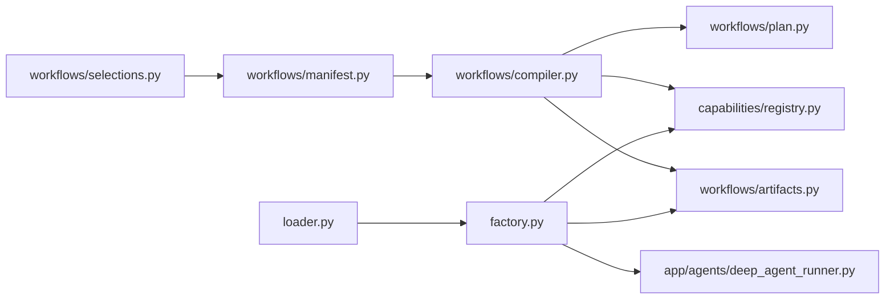
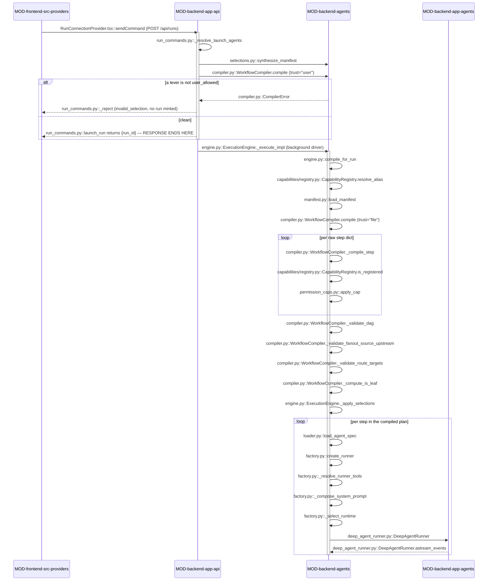

<!-- AUTO-GENERATED BELOW THIS LINE — regenerated by tools/knowledge/build_architecture.py -->

### Members (9 files across 1 modules)

**[MOD-backend-agents](MOD-backend-agents.md)**
- [backend/agents/factory.py](../../backend/agents/factory.py)
- [backend/agents/loader.py](../../backend/agents/loader.py)
- [backend/agents/workflows/__init__.py](../../backend/agents/workflows/__init__.py)
- [backend/agents/workflows/artifacts.py](../../backend/agents/workflows/artifacts.py)
- [backend/agents/workflows/compiler.py](../../backend/agents/workflows/compiler.py)
- [backend/agents/workflows/manifest.py](../../backend/agents/workflows/manifest.py)
- [backend/agents/workflows/permission_caps.py](../../backend/agents/workflows/permission_caps.py)
- [backend/agents/workflows/plan.py](../../backend/agents/workflows/plan.py)
- [backend/agents/workflows/selections.py](../../backend/agents/workflows/selections.py)

### Imported by, from outside this domain (16)
- [backend/agents/capabilities/strategies/wave_scheduler.py](../../backend/agents/capabilities/strategies/wave_scheduler.py)
- [backend/agents/capabilities/task_identity.py](../../backend/agents/capabilities/task_identity.py)
- [backend/agents/capabilities/task_parsers/heading_tasks.py](../../backend/agents/capabilities/task_parsers/heading_tasks.py)
- [backend/agents/capabilities/task_parsers/json_tasks.py](../../backend/agents/capabilities/task_parsers/json_tasks.py)
- [backend/agents/execution_engine/budget.py](../../backend/agents/execution_engine/budget.py)
- [backend/agents/execution_engine/engine.py](../../backend/agents/execution_engine/engine.py)
- [backend/agents/execution_engine/kernel_services.py](../../backend/agents/execution_engine/kernel_services.py)
- [backend/agents/model_policy.py](../../backend/agents/model_policy.py)
- [backend/agents/registry.py](../../backend/agents/registry.py)
- [backend/app/agents/chat_runner.py](../../backend/app/agents/chat_runner.py)
- [backend/app/agents/revision_analyzer.py](../../backend/app/agents/revision_analyzer.py)
- [backend/app/api/composition_order.py](../../backend/app/api/composition_order.py)
- [backend/app/api/run_commands.py](../../backend/app/api/run_commands.py)
- [backend/app/api/run_engine.py](../../backend/app/api/run_engine.py)
- [backend/app/api/user_workflows.py](../../backend/app/api/user_workflows.py)
- [backend/app/api/workflows.py](../../backend/app/api/workflows.py)

### Imports, from outside this domain (23)
- [backend/agents/__init__.py](../../backend/agents/__init__.py)
- [backend/agents/capabilities/__init__.py](../../backend/agents/capabilities/__init__.py)
- [backend/agents/capabilities/hooks/__init__.py](../../backend/agents/capabilities/hooks/__init__.py)
- [backend/agents/capabilities/hooks/behavioral.py](../../backend/agents/capabilities/hooks/behavioral.py)
- [backend/agents/capabilities/mcp_servers/__init__.py](../../backend/agents/capabilities/mcp_servers/__init__.py)
- [backend/agents/capabilities/mcp_servers/catalog.py](../../backend/agents/capabilities/mcp_servers/catalog.py)
- [backend/agents/capabilities/model_catalog.py](../../backend/agents/capabilities/model_catalog.py)
- [backend/agents/capabilities/registry.py](../../backend/agents/capabilities/registry.py)
- [backend/agents/capabilities/skills/__init__.py](../../backend/agents/capabilities/skills/__init__.py)
- [backend/agents/capabilities/skills/providers.py](../../backend/agents/capabilities/skills/providers.py)
- [backend/agents/capabilities/tools/__init__.py](../../backend/agents/capabilities/tools/__init__.py)
- [backend/agents/capabilities/tools/internet.py](../../backend/agents/capabilities/tools/internet.py)
- [backend/agents/planner/__init__.py](../../backend/agents/planner/__init__.py)
- [backend/agents/planner/tools.py](../../backend/agents/planner/tools.py)
- [backend/app/__init__.py](../../backend/app/__init__.py)
- [backend/app/agents/__init__.py](../../backend/app/agents/__init__.py)
- [backend/app/agents/deep_agent_runner.py](../../backend/app/agents/deep_agent_runner.py)
- [backend/app/agents/prompt_overrides.py](../../backend/app/agents/prompt_overrides.py)
- [backend/app/agents/sandbox.py](../../backend/app/agents/sandbox.py)
- [backend/app/agents/skill_staging.py](../../backend/app/agents/skill_staging.py)
- [backend/app/agents/skills_catalog.py](../../backend/app/agents/skills_catalog.py)
- [backend/app/agents/tools/__init__.py](../../backend/app/agents/tools/__init__.py)
- [backend/app/agents/tools/runner_tools.py](../../backend/app/agents/tools/runner_tools.py)

### External
yaml
<!-- /AUTO-GENERATED -->

## Purpose

This domain owns the transform from **authored declaration to typed executable
object**, and it owns the moment every declared name is checked. Two files are
authored by hand — a workflow's `workflow.yaml` and an agent's `AGENT.md` — and
neither is ever read by the kernel directly. [manifest.py](../../backend/agents/workflows/manifest.py) parses the first into
a `WorkflowManifest`, [compiler.py](../../backend/agents/workflows/compiler.py) turns that into the `CompiledWorkflow` the
kernel executes, and [plan.py](../../backend/agents/workflows/plan.py) defines the typed contract both sides agree on.
Along the second axis, [loader.py](../../backend/agents/loader.py) parses `AGENT.md` into an `AgentSpec` and
[factory.py](../../backend/agents/factory.py) composes that spec plus runtime context into a live runner.
[selections.py](../../backend/agents/workflows/selections.py) is the third entrance: it synthesizes a manifest out of a saved
user composition so user-authored levers go through the *same* compiler under a
different trust level. Without this domain the kernel has nothing to execute —
and, more sharply, an unknown or privileged capability name would reach run time
instead of failing at compile time, which is where `CompilerError` naming the
bad reference is cheap and a half-executed run is not.

The boundary is: **this domain validates and materializes, it never decides and
never runs.** A `fanout:` block is recorded as a `FanoutSpec`; which worker
actually spawns is `run_fanout`'s decision, in DOMAIN-execution-strategies. A
`limits:` block becomes a typed `Limits`; enforcing it at run time is
`BudgetManager` in DOMAIN-execution-kernel. [permission_caps.apply_cap](../../backend/agents/workflows/permission_caps.py) resolves
every permission decision here (cap, intersection, trace); the runtime allow/deny
is DOMAIN-workspace-isolation. What `(kind, name)` even resolves to — the
registration, the ports, `user_allowed` — is DOMAIN-capability-registry; this
domain is only its most demanding caller. Sequencing, gates, resume and event
emission are all downstream. If your question is "why did this reference get
rejected / why is my declared key being ignored", it is here. If it is "why did
this step behave that way once it ran", it is next door.

## Shape

**Everything here is a pure declaration→typed-object transform validated by
`(kind, name)` against `CapabilityRegistry` — no member branches on a workflow
id (INV-1 / SC-001), and [factory.py](../../backend/agents/factory.py) is the only member permitted to import
`app.*`.**

- **Parse + shape-validate the authored file.** [manifest.py::load_manifest](../../backend/agents/workflows/manifest.py)
  (`yaml.safe_load` only, strict `_ALLOWED_TOP_KEYS`, `ManifestValidationError`
  naming the field) and [loader.py::load_agent_spec](../../backend/agents/loader.py) (frontmatter →
  `AgentSpec`, cached in `_SPEC_CACHE`, `AgentSpecError` naming the field).
  Neither knows what a capability is.
- **Resolve every declared name.** [compiler.py::WorkflowCompiler.compile](../../backend/agents/workflows/compiler.py) is
  the chokepoint: `_compile_step` checks strategy, gates, hooks, validators,
  compaction, post_step and `task_source.parser`; the workflow level checks
  `context_providers`, `input_providers` and the deliverable resolver. Each
  check is `CapabilityRegistry.is_registered` immediately followed by
  `_check_trust`, at the same call site. For a custom-agent step with an
  `instance_id`, `_compile_step` uses [artifacts.py::CUSTOM_AGENT_PREFIX](../../backend/agents/workflows/artifacts.py)
  to build the synthetic agent id. Route targets (spec 014 / R-10) are validated
  after compilation: `_validate_route_targets` ensures every `route.outcomes[].target`
  and `route.default_next` resolves to a step id in the compiled workflow (dual
  lookup by `agent_id` or `instance_id`), and validates that the route's decision
  source (the step itself or `route.condition_agent`) declares
  `produces: ["route_decision"]` (R-27).
- **Artifact naming.** [artifacts.py](../../backend/agents/workflows/artifacts.py) holds helpers for custom-agent
  artifact handling: `CUSTOM_AGENT_PREFIX` (the synthetic id prefix `"custom-agent:"`), `topic_slug()`,
  and `artifact_name()` (the single source of truth for output filenames). The compiler imports
  `CUSTOM_AGENT_PREFIX` to build synthetic agent ids from `instance_id`; the factory imports both
  the prefix and `artifact_name()` to format filenames for the composed prompt (preamble + roster block).
  Both modules validate `instance_id` shape independently (spec 012 R-03).
- **Leaf computation.** `_compute_is_leaf` sets each `Step.is_leaf` flag (R-26)
  after route/depends_on validation so the engine knows which steps have no
  continuation (used by the `single_file` deliverable readback). A step is a
  leaf if it has no `depends_on` downstream edges, no `route` with `trigger="step"`
  outcomes or `default_next`, and the next step in manifest order is not
  reachable via any route jump.
- **The typed contract.** [plan.py](../../backend/agents/workflows/plan.py) holds `CompiledWorkflow`, `Step`, `Task`
  and the nested policy types; permission resolution is delegated to
  [permission_caps.py](../../backend/agents/workflows/permission_caps.py) (`apply_cap`), the single place every permission is decided.
- **The user-authored entrance.** [selections.py::synthesize_manifest](../../backend/agents/workflows/selections.py) turns a
  saved `{agent_id: {levers}}` map into a `WorkflowManifest` so it re-enters
  `compile(trust="user")`. Deliberately the single synthesis seam: save,
  launch and the engine's run-entry overlay all call it, so none of them can
  drift.
- **Composition root.** [factory.py::create_runner](../../backend/agents/factory.py) crosses the module
  boundary the rest of the domain must not: it reaches out to
  `MOD-backend-app-agents` ([deep_agent_runner.py](../../backend/app/agents/deep_agent_runner.py), [sandbox.py](../../backend/app/agents/sandbox.py),
  [prompt_overrides.py](../../backend/app/agents/prompt_overrides.py), [tools/runner_tools.py](../../backend/app/agents/tools/runner_tools.py)) and binds the app-side
  construction into a zero-arg closure, then hands it to the
  registry-resolved runtime adapter. Direction is one-way — nothing in
  `MOD-backend-app-agents` calls back in.
- **Kernel boundary.** Control enters this domain from
  `MOD-backend-app-api` (launch, save, catalog) and from
  `execution_engine/engine.py::compile_for_run`; it never leaves toward them.
  `agents/workflows/*` imports neither `agents.execution_engine` nor `app`.

## In practice

### The path, by call

### The three launch shapes

Before step 1 below runs, `launch_run` has already decided **which of three
`LaunchSource` shapes** ([run_commands.py:2152-2179](../../backend/app/api/run_commands.py)) this request is — detected once,
inline, from `body.user_workflow_id` plus the referenced row's `manifest_json` shape
([run_commands.py:2561-2595](../../backend/app/api/run_commands.py)). The numbered walkthrough below was written against the
first of the three; the other two either share most of it or skip it entirely:

- **`FILE_PIPELINE`** ("File Based") — no `user_workflow_id`. A built-in pipeline, or an
  ad-hoc `pipeline_type="custom"` + `agent_ids` with no saved row. Steps 1-18 below
  describe this shape start to finish.
- **`USER_WORKFLOW_FLAT`** ("File Based, overridden in DB") — `user_workflow_id`
  present, row's `manifest_json` is null. Still an `agent_ids`-shaped composition; only
  the *source* of `pipeline_type` / `agent_ids` / hooks / skills / model_overrides moves
  from the request body to the row, then falls through into the SAME `agent_ids`
  allow-list (step 3) and the rest of the walkthrough unchanged.
- **`USER_WORKFLOW_MANIFEST`** ("DB Based") — the row's `manifest_json` has a `"steps"`
  key (or an unsaved composition sends the equivalent inline as `body.manifest.steps`).
  The manifest tree **is** the composition — no file behind `base_pipeline_type`, no
  `agent_ids` allow-list (nothing to check it against). This is the only shape that
  arrives at `_launch_run_core` carrying a full `CompiledWorkflow` (`compiled`, built via
  `trust="db"`) rather than a flat `agents: list[AgentSpec]` — and it is **not** covered
  by steps 6-14 below, which describe the file-manifest compile path. Its own ingress is
  [run_commands.py](../../backend/app/api/run_commands.py)'s `USER_WORKFLOW_MANIFEST` branch (~line 2616+) and, at save time,
  [user_workflows.py::_compile_selections_trust_user](../../backend/app/api/user_workflows.py) —
  see "Saving a composed workflow" below.

All three reconverge at exactly one call, `_launch_run_core` — the `# ═══ JOIN POINT
═══` `[run_commands.py](../../backend/app/api/run_commands.py):2451` names itself, called from `launch_run` at line 2883. Full
taxonomy, detection mechanics and the reconvergence invariant:
[ADR-0020](../cards/20260824-1831-ADR-0020.md).

### Step by step

**Ingress — before anything is minted**

1. The browser calls `RunConnectionProvider.tsx::sendCommand` with a null
   `runId`, which POSTs the launch payload to `/api/runs`.
2. [run_commands.py::launch_run](../../backend/app/api/run_commands.py) rejects an empty brief, detects
   which of the three launch shapes above this request is, then
   [run_commands.py::_resolve_launch_agents](../../backend/app/api/run_commands.py) resolves the pipeline type and any
   `od_context`.
3. Agent ids are allow-listed via `registry.py::allowed_custom_agent_ids`, each
   is loaded with [loader.py::load_agent_spec](../../backend/agents/loader.py), and a custom composition is
   reordered producer-first by [composition_order.py::presort_specs](../../backend/app/api/composition_order.py).
4. [run_commands.py::_validate_model_overrides](../../backend/app/api/run_commands.py) and then
   [run_engine.py::_revalidate_selections_trust_user](../../backend/app/api/run_engine.py) run. The latter is the
   authoritative trust check: [selections.py::has_selections](../../backend/agents/workflows/selections.py) →
   [selections.py::validate_selection_model_ids](../../backend/agents/workflows/selections.py) →
   [selections.py::synthesize_manifest](../../backend/agents/workflows/selections.py) →
   `compiler.py::WorkflowCompiler.compile(..., trust="user")`.
5. Any rejection here is [run_commands.py::_reject](../../backend/app/api/run_commands.py) — a 4xx with **no
   `WorkflowRun` row and no spend**. Otherwise the run is minted, a background
   driver is spawned, and the HTTP response returns `{run_id}` immediately.
   Everything below happens after the caller has already been answered.

**Compile — at run entry**

6. [engine.py::ExecutionEngine._execute_impl](../../backend/agents/execution_engine/engine.py) calls
   [engine.py::compile_for_run](../../backend/agents/execution_engine/engine.py), which is `lru_cache`d per pipeline type.
7. `capabilities/registry.py::CapabilityRegistry.resolve_alias` maps the legacy
   run label to a manifest id (this is also what keeps an arbitrary label from
   becoming a filesystem path).
8. [manifest.py::load_manifest](../../backend/agents/workflows/manifest.py) reads `workflows/<id>/workflow.yaml` with
   `yaml.safe_load`, and [manifest.py::_build_manifest](../../backend/agents/workflows/manifest.py) strict-key rejects any
   unknown top-level key and type-checks each field.
9. [compiler.py::WorkflowCompiler.compile](../../backend/agents/workflows/compiler.py) runs with `trust="file"`. Per raw
   step, `_compile_step` strict-key rejects unknown step keys, then
   name-resolves every capability reference through
   `CapabilityRegistry.is_registered` + `WorkflowCompiler._check_trust`. A step
   that declares no `hooks:` key gets `audit_logger` and `secret_scan` injected
   — but only if they are registered.
10. Still per step: `_compile_tool_grant` parses the `tools:` block,
    `_validate_mcp_grant` splits and gates each `server.tool` reference, the
    engineer-only privileged-grant rules fire, and
    [permission_caps.py::apply_cap](../../backend/agents/workflows/permission_caps.py) resolves the effective `ToolPermissions`
    by intersecting the step's request with the trust-conditional permission cap.
11. Workflow level: `context_providers` / `input_providers` are validated,
    `_compile_deliverable` builds the `DeliverableSpec`, and `_compile_limits`
    materializes `Limits` — rejecting any ceiling-raising cap under an
    untrusted manifest.
12. `_validate_dag` (Kahn's algorithm over `depends_on`) validates the Step DAG
    is cycle-free. `_validate_fanout_source_upstream` ensures fan-out task sources
    reference earlier steps only. `_validate_route_targets` (spec 014 / R-10)
    ensures route outcomes and `default_next` target resolvable step ids (or literal
    `"self"` for `trigger="workflow"` outcomes), and validates that a route's
    decision source declares `produces: ["route_decision"]` (R-27). `_compute_is_leaf`
    computes each step's `is_leaf` flag (R-26) based on route/depends_on edges. A
    `CompiledWorkflow` is returned.
13. [engine.py::ExecutionEngine._apply_selections](../../backend/agents/execution_engine/engine.py) overlays user levers onto
    the file-compiled steps, re-compiling them through the same
    `synthesize_manifest` → `compile(trust="user")` path and merging by
    `agent_id` only.
14. The engine binds `compiled.deliverable` and `compiled.seed_files` onto the
    run context, builds the per-run budget with
    [budget.py::BudgetManager.from_limits](../../backend/agents/execution_engine/budget.py), then asserts the compiled step ids
    equal `registry.py::get_pipeline_agents` membership — `RuntimeError` on
    drift.

**Build a runner — once per step**

15. [loader.py::load_agent_spec](../../backend/agents/loader.py) returns the `AgentSpec` (cache hit after the
    ingress load), and the engine calls [factory.py::create_runner](../../backend/agents/factory.py).
16. [factory.py::_resolve_runner_tools](../../backend/agents/factory.py) resolves each declared tool-set name to
    a registered `tool` provider, maps the emitted keys to concrete tools via
    [factory.py::_resolve_custom_tool_keys](../../backend/agents/factory.py), and unions any pre-warmed MCP
    tools.
17. [factory.py::_compose_system_prompt](../../backend/agents/factory.py) assembles the named blocks — injects,
    guardrails, skills, hooks, constitution, prompt body — and delegates order
    and join to the registry-resolved `prompt` policy.
18. [factory.py::_select_runtime](../../backend/agents/factory.py) resolves the `runtime` adapter and hands it
    the bound closure; the adapter constructs
    [deep_agent_runner.py::DeepAgentRunner](../../backend/app/agents/deep_agent_runner.py), which the engine then streams. The
    caller learned none of this — it has had its `run_id` since step 5.

### What breaks if you get it wrong

The silent ones, in order of how often they bite:

- **Adding a key to `_ALLOWED_STEP_KEYS` without constructing it in
  `_compile_step`.** The manifest validates, the run starts, the declared
  behaviour never happens. This is the accepted-but-dropped failure the D-17
  batch of `_compile_fix_policy` / `_compile_retry_policy` /
  `_compile_model_policy` was written to close, and the shape recurs every time
  a forward-surface key is made live.
- **Adding a `Step` field without adding it to [selections.py::_LEVER_KEYS](../../backend/agents/workflows/selections.py) and
  the projection loop in `_synthesize_step`.** Saved-workflow users can select
  the lever, save returns 200, and launch quietly ignores it.
- **Relying on `_apply_selections` to reject a bad lever.** It catches
  `CompilerError` and proceeds with the *unmodified* plan by design — the
  ingress `_revalidate_selections_trust_user` is the authoritative rejection
  site. Move a check into the engine overlay and it stops rejecting anything.
- **Editing a `workflow.yaml` against a running process.** `compile_for_run` is
  `lru_cache`d for the process lifetime; the old plan keeps executing with no
  warning. (Exceptions are not cached, so a broken manifest re-raises every
  launch.)
- **Marking a privileged capability `user_allowed=True`.** Nothing in this
  domain will complain — `_check_trust` will simply start permitting it in
  user/db manifests, and the exec/network/secrets guard in `_compile_step` only
  covers those four named grants.
- **Assuming the default hooks always attach.** `audit_logger` and
  `secret_scan` are injected only when `is_registered` says so; if the
  capability package has not been discovered, a step silently runs with no
  audit record and no secret scan.
- **Citing `_resolve_runner_tools` as a permission enforcement point.** Its
  docstring says outright that it does not read `step.tools` and resolves every
  named provider unconditionally. Same for `ToolPermissions.lowered_by`, which
  has no production caller.

The loud ones you do not have to worry about: an unknown capability name is a
`CompilerError` that names the reference and the step; an unknown manifest key
is a `ManifestValidationError` that names the key; a missing `workflow.yaml` is
a `FileNotFoundError` at run entry; manifest/registry membership drift is a
`RuntimeError` before the first agent runs; a route target that does not resolve
to a step id in the compiled workflow is a `CompilerError` naming the step and
the bad target (spec 014 / R-10); a route's decision source missing the
`produces: ["route_decision"]` declaration is a `CompilerError` naming the step
(R-27); and an import from `agents/workflows/*` into `agents.execution_engine`
or `app` fails the import-linter contract in `backend/pyproject.toml` in CI.

### The other paths

**Saving a composed workflow.** [user_workflows.py::_compile_selections_trust_user](../../backend/app/api/user_workflows.py)
runs the same synth-and-compile at save time, first stripping the `_wizard` key
(pure FE metadata — the compiler must never see it, or its strict-key rejection
would fire on a non-capability field). A rejection is a 422 naming the offending
`(kind, name)`, so a bad lever never persists. The launch-side check exists
anyway, because a persisted row can be tampered with after it was saved. This is the
save-time counterpart of the `USER_WORKFLOW_MANIFEST` launch shape (see "The three
launch shapes" above) when the saved composition is a manifest tree; saving a plain
`agent_ids` list instead persists as `USER_WORKFLOW_FLAT`'s counterpart — same endpoint,
the row's `manifest_json` shape is what later tells `launch_run` which of the two it is.

**Serving the catalog.** `app/api/workflows.py::list_workflows` compiles *every*
manifest just to render the workflow list, and `get_workflow` compiles one after
checking the id against a known-id set rather than touching the filesystem with
it. Catalog metadata (`display_name`, `icon`, `user_launchable`) is read from
the raw `WorkflowManifest`, not the compiled plan, and a manifest that fails to
load degrades to defaults rather than breaking the listing — the compiled part
does not, so a genuinely broken manifest takes the whole catalog down.

**The empty plan.** `reverse_engineer` declares `steps: []`, which is valid all
the way through: `_validate_dag` returns early and the membership assertion is
skipped because `_compiled_agent_ids` is falsy. A workflow that compiles to
nothing is a supported outcome, not a bug to guard against.

## Why this shape

**No DSL, enforced structurally rather than by review.** The manifest format has
no expression syntax, and the reason it has none is that there is nowhere for
one to live: `_ALLOWED_TOP_KEYS`, `_ALLOWED_STEP_KEYS`,
`_ALLOWED_TASK_SOURCE_KEYS`, `_ALLOWED_FANOUT_KEYS` and `_ALLOWED_TOOLS_KEYS`
reject unknown keys by name at every nesting level (D-08 / INV-5). A `when:` or
`${...}` is not "unsupported", it is a validation error that names itself. This
is what makes the T-04-06 no-`eval`/`exec` rule hold without a scanner — an
expression smuggled into a capability *name* simply fails the registry lookup,
because it is not a registered name.

**Resolution is by name, never by identity.** SC-001 in `.knowledge/ARCHITECTURE.md`
says a new custom workflow must replicate the built-in `prototype` workflow with
a manifest and an `AGENT.md` alone. That only holds if nothing in the compile
path can ask *which* workflow it is compiling — hence INV-1, and hence the
positional (not name-based) upstream check in
`_validate_fanout_source_upstream` and the generic `agent_id` keying in the
selections overlay.

**Trust is a parameter, not a second compiler.** The obvious alternative — a
separate restricted path for user-authored workflows — was not taken.
`_check_trust` fires at the same per-reference call site as `is_registered`, so
there is no forked validation path that can drift. The same reasoning drives
[selections.py](../../backend/agents/workflows/selections.py) being the single synthesis seam shared by save, launch and the
engine overlay.

**The compiler records; it never decides.** Worker selection lives in
`run_fanout`, the `mimetype` default is computed at emission time, the
`task_source` legacy-id fallback lives in the strategy. Each of those is
commented as a deliberate refusal to put defaulting logic in the compiler
(INV-5). The cost is visible and accepted: `_LIMITS_DEFAULT_CEILING` duplicates
the module constants in [execution_engine/budget.py](../../backend/agents/execution_engine/budget.py) by hand, because the
`agents.workflows must not import the execution kernel or the web layer`
contract in `backend/pyproject.toml` forbids importing them.

**Plain dataclasses, not Pydantic.** D-10 / §6 / §32. [manifest.py](../../backend/agents/workflows/manifest.py) and
[plan.py](../../backend/agents/workflows/plan.py) mirror the [loader.py::AgentSpec](../../backend/agents/loader.py) idiom — required fields first,
`field(default_factory=...)` for mutables, hand-written `_require_*` /
`_optional_*` helpers that name the offending field. The recorded reason is
consistency with the existing loader, not a performance or dependency argument.

**A removed design, kept as evidence.** [plan.py](../../backend/agents/workflows/plan.py) carries an explicit note that
the `ExecutionPolicy` forward-surface helper and `_PRIVILEGED_RUNTIME_ACTIONS`
were deleted rather than left dormant, because Phase 10 made the runtime exec
decision live elsewhere and two places deciding "is exec allowed" violates
INV-12. The deletion is ratcheted in
`specs/003-workflow-engine-decoupling/migration-ledger.md` (row D11).

**Not recorded:** why [loader.py](../../backend/agents/loader.py) and [factory.py](../../backend/agents/factory.py) are members of this domain
rather than of DOMAIN-agent-runtime. They compile the *other* authored file
(`AGENT.md`) into its typed form, which is a coherent reading of the boundary,
but no design note states the choice.
