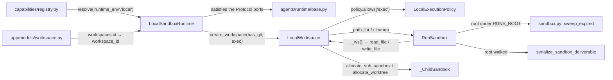
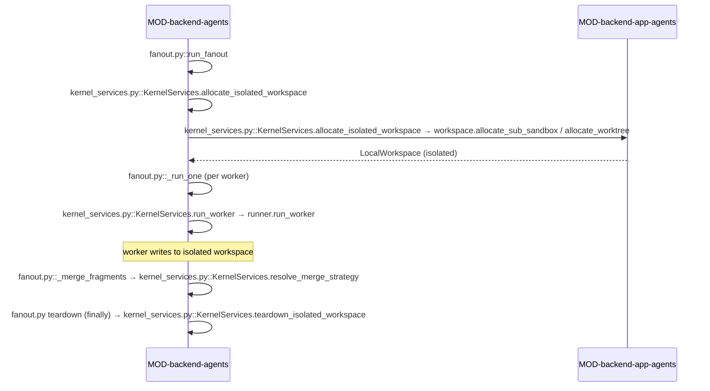

<!-- AUTO-GENERATED BELOW THIS LINE — regenerated by tools/knowledge/build_architecture.py -->

### Members (6 files across 3 modules)

**[MOD-backend-agents](MOD-backend-agents.md)**
- [backend/agents/runtime/__init__.py](../../backend/agents/runtime/__init__.py)
- [backend/agents/runtime/base.py](../../backend/agents/runtime/base.py)

**[MOD-backend-app-agents](MOD-backend-app-agents.md)**
- [backend/app/agents/runtime/__init__.py](../../backend/app/agents/runtime/__init__.py)
- [backend/app/agents/runtime/local.py](../../backend/app/agents/runtime/local.py)
- [backend/app/agents/sandbox.py](../../backend/app/agents/sandbox.py)

**[MOD-backend-app-models](MOD-backend-app-models.md)**
- [backend/app/models/workspace.py](../../backend/app/models/workspace.py)

### Imported by, from outside this domain (8)
- [backend/agents/authz.py](../../backend/agents/authz.py)
- [backend/agents/execution_engine/engine.py](../../backend/agents/execution_engine/engine.py)
- [backend/agents/execution_engine/kernel_services.py](../../backend/agents/execution_engine/kernel_services.py)
- [backend/agents/factory.py](../../backend/agents/factory.py)
- [backend/app/agents/deep_agent_runner.py](../../backend/app/agents/deep_agent_runner.py)
- [backend/app/api/run_files.py](../../backend/app/api/run_files.py)
- [backend/app/main.py](../../backend/app/main.py)
- [backend/app/models/__init__.py](../../backend/app/models/__init__.py)

### Imports, from outside this domain (9)
- [backend/agents/__init__.py](../../backend/agents/__init__.py)
- [backend/agents/capabilities/__init__.py](../../backend/agents/capabilities/__init__.py)
- [backend/agents/capabilities/registry.py](../../backend/agents/capabilities/registry.py)
- [backend/app/__init__.py](../../backend/app/__init__.py)
- [backend/app/agents/__init__.py](../../backend/app/agents/__init__.py)
- [backend/app/core/__init__.py](../../backend/app/core/__init__.py)
- [backend/app/core/config.py](../../backend/app/core/config.py)
- [backend/app/models/__init__.py](../../backend/app/models/__init__.py)
- [backend/app/models/database.py](../../backend/app/models/database.py)

### External
(none)
<!-- /AUTO-GENERATED -->

## Purpose

This domain owns the answer to *where does a run's bytes live, and who can reach
them*. Every file an agent writes lands on a real per-run directory under
`settings.RUNS_ROOT`, resolved as `<RUNS_ROOT>/<user>/<run>/`, and every relative
path an untrusted model hands to a filesystem tool is resolved and containment-
checked before it becomes a real path. It also owns the two derived questions
that follow from putting a run on disk: how a *parallel* run splits that
directory so concurrent workers cannot overwrite each other (`sub_sandbox` child
dirs, or git worktrees on per-worker branches), and how the directory eventually
goes away (a TTL sweep that must not delete a run still in flight). Without it a
run has nowhere to write, `..` in a model-authored path reads another user's
work, and two fan-out workers writing `index.html` silently produce one file.

It begins at the disk root and ends at the disk root. It does **not** decide
*what* a deliverable is or how it is serialised for the UI — that is
`DOMAIN-deliverables-and-artifacts`, even though `serialize_sandbox_deliverable`
physically lives in [sandbox.py](../../backend/app/agents/sandbox.py) because it is a walk of the sandbox tree. It
does not decide *who the owner is* or enforce row-level scoping; the
`owner_id` / `workspace_id` pair it is handed comes from
`DOMAIN-auth-and-entitlements`, and the `workspaces` DB row is minted by
[authz.py::ScopedStore.create_workspace](../../backend/agents/authz.py), not here. It does not decide *when* a
worker is isolated or which merge strategy reconciles them — the kernel does
that in `DOMAIN-execution-kernel` (`fanout.py::_select_isolation_scope`) and
only calls down here to allocate. And it does not re-materialise work after a
crash: the disk is treated as expendable, and rebuilding from durable rows is
`DOMAIN-durable-state-resume`.

## Shape

**Every path that crosses into this domain is resolved through exactly one
containment check — [sandbox.py::RunSandbox.path_for](../../backend/app/agents/sandbox.py) (or the identically-shaped
[local.py::_ChildSandbox.path_for](../../backend/app/agents/runtime/local.py)) — and exactly one `shutil.rmtree` owner,
[sandbox.py::RunSandbox.cleanup](../../backend/app/agents/sandbox.py), deletes anything.** `LocalWorkspace.teardown`
delegates *to* `cleanup`; `cleanup` never routes back. That one-way direction is
what keeps the sandbox↔workspace pair cycle-free.



- **The port layer** is [agents/runtime/base.py](../../backend/agents/runtime/base.py) alone: `RuntimeEnvironment`,
  `Workspace`, `ExecutionPolicy` and `IsolationProvider`, all
  `typing.Protocol` with `@runtime_checkable`, no bodies, stdlib `typing` as the
  only import. This is kernel-side (`MOD-backend-agents`); the kernel depends on
  nothing else in this domain.
- **The implementation** is app-side (`MOD-backend-app-agents`) and crosses that
  boundary in exactly one direction: [app/agents/runtime/local.py](../../backend/app/agents/runtime/local.py) imports the
  ports, `app.agents.sandbox`, and `app.core.config.settings` — and *nothing*
  kernel-side imports it back. It is reached only by name, through
  [capabilities/registry.py](../../backend/agents/capabilities/registry.py). [app/agents/runtime/__init__.py](../../backend/app/agents/runtime/__init__.py) exists purely to
  fire the `@register("runtime_env", "local")` decorator on package import.
- **The disk primitive** is [sandbox.py::RunSandbox](../../backend/app/agents/sandbox.py): segment sanitisation
  (`_safe_segment` collapses anything outside `[A-Za-z0-9._-]`, strips `.`, caps
  at 128 chars), root resolution with an `is_relative_to` containment assert in
  `__init__`, `path_for` for every subsequent relpath, `ensure` (mkdir + chmod
  0700) and `cleanup`. Its `read` / `write` are a thin facade that delegates to a
  lazily built `LocalWorkspace` so the disk IO has one implementation.
- **The capability gate** is [local.py::LocalExecutionPolicy](../../backend/app/agents/runtime/local.py), satisfying the
  `ExecutionPolicy` port structurally. `exec` / `network` / `secrets` default
  off; `allows` denies any unknown action. When exec *is* granted the policy also
  carries the `DEFAULT_EXEC_PROFILE` allow-list and the cpu/mem/wall caps, which
  are constants in [local.py](../../backend/app/agents/runtime/local.py) and deliberately not manifest-tunable.
- **The isolation allocators** — `LocalWorkspace.allocate_sub_sandbox` and
  `allocate_worktree` — both return a `LocalWorkspace` backed by a
  `_ChildSandbox` rooted at a child dir *under* the parent run root, stamped with
  the parent's `owner_id` / `workspace_id`. `_ChildSandbox.cleanup` removes only
  the child, so a worker teardown can never reach a sibling or the parent.
- **The git surface** is entirely inside `LocalWorkspace._git`. `clone_repo`,
  `create_branch`, `git_diff`, `commit_all`, `spawn_point_commit`,
  `changed_since`, `allocate_worktree`, `remove_worktree` and `merge_worktree` all
  route through it. No capability and no kernel module spawns `git` — the
  `git_3way` merge strategy in [capabilities/merge/git_3way.py](../../backend/agents/capabilities/merge/git_3way.py) reaches it via
  [kernel_services.py::KernelServices.git_3way_merge](../../backend/agents/execution_engine/kernel_services.py).
- **The fan-out isolation seam** (Phase 11 / FANOUT-05) is the `KernelServices` handle:
  [kernel_services.py::KernelServices.allocate_isolated_workspace](../../backend/agents/execution_engine/kernel_services.py),
  [kernel_services.py::KernelServices.teardown_isolated_workspace](../../backend/agents/execution_engine/kernel_services.py),
  [kernel_services.py::KernelServices.reclaim_isolated_workspace](../../backend/agents/execution_engine/kernel_services.py),
  and [kernel_services.py::KernelServices.run_worker](../../backend/agents/execution_engine/kernel_services.py). The kernel `fanout.py::run_fanout` spawns
  workers through these methods without importing `app.agents.runtime` (the registry seam); workers run against allocated workspaces so parallel writes isolate safely. A
  [kernel_services.py::KernelServices.resolve_merge_strategy](../../backend/agents/execution_engine/kernel_services.py)
  and [kernel_services.py::KernelServices.write_fragment_artifact](../../backend/agents/execution_engine/kernel_services.py) (Phase 11 / FANOUT-06) persist the typed merge inputs.
- **The DB row** ([app/models/workspace.py](../../backend/app/models/workspace.py), `MOD-backend-app-models`) is a
  separate axis: it records `owner_id`, `workspace_id` (set equal to its own
  `id`), `kind`, `runtime`, `repo_id`, `ttl` and `created_at`. It is what makes
  durable rows scopable; it holds no path and is never consulted to reach disk.
  Its `ttl` column is *not* the reclamation clock — it defaults to `"run_ttl"`
  and no reader exists; `sweep_expired` keys off `settings.RUN_DIR_TTL_HOURS`
  and the directory mtime, never this row. [authz.py::ScopedStore.create_workspace](../../backend/agents/authz.py)
  passes only `id` / `owner_id` / `workspace_id` / `kind` / `runtime`, so `ttl`
  and `created_at` arrive from their column defaults.
- **Reclamation** is [sandbox.py::sweep_expired](../../backend/app/agents/sandbox.py), called from
  `app/main.py::_sandbox_sweep_loop` on a `settings.SANDBOX_SWEEP_INTERVAL_SECONDS`
  timer with a protection set of non-terminal run ids. Control crosses from
  `MOD-backend-app` down into this domain here, and only here.
- **Workspace budget tracking** (Phase 11 / OBS-01) is reached through [kernel_services.py::KernelServices.workspace_budget_spent](../../backend/agents/execution_engine/kernel_services.py),
  which the kernel `fanout.py::run_fanout` calls to read the per-workspace already-spent
  fan-out budget BEFORE a reserve (the per-workspace ceiling read, a form of quota enforcement
  alongside the engine's per-run budgets). Never imported directly by the kernel.

## In practice

### The path, by call

```mermaid
sequenceDiagram
    participant MOD-frontend-src-hooks
    participant MOD-backend-app-api
    participant MOD-backend-agents
    participant MOD-backend-app-agents
    participant MOD-backend-app-models

    MOD-frontend-src-hooks->>MOD-backend-app-api: useWorkflow.ts::startPipeline (POST /api/runs)
    MOD-backend-app-api->>MOD-backend-app-api: run_commands.py::launch_run
    MOD-backend-app-api-->>MOD-frontend-src-hooks: run_id returned — the run has NOT started
    MOD-backend-app-api->>MOD-backend-agents: run_commands.py::_drive_launch_to_queue
    activate MOD-backend-agents
    MOD-backend-agents->>MOD-backend-app-agents: engine.py::execute → sandbox.py::RunSandbox.ensure
    activate MOD-backend-app-agents
    MOD-backend-app-agents-->>MOD-backend-agents: root = RUNS_ROOT/<disk_principal>/<run_id>
    MOD-backend-agents->>MOD-backend-app-models: authz.py::ScopedStore.create_workspace → workspace.py::Workspace
    MOD-backend-app-models-->>MOD-backend-agents: workspaces.id → ectx.workspace_id
    alt compiled plan grants exec
        MOD-backend-agents->>MOD-backend-agents: registry.py::CapabilityRegistry.resolve('runtime_env','local')
        MOD-backend-agents->>MOD-backend-app-agents: local.py::LocalSandboxRuntime.create_workspace(exec=True, recorder=engine.py::_make_exec_recorder)
        MOD-backend-app-agents-->>MOD-backend-agents: LocalWorkspace bound to KernelServices.workspace
    else no exec grant
        MOD-backend-agents->>MOD-backend-agents: kernel_services.py::KernelServices.workspace stays None
    end
    loop one per compiled step
        MOD-backend-agents->>MOD-backend-app-agents: factory.py::create_runner → deep_agent_runner.py::DeepAgentRunner(run_sandbox=…)
        loop agent tool calls
            MOD-backend-app-agents->>MOD-backend-app-agents: local.py::LocalWorkspace.write_file → sandbox.py::RunSandbox.path_for
        end
        MOD-backend-agents->>MOD-backend-app-agents: serialized_sandbox.py::SerializedSandboxResolver.resolve → sandbox.py::serialize_sandbox_deliverable
    end
    deactivate MOD-backend-app-agents
    deactivate MOD-backend-agents
    Note over MOD-backend-app-agents: run ends; the run dir SURVIVES
    MOD-backend-app-agents->>MOD-backend-app-agents: main.py::_sandbox_sweep_loop → sandbox.py::sweep_expired
```

**Fan-out isolation path** — when a step fans out (Phase 11 / FANOUT-05):



### Step by step

**Launch**

1. `useWorkflow.ts::startPipeline` builds the `run_pipeline` payload and sends it
   up-channel as `POST /api/runs`.
2. `run_commands.py::launch_run` validates it, mints the `workflow_runs` row, and
   **returns the `run_id` immediately**. The HTTP response completes before any
   directory exists; everything below runs on a background driver and reaches the
   client over SSE.
3. `run_commands.py::_drive_launch_to_queue` calls [engine.py::execute](../../backend/agents/execution_engine/engine.py).

**Provisioning the run root**

4. [engine.py::execute](../../backend/agents/execution_engine/engine.py) computes `disk_principal = user_id or "anon"` — the *disk*
   principal, deliberately not the DB `owner_id`, which for an anonymous run may
   be `anon:<session_id>`.
5. It constructs `sandbox.py::RunSandbox(disk_principal, pipeline_run_id)`.
   `_safe_segment` reduces each identifier to one path segment, the root is
   `resolve()`d, and `__init__` raises `ValueError` if the result is not
   `is_relative_to` the `RUNS_ROOT` base.
6. `RunSandbox.ensure` creates the directory (parents, mode 0700). Declared
   od-template files are seeded into it via `RunSandbox.write`.
7. [authz.py::ScopedStore.create_workspace](../../backend/agents/authz.py) inserts the `workspaces` row and
   returns its id as `ectx.workspace_id`. This is a *different* `create_workspace`
   from the runtime port's — it touches the database, not the disk.
8. Only if some compiled step declares `tools.exec` does the engine resolve
   `("runtime_env", "local")` from [capabilities/registry.py](../../backend/agents/capabilities/registry.py) and call
   `local.py::LocalSandboxRuntime.create_workspace(exec=True, …)`, binding the
   result onto `KernelServices.workspace`. A non-exec run leaves that attribute
   `None` — the whole `LocalWorkspace` layer is dormant on the common path.

**Running the steps**

9. For each step, [factory.py::create_runner](../../backend/agents/factory.py) builds (or accepts) a `RunSandbox`
   keyed on `ctx.run_id` *only* — never on the per-agent `thread_id` — so files
   one agent writes persist for the next. For a fan-out worker run through
   `KernelServices.run_worker`, the factory accepts an optional `run_sandbox` override
   (a `_ChildSandbox` rooted at the allocated isolated workspace), so the worker's
   filesystem writes route to its isolated dir, not the shared run root.
10. [deep_agent_runner.py::DeepAgentRunner](../../backend/app/agents/deep_agent_runner.py) roots the deepagents
    `FilesystemBackend` at `run_sandbox.root`. From here on, every `write_file` /
    `read_file` / `edit_file` the model emits is a path inside this domain.
11. [local.py::LocalWorkspace.write_file](../../backend/app/agents/runtime/local.py) resolves the relpath through
    `RunSandbox.path_for`, which raises `ValueError` on any escape, then
    `mkdir(parents)`s and writes UTF-8.

**Producing the deliverable**

12. At step end the declared deliverable resolver runs. For code-gen that is
    `serialized_sandbox.py::SerializedSandboxResolver.resolve`, which reads
    `ctx.runner.sandbox.root` and calls
    [kernel_services.py::KernelServices.count_sandbox_deliverables](../../backend/agents/execution_engine/kernel_services.py).
13. If the count is non-zero it calls `serialize_sandbox_deliverable`, which walks
    the tree via `_collect_deliverable_relpaths`, drops `PLANNER.md` and anything
    under `.uploads/`, sorts by relative path, and reads each file with
    `read_bytes().decode("utf-8")` — never `read_text`, so CRLF survives intact.
14. The `filename:`-block string becomes `WorkflowRun.output` and reaches the UI.

**Reclamation**

15. The run terminates. Nothing deletes the directory — the parent-run seed and
    the file-download endpoints both need it to outlive the run.
16. `app/main.py::_sandbox_sweep_loop` wakes on its interval, queries non-terminal
    `WorkflowRun` ids, unions them with the in-process `_PIPELINE_QUEUES` keys, and
    passes that set as `protected_run_ids` to [sandbox.py::sweep_expired](../../backend/app/agents/sandbox.py).
17. `sweep_expired` walks exactly two levels, skips any dir whose name is in the
    protection set *before* looking at mtime, and `rmtree`s the rest past
    `settings.RUN_DIR_TTL_HOURS`.

### What breaks if you get it wrong

**Silent, and the ones worth fearing:**

- *Weakening the containment check.* Replacing `is_relative_to` with a
  `startswith(base + "/")` string compare in `RunSandbox.__init__` or `path_for`
  looks equivalent and is not — it is separator-blind and falsely rejects every
  path on Windows. In the other direction, loosening `_safe_segment`'s character
  class lets a `/` into a user or run segment and one user's run root lands
  inside another's. Nothing downstream re-checks; `path_for` is the only gate.
  tests/agents/test_isolation.py is the guard.
- *Giving `LocalWorkspace.teardown` its own `rmtree`.* It currently delegates to
  `RunSandbox.cleanup`. Making the delegation bidirectional creates a teardown
  cycle; making `_ChildSandbox.cleanup` resolve to the parent root turns a single
  worker's teardown into a deletion of the whole run.
- *Provisioning the exec workspace unconditionally.* The
  `_plan_grants_exec` guard in [engine.py::execute](../../backend/agents/execution_engine/engine.py) is what keeps every non-exec
  run byte-identical. Removing it silently hands an exec-capable `Workspace` to
  runs whose plan never asked for one.
- *Dropping the `protected_run_ids` check in `sweep_expired`.* POSIX directory
  mtime does not advance when a file *inside* is overwritten, which is exactly
  what the prototype build loop's `edit_file` path does. Without the protection
  set an actively building run gets its directory deleted underneath it and the
  failure surfaces as a missing deliverable, not as a sweep error.
- *Not committing a worktree worker before merging.* [fanout.py](../../backend/agents/execution_engine/fanout.py) calls
  `LocalWorkspace.commit_all` on a completed worktree worker for a reason: an
  uncommitted worker branch makes `merge_worktree`'s `git merge` report nothing to
  integrate, and `remove_worktree --force` then destroys the edits. The worker
  appears to succeed and contributes nothing.
- *Discarding `has_git` on the workspace.* This was a real defect (CR-06): the
  flag was documented advisory and thrown away, which made
  `fanout.py::_select_isolation_scope` never select `worktree`. Every repo fan-out
  quietly downgraded to `sub_sandbox`.
- *Switching `serialize_sandbox_deliverable` to `read_text`.* Universal-newline
  translation rewrites `\r\n` to `\n` on read and the deliverable diverges from
  what the agent wrote. This one is loud — the byte-oracle in
  tests/agents/test_sandbox_deliverable.py pins the format.
- *Writing a new bookkeeping file into the sandbox root.* Exclusion is by exact
  basename (`PLANNER.md`) and by the `.uploads/` prefix, nothing else. Any other
  file you leave at the root becomes a deliverable block in the UI.

**Loud, so you do not have to worry:**

- Importing `agents.execution_engine` or `app` from [agents/runtime/base.py](../../backend/agents/runtime/base.py)
  fails the fourth import-linter contract in `backend/pyproject.toml` in CI.
- Calling `exec_command` under the default policy raises `PermissionError` and
  records a `denied` audit outcome before doing anything else.
- Handing `path_for` an escaping relpath raises `ValueError` at the call site.
- Importing `resource` unconditionally in [local.py](../../backend/app/agents/runtime/local.py) is a startup
  `ModuleNotFoundError` on Windows — recorded as `FIX-007`, and why the import
  sits behind a `try/except ImportError`.

### The other paths

**The fan-out isolation path.** When a step fans out, `fanout.py::run_fanout`
reads `getattr(runner, "workspace")`; if a base workspace is bound it calls
`_select_isolation_scope`, which returns `worktree` when the base has
`has_git=True` and `sub_sandbox` otherwise — derived from the workspace, never
read from the manifest. `KernelServices.allocate_isolated_workspace` dispatches
to `allocate_sub_sandbox` (a child dir `subagents/{step}/{i}/`) or
`allocate_worktree` (`git worktree add -b fanout/{step}/{i}` under
`.worktrees/`). Every allocation is appended to a list that
`fanout.py::_teardown_allocated` drains in a `finally`, so a mid-flight cancel or
a `BudgetExceeded` abort leaves no orphan worktrees or branches. When no base
workspace is bound at all — the common non-exec run, or the offline harness — the
scope degrades to `shared_read` and all workers write into the one run dir. Each
worker runs through `KernelServices.run_worker`, which synthesizes a step view
carrying the allocated workspace so writes isolate per-worker. Named-worker
selection is pre-validated through `KernelServices.agent_exists` so an unknown
worker raises `FanoutError` BEFORE any spawn (FANOUT-03).

**The exec path.** `LocalWorkspace.exec_command` is the single enforcement point
and layers five checks in order: deny-by-default, empty-argv guard, allow/deny
list where deny beats allow, a constructed minimal env of only `PATH`/`HOME`/
`TMPDIR`, and a `Popen` with `start_new_session=True` under `RLIMIT_CPU` /
`RLIMIT_AS` plus a wall-clock timeout that `killpg`s the entire process group.
Output is truncated at 64KB and every outcome — `allowed`, `denied`, `killed` —
fires the injected recorder, which the engine bridges to
[kernel_services.py::KernelServices.record_exec_run](../../backend/agents/execution_engine/kernel_services.py). Network egress from an
allow-listed interpreter is a documented, accepted residual, not a blocked one.

**The upload path.** [app/api/run_files.py](../../backend/app/api/run_files.py) (`POST /api/runs/{run_id}/files`)
constructs its own `RunSandbox` for the authenticated user and writes every
accepted upload, its extracted-text sidecar, and `manifest.json` under the
reserved `.uploads/` prefix — the same `path_for` containment applies. Because
that prefix is excluded from the deliverable walk, a run with uploads produces the
same deliverable string as one without.

**The parent-run seed path.** A revision run reads its parent's `spec.md` /
`design.md` / `tasks.md` through [kernel_services.py::KernelServices.read_parent_file](../../backend/agents/execution_engine/kernel_services.py),
which builds a second `RunSandbox` on the *same* `disk_principal` and the parent
run id. This is the reason the sweep TTL is long: a swept parent degrades the
revision to a warning and an unseeded run rather than an error.

## Why this shape

**Why ports kernel-side and the implementation app-side.** The obvious layout
would put `LocalSandboxRuntime` next to the engine that uses it. It cannot go
there: the impl reads `app.core.config.settings.RUNS_ROOT` and reuses
`app.agents.sandbox`, and the kernel is not permitted to reach into `app`. So
[agents/runtime/base.py](../../backend/agents/runtime/base.py) holds interface-only Protocols with `typing` as its sole
import, the impl lives in [app/agents/runtime/local.py](../../backend/app/agents/runtime/local.py), and the two meet by name
through [capabilities/registry.py](../../backend/agents/capabilities/registry.py). This is not a convention — the fourth
import-linter contract in `backend/pyproject.toml`
(`agents.runtime` must not import `agents.execution_engine` or `app`) fails CI if
it is violated. It is the same capability-registry seam `ARCHITECTURE.md` names
as a system-level design seam, applied here so that an `EcsRuntime` registering
under a different `runtime_env` name is a backend swap rather than an engine
rewrite. `ARCHITECTURE.md` is explicit that ECS is designed-for and deliberately
not built.

**Why `RunSandbox` survives as a facade on top of `LocalWorkspace`.** It looks
redundant — two objects for one directory. The recorded reason (D-02, RUNTIME-02)
is move-don't-copy: the consumed surface (`__init__` / `ensure` / `root` /
`path_for` / `read` / `write` / `cleanup`) was preserved byte-for-byte so no call
site had to change, while the read/write bodies moved into the single
`LocalWorkspace` implementation. The direction of the remaining coupling is
chosen, not accidental: `LocalWorkspace` is constructed *from* a sandbox and
borrows its traversal primitives, and `cleanup` — not `teardown` — owns the
`rmtree`, which is what makes the pair cycle-free. The consequence is one
`Workspace` abstraction serving both the artifact case (`has_git=False`) and the
repo case (`has_git=True`), with no `if repo:` fork in the engine.

**Why the isolation scope is read from the workspace, not the manifest.**
INV-7. If `step.fanout` could declare an isolation field, a user-authored
manifest could downgrade its own workers to shared writes. `_select_isolation_scope`
therefore keys solely on `has_git`, and `FanoutSpec` has no isolation field to
read. The same reasoning is why `DEFAULT_EXEC_PROFILE`'s allow-list and caps are
module constants in [local.py](../../backend/app/agents/runtime/local.py) rather than manifest keys.

**Why git is shelled in exactly one class.** Phase-9 D-10. Capabilities are
user-selectable by name, so letting a capability spawn a subprocess would put
process execution behind a manifest string. [capabilities/merge/git_3way.py](../../backend/agents/capabilities/merge/git_3way.py)
consequently calls `KernelServices.git_3way_merge`, which delegates to
`LocalWorkspace.merge_worktree`. Two escapes are closed at that single owner
because they can only be closed once: `GIT_ALLOW_PROTOCOL=file:https:ssh` on
clone (blocking the `ext::` / `fd::` transports, which execute commands at clone
time) and rejecting a source beginning with `-` (argument injection). Both are
recorded as WR-01.

**Why the disk principal is decoupled from the DB owner.** D-09 / CTX-05: an
anonymous run's DB `owner_id` may be `anon:<session_id>`, but its sandbox path
stays keyed on `user_id or "anon"` so the paths are byte-identical to what they
were before scoped ownership landed and the characterisation snapshots still
hold. The DB principal must never reach a disk key.

**Why the sweep protection set is DB-backed rather than mtime-only.** Recorded as
the D6 hardening under KAN-139: POSIX directory mtime does not advance when files
inside are rewritten in place, which is precisely the prototype build loop's
behaviour, so mtime alone marked live runs as expired. Protection is checked
first and mtime is a second necessary condition, never a sufficient one.

**Why `exec` is authorised per run rather than per step.** Recorded as WR-03 /
D-03: one security-and-approval-gated grant provisions the workspace for the whole
run, so a second exec step does not re-prompt. The compiler's engineer-trust
ceiling (a user or DB manifest can never provision the exec workspace) is what
bounds the blast radius of that choice.

**Not recorded.** Why `_ChildSandbox` re-implements `path_for` with a
`startswith` containment check instead of the `is_relative_to` form `RunSandbox`
uses is not documented anywhere in the source or the cards; the two are not
equivalent on Windows, and no card explains the divergence.
