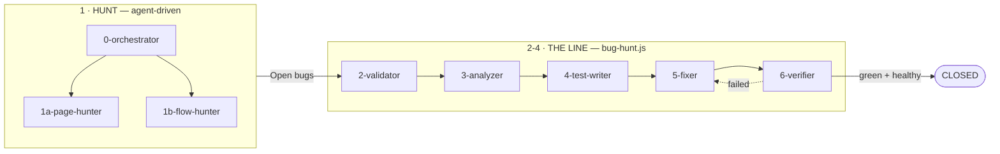
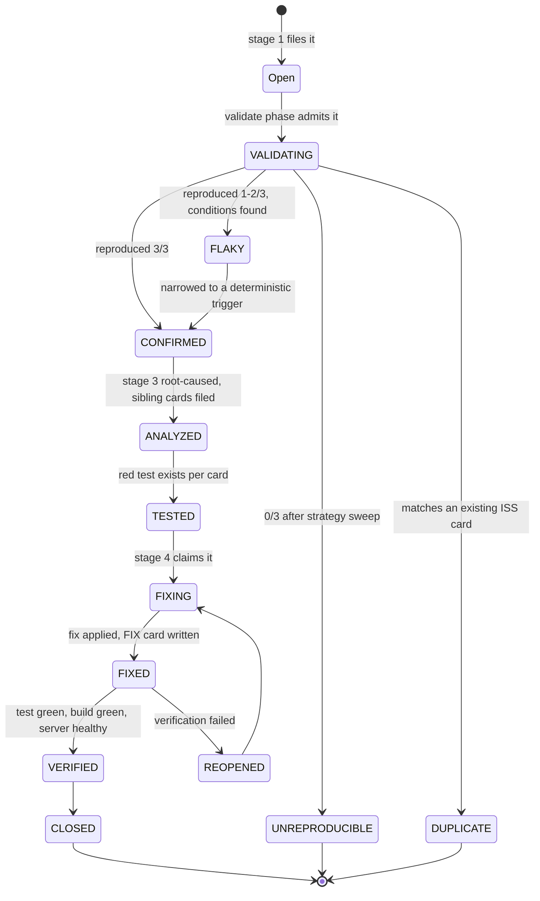

# Bug Hunter — hunt · validate · analyze · test · fix · verify · close

Find bugs, prove them, understand them, fix them, and leave a knowledge base that makes the
next occurrence cheap. Four phases, each independently runnable, each driven off the state of
one register so any stage can be stopped and resumed without losing its place.



| # | Agent | Model | Role | Concurrency |
|---|---|---|---|---|
| 0 | `0-orchestrator` | Opus | the only agent you talk to — owns state, batching, gates | — |
| 1a | `1a-page-hunter` | Sonnet | one page, one bug | serial (browser) |
| 1b | `1b-flow-hunter` | Sonnet | one workflow journey, one bug | serial (browser) |
| 2 | `2-validator` | Sonnet | reproduce 3×, narrow, mint the root ISS card | serial (browser) |
| 3 | `3-analyzer` | Sonnet | root cause, blast radius, sibling cards | **parallel** |
| 4 | `4-test-writer` | Sonnet | one red xfail test per card | serial (runs it) |
| 5 | `5-fixer` | Opus | the only source-editing agent | **parallel** |
| 6 | `6-verifier` | Sonnet | the only agent that may say "fixed" | serial (browser) |
| 7 | `7-closer` | Sonnet | consolidate knowledge, commit, report | — |

Stages 2–6 are scheduled by `.claude/workflows/bug-hunt.js`; the orchestrator dispatches 1a/1b
and 7 directly. `5-fixer` is Opus because it edits production source.

**Concurrency is not a preference.** Every browser-driving agent shares one Playwright MCP
Chrome, so two at once navigate over each other and manufacture phantom findings. App-touching
phases run serial; code-only phases (`3-analyzer`, `5-fixer`) run parallel. The script enforces
this in code, not by convention.

**Running it — you only ever start the orchestrator:**

```
cd /Users/bilala/Developer/Projects/VELOCITY-AI-feat-bug-hunter
claude --agent 0-orchestrator
```

then talk to it: *"start from validation"*, *"run the high ones"*, *"pause"*, *"resume"*,
*"status"*, *"close"*. It maps those to the script:

```
Workflow({ name:"bug-hunt", args:{ phase:"validate" } })        one phase alone
Workflow({ name:"bug-hunt", args:{ stage:"triage" } })          validate → analyze → test
Workflow({ name:"bug-hunt", args:{ stage:"repair" } })          fix → verify
Workflow({ name:"bug-hunt", args:{ stage:"all" } })             the whole line, then Close commits
Workflow({ name:"bug-hunt", args:{ bugIds:[...], wave:3 } })    a specific set, batches of 3
```

---

## Before you launch: the scheduler harness

```
node bug-hunter/scheduler-sim.mjs      # 10/10 passed, or do not launch
```

`scheduler-sim.mjs` replays the scheduler — routing, claims, lane pools, termination — with the
agents replaced by instant fakes, against the failure shapes that have actually broken this
pipeline:

| it asserts | the defect it was written for |
|---|---|
| the line pipelines | reconcile sat behind `quiescent()`, so analyze could not start until validate had finished all 73 bugs |
| prose in `statusSet` still routes | `statusSet` was free text; workers wrote `"CONFIRMED — written to the ledger (row 22)"` and 40 bugs fell off the line |
| a worker that writes the register then dies is recovered | push handoff never sees it; only a poller reading the register can |
| a wave that throws does not wedge the run | `busy` was never cleared, so `quiescent()` could not come true and the run never ended |
| a blocked worker does not strand its bug | the claim stayed set, so the poller skipped that bug for the rest of the run |
| the reopen cap fires and the run still ends | fix ↔ verify can bounce a bug forever |
| a single-phase stage reports nothing as dropped | `{phase:"validate"}` ends with CONFIRMED routing nowhere — normal, not a defect |
| no status in `EXIT` is orphaned | add one without a phase entry and bugs reaching it leave the line silently |

Every one of those was found by a live run instead, each costing 40 minutes and a lot of tokens.
The harness duplicates the scheduler core rather than importing it (a workflow script is
self-contained and needs the `agent()`/`parallel()` globals), so **when you change routing or
termination in `bug-hunt.js`, change it here too.**


## The bug lifecycle

Every entry in `ledger.md` carries a `Status`. This is the only thing that tells a
stage what to pick up, so it is load-bearing, not decoration.



`WONTFIX` is a terminal status a human sets, never an agent.

---

## Driving the UI — required reading for every agent that touches the browser

Applies to **`1a-page-hunter`, `1b-flow-hunter`, `2-validator`, `4-test-writer`, `6-verifier`**. Not to
`3-analyzer` (reads code) or `5-fixer` (edits code).

**The target definition is mandatory reading before the first browser action:**

```
bug-hunter/velocity.json
```

JSON, not prose. It carries `routes` (40), `selectors`, `quirks` (~22), `recipes` (18) and
`pages` (structural facts per screen). Read it, then use it — a `recipe` is a ready-made steps
array, not something to paraphrase.

| | |
|---|---|
| App | `http://localhost:3000` (backend `http://localhost:8000`) |
| Sign in | `qa-admin@flowinqa.com` / `flowin-e2e-pass` — admin, enterprise |
| Other tiers | `qa-enterprise@`, `qa-pro@`, `qa-basic@` — same password, same domain |
| Already signed in? | `!!localStorage.getItem('auth_token')` — **never return the token itself** |
| Login | `/login` → fill `input[type=email]`, `input[type=password]` → `button:has-text("Sign in")` → wait for `/dashboard` |

**The quirks exist because each one already cost someone a round.** The ones that bite hardest:

- Bare `/` always redirects to `/login`. Never navigate there; the home route is `/dashboard`.
- `+ Add` and `Workflow actions` repeat once per card — a bare text click hits whichever is
  first in the DOM. Scope with `clickNear` anchored on the card's title.
- Library tabs carry badge counts (`Agents  87`), so exact-text tab clicks fail — use
  `[role="tab"]:nth-child(N)`.
- Account-menu items are `[role="menuitem"]` and are flaky to click by text; locate by role plus
  text and call `.click()` directly.
- The Steps tab's testid is `tab-thinking` — legacy naming, still live.
- The composer's "Run once" gives no visible confirmation even though the run fires; verify via
  Run History or `GET /api/runs`.
- `/create/app` renders the **user-stories** panel. That is a known live defect, not your find.

**A documented quirk is known behaviour, not a bug.** Anything the definition already records as
a live defect is exclusion knowledge — treat it exactly like a ledger entry and keep hunting.

**Faster than clicking:** `GET http://localhost:8000/api/runs?limit=50` with the bearer token
resolves run ids, and `GET /api/runs/<id>` returns `agent_outputs` as a JSON-*stringified* array
— the quickest way to inspect a run's agents, tool calls and outputs without fighting the Steps
tab.

**If you learn something the definition does not have** — a new selector, a route, a quirk — say
so in your report. `0-orchestrator` merges it back into the definition. Workers never write to it.

---

## Stage 0 — Preconditions

Checked once at the start of any stage; it reports and stops rather than
guessing.

- Frontend on `:3000`, backend on `:8000`, both answering. Note **which checkout** the backend
  watches — that is the tree under test, and it may not be this worktree.
- `bug-hunter/ledger.md` exists (it does).
- `.knowledge/` is current — `/velocity prime`. If it wants a full `sync`, note it and carry on.
- Git hooks are disabled for this worktree (`core.hooksPath` → empty dir), so nothing rebuilds
  `.knowledge/` under a commit and eats stashed work. That is BUG-031's failure mode.

---

## Stage 1 — HUNT

**Goal:** fill `ledger.md` with reproducible-looking candidates. Nothing here is trusted
yet; stage 2 does the proving.

### 1a. `1a-page-hunter` — already written

One page, one new bug, then exit. 55 pages from `tests/integration/PAGES.md`, two consecutive
clean passes to converge. Covered in `.claude/agents/1a-page-hunter.md`.

### 1b. `1b-flow-hunter` — the gap

A page hunter never sees a *run*. It clicks a launch panel and moves on, so every defect that
only exists while a pipeline is executing — a gate that never arms, a stream that drops, a
deliverable that resolves empty, a revision that wipes its parent's transcript — is invisible to
stage 1 as it stands today.

`1b-flow-hunter` takes **one workflow journey** instead of one page, and hunts across its whole
lifecycle.

**Journeys** (one hunter per journey, same one-bug-then-exit rule):

| Family | Journeys |
|---|---|
| Build | `prototype`, `ppt`, `ppt_v2`, `user_stories`, `app_builder` |
| Revision | `prototype_revision`, `prototype_large_revision`, `prototype_feature_revision`, `ppt_revision`, `user_stories_revision`, `app_builder_revision`, `custom_revision` |
| Gates | `ex_A1_loop`, `ex_A2_branch`, `ex_A3_divert`, `ex_A4_human_gate`, `ex_A4_human_divert` |
| Composed | a custom workflow built in the composer, saved, then launched |

**Segments within a journey — probe all four:**

```
BEFORE                DURING                     AFTER                  ACROSS
──────                ──────                     ─────                  ──────
launch panel          clarify gate + answers     deliverable renders    reload mid-run
brief validation      planning → generating      Preview/Steps/Files/   deep-link each tab
attachments/uploads   review gate: approve,       Workspace/Audit       browser back/forward
template + DS pick      edit, redo, update_specs download/export        stop then resume
advanced/agents       steering mid-run           token + cost totals    revise from complete
model override        chat lane while running    run history row        open in a second tab
                      stop / cancel              family + version menu
```

**Run states to reach deliberately:** `planning`, `clarifying`, `generating`,
`waiting_for_user`, `completed`, `failed`, `cancelled`, `diverted`, and a `degraded` completion
(some agent failed but the run reported complete).

**Extra reporting fields** beyond the page hunter's contract:

```
RESULT: FOUND_BUG | NO_NEW_BUG | BLOCKED
JOURNEY: <workflow id>
SEGMENT: before | during | after | across
RUN_ID: <the run this was observed on>
RUN_STATE: <state at the moment of failure>
```

**These are real runs against Bedrock.** They cost money and take minutes. Convergence is
therefore **1 clean pass per journey**, not 2 — a second full run per journey to prove a
negative is not worth it. Say so in the report rather than claiming page-level rigour.

**Gate:** launching real runs needs explicit go from the user for the session. The hunter never
starts one on its own initiative outside an approved run.

---

## Stage 2 — VALIDATE

**Goal:** turn a *claim* into a *proof*, and give it a permanent home in `.knowledge/`.

### `validate` stage

Picks bugs with `Status: Open`, one at a time (serial — validation is cheap and a second
2-validator on the same bug is waste). Sets `VALIDATING`, dispatches, writes back the outcome.

### `2-validator`

1. Read the register entry: repro steps, evidence, fingerprint, browser signals.
2. **Reproduce it 3 times**, each from a cold start (fresh navigation, cleared state), capturing
   evidence for each attempt.
3. Score it:
   - **3/3** → `CONFIRMED`.
   - **1–2/3** → do not give up. Vary one axis at a time and re-run: timing (fast vs settled
     clicks), entry path (deep link vs click-through), account tier, theme, viewport, run state,
     empty vs populated data, first visit vs revisit, cold vs warm cache. Record which axis
     flipped it. A trigger you can name promotes it to `CONFIRMED`; one you cannot leaves it
     `FLAKY` with the axes tried written down.
   - **0/3** → sweep the same axes once, then `UNREPRODUCIBLE` with the full list of what was
     tried. Never delete the entry — an unreproducible report is data.
4. **Duplicate check against `.knowledge/`, not just the register.** `grep` `INDEX.md` for the
   symptom in the user's words. If an existing `ISS`/`BUG` card already covers it, mark the
   register entry `DUPLICATE`, link the existing card, and stop. This is the check the hunt
   phase deliberately skips (re-filing into the register is cheap; re-filing into a 610-card
   permanent store is not).
5. On `CONFIRMED`: create the **ISSUE card** via `/velocity book-keeping`, carrying:
   - the reproduction that worked, and **which cycle/attempt** produced it
   - page, route, component, exact conditions (tier, state, entry path, timing)
   - `applies_to.globs` for the files the symptom points at
   - `verification: {type: manual, status: passed}` — a human-observed repro, no test yet
   - evidence paths under `bug-hunter/evidence/…`
6. Link both ways:
   - register entry gains `**Issue card:** [ISS-NNN](../.knowledge/cards/<file>.md)`
   - card body names the register entry id in its prose

### How cards link to each other

`build_index.py::read_related` is the authority. Three things matter:

**The block is the graph.** `split_related` reads cross-references *only* from between
`<!-- RELATED -->` and `<!-- /RELATED -->`. A reference in body prose — any syntax — is not an
edge and is invisible to `INDEX.md`. 376 of the 610 cards carry this block, and
`.knowledge/cards/` contains no architecture cards, so it is the convention for bug, issue, fix
and adr cards alike.

**Always author the full markdown link form** — card id as the text, the target's exact sibling
filename as the href:

```markdown
<!-- RELATED -->

## Related

**Depends on:** [ISS-194](20260828-1130-ISS-194.md)

**Referenced by:** [FIX-328](20260828-1400-FIX-328.md)

<!-- /RELATED -->
```

This is the one pattern, everywhere a card references another — inside the block and in body
prose alike. It is what `book-keeping.md` mandates and the only form that is clickable in a
stock editor.

The rebuild also *tolerates* a bare `ISS-194` and a piped `[[stem|ISS-194]]` so pre-switch cards
keep their graph, but **neither is an authoring form** — do not write them.

**Resolving a target's filename** costs one glob, since the stem carries a datetime:

```sh
ls .knowledge/cards/*-ISS-194.md      # -> 20260828-1130-ISS-194.md
```

Use the basename, not the path — the link is relative to the sibling card. And because the
rebuild re-resolves every target on each run, a later rename follows the link automatically;
that is what keeps it correct, not a reason to author it any other way.

**Both directions, always.** Nothing infers the reverse edge — add the reciprocal
`**Referenced by:**` line to every card you point at. `validate_links.py` checks that the id
names a real card *and* that the file exists, and fails the rebuild on either, so a wrong link
is loud rather than silent.

---

## Stage 3 — ANALYZE

**Goal:** root cause, blast radius, the sibling defects nobody reported, and a red test per
finding.

### `analyze` stage

Picks `CONFIRMED` bugs. Runs `3-analyzer` first, then `4-test-writer` on the
cards it produced. One bug at a time end to end, so the test writer always sees a complete card
set.

### `3-analyzer`

1. `/velocity prime` — module map and invariants.
2. `/velocity analyze <symptom in the user's words>` — the skill's own procedure: index →
   shortlist cards → read them → follow `## Related` → read the owning `MOD-*`/`DOMAIN-*` card →
   read the actual source → root cause with `file:line`.
3. Extract, separating **CONFIRMED** (backed by a `file:line` it read) from **INFERRED** (a
   hypothesis, with what would prove it):
   - root cause
   - blast radius — every caller/consumer of the broken function, found by grepping callers, not
     by reading the one path the report named
   - proposed fix, and where it belongs so all callers route through it
4. From the root cause, derive **sibling defects**: other callers with the same flaw, adjacent
   states, the inverse case, the empty/boundary case, the concurrent case.
5. File one **ISSUE card per sibling** via `/velocity book-keeping` — conditions, expected vs
   actual, and why the root cause implies it. Mark each `INFERRED` until reproduced.
6. Link every new card to the original via the `## Related` block, both directions.
7. Update the register entry: root cause one-liner, blast radius, and every card id created.

8. **Final step — validate the ids it just minted.** Before handing off, re-scan the card store
   for the families it wrote to and confirm every new id is unique and above the family max.
   Repair anything that collided *now*, while the card is new and only this bug's cards point at
   it — see "ID allocation" below.

**Scope rule:** the 3-analyzer reads and writes cards. It does **not** edit application source.

### `4-test-writer`

Receives the full card set for one bug plus page/component/repro detail.

- **≥1 test per issue card**, more when a card has distinct conditions.
- Location: `tests/integration/e2e/suites/<NN_area>/` alongside the existing 25 areas. Backend-
  only defects go to `backend/tests/unit/` or `backend/tests/agents/`.
- **The test asserts CORRECT behaviour**, so it fails today and passes after the fix.
- Tag it so it is findable from the card and vice versa:

```python
@pytest.mark.issue("ISS-194")          # new marker — the card this proves
@pytest.mark.xfail(reason="ISS-194 unfixed", strict=True)
def test_display_name_survives_reload(page):
    ...
```

- Update each card's `verification` block so the link is two-way:

```yaml
verification:
  type: test
  status: failed          # red until phase 4
  test_files:
    - tests/integration/e2e/suites/09_settings/test_profile_persistence.py
```

> **Deviation from the original spec, deliberately.** You asked for the test to be left "in red
> condition". A genuinely failing test does prove the test catches the bug — so the writer
> **must run it and observe the failure**, and record that output. But leaving it plain-red
> poisons the suite baseline for everyone until phase 4 lands. `xfail(strict=True)` keeps both
> properties: an unfixed bug is a clean xfail, and the moment the fix works the test XPASSes,
> which `strict` turns into a loud failure telling you to drop the marker. The 6-verifier drops
> it. If you would rather have it plain-red, say so and I will drop the xfail.

**Test-run discipline, everywhere in this workflow:** one file at a time, never the full suite,
10-minute cap, offline tier only (`-m "not live"` is already the pytest.ini default). A full
`pytest` hangs here on Chromium/Bedrock/Postgres gates.

---

## Stage 4 — FIX

**Goal:** apply the fix, prove it, and leave every record consistent.

### `fix` stage

Picks a `TESTED` bug and fans out **one `5-fixer` per issue card** — but only where the cards
touch **disjoint files**. Two fixers editing one file is a lost edit. Group cards by their
`applies_to.globs`; overlapping groups run serially, disjoint groups run concurrently.

**No gate before source edits.** Phase 4 is the first phase that changes production code, and it
runs unattended like every other. The user removed the gate deliberately: they are not sitting
there to answer it, and a gate nobody answers is a stalled run. What protects the source instead
is the card — the fixer works only from an analysed root cause with a red test already proving it.

### `5-fixer` (Opus)

- Works from the card: root cause, blast radius, proposed fix. Does not re-derive the analysis.
- **Fixes the root cause, not the symptom.** One guard in the shared function beats a guard in
  every caller — and patching only the path the card named leaves every sibling caller broken.
- Surgical: every changed line traces to the card. No adjacent refactors, no reformatting, no
  "while I'm here".
- **Never bends the app to the test.** If the test looks wrong, stop and say so — do not edit the
  test to match the code. That inversion has shipped here before.
- Runs the specific test file, observes it, and records the output.
- Writes a **FIX card** via `/velocity book-keeping` with the Step-2 coverage block filled from
  runs it actually observed, linked to its issue card and its test.
- Sets the issue card `status: resolved` and its `verification.status: passed`.

### `6-verifier`

Runs after every 5-fixer for the bug reports done. It is the only agent that gets to say "fixed".

1. **Restart the backend if backend source changed** — `compile_for_run` is `lru_cache`d, so an
   unrestarted server serves the old plan and a green test proves nothing. Ask the user; do not
   restart their server unprompted.
2. Run each issue card's test file. Green, and the `xfail` marker removed.
3. **Re-run the original reproduction from the register by hand in the browser.** A green test is
   necessary, not sufficient — it proves the case the writer imagined, not the one the hunter saw.
4. Health checks: frontend builds, backend imports and serves, no new console errors on the
   affected page, `lint-imports` unchanged from the pre-change SHA.
5. **Regression check:** run the area's existing suite file (one file), not the whole suite.
6. On pass → register entry `CLOSED`, all cards' statuses and `verification` blocks updated,
   `## Related` edges consistent both ways.
7. On fail → `REOPENED` with what failed, back to `fix` stage. Two consecutive failed
   verifications stop the bug and escalate to the user rather than looping.

**Nothing in this phase commits.** Every agent leaves changes in the working tree; git is the
user's.

---

## Register schema

The one addition to what `bug-hunter/README.md` already defines — a status line, and links that
grow as the bug moves through the phases:

```markdown
## BUG-20260828-101500-settings-profile — Display name reverts after reload

- **Page:** Account Settings → Profile
- **Route:** /settings/profile
- **Severity:** Medium
- **Status:** CLOSED
- **Phase:** verified
- **Found at:** 2026-08-28T10:15:00Z
- **Found by:** bug-settings-profile-r3
- **Fingerprint:** `/settings/profile|display-name-save|click-save|value-reverts-after-reload`
- **Evidence:** `bug-hunter/evidence/settings-profile/BUG-20260828-101500-settings-profile/`
- **Validated:** 3/3 on 2026-08-28, cycle 2 — requires a page reload, not a soft nav
- **Issue cards:** [ISS-194](../.knowledge/cards/20260828-1130-ISS-194.md) (root),
  [ISS-195](../.knowledge/cards/20260828-1145-ISS-195.md) (sibling: same flaw on AI Model tab)
- **Tests:** `tests/integration/e2e/suites/09_settings/test_profile_persistence.py`
- **Fix cards:** [FIX-328](../.knowledge/cards/20260828-1400-FIX-328.md)
- **Root cause:** PATCH response discarded; local state never rehydrated (`AccountSettings.tsx:210`)
```

`Status` drives the pipeline. Everything else is provenance.

---

## ID allocation

Per family, from the card store, plus the filename datetime as the collision breaker.

```sh
# next ISS
ls .knowledge/cards/*-ISS-*.md | grep -oE 'ISS-[0-9]+' | sed 's/ISS-//' | sort -n | tail -1
# next FIX — same shape
```

Next id = family max + 1. Never fill a gap: if `ISS-150` is free below the max, filling it makes
the series unreadable. Match the family's existing padding (`ISS-194`, `FIX-328` are 3 digits;
`ADR-0035` is 4). Match ids as whole words (`\bISS-19\b`) so `ISS-19` never matches `ISS-194`.

The filename carries `{YYYYMMDD}-{HHMM}`, so two cards colliding needs the same id *and* the
same minute. If it happens, the second card takes a `(2)` suffix and is repaired on the next
validation pass rather than blocking the run.

**Validation pass** — the 3-analyzer's final step, and again before phase 4 edits any source:

- every new id is unique across `.knowledge/cards/`
- every new id is above its family max at the time it was minted
- `ls .knowledge/cards/*-<ID>.md` returns exactly one file per id
- `grep -c "<ID>" .knowledge/INDEX.md` returns 1
- every `## Related` edge resolves, in both directions

Repair a collision while the card is new and only this bug's cards reference it. Once a card has
been linked from elsewhere or named in a commit, its id is permanent and a correction is a
supersession — a new card, with the old one set to `superseded` — never a rename.

> Trade-off, recorded so it is a choice and not an oversight: `book-keeping.md` Step 1 also
> sweeps `git log --all` and `origin/dev`, because an id can be burned in a commit message
> before its card exists. This workflow skips that and repairs collisions after the fact
> instead. The exposure is a card written on another branch with the same number; the
> validation pass catches it the next time both branches are in the same tree.

---

## What was missing from the original spec

Filled in above; listed here so nothing looks like it was invented quietly.

1. **A bug lifecycle.** Four stages need to know what to pick up. Without a status field
   they either re-do work or skip it.
2. **`1b-flow-hunter`'s actual shape** — journeys, the four phases within a journey, run states
   to reach deliberately, and a 1-clean-pass convergence rule because real runs cost money.
3. **The not-reproducible path.** Your spec covered narrowing but not the outcome. `FLAKY` and
   `UNREPRODUCIBLE` are recorded, never deleted.
4. **Duplicate detection against `.knowledge/`.** Re-filing into the register is fine; re-filing
   into 610 permanent cards is not. The 2-validator checks `INDEX.md` before creating a card.
5. **The RELATED block is the graph, in every card type.** References in body prose are not
   edges. Full markdown links are the authoring form; reciprocal edges are manual.
6. **ID allocation and its repair pass** — per-family max, datetime as the collision breaker, and
   a validation step that fixes a collision while the card is still new.
7. **The two-way test link already has a home** — `verification.test_files` on the card, and a
   `@pytest.mark.issue("ISS-NNN")` marker on the test.
8. **Red-test conflict.** The existing suite's `@pytest.mark.defect` means the opposite of what
   you want (it asserts today's wrong behaviour). Hence a new `issue` marker plus
   `xfail(strict=True)`.
9. **File-collision safety in phase 4.** One 5-fixer per card is only safe when the cards' globs
   are disjoint; otherwise serialize.
10. **No gate before source edits, and Close commits at the end of a COMPLETE run.**
11. **Backend restart before verification** — `compile_for_run` is `lru_cache`d.
12. **Manual re-verification of the original repro**, because a green test only proves the case
    the test writer imagined.
13. **Test-run discipline** — one file, offline tier, 10-minute cap. A full `pytest` hangs here.
14. **Two-failed-verifications escalation**, so a bad fix cannot loop forever.

---

## Settled

- **Red tests** — `xfail(strict=True)`, with the writer required to observe the failure first.
- **ID allocation** — per-family max from the card store, datetime as the collision breaker,
  `(2)` suffix on a same-minute clash, repaired by the validation pass.
- **Linking** — full markdown links, `[ISS-194](20260828-1130-ISS-194.md)`, inside the
  `<!-- RELATED -->` block, both directions.
- **Approval** — none. The whole line runs unattended, source edits and the closing commit
  included. The only stop-and-ask left is `1b-flow-hunter`, because real Bedrock runs cost money.
- **Real runs** — `1b-flow-hunter` may drive real Bedrock runs. Keep each one **hello-world scale**:
  the shortest brief that still exercises the journey end to end. The point is to reach every
  run state, not to generate a good deliverable.
- **`WONTFIX`** — never set by an agent. A candidate is *flagged* into
  `bug-hunter/wontfix-candidates.md` with the reason, and stays `Open` in the register until a
  human rules on it.

## The line

Stages 2–6 are an assembly line, not five batch phases. A **batch of `wave` bugs** (3 by default)
goes all the way through validate → analyze → test → fix → verify and closes, while the batch
behind it starts. A bug that fails validation leaves the line without holding anyone up.

The overlap is bounded by one thing: the **single shared Chrome**. `validate`, `test` and
`verify` queue on an app lease, so exactly one agent is ever in the browser. `analyze` and `fix`
are code-only, so a batch sitting in either RELEASES the app and the batch behind it validates in
that gap. Three batches run in flight; more would only queue on the same lease.

```
batch 1  ├─validate─┤├──analyze──┤├─test─┤├─fix─┤├─verify─┤  CLOSED
batch 2            ├──validate──┤├─analyze─┤├test┤├fix┤├verify┤  CLOSED
batch 3                        ├──validate──┤├──analyze──┤ ...
                    ↑ browser free while batch 1 analyses
```

Batches are ordered **furthest-along first**: a bug already at `CONFIRMED` is three phases from
closing, so it runs before any fresh `Open` one. Ordering them the other way is the waterfall
again — nothing reaches `CLOSED` until every bug has been validated.

Hunting (stage 1) stays agent-driven rather than scripted: its control flow is convergence
detection plus pages discovered mid-run, which a script cannot predetermine.
