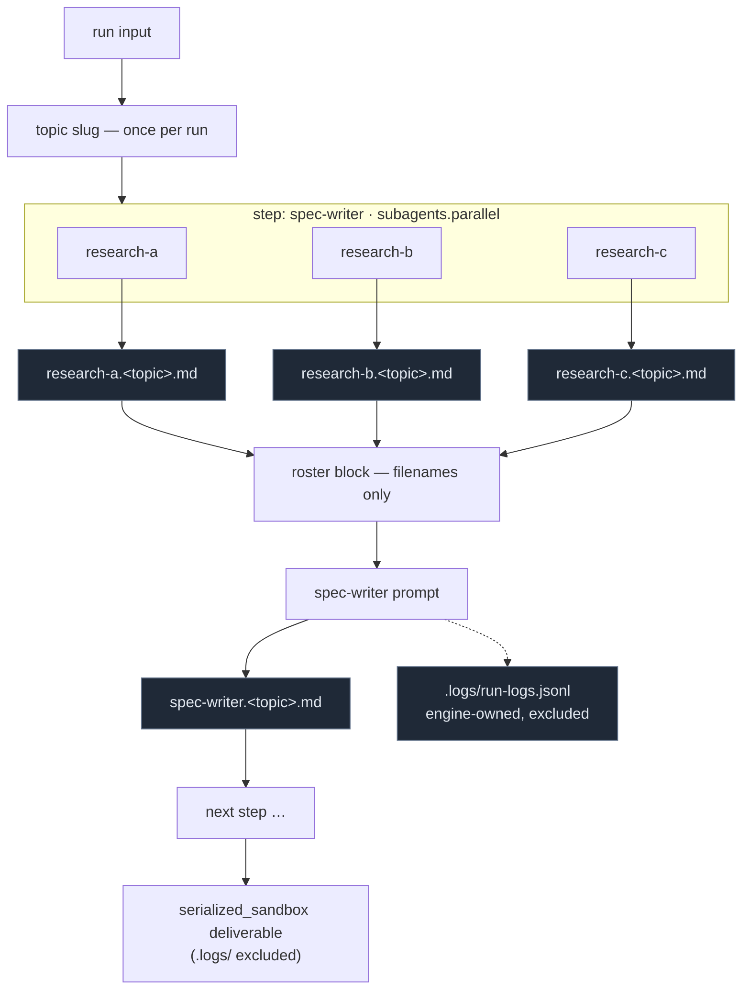

# Per-Agent Skills & Composable Custom Agents — Design

**Date:** 2026-08-10
**Status:** Approved for planning
**Supersedes/extends:** spec 011 (native deepagents skills, run-level attach)

## Problem

Skills attach at the *run* level: one `attached_skills` list is staged into the sandbox and
advertised to every agent in the workflow. There is no way to say "the research agent uses
these two skills and the writer uses none". Custom workflows are also limited to a flat
chain of pre-built agents — a user cannot add a blank agent, name it, give it a purpose, and
reuse it several times, and there is no way to express "this agent has three researchers
under it that run in parallel first".

This design makes skills a per-agent property, introduces a reusable blank custom agent, and
adds a bounded sub-agent tree with declarative execution strategies.

## Goals

1. Skills attach per agent, on any step of any workflow.
2. A blank `custom-agent` usable many times in one workflow, renameable, with its own prompt
   and skills, persisted for later runs.
3. A custom agent can be a top-level step or a sub-agent under another step.
4. A step may own a group of sub-agents executed by the engine under a declared strategy
   (parallel / sequential / fan-out).
5. Custom workflows serialize to the same `workflow.yaml` shape as built-ins, stored the way
   user workflows are stored today.
6. The canvas shows the parent → sub-agent tree.
7. Skills carry a `compatible_agents` list again.
8. Every agent has sandbox read + write.
9. An internet capability switch exists in the manifest and UI (provider stubbed).
10. Custom agents get a baked prompt preamble that points them at their skills and at the
    filename for their deliverable.
11. Each agent writes its artifact under a name derived from its own instance id.

## Non-goals

- A real internet provider (search API, key management, egress policy) — separate spec.
- Nesting deeper than two levels of sub-agents.
- LLM-driven delegation via deepagents' `subagents=` / `task` tool. Execution stays
  engine-orchestrated and deterministic; `subagents=None` in `deep_agent_runner.py` is unchanged.
- Any per-user filesystem state (no generated `AGENT.md` or `workflow.yaml` files on disk).

## Architecture

### 1. Manifest schema

Step-level additions, legal on any step in any workflow:

```yaml
steps:
- agent: custom-agent          # base agent id; built-in ids remain valid here
  instance_id: research-a      # stable slug, unique workflow-wide, immutable once created
  name: Research A             # display label, freely renameable
  prompt: |                    # per-instance purpose text (custom agents only)
    Research the competitive landscape for the topic.
  skills: [market-research, competitive-landscape-analysis]
  strategy: single_shot
  subagents:                   # this node's child group
    mode: parallel             # parallel | sequential | fanout
    max_parallel: 3            # default 3; parallel/fanout only
    task_source: {...}         # required when mode: fanout, same shape as fanout_batch today
    steps: [ ... same step shape, one further level permitted ... ]
```

Top-level addition:

```yaml
capabilities:
  internet: false
```

New keys added to the manifest allow-lists: top-level `capabilities`; step-level
`instance_id`, `name`, `prompt`, `skills`, `subagents`. Strict-key rejection is preserved —
manifests stay pure data, and no control-flow construct (`when` / `if` / `for` / `${...}`)
gains a home (INV-5).

**Validation rules** (each error names the offending field):

- `instance_id` matches `^[a-z0-9][a-z0-9-]*$` and is unique across the entire workflow,
  including nested `subagents.steps`.
- `subagents` nesting deeper than two levels is rejected.
- `subagents.mode` ∈ {parallel, sequential, fanout}; `task_source` required iff `fanout`.
- `skills` entries must resolve in the skills catalog at compile time.
- `prompt` is only meaningful on `custom-agent` steps; present on a built-in step it is a
  validation error. Built-in steps keep their existing prompt-override mechanism
  (`app/agents/prompt_overrides.py` + the composer's Custom Prompt panel), untouched by this
  design — there must be exactly one way to override a built-in agent's prompt.

Defaults keep every existing manifest byte-identical: absent `subagents`/`skills`/
`capabilities` behave exactly as today.

### 2. The custom agent

One new file on disk: `backend/agents/prompts/custom-agent/AGENT.md`. Role-neutral,
carrying only the baked preamble. Every canvas node is an *instance* of it; identity,
naming, prompt and skills live in the stored manifest. No per-user prompt directories.

`instance_id` is generated once from the name at node-creation time and never changes, so
renaming a node does not rename its artifacts or break a parent's roster.

### 3. Prompt assembly

Composition order for any step:

1. **Skill directive** — emitted for *any* agent (built-in or custom) with a non-empty
   `skills` list. A single line at the very top:
   `Skills available at /skills/<id>/SKILL.md: <names>. Read the relevant ones and follow them before you begin.`
2. **Custom preamble** — custom agents only. Role-neutral: use your sandbox tools; write
   your deliverable to `<instance_id>.<topic>.md`.
3. **User's per-instance prompt** — verbatim from the manifest.
4. **Sub-agent roster** — engine-generated, only when the node has children. Lists each
   child's display name and the exact file it produced. Never hand-authored, so it cannot
   go stale when a child is renamed, added, or removed.
5. Existing composition (guardrails, context providers, model policy) unchanged.

`<topic>` is a single kebab-case slug derived from the run input (lowercased, non-alphanumerics
collapsed to `-`, truncated to 40 chars), computed once per run and shared by every agent.

### 4. Execution

Children execute **before** their parent. The parent then reads their artifacts from the
sandbox; only filenames enter its context, never file contents.

- `parallel` — declared children run concurrently, bounded by `max_parallel`.
- `sequential` — declaration order; each child sees prior siblings' artifacts.
- `fanout` — one child template cloned per task from `task_source`; a thin adapter over the
  existing `execution_engine/fanout.py`, not a second implementation.

Grandchildren resolve depth-first before their own parent. A node with `subagents` becomes a
scheduling unit at compile time: `[children under mode] → parent`.

**Artifact safety net.** After a custom agent's step completes, the engine checks that
`<instance_id>.<topic>.md` exists. If it does not, the engine writes the agent's streamed
text to that path and emits an `artifact_fallback` event. The engine never assumes the model
complied with the preamble, and makes no assumption about which model backs a run.

### 5. Sandbox, logs, internet

**Filesystem.** Read + write are bound for every agent — custom, built-in, and new —
regardless of declaration. `read_files` / `write_files` remain in the step schema for
readability but no longer gate anything, so existing manifests load byte-identically.
`exec` stays opt-in and declared. This also removes the D-02 failure mode where a
text-only agent's `write_file` call silently produced an empty deliverable.

**Run log.** The engine writes `.logs/run-logs.jsonl` into the run sandbox: one JSON line
per event — step start/end, agent id and instance id, model, token counts, tool calls, skill
activation, artifact writes, errors, `artifact_fallback`. Engine-owned; agents have no
append tool and never write to it. The `serialized_sandbox` deliverable filters the `.logs/`
prefix out of the delivered artifact tree.

**Internet.** `capabilities.internet` (default `false`) plus a workflow-level UI toggle plus
a registered `tool/internet` provider. When enabled the provider binds `web_search` and
`web_fetch` stubs that return `"internet access is not yet available."` The switch, manifest
field, UI, and engine plumbing land here; the real provider does not.

### 6. Persistence

`workflows.manifest_json` remains the source of truth for user-built workflows — the same
storage used today. `agents/workflows/manifest.py` grows a public
`build_manifest_from_dict(data, source_label)` so DB-stored and file-backed manifests pass
through the *identical* validator and compiler; `load_manifest()` becomes a thin file-reading
wrapper over it.

`GET /api/user-workflows/{id}/workflow.yaml` renders the stored manifest as YAML for viewing
and download.

**Migration.** The existing `workflows.attached_skills` column becomes a one-time migration
source: on first read of a saved workflow, its skills fan out to every step's `skills` list
inside `manifest_json`, after which the per-step form is authoritative. The column is
retained but no longer read at launch. `backend/agents/workflows/custom/workflow.yaml` and
its nine built-in agents are untouched — the canvas builder is additive.

### 7. Skills catalog: `compatible_agents`

The field returns to skill frontmatter, the catalog loader, the API response, and the picker
filter — partially reverting commit `9b93a0d5`. All 182 skill files are re-authored with a
`compatible_agents` list.

Two constraints on how that pass is done, because it is the largest and least verifiable
piece of this work:

- The lists are derived by script from each skill's own name and description, then reviewed
  by category, not hand-authored file by file.
- **Absent means compatible with everything.** A file missed by the pass degrades to today's
  behavior (offered everywhere), never to an invisible filter that silently hides a skill.

Custom agents have no stable registry id and are therefore unrestricted: any skill may be
attached to any custom agent. `compatible_agents` filters the picker for built-in agents only,
and is a filter/sort hint in the UI — not a server-side rejection.

### 8. UI

- **Canvas** (`frontend/src/components/workflow/composer/CanvasView.tsx`, `CanvasNode.tsx`):
  tree layout — a node owning children renders them below itself with connectors, plus an
  "add sub-agent" affordance and inline rename.
- **Config rail** (`CanvasConfigRail.tsx`): per-agent Skills picker, per-agent prompt editor,
  and — when the selected node has children — a strategy selector (Parallel / Sequential /
  Fan-out) with a max-parallel control.
- **Workflow config card:** the internet toggle.
- **Skills catalog:** `compatible_agents` displayed and used to filter the per-agent picker.

## Data flow



## Error handling

| Condition | Behavior |
|---|---|
| Duplicate `instance_id` | Manifest validation error naming the field; workflow will not compile. |
| `subagents` nested 3 deep | Manifest validation error naming the field. |
| `skills` entry not in catalog | Compile-time error naming the skill id and the step. |
| Skill staging fails for one skill | Existing behavior preserved: logged to errors, other skills still stage, run continues. |
| Custom agent produces no artifact | Engine writes the streamed text to the expected path, emits `artifact_fallback`. |
| Child step fails | Existing step-failure semantics (gates / retry) apply per child; a failed child's artifact is simply absent from the parent's roster. |
| `internet: true` with stub provider | Tools bind and return `"internet access is not yet available."` — never a hard run failure. |
| Legacy saved workflow with `attached_skills` | Migrated on read to per-step `skills`; run behavior is unchanged for that workflow. |

## Testing

- **Manifest:** validator tests for each new field and each rejection rule; golden
  round-trip proving existing manifests parse byte-identically with the extended schema.
- **Compiler:** a node with `subagents` compiles to the expected `[children → parent]`
  scheduling unit for each of the three modes, including a two-level case.
- **Prompt assembly:** snapshot tests for the five-part order, including the
  skills-directive-only case on a built-in agent and the roster block after a rename.
- **Execution:** parallel bounded by `max_parallel`; sequential ordering; fan-out cloning
  from a `task_source`; children complete before the parent starts.
- **Artifact naming + fallback:** artifact written under `<instance_id>.<topic>.md`; a
  no-write agent triggers `artifact_fallback` with the streamed text.
- **Sandbox:** every agent, including a previously text-only one, can write a file that
  survives into the deliverable.
- **Logs:** `.logs/run-logs.jsonl` contains one line per lifecycle event and is excluded
  from `serialized_sandbox`.
- **Persistence:** DB manifest → `build_manifest_from_dict` → compiler produces the same
  compiled workflow as the equivalent file-backed YAML; the YAML export endpoint round-trips.
- **Migration:** a saved workflow with `attached_skills` yields per-step skills on every step.
- **Catalog:** `compatible_agents` parses, serializes, filters the picker for built-ins, and
  an absent value means compatible-with-all.
- **Frontend:** canvas renders a parent with children and a grandchild; strategy selector
  writes through to the manifest; per-agent skill picker persists.

## Risks

1. **The 182-file `compatible_agents` pass** is high-volume and hard to verify. Mitigated by
   scripted derivation, category review, and absent-means-all as the failure mode.
2. **Fan-out overlap** between the new child group and the existing `fanout_batch` step
   strategy. Mitigated by implementing the child-group case as an adapter over
   `execution_engine/fanout.py` rather than a parallel implementation.
3. **Universal read/write** changes the tool set every agent sees, which previously altered
   `exclude_builtin` behavior and destabilized small local models (C-01). Verify the
   hello_html Ollama path still completes after the change.
4. **Schema growth** in a strict-key manifest touches the golden characterization snapshots.
   Every new field defaults to inert so the goldens must remain byte-identical — never
   re-baseline them to make a test pass.
