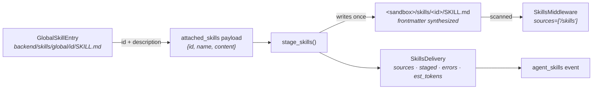

# Data Model: Native `deepagents` Skills

**No database migration.** Every structure below is either an on-disk file, an in-process
dataclass, or an existing JSON payload whose shape is unchanged.

---

## 1. Entities

### 1.1 `SKILL.md` — catalog entry (on disk, `backend/skills/global/<id>/SKILL.md`)

| Field | After this change | Notes |
|---|---|---|
| `name` | **required**, must equal `<id>` (the directory name) | already true for all 202 |
| `description` | **required**, ≤ **200 chars** (R-13) | hard library limit is 1,024 with *silent* truncation; 42 files exceed 200 today, 1 exceeds 1,024 |
| `display_name` | kept | UI label |
| `category`, `tags`, `isBeta` | kept | UI filters |
| `compatible_agents` | **removed** (R-12) | 13/202 populated; the routing idea it encoded is retired |
| `source`, `sourceLabel` | **removed** (R-11) | 154 files; provenance |
| body | kept, sanitized | no identity assertion (R-08); no direction to unavailable tools (R-09); no foreign AI-tooling references (R-11). Technical subject matter is untouched |

`hooks/global/*` keep their own `compatible_agents` — different field, different owner
(`app/agents/hooks_catalog.py:41`), explicitly out of scope.

### 1.2 `GlobalSkillEntry` (`backend/app/agents/skills_catalog.py`)

```diff
 @dataclass
 class GlobalSkillEntry:
     id: str; name: str; display_name: str; description: str
     content: str; isBeta: bool; category: str = ""
-    compatible_agents: list[str] = field(default_factory=list)
     tags: list[str] = field(default_factory=list)
```

`content` remains the **body only** (frontmatter stripped by `frontmatter.loads`) — the fact that
forces frontmatter synthesis at staging time.

### 1.3 `attached_skills` payload (unchanged shape, one field dropped)

Sent by `useWorkflow.ts`, accepted by `run_commands.py:1460`, persisted on the workflow row
(`user_workflows.py`):

```jsonc
{ "id": "poet", "name": "poet", "content": "<body>" }   // `compatible_agents` removed (R-12)
```

Dropping the field is backward-compatible in both directions: the backend ignores unknown keys, and
persisted rows carrying `compatible_agents: []` stay readable. **No migration.**

### 1.4 `SkillsDelivery` (new, `backend/app/agents/skill_staging.py`)

```python
@dataclass(frozen=True)
class SkillsDelivery:
    sources: list[str]   # ["/skills"] when anything staged, else []
    staged: list[str]    # skill ids actually written
    errors: list[str]    # synthesis/write failures, plus deepagents skills_load_errors
    est_tokens: int      # 464 + 66 * len(staged) — advisory (R-16)
```

Ids only: the event already carries names from the attached payload, so a second per-skill record
would just be a copy that can drift.

`sources == []` ⇒ no `SkillsMiddleware`, no tool-set change, no prompt change (R-04).

### 1.5 `AgentContext` (`backend/agents/factory.py:30` — **not** `execution_engine/context.py`, which is the engine's `ectx`)

```diff
 attached_skills: list[dict]          # run-attached; now staged, never injected
+disk_skill: str | None = None        # per-user per-agent SKILL.md — still injected eagerly (D6)
+skills_delivery: SkillsDelivery | None = None   # written by create_runner, read by the engine
```

### 1.6 Staged file (new, inside the run sandbox)

```
<sandbox.root>/skills/<id>/SKILL.md
---
name: <id>
description: <≤1024, normally ≤200>
---
<body>
```

`<sandbox.root>` is the shared per-run dir, or a fan-out worker's isolated `_ChildSandbox` root.
POSIX `/skills` resolves there via `FilesystemBackend(virtual_mode=True)`.

---

## 2. Relationships



Read it as: one catalog entry → **at most one** staged file per run sandbox → advertised to
**every** agent in the run.

One catalog entry → 0..1 staged file per run sandbox → advertised to **every** agent in the run.
No per-agent edge exists anywhere in this graph — that is R-01 expressed structurally.

---

## 3. Validation rules

| Rule | Where | On failure |
|---|---|---|
| `name` == directory id | `stage_skills` (synthesis sets it) | n/a — cannot diverge |
| `description` non-empty | `stage_skills` | synthesize `"<name> skill."`, record in `errors` |
| `description` ≤ 1,024 | `stage_skills` | clamp, record in `errors` (the library truncates silently; we do not) |
| body non-empty | `stage_skills` | skip the skill, record in `errors` — never write a bodyless file |
| target path inside sandbox | `RunSandbox.path_for` | raise; a payload `id` is caller-controlled and must never escape |
| catalog: `description` ≤ 200 | `skills_audit.py` / hygiene test | build gate (acceptance 8) |
| catalog: no `compatible_agents`/`source`/`sourceLabel` | same | build gate (acceptance 7) |
| catalog: no identity opening, no `execute` direction | same | build gate (acceptance 9) |

---

## 4. Migrations

**Database**: none.

**On-disk catalog**: a one-time edit of 202 `SKILL.md` files (plan Phase 5) — field removal is
scripted, description and body rewrites are by hand. `list_global_skills()` must still return 202
afterwards (acceptance 7); the count is the guard against an edit that breaks parsing.

**Runtime state**: staged skill directories live inside the run sandbox and are removed with it by
`RunSandbox.cleanup()`. Resumed runs reuse whatever is already staged, and `deepagents` caches
`skills_metadata` per thread (`skills.py:941-985`), so a run stays internally consistent even if the
catalog changes mid-flight — accepted and documented (C-06).
