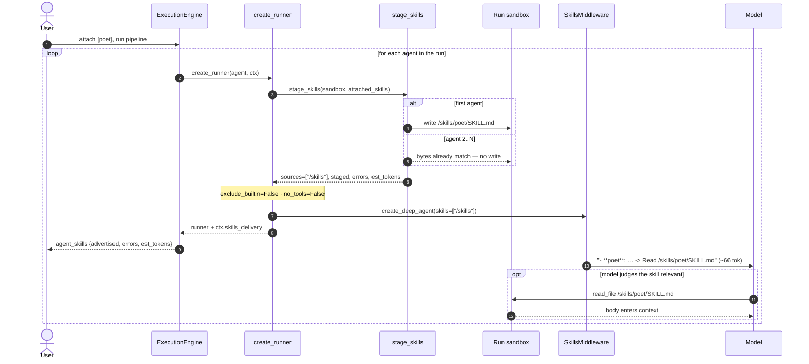
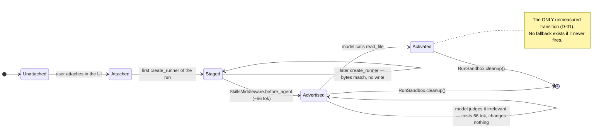

# Execution Design: Native `deepagents` Skills

**Spec**: [`spec.md`](spec.md)
**Plan**: [`plan.md`](plan.md)
**Created**: 2026-08-10
**Status**: Designed

---

## 0. Design premise

Everything here follows from one property: **we stop deciding, and start advertising**.

Today VELOCITY decides — per agent, at prompt-assembly time — which skill bodies a model will see,
and pays ~1,900 tokens for each decision whether or not the skill is relevant. After this change the
run decides what is *available*, and the model decides what to *open*. That single inversion
dictates the component boundaries (§2): a **stager** that puts files where the library expects them,
a **library** that advertises them, and a **model** that reads them. Nothing in between routes,
scopes, or filters.

Two second-order constraints shape the rest:

- **Silence is the enemy.** Progressive disclosure has three silent failure points — a skill that
  doesn't parse, a skill that parses but is never read, and a directory the middleware never scans.
  None of them raise. §5 and §6 exist to convert each one into something visible.
- **Absence must be exact.** A run with no attached skills must produce a *byte-identical* system
  prompt for all 87 agents across 15 pipelines. That makes "do nothing" a first-class code path,
  not a fall-through — it is asserted, not assumed (Slice 0).

---

## 1. Build Slices

Seven slices. Each is independently verifiable; each states what makes it done. Slices 0–1 remove
the old mechanism, 2–3 install the new one, 4–5 make it visible and clean the catalog, 6 measures
whether the premise actually holds.

### Slice 0 — Foundation: pin what must not move

**Goal**: create the oracle for R-04 before touching anything that could break it.

Add two characterization goldens under `backend/tests/agents/characterization/`:

| Golden | Fixture | Guards |
|---|---|---|
| `text_only_no_skills` | a `tools: []` agent (`user_stories` family), nothing attached | `_NO_TOOLS_PREAMBLE` present · no skills block · exact bytes |
| `disk_skill_only` | same agent, `ectx.disk_skills` populated, nothing attached | the `=== SKILLS ===` / `--- SKILL UNKNOWN ---` render survives Slice 1 verbatim |

The existing five characterization snapshots are **not** re-baselined, now or later.

**Done when**: both goldens committed and passing against unmodified `main`.

**Why first and alone**: every later slice edits the prompt-composition path. A regression caught
against a golden written *after* the edit proves nothing.

---

### Slice 1 — Deletion, and the disk-skill rescue

**Goal**: remove eager injection and per-agent scoping without taking `ectx.disk_skills` with them.

- Delete `_filter_skills_for_agent` (`factory.py:286-315`) and its import in `engine.py:3459`.
- Delete the attached-skills `blocks["skills"]` branch (`factory.py:391-417`).
- Add `AgentContext.disk_skill: str | None`.
- `engine.py:3451-3456` stops merging the disk skill into `merged_skills`; it sets `ctx.disk_skill`.
- `factory` renders **only** `ctx.disk_skill` through the existing block-render code, unchanged —
  same header, same `--- SKILL UNKNOWN ---` framing the nameless disk entry produces today.

`extract_ui_skill_blocks` survives: it still feeds the disk-skill render and is asserted by
`test_guardrails.py:298`. It is not orphaned by this change.

**Done when**: both Slice-0 goldens byte-identical · `pytest tests/agents/` green · no reference to
`compatible_agents` remains in `backend/agents/`.

**Risk note**: this is the highest-blast-radius edit in the feature — it touches the composition
path for all 87 agents. It ships alone, with no new behaviour riding along.

---

### Slice 2 — Core logic: `skill_staging.py`

**Goal**: turn an attached-skill payload into files the `deepagents` scanner will find, idempotently.

New module `backend/app/agents/skill_staging.py`, pure and side-effect-scoped to one sandbox:

```python
stage_skills(sandbox, attached_skills) -> SkillsDelivery
```

1. Empty/absent payload ⇒ return the inert delivery **before** touching disk.
2. Resolve each payload `id` against `list_global_skills()` for its `description`.
3. Synthesize frontmatter (`name: <id>`, clamped `description`) + body. Never copy — the payload
   carries no frontmatter to copy.
4. Resolve the target through `RunSandbox.path_for` (traversal-proof; the `id` is caller-controlled).
5. Write only when the existing file's bytes differ (agents in a run are sequential and fan-out
   workers have separate sandboxes, so a plain `write_text` is enough — no temp-file dance).
6. Return `sources=["/skills"]`, the staged ids, accumulated errors, and `464 + 66 × n`.

Never raises on a bad skill: a bodyless, unresolvable or unwritable entry is skipped and recorded in
`.errors`.

**Done when**: `tests/unit/test_skill_staging.py` covers synthesis, clamping, idempotence
(byte-stable across two calls), traversal rejection, and the empty-payload short-circuit.

---

### Slice 3 — Integration: `create_runner` and the runner

**Goal**: wire staging into the one place that sees the effective sandbox, and let the library see it.

`factory.create_runner` re-orders to `sandbox → stage → tools → prompt` (plan D3):

```
sandbox   = run_sandbox or RunSandbox(ctx.user_id or "anon", ctx.run_id or "adhoc"); sandbox.ensure()
delivery  = stage_skills(sandbox, ctx.attached_skills);  ctx.skills_delivery = delivery
custom_tools, exclude_builtin = _resolve_runner_tools(spec, ctx)
if delivery.staged: exclude_builtin = False          # C-01 / R-05
no_tools  = exclude_builtin and not custom_tools     # ⇒ False whenever skills staged
system_prompt = _compose_system_prompt(spec, ctx, no_tools=no_tools)
```

`DeepAgentRunner` gains keyword-only `skills_sources: list[str] | None = None` → forwarded as
`create_deep_agent(skills=…)`. When set, the tool-filter exclusion becomes `{"task", "execute"}`.
Default `None` keeps `chat/concierge.py`, `handoff/coder.py` and `api/run_commands.py:2335`
constructing exactly as today.

**Done when**: acceptance 2–5 pass, and a no-skills run's constructed middleware list contains **no**
`SkillsMiddleware` — asserted directly, not inferred from the prompt.

---

### Slice 4 — Observability

**Goal**: make delivery, failure and cost all visible per agent.

- `AgentContext.skills_delivery` carries the result out of `create_runner`.
- The engine's `agent_skills` yield **moves after** `create_runner` (`engine.py:3562`) and gains
  `skills_load_errors` and `estimated_tokens`.
- A structured log line per agent: agent id, staged ids, error count, estimated tokens.
- `estimated_tokens > 8000` ⇒ `logger.warning`, run continues (C-05, R-16).
- Frontend: `AgentDetailPanel` shows the advertised set, any load errors, and the estimate; its copy
  changes from "injected" to **"advertised"** — the body no longer reaches the model unconditionally,
  and the UI must not imply otherwise.

**Done when**: acceptance 11 passes; a deliberately malformed staged skill surfaces in the event
rather than vanishing.

---

### Slice 5 — Catalog (202 files)

**Goal**: make every skill loadable, unscoped, unbranded, and cheap to advertise.

`backend/scripts/skills_audit.py` — one script, no modes: it prints every violation it finds, and
`--fix` performs only the two mechanical removals.

| Work | Volume | Method |
|---|---|---|
| Strip `compatible_agents` | 13 | scripted |
| Strip `source` / `sourceLabel` | 154 | scripted |
| Rewrite descriptions > 200 chars | 42 | **by hand** — "what it does + when to use it" |
| Remove identity openings | 3 | by hand |
| De-provenance bodies | ≈40 | by hand |
| Drop `GlobalSkillEntry.compatible_agents` | 1 file | last, after Slices 1 and 6 |

The `cursor` exclusion is encoded as a **test**, not a comment: every catalog hit is a CSS or
screen-reader cursor, and a future blind-regex reintroduction must fail CI.

**Done when**: `test_skills_catalog_hygiene.py` green and `list_global_skills()` still returns
**202** — the count is what catches an edit that broke parsing.

---

### Slice 6 — Frontend cleanup

`compatible_agents` leaves `store/api/skills.ts`, `hooks/useSkillsCatalog.ts`,
`hooks/useWorkflow.ts:88`, `types/index.ts`, the `LibraryPage` skill chips (`:272-276`) and the
`AgentsPopup` skill-suggestion filter (`:501`). **Hook** chips and the hook filter (`:380`, `:394`,
`:502`) stay — hooks own a separate `compatible_agents`.

**Done when**: `npx tsc --noEmit` shows no new errors; `LibraryPage.reskin.test.tsx` updated.

---

### Slice 7 — Live measurement (user-run)

`hello_html` + `poet`, frontier **and** Ollama `qwen3.5:4b`. Not a regression check — the first
data on whether the premise (§0) holds at all. Record the activation rate per model in
`build-summary.md`. A `qwen3.5:4b` failure is a finding, not a blocker: there is no fallback by
design (C-03).

---

## 2. Component Boundaries

| Component | Owns | Must not |
|---|---|---|
| `skill_staging.py` | Frontmatter synthesis · idempotent writes · token estimate | Know about agents, specs, prompts, or the engine |
| `factory.create_runner` | Sandbox resolution · calling the stager · tool-set and `no_tools` derivation | Filter skills per agent (R-01) · inject bodies (R-03) |
| `DeepAgentRunner` | Forwarding `skills_sources` · the tool exclusion set | Read the catalog · stage anything |
| `engine` | Attaching skills to the run · reporting delivery · setting `ctx.disk_skill` | Merge disk skills into `attached_skills` (Slice 1) · pre-judge relevance |
| `skills_catalog` | Parsing and caching the 202 entries | Carry per-agent routing metadata |
| `SkillsMiddleware` (library) | Scanning `/skills`, advertising two lines per skill | — (stock, unconfigured, C-08) |
| `skills_audit.py` | Catalog invariants | Blind-regex anything, especially `cursor` |

The important negative: **no component maps agent → skill.** That relation is deleted, not moved.

---

## 3. Flows

### 3.1 Run with skills attached



The `opt` block is the whole feature: nothing forces it, and **its rate is unmeasured** (D-01).
Staging is a no-op after the first agent, and the library caches `skills_metadata` per thread.

### 3.2 Run with nothing attached

`stage_skills` returns inert before touching disk → `skills_sources=None` → no `SkillsMiddleware`,
unchanged tool set, unchanged `no_tools`, **byte-identical prompt**. This is the common path and the
one Slice 0 pins.

### 3.3 Fan-out worker

`engine._isolated_run_sandbox` returns the worker's `_ChildSandbox`; `create_runner` stages into
*that* root. This is precisely why staging lives in the factory rather than once per run.

---

## 4. State Transitions



A resumed run re-enters at `advertised` from cached `skills_metadata`, not from a re-scan (C-06).

---

## 5. Failure Modes

| # | Failure | Today | After |
|---|---|---|---|
| F1 | Staged `SKILL.md` has no/invalid frontmatter | library drops it **silently** | cannot occur — frontmatter is synthesized (D2); any residual failure lands in `skills_load_errors` and the event |
| F2 | `description` > 1,024 | silently truncated | clamped by the stager, recorded in `.errors` |
| F3 | Skill staged at the source root instead of `<source>/<name>/SKILL.md` | never scanned, no error | layout is produced by one function, covered by a unit test |
| F4 | Model never calls `read_file` | n/a (bodies were injected) | **accepted, D-01** — measured in Slice 7, not mitigated |
| F5 | Text-only agent writes a file instead of streaming ⇒ empty deliverable | n/a | **D-02 — CONFIRMED 2026-08-10, unmitigated.** `tests/agents/test_skills_text_only_deliverable.py` proves the mechanism: a pure tool-call turn emits no `chunk` event, and the runner's no-delta fallback only fires when the end-of-turn message content is non-empty — which it is not. `ctx.last_streamed` is `""`, the run reports success, the deliverable is empty, and **nothing warns**. Whether a model actually does this is a live question (T21). See §5.1 |
| F6 | Agent edits its own staged skill mid-run | n/a | contained to the sandbox (D-03); re-normalised on the next construction |
| F7 | Stock preamble advertises `execute` / supporting files we don't provide | n/a | **D-04** — `execute` excluded at the tool filter, so the advertisement is inert |
| F8 | Disk-skill injection lost with the deleted block | — | Slice 1 + the `disk_skill_only` golden |
| F9 | Catalog edit breaks a `SKILL.md` parse | 202 → fewer, unnoticed | hygiene test asserts the count is still 202 |
| F10 | Wrong `deepagents` verified (0.7.5 under `/opt/homebrew`) | — | documented in `research.md` §1; verification uses the venv interpreter |
| F11 | Token cost balloons on a large attachment | — | warn at 8,000 tok/agent, **never** block (R-16) |

---

### 5.1 D-02 — confirmed mechanism, open decision

The scripted test settles the *mechanism* but not the *likelihood*. Granting `write_file` to 61
text-only agents creates a path where the deliverable silently vanishes; only a live run
(acceptance 6/12, T21) can say whether a model takes it.

Three responses, none yet chosen — this needs a human call:

| Option | Cost | Effect |
|---|---|---|
| **A — accept as-is** | none | Matches the spec: D-02 was accepted at clarification time. But "accepted" was decided when the failure was *theoretical*; it is now demonstrated |
| **B — make it loud** (recommended) | ~5 lines in the engine | When streamed output is empty *and* the agent wrote files this turn, log a warning and surface it on the agent event. Converts a silent empty deliverable into a visible one. Consistent with R-15, which exists precisely because silence is this design's dominant failure mode |
| **C — fall back to sandbox files** | larger | Resolve the deliverable from files written this turn when the stream is empty. Genuinely fixes it, but changes deliverable resolution — out of scope for this spec, and it would mask the behaviour rather than reveal it |

Recommendation: **B**. It does not change what a run produces, so it cannot break parity; it only
removes the silence. C should be a follow-up spec if T21 shows the failure is common.

---

### 5.2 C-01 tool-set inflation — SUSPECTED, A/B pending

First live `hello_html` run (2026-08-10 14:16, `qwen3.5:4b`, `poet` attached) was **degenerate**:
all three agents ignored their `AGENT.md` and asked the user to clarify "river"; **no agent called
any tool**, including its own `random_word` / `coin_flip`.

Staging itself worked — `runs/<user>/<run>/skills/poet/SKILL.md` was written correctly and all
three agents advertised the skill (R-01 confirmed live). But activation could not be measured:
the poet skill only applies "when `coin_flip` returned true", and `coin_flip` never ran.

**Suspected cause — our own C-01 override.** The `hello_html` tool providers deliberately return
`exclude_builtin=True` ("the model sees exactly the one toy tool and none of the native fs/todo
tools"). `create_runner` now overrides that whenever skills are staged, so `emoji-picker` went from
**1 bound tool to 8**, plus the stock skills preamble — on a 4B model.

If confirmed, this is a cost C-01 did not anticipate: the clarification weighed "can the agent carry
out a skill?" and never asked "does handing it 7 more tools break the task it already had?". It is
distinct from D-02 — not a lost deliverable, but degraded instruction-following.

**A/B to confirm** (control first, both on the same model):

```bash
cd tools/api/runs
NO_SKILL=1 ./run-http.sh hello_html    # control — no skill, providers' exclude_builtin=True stands
./run-http.sh hello_html               # treatment — skill staged, full fs tool set granted
```

Control healthy + treatment degenerate ⇒ confirmed. Both degenerate ⇒ the cause is elsewhere
(model capability, prompt, or Ollama routing) and C-01 is exonerated.

If confirmed, the narrow fix is to scope the tool grant: grant the fs set only to agents that would
otherwise have **no** tools (the C-01 motivation — an agent that cannot read cannot use a skill),
rather than overriding providers that deliberately restrict their tool set. That keeps R-05 intact
for the 61 text-only agents without inflating the 26 that already have a curated set.

---

## 6. Observability Hooks

| Signal | Where | Content |
|---|---|---|
| `agent_skills` SSE | per agent, after construction | advertised set · `skills_load_errors` · `estimated_tokens` |
| Structured log (INFO) | `create_runner` | agent id · staged ids · error count · est tokens |
| Log (WARNING) | `create_runner` | est tokens > 8,000 |
| Log (WARNING) | `stage_skills` | per skipped/clamped skill, with reason |
| UI | `AgentDetailPanel` | advertised skills, errors, cost — labelled **advertised**, not injected |
| CI | `test_skills_catalog_hygiene.py` | acceptance 7–10 as a continuous gate |
| Manual | `build-summary.md` | Slice 7 activation rates, per model |

R-15's point in one line: *the dominant failure of a progressive-disclosure system is a skill quietly
not attaching* — so every path that drops a skill writes to one of the rows above.

---

## 7. Rollback Notes

- **No feature flag** (C-03). Rollback is `git revert`, deliberately.
- The runtime change (Slices 1–4) and the catalog change (Slice 5) are **separate commit ranges** and
  revert independently — reverting the catalog does not un-stage anything, and reverting the runtime
  leaves a sanitized catalog that still loads.
- Slice 1 is the only irreversible-feeling edit; the two Slice-0 goldens make its revert verifiable
  rather than hopeful.
- **No database migration**, so nothing to roll back there. Persisted `attached_skills` rows carrying
  `compatible_agents` stay readable in both directions.
- On-disk staged skills live inside the run sandbox and vanish with `RunSandbox.cleanup()`; manual
  cleanup is `rm -rf <RUNS_ROOT>/<user>/<run>/skills`.
- `deepagents` stays pinned at **0.6.7**; no dependency change to unwind.
