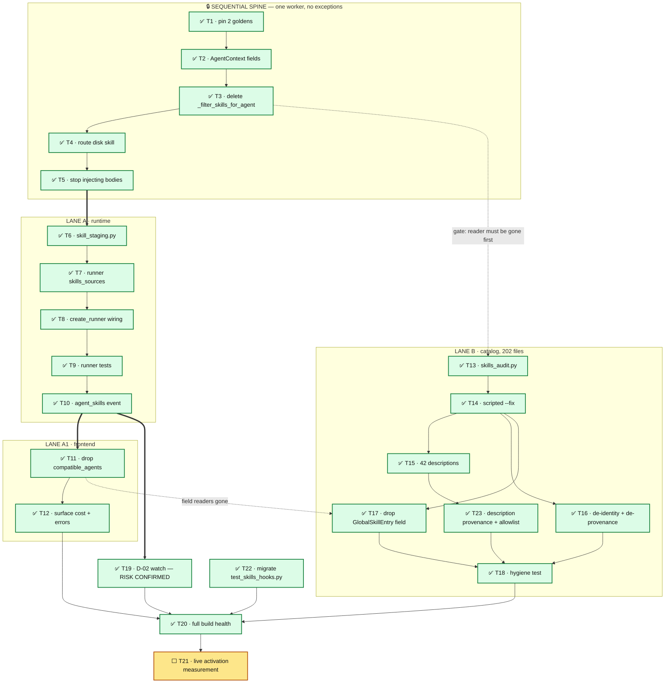

# Tasks: Native `deepagents` Skills

**Spec**: [`spec.md`](spec.md) · **Plan**: [`plan.md`](plan.md) · **Design**: [`design.md`](design.md)

---

## How to execute these

Every task names its files, its exact anchors, and one command that proves it. Run all commands
from `backend/` with the **project venv** active:

```bash
source ../venv/bin/activate     # NOT a bare python3 — that resolves deepagents 0.7.5, wrong version
source ~/.zshrc                 # provider keys, for anything that reaches a model
```

**Rules for every task**

1. Change only what the task names. Do not tidy adjacent code, comments, or imports you did not orphan.
2. If the verify command fails, stop and report — do not "fix" a golden by re-baselining it.
3. Never edit files under `tests/agents/characterization/` except in T1.
4. If a task's anchor text is not found verbatim, stop and report. Do not guess a nearby line.
5. **Never run a state-changing git command.** No `git stash`, `git checkout -- …`, `git reset`,
   `git clean`, `git restore`. Read-only git (`git diff`, `git status`, `git show`) is fine.
   *This rule was written after an incident: a delegate ran a bare `git stash` at repo root to get
   a clean baseline for a golden comparison, and swept 218 files of unrelated in-flight work —
   including the user's own uncommitted edits. The tree is shared by concurrent agents and by the
   user; it is never yours to reset.* If a task seems to need a clean tree, stop and say so.

**Delegation**: `[haiku]` = mechanical, fully specified. `[human]` = needs judgment; do not delegate.

---

## Execution graph — what is sequential, what is parallel

**Status as of 2026-08-10 20:00 CEST — SPEC CLOSED.** **22 done · 1 pending (T21, user's live run).**
> ✅ **D-02 CLOSED 2026-08-10 — superseded, not fixed here.** T19 confirmed the mechanism: a
> text-only agent that writes instead of streaming yields a **silently empty deliverable**.
> It is not fixed in 011 by decision. [Spec 012](../012-per-agent-skills-custom-agents/spec.md)
> **R-22** grants filesystem read+write to *every* agent unconditionally, which removes the
> text-only class the defect depends on, and **R-20** adds an engine-side artifact check that
> writes the streamed text to the expected path when an agent produces no file. Between them
> the mechanism has nowhere left to occur. Any warning added here would be dead code the day
> 012 lands. The open decision in [design.md §5.1](design.md) is therefore resolved as
> **"superseded by 012"**.
> ⬜ **T21 remains the user's live run** and is the only unfinished item in this spec.
> ⚠️ **Incident 13:00 — root cause found.** The T4b/T5 delegate ran a bare `git stash` at repo
> root to get a clean baseline for a golden comparison, sweeping 218 files including the user's
> own uncommitted work. Recovered from `stash@{0}`; nothing lost permanently. Rule 5 above now
> forbids state-changing git in any task.
Node prefixes: ✅ done · 🔄 in progress · ⬜ pending.



**Legend** — green = done · blue = in progress · grey dashed = pending · amber = `[human]`,
not delegable · dotted edge = a gate that exists for a *correctness* reason rather than a code
dependency (both explained below).

### Status detail

| Task | State | Note |
|---|---|---|
| T1 | ✅ done | 2 goldens committed; `prompt_disk_skill_only.txt` (3,535 B) is the D6 oracle |
| T2 | ✅ done | `disk_skill`, `skills_delivery` on `AgentContext` (`factory.py:30`) |
| T3 | ✅ done | `_filter_skills_for_agent` gone from factory + engine import |
| T4 | ✅ done | engine sets `ctx.disk_skill`, stops merging into `attached_skills` |
| T5 | ✅ done | attached bodies no longer injected; **goldens still byte-identical** |
| T6 | ✅ done | `skill_staging.py` (105 lines) · 9 unit tests · id validated `^[A-Za-z0-9._-]+$` and YAML-quoted after review |
| T7 | ✅ done | `skills_sources` → `create_deep_agent(skills=…)`; `execute` excluded when staged |
| T8 | ✅ done | sandbox→stage→tools→prompt re-order; `skills_sources` passed; goldens byte-identical |
| T9 | ✅ done | 7 cases, 16 pass; proves middleware-absent by spying `create_deep_agent(skills=None)` at its single call site |
| T10 | ✅ done | yield moved after `create_runner` (same `try:` context), `skills_load_errors` + `estimated_tokens` added, 8k warn is advisory; 49 tests pass |
| T11 | ✅ done | 8 files; hooks' own `compatible_agents` untouched; `tsc` clean (only pre-existing testing-library errors). Note: `src/data/skills.ts` is fully commented-out dead code — left alone |
| T12 | ✅ done | "Advertised skills" + `~N tok` pill; load-error banner sits **outside** the collapse gate so a silent failure is visible; no new `tsc` errors |
| T13 | ✅ done | `scripts/skills_audit.py`; `cursor` excluded by design |
| T14 | ✅ done | **redone after a failure** — first `fix()` used `frontmatter.dumps` and reformatted all 202 files; rewritten line-surgical, verified 510 removals / **0 additions** |
| T15 | ✅ done | 42 rewritten to "what + when"; verified 0 over 200, 0 empty, 202 load; +42/-714 diff |
| T16 | ✅ done | 37 files; 4 remaining hits are genuine subject matter (`from anthropic import …` in a runnable sample, `jest.mock('@/lib/openai')`) |
| T17 | ✅ done | field gone from dataclass **and** API payload (`asdict`); 202 entries; 21 tests pass |
| T18 | ✅ done | 6 gates pass, imports `audit()` (no duplicated logic); pins the `cursor` exclusion and requires a reason on every allowlist entry |
| T19 | ✅ done | **Finding: D-02 is real.** No `chunk` event on a pure tool-call turn; no-delta fallback needs non-empty end-message content, which is empty ⇒ `last_streamed == ""`, run "succeeds", nothing warns. 2 tests |
| T20 | ✅ done | **Zero regressions.** current 167F/2682P vs `HEAD` 151F/2671P; all 151 pre-existing failures identical. The 16-test delta is order-dependent tests flipped by our 4 new test files — all 16 pass in isolation in **both** trees. Feature suite 57/57; `import app.main` OK; 0 new `tsc` errors |
| T21 | ⬜ pending | **user runs this** — live activation, frontier + `qwen3.5:4b` |
| T23 | ✅ done | **new** — audit now checks descriptions too; 5 rewritten, `agent-eval` ruled subject matter (it compares coding agents by name); 5-entry allowlist, suppression printed loudly; **0 violations** |
| T22 | ✅ done | **new, not in the original plan** — 8 tests asserted the retired contract; inverted/rewritten/deleted, 24 pass, no weakened assertions; added the D6 independence test |

### Sequential — no way around it

| Chain | Why |
|---|---|
| **T1 → T2 → T3 → T4 → T5** | All five edit `factory.py` / `engine.py` at overlapping lines, and T1's `disk_skill_only` golden must exist *before* T3–T5 delete the injection path — it is the only thing that catches R-03 silently killing `ectx.disk_skills` |
| **T6 → T7 → T8** | T8 imports what T6 creates and passes what T7 accepts |
| **T13 → T14** | T14 runs the script T13 writes |
| **T11 → T17** | Drop the backend dataclass field only after the frontend has stopped reading it |
| **T15/T16/T17 → T18** | The hygiene test asserts *zero* violations; it cannot pass until the hand edits land |

### Parallel — safe to run at the same time

| Once… | These can run concurrently | Touches |
|---|---|---|
| **T3 lands** | **Lane B** (T13 → T14 …) starts | `skills/global/*`, `scripts/` — no overlap with the runtime files. Gate is T3, not T5: `--fix` strips `compatible_agents` from disk, so the reader (`_filter_skills_for_agent`) must be gone first, or the filter silently becomes a no-op while old code is still live |
| **T5 lands** | **Lane A** (T6 → … → T10) starts | `skill_staging.py`, `deep_agent_runner.py`, `create_runner` |
| **T14 lands** | **T15**, **T16**, **T17** — three workers | T15/T16 are disjoint edits (frontmatter vs body) but touch the same files: assign **by file range**, not by concern, or they will collide |
| **T10 lands** | **Lane A1** (T11 → T12) and **T19** | frontend TS vs backend test — disjoint |

### Practical scheduling

- **2 workers** is the sweet spot: one on the spine → Lane A → A1, one on Lane B from T3.
- **4 workers** peaks briefly after T14 (T15, T16, T17 + Lane A continuing) — but T15/T16 are `[human]`, so this is really 2 delegates + you.
- **Everything converges at T20.** T20 needs T12, T18 and T19 all green; it re-runs the full suite against the baseline recorded before T1.
- **Never parallelise inside the spine.** Two workers editing `factory.py` at once will produce a merge that passes tests and loses a comment block.

---

## Task T1 — Pin two characterization goldens `[haiku]`

**Phase**: 0 · **Depends on**: none · **Traces to**: R-04, acceptance 1

### Description
Follow the existing pattern in `backend/tests/agents/characterization/` (read one existing test
first, copy its structure). Add snapshots of the composed system prompt for one `tools: []` agent:

- `text_only_no_skills` — `AgentContext(attached_skills=[])`
- `disk_skill_only` — `AgentContext(attached_skills=[{"content": "DISK SKILL BODY"}])`
  (this mimics today's engine merge at `engine.py:3453-3456`)

Call `agents.factory._compose_system_prompt(spec, ctx, no_tools=True)` and snapshot the exact bytes.

### Acceptance
- [ ] Both goldens pass against **unmodified** code
- [ ] The 5 existing characterization snapshots are untouched

### Verify
```bash
pytest tests/agents/characterization -q
```

---

## Task T2 — Add two `AgentContext` fields `[haiku]`

**Phase**: 1 · **Depends on**: T1 · **Traces to**: D5, D6

### Description
In `backend/agents/factory.py`, the `AgentContext` dataclass (line ~30). After the
`attached_hooks` field, add:

```python
    # Per-user per-agent disk SKILL.md — still injected EAGERLY (spec 011 §5, D6).
    # Set by the engine; distinct from attached_skills, which are staged to disk instead.
    disk_skill: str | None = None
    # Written by create_runner: what stage_skills actually staged (spec 011 R-15/R-16).
    skills_delivery: object | None = None
```

Nothing else. Do not touch `execution_engine/context.py` — that is a different class (`ectx`).

### Verify
```bash
python -c "import app.main" && pytest tests/agents/characterization -q
```

---

## Task T3 — Delete `_filter_skills_for_agent` `[haiku]`

**Phase**: 1 · **Depends on**: T2 · **Traces to**: R-01, R-12

### Description
1. `backend/agents/factory.py` — delete the whole `_filter_skills_for_agent` function
   (starts `def _filter_skills_for_agent(attached_skills: list, agent_id: str) -> list:`, ~line 286,
   ends at the `return filtered`).
2. `backend/agents/execution_engine/engine.py` — delete the import of `_filter_skills_for_agent`
   and its call at ~line 3461 (`displayed_skills = _filter_skills_for_agent(merged_skills, spec.id)`).
   Replace the call's use with `merged_skills` directly for now; T7 rewrites this block.
3. Delete any test that exists solely for this function; do not modify tests that merely mention it.

### Acceptance
- [ ] `grep -rn "_filter_skills_for_agent" backend/` returns nothing

### Verify
```bash
grep -rn "_filter_skills_for_agent" . --include="*.py" ; pytest tests/agents/ -q
```

---

## Task T4 — Route disk skills onto `ctx.disk_skill` `[haiku]`

**Phase**: 1 · **Depends on**: T3 · **Traces to**: D6

### Description
`backend/agents/execution_engine/engine.py`, ~line 3451. Replace the merge:

```python
merged_skills: list[dict] = list(attached_skills or [])
disk_skills = ectx.disk_skills
if spec.id in disk_skills:
    merged_skills.append({"content": disk_skills[spec.id]})
```

with:

```python
# spec 011 D6: run-attached skills are STAGED to disk (never injected); the per-user
# disk skill keeps its eager injection and rides its own context field.
merged_skills: list[dict] = list(attached_skills or [])
disk_skill: str | None = ectx.disk_skills.get(spec.id)
```

Then at the `AgentContext(...)` construction (~line 3487) add `disk_skill=disk_skill,` immediately
after the `attached_skills=merged_skills,` line.

### Verify
```bash
pytest tests/agents/ tests/unit/ -q
```

---

## Task T5 — Stop injecting attached skills; render only the disk skill `[haiku]`

**Phase**: 1 · **Depends on**: T4 · **Traces to**: R-03, D6

### Description
`backend/agents/factory.py`, in `_compose_system_prompt`, the block under the
`# 2. Skills — via the ``ui`` skill_provider` comment (~lines 391-417).

Replace the input to the render **only** — keep the rendering expression byte-identical:

```python
    # spec 011 R-03: run-attached skill BODIES are no longer injected — they are staged
    # to <sandbox>/skills/ and advertised by deepagents. The per-user DISK skill keeps
    # its eager block (D6), rendered through the unchanged path below.
    disk_skill = getattr(ctx, "disk_skill", None)
    skill_blocks = extract_ui_skill_blocks([{"content": disk_skill}] if disk_skill else [])
```

Everything from `skill_entries = [b for b in skill_blocks if b.content]` down stays exactly as it is.
Delete the now-stale `# Scoped by compatible_agents ...` comment paragraph above it.

### Acceptance
- [ ] `text_only_no_skills` golden byte-identical
- [ ] `disk_skill_only` golden byte-identical — **this is the whole point of the task**

### Verify
```bash
pytest tests/agents/characterization -q && pytest tests/agents/ -q
```

---

## Task T6 — New module `app/agents/skill_staging.py` `[haiku]`

**Phase**: 2 · **Depends on**: T5 · **Traces to**: R-02, R-10, R-16, C-07, D1, D2

### Description
Create `backend/app/agents/skill_staging.py`. Target ~90 lines. Exactly this surface:

```python
@dataclass(frozen=True)
class SkillsDelivery:
    sources: list[str]   # ["/skills"] when anything staged, else []
    staged: list[str]    # skill ids actually written
    errors: list[str]    # human-readable reasons a skill was skipped or clamped
    est_tokens: int      # 464 + 66 * len(staged) — advisory only


def stage_skills(sandbox, attached_skills: list[dict] | None) -> SkillsDelivery: ...
```

Behaviour, in order:

1. Falsy `attached_skills` ⇒ `return SkillsDelivery([], [], [], 0)` **before any disk access**.
2. Build `{entry.id: entry}` from `app.agents.skills_catalog.list_global_skills()`.
3. Per payload dict — `id` (fall back to `name`), `name`, `content`:
   - no `id` **or** empty `content` ⇒ append an error, skip.
   - `description` = catalog entry's, else `f"{name} skill."`; if `len > 1024`, truncate to 1024 and
     append an error saying it was clamped.
   - Build the file text: `---\nname: {id}\ndescription: {description}\n---\n\n{content}\n`
   - Target `sandbox.path_for(f"skills/{id}/SKILL.md")`; `mkdir(parents=True, exist_ok=True)`.
   - If the file exists and its text already equals the new text, **do not write**. Else `write_text`.
   - Append `id` to `staged`.
   - Any `OSError`/`ValueError` from the above ⇒ append an error, skip that skill; never raise.
4. `sources = ["/skills"] if staged else []`; `est_tokens = 464 + 66 * len(staged) if staged else 0`.
5. `logger.warning` per error; `logger.info` once with staged ids + est_tokens.

Do not add retries, locks, temp files, caching, or a config flag.

### Tests — create `backend/tests/unit/test_skill_staging.py`
- [ ] empty payload ⇒ inert delivery, **no `skills/` dir created**
- [ ] one skill ⇒ file exists at `<root>/skills/<id>/SKILL.md`, frontmatter has `name: <id>`
- [ ] calling twice ⇒ identical result and the file's mtime is unchanged
- [ ] payload with empty `content` ⇒ skipped, one error, `staged == []`
- [ ] 1,500-char description ⇒ clamped to 1024, one error
- [ ] `id` of `"../escape"` ⇒ skipped with an error, nothing written outside the sandbox
- [ ] `est_tokens` is 530 for one skill, 662 for three

### Verify
```bash
pytest tests/unit/test_skill_staging.py -q
```

---

## Task T7 — Add `skills_sources` to `DeepAgentRunner` `[haiku]`

**Phase**: 2 · **Depends on**: T6 · **Traces to**: R-05, D4

### Description
`backend/app/agents/deep_agent_runner.py`:

1. Add keyword-only param `skills_sources: list[str] | None = None` to `__init__` (after
   `exclude_builtin_tools`), and document it in the class docstring's arg list.
2. Where `excluded` is computed (~line 328):

```python
excluded = _BUILTIN_TOOLS if exclude_builtin_tools else frozenset({_LIBRARY_SUBAGENT_TOOL})
if skills_sources:
    # spec 011 D4: the stock skills preamble advertises script execution we do not offer.
    excluded = frozenset({_LIBRARY_SUBAGENT_TOOL, "execute"})
```

3. Pass `skills=skills_sources` to `create_deep_agent(...)` (~line 355).

Default `None` must leave construction identical for every existing caller
(`chat/concierge.py`, `handoff/coder.py`, `api/run_commands.py:2335`).

### Verify
```bash
python -c "import app.main" && pytest tests/agents/ -q
```

---

## Task T8 — Re-order `create_runner` and wire staging `[haiku]`

**Phase**: 2 · **Depends on**: T7 · **Traces to**: R-02, R-05, C-01, D3

### Description
`backend/agents/factory.py::create_runner` (~lines 186-240). Move the sandbox block **above** the
tool/prompt block, then insert staging. Final order:

```python
    from app.agents.skill_staging import stage_skills

    if run_sandbox is not None:
        sandbox = run_sandbox
    else:
        sandbox = RunSandbox(ctx.user_id or "anon", ctx.run_id or "adhoc")
    sandbox.ensure()

    # spec 011: stage run-attached skills into THIS invocation's sandbox (shared per-run,
    # or a fan-out worker's isolated one). Idempotent; inert when nothing is attached.
    delivery = stage_skills(sandbox, ctx.attached_skills)
    ctx.skills_delivery = delivery

    custom_tools, exclude_builtin_tools = _resolve_runner_tools(spec, ctx)
    if delivery.staged:
        # C-01: an agent must be able to CARRY OUT a skill — full fs tool set, sandbox-confined.
        exclude_builtin_tools = False
    no_tools = exclude_builtin_tools and not custom_tools
    system_prompt = _compose_system_prompt(spec, ctx, no_tools=no_tools)
```

Keep every existing comment attached to the code it describes. Then add
`skills_sources=(delivery.sources or None),` to the `DeepAgentRunner(...)` call inside
`_build_deepagents_runner`.

### Acceptance
- [ ] No-skills path: prompt bytes, tool set and `no_tools` all unchanged
- [ ] Skills path: `exclude_builtin_tools` is `False` and `no_tools` is `False`

### Verify
```bash
pytest tests/agents/characterization -q && pytest tests/agents/test_create_runner.py -q
```

---

## Task T9 — Runner-level tests `[haiku]`

**Phase**: 2 · **Depends on**: T8 · **Traces to**: acceptance 1–5

### Description
Extend `backend/tests/agents/test_create_runner.py` (follow its existing fixtures):

- [ ] `no_skills` — the constructed graph's middleware list contains **no** `SkillsMiddleware`
- [ ] `no_skills` + `tools: []` agent — `_NO_TOOLS_PREAMBLE` still present in the prompt
- [ ] `with_skills` + `tools: []` agent — preamble **absent**; `read_file`, `write_file`, `edit_file`
      available; `task` and `execute` excluded
- [ ] `with_skills` — `create_runner` called twice for the same ctx: no error, file written once
- [ ] `with_skills` — every agent id in a 3-agent list gets the same `delivery.sources`

### Verify
```bash
pytest tests/agents/test_create_runner.py -q
```

---

## Task T10 — Enrich and move the `agent_skills` event `[haiku]`

**Phase**: 3 · **Depends on**: T9 · **Traces to**: R-15, R-16, acceptance 11

### Description
`backend/agents/execution_engine/engine.py`:

1. **Move** the whole `yield {"type": "agent_skills", ...}` block (~3462-3485) to immediately
   **after** the `agent = create_runner(...)` call (~3562).
2. Source the new keys from the context the factory just wrote:

```python
_delivery = getattr(ctx, "skills_delivery", None)
...
    "skills_load_errors": list(getattr(_delivery, "errors", []) or []),
    "estimated_tokens": getattr(_delivery, "est_tokens", 0),
```

3. `attached_skills` in the payload becomes `merged_skills` unfiltered (there is no per-agent filter
   any more).
4. After the yield, warn once when over the ceiling:

```python
if getattr(_delivery, "est_tokens", 0) > 8000:
    logger.warning("agent=%s skills cost ~%d tok/agent (ceiling 8000)", spec.id, _delivery.est_tokens)
```

Never raise, never block the run on this.

### Verify
```bash
pytest tests/agents/ -q
```

---

## Task T11 — Frontend: drop `compatible_agents` from skills `[haiku]`

**Phase**: 4 · **Depends on**: T10 · **Traces to**: R-12

### Description
Remove the field from the **skills** path only. **Do not touch hooks** — hooks own a separate
`compatible_agents` and it stays.

| File | Change |
|---|---|
| `frontend/src/store/api/skills.ts` | remove `compatible_agents` from `GlobalSkillEntry` |
| `frontend/src/hooks/useSkillsCatalog.ts:23` | remove the mapped field |
| `frontend/src/hooks/useWorkflow.ts:88` | remove `compatible_agents: []` from the payload |
| `frontend/src/components/library/LibraryPage.tsx:272-276` | delete the skill chip block (keep `:380`/`:394` — those are hooks) |
| `frontend/src/components/workflow/AgentsPopup.tsx:501` | delete `suggestedSkills` and its render (keep `:502` `suggestedHooks`) |
| `frontend/src/components/library/LibraryPage.reskin.test.tsx:52` | remove from the fixture |
| `frontend/src/types/index.ts` | remove the field; fix comments that say skills are "compatible_agents-filtered" |

### Verify
```bash
cd ../frontend && npx tsc --noEmit && npm test -- LibraryPage
```

---

## Task T12 — Frontend: surface advertised skills and cost `[haiku]`

**Phase**: 4 · **Depends on**: T11 · **Traces to**: R-15, R-16

### Description
- `frontend/src/types/index.ts` — add `skills_load_errors: string[]` and `estimated_tokens: number`
  to the `agent_skills` event type.
- `frontend/src/hooks/useWorkflow.ts:679` — carry both through to state.
- `frontend/src/components/results/AgentDetailPanel.tsx` — in the existing skills section, show the
  estimated tokens and any load errors, and change the wording from **injected** to **advertised**
  (the body now reaches the model only if it calls `read_file`). Keep the existing expandable rows.

### Verify
```bash
cd ../frontend && npx tsc --noEmit
```

---

## Task T13 — `scripts/skills_audit.py` `[haiku]`

**Phase**: 5 · **Depends on**: T5 · **Traces to**: R-08, R-09, R-11, R-12, R-13

### Description
Create `backend/scripts/skills_audit.py`. One pass over `backend/skills/global/*/SKILL.md`, printing
one line per violation and exiting non-zero if any are found:

- frontmatter: missing `name`/`description` · `name != dir` · `len(description) > 200` ·
  presence of `compatible_agents` / `source` / `sourceLabel`
- identity: body's first 200 chars match `\byou are an?\b` (case-insensitive)
- tooling: body directs `execute` (`\bexecute\b` near a tool-ish verb — report, do not auto-fix)
- provenance: case-insensitive `claude`, `ecc`, `superpowers`, `obra`, and vendor-LLM names

**Never match `cursor`.** Every occurrence in the catalog is a CSS or screen-reader cursor. Put that
sentence in the module docstring.

`--fix` performs **only** the removal of `compatible_agents`, `source`, `sourceLabel` from
frontmatter, preserving all other keys and the body byte-for-byte.

### Verify
```bash
python scripts/skills_audit.py | tail -20      # expect: 202 scanned, violations listed
```

---

## Task T14 — Run the scripted catalog fix `[haiku]`

**Phase**: 5 · **Depends on**: T13 · **Traces to**: R-11 (fields), R-12

### Description
```bash
python scripts/skills_audit.py --fix
```
Then confirm the catalog still loads at full size:
```bash
python -c "
from app.agents.skills_catalog import list_global_skills, clear_cache
clear_cache(); print(len(list_global_skills()))"     # must print 202
```
Report the remaining (unfixable) violations — do **not** attempt to fix them; T15/T16 own those.

### Acceptance
- [ ] `grep -rl "compatible_agents\|sourceLabel" backend/skills/global | wc -l` ⇒ 0
- [ ] `list_global_skills()` returns 202

---

## Task T15 — Rewrite 42 over-long descriptions `[human]`

**Phase**: 5 · **Depends on**: T14 · **Traces to**: R-13

**Not delegable.** The description is the entire routing signal — it is what the model reads when
deciding whether to open the skill. Each rewrite must say *what it does + when to use it* in ≤ 200
chars without losing the discriminating detail. One skill currently exceeds 1,024 and is being
silently truncated today.

### Verify
```bash
python scripts/skills_audit.py | grep -c "description" # ⇒ 0
```

---

## Task T16 — De-identity and de-provenance the bodies `[human]`

**Phase**: 5 · **Depends on**: T14 · **Traces to**: R-08, R-09, R-11

**Not delegable.** ~40 files, judgment per file. Strip foreign AI-tooling references while keeping
technical subject matter — a PostgreSQL skill still says PostgreSQL; React, Spring Boot and Django
are the *subjects*, not references. Remove the 3 identity openings ("You are a…") and any direction
to `execute`. Every edited skill must still teach its original technique.

### Verify
```bash
python scripts/skills_audit.py    # ⇒ zero violations, exit 0
```

---

## Task T17 — Drop `compatible_agents` from `GlobalSkillEntry` `[haiku]`

**Phase**: 5 · **Depends on**: T11, T14 · **Traces to**: R-12

### Description
`backend/app/agents/skills_catalog.py`: delete the `compatible_agents` field from the dataclass
(~line 55) and its assignment in `_load_one` (~line 113). Update the module docstring line that
lists it. `app/api/skills.py` needs no change — it serialises with `asdict`.
Fix `backend/tests/test_skills_hooks.py:333` if it asserts the key.

**Do not touch** `hooks_catalog.py` — hooks keep their own field.

### Verify
```bash
python -c "import app.main" && pytest tests/ -q -k "skill"
```

---

## Task T18 — Catalog hygiene test `[haiku]`

**Phase**: 5 · **Depends on**: T17 · **Traces to**: acceptance 7–10

### Description
Create `backend/tests/unit/test_skills_catalog_hygiene.py` — import and call the audit functions
from `scripts/skills_audit.py` (do not re-implement the checks):

- [ ] `list_global_skills()` returns 202
- [ ] zero `compatible_agents` / `source` / `sourceLabel`
- [ ] zero descriptions over 200 chars
- [ ] zero identity openings, zero `execute` directions
- [ ] zero provenance hits
- [ ] **the audit's pattern set does not contain `cursor`** — pins the spec's sanitization trap

### Verify
```bash
pytest tests/unit/test_skills_catalog_hygiene.py -q
```

---

## Task T19 — D-02 watch: text-only pipeline with a skill `[haiku]`

**Phase**: 5 · **Depends on**: T10 · **Traces to**: D-02, acceptance 12

### Description
Add a test running the `user_stories` (text-only) pipeline with one skill attached, using the
existing scripted-model harness (`tests/agents/_scripted_model.py`) — **no live model call**.
Assert every agent produced a non-empty deliverable, i.e. granting `write_file` did not cause an
agent to write a file instead of streaming its answer.

If this fails, **stop and report** — it is the flagged risk of C-01, not a test to loosen.

### Verify
```bash
pytest tests/agents/ -q -k "user_stories"
```

---

## Task T20 — Full build health `[haiku]`

**Phase**: 5 · **Depends on**: T19 · **Traces to**: acceptance 13

### Verify
```bash
cd backend && python -c "import app.main" && pytest tests/agents/ tests/unit/ -q
cd ../frontend && npx tsc --noEmit
```

Report the pass/fail count against the baseline recorded before T1. Any new failure stops the phase.

---

## Task T21 — Live activation measurement `[human]`

**Phase**: 6 · **Depends on**: T20 · **Traces to**: acceptance 6, D-01

**Not delegable — the user runs this.** `hello_html` with `poet` attached, on a frontier model
**and** Ollama `qwen3.5:4b`. Confirm the skill is advertised to all three agents, that `writer`
emits a `read_file` against `/skills/poet/SKILL.md`, and that the output is the two-line rhyme
rather than the plain default line. **Record the activation rate for each model** in
`build-summary.md`. A `qwen3.5:4b` failure is a finding to write down, not a blocker to work
around — there is no fallback by design.

---

## Dependency order

See [**Execution graph**](#execution-graph--what-is-sequential-what-is-parallel) at the top — the
single source of truth for ordering. Summary: a 5-task sequential spine (T1–T5), then two
independent lanes (runtime T6–T12, catalog T13–T18) plus T19, all converging on T20 → T21.
