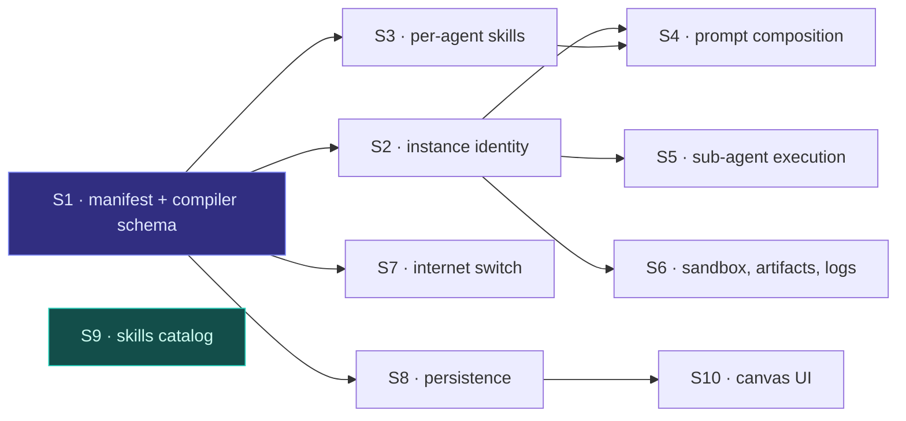

# Design: Per-Agent Skills & Composable Custom Agents

**Spec**: [`spec.md`](spec.md) · **Clarifications**: [`clarifications.md`](clarifications.md)
**Approved design narrative**: [`docs/superpowers/specs/2026-08-10-per-agent-skills-and-custom-agents-design.md`](../../docs/superpowers/specs/2026-08-10-per-agent-skills-and-custom-agents-design.md)

This document is the engineering layer under the spec: the seven architectural decisions, the
seams each one cuts, and the failure modes that must be designed for rather than discovered.

---

## 1. Architectural decisions

### D-01 — Synthetic agent ids carry instance identity

`Step.agent_id` for a custom-agent node is `custom-agent:<instance_id>`. `load_agent_spec()`
splits on the first colon, loads the base spec, and returns a copy with the synthetic id, the
instance display name, and the composed prompt body.

**Why not a `step_key`:** the engine treats agent identity as step identity in at least four
maps plus `ordered_agents`, the resume path, and every event payload. A synthetic id satisfies
all of them without touching one line of the kernel's identity handling.

**Consequence to design for:** anything that parses an agent id must tolerate a colon.
`_SPEC_CACHE` keys on the full synthetic id, so two instances never share a cached spec — which
is required, because their prompts differ.

### D-02 — Children are a compile-time expansion, not a runtime branch

`subagents` does not survive into `CompiledWorkflow` as a nested structure the kernel
interprets. The compiler flattens each group into ordered steps plus a `depends_on` edge from
the parent to each child, so the existing Kahn topo-sort already guarantees children-before-parent.
`parallel` sets the group's concurrency hint; `sequential` adds sibling-to-sibling edges;
`fanout` materializes a `FanoutSpec` on the child template exactly as `sample_fanout` does today.

**Why:** the kernel's execution model is a validated DAG of steps. Expressing the tree as edges
means no new scheduler, no new resume semantics, and no second code path to keep in sync.
INV-5 also survives: the manifest stays pure data and the compiler stays a pure transform.

### D-03 — Skill scoping narrows an existing call, it does not move it

`stage_skills(sandbox, ctx.attached_skills, agent_id=…)` is already invoked per agent build
(`factory.py:217`). Per-agent skills change *what* is passed, not *where*: `AgentContext` gains
`step_skills`, the engine populates it from `Step.skills`, and the factory passes
`ctx.step_skills or ctx.attached_skills`.

**Consequence:** a workflow that declares no per-step skills behaves exactly as today, which is
what keeps the golden snapshots byte-identical.

### D-04 — The skill directive is a prompt block, not a string prepend

`_compose_system_prompt` delegates block order to a `PromptAssemblyPolicy`
(`injects → guardrails → skills → hooks → constitution → prompt_body`). The directive becomes a
new `skill_directive` block ordered first, alongside the existing `tool_availability` slot.

**Why:** prepending to `prompt_body` would put the directive *after* guardrails in the composed
output, and would bypass the policy that exists precisely to own block order.

### D-05 — The roster is built from results, not from the manifest

The engine generates the roster block after the child group completes, from the artifacts that
actually exist. A child that failed contributes nothing.

**Why:** a roster derived from the manifest would name a file that was never written, and the
parent would burn a tool call discovering that. Deriving from results makes a partial failure
degrade to "fewer inputs" instead of "a lie in the prompt".

### D-06 — The artifact guarantee is engine-side, the naming instruction is prompt-side

The preamble tells the agent the filename; the engine verifies it afterwards and writes the
streamed text there if it is missing (`artifact_fallback`).

**Why:** the engine is model-agnostic by decision (Q15). Any guarantee that depends on the model
obeying an instruction is not a guarantee. This also makes the D-02 defect from spec 011
structurally impossible: an agent that streams instead of writing still ends up with a file.

### D-07 — Universal filesystem access is a factory-level grant, not a manifest rewrite

`read_files`/`write_files` stay in the step schema and keep parsing; the factory simply stops
consulting them when binding fs tools. `exec` still gates.

**Why:** rewriting every manifest would break the golden snapshots for a change that is a
policy, not data. Leaving the fields readable also keeps existing manifests self-documenting.

---

## 2. Slices

Each slice is independently verifiable and leaves the tree green.

| # | Slice | Delivers | Depends on |
|---|---|---|---|
| S1 | Manifest + compiler schema | New keys parse, validate, and reject; goldens byte-identical | — |
| S2 | Instance identity | `custom-agent/AGENT.md`, colon-suffixed `load_agent_spec`, compiler emits synthetic ids | S1 |
| S3 | Per-agent skills | `Step.skills` → `ctx.step_skills` → narrowed `stage_skills`; skill-directive prompt block | S1 |
| S4 | Prompt composition | Preamble + instance prompt + roster block, policy-ordered | S2, S3 |
| S5 | Sub-agent execution | Compile-time expansion for parallel / sequential / fanout, two levels | S2 |
| S6 | Sandbox, artifacts, logs | Universal read+write, artifact check + fallback, `.logs/run-logs.jsonl`, deliverable filter | S2 |
| S7 | Internet switch | `capabilities.internet`, `tool/internet` stub provider | S1 |
| S8 | Persistence | `build_manifest_from_dict`, YAML export endpoint, `attached_skills` migration | S1 |
| S9 | Skills catalog | `compatible_agents` in loader/API/picker + the 182-file authoring pass | — |
| S10 | Canvas UI | Tree rendering, add/rename sub-agent, config rail, internet toggle | S8 |

S1 is the spine. S9 is fully independent and can run in parallel from the start. S10 needs only
S8's shape, not its implementation.

---

## 3. Failure modes to design for

**F-01 — Golden drift.** Every new field is inert when absent, but the *skill directive* block
fires whenever `skills` is non-empty. A golden workflow that gains a skill would change its
prompt. Mitigation: no golden manifest declares `skills`; the characterization tests assert
byte-identity and are never re-baselined.

**F-02 — Colon-suffixed ids leaking into path construction.** A synthetic id used as a directory
or filename component would produce `custom-agent:research-a/` — legal on POSIX, hostile
everywhere else. Mitigation: artifacts key on `instance_id`, never on `agent_id`; the sandbox
path helper must be audited for agent-id interpolation.

**F-03 — Instance-id collision across nesting levels.** Uniqueness must be checked over the
*flattened* tree, not per level, or a grandchild could shadow a top-level node's artifact.

**F-04 — Tool-set inflation destabilizing small models.** Universal read+write flips
`exclude_builtin` for agents that were previously text-only, which is exactly the C-01 mechanism
that broke `qwen3.5:4b`. Mitigation: AC-19 gates the change on a live `hello_html` Ollama run.

**F-05 — Fan-out double-implementation.** The child-group `fanout` mode and `fanout_batch` solve
the same problem. Mitigation: the child group compiles *into* a `FanoutSpec` — there is one
implementation, reached two ways.

**F-06 — Roster/artifact name skew.** If the preamble computes the filename one way and the
roster another, the parent looks for a file nobody wrote. Mitigation: one helper,
`artifact_name(instance_id, topic)`, called by both.

**F-07 — Migration running twice.** Fanning `attached_skills` out to every step on read is
idempotent only if it checks whether per-step skills already exist. Mitigation: migrate only
when every step's `skills` is absent.

**F-08 — `compatible_agents` filtering a skill into invisibility.** A wrong list is worse than
no list. Mitigation: absent means compatible-with-all, and the field never gates server-side.

**F-09 — `.logs/` colliding with a user artifact.** An agent could write `.logs/foo`. Mitigation:
the engine owns the path and the deliverable filter is prefix-based, so a stray write is
excluded rather than corrupting the trace.

**F-10 — Depth-2 grandchildren under a fan-out clone.** A cloned worker owning children would
multiply spawns beyond `max_subagents`. Mitigation: the budget ceiling (`max_depth=2`,
`max_subagents=8`) already enforces this at runtime; the compiler rejects the third level
statically.

**F-11 — Empty child group.** `subagents: {mode: parallel, steps: []}` compiles to a parent with
no children and an empty roster. Mitigation: validation error naming `subagents.steps`.
