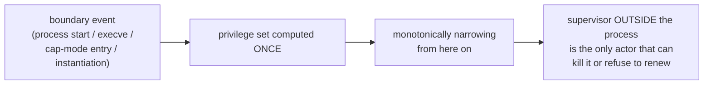
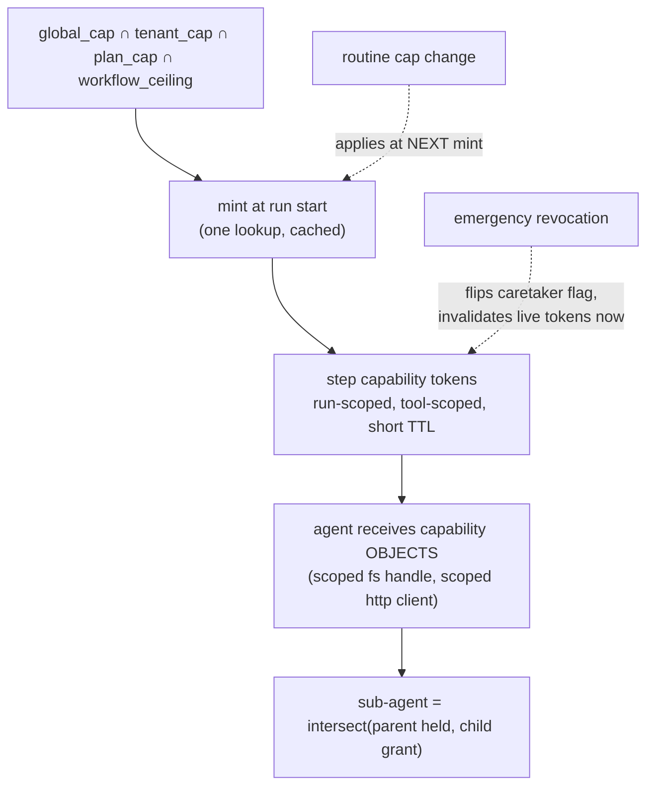

# Research — capability confinement for agent processes

**Date:** 2026-08-16
**Method:** Sonnet research agent, redirected mid-run after a framing correction
**Question:** what is the right architecture for "what authority does this agent process
hold for this run, and can it get more than it was handed"?

---

## The reframe

The first research pass was commissioned as an *authorization* problem. That was wrong, and
the correction matters:

```
authorization           "may USER x access RESOURCE y"
                        identity-centric, human principal, relationship tuples
                        → RBAC / ReBAC / Zanzibar / OpenFGA / Cedar

capability confinement  "what authority does this PROCESS hold right now,
                         and can it acquire more"
                        no human principal at enforcement time; the subject is a
                        non-deterministic process steerable by untrusted data mid-run
                        → ocap, WASI, Capsicum, seccomp, Linux capabilities, macaroons
```

There is no principal to bind a role to at tool-call time. Zanzibar-style relationship
tuples are the wrong shape entirely and were dropped from this pass.

### Why it matters concretely

An LLM agent processing untrusted tool output (a scraped page, a file, another agent's
output) is exactly the **confused deputy**: it holds broad authority and can be manipulated
by data it reads into misusing that authority for a purpose the operator never intended.

A policy engine bolted on the outside checks "is this call allowed" per call — but the
authority to *attempt* the call still exists in full on the agent side. Capability
confinement never hands out that authority in the first place. **Attenuation happens at
handoff, not at enforcement-time lookup.**

> **Position:** put the decision at *mint time*, not *use time*. A policy engine may compute
> the ceiling; it should not sit in the tool-call hot path deciding case-by-case whether an
> agent that already holds a filesystem-write capability may use it. If it holds the
> capability, it can use it, by construction.

---

## OS/runtime precedents — the reference architectures

These are decades-tested answers to "hand a subprocess strictly less authority than you
hold, and adjust it mid-flight."

### Linux capabilities(7) — bounding set

A process has permitted/effective/inheritable/**bounding**/ambient sets. The bounding set
is a ceiling: a process can never gain a capability outside it, **even via `execve` of a
setuid binary**, and can only ever *remove* from it — never add back.

`prctl(PR_SET_NO_NEW_PRIVS, 1)` is the same shape, coarser: once set it is inherited across
`fork`/`clone`/`execve` and **cannot be unset**. ([kernel docs](https://docs.kernel.org/userspace-api/no_new_privs.html))

### seccomp-BPF

A filter can be replaced only by a **strictly narrower** one. `no_new_privs` is a
precondition specifically so a process can't install a filter then exec into something
with more privilege than the installer had. ([kernel docs](https://docs.kernel.org/userspace-api/seccomp_filter.html))

### FreeBSD Capsicum — the cleanest match

`cap_rights_limit(2)` reduces rights **on the file descriptor itself** — rights can be
reduced, never expanded, enforced by the kernel on the handle, not by a policy check
elsewhere. In capability mode the process loses global namespaces entirely: no `open()` by
pathname, no `ptrace`. It can only reach what it already holds fds to.

This is the direct analogue of "an agent gets handed already-scoped capability objects
rather than a broad grant plus a runtime check."
([USENIX Security 2010](https://www.usenix.org/legacy/event/sec10/tech/full_papers/Watson.pdf))

### WASI

Explicitly modelled on Capsicum. No global filesystem namespace inside a module — it sees
only the directory handles (`preopens`) passed at instantiation, each carrying its own
rights. Authority is handed in, never looked up.

### The common shape



Privilege is computed at a small number of well-defined boundary points — **not re-derived
per operation** — and after that point travel is only downward. Nothing inside can escalate
itself.

> **This validates the one-way-narrowing hypothesis.** It is not a convention; it is how
> kernels enforce confinement, in four independent implementations.

---

## Attenuation, membranes, revocation

- **Attenuation** — a holder can construct a derived capability with a *subset* of its own
  rights (wrap read-write to produce read-only) and hand that on. You can never delegate
  more than you hold.
- **Membrane** — when authority crosses a trust boundary, every object crossing is
  transparently proxied, including anything the untrusted side hands back. Authority can't
  leak a raw reference out. Right pattern for "a step invokes an untrusted MCP server or a
  sub-agent" — wrap, don't check-and-pass-through.
- **Caretaker + revoker** — the membrane's forwarding is gated by a shared flag; a
  *revoker* capability, held only by the party entitled to shut things off, flips it. Every
  call through the membrane then fails.

> Revocation via caretaker is materially better than "the PDP will start returning deny on
> the next check", because **there is no next check to skip or delay** — the reference
> itself stops working.

([ocap patterns](https://tersesystems.github.io/ocaps/guide/introduction.html))

---

## Macaroons — capability handoff across process boundaries

Where OS capabilities don't reach (a network hop, an MCP server, a sandboxed subprocess
that isn't a direct child), you need a bearer token that carries its own attenuation.

**Macaroons** (Google Research, 2014): an HMAC-chained bearer token to which the *holder*
can append caveats that narrow scope — "only within 5 minutes", "only tool X", "only run
Y" — without contacting the issuer. Each caveat is cryptographically bound, so a downstream
party can attenuate further but never widen. Third-party caveats let you require a fresh
external check ("only if run R is still active") without pre-baking an expiry.
([paper](https://research.google/pubs/macaroons-cookies-with-contextual-caveats-for-decentralized-authorization-in-the-cloud/))

> **Position:** for step grants and sub-agent handoff, a macaroon-shaped ephemeral token
> (short TTL, tool-scoped, run-scoped, attenuate-only) beats a JWT re-validated against a
> rules engine per call — the narrowing travels *in* the token and is enforceable without a
> live call back to a decision service.
>
> ⚠️ **Flagged as a design position, not an off-the-shelf pattern.** No public production
> writeup does exactly this for LLM tool scoping.

---

## Sub-agent delegation

The ocap answer is unambiguous: `child ⊆ parent`, enforced **by construction** — the parent
literally does not possess a wider capability to hand over — rather than checked at
delegation time.

For our orchestrator: a sub-agent's set is `intersect(parent's held set, sub-agent's grant)`,
and it is structurally incapable of producing a wider result.

### Parallel fan-out sharing a workspace

The one case none of the OS precedents solve cleanly — Capsicum/WASI assume single-owner
handles. Two options:

| Option | Mechanism | Trade-off |
|---|---|---|
| **(a) Per-child attenuated view** *(recommended)* | Each child gets its own scoped handle — a subdirectory view, or read-only where it doesn't need write | Cheaper to reason about; costs some flexibility |
| (b) Caretaker mediator | A single object fronting the shared resource, revocable per child | Reintroduces a check-time decision; you implement the mediator yourself |

Default to (a); reach for (b) only when children genuinely must coordinate through one
resource.

---

## Runtime-adjustable caps over running work

Reframed as capability-set narrowing, not policy evaluation.



### Routine vs. emergency

| | Mechanism | Consistency | In-flight runs |
|---|---|---|---|
| **Routine** (plan downgrade, tenant tightening) | Applies at the next run's mint | Eventual — seconds, cache TTL | Keep the ceiling they were minted with |
| **Emergency** (stop this tenant now) | Caretaker flag checked at point of use | Immediate — invalidates live tokens regardless of TTL | Killed deliberately, logged |

**Why in-flight runs are not retroactively downgraded:** that means revoking a capability an
agent is actively holding mid-tool-call — the instability the "computed once at a boundary"
OS precedent exists to avoid. Emergency kill is a deliberate action, not an implicit side
effect of a routine edit.

Precedent: cgroup limits can be lowered on a live container and the kernel enforces the new
ceiling on the next resource request, without cooperation or restart.

> **Deliberate choice:** don't make every run pay for live re-evaluation to handle a case
> that is actually uncommon. Snapshot at mint, plus an explicit out-of-band revocation path.

---

## Mapping to our system

```
global_cap        emergency, DB/cache, admin-editable, revocation-capable
      ∩
tenant / plan     DB/cache, runtime-editable, no redeploy
      ∩
workflow_ceiling  file, authored, versioned with the manifest
      ∩
step_grant        file, authored, versioned with the manifest
      ↓ mint
step capability token   run-scoped, tool-scoped, short TTL, attenuate-only, revocable
      ↓ hand to
agent process     receives capability OBJECTS, not a grant + a checker
      ↓ fan-out
sub-agent         intersect(parent held, own grant) — structurally
```

- **Per tool call: ideally no evaluation at all.** If the agent holds no filesystem handle
  it structurally cannot call `write`. Reserve one live check for the revocation flag — a
  cheap boolean, not a policy evaluation.
- **Run start:** compute the intersection once, mint, done. This is our *existing* static
  intersection logic — keep it. Move the tenant/plan operands out of the hardcoded dict, and
  change the **output** from "a dict checked ad hoc" to "capability objects handed to agent
  construction."

---

## Agent-specific precedent: CaMeL / dual-LLM

The most concrete published design for confining an LLM. Split into a **privileged LLM**
(sees the trusted query, plans, calls tools) and a **quarantined LLM** (only processes
untrusted data, has no tool access at all), with an interpreter between them tagging every
value with **provenance** — where did this come from, who may read it — and refusing tool
calls whose arguments are tainted by data policy says shouldn't reach that tool.

The interesting move: authority attaches to the **data an agent is about to act on**, not
only to the agent process.

⚠️ Reported ~two-thirds of prompt-injection attacks blocked in AgentDojo — **flagged as
secondary-source**, not pulled from the primary paper.

> **For us:** overkill for v1. But it is the right escalation path once static tool grants
> prove insufficient — e.g. an agent with legitimate write access being steered by a
> poisoned file it read. Don't build speculatively.

---

## Anti-patterns

1. **Per-call policy re-evaluation as the default** — reintroduces a hot-path dependency on
   an external decision service for something that should be structurally impossible.
2. **Ambient authority anywhere in agent construction** — an agent that *can* reach the
   filesystem globally and is merely told not to via a system prompt.
   > *"The model is not your authorization layer."* A system prompt is interpreted guidance,
   > not enforced confinement. This is precisely why `story-estimator`'s "output ONLY the
   > markdown document" instruction did not hold.
3. **Widening on delegation** — any path where a sub-agent's grant is computed independently
   of the parent's held set breaks one-way narrowing and reopens confused-deputy risk.
4. **Long-lived broad bearer tokens for tool access** — standing tokens sized for
   convenience are now treated as the primary AI-agent attack surface.
5. **Treating a shared fan-out workspace as one capability** — can't be individually revoked
   or scoped.
6. **No revocation path, only expiry** — short TTLs limit blast radius but give you no
   emergency stop for something happening *right now*.

---

## Sequenced adoption

```
1  tenant/plan caps: hardcoded dict → DB row + orchestrator cache
   └─ no behaviour change; gets "change caps without redeploy" on its own
2  minting produces capability OBJECTS, not a permission dict      ← highest leverage
   └─ converts "checked permission" into "structural inability"
3  caretaker/revocation flag per tenant or run — the kill switch
4  parent ∩ child on sub-agent spawn, as a hard tested invariant
5  provenance tracking (CaMeL) — only if 1–4 prove insufficient
```

---

## Flagged as unverifiable

- **Macaroon-shaped ephemeral capability tokens for LLM tool scoping** — synthesised from
  the 2014 macaroons paper plus 2026 credential-ephemerality trend pieces. A design
  position, not an established named pattern to adopt off the shelf.
- **CaMeL's ~67% injection-block figure** — from secondary summaries of AgentDojo
  evaluation, not the primary paper.
- **"cgroup limits lowered on a live container without restart"** — standard, well-known
  cgroup behaviour, but no primary kernel-doc citation was fetched in this pass.

---

## Sources

- https://docs.kernel.org/userspace-api/no_new_privs.html
- https://docs.kernel.org/userspace-api/seccomp_filter.html
- https://www.usenix.org/legacy/event/sec10/tech/full_papers/Watson.pdf
- https://man.freebsd.org/cgi/man.cgi?query=rights
- http://www.chikuwa.it/blog/2023/capability/
- https://docs.wasmtime.dev/security.html
- https://en.wikipedia.org/wiki/Confused_deputy_problem
- https://blog.acolyer.org/2016/02/16/capability-myths-demolished/
- https://tersesystems.github.io/ocaps/guide/introduction.html
- https://research.google/pubs/macaroons-cookies-with-contextual-caveats-for-decentralized-authorization-in-the-cloud/
- https://github.com/rescrv/libmacaroons
- https://simonwillison.net/2025/Apr/11/camel/
- https://capisc.io/blog/confused-deputy-problem-coming-for-multi-agent-systems
- https://tianpan.co/blog/2026-04-25-policy-as-code-agent-permissions-opa-rego
- https://www.descope.com/blog/post/ai-agent-credential-management
