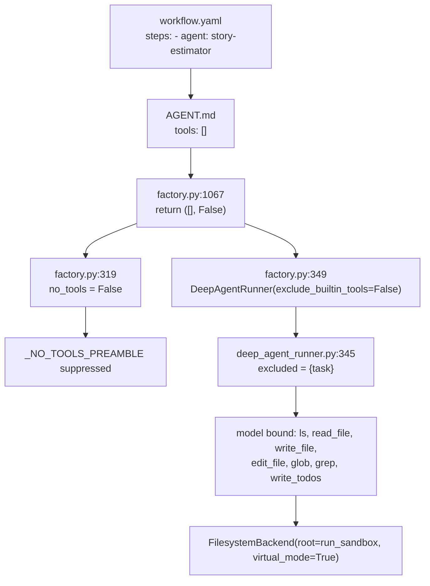

# Diagnosis — the R-22 universal filesystem grant

**Date:** 2026-08-16
**Branch:** `dev` (post-merge of `feat/composed-workflow-execution`, commit `24332e0c5`)
**Status:** root-caused, fixed locally, uncommitted

---

## Summary

Spec 012's R-22 / D-07 "universal filesystem grant" bound `read_file` / `write_file` /
`edit_file` to **every agent that declares `tools: []`** — 61 of 87 agents. Those agents
were written and prompted as text-only ("output ONLY the markdown document"). Given file
tools they did not ask for, several began writing their output to disk instead of
returning it, where the `streamed_text` deliverable strategy could not see it.

Two distinct defects follow from the same line.

| | Defect | Cost |
|---|---|---|
| **A** | Deliverable orphaned — agent wrote the real output to the sandbox, streamed a summary | user receives narration instead of the artifact |
| **B** | Agents doing work that isn't theirs — a story-point estimator wrote a whole backlog | ~2.3 M tokens in one reported run |

Both are **non-deterministic**: nothing forces an agent to use the tools, it merely may.
The same pipeline passes on one run and fails on the next, on identical code.

---

## Root cause

`backend/agents/factory.py::_resolve_runner_tools`

```python
# before the merge (24332e0c5^)          # after
if not spec.tools:                       if not spec.tools and not custom_keys:
    if mcp_tools:                            if mcp_tools:
        return (mcp_tools, False)                return (mcp_tools, False)
    return ([], True)                        return ([], False)
```

`exclude_builtin_tools` is an **exclusion flag**. `True` excludes the whole
`_BUILTIN_TOOLS` suite; `False` excludes only the library sub-agent `task` tool — i.e.
binds everything else.

### The full chain



### The compounding effect

The declaration was not only ignored — the agent also **lost the instruction not to use
tools**. `no_tools` is `exclude_builtin_tools and not custom_tools`, so it became `False`
and `_NO_TOOLS_PREAMBLE` stopped being injected:

> **## Tool Availability**
> You have NO tools in this session. You must NEVER emit tool-call syntax of any kind —
> no `<function_calls>`, no `<invoke>`, no `write_todos`, `read_file`, `write_file`,
> `edit_file`, or to-do blocks.

So: tools appeared, and the paragraph forbidding their use disappeared.

### This grant had already broken something once

`app/agents/deep_agent_runner.py:363-372` documents **ISS-004** — the same flag misread by
a different consumer:

> "Spec 012's universal-filesystem grant (D-07) made every text-only agent resolve
> `exclude_builtin_tools=False`, which silently disabled the sanitizer for exactly the
> agents it protects — fabricated `<function_calls>` XML began leaking into the
> user-visible chunk stream."

It was fixed by passing `sanitize_fabricated_xml=not spec.tools` — i.e. by **reading the
declaration again** instead of inferring from the resolved flag. Defects A and B are two
further consumers of the same broken inference that were not found at the time.

---

## Evidence from real runs

`RUNS_ROOT=./runs` locally (not `/tmp`), so every sandbox since 2026-08-13 survives —
54 runs under user `6b5d63ea-…`.

### Defect B — `user_stories` run `7c1e5028-6e05-477e-a529-fc4ba59b5571`

Agent windows from `run_events` vs. file mtimes (DB is UTC, mtimes local +2):

```
story-estimator                     21:20:23 ─ 21:21:26
backlog_with_dependencies.md written        21:21:18   ← inside that window
```

`story-estimator` declares `tools: []` and its job is story points. It wrote a
20,830-byte backlog document.

The mechanism is visible in `artifact_refs`:

| agent | wrote files | registered summary |
|---|---|---|
| `epic-architect` | none | **17,282 B** |
| `story-estimator` | 20,830 B | **2,710 B** |
| `nfr-specialist` | none | 4,562 B |

The estimator returned one sixth the content of the agent before it, because its actual
output went to a file nothing reads.

That run still delivered correctly (23,734 B, 23 stories) — the compiler rebuilt from
`epic-architect`'s upstream output. A teammate's run of the same pipeline did not: their
compiler chose to write `FINAL_PRODUCT_BACKLOG.md` and stream a summary, and their
estimator wrote **ten** files totalling ~127 KB.

### Defect A — composed run `318ba343-c067-468c-a6f6-06fa832abf14` ("SpecKit Clone")

`deliverable: {strategy: streamed_text, name: output.md}`.

The Implement step built a complete working todo app in the sandbox — 36 files including
`index.html` (4,061 B), `app.js` (13,083 B), `styles.css` (13,241 B), `storage.js`,
`taskList.js`, tests, docs.

`artifact_refs` for that run contains exactly one deliverable, **6,835 bytes**, and it is
not a summary — it is the narration between tool calls:

> "I'll help you create an HTML-based todo app. Let me first read the analysis and
> planning documents… Now create the package.json:… Now copy the documentation file"

The working app was never registered as an artifact. Same for `e2d9794f-…` (32 files:
Python app + React frontend + tests, delivered as ~6 KB of chatter).

### Defect B in `serialized_sandbox` pipelines — junk ships to the customer

Where the sandbox *is* the deliverable, meta-documents reach the user:

| run | pipeline | markdown | meta-docs shipped |
|---|---|---|---|
| `650b0ccd` | mulesoft_to_springboot | 43 / 1097 KB | 17 / 253 KB (23%) |
| `705a8121` | app_builder | 29 / 811 KB | 19 / 201 KB (25%) |
| `ccd0b53b` | dotnet_to_azure | 24 / 437 KB | 12 / 159 KB (36%) |
| `76f53d49` | mulesoft_to_springboot | 18 / 498 KB | 6 / 98 KB (20%) |
| `e918e4e7` | mulesoft_to_springboot | 14 / 434 KB | 5 / 71 KB (16%) |

`ccd0b53b` alone shipped `README.md`, `README_AI_INTEGRATION.md`, `DELIVERY_VERIFICATION.md`,
`AI_DELIVERY_SUMMARY.md`, `DELIVERABLES_SUMMARY.md`, `DELIVERY_SUMMARY.md`,
`FINAL_SUMMARY.md`, `QUICK_REFERENCE.md`, `AI_EXECUTIVE_SUMMARY.md` — nine overlapping
summary documents in one folder.

`app_builder` has 10 of 15 agents declaring `tools: []` (the design/analysis ones), so
this is structural, not incidental.

---

## Blast radius of the merge

Verified against `git diff 24332e0c5^ 24332e0c5`:

```
built-in prompts touched            83
  └─ with real BODY changes          6   ← all PPT
built-in workflow.yaml semantic Δ    4   ← ppt, ppt_revision, od_ppt, od_ppt_revision
built-in agents with tools: changed  5   ← all PPT
```

Everything else was YAML re-indentation and frontmatter reformatting. For
`user_stories`, `prototype`, `app_builder`, `mulesoft_to_springboot`, `dotnet_to_azure`,
`reverse_engineer` and `chat`, **the entire behavioural delta is one function.**

---

## The fix applied

Two widening paths existed, not one.

### 1. The blanket grant — removed

`return ([], False)` → `return ([], True)`.

The grant existed because a composed `custom-agent` instance genuinely needs to write and
had no way to say so. It says so now: `agents/prompts/custom-agent/AGENT.md` declares
`tools: [workspace]`, which a synthetic `custom-agent:<instance>` id inherits through
`load_agent_spec` (it partitions the id and overlays the base spec).

This makes the fix a **removal**, not a new special case — no `CUSTOM_AGENT_PREFIX` branch
in the resolver, and the declaration is the single authority again.

### 2. Skills staging — narrowed

`if delivery.staged: exclude_builtin_tools = False` is load-bearing (staged skill bodies
live on disk and must be readable), but staging is a **read** requirement and it was
granting write. `DeepAgentRunner` now re-excludes `write_file` / `edit_file` for declared
text-only agents, keyed on the same declaration already passed as
`sanitize_fabricated_xml`.

### Before / after

```
BEFORE
  story-estimator     declared=[]            exclude_builtin=False  why=empty_tools_grant
                      fs=[edit_file, glob, grep, ls, read_file, write_file]
  app-code-generator  declared=['workspace'] exclude_builtin=False  why=declared
                      fs=[edit_file, glob, grep, ls, read_file, write_file]   ← identical

AFTER
  story-estimator     declared=[]            exclude_builtin=True   why=text_only
                      fs=[]
  app-code-generator  declared=['workspace'] exclude_builtin=False  why=declared
                      fs=[edit_file, glob, grep, ls, read_file, write_file]   ← unchanged
  custom-agent:demo   declared=['workspace'] exclude_builtin=False  why=declared
                      fs=[edit_file, glob, grep, ls, read_file, write_file]   ← unchanged
```

### Files changed

```
agents/factory.py                     the grant, + declared/why in the trace
agents/prompts/custom-agent/AGENT.md  tools: [workspace] declared honestly
agents/workflows/compiler.py          + logger, + tool_grant compile trace
app/agents/deep_agent_runner.py       + tool_grant bind trace, staging narrowed
```

---

## Observability added

A `tool_grant` trace at all three seams — one grep follows a step from manifest to
binding.

```
tool_grant compile step=…  asked(r/w/x)=…  ceiling(r/w/x)=…  effective(r/w/x)=…
tool_grant resolve agent=… declared=… custom=… exclude_builtin=… no_tools=… why=…
tool_grant bind    agent=… fs=[…] custom=… excluded=[…] sandbox=…
```

`why` names the widening path (`text_only` / `declared` / `skills_staged`) so a blanket
grant is distinguishable from a legitimate one in a log.

The `bind` line reports the **surviving** tool set, not the excluded one — `excluded` is a
double negative that has now been misread three times (ISS-004, the `no_tools` preamble,
and R-22 itself).

Offline reproducer (no model calls): `scratchpad/tool_grant_trace.py`.

---

## Tests

`backend/tests/agents/test_tool_grant_invariants.py` — 94 tests, parametrised over every
`AGENT.md` on disk so a re-introduced blanket grant fails immediately and a new agent is
covered without editing the file.

```
61 × tools: []      → must resolve exclude_builtin=True, zero custom tools
25 × tools: [...]   → must NOT end up in the text-only posture
 1 × workspace      → must specifically keep write_file
     custom-agent   → template must declare what its prompt makes it do
     custom instance→ synthetic id must inherit the declaration
     step perms     → no tools: → read yes / write no; explicit write → granted; no escalation
```

Result: **93 passed, 1 failed**. The failure is deliberate — see
[report-open-issues.md](report-open-issues.md).

### Process note

These tests were written before the fix but **never run red**. The green result is real,
and no assertion was weakened afterwards (the fleet asserts are byte-identical to as
written), but the red baseline was not recorded, so that claim rests on inspection rather
than evidence. Recovering it:

```bash
cd backend
git stash push agents/factory.py agents/prompts/custom-agent/AGENT.md \
               agents/workflows/compiler.py app/agents/deep_agent_runner.py
../venv/bin/python -m pytest tests/agents/test_tool_grant_invariants.py -q   # expect ~62 F
git stash pop
```

Expected red: 61 text-only failures plus the ceiling test. A different number means the
tests do not pin what they claim.

---

## Related

- [report-open-issues.md](report-open-issues.md) — what is still outstanding
- [report-agent-permission-patterns.md](report-agent-permission-patterns.md) — how other systems model this
- [report-capability-confinement.md](report-capability-confinement.md) — the structural fix
- [report-runtime-caps-multitenancy.md](report-runtime-caps-multitenancy.md) — runtime-changeable caps
