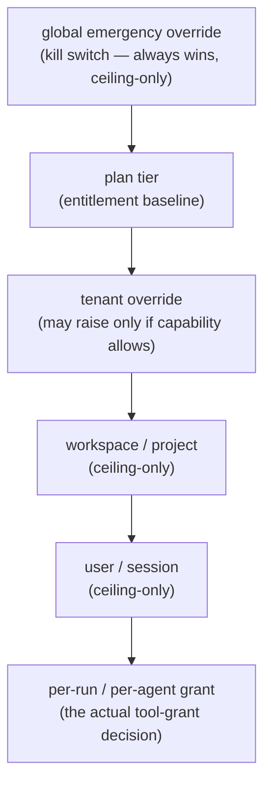

# Research — runtime-changeable caps at multi-tenant scale

**Date:** 2026-08-16
**Method:** Sonnet research agent
**Question:** how do we change capability caps at runtime for ~100s of client
organisations, without a deploy, safely?

---

## The three-axis split

`TIER_PIPELINES` merges three different things. Mature systems keep them in three stores,
evaluated at three points, because they have different frequencies and consistency needs.

| Axis | Question | Frequency | Where it lives |
|---|---|---|---|
| **Entitlement** | Does this tenant's *plan* include this capability at all? | once per run | Postgres, keyed off subscription |
| **Permission** | May *this run* hold this tool right now? | per tool grant | resolved at run start, held in memory |
| **Quota** | How much of a consumable has been used? | per LLM call | Redis counter |

Stripe's Entitlements API draws this line explicitly — it maps plan → feature access and
deliberately does **not** enforce usage limits in real time, because billing-derived
entitlement and runtime enforcement have different latency and consistency needs.
([stripe.dev](https://stripe.dev/blog/managing-saas-access-control-with-stripe-entitlements-api))

### What breaks when they're merged — i.e. our dict

- Cannot express *"tenant X is on Pro but we granted them `exec` as a pilot"* without
  forking the dict per tenant. This is how these structures always degenerate into
  unmaintainable special-casing.
- Cannot answer *"why was this denied"* — plan-gated, permission-denied, or quota-exhausted?
  Each needs different UX (upsell / 403 / 429-and-backoff) and different remediation.
- Cannot change one axis without redeploying all three. A quota bump forces a deploy that
  also risks touching entitlement logic.
- Access patterns differ by orders of magnitude — per-tool-call permission checks must be
  local and fast; entitlement can afford a network call; quota needs atomic counters. One
  structure cannot be tuned for all three.

---

## Layered resolution — and the per-key trap

The layered-override pattern is consistent across mature systems (VS Code
`Default → User → Workspace → Folder`; Salesforce Hierarchy Custom Settings; Dokploy
`Project → Environment → Service`) — more specific scope wins.

**The critical decision most guides skip: merge semantics are per-key, not one global rule.**

| Semantic | Meaning | Correct for |
|---|---|---|
| **Override** | more specific replaces | booleans/enums like "default LLM model" |
| **Ceiling-only** | child may only *lower* | anything security-relevant — `exec`, `network`, `write_files` |
| **Floor/additive** | child may only *raise* | minimum guarantees; rare here |

> **The failure mode:** implementing plain override semantics for a security ceiling means a
> workspace-level config can silently **escalate** privilege above what the tenant/plan
> intended.

### Our chain



Tag each capability with `raise_policy: none | tenant_self_service | operator_approval_required`
rather than assuming one policy for everything. "Max parallel agents" is a cost/UX knob an
account manager might reasonably raise; `filesystem_write` is a hard ceiling.

### Store overrides sparsely

Write a row only when a scope **deviates** from its parent. Resolve at read time by walking
most-specific → least, taking the first row found, then clamping against every ceiling-only
ancestor.

> **Do not materialise resolved config at write time.** That is the classic pitfall — you
> get stale ceilings whenever a plan-level or global change should have cascaded, and
> reconciling needs a fan-out job across every tenant row. Exactly the migration pain we're
> trying to escape.

---

## Data model

Designed so a new capability class requires **zero migration touching existing tenant rows**.

```sql
-- Catalog of capability dimensions.
-- Adding a row here is the entire "ship a new tool class" step — no backfill.
capability_definitions (
    key             text PRIMARY KEY,   -- 'tool.code_exec', 'tool.network_access'
    kind            text NOT NULL,      -- 'boolean' | 'numeric_limit' | 'enum'
    default_value   jsonb NOT NULL,     -- 'false' for a new tool class
    raise_policy    text NOT NULL,      -- 'none' | 'tenant_self_service' | 'operator_approval_required'
    created_at      timestamptz NOT NULL DEFAULT now()
);

-- Plan-tier baseline. Replaces TIER_PIPELINES.
plan_capabilities (
    plan_tier       text NOT NULL,
    capability_key  text NOT NULL REFERENCES capability_definitions(key),
    value           jsonb NOT NULL,
    PRIMARY KEY (plan_tier, capability_key)
);

-- Sparse overrides at any scope.
capability_overrides (
    id              bigserial PRIMARY KEY,
    scope_type      text NOT NULL,      -- 'global' | 'tenant' | 'workspace' | 'user'
    scope_id        text,               -- null for 'global'
    capability_key  text NOT NULL REFERENCES capability_definitions(key),
    value           jsonb NOT NULL,
    is_ceiling_only bool NOT NULL DEFAULT true,
    set_by          text NOT NULL,
    reason          text,
    expires_at      timestamptz,        -- time-boxed pilot grants, free
    created_at      timestamptz NOT NULL DEFAULT now(),
    UNIQUE (scope_type, scope_id, capability_key)
);

-- Append-only. Never update, never delete.
capability_change_log (
    id              bigserial PRIMARY KEY,
    override_id     bigint REFERENCES capability_overrides(id),
    action          text NOT NULL,      -- 'created' | 'updated' | 'expired' | 'revoked'
    old_value       jsonb,
    new_value       jsonb,
    actor           text NOT NULL,
    approved_by     text,               -- non-null when raise_policy required approval
    created_at      timestamptz NOT NULL DEFAULT now()
);
```

### Why this beats the dict

- **New capability = one row insert, no backfill.** Resolution falls through overrides →
  plan → `default_value`. A tenant with no override row for a new key automatically gets
  `false`. **The absence of a row is the deny** — that is the mechanism for "new tool
  classes default-deny for existing tenants without a backfill."
- **Raise one tenant's cap = one row upsert.** No deploy, audited.
- **Raise-vs-lower enforced structurally** via `is_ceiling_only`, checked at resolution
  against the parent scope's resolved value.
- **Only a genuinely new capability *type* needs a deploy** — never a per-tenant value.

---

## Distribution — and what to skip

Three real architectures exist. Pick on read frequency and staleness tolerance, not vendor
prestige.

| Option | Mechanism | Trade-off |
|---|---|---|
| **A. Local eval + streaming** (LaunchDarkly/OpenFeature/Unleash) | SDK holds ruleset in memory, SSE/WebSocket push updates, serves last-known-good if stream drops | Right at thousands-of-services scale; over-engineered here |
| **B. Raft config store** (etcd/Consul) | Linearizable reads | Write availability blocks on quorum loss — **wrong failure mode for a kill switch** |
| **C. DB + cache invalidation** *(recommended)* | Postgres source of truth, in-process cache, `LISTEN/NOTIFY` on write | Weakest consistency (bounded by TTL), but **zero new infrastructure** |

> **Recommendation for ~100 tenants: C.**
>
> Entitlement/permission resolution happens once per workflow start, not per-request across
> a stateless fleet. Standing up LaunchDarkly/Unleash/etcd/OPA at this scale is operational
> overhead buying you nothing. You already run Postgres.

### Concrete design

- Postgres is the source of truth.
- In-process cache keyed by `tenant_id`, **30–60 s TTL**, lazily populated.
- On admin write, publish `tenant_config_changed{tenant_id}` via Postgres `NOTIFY` (or Redis
  pub/sub, which you'll have anyway for quota) so live processes invalidate immediately. TTL
  is the safety net if the message drops.
- **Staleness budget:** low single-digit seconds via pub/sub, 60 s worst case via TTL.
  Acceptable for "raise a tenant's cap".
- **The kill switch is the one exception** — route it through a separate, uncached (or 1–2 s
  TTL) check, since sub-second global reach is its entire value. One row read before any
  tool grant is cheap enough to skip caching entirely.

---

## Safe change management

The stated worry — *"prevent an admin from globally granting `exec` by accident"* — has a
known answer set.

- **Kill switch ≠ progressive rollout ≠ targeting rule.** Three different UI actions with
  three different blast radii, not one generic "edit config" form. Conflating them into one
  slider is how people ship "100% rollout" when they meant "kill it".
  ([Unleash](https://www.getunleash.io/blog/kill-switch-vs-progressive-delivery))
- **Scope-typed change UI, not a dict editor.** Changing a security-relevant capability must
  require explicitly selecting scope (this tenant / this plan / global), and **must never
  default to global**. Global should be a distinct, harder-to-reach action requiring
  confirmation of the tenant count affected. *This* is the mechanism that prevents
  accidental global `exec` — make blast radius a required, prominent field.
- **Guardrail automation over discipline.** Wire changes to observability so a bad change
  auto-reverts: if a tenant's error rate or token burn spikes right after a cap change,
  revert and page. Turns the kill switch from a manual emergency tool into an automated one.
- **Approval only on the security dimension.** Don't gate every change (kills operator
  velocity on harmless knobs). Two-person review only for capabilities tagged
  `operator_approval_required`.
- **Shadow/monitor mode before enforcing.** When adding a new capability dimension, deploy
  the check log-only first, review what it *would* have denied, then flip. This is what
  prevents "we added a permission check and silently broke every existing tenant."

---

## Quota — the 2.3 M-token run

Convergent industry pattern: **token bucket, state in Redis, atomic check-and-decrement via
Lua script** — Stripe, Cloudflare, Envoy and AWS API Gateway all land here independently.
Token bucket wins over sliding-window for our case because it supports **burst** (a
legitimate agent run spikes) while enforcing a sustained rate.

```
Layer 1  per-(tenant, run) token bucket    checked before EVERY LLM call — not once at start
Layer 2  velocity circuit breaker          spend rate > ~3× trailing average → auto-throttle
Layer 3  loop detector                     repeated identical tool calls / growing context
```

> **Layer 2 is the one that would have caught our incident.** A per-run cap set high enough
> for a legitimate long workflow is also high enough for a runaway to do real damage before
> tripping it. Track *rate of consumption*, not just cumulative.

A single session budget checked once at dispatch is exactly how you get a 2.3 M-token run.

- **Soft vs hard limits** — soft triggers a warning plus a cheaper-model or
  reduced-parallelism fallback; hard terminates. Don't make every limit hard-fail.
- **Per-tenant bucket keys are mandatory** (`tenant_id + resource_class`), never a shared
  pool, or one client's bad run degrades everyone else's.
- **Counters in Redis**, TTL'd per window, Lua script combining refill math with the
  decrement to stay atomic.

---

## Admin surface and audit

- Every write to `capability_overrides` requires `set_by` and `reason`; anything hitting
  `operator_approval_required` requires `approved_by` from a **second** operator before it
  goes live — enforced in application logic, not convention.
- `capability_change_log` is table stakes for any SOC2/enterprise review of a platform
  granting `exec`/network per tenant.
- Expose a read-only "your current limits" view to tenant admins, resolved from the same
  chain — reduces support tickets without granting write access above
  `tenant_self_service`.

---

## Anti-patterns

1. **One system for entitlement + permission + quota** — our current dict.
2. **Materialising resolved config at write time** — stale-ceiling bugs when parents change.
3. **Plain override semantics for security capabilities** — silent privilege escalation from
   a lower scope.
4. **A single global config edit surface with no scope-type distinction** — literally how
   "accidentally global `exec`" happens.
5. **Absolute-cap-only quota with no velocity signal** — see the 2.3 M run.
6. **Shared quota pool across tenants** — guaranteed noisy-neighbour incidents.
7. **Over-engineering distribution** — no LaunchDarkly/Unleash/etcd/OPA at 100-tenant scale.
8. **Deploying a new permission dimension straight to enforcing** — always shadow first.

---

## Explicitly skip at our scale

```
✗ OPA / Cedar as a policy-decision service   sidecar, bundle distribution, data sync
✗ Zanzibar / OpenFGA / SpiceDB               wrong shape — user→resource, not capability
✗ LaunchDarkly / Unleash / etcd / Consul     not doing millions of evals/sec
✓ Postgres + in-process cache + LISTEN/NOTIFY
✓ Redis for quota counters only
```

Revisit OpenFGA only if you later need genuinely relationship-based *resource* permissions
("user can access this run because they're in the owning workspace") — a different problem,
orthogonal to capability ceilings.

---

## Flagged as unverifiable

- The "3× trailing average → auto-throttle" heuristic and the layered token-budget
  breakdown come from vendor/blog secondary sources, not primary engineering
  documentation. Adopt as a *pattern*; tune thresholds against our own traffic.

---

## Sources

- https://stripe.dev/blog/managing-saas-access-control-with-stripe-entitlements-api
- https://docs.stripe.com/billing/entitlements
- https://stevekinney.com/courses/visual-studio-code/settings-precedence-vscode
- https://salesforcedictionary.com/terms/hierarchy-custom-settings
- https://docs.dokploy.com/docs/core/multi-tenancy
- https://openfeature.dev/blog/feature-flags-sdks-architectures/
- https://launchdarkly.com/blog/launchdarklys-evolution-from-polling-to-streaming/
- https://launchdarkly.com/docs/sdk/relay-proxy
- https://www.getunleash.io/blog/kill-switch-vs-progressive-delivery
- https://blog.growthbook.io/what-are-feature-flags/
- https://systemdr.systemdrd.com/p/designing-for-noisy-neighbors-multi
- https://blog.elmah.io/new-in-net-10-and-c-14-multi-tenant-rate-limiting/
- https://www.truefoundry.com/blog/rate-limiting-ai-agents-preventing-llm-api-exhaustion
- https://aisecuritygateway.ai/blog/llm-token-budget-strategies-for-agents
- https://www.osohq.com/learn/opa-vs-cedar-vs-zanzibar
- https://codelit.io/blog/distributed-configuration-management
- https://aphyr.com/posts/316-jepsen-etcd-and-consul
