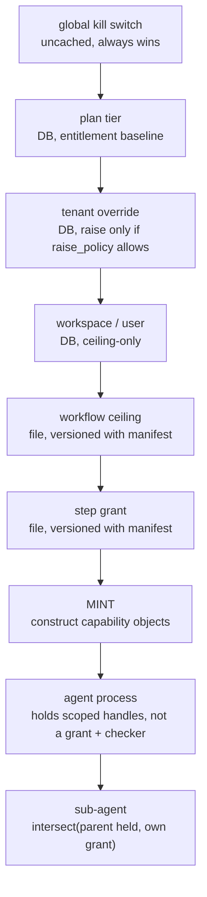

# Target design — capability system

**Date:** 2026-08-16
**Status:** proposed, not approved
**Synthesis of:** [diagnosis](report-diagnosis.md) ·
[permission patterns](report-agent-permission-patterns.md) ·
[capability confinement](report-capability-confinement.md) ·
[runtime caps](report-runtime-caps-multitenancy.md)

---

## The one structural change

```
today   compute permissions → build full toolset → check a flag → maybe allow
target  compute permissions → build the toolset FROM them → ungranted tool never exists
```

Decide at **mint time, not use time**. This is the Capsicum/WASI model, and it is what makes
our actual bug — a permission computed correctly and never read — *unrepresentable* rather
than fixed-for-now.

Everything else in this document is supporting structure.

---

## Requirements this must satisfy

| # | Requirement | Source |
|---|---|---|
| R1 | Tool access is declared in the workflow, never decided by an `if/else` in code | stated |
| R2 | Read/write/exec/network are explicit named flags, not opaque set aliases | stated |
| R3 | A request is capped by a ceiling it cannot exceed | existing design |
| R4 | Caps changeable at runtime per tenant, no deploy, ~100s of clients | stated |
| R5 | Existing workflows must not break | non-negotiable |
| R6 | A text-only agent can never acquire write | the defects |
| R7 | Token budget enforceable mid-run | the 2.3 M run |

---

## Three axes, separated

`TIER_PIPELINES` merges these. They differ by orders of magnitude in frequency.

| Axis | Question | Frequency | Store |
|---|---|---|---|
| **Entitlement** | Does the plan include this capability? | once per run | Postgres |
| **Capability** | May this run hold this tool? | per tool grant | in-memory, resolved at start |
| **Quota** | How much consumed? | per LLM call | Redis |

---

## Layered resolution



**One-way narrowing.** Each layer may only attenuate. Validated against four independent
kernel implementations — Linux bounding sets, `no_new_privs`, seccomp filter replacement,
Capsicum `cap_rights_limit` — all of which permit reduction and forbid expansion.

**Per-capability raise policy.** Not one global rule:

```
raise_policy: none                        exec, network — hard ceiling
              operator_approval_required   write_files above plan default
              tenant_self_service          max_parallel_agents, model choice
```

Plain override semantics on a security capability lets a lower scope silently escalate. This
is the single most common implementation error in layered config.

---

## Manifest format

Explicit flags, per step. Absent block = read-only, never "deny everything" (that would
break all 85 existing steps) and never "grant everything".

```yaml
steps:
- agent: story-estimator
  # no tools: block → read-only

- agent: app-code-generator
  tools: {write_files: true}

- agent: prototype-build
  tools: {write_files: true}
  extra_tools: [report_task_complete]
```

```
read_files       default TRUE   bounded to the run sandbox
write_files      default FALSE  must be declared
exec             default FALSE  declared + trust-gated
network/internet default FALSE  must be declared
extra_tools      default none   non-filesystem tools
```

> **On read-by-default:** Claude Code is the only researched precedent for a read default,
> and it is narrower than it sounds — read-only, scoped to the working directory, write
> never defaulted. Bounded read-default is defensible; blanket read+write is what caused
> our incidents.

### Retiring the named sets

```
workspace            → nothing extra              pure flags, deletes cleanly
prototype            → report_task_complete       → extra_tools
prototype_emit_only  → identical to prototype     DUPLICATE — delete
planning             → planning tool set          ZERO agents use it — dead
internet             → web_search, web_fetch      → internet: true
```

Only **2 agents** (`prototype-build`, `prototype-validate`) need `extra_tools`. Chrome
Manifest V3 is the precedent for bundle → explicit; no researched system migrated the other
way.

### Keep two layers, fix the format

Both research passes converged here, against the initial instinct to delete `AGENT.md`'s
declaration. Every system with an untrusted author *and* an operator keeps two objects
(K8s `Role`×`RoleBinding`, Android manifest×grant, OAuth registered×consented scopes).

The problem was never that two layers exist — it is that layer 1 is an **opaque alias
resolved by hardcoded tuples** while layer 2 is explicit flags. Make both use the same
vocabulary:

```yaml
# AGENT.md — what this agent type could ever need (capability ceiling)
tools: {read_files: true, write_files: true}

# workflow.yaml step — what this instance gets (grant)
tools: {write_files: false}     # narrows it
```

This keeps the layer that stops a manifest granting `write_file` to an agent whose prompt
says "output only markdown" — while removing the indirection that caused the bug.

---

## Runtime caps

```
routine   (plan downgrade, tenant tightening)
          → applies at the NEXT run's mint
          → pub/sub invalidate + 60 s TTL fallback; seconds is fine
          → in-flight runs keep the ceiling they were minted with

emergency (stop this tenant now)
          → uncached row, checked before every tool grant
          → invalidates live capability tokens regardless of TTL
          → deliberate, logged, separate UI action
```

In-flight runs are **not** retroactively downgraded — that means revoking a capability an
agent holds mid-tool-call. Precedent: cgroup limits lower on a live container without
restart; emergency kill is a distinct action, not a side effect of a routine edit.

### Data model

Full DDL in [report-runtime-caps-multitenancy.md](report-runtime-caps-multitenancy.md).
Two properties that matter:

- **Sparse overrides** — a row exists only where a scope deviates. Raise one tenant's cap =
  one upsert, no deploy.
- **Absence of a row is the deny** — a new capability is one insert into
  `capability_definitions` with `default_value: false`. Existing tenants have no override
  row, so they fall through to deny. **No backfill, ever.**

### Distribution — deliberately boring

```
✓ Postgres (source of truth) + in-process cache + LISTEN/NOTIFY invalidation
✓ Redis for quota counters only
✗ OPA / Cedar          policy-service overhead we don't need
✗ Zanzibar / OpenFGA   wrong shape — user→resource, not capability
✗ LaunchDarkly / etcd  not doing millions of evals/sec
```

At ~100 tenants, resolution happens once per workflow start. We already run Postgres.

---

## Quota

```
Layer 1  per-(tenant, run) token bucket    before EVERY LLM call, not once at dispatch
Layer 2  velocity circuit breaker          rate > ~3× trailing avg → throttle
Layer 3  loop detector                     repeated identical calls
         per-tenant bucket keys            never a shared pool
```

Layer 2 is what catches a runaway. A per-run cap high enough for a legitimate long workflow
is also high enough for a 2.3 M-token loop to do real damage first.

---

## Sequenced adoption

```
1  ceiling admits write_files                                   1 line, unblocks the UI
2  absent step tools: → derive from agent declaration           compiler; R5 back-compat
3  permission → tool-name table; bind FROM permissions          ← the leverage (R6)
4  TIER_PIPELINES dict → capability_definitions tables          R4, caps without deploy
5  kill switch (uncached) + append-only audit log
6  parent ∩ child on sub-agent spawn, tested invariant
7  Redis token bucket + velocity breaker                        R7
8  migrate 25 steps to explicit flags; delete named sets        R1, R2
9  provenance tracking (CaMeL)                                  only if 1–8 insufficient
```

**1–3 fix the bug class. 4–5 deliver runtime caps. 6–8 are hardening. 9 is speculative —
do not build it preemptively.**

### The one-way door

Step 3 changes the factory→runner contract from `exclude_builtin_tools: bool` to an
excluded/granted **set**. The boolean cannot express "read but not write" — which is why
skills-staging had to grant write, and why the runner needed a special case in the current
fix. It has also been misread three times (ISS-004, the `no_tools` preamble, R-22 itself).

Mapping is one table:

```
read_files       False → exclude  read_file, ls, glob, grep
write_files      False → exclude  write_file, edit_file
exec             False → exclude  execute
spawn_subagents  False → exclude  task
```

---

## Migration cost

```
85 steps across 20 workflows

with explicit read declarations:   85 blocks to write
with read-by-default:              25 blocks    ← recommended
                                     23  {write_files: true}
                                      2  + extra_tools: [report_task_complete]
```

Mechanical — every value derives from the current `AGENT.md` declaration. Translation, not
judgement.

**All 10 saved composed workflows already carry `tools:` blocks.** The Composer has been
emitting the correct shape all along; it was being discarded by the closed ceiling.

---

## Operational rules to adopt from day one

1. **Ship every new capability check in log-only mode first.** Review what it would have
   denied, then enforce. This is exactly how R-22 should have landed.
2. **Blast radius is a required field.** Changing a security capability must require
   explicitly selecting scope, and must never default to global.
3. **Two-person approval only on `operator_approval_required` capabilities.** Don't gate
   harmless knobs.
4. **Append-only audit** on every capability change — actor, reason, approver.

---

## Open questions

- **`internet` is workflow-level today** (`capabilities: {internet: true}`), not per-step.
  Moving it to a step flag lets one step be online while siblings aren't — better, but a
  second migration.
- **MCP tools bypass all of this.** `prewarmed_mcp_tools` are unioned in at run-entry and
  force fs on regardless of declaration. Under R1 that's a hole; `ToolPermissions` already
  has an empty `mcp: []` slot for an allow-list.
- **`git` permission** is closed in the ceiling with no stated rationale, same as
  `write_files` was. Likely the same omission.

---

## The line worth keeping

> *"The model is not your authorization layer."*

A system prompt is interpreted guidance, not enforced confinement. `story-estimator` was
told "output ONLY the markdown document" and wrote a 20 KB file anyway. Every control in
this design exists because that instruction is not a control.
