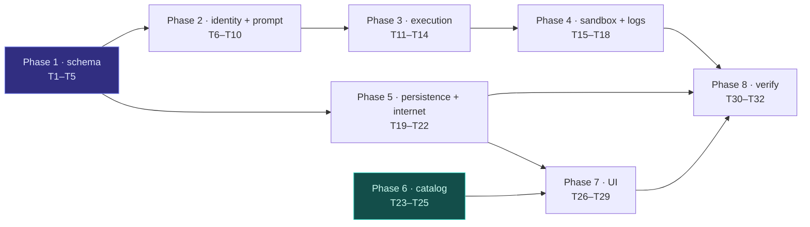

# Implementation Plan: Per-Agent Skills & Composable Custom Agents

**Spec**: [`spec.md`](spec.md) · **Design**: [`design.md`](design.md) · **Clarifications**: [`clarifications.md`](clarifications.md)
**Tasks**: [`tasks.md`](tasks.md)

**Goal.** Make skills a per-step property, make one blank `custom-agent` reusable many times in
a workflow, and let a step own an engine-scheduled group of sub-agents.

**Architecture.** Three seams do the work. The *manifest* gains five step keys and one top-level
key, all inert when absent. The *compiler* flattens sub-agent groups into ordered steps plus
`depends_on` edges and mints a synthetic `custom-agent:<instance_id>` per instance, so the kernel's
existing agent-keyed identity and Kahn topo-sort carry the tree with no scheduler changes. The
*factory* narrows the already-per-agent `stage_skills` call to the step's own skills and adds one
prompt block. Nothing new is added to `execution_engine/engine.py`'s control flow.

**Tech stack.** Python 3.11 · FastAPI · SQLAlchemy + Alembic · PyYAML · `deepagents` 0.6.7 ·
pytest · Next.js / React / TypeScript (composer canvas).

## Global constraints

Copied verbatim from the spec — every task inherits these.

- **Golden snapshots are never re-baselined.** All five characterization manifests must parse and
  compile byte-identically (R-08, AC-03). If a golden changes, the change is wrong, not the golden.
- **Manifests stay pure data (INV-5).** No control-flow or DSL construct gains a home. Strict-key
  rejection stays on at both the top level and the step level.
- **The compiler never imports the kernel.** `agents.workflows ↛ agents.execution_engine`
  (import-linter contract). The compiler imports only stdlib, `agents.workflows.{manifest,plan}`,
  and `agents.capabilities.registry`.
- **No workflow-name or `pipeline_type` branch anywhere (INV-1 / SC-001).** Resolution is by
  declared capability name only.
- **Every validation error NAMES the offending field and the step it appeared in** (R-09).
- **The engine is model-agnostic** (Q15). Any behavior that must hold cannot depend on the model
  following an instruction.
- **Absent means permissive** for `compatible_agents` (R-33): a skill with no list is offered to
  every agent.
- **Run all backend commands from `backend/` with the project venv**:
  `source ../venv/bin/activate` — a bare `python3` resolves the wrong `deepagents`.
- **Never run a state-changing git command.** No `git stash`, `git checkout --`, `git reset`,
  `git clean`, `git restore`. Read-only git is fine. *(This rule exists because a delegate ran a
  bare `git stash` during spec 011 and swept 218 files of unrelated in-flight work.)*
- **Do not commit.** The user commits. Leave changes in the working tree.

## Phases

**Phase 1 — Schema (S1).** Manifest and compiler accept, type-check, and reject the new keys.
Goldens byte-identical. Nothing consumes the fields yet.

**Phase 2 — Identity and prompt (S2, S3, S4).** `custom-agent/AGENT.md`; colon-suffixed
`load_agent_spec`; `Step.skills` → `ctx.step_skills` → narrowed staging; the skill-directive and
roster prompt blocks.

**Phase 3 — Execution (S5).** Compile-time expansion of sub-agent groups into steps plus edges,
for all three modes, to two levels.

**Phase 4 — Sandbox, artifacts, logs (S6).** Universal read+write; `artifact_name()` helper;
engine-side artifact check with `artifact_fallback`; `.logs/run-logs.jsonl`; deliverable filter.

**Phase 5 — Persistence and internet (S7, S8).** `build_manifest_from_dict`; YAML export
endpoint; `attached_skills` migration; `capabilities.internet` and the stub provider.

**Phase 6 — Skills catalog (S9).** `compatible_agents` in loader, API, and picker; the scripted
182-file authoring pass with category review.

**Phase 7 — Canvas UI (S10).** Tree rendering, add/rename sub-agent, per-agent skills picker,
strategy selector, internet toggle.

**Phase 8 — Verification.** Golden byte-identity, full suite against baseline, and the live
`hello_html` Ollama run that gates universal read+write (AC-19).

## File structure

### Backend — modified

| File | Responsibility after this change |
|---|---|
| `agents/workflows/manifest.py` | Adds `capabilities` to the top-level allow-list; exposes `build_manifest_from_dict()`; `load_manifest()` becomes a thin file wrapper over it |
| `agents/workflows/compiler.py` | Adds five step keys; validates instance ids over the flattened tree; expands `subagents` into steps + `depends_on`; mints synthetic agent ids |
| `agents/workflows/plan.py` | `Step` gains `instance_id`, `display_name`, `prompt`, `skills`; `CompiledWorkflow` gains `capabilities` |
| `agents/loader.py` | `load_agent_spec()` resolves `<base>:<instance>` ids |
| `agents/factory.py` | `AgentContext` gains `step_skills` / `step_prompt` / `roster`; staging narrows to step skills; skill-directive block; fs tools bound unconditionally |
| `agents/capabilities/deliverables/serialized_sandbox.py` | Filters the `.logs/` prefix |
| `agents/execution_engine/engine.py` | Populates the new `AgentContext` fields; builds the roster after a child group; artifact check + fallback; writes the run log |
| `app/api/user_workflows.py` | YAML export endpoint; `attached_skills` → per-step migration on read |
| `app/agents/skills_catalog.py`, `app/api/skills.py` | `compatible_agents` parsed and served |

### Backend — created

| File | Responsibility |
|---|---|
| `agents/prompts/custom-agent/AGENT.md` | The blank agent: role-neutral spec + baked preamble |
| `agents/workflows/artifacts.py` | `artifact_name(instance_id, topic)` and `topic_slug(run_input)` — the single source both the preamble and the roster call (F-06) |
| `agents/execution_engine/run_log.py` | `.logs/run-logs.jsonl` writer — one JSON line per lifecycle event |
| `agents/capabilities/tools/internet.py` | The `tool/internet` provider binding `web_search` / `web_fetch` stubs |
| `scripts/derive_compatible_agents.py` | The scripted 182-file authoring pass (R-32) |

### Frontend — modified

| File | Responsibility |
|---|---|
| `components/workflow/composer/CanvasView.tsx` | Tree layout with child connectors |
| `components/workflow/composer/CanvasNode.tsx` | Child rendering, add-sub-agent affordance, inline rename |
| `components/workflow/composer/CanvasConfigRail.tsx` | Per-agent skills picker, prompt editor, strategy selector, internet toggle |
| `types/index.ts`, `store/api/userWorkflows.ts` | Manifest shape for the new fields |

## Testing strategy

Every phase ends green. The three tests that matter most are the ones that catch the failure
modes the design names:

1. **Golden byte-identity** (F-01) — runs at the end of Phase 1 and again at Phase 8. Any drift
   stops the phase.
2. **Flattened instance-id uniqueness** (F-03) — a grandchild sharing a top-level node's
   `instance_id` must fail validation, not silently shadow its artifact.
3. **The live `hello_html` Ollama run** (F-04 / AC-19) — universal read+write changes every
   agent's tool set, which is the exact mechanism that destabilized small models in C-01. This is
   an operator run.

Everything else follows the repo's existing pattern: offline unit tests per module, scripted-model
integration tests for engine behavior, and no live model call in CI.

## Open items carried into implementation

- **T32 (live Ollama verification) is the user's run**, per the standing rule that live model
  runs are not executed by the agent.
- **The 182-file `compatible_agents` pass is scripted, then reviewed by category** — it is the
  largest and least verifiable piece of the plan (RISK-01), and a missed file must degrade to
  compatible-with-all rather than to an invisible filter.
