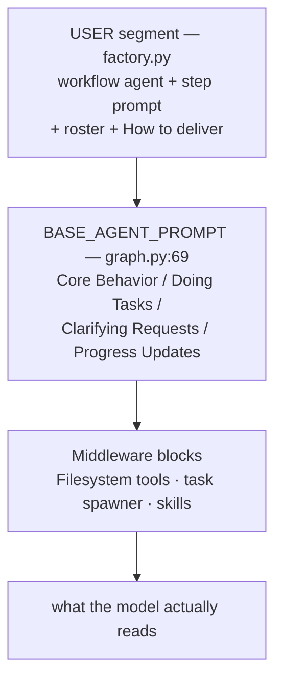

# Composed workflows — the prompt and the runtime describe different systems

## Verdict

- **The unifying root cause [CONFIRMED]**: every canvas setting is enforced at the
  **mechanism** layer and absent from the **prompt** layer. The model only sees the
  prompt. `planner: skip` still renders a "Deep Planner Analysis" block; `clarify:
  skip` does not stop the agent asking questions (different mechanism, same word);
  `spawn_subagents: false` is a no-op while ~500 tokens still document a `task` tool
  that cannot be called. The agents are told they may ask questions, read files, and
  spawn sub-agents — the three behaviours the step prompts forbid.
- **Root cause C (NEW, dominant) [CONFIRMED]**: `deepagents`' `BASE_AGENT_PROMPT` is
  appended **after** our composed prompt (`graph.py:790-796`) and explicitly licenses
  the observed failures. `## Clarifying Requests` → the River-run parent asked the user
  to clarify instead of writing HTML. `## Doing Tasks` ("Understand first — read
  relevant files") → the cat-run Apple Writer hunted for a file named `cat` despite its
  prompt saying "Do not look for files". This is deterministic, affects every agent in
  every run, and sits last in the prompt where attention is highest.
- **Root cause A (brief injection) [CONFIRMED, severity downgraded]**: `engine.py:8775`
  injects `=== ORIGINAL USER REQUEST === <brief>` into every step including children
  with complete authored prompts. Real, but see the CORRECTION below — my earlier
  "contaminated in 4 of 5 runs" claim was invalid.
- **Root cause B (ghost CURRENT TASK block) [CONFIRMED]**: deterministic for children
  (15/15 across all runs), intermittent for the parent (3/7 runs) via a shared-scratch
  race. Both parts trace to `parallel_group` being the first caller with empty worker
  inputs and the first *concurrent* caller of `run_agent`.
- **Root cause D (NEW) [CONFIRMED]**: `planner: skip` substitutes a *fake* planning
  context rather than none (`engine.py:1862-1866` → `:3093-3096`), so the prompt claims
  an analysis that never ran and echoes the brief a second time for zero information.
- **The fix surface is better than previously reported**: root cause C lives entirely in
  `factory.py` / `deep_agent_runner.py` + a startup profile registration. No kernel, no
  engine, no fan-out caller touched — which satisfies the user's stated constraints
  better than any fix proposed earlier in this investigation.

## CORRECTION to the prior report

`task-prompt-injected-into-output.md` and my in-session summaries claimed
brief-contamination "in 4 of 5 runs". **That claim is withdrawn** [CONFIRMED wrong].

The workflow was edited mid-experiment at `2026-08-13 11:55:35.96` (DB `workflows.updated_at`),
changing all three child prompts to *"Write one short joke about an apple **and given
brief**"*. Every run from `8e249641` onward was therefore **instructed** to incorporate the
brief. That contamination was the user's own directive being obeyed, not a defect.

Corrected finding: on unmodified prompts, unwanted contamination appeared in **2 of 3** runs.
Methodological lesson recorded: re-read the manifest per run instead of assuming config is
static across an experiment.

## Symptoms

- **Expected**: three children write jokes on their own topics; the parent assembles them
  into `output.html`.
- **Actual**: varies per run — children answer the brief instead of their prompt; the
  parent occasionally emits a clarifying question as the "HTML"; content is silently wrong
  while the run completes green. [REPRODUCED across 9 runs]
- **Exact error**: none. No exception, no failed step, valid HTML in most runs. Silent
  content corruption. [CONFIRMED]
- **Timeline**: all runs 2026-08-13, all on `anthropic.claude-haiku-4-5-20251001-v1`
  (Bedrock) — verified from `.logs/*.jsonl`. Model was **never** a variable despite an
  intent to change it. [CONFIRMED]

### Full run ledger [REPRODUCED]

| run | time | brief | planner | prompts | children off-prompt | parent task leak | output.html |
|---|---|---|---|---|---|---|---|
| `bcebf499` | 10:01 | — | skip | OLD | — | — | markdown, not HTML |
| `848876d0` | 10:51 | cat | skip | OLD | 1/3 catastrophic | **LEAK** | valid HTML, wrong page |
| `2c6974ee` | 11:44 | River | **run** | OLD | 2/3 | clean | **not HTML** — refusal prose |
| `fd971362` | 11:51 | Zebra | skip | OLD | 0/3 | **LEAK** | valid HTML, correct |
| — | **11:55:35** | — | — | **WORKFLOW EDITED — "and given brief" added** | — | — | — |
| `8e249641` | 11:55 | dog | skip | NEW | *instructed* | clean | valid HTML |
| `f631c591` | 11:57 | lion | skip | NEW | *instructed* | clean | valid HTML |
| `030ecf52` | 12:00 | fish | skip | NEW | *instructed* | **LEAK** | valid HTML |
| `4e29c90b` | 12:03 | tiger | skip | NEW | *instructed* | clean | valid HTML |

Parent leak fired in **3 of 7** parallel runs — same code, same workflow. Children received
the ghost block in **15 of 15** dispatches.

## Prior art

| ID | Relationship | What it tells us |
|---|---|---|
| `parallel-subagents-no-html.md` [HISTORY] | Prior session, same workflow | Deliverable-strategy root cause. Its fix (`single_file`) is applied and **verified working** — `output.html` now written correctly in every run. Closed. |
| `task-prompt-injected-into-output.md` [HISTORY] | Immediate predecessor | Root causes A + B. Still valid; severity of A downgraded here, and root cause C was missed entirely because that investigation never read a composed **system** prompt. |
| `ISSUES-subagents-strategies.md` defect #1 [HISTORY] | Same family | Injected boilerplate dominating weak-model output; mitigated for the delivery line by the headed `## How to deliver` block (`factory.py:564-573`). Root cause C is the same pathology one layer up, in the library's own preamble. |
| `kernel_services.py:1041-1048` in-code comment [HISTORY] | Pre-dates this session | "three 'write one short line' workers ... wandering through ls/glob/read_file, and one wrote the wrong subject entirely" — root cause C was already visible in the wild and was attributed to worker economics rather than the preamble. |
| `backend/CLAUDE.md` (Tool Sets) [HISTORY] | **Stale doc** | Claims "the library sub-agent dispatch tool (`task`) is always excluded so the model cannot spawn its own sub-agents". True of the *tool*; false of the *prompt*, which still documents it in full. |

## Hypotheses

| # | Hypothesis | Status | Killing/confirming evidence |
|---|---|---|---|
| H1 | Deliverable strategy still misrouting | **[RULED-OUT]** | `output.html` present and well-formed in 7/8 post-fix runs; parent's `## How to deliver` reads `write_file` → `output.html`. |
| H2 | Malformed HTML generation | **[RULED-OUT]** | Every failure produced structurally valid HTML (DOCTYPE + `</html>`). The format instruction always held; only content lost. |
| H3 | Parent never receives the children's outputs (roster broken) | **[RULED-OUT]** | Parent system prompt carries the roster verbatim: `- Apple Writer → 1krppp8-gai0pd-tiger.md` ×3. `_build_roster` (`engine.py:3266`) + compiler `depends_on` wiring (`compiler.py:652`) both correct; dog/lion parents demonstrably pulled all three jokes into the page (grep-verified). |
| H4 | A stronger model would resist it | **[RULED-OUT]** | All 9 runs used the same model (`haiku-4-5`, Bedrock). The "successful" Zebra run was one lucky draw, not a model change. |
| H5 | `planner: run` boilerplate is the amplifier | **[RULED-OUT]** | dog/lion/fish/tiger all ran `planner: skip`; behaviour indistinguishable. Planner mode is not the differentiator. |
| H6 | Brief injected into steps that have their own prompt | **[CONFIRMED — root cause A]** | Persisted `agent_input` for every run; cat-run Apple Writer answered the brief as a file query. Severity corrected downward (2/3, not 4/5). |
| H7 | Ghost CURRENT TASK + parent scratch race | **[CONFIRMED — root cause B]** | 15/15 children; parent leaked in 3/7 with `task_number=None` on its own dispatch. |
| H8 | The library's BASE prompt contradicts the step prompts | **[CONFIRMED — root cause C]** | System prompts supplied by the user; `graph.py:790-796` appends `BASE_AGENT_PROMPT` after ours. River-run refusal text is a near-verbatim enactment of `## Clarifying Requests`. |
| H9 | `planner: skip` still emits a planning block | **[CONFIRMED — root cause D]** | `engine.py:1866` substitutes `_default_planning_context`; `engine.py:8777` renders it unconditionally. |

## Root causes

### C — the library preamble overrides the workflow's instructions

`deepagents 0.6.7`, `graph.py:790-796`:

```python
base_prompt = _apply_profile_prompt(_profile, BASE_AGENT_PROMPT)
...
final_system_prompt = system_prompt + "\n\n" + base_prompt   # OURS first, LIBRARY last
```



Three contradictions, each tied to an observed failure:

| # | Library text | Step prompt says | Observed failure |
|---|---|---|---|
| C1 | `## task (subagent spawner)` + "Available subagent types: general-purpose" (`middleware/subagents.py:390`) | `spawn_subagents: false` | ~500 wasted tokens documenting a tool hard-filtered at `deep_agent_runner.py:91-93` — uncallable |
| C2 | "If the request is underspecified, ask only the minimum followup needed" + `## Clarifying Requests` | "Output ONLY valid HTML... No prose" | **River run**: parent wrote *"Could you please clarify: 1. What specific task would you like me to help you complete?"* into `output.html` |
| C3 | "**Understand first** — read relevant files, check existing patterns" | "Do not look for files or ask questions" | **cat run**: Apple Writer produced *"There is no file named `cat` in `/`"* instead of a joke |

### D — `planner: skip` fabricates a planning context

`engine.py:1862-1866` → `_default_planning_context` (`engine.py:3093-3096`) sets
`inferred_intent = user_message[:200]`; `engine.py:8777` then renders
`## Planning Context (Deep Planner Analysis)` / `**Inferred Intent**: <brief>` — a header
asserting an analysis that never ran, plus a verbatim second copy of the brief already
present immediately above it.

### A and B

Unchanged from `task-prompt-injected-into-output.md`; see that report for the full chains.
A: `engine.py:8775`. B1: `kernel_services.py:1084-1090` passes `task_number` unconditionally
while `parallel_group.py:113-118` sends empty input by design; filler substituted at
`engine.py:8939-8941`. B2: `kernel_services.py:1317-1354` save/restore on the shared
`ectx` while three `run_agent` calls run concurrently under `asyncio.gather`.

### Why none of it was caught

- No test asserts a composed step's **system** prompt is free of contradictory guidance —
  the goldens pin our segment, never the library's appended segment. [CONFIRMED by absence]
- `backend/CLAUDE.md` documents the `task` exclusion as total, so the prompt leak was
  invisible to anyone reading the docs instead of a live prompt. [CONFIRMED]
- Every failure mode is silent: green run, non-empty deliverable, usually valid HTML.

## Blast radius

- **Root cause C: every agent in every pipeline**, registry and composed alike — the
  preamble is model-keyed, not workflow-keyed. Registry pipelines tolerate it because
  their agents' jobs align with generic assistant behaviour; composed workflows with
  narrow authored prompts are where it bites. [CONFIRMED]
- **Root cause D: every run with `planner: skip`**, including registry pipelines that
  declare it — must be enumerated before any fix. [OPEN]
- **Root cause B1: every `parallel_group` child** (empty input by construction), plus
  `fanout_batch.py:102`'s `count` fallback when zero tasks parse (only `sample_fanout`
  declares `count`). [CONFIRMED]
- **Root cause B2: every `parallel_group` parent**, intermittently (~43% observed). [CONFIRMED]
- Unaffected: prototype build loop (never routes through `run_worker` — `fanout.py:409`
  is the sole caller), characterization goldens (pin the `is_build` path), `test_sc001_fanout`
  (real task bodies). [CONFIRMED]

## Recommended fix

Ordered by blast radius, mapped to the user's constraints: (1) don't affect existing kernel
fan-out callers, (2) don't change behaviour for working workflows, (3) minimal kernel/engine
change, (4) make parallel agents reliable in complex runs.

### Tier 1 — zero kernel, zero engine

| Fix | Location | Mechanism | Blast radius |
|---|---|---|---|
| **C1** — drop the `task` docs + tool | `deep_agent_runner.py:388` | `GeneralPurposeSubagentProfile(enabled=False)` → `inline_subagents` empty (`graph.py:658-659`) → `SubAgentMiddleware` never constructed (`graph.py:724-726`) → no tool, no prompt block | All agents; strictly removes a capability already blocked. Makes the existing `_ToolFilterMiddleware` `task` exclusion redundant. |
| **C2/C3** — replace the library BASE | startup profile registration | `HarnessProfile(base_system_prompt=...)` **replaces** `BASE_AGENT_PROMPT` (`graph.py:120`, `:790`) — no middleware excluded | All agents on that model key. Requires authoring a minimal replacement preamble. |
| **B2** — parent scratch leak | `parallel_group.py:193` | clear the task scratch before phase 2; `strategy.run(step, ectx)` (`engine.py:7084`) means the strategy already holds the ExecutionContext | `parallel_group` only |

### Tier 2 — one kernel expression

**B1**: `kernel_services.py:1086` → `task_number=worker_index + 1 if input else None`.
Affects only falsy-input `run_worker` calls: `parallel_group` (always) and `fanout_batch`'s
`count` fallback (degenerate, same bug there). Strict-compliance alternative is an additive
opt-in kwarg threaded `parallel_group → run_fanout → run_worker` — zero impact by
construction, at the cost of permanent kernel API surface.

### Tier 3 — engine, gated (defer pending Tier 1 results)

**A**: gate the `ORIGINAL USER REQUEST` framing on `ectx.current_step.prompt` being
non-empty — the same R-16 parity gate already used at `engine.py:3814`, `""` for every
non-custom-agent step, therefore provably byte-identical for all registry pipelines.
**D**: suppress the planning block when the planner was skipped.

Both are engine changes and should wait until Tier 1 + 2 are measured, because root cause C
plausibly accounts for most of the observed damage on its own.

### Constraints on any fix

- INV-1 (no workflow/agent-name branches), INV-3 (`test_skill_prompt_baseline.py` + the 17
  characterization goldens byte-identical), INV-5 (no new manifest keys — the
  `step_prompt`-presence gate needs none), INV-12 (`run_fanout` remains the single spawn home).
- `HarnessProfile` is **beta** in `deepagents 0.6.7` ("may receive minor changes"). Pin the
  version if building on it.
- Profiles are keyed by provider or `provider:model`, **not** by step — per-step manifest
  settings cannot ride them and must be composed into the `system_prompt` (USER) segment by
  `factory.py::_compose_system_prompt`.

### Separately: a UI-honesty defect

`spawn_subagents` is `user_allowed=False` at the registry (`factory.py:960-965`), so a
user/DB manifest can never grant it, and it binds the fan-out request emitter rather than
the library's `task` tool. The canvas toggle therefore has no runtime effect in either
position. Either enforce it or remove it from the composer. [CONFIRMED]

## Verification plan

- **Fails now**: assert a composed custom-agent system prompt contains no
  `## Clarifying Requests`, no `## task (subagent spawner)`, and — for a `parallel_group`
  child — no `=== CURRENT TASK ===`; assert a `planner: skip` context message contains no
  `## Planning Context`. All four fail today.
- **Passes after**: same assertions per tier landed.
- **Live** (user-run only — never run live LLM evals from the agent side): re-run the
  workflow **with the child prompts reverted** to remove "and given brief", across ≥3 briefs
  including one command-colliding word (`cat`) as the regression sentinel. Compare
  off-prompt rate against the 2/3 baseline.
- **Regression**: `python3.11 -m pytest tests/agents/ tests/unit/` — especially
  `test_skill_prompt_baseline.py`, `test_compiler_subagents.py`, the characterization
  goldens, and any fanout/parallel_group suites.

## Open questions

- **[OPEN]** Which registry pipelines declare `planner: skip`, and would suppressing the
  planning block change their behaviour? Resolve before fixing root cause D.
- **[OPEN]** What minimal `base_system_prompt` preserves the behaviour registry pipelines
  genuinely rely on (progress updates, tool discipline) while dropping the clarify/read-files
  licences? Needs authoring plus a golden re-baseline.
- **[OPEN]** Does removing `SubAgentMiddleware` entirely affect anything else in the stack
  (skills staging, message eviction)? Verify against `tests/agents/` before landing C1.
- **[OPEN]** True off-prompt rate with unmodified prompts — n=3 is thin. Needs ~10 runs.
- **[ASSUMED]** The user's canvas edit at 11:55:35 was intentional experimentation, not an
  attempted fix; the child prompts should be reverted before further measurement.
