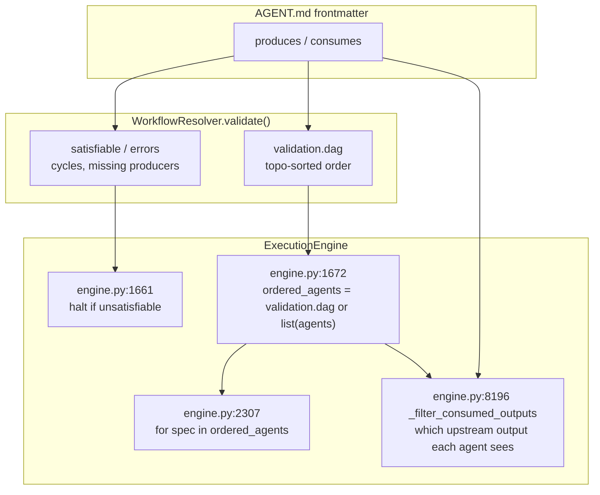

# REPORT — who should own the workflow DAG: the agents, or `workflow.yaml`?

Decision analysis. Question posed: *should we remove the agent-built DAG and make
`workflow.yaml` the single source of truth for structure, leaving agents free to be
used by any workflow that needs them?*

> **Tracking status: not yet decided.** This report's own verdict below (workflow.yaml
> should own structure and order, unconditionally) has NOT been accepted or rejected. A
> narrower fallback came out of a sibling investigation instead — declared order wins
> only when a step already carries `depends_on` — and `engine.py` still falls back to
> `validation.dag` otherwise (verified live). See `../ADR.md`'s Open questions.

## Verdict

**Yes. `workflow.yaml` should own structure and order. Agents should be free, reusable, order-agnostic capabilities.**

The decisive fact is that `produces`/`consumes` is not a type system in this codebase. 72 of 87 agents declare `produces: [<their own agent id>]`. Seven more (all of `chat`) declare nothing. The only 8 agents using genuine shared type names — `spec`, `plan`, `tasks`, `research`, `constitution`, `analysis_report`, `clarifications`, `planning_context` — all belong to `spec_kit`, which no `workflow.yaml` references, which the resolver reports **unsatisfiable**, and which never runs.

So in every pipeline that actually executes, `consumes: ["material-analyzer"]` means exactly *"run after material-analyzer."* That is `depends_on`, written backwards, stored on the agent instead of the workflow — which is why an agent can only ever belong to one pipeline.

Do **not** delete `produces`/`consumes`. Stop letting it decide sequence. Ordering and context-routing are two separable jobs riding on one declaration; move the first, keep the second.

## Evidence from this codebase

### `produces` is self-referential

Counted across all 87 loadable agents:

| shape | count |
|---|--:|
| `produces: [<own agent id>]` | **72** |
| `produces: []` | 7 (all `chat`) |
| `produces: [<a real shared type>]` | 8 (all `spec_kit`) |

The 8 exceptions, verbatim:

```
deep-planner         ['planning_context']
constitution-agent   ['constitution']
specify-agent        ['spec']
clarify-agent        ['clarifications']
research-agent       ['research']
plan-agent           ['plan', 'data_model', 'contracts']
tasks-agent          ['tasks']
analyze-agent        ['analysis_report']
```

All `pipeline_type: spec_kit`. No `workflow.yaml` references any of them, so `compile_for_run("spec_kit")` raises `FileNotFoundError` and the pipeline is not dispatchable. Most of those types have zero consumers. The resolver reports it `satisfiable: false` — *"Agent 'clarify-agent' consumes 'brief' but no upstream agent produces it."*

The one place the type system is used as designed is dead code.

### No agent is reused across pipelines

A scan of all 16 `PIPELINE_AGENTS` keys finds **zero** agent ids appearing in more than one pipeline. The reuse that `produces`/`consumes` was built to enable has never happened — because `pipeline_type` is a single required string, and `consumes` hardcodes sibling agent ids.

### The composer already deleted its contracts

All nine `custom` agents:

```
market-research-agent    consumes=[]
swot-analyst             consumes=[]
roadmap-planner          consumes=[]
security-auditor         consumes=[]
test-case-generator      consumes=[]
performance-optimizer    consumes=[]
documentation-agent      consumes=[]
report-generator         consumes=[]
task-list-planner        consumes=[]
```

`FIX-061` records why: *"Custom utility agent combinations fail with DAG unsatisfiable — all 8 custom agents had rigid consumes chain."* The fix was to strip `consumes` to `[]` on 7 of 8, because any partial selection of a rigid producer chain is unsatisfiable.

**Consequence:** for `custom`, `validation.dag` returns the input list unchanged. The resolver contributes nothing. This is the pipeline the resolver was designed for (`specs/001-ai-workflow-os/spec.md:141` — *"As a power user, I want to compose arbitrary agent DAGs from any agent in the arsenal"*), and the team already removed the mechanism there rather than lean on it.

### The order-independent checker already exists

`CWF-001` records the coupling: *"`WorkflowResolver` satisfiability is declared-order-dependent: `resolver.py:119` counts a producer only if `idx < consumer_idx`... Yet the engine executes in topo order anyway — so declared order gates satisfiability but not execution: the inconsistency."*

The response was `WorkflowResolver.presort()` (`resolver.py:192`) plus `app/api/composition_order.py` — an order-independent pass bolted in front of the still-order-dependent `validate()`. The workaround for this exact problem is already shipped and can carry the satisfiability job after ordering moves.

## Two separable jobs



| job | site | verdict |
|---|---|---|
| **ordering** | `engine.py:1672` | **move to the manifest** |
| **satisfiability** | `engine.py:1661` | **keep** — switch to `presort()` |
| **context routing** | `engine.py:8196` | **keep for now**, move to the step later |

One coupling matters for the migration: `_filter_consumed_outputs` walks `ordered_agents` and stops at the current agent, so whichever list defines order also defines the eligible upstream set. Changing order changes routing. This is why the first migration step must be *reorder to match*, not *switch and observe*.

Note also that `_latest_typed_content` (`engine.py:6353`) fetches content keyed purely by producer **agent id** — it never selects among multiple types one agent might produce. The routing side does not need type matching; it needs "is this upstream agent in my consumes set."

## What history says

- **The resolver predates the manifest compiler.** It is Phase 1 (`specs/001-ai-workflow-os/`); the manifest compiler is Phase 4 (`.planning/phases/04-manifest-compiler-1a/`). Topo-sort-by-contract was the only ordering mechanism that existed when it was designed. `specs/001-ai-workflow-os/contracts/workflow-resolver-api.md:44-48` defines `resolve_execution_order()` returning the topo order — contract from day one, before any manifest competed with it.

- **Phase 4 deliberately kept it**, `.planning/phases/04-manifest-compiler-1a/04-04-SUMMARY.md:88`:

  > *"Membership vs DAG order: the engine executes in the resolver's topo-sorted `validation.dag`, which legitimately reorders contract-coupled agents in the code-gen pipelines (dotnet/mulesoft/app_builder). The compiled plan (authored in registry membership order) is therefore asserted against the registry MEMBERSHIP source, not `validation.dag`. Execution order is unchanged → byte-identical (proven by the snapshots). **This corrected an initial assertion that compared against `validation.dag` and tripped on the three code-gen pipelines.**"*

  So the team first asserted `compiled.steps == validation.dag`, it failed on three pipelines, and they weakened the assertion rather than reconcile the orders. A correct call for a migration contracted to change nothing (INV-3, the five goldens) — but it was a migration-safety decision, not a judgment that agent-owned ordering is architecturally right. It has outlived the migration.

- **`INV-7` does not apply here.** `.knowledge/INVARIANTS.md:17` reads *"The engine decides, never the manifest (merge stays engine-selected — no merge picker)"*. The parenthetical is the scope — fan-out **merge strategy**, corroborated by `FANOUT-USER-FACING-SCOPE.md:45`. It does not govern step ordering; treating it as such is a misreading.

- **`INV-5` does apply.** *"No DSL — control-flow keys stay rejected."* A flat, declarative `steps:` list with optional `depends_on` satisfies it. Anything resembling conditionals does not.

## Industry practice

| System | Where dependencies live | Why |
|---|---|---|
| Airflow | `>>` / `set_downstream` in the DAG file | Operators are reusable and dependency-free; the DAG author owns graph shape per pipeline |
| Argo Workflows | `dependencies:` in `templates[].dag` | Templates are pure units of work; the DAG spec is the composition |
| GitHub Actions | `needs:` on each job in the workflow | The workflow file solely owns job ordering; the same action is reused across workflows with different `needs` |
| Temporal | Imperative workflow code — `await activity1(); await activity2()` | Activities are stateless and order-agnostic; the workflow function is where sequencing lives |
| Prefect | The `@flow` function body composes `@task`s | Same imperative composition, decorator-based |
| LangGraph | `add_edge` / conditional edges in the graph builder | The graph owns edges; nodes are reusable functions |
| CrewAI | `Crew(tasks=[...])` order, or a hierarchical manager | Crew composition is the DAG; agents are reusable across crews |
| AutoGen | Orchestrator (`GroupChat`, `RoundRobinGroupChat`) | Agents declare no dependencies; the orchestrator sequences |
| n8n | `connections` in the workflow JSON | Nodes are a reusable catalog; edges belong to the workflow |
| **Dagster** | **Inferred from the asset graph** — `@asset` params reference upstream asset keys | **The deliberate exception** — see below |

**The convention:** dependency edges live with the **composition**, not the **reusable unit**, because the same unit is expected to appear in many graphs with different neighbours each time.

## When the agent-owned model is right

Dagster earns its exception by requiring three things:

1. A stable, meaningfully-typed namespace of outputs referenced by name across jobs
2. Assets genuinely shared across many pipelines — that is the entire value proposition
3. Producers/consumers decoupled from any one pipeline's identity — `cleaned_orders` belongs to the data model, not to a job

VELOCITY-AI meets none of them: 83% of `produces` values are the agent's own id (a private single-use label), zero agents are reused across the 16 pipelines, and the one sub-graph using real shared names is unreferenced and unsatisfiable. Adopting Dagster's ordering model without first building that namespace formalizes a fiction.

## Benefits of switching

- **One agent, many workflows** — without inventing fake shared `produces` names to satisfy the resolver
- **Template instances work** — N instances of `custom-agent` share one `AGENT.md` and therefore one set of contracts; the resolver structurally cannot order them, the manifest already does via `depends_on`
- **The composer stops needing `presort()` as a patch** — order-independence becomes structural
- **Parallel branches get a home** — explicit edges say which steps are independent; self-referential `produces` says nothing you didn't already write down
- **`workflow.yaml` becomes truthful** — today 3 of 14 pipelines show an order they have never executed in

## Risks and what protection is lost

- **Cross-cutting satisfiability as a safety net.** Today a mis-declared `consumes` fails loudly for all pipelines. Keep `presort()` running as a pre-flight check and this is retained.
- **The implicit contract-coupling signal.** If a hand-authored manifest drifts from real data dependencies, nothing in the manifest format catches it — unless `presort()`/`validate()` keeps running as a lint pass.
- **A naive switch is NOT neutral.** Because `_filter_consumed_outputs` walks `ordered_agents`, changing order for the 3 code-gen pipelines also changes each agent's upstream set — a real behavior change, and `app_builder` has a golden. Step 1 below exists specifically to avoid this.
- **INV-5 constrains the syntax.** `depends_on` per step is fine; conditionals are not.

## Migration path

**Step 1 — reorder 3 manifests to match their current DAG.** `app_builder`, `dotnet_to_azure`, `mulesoft_to_springboot`. Data-only, zero code. Runtime is unchanged because the DAG already dictates execution — the manifest is being edited to describe what already happens. Goldens cannot move. Afterwards, plan order == execution order for all 14, and the assertion at `engine.py:1717` could even be tightened from set to exact-order equality with no behavior change. **This is the provably-neutral checkpoint.**

**Step 2 — flip `engine.py:1672`** from `validation.dag` to the plan-sourced list. Provably a no-op given step 1.

**Step 3 — keep `presort()` for satisfiability, stop reading `.dag`.** Preserves `specs/001-ai-workflow-os/spec.md:146` ("reject unsatisfiable workflows before any agent runs") without ordering authority.

**Step 4 — leave `produces`/`consumes` for context routing.** No change needed; routing only cares about relative position in whatever list it is handed.

**Step 5 — move `consumes` onto the step.** The one that actually frees agents. While `consumes` names sibling agent ids in `AGENT.md`, an agent stays welded to one pipeline no matter who owns ordering. Retire the 72 self-referential `produces` at the same time.

## The open question a human must answer

Step 1 freezes the current DAG order for those three code-gen pipelines into their manifests. Both orders are contract-valid — `app-devops` and `app-test-compliance` have no dependency between them, so the graph genuinely cannot say which should go first, and two pieces of code made two different arbitrary choices.

Freezing the DAG order preserves today's behavior exactly, which is the safe default. But it also blesses an arbitrary tie-break as intentional. Someone who knows what those agents do should confirm the order is *desired* and not merely *what happens* before it gets written down as the spec.
