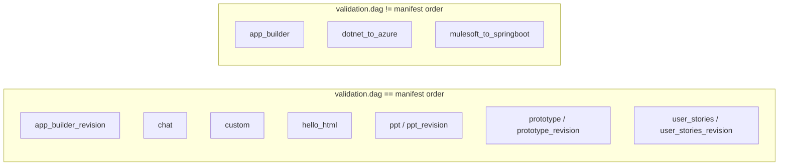

# DAG validation bypass — the `depends_on` ordering branch

Investigation of the change at `backend/agents/execution_engine/engine.py:1699-1709`
on branch `fix/hardcoded-agents-registry`.

> **Verdict: SPEC012-ADR-03.** Adopted, narrower than this report's own recommendations
> below — declared order wins whenever a step carries `depends_on`, rather than scoping
> the override to the connected component or restricting who may author the key. See
> `../ADR.md`.

## The change

```python
# before
ordered_agents = validation.dag or list(agents)

# after
if any(getattr(s, "depends_on", None) for s in compiled.steps):
    ordered_agents = list(agents)          # already topo-sorted by the compiler
else:
    ordered_agents = validation.dag or list(agents)
```

`validation.dag` is produced by the contract resolver, which topo-sorts agents by `produces:`/`consumes:` declared in each `AGENT.md`. That inferred ordering cannot order composed workflows whose steps are repeated instances of one template (`custom-agent:emoji`, `custom-agent:fact`, …), because they all load the same contract-free `AGENT.md`. The declared ordering lives in `workflow.yaml` as `subagents:` nesting, which `WorkflowCompiler` turns into `depends_on` edges and topo-sorts.

## Verdict

**The bypass does not skip satisfiability validation.** `self._resolver.validate(agents)` still runs unconditionally (`engine.py:1672`) and the engine still halts on cycles and unresolved `consumes` before any agent runs (`engine.py:1689-1697`) — that check sits *before* the new branch, untouched.

What the branch skips is purely the **ordering** step: for any compiled plan carrying a `depends_on` edge, execution order reverts from the resolver's contract-inferred topological order to declared/manifest order.

The real risk is not today's workflows. None of the file-backed manifests declare `depends_on`, and the only workflows that synthesize it (`sample_subagents`, `sample_fanout`, `sample_wave`) are demo/shape-test pipelines whose steps are contract-free `custom-agent` templates, so the two orderings are identical for them. The latent risk is structural: `depends_on` is already a legal step key (`compiler.py:97`) an author could hand-write on an ordinary manifest, and three **production** code-gen pipelines have `validation.dag` order that differs from manifest order. Adding a single `depends_on:` line to any of those would silently revert their execution order — no error, no warning, no test.

## What the resolver actually does

`backend/agents/execution_engine/resolver.py`, `WorkflowResolver.validate()` (lines 78-177):

1. **Type-exact matching** of `produces`/`consumes`, case-sensitive — lines 103-104, 111
2. **Exempt types** (`planning_context`, `constitution`) always satisfied — lines 29, 113-114
3. **Unsatisfied `consumes` → unsatisfiable.** Only upstream producers (`idx < consumer_idx`) count; a missing producer yields an `UnresolvedEdge` + error (lines 116-132). Any error short-circuits: cycle detection is skipped and `satisfiable=False` returned immediately (lines 150-156)
4. **Multi-producer tie-break** — nearest upstream producer via `max(upstream, key=index)` (lines 134-138)
5. **Cycle detection** via DFS (`_detect_cycles`, lines 264-291) — runs only if step 3 produced no errors (line 158)
6. **Topological sort** via Kahn's algorithm (`_topological_sort`, lines 293-318) → `validation.dag`
7. `presort()` (lines 192-258) is a separate order-independent variant used elsewhere; not on this call path

`validate()` bundles two concerns in one pass: **satisfiability** (1-3, 5) and **canonical ordering** (4, 6). `ValidationResult.dag` is a side effect of the same computation.

## What the bypass skips

Nothing in satisfiability. If a composed workflow's step consumed an artifact nobody produces, the run still halts exactly as before.

What *is* skipped: when any compiled step carries `depends_on`, the engine uses `list(agents)` instead of `validation.dag` — discarding the tie-break/topo-sort output even though it was still computed. For a workflow that both declares `depends_on` and has agents whose contract order differs from declared order, execution silently follows manifest order with nothing surfaced, because satisfiability passes either way.

## Why the resolver exists

`specs/001-ai-workflow-os/spec.md`:

- L59/61 — `Produces_Contract` / `Workflow_Resolver` defined: *"computes the DAG by matching Produces_Contract types to Consumes_Contract types and validates the Workflow before run."*
- L141 — the founding user story: *"As a power user, I want to compose arbitrary agent DAGs from any agent in the arsenal."* The resolver's reason to exist is user-composed, non-manifest DAGs with no other order source.
- L146 — acceptance: the resolver validates and rejects unsatisfiable workflows before any agent runs
- L190 (FR-004) — MUST reject unsatisfiable workflows, MUST complete validation before execution starts
- L248 — every existing pipeline was required to have `produces`/`consumes` reproduce the old `context_from` ordering
- `contracts/workflow-resolver-api.md:1-60` — the formal contract `resolver.py` implements near-verbatim

`backend/CLAUDE.md` restates this as the "live inter-agent routing mechanism ... also read by WorkflowResolver for DAG validation."

Spec 012's `design.md:30` notes only that the compiler "flattens each group into ordered steps plus a `depends_on` edge" — nothing about reconciling this with resolver ordering. **No evidence found** of a written rationale for the engine-level branch beyond its own comment.

## Is `depends_on` a safe discriminator?

**Zero file-backed manifests declare it** — `grep -rln "depends_on" agents/workflows/*/workflow.yaml` returns no matches across 18 files. The only non-empty values come from `subagents:`/`fanout:` expansion (`compiler.py:604-664`), used by three `is_beta: true` demo manifests.

But `depends_on` is in `_ALLOWED_STEP_KEYS` (`compiler.py:88-97`, "forward surface... declared now, consumed Phase 6/7") with no schema restriction tying it to compiler-synthesized composition. A step can hand-declare `depends_on: [other-step]`, and `_validate_dag` (`compiler.py:1253-1297`) accepts it if cycle-free and non-duplicate.

So the discriminator is an accident of nobody having done it yet, not an architectural boundary. And the check is `any(...)` — **one step with `depends_on` flips ordering for the entire compiled plan** (`engine.py:1699`), not just that step.

## Order divergence

Computed live (`WorkflowResolver().validate(get_pipeline_agents(ptype))` vs registry order, sqlite, no network):



- **app_builder** — manifest `… app-code-compliance, app-test-implementation, app-test-compliance, app-devops, …` → DAG `… app-code-compliance, app-test-implementation, app-devops, app-test-compliance, …`
- **dotnet_to_azure** — manifest `… dotnet-modernization, dotnet-feature-coding, dotnet-azure-bicep, …` → DAG `… dotnet-modernization, dotnet-azure-bicep, dotnet-feature-coding, …`
- **mulesoft_to_springboot** — manifest `… mulesoft-feature-coding, mulesoft-dataweave-translator, mulesoft-aws-infra, …` → DAG `… mulesoft-aws-infra, mulesoft-feature-coding, mulesoft-dataweave-translator, …`

**Important nuance:** both orders are contract-valid. In `app_builder`, `app-test-compliance` consumes `[app-test-implementation, app-code-compliance, app-security-architecture]` (positions 12, 11, 4) and `app-devops` consumes `[material-analyzer, app-infra-generator, app-code-generator]` (1, 10, 8). Neither consumes anything the other produces — no edge between them. These are two valid linearizations of the same partial order, differing only by tie-break. Not a correctness bug.

Aside, pre-existing and unrelated: `spec_kit` is reported `UNSATISFIABLE` (`clarify-agent` consumes `brief`, nobody produces it) — harmless since it has no `workflow.yaml` and never runs standalone (`agents/loader.py:517-524`).

## Test gaps

- `tests/unit/test_workflow_resolver.py` covers the resolver in isolation thoroughly; never reaches the engine branch
- `tests/agents/test_compiler_subagents.py` covers `depends_on` synthesis in isolation; never reaches `ExecutionEngine.execute()`
- `tests/agents/test_sample_wave_workflow.py` is the only test driving `execute()` end-to-end for a `depends_on`-bearing plan, but asserts only that the run completes — it would pass identically on either branch
- No test combines `depends_on` presence with a resolver DAG that diverges from declared order — the one scenario showing a behavioral difference. Untested because no fixture builds it
- No regression test pins `validation.dag` order for the three code-gen pipelines against manifest order

## Recommendations

1. Scope the ordering override to the connected component that actually has `depends_on` edges — or merge `depends_on` into the resolver's own graph before `_topological_sort` — rather than flipping the whole plan on any single step's edge.
2. Add a regression test pinning `validation.dag` order for `app_builder`, `dotnet_to_azure`, `mulesoft_to_springboot` against manifest order. The one guardrail that would catch an accidental future `depends_on`.
3. Restrict `depends_on` authoring — manifest lint rejecting hand-authored values, or pull it from `_ALLOWED_STEP_KEYS` until the dual-order-source design is resolved.
4. Add an engine-level test with `depends_on` present AND a diverging resolver DAG, asserting which order executes.
5. Consider a warn-log when `validation.dag != list(agents)` for a `depends_on` plan.

**See also** `dag-ownership.md`, which argues the branch should be removed entirely by making the manifest the ordering source — a cleaner resolution than narrowing the condition.
