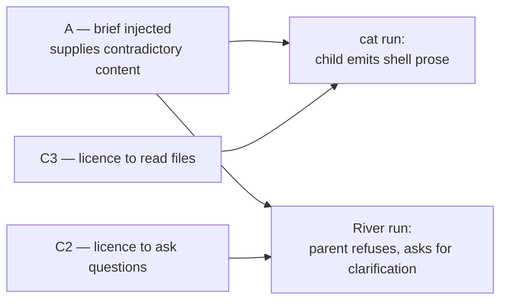

# Outstanding bugs — composed workflows & parallel sub-agents

Severity-ranked. Every entry carries its root cause at `file:line`, the evidence tag
behind it, and whether a fix touches the kernel or the engine.

## Canonical IDs

The letters below are local to this investigation. They were registered on 2026-08-13 as:

> **Re-homed 2026-08-24 (dev merge).** FIX-258/259/260/261 below were originally
> registered under those numbers. The `dev` branch had independently re-homed four
> unrelated infra/auth fixes onto the same ids on 2026-08-17, so on merge this side
> moved to the next free numbers, FIX-290/291/292/293. `.planning/FIX-REGISTER.md`
> now carries dev's rows for 258-261; the cards under `.knowledge/cards/` are
> authoritative for the fixes listed here.

| Here | Canonical | Where |
|---|---|---|
| 0 | FIX-290 | `.planning/FIX-REGISTER.md` |
| D, D2 | FIX-291 | " |
| B1, B2 | FIX-292 | " |
| J | FIX-293 | " |
| K | FIX-262 | " |
| O | FIX-263 | " |
| E, M | FIX-264 | " · decision in **ADR-0012** |
| F | FIX-265 | " |
| H | — | closed as not-reproduced; no code change |
| A | ISS-162 | `.planning/ISSUES-REGISTER.md` (WONTFIX) |
| I | ISS-163 | " (WONTFIX — by design, **ADR-0011**) |
| N | ISS-164 | " (DEFERRED) |
| G | ISS-165 | " (DEFERRED — partially fixed) |
| C1 | ISS-166 | " (DEFERRED) |
| C2 | ISS-167 | " (DEFERRED) |
| C3 | ISS-168 | " (DEFERRED) |
| L | ISS-169 | " (DEFERRED) |

---

## The pattern underneath

Most of these are one shape: **the mechanism layer is correct and the prompt layer
disagrees with it.** The model can only act on the prompt.

| Setting | Enforced at runtime? | Reaches the prompt? |
|---|---|---|
| `planner: skip` | Yes — planner never runs | **FIXED (D)** — block suppressed for composed steps, fresh and resumed |
| `clarify: {mode: skip}` | Yes — but only the *run* gate | No — library still instructs followup questions (**C2**) |
| `spawn_subagents` | Engine-side ceiling only | Removed from the Canvas (**E**) — but ~500 tokens still document the library's `task` tool (**C1**) |
| `write_files` | Never enforceable — the artifact contract requires writing | Now always `true`, toggle removed (**M**) |
| step `prompt` | Yes — reaches the USER segment | Yes — but the library preamble is appended **after** it |
| step `prompt` names a file | **No — by design** | The delivery block names the canonical artifact instead (**I**, ruled not-a-bug). Handoff goes through the roster |

---

## FIXED & VERIFIED

| ID | Defect | Fix | Verification |
|---|---|---|---|
| **0** | No `output.html` produced at all across 10 runs | deliverable `streamed_text` → `single_file` (DB config) | 12+ subsequent runs produce it |
| **D** | `planner: skip` still rendered `## Planning Context (Deep Planner Analysis)` — a verbatim echo of the brief under a header claiming analysis that never ran | Gate in `_compose_context_message` suppressing the block when no planner produced the context AND the step has its own prompt. Flag is `planner_ran: False`, stamped at `engine.py:1957`; gate at `:9520` | Composed: block gone (all runs since, incl. glasses). Registry: **kept** — ppt, od_prototype ×2, prototype_revision all `PLAN-KEPT`; `prototype_revision` golden byte-identical; 3 previously-failing tests green. Resume is covered too — see D2 |
| **D2** | ~~The **D** fix is bypassed on three of five paths~~ — **WITHDRAWN, the claim was wrong** | The three "uncovered" paths were miscounted. `_rehydrate_planning_context` has **exactly one caller** (`:1952`), inside the planner-skip branch, which stamps the flag immediately after at `:1957` — so both resume fallbacks (`:3280`, `:3292`) ARE covered, and the timeout (`:3206`) is covered by `planner_timed_out`. Only `:3209` (the planner raised) is genuinely uncovered, and that is a planner-**enabled** path a custom workflow never takes. What shipped: the rename `planner_skipped` → `planner_ran: False`, at the same call site, plus the De Morgan'd gate at `:9520`. Behaviour-identical to **D** | Rename only — nothing to verify beyond D's own evidence |
| **O** | Roster told a sequential step its predecessor was a **sub-agent** — false since **J** derives `depends_on` for peers too | `engine.py:3595`: `"Your sub-agents have finished. They produced:"` → `"Earlier steps produced:"`. Pure string; no behaviour change | Assertions updated in `test_artifact_fallback_and_roster.py:144` and `test_custom_agent_prompt.py:53,99`. **Not yet run** |
| **J** | Sequential composed steps had **no handoff mechanism at all** — only parallel parents got a roster, because the compiler wires `depends_on` solely for subagent groups | `depends_on` derived from position at serialise time (`userWorkflows.ts` `deriveDependsOn`, `types/index.ts:542`), emitted on every step incl. `[]` | **Confirmed from Writer's live system prompt**: `Your sub-agents have finished. They produced:\n- Brief Builder → 17ha47o-fozd8o-fan.md`. Writer has no `subagents` group, so `_build_roster` (`engine.py:3564-3586`) can only fire on a non-empty `step.depends_on` — the derived value reached the DB, the compiler and `ectx.current_step` |
| **E + M** | Two Canvas tool toggles the runtime could not honour — `spawn_subagents` (inert in both positions) and `write_files: false` (declared by all 5 Topic Page steps, all of which wrote files) | Neither is enforceable: composed steps MUST write their artifact, and `read_files: false` did not block reading — it only stopped the secret-scan hook binding (`hooks/base.py:79`). Fixed by making the manifest tell the truth instead of adding enforcement: `userWorkflows.ts` now emits `read_files: true, write_files: true, exec: false`; the Tools tab shows fixed indicators; `spawn_subagents` removed from the palette (engine keeps its `engine.py:3463` ceiling). Fan-out and retry levers disabled too | Frontend only, `tsc` clean on all four touched files. **Not yet run:** `npm test -- userWorkflows` (2 assertions updated), `npm run build` |
| **H** | Composer "Reset to default" was believed to recreate the broken `streamed_text` + `.html` deliverable pair (i.e. bug **0**) | Closed on evidence, not on a code change — `CanvasView.tsx:881` / `:503-506` were never edited | **Did not reproduce.** cow run, 2026-08-13: the Topic Page manifest reads `{strategy: single_file, name: output.html}` and the run produced `output.html` (1011 B, byte-identical to the final step's artifact). If a broken pair reappears from the Composer, reopen with the manifest that produced it |
| **F** | `backend/CLAUDE.md` claimed the `task` tool is "always excluded" — true of the TOOL, false of the PROMPT. The stale sentence is why **C1** went unnoticed | `backend/CLAUDE.md:465` keeps the (correct) tool-exclusion statement and adds a callout: `SubAgentMiddleware` injects `TASK_SYSTEM_PROMPT` regardless of tool binding, ~500 tokens per agent, with the removal path and the C1 cross-reference | Docs only. Verified against the captured Writer system prompt, which carries the `task` section verbatim including the `general-purpose` listing |
| **B1** | Every parallel child received `Task N of M / Execute ONLY this task from the task list above` — no task list exists | `kernel_services.py:1087` — `task_number=(worker_index+1) if input else None` | Bottle run: all 5 agents `NO TASK BLOCK` |
| **B2** | Ghost block leaked to the parent **and to every sequential step after it** (Writer, Publisher) | Consequence of B1 — no worker sets the shared scratch, so nothing leaks forward | Bottle run: Brief Builder, Writer, Publisher all clean. Contrast confirmed: `prototype-build` keeps its legitimate `Task i/N`, `prototype-validate` after it has none |

**B2 blast radius was under-reported originally.** It was recorded as affecting "every
`parallel_group` parent"; Topic Page proved it persists for **every step after a parallel
group**, because the scratch lives on the run-wide `ectx` and is never cleaned.

**J is what makes the handoff work at all.** The roster is the only line in a step's prompt
naming a file that actually exists — the step prompt's own filenames are not honoured (**I**,
by design). Confirmed twice: `fan` and `glasses`.

---

## SHIPPED — NOT FULLY VERIFIED

| ID | Change | Done | Still unproven |
|---|---|---|---|
| **K** | No DAG validation before writing a manifest to the DB — a cycle saved with a 200 and only failed on first run | `_compile_check_manifest` (`user_workflows.py:75`) hands the manifest to the **real** `build_manifest_from_dict` + `WorkflowCompiler.compile(trust="db")`, so `_validate_dag` runs exactly as the engine runs it. Synthesis mirrors `run_commands.py:1725-1743`. WARNING log on reject, DEBUG on pass. 4 tests added | **Tests never run.** `pytest tests/unit/test_user_workflows.py` — assertions on `"cycle"`/`"duplicate"` wording are brittle to upstream rewording, and pre-existing tests may now 422 if compiling at save is stricter than assumed |

Also unrun: `npm test -- userWorkflows` — the round-trip suite will churn on the new
`depends_on` key.

---

## STILL OPEN

| Rank | ID | Sev | Defect | Root cause | Evidence | Fix touches |
|---|---|---|---|---|---|---|

**Empty.** Everything is fixed, parked, won't-fix or by-design — see the sections below.
**C1/C2/C3, L, N and G are PARKED**: still real, not scheduled.

---

## PARKED — DEFERRED TO A DESIGN

| ID | Item | Owner note |
|---|---|---|
| **N** | `{{topic}}` is never substituted — agents receive the literal string. No template substitution exists in `factory.py` / `compiler.py` / `engine.py`; it only appears to work because **A** injects the run brief separately and the model infers the referent | **Parked, 2026-08-13.** *"This needs to be addressed in advance agent configuration where we create variable and pass it across."* A one-line `{{topic}}` replace in the factory is the wrong shape — the real requirement is author-defined variables, declared once and threaded across steps. Deliberately not fixed as a substitution hack; it belongs to the advanced-configuration design |
| **G** | `streamed_text` deliverable named `*.html` reports mimetype `text/markdown` — `streamed_text.py:41-44` maps by strategy, not filename | **Partially fixed, parked 2026-08-13.** The defect is untouched in code, but its only trigger — the `streamed_text` + `.html` pairing — is no longer produced: the deliverable moved to `single_file` (**0**) and **H** did not reproduce, so the Composer is not recreating the pair. Unreachable in every current workflow and never exercised live. Revisit if `streamed_text` is ever paired with a non-`.md` name again |
| **C1 / C2 / C3** | The deepagents `BASE_AGENT_PROMPT` injections — uncallable `task` docs (~500 tokens), the clarify licence, and the read-files licence | Deferred by the owner. Fixes need `HarnessProfile(base_system_prompt=…)` + `GeneralPurposeSubagentProfile(enabled=False)`; **`HarnessProfile` is beta in deepagents 0.6.7** |
| **L** | Model selection never reaches the runtime — 3 attempts (4b, llama) all ran `claude-haiku-4-5` | Parked with ollama. Lead: `model_factory.py:75` gates ollama on the **global** `settings.OLLAMA` env flag, and `:78` overwrites the per-run model with `OLLAMA_MODEL`. There may be no per-run ollama path at all |

---

## WON'T FIX

| ID | Behaviour | Ruling |
|---|---|---|
| **A** | `engine.py:9495` puts `=== ORIGINAL USER REQUEST ===` as `parts[0]` of **every** step's context message, so composed children receive the run brief framed as the user's instruction alongside their own authored prompt | **Won't fix — owner ruling, 2026-08-13.** It is load-bearing: `{{topic}}` is never substituted (**N**), so the brief is the only channel carrying the subject into a composed step. The proposed demotion (`=== RUN TOPIC ===`, gated on `_own_prompt`) would change every composed step's context message, and every success to date — glasses included — happened *with* the imperative framing. Not worth the regression risk for a failure mode that only bites when the brief is a full sentence competing with a step prompt |

**Follow-on:** **N** stays open but stays masked — it is only invisible because A injects the
brief. Fixing N would make A removable; neither is planned.

---

## BY DESIGN — NOT A BUG

| ID | Behaviour | Ruling |
|---|---|---|
| **I** | `## How to deliver` (`factory.py:558,570-573`) names `deliverable_filename_override or artifact_name(instance_id, topic)`, so a filename the step's own prompt asked for is not the one written | **Not a bug — owner ruling, 2026-08-13.** The block IS the artifact-guarantee mechanism: it gives every step a deterministic, collision-free filename that `_check_artifact_fallback` (T16), `_build_roster` (T17) and the deliverable assembly all agree on. A user-authored filename cannot provide that, and honouring one would desynchronise the three. Removal was trialled and **reverted**: the chain ran, but the roster then advertised 0 B artifacts. Verified working end-to-end on the glasses run — `output.html` 983 B, correct content, assembled from `17ha47o-2m9ig1-glasses.md` |

**Consequence, accepted:** a step prompt that names a file (`"save to paragraph.md"`,
`"read combined.md"`) is silently not honoured, and the model resolves the contradiction
differently run to run — obey the block (glasses, fan), write both (topic-sky), or break the
chain (Tea). Inter-step handoff therefore relies on the **roster**, not on filenames the user
writes into prompts. If this resurfaces, the lever is authoring guidance in the Canvas — tell
users not to name files — not a change to the delivery block.

---

## LATENT / DESIGN GAPS

| Item | Status |
|---|---|
| **Empty-artifact pollution** — `_check_artifact_fallback` writes the streamed output even when empty, so a step that wrote its own file leaves a 0 B artifact; `_build_roster` checks existence, not content, and advertises it | Dormant, and now permanently so: it only returns if the delivery block is removed, which **I**'s ruling rules out. Observed once: mobile run, two 0 B files in the roster |
| **Residual scratch race** — `kernel_services.py:1317-1354` mutates shared `ectx`; `fanout_batch` in parallel mode with real task text can still leak | Not reachable from current workflows. Would bite a future concurrent caller |
| **No inter-step content routing** — `custom-agent/AGENT.md` declares no `produces`/`consumes`, so typed routing never fires for composed steps | Partially addressed by **J** — but that delivers a *pointer*, not content, and only if the roster is correct |
| **`_migrate_attached_skills_to_steps` bypasses save validation** (`user_workflows.py:502` writes `manifest_json` directly) | Benign — only moves skill ids, preserves every id and edge. Deliberately left alone: it runs on read paths, and making a GET able to 422 on pre-existing data would be worse |
| **Unresolvable `depends_on` is silently ignored** (`compiler.py:1348`) | Matches compiler behaviour deliberately. A typo'd id yields no roster and no warning — realistic for hand-edited YAML, since ids are opaque random strings |

---

## Two qualifications the ranking hides

**A, C2 and C3 are a coupled cluster, not three independent bugs.** Each observed
end-to-end failure required two of them together:

Neither half derails alone: without **A** there is no contradictory content to act on;
without **C2/C3** there is no licence to act on it. Breaking *either* side may suffice —
which is why C1/C2/C3 (none of which touch kernel or engine) should be measured before any
further engine change is authorised.

**A is load-bearing** — which is why it is won't-fix. The Car run and every Topic Page run
produced topical content *only* because A injects the brief.

**With A won't-fix and C1/C2/C3 deferred, the cluster is closed as a whole.** Nothing left in
the register addresses it, and the accepted position is that custom workflows tolerate the
drift rather than eliminate it.

## Severity confidence

- Ranks 2–3 — reproduced end-to-end failures with artifacts on disk.
- Ranks 5–8 — confirmed code paths plus observed prompt/event evidence.
- Ranks 9–12 — code reading only.

## Constraints on any fix

- Owner constraints: (1) do not affect existing kernel fan-out callers, (2) do not change
  behaviour for working workflows, (3) minimal kernel/engine change, (4) parallel agents
  must be reliable in complex runs.
- INV-1 (no workflow/agent-name branches), INV-3 (`test_skill_prompt_baseline.py` + the 17
  characterization goldens stay byte-identical), INV-12 (`run_fanout` remains the single
  spawn home).
- **INV-5 correction**: it bans *control-flow* keys ("No DSL"), not declarative data keys.
  `depends_on` is an allowed step key today (`compiler.py:90`, parsed `:907`, threaded
  `:953`) — earlier notes over-cited this constraint.
- `HarnessProfile` is **beta** in `deepagents 0.6.7` — pin the version if building on it.
- Harness profiles are keyed by provider or `provider:model`, **not** by step. Per-step
  manifest settings must be composed into the `system_prompt` (USER) segment by
  `factory.py::_compose_system_prompt`.

## Next actions

1. **Run the unrun tests** — `pytest tests/unit/test_user_workflows.py` and
   `npm test -- userWorkflows`. Blocks calling **K** done.
2. **Verify O** — the roster string change, whose three assertions were updated with it.
   The characterization goldens are the gate for anything touching `_compose_context_message`:
   **the planning-context dict is serialized verbatim into the planner event and the
   normalizer does not recurse into it** (`characterization/_normalize.py:241`), so a single
   added key breaks 4 goldens + 4 wire-parity twins. Learned the hard way — see D2.
3. **C1/C2/C3** — highest-severity remaining, and the only ones needing neither kernel nor
   engine: `GeneralPurposeSubagentProfile(enabled=False)` and
   `HarnessProfile(base_system_prompt=…)`.
4. **L** — model selection not reaching the runtime blocks all small-model drift testing.

## Open questions

- **[OPEN]** What minimal `base_system_prompt` keeps what registry pipelines rely on while
  dropping the clarify/read-files licences? Blocks **C2/C3**.
- **[OPEN]** Does removing `SubAgentMiddleware` disturb skills staging or message eviction?
  Blocks **C1**.
- **[RESOLVED]** ~~Which of D2's three paths fired~~ — none. The pasted block that started
  that investigation came from the **offline characterization goldens**
  (`test_context_message_oracle.py:160`, fixture brief *"Build me a thing for managing
  tasks."*), not from a live run.
- **[RESOLVED]** ~~Whether sequential steps receive a roster~~ — **J** confirmed from Writer's
  system prompt (roster names Brief Builder, no subagent group present).
- **[OPEN]** Which registry pipelines would be affected if **D**'s deferral is closed — the
  fabricated planning block is still rendered for `prototype_revision` purely because a
  golden pins it.
- **[OPEN]** True off-prompt rate on unmodified prompts — n=3 is thin; ~10 runs needed.
- **[RESOLVED]** ~~Child prompts edited mid-experiment~~ — the *"and given brief"* edit at
  11:55:35 invalidated the dog/lion/fish/tiger runs as defect evidence. Recorded; those
  runs are excluded from the **A** severity figure (2 of 3, not 4 of 5).
