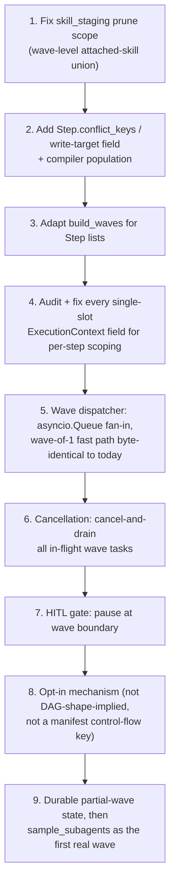

# Step-level fanout — feasibility of parallel step execution

Feasibility and ripple analysis for adding STEP-level concurrency to
`ExecutionEngine.execute()`. Not implemented; this is the pre-decision assessment.

> **Verdict: SPEC012-ADR-05.** Partial. The wave-scheduling SURFACE (`Step.conflict_keys`,
> `Step.id` aliasing `agent_id`) is compiler-derived and built — matching steps 1–3 of the
> recommended sequence below. The dispatcher itself (steps 5–9: `asyncio.Queue` fan-in,
> cancellation, HITL-at-wave-boundary, durable partial-wave state) is NOT built. See
> `../ADR.md`.

## The proposal

`ExecutionEngine.execute()` runs steps strictly serially. The loop is at `engine.py:2340`:

```python
for i, spec in enumerate(ordered_agents):
    if i < _resume_from: continue
    if self._state_machine.get_state(pipeline_run_id) in ("cancelled", "failed"): return
    if cancel_event and cancel_event.is_set(): ... return
    step = _steps_by_agent.get(spec.id)
    strategy_name = getattr(step, "strategy", "single_shot") if step else "single_shot"
```

`execute()` is an **async generator**: each step does `async for event in <strategy>.run(...)` and `yield`s into one ordered stream consumed by the websocket layer and DB persistence.

Measured evidence that `subagents: mode: parallel` does nothing today — a live `sample_subagents` run where `joke` has `depends_on: []` and is independent of `fact`:

```
emoji  03:50:11.856 -> 03:50:43.424
fact   03:50:43.438 -> 03:51:04.635
joke   03:51:04.652 -> 03:51:25.074   started 11ms after fact ENDED
page   03:51:25.089 -> 03:52:20.891
```

Zero overlap.

**Distinction that matters:** fanout over TASKS *inside one step* already exists (`run_fanout`, `fanout_batch`, `wave_scheduler`, `task_loop` under `backend/agents/capabilities/strategies/`). Fanout over STEPS in the step loop does not.

## Verdict

Feasible as an opt-in, wave-bounded feature, but a genuine engine-kernel change, not a scheduling tweak.

The hardest part is **not** the event-stream fan-in — the goldens are already order-canonical multisets. It is the **shared per-run state on `ExecutionContext`** (`backend/agents/execution_engine/context.py`) and the **shared-sandbox / skill-staging write race** (`backend/app/agents/skill_staging.py:104-121`), both of which assume exactly one step in flight. Neither fails loudly under concurrency — they silently corrupt shared state.

`build_waves` (`backend/agents/capabilities/strategies/wave_scheduler.py:58`) is reusable in spirit but not as-is: it partitions `Task` objects carrying `targets`/`conflict_keys`, and compiled `Step` objects carry neither.

## Why the engine is serial today

No ADR or spec states serial execution as an invariant (`.knowledge/cards/ADR-0001.md` is about SSE reconnects, `ADR-0002.md` about the pipeline/workflow rename). But the feature was deliberately deferred, not overlooked:

- `backend/agents/workflows/compiler.py:509-526` — a compile-time **rejection**: a manifest declaring `subagents.mode: parallel` with `max_parallel` fails to compile with *"the engine has no sibling-step concurrency field to bind it to (T34)"*, distinguishing this from `FanoutSpec.max_parallel` (task-fanout, which works). `compiler.py:571-585` confirms `mode: parallel` compiles today by adding zero DAG edges between siblings — "the DAG leaves them free to run concurrently" — but nothing in the engine reads that freedom.
- `backend/agents/workflows/sample_subagents/workflow.yaml:8-13` says the shape exists so a future engine change has something to test against: *"whether the engine actually overlaps them is the thing this exercises."*

Serial execution is the path of least resistance that became load-bearing by accretion. `compiler.py:509-526` is a deliberate guardrail against accepting a manifest that implies parallelism the engine cannot deliver.

### Planning history — step-level concurrency was never designed

**Phase 11** ("engine owned fan out merge") parallelizes **workers spawned by one step**: `run_fanout()` is *"the ONLY spawn path"* (`.planning/phases/11-.../11-01-PLAN.md:170`), *"Parallel mode = capped `asyncio.gather`"* (`11-SPEC.md:36`). Its out-of-scope list (`11-CONTEXT.md:25`) defers the wave scheduler, the subagent-tree panel, fragment merge, price enforcement, ECS/CP-SAT — never sibling-step concurrency.

**Phase 12** ("wave scheduler durable resume") parallelizes **tasks within one step**: `build_waves` topo-sorts tasks, and the strategy *"iterates waves **sequentially**; each wave's tasks become worker requests submitted as ONE `ctx.runner.run_fanout(...)` call per wave"* (`12-CONTEXT.md:36`, D-01).

`grep "asyncio.gather" engine.py` returns **zero matches** — it exists only in `fanout.py`.

Neither `FANOUT-USER-FACING-SCOPE.md` nor `PATH-B-FANOUT-COMPOSER-SCOPE.md` mentions step-level parallelism, as planned or as rejected. **No evidence found** anywhere in `.planning/` or `.knowledge/` of it being designed, discussed, or turned down. Nothing to overturn — and no prior thinking to lean on.

## Inventory of serial assumptions

Loop body: `engine.py:2340-2569` (try/except spans `2339-2657`).

| What | file:line | Assumes | Breaks how |
|---|---|---|---|
| `ExecutionContext.current_step` | `context.py:214-221` | One step "currently running"; hooks read `current_step.hooks` | Two steps stomp each other; hooks fire against the wrong step |
| `current_task_block` / `build_task_number` / `build_task_total` | `context.py:132-142` | Single in-flight build-loop task | Concurrent build-loop steps overwrite each other's injected task marker |
| `last_streamed` | `context.py:201-204`; set `engine.py:2528,2705` | Most-recently-completed step's output, read by pre-step HITL gates and the deliverable resolver | A gate could review a sibling's or a race-loser's output |
| `redo_directive` | `context.py:266-278` | Set/cleared around exactly one composed message | Consume-once breaks under concurrent composition |
| `steering_notes` / `turn_images_once` | `context.py:279-329` | Read-and-clear at the next single dispatch | Note delivered to the wrong step, or double-consumed |
| `results` list + `results[-1]` | `engine.py:3308-3311,3467-3468,4392,5244,5271` | `results[-1]` is "the step that just ran" | Append order becomes race-determined |
| `_resume_from` index | `engine.py:2349-2350` | A single linear "everything before this index completed" boundary | A wave has no single boundary; partial-wave completion has no representation |
| `StateMachine` | `state_machine.py:52-98`, keyed by `run_id` | One state string per run | No representation for "wave member 2 still running while state advanced" |
| `_evaluate_gates` / `_should_gate` HITL pause | `engine.py:2412-2488,5061-5100`, `_run_review_gate` `5403` | `wait_human` halts the whole loop | Undefined whether it pauses one member or the wave |
| Cost / token / budget reserve | `context.py:185-192` | `run_fanout` reserves budget before spawn per worker | No equivalent reserve-before-spawn for concurrent **steps** |
| Cancellation | `engine.py:2365-2391,2571-2596` | Checked at step boundary; one `CancelledError` unwinds one coroutine | N tasks need explicit cancel-and-drain |
| `skill_staging.stage_skills` | `skill_staging.py:49-194` | Exactly one step's skill set authoritative on disk | **Confirmed race** — see below |
| `_dispatch_step_with_retry` reuse snapshot | `engine.py:6880-6949` | `before_ids` snapshot of `ectx.artifacts.tree(...)` stable during one attempt | Concurrent writers could stale a sibling's snapshot — *not verified, flagged* |

## The event-stream fan-in problem

Less severe than assumed. `execute()` is already the single fan-in point by construction — *"the SINGLE outward emit boundary"* (`engine.py:955-963`) stamps `seq`/`event_id` as each event is yielded, one at a time, via a plain incrementing local (`engine.py:992-1031`). The stamping does not care what order events arrive in.

Both golden families are **order-canonical multiset** comparisons, not positional list equality:

- `*.events.json` via `_canonical_order(_normalize(events))` — docstring says *"robust to legitimate interleaving"* (`characterization/_normalize.py:24-30`)
- `*.wsframes.json` — same mechanism, reused by `test_wire_parity.py:6-16`

So reordering from concurrent dispatch does not by itself fail the goldens; that was evidently anticipated. `assert_seq_contiguous()` only checks gap-freedom. No evidence found of a committed test asserting strict cross-step positional order beyond the vocabulary/core-sequence checks in `test_phase3_cutover_verify.py:296,322`.

Mechanism needed: `asyncio.Queue` fan-in with N producer tasks per wave; wave-of-1 keeps the exact existing direct-iteration path.

## Can `build_waves` be reused as-is?

No. `build_waves(tasks: list[Task])` (`wave_scheduler.py:58-130`) is pure stdlib and reads `t.conflict_keys or t.targets` (`:113`) — both exist on `Task` (`plan.py:331,334`) but **not** on `Step` (`plan.py:346-392`). `Step` has `depends_on` (same shape, transfers directly) but nothing for same-file-write collision detection.

Fix: add `conflict_keys` (and/or `targets`) to `Step`, populated by the compiler from known write targets — following the precedent of `Step.skills` (`plan.py:392`), a spec-012-era per-instance addition.

## Cancellation, failure, gates

- Cancellation is boundary-checked (`engine.py:2365-2391`), which generalizes to "check at wave boundaries." Mid-wave cancellation needs new code: `asyncio.gather(..., return_exceptions=True)` or `asyncio.wait(FIRST_EXCEPTION)` plus explicit `.cancel()` on siblings.
- Sibling-failure semantics inside a wave are **undefined today because concurrency does not exist**. The task-fanout precedent (`BudgetExceeded` graceful abort + `_collect_partial_fragments`, `engine.py:2597-2614`) leans toward "let siblings finish," more consistent to mirror than the step loop's fail-fast — but this is a design decision, not a settled one.
- HITL gates (`engine.py:5061-5100,5403`) halt the entire run today. Cheapest correct semantics: `wait_human` on any wave member pauses the whole wave — in-flight siblings finish, the wave does not advance. Reuses the step-boundary pause model at wave granularity.

## Sandbox and skill-staging races

**Confirmed, not speculative.** `stage_skills` (`skill_staging.py:49-194`) on every call lists the skills dir, computes `_attached_ids` for **this step only** (`:100-103`), then `shutil.rmtree`s every directory not in that set (`:104-121`), then writes its own.

Under step concurrency, step A (skills `[x]`) and step B (skills `[y]`) running together: A prunes `y` while B may be mid-write into it; symmetrically B prunes `x`. Whichever runs last wins; the other step's skill silently vanishes — `ignore_errors=True` at line 112, no exception. `RunSandbox` (`sandbox.py:138-163`) has no locking at all.

Must be fixed before waving is enabled for any manifest whose wave members declare different skills. Minimal fix: prune against the **union of the whole wave's** attached skills, not one step's — a logic change, not a locking problem. A lock would not make the wrong prune-set correct.

**This is a real bug today** in the sense that the prune logic is wrong for the concurrent case, and worth fixing regardless of whether waving ships.

## Does opt-in containment hold?

For the 5 characterization-golden pipelines: yes. None declare `subagents.mode: parallel`, and the compiler rejects `max_parallel` under that mode (`compiler.py:519-526`), so every existing manifest compiles to a linear chain — every wave is already size 1.

**Exception found:** `sample_subagents/workflow.yaml` already declares `mode: parallel` for `fact`/`joke` and is a real, shipped manifest. If waving is triggered by "DAG shape allows it" rather than explicit opt-in, its event order changes the moment the feature ships, silently, with no manifest edit.

### Constraint on the opt-in mechanism

`.planning/ROADMAP.md:1198` defines **INV-12** in this context as *"single `_execute_impl`/`run_fanout` dispatch path; never a third launch-driver copy."* A separate wave dispatcher running alongside the serial loop is exactly the second dispatch path this forbids. Step-level parallelism must be **the same loop**, where a wave of one is the ordinary case — not a parallel implementation selected by a flag.

**INV-5** (*"No DSL — control-flow keys stay rejected"*) is the real constraint on a new manifest field: a step-level `parallel:` key is a manifest-declared control-flow key.

**INV-7 does not apply.** `.knowledge/INVARIANTS.md:17` reads *"The engine decides, never the manifest (merge stays engine-selected — no merge picker)"* — the parenthetical is the scope, fan-out **merge strategy**, corroborated by `FANOUT-USER-FACING-SCOPE.md:45`. It does not govern step ordering or scheduling; treating it as such is a misreading.

The containment concern is real and needs an answer that is not a manifest control-flow key — e.g. engine-side derivation with a wave-of-1 fast path byte-identical to today.

## Resume is structurally in the way

`_resume_from: int = 0` (`engine.py:1102`), consumed at `engine.py:2349`, is a flat index into `ordered_agents`. Phase 12 chose this deliberately: D-06 is *"no forked execution path (INV-12: one dispatch loop, entered mid-plan)"* (`12-CONTEXT.md:36`), and D-07 derives "first incomplete step" from existing durable surfaces with **no new step-status table** (`12-CONTEXT.md:46`).

Mid-wave resume exists — but only *inside* a step: completed waves skipped, the in-flight wave re-enters `run_fanout` with workers lacking terminal rows. Even there, per-task mid-wave skip was itself deferred (`_register-parts/12-....md:48,63`, CR-03-followup).

Multiple concurrently in-flight **steps** have no representation in the durable model. Creating one means either the step-status table D-07 avoided, or extending `wave_runs` up a level.

## Effort and risk

| Work item | Effort | Risk |
|---|---|---|
| Fix `skill_staging` prune scope to wave-level union | S–M | Confirmed bug; ship first |
| Add `Step.conflict_keys` / write-target field + compiler population | S–M | Low |
| Adapt `build_waves` for `Step` lists | S | Low |
| Audit/fix every single-slot `ExecutionContext` field for per-step scoping | L | **Highest** — quiet corruption, no golden catches it |
| Wave dispatcher: `asyncio.Queue` fan-in, byte-identical wave-of-1 fast path | M–L | Medium-high |
| Cancellation: cancel-and-drain in-flight wave tasks | M | Medium |
| Sibling-failure semantics (design + implement) | M | Medium — genuinely undecided |
| HITL gate at wave boundary | S–M | Medium |
| `results[-1]` → keyed lookup by `agent_id` | S | Low, mechanical |
| Opt-in mechanism that satisfies INV-5 and INV-12 | S | Low but must not be skipped |
| Budget reserve-before-spawn at step-wave granularity | S–M | Low-medium; precedent exists |
| Durable representation for a partially-complete wave of steps | M–L | Medium-high — contradicts Phase 12 D-07 |

**Riskiest:** the `ExecutionContext` single-slot audit. Wrong scoping produces no exception and no golden failure, so the failure mode is quiet cross-step corruption first seen in production.

## Recommended sequence



Steps 1–4 must land before step 5 exists — they prepare shared state so that when concurrency starts, nothing breaks silently.

## Honest expected payoff

On `sample_subagents` this buys roughly 20s of 129s: only `fact` and `joke` are independent, and `page` alone is 56s. It pays off on wide trees — six independent research nodes feeding one summariser — not on this one.

Items 1 and 2 are worth doing regardless of whether the rest ships.
