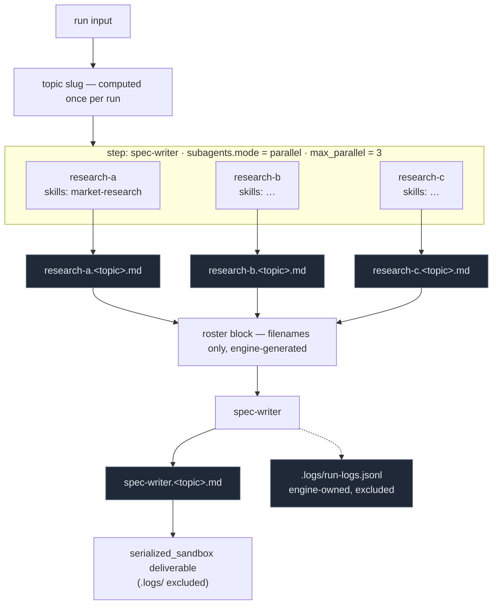

# Feature Specification: Per-Agent Skills & Composable Custom Agents

**Spec ID**: 012-per-agent-skills-custom-agents
**Created**: 2026-08-10
**Status**: Clarified — Q1–Q14 resolved in [`clarifications.md`](clarifications.md); ready to plan
**Root**: `backend/agents/workflows/manifest.py`, `backend/agents/workflows/compiler.py`, `backend/agents/factory.py`, `backend/agents/execution_engine/`, `frontend/src/components/workflow/composer/`
**Design**: [`docs/superpowers/specs/2026-08-10-per-agent-skills-and-custom-agents-design.md`](../../docs/superpowers/specs/2026-08-10-per-agent-skills-and-custom-agents-design.md)
**Builds on**: spec 011 (native `deepagents` skills — run-level attach, sandbox staging)

---

## 1. Problem

Spec 011 made skill delivery cheap and on-demand, but left the *scoping* question unanswered:
skills attach to a **run**, and `stage_skills` writes the same set for every agent in it. A
workflow where the researcher needs `market-research` and the writer needs nothing has no way
to say so. Every agent pays the advertisement cost for every attached skill, and no agent is
told which skills are actually its business.

Custom workflows have a second, unrelated limitation. `backend/agents/workflows/custom/workflow.yaml`
is a fixed chain of nine pre-built agents. A user cannot add a blank agent, name it, give it a
purpose, reuse it three times, and cannot express "these three researchers run first, in
parallel, and the spec writer reads what they produced". The canvas
(`frontend/src/components/workflow/composer/`) is strictly linear, so even if the engine could
express a tree, there would be no way to author one.

These two gaps meet in the same place: a step. Making a step carry its own skills and its own
children solves both.

## 2. What it does

**Skills become a property of the step.** Any step in any workflow — built-in or custom —
may declare `skills: [...]`. Those skills, and only those, are staged for that agent and
advertised in its prompt, preceded by one line telling it to read the relevant ones before
starting. `stage_skills` is already called per agent-build with an `agent_id`
(`factory.py:217`), so the delivery point does not move; only its input narrows.

**A blank custom agent becomes composable.** One `custom-agent` on disk, instantiated many
times per workflow. Each instance carries a stable `instance_id`, a user-editable display
`name`, its own `prompt`, and its own `skills`. Instances persist in the stored manifest, so a
rename survives into later runs.

**A step may own sub-agents.** A `subagents` block declares a child group and a strategy —
`parallel`, `sequential`, or `fanout`. The engine runs the children first, each writing its
artifact into the run sandbox, then runs the parent with an auto-generated roster of what its
children produced. Filenames enter the parent's context; contents do not.

Files `research-a.<topic>.md` … live in the run sandbox; the parent receives their **names**,
never their contents.

Nothing in this design asks the model to decide *whether* its siblings run, in what order, or
how many. The engine owns scheduling; the model owns the work.

## 3. Verified mechanics — the constraints this spec must live inside

Read from the repository at `736696df`. Facts, not preferences.

| Fact | Source |
|---|---|
| Manifest top-level keys are a strict allow-list; anything else is rejected by name | `workflows/manifest.py::_ALLOWED_TOP_KEYS` |
| Step keys are a second strict allow-list (`agent`, `strategy`, `gates`, `hooks`, `tools`, `fanout`, `task_source`, …) | `workflows/compiler.py:68-90` |
| `fanout:` accepts exactly `mode, max_parallel, agent, count, workers, merge_agent`; `task_source:` exactly `kind, parser, target, source_step, spec_step` | `compiler.py:95-107` |
| Fan-out over a parsed task list already works end to end | `agents/workflows/sample_fanout/workflow.yaml`, `execution_engine/fanout.py` |
| `stage_skills(sandbox, attached_skills, agent_id=…)` is already invoked **per agent build** | `agents/factory.py:217` |
| Skills reach `deepagents` as directory `sources` via `skills_sources=` | `factory.py:276` → `deep_agent_runner.py:380` |
| Run-attached skill **bodies** are no longer prompt-injected (spec 011 R-03); only the per-user disk skill still renders a `=== SKILLS ===` block | `factory.py:397-420` |
| Prompt block order is policy-resolved: `injects → guardrails → skills → hooks → constitution → prompt_body` | `factory.py::_compose_system_prompt` docstring |
| `subagents=None` is hard-wired in the runner; deepagents' `task` tool is never offered | `deep_agent_runner.py:366-375` |
| `serialized_sandbox` claims the deliverable iff the sandbox holds ≥1 deliverable file | `capabilities/deliverables/serialized_sandbox.py` |
| Saved user workflows persist as `manifest_json` + `attached_skills` + `attached_hooks` JSON columns | `app/models/workflow_definition.py`, migration `0031` |
| `compatible_agents` survives on **hooks** only; it was removed from all 182 skill files | `app/agents/hooks_catalog.py:41` vs. `grep -rl compatible_agents backend/skills` → 0 |
| Composer canvas is linear: `CanvasView` / `CanvasNode` / `CanvasConfigRail` | `frontend/src/components/workflow/composer/` |

## 4. Requirements

### 4.1 Manifest schema

**R-01** A step MAY declare `skills: [<skill-id>, …]`. Valid on every step of every workflow.

**R-02** A step MAY declare `instance_id`, `name`, `prompt`, and `subagents`.

**R-03** `instance_id` matches `^[a-z0-9][a-z0-9-]*$` and is unique across the whole workflow,
including nested `subagents.steps`. It is generated once at node creation and is immutable;
`name` is freely editable and never affects it.

**R-03a** A custom-agent step compiles to the **synthetic agent id** `custom-agent:<instance_id>`
(e.g. `custom-agent:research-a`), which becomes `Step.agent_id`. `load_agent_spec()` resolves a
colon-suffixed id by loading the base `custom-agent` spec and returning a copy with `id` set to
the synthetic id, `name` set to the instance's display name, and `prompt_body` composed per
R-14. This is what makes the same blank agent usable many times in one workflow: the engine
keys every step by `agent_id` (`_steps_by_agent`, `ordered_agents`) and the compiler rejects
duplicate agent ids, so N instances must carry N distinct ids. No engine map, resume path,
model-override map, or event payload changes shape.

**R-04** `subagents` accepts exactly `mode`, `max_parallel`, `task_source`, `steps`.
`mode ∈ {parallel, sequential, fanout}`; `task_source` is required iff `mode: fanout`;
`max_parallel` defaults to 3 and applies to `parallel` and `fanout` only.

**R-05** `subagents` nesting deeper than two levels is rejected by the validator, naming the field.

**R-06** `prompt` on a non-`custom-agent` step is a validation error. Built-in agents keep the
existing prompt-override mechanism (`app/agents/prompt_overrides.py` and the composer's Custom
Prompt panel); there is exactly one way to override a built-in prompt.

**R-07** A manifest MAY declare top-level `capabilities: {internet: <bool>}`, default `false`.

**R-08** Every new field is inert when absent. All existing manifests — including the five
golden characterization snapshots — parse and compile byte-identically. The goldens are never
re-baselined to make a test pass.

**R-09** Every validation failure names the offending field and the step it appeared in.

### 4.2 Custom agent

**R-10** `backend/agents/prompts/custom-agent/AGENT.md` exists: role-neutral, carrying only the
baked preamble. No per-user `AGENT.md` is ever written to disk.

**R-11** The baked preamble instructs the agent to use its sandbox tools and to write its
deliverable to `<instance_id>.<topic>.md`.

**R-12** `<topic>` is one kebab-case slug derived from the run input (lowercased,
non-alphanumeric runs collapsed to `-`, truncated to 40 characters), computed once per run and
identical for every agent in it.

### 4.3 Prompt assembly

**R-13** A step with a non-empty `skills` list gets a single directive line at the top of its
prompt naming the staged skills and their `/skills/<id>/SKILL.md` paths. This applies to
built-in agents too — an existing agent given a skill is told, in one line, to read it and
work accordingly.

**R-14** A custom agent's prompt is: skill directive → baked preamble → the instance's `prompt`
→ (if it has children) the roster block.

**R-15** The roster block is generated by the engine from the child group's actual results —
display names plus the artifact filename each child produced. It is never hand-authored, and
stays correct when a child is renamed, added, or removed.

**R-16** Composition for a step that declares no `skills` and no `subagents` is byte-identical
to today.

### 4.4 Execution

**R-17** Children run to completion before their parent starts.

**R-18** `parallel` runs declared children concurrently, bounded by `max_parallel`.
`sequential` runs them in declaration order, each seeing prior siblings' artifacts.
`fanout` clones one child template per task from `task_source`, implemented as an adapter over
`execution_engine/fanout.py` — not a second fan-out implementation.

**R-19** Grandchildren resolve depth-first, before their own parent.

**R-20** After a custom agent's step, the engine verifies `<instance_id>.<topic>.md` exists. If
absent, the engine writes the agent's streamed text to that path and emits an
`artifact_fallback` event. The engine makes no assumption about which model backs the run.

**R-21** A failed child does not abort its siblings; its artifact is simply absent from the
parent's roster. Existing per-step gate/retry semantics apply unchanged to each child.

### 4.5 Sandbox, logs, internet

**R-22** Filesystem read and write are bound for every agent — custom, built-in, and new —
regardless of what the step declares. `read_files` / `write_files` remain in the step schema
for readability but no longer gate anything. `exec` stays opt-in and declared.

**R-23** The engine writes `.logs/run-logs.jsonl` in the run sandbox: one JSON object per line
per lifecycle event — step start/end, `agent_id`, `instance_id`, model, token counts, tool
calls, skill activation, artifact writes, errors, `artifact_fallback`. Engine-owned; no agent
has a tool that can append to it.

**R-24** `serialized_sandbox` excludes the `.logs/` prefix from the delivered artifact tree.

**R-25** `capabilities.internet` gates a registered `tool/internet` provider binding
`web_search` and `web_fetch` **stubs** that return `"internet access is not yet available."`
No network egress is added by this spec. The switch, manifest field, UI control, and engine
plumbing land; the provider does not.

### 4.6 Persistence

**R-26** `manifest.py` exposes `build_manifest_from_dict(data, source_label)`;
`load_manifest()` becomes a thin file-reading wrapper over it. DB-stored and file-backed
manifests pass through the identical validator and compiler.

**R-27** User-built workflows persist in `workflows.manifest_json` — the existing storage. No
per-user `workflow.yaml` is written to disk.

**R-28** `GET /api/user-workflows/{id}/workflow.yaml` renders the stored manifest as YAML for
viewing and download.

**R-29** On first read of a saved workflow, `workflows.attached_skills` fans out to every
step's `skills` list inside `manifest_json`; thereafter the per-step form is authoritative and
the column is no longer read at launch.

**R-30** `backend/agents/workflows/custom/workflow.yaml` and its nine agents are untouched.

### 4.7 Skills catalog

**R-31** `compatible_agents` returns to skill frontmatter, the catalog loader, the API
response, and the per-agent picker filter.

**R-32** All 182 skill files are re-authored with a `compatible_agents` list, derived by script
from each skill's own name and description and then reviewed by category — not hand-authored
file by file.

**R-33** **Absent means compatible with everything.** A file the pass misses degrades to
today's behavior, never to an invisible filter.

**R-34** `compatible_agents` is a UI filter/sort hint for built-in agent ids. It is never
enforced server-side, and custom agents — which have no registry id — accept any skill.

### 4.8 UI

**R-35** The canvas renders a node's children below it with connectors, plus an add-sub-agent
affordance and inline rename.

**R-36** The config rail exposes, per selected node: a skills picker, a prompt editor (custom
agents only), and — when the node has children — a strategy selector with a max-parallel control.

**R-37** The workflow-level config surface exposes the internet toggle.

**R-38** The skills catalog surfaces `compatible_agents` and uses it to filter the picker for
built-in agents.

## 5. Out of scope

- A real internet provider: search API selection, key management, egress allowlist. Separate spec.
- Sub-agent nesting deeper than two levels.
- LLM-driven delegation via deepagents `subagents=` / the `task` tool. `subagents=None` stays.
- Any per-user filesystem state.
- Re-baselining the golden characterization snapshots.

## 6. Acceptance criteria

| # | Criterion |
|---|---|
| AC-01 | A manifest declaring per-step `skills`, `instance_id`, `name`, `prompt`, `subagents`, and `capabilities` loads and compiles. |
| AC-02 | Duplicate `instance_id`, three-level `subagents`, `fanout` without `task_source`, and `prompt` on a built-in step each fail validation with the field named. |
| AC-02a | Three steps all declaring `agent: custom-agent` compile to three distinct `Step.agent_id`s (`custom-agent:a/b/c`) and all three run; `load_agent_spec("custom-agent:a")` returns the base spec with the synthetic id and the instance's name. |
| AC-03 | All five golden manifests parse and compile byte-identically after the schema change. |
| AC-04 | An agent with `skills: [x]` has exactly `x` staged; a sibling with no `skills` has nothing staged. |
| AC-05 | A built-in agent given a skill receives the one-line directive at the top of its prompt; without skills its prompt is byte-identical to today. |
| AC-06 | A `parallel` group of three children completes all three before the parent starts, bounded by `max_parallel`. |
| AC-07 | A `sequential` group runs in declaration order and each child can read the prior sibling's artifact. |
| AC-08 | A `fanout` child group clones one worker per parsed task via `execution_engine/fanout.py`. |
| AC-09 | A two-level tree resolves grandchildren before children before parent. |
| AC-10 | The parent's roster block lists its children's display names and artifact filenames, and updates after a rename. |
| AC-11 | Each custom agent's artifact lands at `<instance_id>.<topic>.md`; an agent that writes nothing triggers `artifact_fallback` and the file exists anyway. |
| AC-12 | A previously text-only agent can write a file that survives into the deliverable. |
| AC-13 | `.logs/run-logs.jsonl` contains one line per lifecycle event and does not appear in the delivered artifact tree. |
| AC-14 | A manifest from `manifest_json` and the equivalent YAML file produce the same compiled workflow; the YAML export endpoint round-trips. |
| AC-15 | A saved workflow with `attached_skills` migrates to per-step `skills` on every step, and runs identically. |
| AC-16 | With `internet: true`, `web_search`/`web_fetch` bind and return the not-available message without failing the run; with `false` they are absent. |
| AC-17 | `compatible_agents` parses, serializes, and filters the picker for built-ins; a skill without it is offered everywhere. |
| AC-18 | The canvas renders a parent, its children, and a grandchild; the strategy selector and per-agent skill picker write through to the stored manifest. |
| AC-19 | The `hello_html` Ollama path still completes end to end after universal read/write is enabled. |

## 7. Risks

**RISK-01 — the 182-file `compatible_agents` pass.** High volume, low verifiability, and it
partially reverts commit `9b93a0d5`. Mitigated by scripted derivation, review by category, and
absent-means-all as the failure mode (R-33).

**RISK-02 — fan-out overlap.** The child-group `fanout` mode and the existing `fanout_batch`
step strategy address the same problem at different altitudes. Mitigated by R-18: adapter, not
reimplementation.

**RISK-03 — universal read/write changes every agent's tool set.** Tool-set inflation
previously destabilized small local models (C-01: `exclude_builtin` flipping to `False` when a
skill was staged). AC-19 gates the change on the `hello_html` Ollama path.

**RISK-04 — schema growth against strict-key goldens.** Every added field must default inert.
R-08 and AC-03 make byte-identity the test, not an aspiration.
