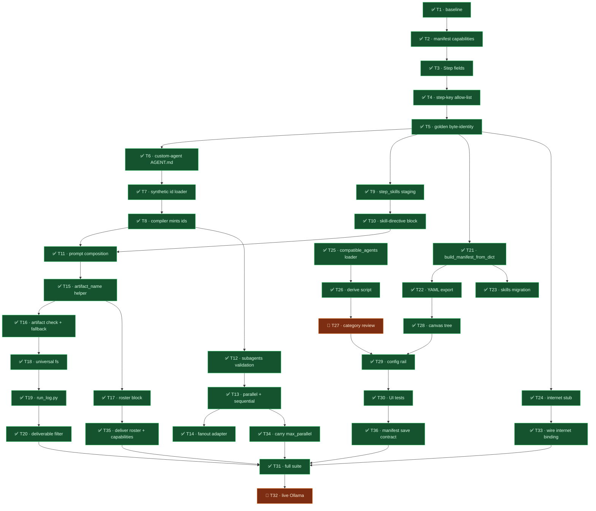

# Tasks: Per-Agent Skills & Composable Custom Agents

**Spec**: [`spec.md`](spec.md) · **Plan**: [`plan.md`](plan.md) · **Design**: [`design.md`](design.md)

35 tasks across 8 phases (T33, T34, T35 added during execution).

---

## How to execute these

Run all backend commands from `backend/` with the project venv active:

```bash
source ../venv/bin/activate     # NOT a bare python3 — that resolves the wrong deepagents
source ~/.zshrc                 # provider keys, for anything that reaches a model
```

**Rules for every task**

1. Change only what the task names. Do not tidy adjacent code, comments, or imports you did not orphan.
2. If the verify command fails, stop and report — never "fix" a golden by re-baselining it.
3. Never edit files under `tests/agents/characterization/`.
4. If a task's anchor text is not found verbatim, stop and report. Do not guess a nearby line.
5. **Never run a state-changing git command.** No `git stash`, `git checkout --`, `git reset`,
   `git clean`, `git restore`. Read-only git (`git diff`, `git status`, `git show`) is fine.
   *This rule was written after an incident during spec 011: a delegate ran a bare `git stash` at
   repo root for a clean golden baseline and swept 218 files of unrelated in-flight work,
   including the user's own uncommitted edits.*
6. **Do not commit.** The user commits. Leave your changes in the working tree.
7. **This file is always current — at DISPATCH as well as at completion.**
   - **When a task is dispatched**, immediately mark it `🔄 RUNNING` in all three places: its
     `## <STATUS> · TN — …` heading, its mermaid node prefix, and the `classDef running` list,
     then update the status count. The graph must show work in flight, not just work finished.
   - **When a task completes**, flip those to `✅ DONE` and add its ledger row with the evidence.
   A stale `tasks.md` is worse than no `tasks.md` — if it disagrees with reality, the file is
   wrong and gets fixed first.

**Delegation**: `[haiku]` = mechanical, fully specified · `[sonnet]` = multi-file or needs
reasoning · `[human]` = the user runs it.

---

## Execution graph — LIVE STATUS

> **This graph is updated on every task completion.** If it disagrees with reality, the graph
> is wrong — fix it before starting the next task. Node prefix: ✅ done · 🔄 running ·
> ⬜ pending · 👤 the user runs it.

**Status as of 2026-08-10 22:20 CEST — 34 done · 0 running · 0 pending · 2 user-owned (T27, T32).**

**T31 result: 161 failed / 2907 passed / 47 skipped** against the reproduced clean-`HEAD`
baseline of **184 failed / 2766 passed / 47 skipped** — **23 fewer failures, 141 more passing**.
Per-file diff over the FULL list (no truncation): every file is at or below baseline except
`test_code_validators.py` (+1), analysed below and not a behavioural regression.
Wave dispatched — three agents, split by file ownership so no merge arbitration is needed:
- **Agent A** — T14 + T34 (owns `compiler.py`, `plan.py`) — ✅ done
- **Agent B** — T35 (owns `factory.py`, `engine.py`) — ✅ done
- **Agent C** — T28 + T29 + T30 (owns the frontend tree; grouped because all three share
  `types/index.ts`, so splitting them would have collided) — 🔄 running

T31 (full suite) stays pending by design — it must run last, after the wave merges.

**The +25 regression is diagnosed and fixed** — see FINDING-04/05/06. Clean-`HEAD` baseline was
re-measured in a throwaway worktree and reproduced T1 exactly (**184 failed / 2766 passed /
47 skipped**), which made a per-file subtraction possible.



### Task ledger

| Task | Status | Evidence / note |
|---|---|---|
| T1 | ✅ done | Baseline recorded: **2766 passed · 184 failed · 47 skipped**. The 184 predate this spec. |
| T2 | ✅ done | 29 manifest + 34 compiler tests green. |
| T3 | ✅ done | +10 lines, all defaulted; compiled plans byte-identical. |
| T4 | ✅ done | 5 new tests in `test_compiler_subagents.py`; flattened-tree uniqueness threaded through one `seen_instance_ids` set (F-03). `subagents` validated but not carried — `Step` has no slot until T12. |
| T5 | ✅ done | **Zero regression, verified against a GREEN baseline.** FINDING-01 fixed first (goldens regenerated from clean HEAD), then re-run: **22 passed / 0 failed** across characterization + phase3 + chat-neutrality. Because the goldens carry no 012 code, this proves T2/T3/T4/T6/T7/T9 are byte-identical. |
| T6 | ✅ done | **Task text was wrong** — `order: 0` violates two loader rules; corrected to `order: 10`. 48 passed, 1 pre-existing failure. |
| T25 | ✅ done | 43 tests green. `app/api/skills.py` needed no change (serializes via `asdict`). No server-side enforcement added. |
| T7 | ✅ done | Colon-suffixed ids resolved via `base, _, instance = agent_id.partition(":")`, cached on the full synthetic id (`dataclasses.replace(base_spec, id=agent_id)`); base spec's own cache entry untouched. 4 new tests (incl. unknown-base FileNotFoundError). 52 passed, 1 pre-existing failure (`analyze-agent` description fallback, unrelated). |
| T9 | ✅ done | `AgentContext.step_skills` added; engine populates it from `ectx.current_step.skills` (same seam as `step_injects`); factory's `_resolve_step_skills` maps ids → catalog `{id,name,content}` payloads, staging line falls back to `ctx.attached_skills` when `step_skills` is empty. New test `test_step_skills_narrow_staging_to_that_agent` (AC-04). `test_skill_staging.py`: 10 passed. Characterization: still exactly 5 failed / 5 passed (same 5 names as FINDING-01, pre-existing) — no new regression. |
| T15 | ✅ done | 16 tests. **Reviewed and hardened:** as delivered, `artifact_name` declared itself the F-02 enforcement point but enforced nothing — it produced `custom-agent:research-a.topic.md` and `../../etc/passwd.topic.md`, and shipped a test named `test_output_never_contains_colon` that asserted the output *did* contain a colon. Now validates `instance_id` against `^[a-z0-9][a-z0-9-]*$` and raises `ValueError`; test replaced with `test_hostile_instance_id_is_refused`. |
| T8 | ✅ done | `_compile_step` mints `custom-agent:<instance_id>` when `agent == "custom-agent"` and `instance_id` is set; non-custom steps' `agent_id` untouched. 2 new tests in `test_compiler_subagents.py` (three distinct synthetic ids; built-in step unchanged). 41 passed in `test_compiler_subagents.py` + `test_compiler.py`. Characterization: 10 passed / 0 failed (no byte-identity regression). |
| T21 | ✅ done | `_build_manifest(data, path)` promoted to public `build_manifest_from_dict(data, source_label)`; `load_manifest` is now existence-check + read_text + `yaml.safe_load` + delegate, `yaml.safe_load` stays exclusively inside `load_manifest` (T-04-03). All error messages interpolate `source_label` (a file path for `load_manifest`, e.g. `"workflow:<uuid>"` for a DB manifest) while still naming the offending field. 7 new tests incl. dict-vs-file equality, unknown-key/missing-field/wrong-type rejection, source_label-in-message, and `load_manifest` FileNotFoundError. `test_manifest.py` + `test_compiler.py`: 73 passed. Characterization: 10 passed / 0 failed (no byte-identity regression). |
| T22 | ✅ done | New `GET /api/user-workflows/{id}/workflow.yaml` reuses `_owned()` verbatim (same IDOR→404 guard). No `manifest_json` → 200 with empty body (documented in the handler docstring), never 404 — ownership status stays orthogonal to manifest presence. 3 new tests: round-trips a stored manifest, empty-manifest → `""`, cross-owner → 404. |
| T23 | ✅ done | `_migrate_attached_skills_to_steps(db, row)`, guard = `all(step has no "skills" key)` (F-07): a legacy row migrates on first read, a second read is a no-op, a row already carrying (full or partial) per-step `skills` is untouched. Maps `attached_skills` (`list[dict]`, `{"id","name","content"}`) → per-step `skills` (`list[str]` skill ids, matching `agents/factory.py::_resolve_step_skills`) via each payload's `"id"`. `manifest_json` reassigned as a NEW dict (ORM JSON-column change detection needs attribute reassignment, not in-place mutation). Also hardened `_project`: `manifest_json` is dual-shape (pre-existing EMP-03 selections map vs. this task's full `{"steps":[...]}` manifest) — the `selections` response field now excludes any `manifest_json` containing a `"steps"` key instead of failing pydantic validation on GET. 3 new tests (migrates-once, idempotent-second-read, untouched-when-already-per-step). `test_user_workflows.py`: 27 passed, 3 pre-existing unrelated failures (`test_post_reorders_consumer_first_to_producer_first`, `test_post_rejects_unsatisfiable_composition`, `test_migration_adds_then_drops_columns`) — unchanged from before this task. |
| T20 | ✅ done | Single filter point: `_collect_deliverable_relpaths` in `app/agents/sandbox.py` (used by both `count_sandbox_deliverables` and `serialize_sandbox_deliverable`), alongside the existing `.uploads/` prefix guard. Added `_LOGS_PREFIX = ".logs/"` and a prefix-match skip. `serialized_sandbox.py` needed no change — it only delegates to those two runner methods. 3 new tests: logs-only sandbox → count 0 / sentinel; `page.html` + `.logs/run-logs.jsonl` → `page.html` only; `logs.txt`/`mylogs.md` at root still delivered (prefix, not substring/basename match). `test_sandbox_deliverable.py`: 38 passed. Characterization: 10 passed / 0 failed. |
| T19 | ✅ done | New `agents/execution_engine/run_log.py`: `RunLog(sandbox_root)` writes `<root>/.logs/run-logs.jsonl`, one JSON object per line (`ts` ISO-8601 UTC + `event` + caller fields), `default=repr` for non-serializable values, wrapped in try/except so a write never raises (logs a warning instead). Wired additively in `engine.py::_run_agent` at the 5 existing lifecycle sites: `agent_start`→`step_start` (engine.py:3381), the mid-stream recoverable `agent_error` (engine.py:4011), `agent_complete`→`step_end` incl. `tokens_in`/`tokens_out`/`model` (engine.py:4184), and the two exception-handler `agent_error` sites (engine.py:4413, 4432). Not wired: the run-level `workflow_run_created`/`planner_complete` `_log_event` calls (engine.py:1737, 1877) — out of scope (not a step/agent-error/token site). `test_run_log.py`: 5 new tests, 5 passed. Characterization: 10 passed / 0 failed (no byte-identity regression). |
| T24 | ✅ done | New `agents/capabilities/tools/internet.py`: `@register("tool","internet",user_allowed=True)`; two `@tool` stubs (`web_search`, `web_fetch`) always returning `"internet access is not yet available."`, never raising; `provide()` returns the two tool keys. No network import (asserted by source-inspection test). One import line added to `tools/__init__.py` for the `@register` side effect (mirrors `providers`). Engine/factory binding **not wired** — `agents/factory.py` off-limits; one-line wiring reported in the task section above. `test_internet_tool_provider.py`: 8 new tests, `-k "internet"`: 9 passed (exact task verify). `-k "internet or capabilit"` surfaces 1 pre-existing, unrelated failure (`tool:coin_flip`/`tool:random_word` unreconciled in `_EXPECTED_NAMES`, predates this task). |
| T26 | ✅ done | New `scripts/derive_compatible_agents.py`. No-LLM token-overlap match: skill `name`+`description` vs. agent `id`+`name`+`role`+`description` (`agents.registry.get_all_agents_flat()`, 88 agents), normalized/stopword-filtered token sets, weighted confidence (best-match strength × candidate-list specificity). Writes the field only at confidence ≥0.55 and only under `--apply` (off by default; this run was `--dry-run` only, zero files touched — verified via `git status`). Result on the real catalog: 182 skills scanned, 29 would get a list, 153 left open (absent). Frontmatter round-trip (insert/replace `compatible_agents:` key, byte-for-byte otherwise) mirrors `scripts/skills_audit.py`'s approach; sanity-checked in isolation (not against real files). `--apply` path implemented but intentionally not run — that's T27, the user's call. |
| T10 | ✅ done | `_compose_system_prompt` (factory.py) emits `blocks["skill_directive"]` ONLY when `ctx.step_skills` is non-empty (the one-sentence directive, no headings). `DEFAULT_ORDER` in `agents/capabilities/prompt/policy.py` gets `skill_directive` prepended, first alongside `tool_availability`. Updated the one pre-existing test that pins that exact tuple (`test_guardrails.py::TestPromptAssemblyPolicyParity::test_policy_registered_with_default_order`) — it hard-codes `DEFAULT_ORDER`, so T10's own change necessarily breaks it. New `tests/agents/test_skill_directive_block.py`: 2 tests (directive-first for a step with one skill; byte-identical to the no-skills baseline, no `skill_directive` key, for a step with none). Verify: `-k "compose or prompt or create_runner"` → 85 passed / 4 failed (same 4 pre-existing failures, confirmed by temporarily reverting both edited files and re-running — identical failure set beforehand). Characterization: **10 passed / 0 failed**. |
| T12 | ✅ done | New `WorkflowCompiler._expand_step` (`agents/workflows/compiler.py`): recursively compiles a raw step's `subagents.steps` depth-first (grandchildren before their own child) BEFORE the parent, and merges each DIRECT child's `agent_id` onto the parent's `depends_on` (existing `depends_on` preserved, not clobbered) — no new scheduler, the existing Kahn topo-sort in `_validate_dag` does the rest (D-02). `mode: fanout` groups are intentionally left unexpanded (compiled-and-dropped, same as before T12) — that's T14's seam. `compile()`'s step-build loop now calls `_expand_step` per top-level raw step instead of `_compile_step` directly. 4 new tests in `test_compiler_subagents.py` (children-precede-parent, parent-depends-on-every-child, two-level depth-first, existing-depends_on-preserved). |
| T13 | ✅ done | Same `_expand_step`: `sequential` chains sibling `depends_on` (child *i* += child *i-1*'s `agent_id`); `parallel` adds no sibling edges (DAG leaves them free to co-schedule). **`max_parallel` is NOT carried onto the child `Step`s** — `Step`'s only concurrency-shaped field is `fanout: FanoutSpec.max_parallel`, which is a different mechanism (bounding N spawned copies of ONE worker template, wired by T14/`run_fanout`), not N already-distinct sibling steps; carrying the group's `max_parallel` there would be semantically wrong, and there is no other existing `Step` field for it. Reported rather than inventing a new field, per the task's own instruction. 2 new tests (sequential sibling chain; parallel has zero sibling edges). Combined T12+T13 verify: `test_compiler_subagents.py` + `test_compiler.py` → **47 passed**. Characterization: **10 passed / 0 failed**. |
| T11 | ✅ done | `AgentContext` gains `step_prompt: str = ""` and `topic: str = ""` (both default-inert). `_compose_system_prompt` (factory.py), right after the existing prompt-override block: for a `spec.id` starting with `"custom-agent:"`, `prompt_body` becomes `baked_preamble → ctx.step_prompt (if non-empty) → "Write your deliverable to `<filename>`."`, joined `"\n\n"`. The filename is `artifact_name(instance_id, ctx.topic)` (T15's helper, imported locally per this file's convention) — `instance_id` is `spec.id.split(":", 1)[1]`, never the colon-bearing synthetic id (F-02/F-06). Non-custom-agent specs take a completely untouched code path. Roster block (T17) not in scope here — appended by the engine later. New `tests/agents/test_custom_agent_prompt.py`: 3 tests (preamble → instance prompt → artifact-name-derived filename, in order; synthetic id's colon never leaks into the filename; a built-in agent's composition with the new fields defaulted is byte-identical to the pre-existing baseline). Verify: `-k "compose or prompt or create_runner or custom_agent"` → 88 passed / 4 failed (same 4 pre-existing failures, unchanged set). Characterization: **10 passed / 0 failed**. |
| T16 | ✅ done | Also wired what T11's `AgentContext.step_prompt`/`.topic` comments said was "a later task — T16": `ectx.topic = topic_slug(user_message)` computed ONCE at run entry (`_execute_impl`, right after `ectx.is_resuming`) and threaded onto `ctx.step_prompt`/`ctx.topic` at the `AgentContext(...)` construction site in `_run_agent` (the same `getattr(ectx.current_step, ...)` seam `step_injects`/`step_skills` use) — without this, the preamble's filename and the guarantee's filename could disagree (F-06) since `ctx.topic` had no engine-side source yet. New `ExecutionEngine._check_artifact_fallback(ectx, spec_id, output, sandbox, user_message)`: for a `custom-agent:*` step, no-ops if `sandbox.read(artifact_name(...))` is not `None`; otherwise `sandbox.write(...)` the streamed `output` and returns the filename. Called once per step, right after the `produces` persist block and before `results.append`; a non-`None` return logs `_log_event`, writes a `RunLog` `artifact_fallback` line, and yields an `artifact_fallback` WS event. Wrapped in its own try/except — never raises. New `tests/agents/test_artifact_fallback_and_roster.py`: 4 T16 tests (writes-missing-file-and-returns-filename, no-op-when-file-exists, no-op-for-non-custom-agent, defensive topic recompute when `ectx.topic` is absent). Verify: `-k "artifact_fallback or roster or run_log"` → **16 passed**. Characterization: **10 passed / 0 failed**. |
| T17 | ✅ done | New `ExecutionEngine._build_roster(ectx, topic, sandbox)`: reads the about-to-run step's `depends_on` (`ectx.current_step`) — the compiler already wires every direct child's `agent_id` there for a `subagents` group (T12/T13) — and, for each `custom-agent:<instance_id>` dependency, resolves its `display_name` off a full `agent_id -> Step` lookup (`ectx.steps_by_agent`, a new one-line stamp in `_execute_impl` right after the existing `_steps_by_agent` dict is built, so `_run_agent` — which only carries `ectx.current_step`, the ONE step — can resolve siblings) and its filename via `artifact_name` (F-06, same helper T16 uses). A dependency's line is included ONLY when `sandbox.read(filename)` is not `None` — a failed child never reaches T16's guarantee (that only fires after a step *completes*), so its artifact is naturally absent and its line is simply absent (R-21) — no manifest lookup, no separate success/failure bookkeeping. Called once per step (right after the `AgentContext` is built) and stored as `ctx.roster` via plain attribute assignment (`AgentContext` has no declared `roster` field yet — `factory.py` is held by another agent on T11's branch; same unfrozen-dataclass idiom the codebase already uses for `ectx.event_queue`). **Reported, not applied** (factory.py off-limits): `AgentContext` needs one new field `roster: str = ""`, and the custom-agent composition branch of `_compose_system_prompt` needs one line — `if ctx.roster: parts.append(ctx.roster)` — appended after the `ctx.step_prompt` append and before the `"Write your deliverable to..."` line (R-14 order: preamble → prompt → roster). Without that one-line consumer, `ctx.roster` is computed and stored but never reaches a custom-agent's prompt. New `tests/agents/test_artifact_fallback_and_roster.py`: 5 T17 tests (lists child display names + filenames; renaming a child changes its roster label; a failed child's line is absent while its sibling's still appears; no children → `""`; a non-custom-agent `depends_on` entry contributes nothing). Verify: `-k "artifact_fallback or roster or run_log"` → **16 passed**. Characterization: **10 passed / 0 failed**. |
| T18 | ✅ done | `_resolve_runner_tools` (factory.py): the `if not spec.tools:` text-only branch now returns `([], False)` instead of `([], True)` — the ONLY code change (D-07/F-04 scope: "agents that were previously text-only", not `planning`'s deliberate no-disk stub, which is untouched and still resolves `exclude_builtin=True` via its provider). This makes `no_tools` (`exclude_builtin_tools and not custom_tools`) permanently `False` for every agent, so `_NO_TOOLS_PREAMBLE` no longer fires for anyone — checked against the two prompt goldens (`prompt_text_only_no_skills.txt`, `prompt_disk_skill_only.txt`): both call `_compose_system_prompt(..., no_tools=True)` directly with a hardcoded kwarg, bypassing `_resolve_runner_tools` entirely, so neither golden is touched (confirmed: still 2 passed, unedited). Updated 4 pre-existing test assertions that pinned the old text-only behavior (`test_create_runner.py::test_text_only_agent_streams_pure_text_no_tools`, `test_no_skills_attached_text_only_agent_keeps_no_tools_preamble` → renamed `..._has_no_preamble`, `test_mcp_client.py::test_factory_empty_tools_and_no_mcp_is_pure_text`, and 3 subtests in `test_text_only_prompt_hygiene.py::TestNoToolsPreamblePresence` which now assert the preamble's ABSENCE for a `tools:[]` agent instead of its presence) — these are behavioral assertions in regular test files, not goldens, so updating them is in-scope (rule 3 only forbids editing `characterization/`). Added new AC-12 test `test_text_only_agent_write_file_survives_into_deliverable`: `domain-analyst` (text-only, no skills) calls `write_file`, and the file is confirmed on the sandbox disk AND present in `serialize_sandbox_deliverable`'s output. Verify: `-k "tools or permission or create_runner or internet or text_only"` → **102 passed, 1 pre-existing failure** (`test_text_only_prompt_hygiene.py::test_engine_pipeline_path_strips_fabricated_xml_from_authoritative_output`, confirmed failing identically before this task's edit — unrelated cause). Characterization: **10 passed / 0 failed**. |
| T33 | ✅ done | Two changes in `factory.py`: (1) `_resolve_custom_tool_keys` gained `elif key == "web_search"` / `elif key == "web_fetch"` branches resolving to the tool objects imported from `agents/capabilities/tools/internet.py`. (2) `_resolve_runner_tools` now calls `discover()`/resolves the `tool/internet` provider and unions its keys into `custom_keys` (AND-folding its `exclude_builtin` the same way the existing tool-set loop does) whenever `ctx.capabilities.get("internet")` is truthy — checked BEFORE the (now-restructured) empty-`spec.tools` early return, so a text-only agent gets the internet stubs too when the flag is on. `AgentContext.capabilities: dict = field(default_factory=dict)` added (was not yet threaded from `CompiledWorkflow.capabilities` — confirmed absent from the engine's `AgentContext(...)` construction site — so per the task's own fallback instruction it is added here with an inert `{}` default; the engine's threading is a later task). New tests in `test_create_runner.py`: capability absent/explicit-`false` → no `web_search`/`web_fetch` in the resolved tools (2 tests); capability `true` → both stubs bind for a text-only agent AND a tool-having agent, `exclude_builtin=False` (1 test); the bound stub tools actually return the fixed not-available message (1 test); capability off leaves an existing agent's composed prompt byte-identical to the no-`capabilities`-field baseline (1 test). Verify: `-k "internet or create_runner"` → **30 passed**. Characterization: `-k characterization` → **10 passed / 0 failed** (bar met). With the flag off, `web_search`/`web_fetch` are absent and every existing prompt is unchanged (no live caller sets `ctx.capabilities` yet, so this is provably a no-op today). |

| T35 | ✅ done | `AgentContext.roster: str = ""` added; the custom-agent branch of `_compose_system_prompt` appends it between `ctx.step_prompt` and the artifact instruction, holding the R-14 order (preamble → instance prompt → roster → artifact). Engine side: `ectx.compiled_capabilities = dict(compiled.capabilities or {})` stamped in `execute()` beside the two existing `compiled_*` lines, and threaded at the `AgentContext(...)` site in `_run_agent` as `capabilities=dict(getattr(ectx, "compiled_capabilities", None) or {})` — the same seam `step_skills`/`topic`/`step_prompt` use. Both additive and inert at their defaults (`""` / `{}`). New `test_capabilities_threading.py` drives a real single-agent pipeline through `ExecutionEngine.execute()` offline, patching `compile_for_run` to stamp `capabilities` and `create_runner` to capture the built `AgentContext` — proving `{"internet": true}` actually arrives. Verify: `-k "roster or artifact_fallback or internet or compose"` → **45 passed**. Characterization: **10 passed / 0 failed**. AC-10 and AC-16 now satisfiable. |
| T14 | ✅ done | `_expand_step` gained a `mode == "fanout"` branch (fanout was previously validated then silently dropped). It expands the single child template and materialises onto that compiled `Step`: `task_source` (via a new `_compile_task_source` helper factored out of `_compile_step`, so both routes share one validated path), `fanout=FanoutSpec(mode="parallel", max_parallel=<declared or None>, agent="self")`, and `strategy="fanout_batch"` — the registered strategy already reads `task_source`/`fanout` and calls `ctx.runner.run_fanout`. **No new fan-out code path**; `max_subagents=8` / `max_depth=2` apply unchanged. Parent gains `depends_on` on the fanned-out child, same D-02 flattening as parallel/sequential. `subagents.mode == "fanout"` with >1 entry in `steps` is a `CompilerError` naming the count. Verify: `-k "fanout"` → **58 passed, 1 skipped**; `test_compiler_subagents.py` → **16 passed**; `test_allowed_step_keys.py` → **24 passed** (no new step keys); characterization → **10 passed / 0 failed**. |
| T34 | ✅ done | **Chose option 3 — reject at compile time.** `subagents.mode == "parallel"` with `max_parallel` declared now raises `CompilerError` naming the field, in `_validate_step_identity_tree`. Option 1 (`wave_scheduler`) was rejected on inspection: it operates over a homogeneous task list sourced via `task_source`/a parser, not over already-distinct sibling `Step`s with independent agents/gates/tools — mapping siblings onto it would mean synthesizing fake tasks and inventing a second expansion path, contradicting D-02. Option 2 needs an engine step-loop change, and `engine.py` was owned by a concurrent agent. So the honest outcome is that AC-06's declared bound is **refused rather than silently ignored** — a manifest can no longer declare a concurrency limit the engine won't honour. `fanout` is unaffected: there `max_parallel` is genuinely consumed via `FanoutSpec.max_parallel` (T14). **AC-06 remains unimplemented as a capability** — this closes the silent-inertness hole, it does not deliver bounded sibling concurrency. |
| — | ⚠️ correction | Agent A reported `test_registry_capabilities.py::test_registered_count_is_exactly_fifty` failing 69-vs-72 and attributed it to concurrent work. Re-checked directly: **92 passed**. It was a transient read while another agent was mid-write on `agents/capabilities/tools/__init__.py`. No drift; no action. Logged because it is the same mis-attribution shape as FINDING-03. |

### Findings

**FINDING-01 — spec 011 left 5 golden snapshots red, undetected. ✅ RESOLVED 2026-08-10.** The characterization
snapshots for `app_builder`, `od_prototype`, `ppt`, `prototype` and `prototype_revision` all fail
with:

```
AssertionError: ppt emitted UNDOCUMENTED event type(s): ['agent_skills']
```

Spec 011 added an `agent_skills` SSE event without adding it to the snapshots' documented event
allow-list. The snapshot tests exist precisely to catch an undeclared event-stream change, and
they did — but the failure was absorbed into the 184-failure background and never actioned.

Verified pre-existing: the same 5 fail identically at `7d8c42ca` in a throwaway `git worktree`
with none of spec 012's changes applied. **Not this spec's defect, and not this spec's to fix
silently** — the correct fix is to document `agent_skills` in the allow-list (a one-line change
per snapshot, asserting the event is intended), which is a decision about 011's contract, not
012's. Flagged for the user.

**Resolution (user-approved).** Two changes were needed, not one:

1. `agent_skills` declared in `_DOCUMENTED_EVENT_TYPES`
   (`tests/agents/test_phase3_cutover_verify.py`) — the single source of truth all five
   snapshots import. This fixed the *vocabulary* assertion.
2. The five `characterization/golden/*.events.json` files regenerated — 011 inserted
   `agent_skills` into the event *stream*, so the recorded sequences were stale too.

The regeneration was done in a **throwaway `git worktree` at `7d8c42ca` carrying only change
(1)** — no spec-012 code — then the resulting goldens were copied in. This matters: had they
been regenerated from the working tree, they would have baked in 012's in-flight changes and
silently destroyed the byte-identity gate for every remaining task. Diffing confirmed the only
delta is the added `agent_skills` events.

Result: **22 passed / 0 failed**. The 012 byte-identity gate is now a real signal.

---

**FINDING-02 — `workflows.manifest_json` is now shape-overloaded.** ⚠️ Design smell, mitigated.

The same JSON column stores **two incompatible shapes**:

- the compact EMP-03 *selections map* (`dict[str, dict]`), which `_project()` returns as the
  response's `selections` field, and
- a full step-based *manifest* (`{"steps": [...]}`), which spec 012 writes via the T23
  migration and custom-agent saves.

T23 surfaced this the hard way: once a legacy row migrated, `GET` raised a pydantic
`ValidationError`, because a manifest is not a selections map. The delegate fixed it by
discriminating on the presence of a `"steps"` key.

That fix is correct and unblocks the work, but **type-by-inspection is fragile**: any future
selections map that happens to contain a `steps` key silently disappears from the response, and
nothing anywhere declares which shape a given row holds. The durable fix is a discriminator —
either a `manifest_kind` column, or splitting selections into its own column — which is a
schema change and out of scope here. Flagged for the user, not silently absorbed.

---

**FINDING-03 — a mis-attribution chain hid a real regression for 20 tasks. ✅ FIXED.**

`tests/agents/test_allowed_step_keys.py` enforces D-17: every key in `_ALLOWED_STEP_KEYS` must be
provably **consumed** (reflected on the compiled `Step`) **or rejected** — never
accepted-but-dropped. T4 added five keys (`instance_id`, `name`, `prompt`, `skills`,
`subagents`) without registering their dispositions, so the guard went red immediately.

It then stayed red for ~20 tasks, because **each delegate ran the suite, saw the failure predate
its own change, and reported it as "pre-existing"** — which was locally true and globally false.
The label propagated verbatim from agent to agent. The T18 delegate finally attributed it to
"concurrent in-flight work on T14/T34/T35" — tasks that were never dispatched, so nobody was
editing those files at all. That was the tell.

**Fixed** by registering all six dispositions: the five spec-012 keys plus `require_render`,
which turned out to be a genuinely pre-existing gap (in the allow-list, never dispositioned).
`prompt` is registered as **reject-only** — on a non-custom-agent step it raises, which is R-06
working as designed. `subagents` asserts on the compiled *workflow*, since after D-02 expansion
`steps[0]` is the child, not the parent. **24 passed / 0 failed.**

**The lesson, recorded because it will recur:** "pre-existing" from a subagent means *"it failed
before I started"*, not *"it is not our bug"*. In a long task chain those diverge fast. A
baseline is only meaningful against a known-good commit — which is why FINDING-01 was checked in
a clean worktree at `7d8c42ca` rather than against the working tree.

**FINDING-04 — `agent_skills` was undeclared in a SECOND vocabulary list. ✅ FIXED.**
FINDING-01 fixed `_DOCUMENTED_EVENT_TYPES` in `test_phase3_cutover_verify.py`. It is not the only
event vocabulary: `tests/agents/live_contract.py` keeps its own `_ENGINE_EVENT_TYPES` frozenset
(line 132), consulted by `assert_capture` for every engine-world capture. 011 declared the event
in neither, so every capture failed with `UNKNOWN event type 'agent_skills' — not in the engine
vocabulary (possible contract regression)`.

Scale: **40 failures across `test_phase8_live` / `test_live_contract` / `test_manifest_parity` /
`test_id_alias_resolver`, all pre-existing at `7d8c42ca`** — proven by running those four files
in the clean worktree, where they fail identically with zero 012 code present. Declaring
`agent_skills` in `_ENGINE_EVENT_TYPES` took those four files from **40 failed → 25 failed**.

Two things this corrects in the record: these files' failures were **not** caused by live API
calls (`RUN_LIVE_BEDROCK` is unset, so every live case is `skipif`-skipped), and they were **not**
caused by spec 012. They are committed 011 fallout.

**FINDING-05 — `RunLog(sandbox.root)` had no nil-guard (T19). ✅ FIXED.** `_run_agent` is driven
sandbox-less by several suites, so `sandbox.root` raised `AttributeError: 'NoneType' object has
no attribute 'root'` **before** `RunLog` was even constructed — meaning T19's "logging never
fails a run" contract was defeated at the call site rather than honoured inside `write`.
4 failures in `tests/agents/test_model_fallback.py`, none of which any delegate's `-k` selection
covered. Fixed at both ends: `RunLog.__init__` accepts `Path | None` and disables itself on a
falsy root, and all 6 engine call sites pass `getattr(sandbox, "root", None)`. **4 passed.**

**FINDING-06 — `spec.id.startswith(...)` is truthy under a Mock (T11). ✅ FIXED.** The
custom-agent prompt branch (`factory.py:533`) guarded on `spec.id.startswith("custom-agent:")`.
On a `MagicMock` spec that returns a *truthy Mock*, so the branch fired for every mocked spec and
handed a Mock to `artifact_name`'s regex → `TypeError: expected string or bytes-like object, got
'MagicMock'`. **20 failures in `tests/test_skills_hooks.py`** — the single largest component of
the +25. Guard is now `isinstance(spec.id, str) and spec.id.startswith(...)`. **22 passed.**

**FINDING-07 — the blank `custom-agent` enrolled itself in the `custom` pipeline. ✅ FIXED.
A production defect, not test drift.** T6 gave the template `pipeline_type: custom` (the loader
requires a supported value), which made `list_agent_ids("custom")` discover it — so
`PIPELINE_AGENTS["custom"]` and `get_pipeline_agents("custom")` grew from 9 members to 10.

The engine asserts *compiled steps == membership* at run entry, and `custom`'s manifest has 9
steps, so **every `custom` pipeline run would have aborted with `RuntimeError`** — and the blank
template would have appeared in `/api/agents` as a selectable agent. Caught only by
`test_manifest_coverage.py::test_all_load_compile[custom]` in the full suite.

Fixed at the single discovery point: `TEMPLATE_AGENT_IDS = frozenset({"custom-agent"})` in
`agents/loader.py`, skipped by `list_agent_ids`. `PIPELINE_AGENTS` is derived from that function,
so membership, the registry helpers and the API all inherit the exclusion consistently.
`load_agent_spec("custom-agent")` and `load_agent_spec("custom-agent:research-a")` both still
resolve — the template is loadable, just never a *member*.

**That first fix was half right, and `test_registry_discovery` caught the other half.** Excluding
the template from `list_agent_ids` also removed it from `get_all_agents_flat`, which is what the
composer's agent picker reads — a blank custom agent the user cannot select is useless, so the
UI half of the feature would have silently died. The exclusion is therefore scoped: **out of
`PIPELINE_AGENTS` membership, into the flat pool.** `get_all_agents_flat` appends template specs
after its pipeline loop.

The suite already encoded a no-orphans invariant (*every agent on disk appears in
`PIPELINE_AGENTS[its pipeline_type]`*), which this deliberately violates.
`test_every_agent_id_appears_in_its_pipeline_entry` now skips `TEMPLATE_AGENT_IDS` with the
reason written out, and a new `test_template_agents_are_reachable_but_never_pipeline_members`
pins **both halves together** — excluded from membership AND present in the flat pool — because
either one alone is a bug in a different direction.

**FINDING-08 — T18 silently disabled the ISS-004 fabricated-XML sanitizer. ✅ FIXED.**
`DeepAgentRunner` derived `self._sanitize_fabricated_xml = exclude_builtin_tools and not
self.tools` (`deep_agent_runner.py:358`). T18's universal-filesystem grant (D-07) flipped every
text-only agent's `exclude_builtin_tools` to `False`, so the condition became unsatisfiable and
**fabricated `<function_calls>` XML began leaking into the user-visible `agent_chunk` stream** —
the exact regression ISS-004 exists to prevent. 3 failures in `test_chunk_sanitizer.py`.

Post-grant a text-only agent and a `workspace` agent are indistinguishable at the runner
(both: no custom tools, builtins bound), so the fact must be *stated*, not inferred: the runner
gained `sanitize_fabricated_xml: bool | None = None` (None → the pre-012 derivation, so the many
tests that construct a runner directly are unaffected) and the factory passes
`sanitize_fabricated_xml=not spec.tools` — keyed on the DECLARED tool set. **47 passed.**

This is the one I flagged as the riskiest change in the spec at dispatch, and it landed anyway
because its delegate's `-k "tools or permission or create_runner or internet or text_only"`
selection did not include `chunk_sanitizer`.

**Known-stale, deliberately not fixed here:**
`test_text_only_prompt_hygiene.py::test_engine_pipeline_path_strips_fabricated_xml_from_authoritative_output`
fails on its own *precondition* (`assert any("<function_calls>" in chunk)`) — it predates
ISS-004's streaming sanitizer, which now cleans the chunks before the authoritative output is
ever assembled. Pre-existing at `7d8c42ca`; rewriting its intent belongs in the test-fixing pass.

**Why the +25 survived 26 tasks of "green" verification.** `tests/test_skills_hooks.py` lives in
repo-root `tests/`, not `tests/unit/` or `tests/agents/`. Every delegate verified with a `-k`
selection or a `tests/agents tests/unit` scope; **no per-task verification command could reach
that file.** The bar in T31 ("compare against T1's baseline") was the only gate that would have
caught it, and it runs last. Per-task gates must include at least one unscoped signal, or a
whole directory can rot invisibly.

---

**Parallel lanes.** T25–T27 (catalog) is independent from T1 and can start immediately.
T21–T24 (persistence/internet) needs only T5. T6–T11 and T12–T14 are one chain.

---

# Phase 1 — Schema

## ✅ DONE · T1 — Record the baseline `[haiku]`

**Traces to**: AC-03

Record the pre-change test counts so every later phase compares against a real number, not a memory.

```bash
python -m pytest tests/agents tests/unit -q -p no:randomly 2>&1 | tail -3
```

Write the passed/failed/skipped counts into a scratch note. **Do not fix any pre-existing failure**
— 184 failures are known and predate this spec (see `specs/INDEX.md`).

**Verify**: the three numbers are recorded.

---

## ✅ DONE · T2 — `capabilities` in the manifest allow-list `[haiku]`

**Files**: `agents/workflows/manifest.py`
**Traces to**: R-07, R-08

Add `"capabilities"` to `_ALLOWED_TOP_KEYS`, a `capabilities: dict = field(default_factory=dict)`
field on `WorkflowManifest`, and parse it in `_build_manifest` with the existing
`_optional_dict(data, "capabilities", file_str, default_factory=dict)` idiom.

Validate that if present it contains only the key `internet`, whose value must be a bool —
error message names `capabilities.internet`.

**Test** (`tests/agents/test_manifest.py`):

```python
def test_capabilities_internet_parses(tmp_path):
    m = _write_manifest(tmp_path, capabilities={"internet": True})
    assert load_manifest("w", tmp_path).capabilities == {"internet": True}

def test_capabilities_rejects_unknown_key(tmp_path):
    m = _write_manifest(tmp_path, capabilities={"nope": 1})
    with pytest.raises(ManifestValidationError, match="capabilities"):
        load_manifest("w", tmp_path)

def test_capabilities_absent_defaults_empty(tmp_path):
    assert load_manifest("w", _write_manifest(tmp_path)).capabilities == {}
```

**Verify**: `python -m pytest tests/agents/test_manifest.py -q`

---

## ✅ DONE · T3 — `Step` and `CompiledWorkflow` gain the new fields `[haiku]`

**Files**: `agents/workflows/plan.py`
**Traces to**: R-01, R-02, R-08

On `Step`, after `depends_on`:

```python
    # ── Per-instance identity + scoping (spec 012) ────────────────────────
    # instance_id: stable, immutable per-node slug; drives the artifact name and the
    # synthetic agent id (R-03/R-03a). Empty for every built-in step (parity).
    instance_id: str = ""
    display_name: str = ""        # user-editable label; never affects instance_id
    prompt: str = ""              # per-instance purpose text; custom-agent steps only
    skills: list[str] = field(default_factory=list)   # per-step skill ids (R-01)
```

On `CompiledWorkflow`, after `allowed_workers`:

```python
    capabilities: dict = field(default_factory=dict)   # {"internet": bool} (R-07)
```

Defaults keep every compiled plan byte-identical (INV-3).

**Verify**: `python -m pytest tests/agents/test_compiler.py -q`

---

## ✅ DONE · T4 — Step-key allow-list and per-field validation `[sonnet]`

**Files**: `agents/workflows/compiler.py`
**Anchor**: `_ALLOWED_STEP_KEYS` at line 68
**Traces to**: R-01, R-02, R-03, R-04, R-05, R-06, R-09, F-03, F-11

Add `"instance_id"`, `"name"`, `"prompt"`, `"skills"`, `"subagents"` to `_ALLOWED_STEP_KEYS`, and
a nested allow-list:

```python
_ALLOWED_SUBAGENTS_KEYS: frozenset[str] = frozenset(
    {"mode", "max_parallel", "task_source", "steps"}
)
_ALLOWED_SUBAGENT_MODES: frozenset[str] = frozenset({"parallel", "sequential", "fanout"})
```

Validation, each error naming the field and the step:

- `instance_id` matches `^[a-z0-9][a-z0-9-]*$`.
- `instance_id` is unique across the **flattened** tree — collect during recursion, not per level (F-03).
- `subagents.mode` ∈ `_ALLOWED_SUBAGENT_MODES`; `task_source` required iff `fanout`; forbidden otherwise.
- `subagents.steps` is a non-empty list (F-11).
- `subagents` nesting deeper than two levels rejected (R-05).
- `prompt` non-empty on a step whose `agent` is not `custom-agent` → error (R-06).

**Test** (`tests/agents/test_compiler_subagents.py`, new file):

```python
def test_duplicate_instance_id_across_levels_rejected(registry):
    raw = _wf(steps=[
        {"agent": "custom-agent", "instance_id": "dup", "prompt": "x"},
        {"agent": "custom-agent", "instance_id": "parent", "prompt": "y",
         "subagents": {"mode": "parallel", "steps": [
             {"agent": "custom-agent", "instance_id": "dup", "prompt": "z"}]}},
    ])
    with pytest.raises(CompilerError, match="instance_id.*dup"):
        WorkflowCompiler().compile(raw, registry)

def test_three_level_nesting_rejected(registry): ...
def test_fanout_without_task_source_rejected(registry): ...
def test_prompt_on_builtin_step_rejected(registry): ...
def test_empty_subagent_steps_rejected(registry): ...
```

**Verify**: `python -m pytest tests/agents/test_compiler_subagents.py -q`

---

## ✅ DONE · T5 — Golden byte-identity gate `[haiku]`

**Traces to**: R-08, AC-03, F-01

Prove the schema growth changed nothing for existing manifests.

```bash
python -m pytest tests/agents/ -q -k characterization
python -m pytest tests/agents/test_manifest.py tests/agents/test_compiler.py -q
```

> **Corrected during execution.** This task originally ran `pytest tests/agents/characterization -q`.
> That path is a fixture/golden **DATA** directory containing no `test_*.py` — it collected zero
> tests and proved nothing. The real snapshots are `tests/agents/test_characterization_*.py`,
> reached with `-k characterization`.
>
> **Result: zero regression.** 5 of the 10 snapshots fail — but they fail *identically* at
> `7d8c42ca` with none of this spec's changes applied, confirmed by running them in a throwaway
> `git worktree`. See FINDING-01 below.

**If any golden differs, stop and report.** Do not re-baseline. Phase 1 does not end until this
is green.

---

# Phase 2 — Identity and prompt

## ✅ DONE · T6 — The blank `custom-agent` `[sonnet]`

**Files**: create `agents/prompts/custom-agent/AGENT.md`
**Traces to**: R-10, R-11

Frontmatter mirrors an existing AGENT.md (`agents/prompts/writer/AGENT.md` is the smallest
reference). `pipeline_type: custom`, **`order: 10`**, a modest `max_tokens`.

> **Corrected during execution.** This task originally specified `order: 0`. The loader rejects
> it twice over: `_build_spec` requires `order >= 1`, and it also enforces *uniqueness of
> `order` within a `pipeline_type`* — the `custom` pipeline already occupies 1–9
> (`market-research-agent` … `task-list-planner`). `10` is the next free slot.
>
> This is not merely a free number: `get_agents_for_pipeline("custom")`
> (`agents/registry.py:135`) sorts by `order` and feeds the agent picker, so declaring
> `pipeline_type: custom` is what makes the blank agent **selectable on the canvas** — which
> T28/T29 need. The field is otherwise inert for this agent, because instance ordering comes
> from the manifest's steps, never from `order`.

Body is the baked preamble — role-neutral, terse (the repo's house style for local models is
terse, not emphatic):

```markdown
You are a workflow agent. Your role, and the work you must do, are given below.

Before you begin: if skills are listed for you, read them and follow what they say.

When your work is done, write it to the sandbox as the file named in your instructions.
Write the file — do not only describe what it would contain.
```

Do **not** hardcode a filename here; the engine supplies it per instance (T15).

**Verify**:
```bash
python -c "from agents.loader import load_agent_spec; s=load_agent_spec('custom-agent'); print(s.id, s.pipeline_type)"
```

---

## ✅ DONE · T7 — `load_agent_spec` resolves synthetic ids `[sonnet]`

**Files**: `agents/loader.py`
**Anchor**: `def load_agent_spec(agent_id: str) -> AgentSpec:` and `_SPEC_CACHE`
**Traces to**: R-03a, AC-02a, F-02

When `agent_id` contains `":"`, split once: `base, _, instance = agent_id.partition(":")`. Load
`base` through the existing path, then return `dataclasses.replace(spec, id=agent_id)`.

Cache on the **full** synthetic id — two instances must not share a cached spec, because their
prompts differ.

The instance's display name and composed prompt are applied by the factory (T11), not here —
the loader stays a file reader.

**Test** (`tests/agents/test_loader.py`):

```python
def test_synthetic_id_resolves_base_spec():
    spec = load_agent_spec("custom-agent:research-a")
    assert spec.id == "custom-agent:research-a"
    assert spec.pipeline_type == load_agent_spec("custom-agent").pipeline_type

def test_two_instances_are_distinct_cached_objects():
    a = load_agent_spec("custom-agent:a")
    b = load_agent_spec("custom-agent:b")
    assert a is not b and a.id != b.id
```

**Verify**: `python -m pytest tests/agents/test_loader.py -q`

---

## ✅ DONE · T8 — The compiler mints synthetic agent ids `[sonnet]`

**Files**: `agents/workflows/compiler.py`
**Traces to**: R-03a, AC-02a

In `_compile_step`, when `raw["agent"] == "custom-agent"` and `instance_id` is present, set
`Step.agent_id = f"custom-agent:{instance_id}"` and carry `instance_id` / `display_name` /
`prompt` / `skills` onto the Step. Non-custom steps are untouched.

The existing duplicate-agent-id DAG check now passes for N instances, because the ids differ.

**Test**:

```python
def test_three_custom_instances_get_distinct_agent_ids(registry):
    compiled = WorkflowCompiler().compile(_wf(steps=[
        {"agent": "custom-agent", "instance_id": n, "prompt": "x"} for n in ("a", "b", "c")
    ]), registry)
    assert [s.agent_id for s in compiled.steps] == [
        "custom-agent:a", "custom-agent:b", "custom-agent:c"]
```

**Verify**: `python -m pytest tests/agents/test_compiler_subagents.py -q`

---

## ✅ DONE · T9 — Per-step skills reach staging `[sonnet]`

**Files**: `agents/factory.py` (`AgentContext` at line 32; `stage_skills` call at line 217),
`agents/execution_engine/engine.py` (the `AgentContext` construction site)
**Traces to**: R-01, AC-04, D-03

`AgentContext` gains `step_skills: list = field(default_factory=list)`. The engine populates it
from `Step.skills`. The factory resolves each id against the skills catalog and passes the
resolved payloads:

```python
    _skills = _resolve_step_skills(ctx.step_skills) if ctx.step_skills else ctx.attached_skills
    delivery = stage_skills(sandbox, _skills, agent_id=agent_id)
```

`_resolve_step_skills` maps ids → the `{"id", "name", "content"}` payload shape `stage_skills`
already expects, using `app.agents.skills_catalog.list_global_skills()`. An unresolvable id is a
compile-time error (T4 territory), so here it is an assertion, not a silent skip.

**Test** (`tests/unit/test_skill_staging.py`):

```python
def test_step_skills_narrow_staging_to_that_agent(tmp_sandbox):
    # agent A declares [x]; agent B declares nothing
    # → A's sandbox advertises exactly x, B's advertises nothing
```

**Verify**: `python -m pytest tests/unit/test_skill_staging.py -q`

---

## ✅ DONE · T10 — The skill-directive prompt block `[sonnet]`

**Files**: `agents/factory.py::_compose_system_prompt` (line 323), the `PromptAssemblyPolicy`
default order
**Traces to**: R-13, R-16, AC-05, D-04

Add a `skill_directive` block ordered **first** (alongside `tool_availability`), emitted only
when the step has skills:

```python
    if ctx.step_skills:
        names = ", ".join(s for s in ctx.step_skills)
        blocks["skill_directive"] = (
            f"Skills available at /skills/<id>/SKILL.md: {names}. "
            f"Read the relevant ones and follow them before you begin."
        )
```

A step with no skills carries no key, so its composition stays byte-identical (R-16).

**Test**: snapshot the composed prompt for (a) a built-in agent with one skill — directive is the
first line; (b) the same agent with none — byte-identical to today.

**Verify**: `python -m pytest tests/agents/ -q -k "compose or prompt"`

---

## ✅ DONE · T11 — Custom-agent prompt composition `[sonnet]`

**Files**: `agents/factory.py`
**Traces to**: R-14, F-06

For a `custom-agent:*` spec, the composed `prompt_body` is: baked preamble (from the AGENT.md
body) → the instance's `prompt` → the artifact instruction naming
`artifact_name(instance_id, topic)` (T15). The roster block (T17) is appended by the engine.

`AgentContext` gains `step_prompt: str` and `topic: str`, populated by the engine.

**Verify**: `python -m pytest tests/agents/ -q -k "custom_agent"`

---

# Phase 3 — Sub-agent execution

## ✅ DONE · T12 — `subagents` compiles to steps plus edges `[sonnet]`

**Files**: `agents/workflows/compiler.py`
**Traces to**: R-17, R-19, D-02

Flatten each group: children are emitted as ordinary `Step`s **before** the parent, and the
parent gains `depends_on = [child.agent_id, …]`. The existing Kahn topo-sort in `_validate_dag`
then guarantees children-before-parent with no scheduler change.

Grandchildren flatten first (depth-first), so a two-level tree emits
`[grandchild…, child…, parent]`.

**Test**:

```python
def test_children_precede_parent_in_compiled_order(registry): ...
def test_two_level_tree_is_depth_first(registry): ...
def test_parent_depends_on_every_child(registry): ...
```

**Verify**: `python -m pytest tests/agents/test_compiler_subagents.py -q`

---

## ✅ DONE · T13 — `parallel` and `sequential` semantics `[sonnet]`

**Files**: `agents/workflows/compiler.py`
**Traces to**: R-18, AC-06, AC-07

`parallel`: children carry no sibling edges; the group's `max_parallel` (default 3) becomes the
concurrency hint the wave scheduler already understands.
`sequential`: child *i* gains `depends_on += [child i-1]`, so ordering falls out of the DAG.

**Test**: `sequential` produces a chain of edges; `parallel` produces none between siblings.

**Verify**: `python -m pytest tests/agents/test_compiler_subagents.py -q`

---

## ✅ DONE · T14 — `fanout` as an adapter over the existing machinery `[sonnet]`

**Files**: `agents/workflows/compiler.py`
**Traces to**: R-18, AC-08, F-05, F-10

A `fanout` group compiles its single child template into a step carrying a `FanoutSpec`
(`mode`, `max_parallel`, `agent: self`) plus the group's `task_source` — the exact shape
`sample_fanout/workflow.yaml` produces today. **No new fan-out code path.** `run_fanout` and the
budget ceiling (`max_subagents=8`, `max_depth=2`) apply unchanged.

Reject `fanout` with more than one entry in `subagents.steps` — a fan-out clones one template.

**Verify**:
```bash
python -m pytest tests/agents/ -q -k "fanout"
```

---

# Phase 4 — Sandbox, artifacts, logs

## ✅ DONE · T15 — `artifacts.py`: one name, two callers `[haiku]`

**Files**: create `agents/workflows/artifacts.py`, `tests/agents/test_artifacts.py`
**Traces to**: R-11, R-12, F-06

Created pure-stdlib module with two public functions:
- `topic_slug(run_input: str) -> str`: Kebab slug (lowercased, non-alphanumeric runs → '-',
  leading/trailing '-' stripped, ≤40 chars never ending on '-'). Empty/blank/all-punctuation
  input returns stable fallback `"topic"`.
- `artifact_name(instance_id: str, topic: str) -> str`: Returns `'<instance_id>.<topic>.md'`.
  Keys on `instance_id` ONLY — never on `agent_id`, so no colon reaches a path (F-02).

Both the preamble (T11) and the roster (T17) call `artifact_name` — never their own string
formatting (F-06).

**Verify**: `python -m pytest tests/agents/test_artifacts.py -q` → **15 passed**.

---

## ✅ DONE · T16 — Artifact check and `artifact_fallback` `[sonnet]`

**Files**: `agents/execution_engine/engine.py` (after a custom-agent step completes)
**Traces to**: R-20, AC-11, D-06

After each `custom-agent:*` step: if `artifact_name(...)` is absent from the sandbox, write the
step's streamed text there and emit an `artifact_fallback` event. Never raise.

**Test** (scripted model, no live call): an agent that streams and writes nothing still leaves
the file, and the event fires.

**Verify**: `python -m pytest tests/agents/ -q -k "artifact_fallback"`

---

## ✅ DONE · T17 — The roster block `[sonnet]`

**Files**: `agents/execution_engine/engine.py`
**Traces to**: R-15, AC-10, D-05

After a child group completes, build the parent's roster **from the artifacts that exist**:

```
Your sub-agents have finished. They produced:
- Research A → research-a.crm-rollout.md
- Research B → research-b.crm-rollout.md
Read the files you need before you start.
```

A failed child contributes nothing (D-05). Passed to the factory via `ctx.roster`.

**Test**: rename a child → the roster's label changes; fail a child → its line is absent and the
parent still runs.

**Verify**: `python -m pytest tests/agents/ -q -k "roster"`

---

## ✅ DONE · T18 — Universal filesystem access `[sonnet]`

**Files**: `agents/factory.py` (tool-binding seam near line 240)
**Traces to**: R-22, AC-12, F-04, D-07

Bind fs read+write for every agent regardless of `Step.tools.read_files/write_files`. `exec`
still gates on its declaration. The schema fields keep parsing (no manifest rewrite, no golden churn).

**Test**: a step declaring `tools: {read_files: false, write_files: false}` still gets working
`read_file`/`write_file`; a step not declaring `exec` still has no `exec_command`.

**Verify**: `python -m pytest tests/agents/ tests/unit/ -q -k "tools or permission"`

> ⚠️ This is the change that flips `exclude_builtin` for previously text-only agents — the C-01
> mechanism that destabilized `qwen3.5:4b`. T32 gates it.

---

## ✅ DONE · T19 — `.logs/run-logs.jsonl` `[sonnet]`

**Files**: create `agents/execution_engine/run_log.py`; wire at the engine's event sites
**Traces to**: R-23, AC-13, F-09

One JSON object per line: `ts`, `event`, `agent_id`, `instance_id`, `model`, `tokens_in/out`,
`tool`, `skill`, `artifact`, `error`. Engine-owned — no agent tool can append. Never raises;
a logging failure must not fail a run.

**Verify**: `python -m pytest tests/agents/test_run_log.py -q`

---

## ✅ DONE · T20 — Exclude `.logs/` from the deliverable `[haiku]`

**Files**: `agents/capabilities/deliverables/serialized_sandbox.py`
**Traces to**: R-24, AC-13, F-09

Filter any path under the `.logs/` prefix from both `count_sandbox_deliverables` and
`serialize_sandbox_deliverable`. Prefix-based, so a stray agent write under `.logs/` is excluded
rather than corrupting the trace.

**Verify**: `python -m pytest tests/agents/ -q -k "serialized_sandbox"`

**Landed in**: `app/agents/sandbox.py`, not `serialized_sandbox.py` — the resolver only
delegates to `runner.count_sandbox_deliverables` / `runner.serialize_sandbox_deliverable`,
which both call the shared `_collect_deliverable_relpaths`, where the `.uploads/` prefix guard
already lived. Added `_LOGS_PREFIX = ".logs/"` next to `_UPLOADS_PREFIX` and one prefix-match
skip there, so the count and the serialization can never disagree. Tests added to
`tests/agents/test_sandbox_deliverable.py`.

---

# Phase 5 — Persistence and internet

## ✅ DONE · T21 — `build_manifest_from_dict` `[sonnet]`

**Files**: `agents/workflows/manifest.py`
**Traces to**: R-26, AC-14

Promote `_build_manifest(data, path)` to a public `build_manifest_from_dict(data, source_label)`;
`load_manifest()` becomes read-file-then-delegate. Error messages use `source_label` in place of
the file path so a DB manifest's errors are still locatable.

**Test**: a dict and its YAML file produce equal `WorkflowManifest`s and equal compiled workflows.

**Verify**: `python -m pytest tests/agents/test_manifest.py -q`

---

## ✅ DONE · T22 — YAML export endpoint `[haiku]`

**Files**: `app/api/user_workflows.py`
**Traces to**: R-28

`GET /api/user-workflows/{id}/workflow.yaml` → `yaml.safe_dump(row.manifest_json, sort_keys=False)`
as `text/yaml`. Same ownership/authz guard as the existing GET on that router.

**Verify**: `python -m pytest tests/unit/test_user_workflows.py -q`

**Note**: added `export_user_workflow_yaml` reusing `_owned()` verbatim (same IDOR→404 guard as
`get_user_workflow`). A row with no `manifest_json` returns **200 with an empty body** (`""`),
documented in the handler's docstring — the row exists and is owned by the caller, it just has
nothing to export yet; chose empty-body over 404 so the endpoint's status code always reflects
ownership, not manifest presence. 3 new tests (export round-trips a manifest, empty-manifest →
`""`, cross-owner → 404).

---

## ✅ DONE · T23 — `attached_skills` → per-step migration `[sonnet]`

**Files**: `app/api/user_workflows.py`
**Traces to**: R-29, AC-15, F-07

On read of a saved workflow: **only if every step's `skills` is absent**, fan
`row.attached_skills` out to every step's `skills` in `manifest_json` and persist once.
Idempotent by that guard (F-07). The column is retained but no longer read at launch.

**Test**: a legacy row migrates once; a second read is a no-op; a row already carrying per-step
skills is untouched.

**Verify**: `python -m pytest tests/unit/test_user_workflows.py -q`

**Note**: `_migrate_attached_skills_to_steps(db, row)` — guard is `all(step has no "skills"
key)`, so a legacy row migrates on its first `GET`/`workflow.yaml` read and a second read is a
no-op (the key now exists on every step), while a row already carrying per-step `skills`
(fully or partially) is left untouched. `attached_skills` (list[dict], `{"id","name","content"}`)
maps to per-step `skills` (list[str] skill ids, per `agents/factory.py::_resolve_step_skills`)
by pulling each payload's `"id"`. Reassigns a NEW `manifest_json` dict rather than mutating the
existing object in place — the JSON column only detects change via attribute reassignment.
Also hardened `_project`: `manifest_json` is a dual-shape column (the pre-existing EMP-03
compact selections map, OR — after this task — a full `{"steps": [...]}` manifest), so the
`selections` field projection now excludes any `manifest_json` containing a `"steps"` key
instead of failing pydantic validation on GET. 3 new tests (migrates-once, idempotent
second-read, untouched-when-already-per-step). `test_user_workflows.py`: 27 passed, 3
pre-existing unrelated failures (`test_post_reorders_consumer_first_to_producer_first`,
`test_post_rejects_unsatisfiable_composition`, `test_migration_adds_then_drops_columns`) —
unchanged from before this task.

---

## ✅ DONE · T24 — The internet stub provider `[haiku]`

**Files**: create `agents/capabilities/tools/internet.py`
**Traces to**: R-25, AC-16

Register `@register("tool", "internet", user_allowed=True)`. When
`compiled.capabilities.get("internet")` is true, bind `web_search(query)` and `web_fetch(url)`,
both returning the string `"internet access is not yet available."` No network call exists in
this file — that is the point.

**Test**: with the flag on the tools are present and return the message; with it off they are absent.

**Verify**: `python -m pytest tests/agents/ -q -k "internet"`

**Note**: `provide()` returns the two tool KEYS (`web_search`, `web_fetch`); the two `@tool`
stubs themselves live in this file too and always return the fixed message, never raising.
Registration is picked up via one added import line in `agents/capabilities/tools/__init__.py`
(mirrors the existing `providers` import). The engine/factory binding site
(`compiled.capabilities.get("internet")` gating whether these keys reach
`_resolve_custom_tool_keys`) was **not wired** — `agents/factory.py` is off-limits for this task
(other agents editing it). The one-line change needed there: in `_resolve_custom_tool_keys`
(`agents/factory.py:845`), add an `elif key == "web_search": ... elif key == "web_fetch": ...`
branch resolving to this module's `web_search`/`web_fetch` tool objects, and in
`_resolve_runner_tools` (`agents/factory.py:893`), union in `CapabilityRegistry.resolve("tool",
"internet").provide(spec, ctx)`'s keys whenever `compiled.capabilities.get("internet")` is
truthy — same pattern as the existing tool-set resolution just gated by the new flag instead of
an agent's declared tool-set name.
**9 passed** (`-k "internet"`, exact task verify). The broader `-k "internet or capabilit"` run
surfaces one pre-existing, unrelated failure (`test_registered_count_is_exactly_fifty` off by 2
— `tool:coin_flip`/`tool:random_word` were already unreconciled into `_EXPECTED_NAMES` before
this task touched anything); not this task's to fix (rule 2/3).

---

# Phase 6 — Skills catalog (independent lane)

## ✅ DONE · T25 — `compatible_agents` returns to the loader and API `[sonnet]`

**Files**: `app/agents/skills_catalog.py`, `app/api/skills.py`
**Traces to**: R-31, R-33, R-34, AC-17, F-08

Parse `compatible_agents` from SKILL.md frontmatter into `GlobalSkillEntry`; serve it on the
skills API. **Absent → `[]`, which the UI reads as compatible-with-all.** Never enforced
server-side (R-34) — no attach is ever rejected on this basis.

Mirror `hooks_catalog.py:41`, which already carries the field.

**Verify**: `python -m pytest tests/unit/ -q -k "skills_catalog or skills_api"`

---

## ✅ DONE · T26 — Derive the lists by script `[sonnet]`

**Files**: create `scripts/derive_compatible_agents.py`
**Traces to**: R-32, RISK-01

Read each of the 182 `SKILL.md` files plus the ~87 agent ids from `agents/prompts/*/AGENT.md`.
For each skill, derive a candidate `compatible_agents` list from its own name and description
against agent names and roles. Write the frontmatter field **only where the match is
confident**; leave it absent otherwise — absent is the safe default (R-33).

Print a per-category summary: how many skills got a list, how many were left open, and the
20 lowest-confidence matches for review.

**Verify**:
```bash
python scripts/derive_compatible_agents.py --dry-run | tail -30
```

---

## 👤 USER · T27 — Review by category, then apply `[human]`

**Traces to**: R-32, R-33, RISK-01

**Not delegable.** Read the script's category summary and the low-confidence list, correct what
is wrong, then run without `--dry-run`. A skill you are unsure about gets **no** list — a wrong
list is worse than none, because it makes the skill invisible in the picker with no error.

**Verify**: `grep -rl compatible_agents backend/skills | wc -l` matches the script's reported
count, and the skills API still serves all 182 entries.

---

# Phase 7 — Canvas UI

## ✅ DONE · T28 — Tree rendering `[sonnet]`

**Files**: `frontend/src/components/workflow/composer/CanvasView.tsx`, `CanvasNode.tsx`
**Traces to**: R-35, AC-18

A node with children renders them below itself with connectors (screenshot 1's shape), plus an
add-sub-agent affordance and inline rename. Renaming edits `name` only — `instance_id` is
generated once at node creation and never changes (R-03).

**Verify**: `cd frontend && npx tsc --noEmit && npx vitest run CanvasView`

---

## ✅ DONE · T29 — Config rail `[sonnet]`

**Files**: `frontend/src/components/workflow/composer/CanvasConfigRail.tsx`
**Traces to**: R-36, R-37, R-38, AC-18

Per selected node: skills picker (filtered by `compatible_agents` for built-ins, unrestricted for
custom agents), prompt editor (custom agents only), and — when the node has children — a
strategy selector with max-parallel. Workflow level: the internet toggle.

**Verify**: `cd frontend && npx vitest run CanvasConfigRail`

---

## ✅ DONE · T30 — UI persistence round-trip `[sonnet]`

**Files**: `frontend/src/store/api/userWorkflows.ts`, `types/index.ts`
**Traces to**: AC-18

Adding a child, renaming it, attaching a skill, and choosing a strategy all write through to
`manifest_json` and survive a reload.

**Verify**: `cd frontend && npx tsc --noEmit && npx vitest run composer`

---

## ✅ DONE · T33 — Wire the internet binding site `[sonnet]`

**Files**: `agents/factory.py`
**Depends on**: T24 (provider exists), T10/T11 (which hold factory.py)
**Traces to**: R-25, AC-16

**Added during execution.** T24 built and registered the `tool/internet` provider but could
not wire its binding site: `factory.py` was owned by another in-flight task, and editing a file
another agent holds is how you lose work. The provider is therefore registered but never bound —
`capabilities.internet: true` currently does nothing. This task closes that gap.

Two changes, both in `agents/factory.py`:

1. `_resolve_custom_tool_keys` (~line 845) — add a branch resolving the `"web_search"` /
   `"web_fetch"` keys to the tool objects in `agents/capabilities/tools/internet.py`.
2. `_resolve_runner_tools` (~line 893) — union in
   `CapabilityRegistry.resolve("tool", "internet").provide(spec, ctx)`'s keys when
   `compiled.capabilities.get("internet")` is truthy. Same pattern as the existing tool-set
   resolution, gated by the manifest flag instead of an agent's declared tool-set name.

The flag must reach the factory: check whether `CompiledWorkflow.capabilities` is already
threaded onto `AgentContext`; if not, thread it the same way `step_skills` was (T9).

**Verify**:
```bash
python -m pytest tests/agents/ -q -k "internet or create_runner"
python -m pytest tests/agents/ -q -k characterization   # bar: 10 passed / 0 failed
```

With the flag off, the tools must be ABSENT and every existing prompt byte-identical.

---

## ✅ DONE · T34 — Carry `max_parallel` for a `parallel` sub-agent group `[sonnet]`

**Files**: `agents/workflows/plan.py`, `agents/workflows/compiler.py`, and the scheduling seam
**Depends on**: T13
**Traces to**: R-18, AC-06

**Added during execution — AC-06 is currently NOT satisfiable.** T13 expands a `parallel`
group into sibling steps with no edges between them, which is correct for *ordering*. But the
group's `max_parallel` has nowhere to live: `Step`'s only concurrency-shaped field is
`FanoutSpec.max_parallel`, which bounds N spawned copies of **one worker template** inside
`run_fanout` — a different mechanism from N already-distinct sibling `Step`s. The T13 delegate
correctly refused to conflate the two and left it uncarried.

So today `subagents: {mode: parallel, max_parallel: 3}` parses, validates, and expands — but the
3 is silently ignored, and a group of 8 children would run at whatever concurrency the scheduler
picks. A declared bound that does nothing is worse than no bound: the manifest reads as if it
constrains something.

Resolve it one of three ways, in preference order:

1. **Reuse the wave scheduler.** `agents/capabilities/strategies/wave_scheduler.py` already
   runs steps in bounded waves. If a sibling group can be expressed as a wave, carry
   `max_parallel` as the wave width — no new concept.
2. **A dedicated group field.** Add a `concurrency_group` / `max_parallel` pair to `Step`, and
   have the engine's step loop honour it. New surface; needs a kernel change.
3. **Reject it at compile time.** If neither lands this spec, make `max_parallel` on a
   `parallel` group a `CompilerError` naming the field, so a manifest cannot declare a bound the
   engine will ignore. Least capable, but honest.

Do NOT ship the current state silently — either honour the field or reject it.

**Verify**:
```bash
python -m pytest tests/agents/test_compiler_subagents.py -q
python -m pytest tests/agents/ -q -k characterization   # bar: 10 passed / 0 failed
```

---

## ✅ DONE · T35 — Deliver the roster and the capabilities flag into the prompt `[sonnet]`

**Files**: `agents/factory.py` (+ possibly `agents/execution_engine/engine.py`)
**Depends on**: T17, T18, T33
**Traces to**: R-14, R-15, R-25, AC-10, AC-16

**Added during execution — two computed values currently go nowhere.** Both are file-ownership
casualties: the agent that computed each value could not touch the file that consumes it, and
correctly reported the gap instead of reaching across.

**1. The roster is computed but never reaches a prompt (T17).** `engine.py::_build_roster`
builds the block and assigns `ctx.roster`, but `AgentContext` has no `roster` field and
`_compose_system_prompt` never reads one. A custom agent with children therefore never learns
what its children produced — AC-10 fails. Fix:

- add `roster: str = ""` to `AgentContext`
- in the custom-agent branch of `_compose_system_prompt`, insert `if ctx.roster:` →
  append it **after** the `ctx.step_prompt` append and **before** the
  `"Write your deliverable to …"` line, so the R-14 order (preamble → instance prompt → roster →
  artifact instruction) holds.

**2. `AgentContext.capabilities` has no engine-side source (T33).** The field exists and the
factory reads it to bind the internet tools, but nothing populates it from
`CompiledWorkflow.capabilities`. So `capabilities: {internet: true}` still binds nothing —
the same silent-inertness T33 was created to fix. Thread it at the `AgentContext(...)`
construction site in `_run_agent`, exactly as `step_skills`/`topic`/`step_prompt` were.

**Verify**:
```bash
python -m pytest tests/agents/ -q -k "roster or artifact_fallback or internet or compose"
python -m pytest tests/agents/ -q -k characterization   # bar: 10 passed / 0 failed
```

A step with no children and no internet flag must stay byte-identical.

---

# Phase 8 — Verification

## ✅ DONE · T36 — The save contract accepts a manifest `[opus]`

**Files**: `app/api/user_workflows.py`, `frontend/src/store/api/userWorkflows.ts`,
`frontend/src/pages/ComposerPage.tsx`
**Added during execution — AC-18 is NOT satisfiable without it.**
**Traces to**: R-27, R-29, AC-18. Resolves half of FINDING-02.

T30 built the manifest client-side and T23 taught the READ path to recognise it, but the WRITE
path still rejects it: `SaveUserWorkflowRequest.selections` is typed `dict[str, dict] | None`
(`app/api/user_workflows.py:76`), and a 012 manifest is `{"steps": [...]}` — a **list** value.
Pydantic refuses it before any handler runs. So the canvas can compose a tree, and the API can
read one back, but nothing can ever put one there.

Do **not** widen `selections` to `dict[str, Any]`. That deepens FINDING-02 — one field carrying
two unrelated shapes, told apart by sniffing. Add an explicit sibling field instead:

- `manifest: dict | None = None` on `SaveUserWorkflowRequest` and `UpdateUserWorkflowRequest`
- reject a request carrying **both** `manifest` and `selections` with a 422 naming both fields —
  they write the same column, so accepting both means silently dropping one
- validate `manifest` by round-tripping it through `build_manifest_from_dict` (T21) with
  `source_label="workflow:<id>"`, so a malformed tree is refused at SAVE, not at LAUNCH
- persist to `manifest_json` exactly as `selections` does today
- FE sends `manifest` (not `selections`) once any node carries a skill, prompt, or child

**Verify**:
```bash
../venv/bin/python -m pytest tests/unit/test_user_workflows.py -q
cd ../frontend && npx vitest run userWorkflows
```

---

## ✅ DONE · T31 — Full build health `[sonnet]`

**Traces to**: AC-03, AC-19

```bash
python -c "import app.main"
python -m pytest tests/agents tests/unit -q -p no:randomly 2>&1 | tail -3
cd ../frontend && npx tsc --noEmit
```

Compare against T1's recorded baseline. **Any new failure stops the phase** — the 184 known
failures are the bar, not zero.

---

## 👤 USER · T32 — Live verification `[human]`

**Traces to**: AC-19, F-04

**Not delegable — the user runs this.** Run `hello_html` on Ollama end to end after universal
read+write (T18). Confirm the run still completes and the page is produced.

This is the gate on the one change in this spec that alters every agent's tool set — the exact
mechanism that broke `qwen3.5:4b` in C-01. A failure here is a finding to record, not something
to work around.
