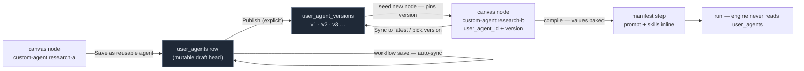

# Feature Specification: Reusable Custom Agents — save, version, reuse

**Spec ID**: 013-reusable-custom-agents
**Created**: 2026-08-13
**Status**: Draft — ready for `/clarify`
**Root**: `backend/app/models/user_agent.py`, `backend/app/api/user_agents.py`, `backend/app/api/agents.py`, `frontend/src/store/api/userWorkflows.ts`, `frontend/src/components/workflow/AgentLibrary.tsx`, `frontend/src/components/workflow/composer/`
**Builds on**: spec [012](../012-per-agent-skills-custom-agents/spec.md) (per-step skills, the blank `custom-agent` template, `instance_id`, sub-agent trees)

---

## 1. Problem

Spec 012 made a custom agent *composable* — a blank `custom-agent` instantiated N times per
workflow, each with its own `instance_id`, display name, prompt and skills. It did not make one
*reusable*. Those three fields live in one workflow's `manifest_json` and nowhere else, so the
moment a user builds a second workflow they retype the prompt from memory.

Part of the answer already exists on this branch and is **unreachable**. `user_agents`
(migration `0032`), the owner-scoped `/api/user-agents` CRUD, and the merge of saved rows into
`GET /api/agents/library` are all built and tested. The frontend has never been wired to any of
it: `grep -rl "user-agent\|UserAgent" frontend/src` returns nothing. There is no way to save an
agent, and — the sharper problem — a saved agent that *did* reach the canvas would not survive
a save (§3, GAP-01).

Three things are missing beyond the wiring. There is no way to tell a saved agent apart from
the nine built-in custom-pool agents in the library, because both land in `pipeline_type:
"custom"`. There is no version history, so editing a saved agent silently changes what the next
workflow gets with no way to pin or review. And there is no record of which workflows use which
saved agent, so nothing can answer "is this safe to delete".

## 2. What it does

**A custom agent node can be saved to a personal library.** An explicit "Save as reusable
agent" action on a `custom-agent` node writes `{name, prompt, skills, icon, description}` to
`user_agents` and links the node to the row it created. Opt-in, never automatic — an
unsaved node stays workflow-local, so the library does not fill with one-off scratch agents.

**Saved agents appear as their own library category.** A "My Agents" category, visually and
functionally distinct from the built-in pool, listing only the caller's rows. Selecting one
seeds a **new** canvas node pre-filled from it.

**Reuse is by copy, and stays that way.** The seeded node is an ordinary
`custom-agent:<instance_id>` step whose prompt and skills are baked into the manifest. No
run resolves an agent id *through* `user_agents`; the engine, loader, compiler and
`allowed_custom_agent_ids` never learn the table exists. This boundary is inherited from the
existing backend and is load-bearing — see `app/api/user_agents.py`'s module docstring for the
~14 `load_agent_spec` call sites, the un-evictable `_SPEC_CACHE`, and the import-time
`SUPPORTED_PIPELINE_TYPES` that launch-by-reference would have to solve first.

**Edits flow one way, by default.** Saving a workflow auto-syncs each linked node's current
name/prompt/skills back to its `user_agents` draft row. Publishing is the deliberate act: it
snapshots the draft as an immutable version `v1, v2, v3, …`. A node pins the version it was
seeded from and only moves when the user picks a different one or presses **Sync to latest** —
so two workflows can legitimately sit on v1 and v3 of the same agent.

**Deletion is guarded by usage.** A `workflow_agent_refs` join table records which saved
workflows reference which saved agent, so the library can show usage and block deletion of an
agent that is still linked. See RISK-02 — because reuse is by copy, this guard is a
product/clarity decision, not a correctness one.

## 3. Verified mechanics — what is already true

Read from the repository at `7d8c42ca`. Facts, not preferences.

| Fact | Source |
|---|---|
| `user_agents` table exists: `{name, prompt, skills, icon, description}` + `user_id/owner_id/workspace_id`, no version column | `app/models/user_agent.py`, migration `0032_user_agents.py` |
| Owner-scoped CRUD exists at `/api/user-agents`: create / list / get / patch / delete, IDOR→404, per-user name uniqueness (409), skill ids validated against the live catalog, bounded input | `app/api/user_agents.py` |
| Security tests exist and pass | `backend/tests/unit/test_user_agents.py` |
| `GET /api/agents/library` **already merges** the caller's saved rows, id-prefixed `user-agent:<uuid>`, `pipeline_type: "custom"`, plus `is_user_agent: true`, `prompt_body`, `skills` | `app/api/agents.py:147-227` |
| That merge fails soft (`SQLAlchemyError` → `db.rollback()` → filesystem roster only) so a missing `0032` cannot 500 the library away | `app/api/agents.py:186-201` |
| Reuse-by-copy is a documented, deliberate boundary — nothing resolves an agent id through the table | `app/api/user_agents.py` module docstring |
| Frontend has **zero** references to any of it | `grep -rl "user-agent\|UserAgent" frontend/src` → 0 |
| Redux stores `AgentDef[]` verbatim from the API — extra fields survive at runtime | `store/slices/agentsSlice.ts`, `store/api/agents.ts` |
| `AgentDef` declares `isCustom`, `instance_id`, `prompt`, `skills`, `prompt_body` — but **no** `is_user_agent` and no saved-agent link field | `frontend/src/types/index.ts:578-624` |
| `instantiateIfTemplate` converts **only** the literal `custom-agent` id; every other agent passes through unchanged | `store/api/userWorkflows.ts:178-190` |
| `agentToManifestStep` branches on `agent.isCustom`: true → `{agent: "custom-agent", instance_id, name}`, false → `{agent_id: agent.id}` | `store/api/userWorkflows.ts:200-208` |
| Save sends `agent_ids` **always**, and `manifest` only when `needsFullManifest()` (node is custom, or has a prompt, skills, or children) | `composer/ComposerPage.tsx:40-48, 458-483` |
| `allowed_custom_agent_ids` + `presort_agent_ids` (which calls `load_agent_spec` on every id) run **only when `body.manifest is None`** | `app/api/user_workflows.py:459, 495` |
| `AgentLibrary` categories are a hardcoded pipeline-type list plus a static `"custom"` bucket; the `notAlreadyAdded` filter exempts only `isCustomAgentTemplate` | `components/workflow/AgentLibrary.tsx:38-47, 96-101` |
| `useAgentLibrary` splits Redux agents on `pipeline_type === "custom"` — saved agents land in `customAgents` alongside the nine built-in custom-pool agents | `hooks/useAgentLibrary.ts:28-35` |
| `Step` carries `instance_id`, `display_name`, `prompt`, `skills` — no saved-agent link field | `agents/workflows/plan.py:388-393` |
| Step keys are a strict allow-list; an unknown key is rejected by name | `agents/workflows/compiler.py::_ALLOWED_STEP_KEYS` |

### The gaps, precisely

**GAP-01 — a saved agent dropped on the canvas cannot be saved or run.** This is the one that
makes the existing backend unreachable rather than merely unwired. A library entry carries
`id: "user-agent:<uuid>"` and no `isCustom` flag, and `instantiateIfTemplate` does not recognise
it, so `agentToManifestStep` takes the built-in branch and emits `{agent_id:
"user-agent:<uuid>"}`. Both save paths then break, differently:

- *No skills on the saved agent* → `needsFullManifest()` is false → `manifest` is omitted →
  the backend runs `allowed_custom_agent_ids` (**422**) and `presort_agent_ids`, which calls
  `load_agent_spec("user-agent:<uuid>")` on a folder that does not exist.
- *Skills present* → `needsFullManifest()` is true → the allow-list is skipped → the row saves
  **successfully** with an unloadable `agent_id`, and the failure surfaces later, at launch.

The `user-agent:` prefix was chosen precisely so this fails loudly instead of silently
resolving something else. Nothing on the frontend performs the conversion it implies.

**GAP-02** — `AgentDef` has no `is_user_agent`, so the saved-vs-built-in distinction the API
already sends is invisible to every consumer.

**GAP-03** — no "My Agents" category; saved agents are indistinguishable from the built-in
custom pool. Separately, `notAlreadyAdded` exempts only the literal template, so a saved agent
disappears from the library after one use even though it is a template meant for N uses.

**GAP-04** — no frontend API client (`createUserAgent`/`listUserAgents`/…) and no "Save as
reusable agent" affordance anywhere in the composer.

**GAP-05** — `prompt_body` → `prompt` and `skills` must be mapped when seeding a node; the two
fields are named differently on purpose (filesystem parity) and are easy to drop.

**GAP-06** — no versioning anywhere: no version column, no versions table, and no link field on
`Step`/`ManifestStep`/`AgentDef` — so nothing can record which agent a node came from, which
makes pinning, syncing and usage-tracking all impossible as the schema stands.

**GAP-07** — no usage tracking. `DELETE /api/user-agents/{id}` deletes unconditionally. Finding
usages by scanning every `workflows.manifest_json` blob is not portable across the SQLite test
DB and Postgres, which is why this spec adds a maintained join table instead.

**GAP-08** — `/api/user-agents` has no tier/entitlement gate and no per-user row cap, unlike the
saved-workflow sibling which calls `can_run_pipeline`.

**GAP-09** — the Simple view (`AgentRow`) has no save affordance; only Canvas is specified here.

## 4. Requirements

Phased. Each phase is independently shippable; **P1 alone delivers the user-visible feature.**

### 4.1 Phase 1 — save, categorise, reuse

**R-01** `AgentDef` gains `is_user_agent?: boolean` and `user_agent_id?: string`, and
`ManifestStep`/`Step` gain an optional `user_agent_id`. Absent on every existing node and step.

**R-02** `instantiateIfTemplate` recognises an `id` matching `^user-agent:` and converts it to a
fresh custom instance: `isCustom: true`, a newly minted `instance_id` unique across the whole
tree (`generateInstanceId(collectAgentIds(...))`), `prompt` seeded from the library entry's
`prompt_body`, `skills` copied, `user_agent_id` set to the uuid after the prefix, and `id` set
to the minted instance id. The `user-agent:<uuid>` id never survives into `pipelineAgents`.

**R-03** Consequently a saved agent compiles to an ordinary `{agent: "custom-agent",
instance_id, name, prompt, skills}` step. `agentToManifestStep` additionally emits
`user_agent_id` when the node carries one. GAP-01 is closed by R-02; no backend allow-list,
compiler or engine change is required for it.

**R-04** The same saved agent may be dropped more than once into one workflow, and more than
once into one tree including as a sub-agent; each drop mints its own `instance_id`. The
library's already-added filter never hides a saved agent.

**R-05** `needsFullManifest()` returns true when any node carries a `user_agent_id`, so a
linked node always takes the manifest save path.

**R-06** The frontend gains `createUserAgent`, `listUserAgents`, `getUserAgent`,
`updateUserAgent`, `deleteUserAgent` in `lib/api.ts`, following the existing
`createUserWorkflow` shape (JWT via `getToken()`, typed response, error message surfaced).

**R-07** The Canvas config rail exposes **Save as reusable agent** on a selected `custom-agent`
node that has no `user_agent_id`. It POSTs `{name, prompt, skills, icon, description}` and on
success sets `user_agent_id` on the node. A 409 (duplicate name) renders inline and does not
lose the composition.

**R-08** A node that already has a `user_agent_id` shows its link state instead of the save
button, with the saved agent's name.

**R-09** Saving the workflow PATCHes `/api/user-agents/{id}` with the current
name/prompt/skills of every linked node — the draft auto-sync. A failed PATCH surfaces as a
warning and never fails the workflow save; the workflow is the user's primary artifact.

**R-10** `useAgentLibrary` exposes saved agents as a distinct group keyed on `is_user_agent`,
not on `pipeline_type === "custom"`, leaving the existing built-in custom pool unchanged.

**R-11** `AgentLibrary` renders a **My Agents** category listing exactly those rows, with its
own count, and marks each card as user-authored. The built-in `custom` category no longer
includes them.

**R-12** Everything in this phase is inert when a user has no saved agents: the library, the
composer and every existing save path behave byte-identically to today.

### 4.2 Phase 2 — versions

**R-13** `user_agents` gains `latest_version INTEGER NOT NULL DEFAULT 0` (additive migration).
`0` means "drafted, never published".

**R-14** New table `user_agent_versions`: `id`, `user_agent_id` (FK), `version` (int),
`name`, `prompt`, `skills`, `icon`, `description`, `created_at`. Unique on
`(user_agent_id, version)`. Rows are immutable once written.

**R-15** `POST /api/user-agents/{id}/versions` snapshots the current draft as
`latest_version + 1`, bumps `latest_version`, and returns the new version. Owner-scoped,
IDOR→404. Publishing an unchanged draft is rejected rather than creating a duplicate version.

**R-16** `GET /api/user-agents/{id}/versions` lists versions newest-first for the picker.

**R-17** `ManifestStep`/`Step`/`AgentDef` gain optional `user_agent_version`. A node seeded from
the library pins the version it was seeded from (`latest_version`, or `null` when the agent has
never been published — a draft-only link).

**R-18** The rail shows `linked to <name> · v<pinned>` and, when `latest_version > pinned`, an
**update available** affordance offering **Sync to latest** and a version picker. Choosing a
version overwrites the node's `prompt`/`skills`/`name` from that snapshot and re-pins.

**R-19** Sync never happens implicitly. A node's baked values change only on an explicit user
action, so an existing workflow's behaviour cannot change because someone edited a saved agent.

**R-20** Auto-sync (R-09) writes the **draft only** and never creates a version. A node pinned
to `v2` whose workflow is re-saved updates the draft; it does not silently become `v3`.

**R-21** A **My Agents** management surface lists saved agents with version history and exposes
publish, edit, and delete. Publishing is available there; the canvas rail links to it.

### 4.3 Phase 3 — usage and deletion

**R-22** New table `workflow_agent_refs`: `workflow_id` (FK `workflows.id`), `user_agent_id`
(FK `user_agents.id`), `user_agent_version`, unique on the triple. Rewritten transactionally on
every user-workflow create/update from the manifest's linked nodes, and cleared when the
workflow is deleted.

**R-23** `GET /api/user-agents/{id}/usage` returns the workflows referencing the agent
(id, name, pinned version), owner-scoped.

**R-24** `DELETE /api/user-agents/{id}` returns **409** naming the referencing workflows when
usage is non-empty. The UI additionally disables the control using R-23 — the server check is
the boundary, the disabled button is the affordance.

**R-25** Deleting a saved agent that is not referenced also deletes its versions (cascade).

**R-26** Workflows that were *seeded* from an agent but never linked (a node whose
`user_agent_id` was cleared, or a pre-Phase-1 workflow) are unaffected by any of this and keep
running from their baked values.

## 5. Out of scope

- **Launch by reference** — resolving a live agent id through `user_agents` at run time. The
  boundary in `app/api/user_agents.py` stands; changing it is its own spec, with `_SPEC_CACHE`
  eviction and DB access from `load_agent_spec`'s ~14 call sites as its actual content.
- Sharing, publishing or importing agents across users, teams or workspaces.
- Saving a **built-in** agent as a reusable agent (its prompt lives in `AGENT.md`).
- Saving a whole sub-agent **subtree** as one reusable unit — this spec saves single nodes.
- Version diffing, rollback of a published version, or branching version lineages.
- A save affordance in the Simple view (GAP-09) or in the wizard's `AgentsPopup`.
- Any change to the engine, compiler, `load_agent_spec`, or `allowed_custom_agent_ids`.

## 6. Acceptance criteria

| # | Criterion | Phase |
|---|---|---|
| AC-01 | Dropping a saved agent onto the canvas produces a node with `isCustom: true`, a freshly minted `instance_id`, the saved prompt and skills, and no `user-agent:` id anywhere in `pipelineAgents`. | 1 |
| AC-02 | That workflow saves with **200** and its manifest step is `{agent: "custom-agent", instance_id, …}` — not `{agent_id: "user-agent:…"}`. | 1 |
| AC-03 | The same saved agent dropped three times yields three distinct `instance_id`s, all of which run. | 1 |
| AC-04 | A saved agent stays visible in the library after being added, and can be added as a sub-agent. | 1 |
| AC-05 | "Save as reusable agent" on a custom node creates the row, links the node, and the agent appears under **My Agents** on the next library open. | 1 |
| AC-06 | A duplicate name returns 409 and renders inline; the composition is intact and re-savable under a new name. | 1 |
| AC-07 | The nine built-in custom-pool agents remain in the `custom` category and out of **My Agents**. | 1 |
| AC-08 | Editing a linked node's prompt and saving the workflow updates the draft row; a PATCH failure warns without failing the workflow save. | 1 |
| AC-09 | A user with no saved agents sees a library, composer and save path byte-identical to today. | 1 |
| AC-10 | Publishing snapshots the draft as `v1`, then `v2`; both are readable and immutable; republishing an unchanged draft is rejected. | 2 |
| AC-11 | A node pinned to `v1` still shows `v1` after the agent is published to `v3`, and its manifest still carries the `v1` values. | 2 |
| AC-12 | **Sync to latest** rewrites that node to `v3`'s values and re-pins; nothing changes until it is pressed. | 2 |
| AC-13 | Two workflows pinned to different versions of one agent each run with their own values. | 2 |
| AC-14 | Re-saving a workflow containing a `v2`-pinned node updates the draft and does **not** create `v3`. | 2 |
| AC-15 | `usage` lists exactly the workflows referencing an agent, and drops a workflow from the list when it is deleted or the node is removed. | 3 |
| AC-16 | Deleting a referenced agent returns 409 naming the workflows; deleting an unreferenced one returns 204 and removes its versions. | 3 |
| AC-17 | Cross-owner ids return 404 on every new endpoint (`versions`, `usage`), never 403. | 1–3 |
| AC-18 | With `user_agents` missing (migration unapplied), the library still serves the filesystem roster and the composer still works. | 1 |

## 7. Risks

**RISK-01 — GAP-01 is latent in two different shapes.** One path 422s at save; the other saves
successfully and fails at launch. A fix verified only against the first leaves the second
shipping broken rows. AC-02 tests the persisted manifest shape, not just the HTTP status.

**RISK-02 — the delete guard protects a failure that cannot occur.** Because reuse is by copy,
a workflow's manifest carries the full prompt and skills; deleting the saved agent it came from
cannot break the run. R-24 therefore guards *link integrity and user comprehension*, not
correctness, and it is strictly more restrictive than the data requires — a user who wants the
agent gone must first edit every workflow using it. The lighter alternative is to allow the
delete, clear the links, and show the affected nodes as "unlinked (agent deleted)" while they
keep running. **Open decision, deliberately surfaced rather than assumed.**

**RISK-03 — draft auto-sync is a silent write.** R-09 makes saving a workflow mutate a row that
other workflows read when they next sync. It cannot change their baked values (R-19), but it
does change what "latest" means for them. Publishing being explicit (R-15) is what keeps this
tolerable; if auto-sync ever bumps a version, R-19's guarantee is gone.

**RISK-04 — `workflow_agent_refs` can drift.** It is a denormalised index of the manifest. If a
write path updates `manifest_json` without rewriting refs, `usage` under-reports and the delete
guard passes when it should not. R-22 requires the rewrite to be transactional with the
workflow write, in one place.

**RISK-05 — step-schema growth against strict-key validation.** `user_agent_id` and
`user_agent_version` must be added to `_ALLOWED_STEP_KEYS` or every manifest carrying them is
rejected by name. They must also be inert for the compiler — recorded, never resolved — or the
reuse-by-copy boundary is breached by accident.

**RISK-06 — unbounded rows (GAP-08).** No tier gate and no per-user cap means saved agents are
an unmetered write surface. Not exploited by anything in this spec, but it grows with it.
