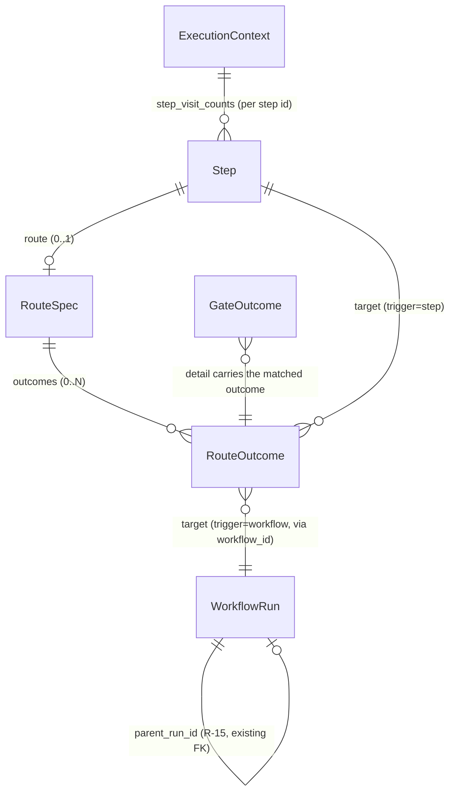

# 014 — Data Model

Derived from spec.md §4.1 (R-01 through R-05b, R-26, R-27). No database migrations — every
entity below is either a compiled-plan dataclass (in-memory, produced by `compiler.py`, never
persisted directly) or reuses an existing column unmodified.

## RouteOutcome

One possible destination a conditional gate can send execution to, for one condition value.

| Field | Type | Notes |
|---|---|---|
| `trigger` | `str` | `"step"` (in-workflow cursor jump) or `"workflow"` (cross-workflow trigger) — R-05b |
| `target` | `str` | `trigger="step"`: a step id in the SAME compiled workflow, compile-time validated (R-10). `trigger="workflow"`: a saved `user_workflow_id`, or the literal `"self"`, compile-time validated (R-10) |

**v1 constraint (R-04)**: single target only — not yet `list[str]`. Widening later is additive,
not a breaking migration (the field stays named `target`, the type widens).

## RouteSpec

Attached to a `Step` via the new sibling `route:` manifest key (R-02), only meaningful when
`"conditional"` is present in that step's `gates:` list (R-03 — compiler rejects the mismatch
either direction).

| Field | Type | Default | Notes |
|---|---|---|---|
| `condition_agent` | `str \| None` | `None` | `None` = this step's own artifact (R-05). May name an EARLIER step, including one whose gate is `human` — reads that gate's captured response the same way. |
| `outcomes` | `dict[str, RouteOutcome]` | `{}` | condition value → destination. Compile-time validated: every value must declare a valid `trigger`/`target` pair (R-10), and the decision source must declare `produces: ["route_decision"]` (R-27). |
| `default_next` | `str \| None` | `None` | Step id fallback when no `outcomes` key matches the resolved decision value. `None` = the run terminates at this step (Option 2 shape, R-13 — applies identically whether the "no match" case or an explicit `trigger: "workflow"` outcome is what stops the run). |
| `loop_max_iterations` | `int` | `5` | Cap on revisits to any ONE `trigger: "step"` target reached via a backward jump (R-07). Enforced per-run via `ExecutionContext.step_visit_counts`. |
| `trigger_max_depth` | `int` | `5` | Cap on `parent_run_id` chain depth for `trigger: "workflow"` outcomes (R-18). **Fixed at exactly 5 in v1** (R-19, clarified) — the compiler REJECTS any other declared value; the field exists so a future spec can widen the ceiling without a schema/dataclass change. |

## Step (extended)

Two new fields on the existing `Step` dataclass (`agents/workflows/plan.py`):

| Field | Type | Default | Notes |
|---|---|---|---|
| `route` | `RouteSpec \| None` | `None` | Authored (via the `route:` manifest key), compiler-parsed. |
| `is_leaf` | `bool` | `False` | **Compiler-COMPUTED, never authored** (R-26). True iff no `route` outcome (from any step) or default linear-next relationship points FROM this step to a later continuation — i.e., this step has nothing compiled to run after it on any path that reaches it. Drives the engine's `single_file` deliverable readback (replaces the old `index == len(ordered_agents) - 1` check). |

## ExecutionContext (extended)

Two new per-run mutable fields (`agents/execution_engine/context.py`):

| Field | Type | Default | Notes |
|---|---|---|---|
| `step_visit_counts` | `dict[str, int]` | `{}` | Keyed by step id. Incremented before each re-dispatch beyond the first (R-07). Checked against the TARGET step's `route.loop_max_iterations` before a backward `trigger: "step"` jump proceeds. |
| `trigger_depth` | `int` | `0` | Set at run-mint time: `0` for a non-triggered run, `parent's trigger_depth + 1` for a triggered run (R-18). Compared against the fixed ceiling of `5` (R-19) before `run_trigger_workflow` proceeds. |

## GateOutcome (extended vocabulary, no shape change)

`gates/base.py`'s existing `GateOutcome` dataclass (`outcome: str`, `events: list[dict]`,
`detail: dict | None`) is unmodified in shape — only its `outcome` vocabulary grows:

| Constant | Value | Notes |
|---|---|---|
| `GATE_PASS` | `"pass"` | existing |
| `GATE_BLOCK` | `"block"` | existing |
| `GATE_WAIT_HUMAN` | `"wait_human"` | existing |
| `GATE_ROUTE` | `"route"` | **NEW** — `detail` carries `{"trigger": "step" \| "workflow", "target": str}`, the matched `RouteOutcome`'s fields, verbatim. |

## route_decision (typed artifact, not a schema entity)

Not a database table or dataclass — a **convention** for an agent-produced typed artifact,
read via the existing `_latest_typed_content` mechanism (R-05b):

- An agent step supplying a routing decision declares `produces: ["route_decision"]`.
- Its content is JSON, exactly one key: `{"decision": "<value>"}`.
- `ConditionalGate.evaluate()` `json.loads`s the content and matches `parsed["decision"]`
  against `route.outcomes`' keys. Malformed JSON or a missing `"decision"` key is treated as
  "no match" (falls through to `default_next`), not a crash.
- `<value>` is entirely workflow-author-defined — boolean-like (`"pass"`/`"fail"`) and
  multi-value (`"hotfix"`/`"feature"`/`"bug"`/`"restart"`) are the same mechanism; the gate has
  no built-in notion of arity.

## WorkflowRun (extended terminal vocabulary, existing table — no migration)

`app/models/workflow.py::WorkflowRun`. `status` is a free `String` column (no `sa.Enum`) — no
migration needed to add a new value:

| `status` value | New? | Notes |
|---|---|---|
| `"running"`, `"clarifying"`, ..., `"completed"`, `"failed"`, `"cancelled"`, `"degraded"` | existing | unchanged |
| `"diverted"` | **NEW (R-14)** | The triggering run's terminal status after a `trigger: "workflow"` outcome fires. Added to `state_machine.py`'s `TERMINAL_STATES` frozenset (Python-level, not a DB constraint — no migration). |

`parent_run_id` (existing FK, `app/models/workflow.py:50`) is reused **unmodified** — R-15 sets
it on the newly-minted run, exactly as `prototype_revision` already does for its own case.
`owner_id`/`workspace_id` on the new run unconditionally equal the triggering run's values.

## Relationships (entity diagram)

