# Conditional Gates & Loops — Component Flow and Change Analysis

Research output from a `/velocity analyze` pass, going layer-by-layer from the
custom-workflow canvas down to the actual model invocation, to scope what
"a conditional gate that routes to a next node (branching / looping), and can
also trigger a separate workflow" touches.

**Rewritten 2026-08-20 (v3)** — expands scope beyond the original single-workflow
routing analysis. The user's requirements split the feature into two materially
different capabilities that this revision now scopes separately:

- **In-workflow routing** (branch forward / loop backward to a step in the
  *same* compiled run) — this is what v1/v2 of this doc already scoped as a
  gate-outcome cursor jump. Confirmed unchanged this pass.
- **Cross-workflow triggering** (a conditional gate launches a *different*
  workflow, or a fresh instance of the *same* workflow, as a new run) — this
  is genuinely new territory. No prior pass investigated it. This revision
  adds full findings for it below, layer by layer.

No implementation has started for either half — `RouteSpec`, `GATE_ROUTE`,
`ConditionalGate`, `loop_back_to` and any cross-workflow trigger primitive are
all still absent from the tree.

**Scope of the feature, restated in the 5 requirements as given**:

1. A conditional gate is a step-attached capability in the workflow (not a new
   step *kind* — a `gates:[...]` entry like `human`, evaluated at the step
   boundary).
2. Its condition is supplied by an **agent node** — an upstream agent writes a
   typed routing decision as its produced artifact; the gate reads that
   artifact back. Not an authored DSL expression (Velocity's no-DSL invariant,
   D-08, forbids that).
3. It can route the run back to an **existing node in a previous step**, and
   the workflow continues executing from there — a loop.
4. It can also **trigger another workflow**, or **the same workflow again**,
   at some other point — a cross-run spawn, not a cursor jump within one run.
5. On the canvas, a gate node can point at an **existing node** (in-workflow
   routing, req. 3/4-same-workflow) or attach a **totally different pipeline**
   (cross-workflow trigger, req. 4-other-workflow).

**How to read the diagram**: every node carries a status tag —
**🟢 NO CHANGES** means the component was investigated and confirmed already
agnostic to routing/branching/looping/triggering. **🔴 CHANGES NEEDED** means
code in that component has to change for this feature. Green-filled nodes =
no changes; red-filled nodes = changes needed.

---

## Flow diagram — frontend canvas to model invocation

```mermaid
flowchart TD
    subgraph FE["Frontend — composer canvas"]
        TY["types/index.ts<br/>ManifestStep :559-593 / AgentDef :619-664<br/>🔴 new route field + trigger_workflow field"]
        CN["CanvasNode.tsx :36-374<br/>port() :106<br/>🔴 new gate/decision node kind + external-pipeline node kind"]
        CV["CanvasView.tsx<br/>chainEdges :674-689 / treeEdges :690-710<br/>🔴 chain+tree layout → real graph layout + connect-to-node + attach-workflow gestures"]
        RGS["ReviewGatesSection.tsx :43-174<br/>checkbox map :131<br/>🟢 pattern reference only, not reused"]
        CP["ComposerPage.tsx<br/>handleSave :446-549 / handleRunOnce :563-649<br/>🔴 save/run payload must carry routes + external triggers"]
    end

    subgraph API["Backend API — ingress"]
        RC["app/api/run_commands.py::launch_run :2213<br/>🟡 unaffected for in-workflow routing;<br/>🔴 NEW internal call path for cross-workflow trigger"]
        UW["app/api/user_workflows.py::save_workflow<br/>🟢 generic agent_id merge, unaffected"]
        SEL["agents/workflows/selections.py<br/>_LEVER_KEYS :43 / _synthesize_step :81<br/>🟢 unless routing becomes a run-time lever"]
    end

    subgraph COMPILE["Workflow compilation"]
        MAN["agents/workflows/manifest.py<br/>🟢 steps are raw dicts"]
        COMP["agents/workflows/compiler.py<br/>_ALLOWED_STEP_KEYS :78 / _compile_fanout :999 / _validate_dag :1299<br/>🔴 _compile_route, _validate_route_targets, _compile_trigger"]
        PLAN["agents/workflows/plan.py<br/>FanoutSpec :196<br/>🔴 new RouteSpec + TriggerSpec, Step.route / Step.trigger fields"]
    end

    subgraph RESOLVE["Order resolution"]
        RES["agents/execution_engine/resolver.py<br/>WorkflowResolver::_detect_cycles :264-290<br/>🟢 route/trigger targets never enter this DAG"]
    end

    subgraph KERNEL["Execution kernel"]
        CTX["agents/execution_engine/context.py<br/>ExecutionContext :42 (432 lines)<br/>🔴 step_visit_counts, loop cap, trigger_depth cap"]
        GATE["agents/capabilities/gates/conditional.py — NEW FILE<br/>evaluate() pattern: validation.py :72 / security.py :81<br/>🔴 GATE_ROUTE + GATE_TRIGGER outcomes"]
        ENG["agents/execution_engine/engine.py (10,030 lines)<br/>dispatch loop :2586 / outcome arms :2685,2711<br/>🔴 cursor while-loop + route branch + iteration cap + trigger dispatch"]
        KS["agents/execution_engine/kernel_services.py<br/>run_human_gate :1233<br/>🔴 NEW run_trigger_workflow delegate for cross-run spawn"]
    end

    subgraph SPAWN["Cross-run spawn (NEW — req. 4)"]
        WR["app/models/workflow.py::WorkflowRun<br/>parent_run_id :50 (existing FK, currently prototype_revision-only)<br/>🟡 reused, not extended — new run row, same shape"]
        LR2["launch_run (internal call, not HTTP) — NEW path<br/>🔴 needs a non-HTTP entry point into the same mint+spawn logic"]
    end

    subgraph COMPOSE["Per-step composition"]
        FAC["agents/factory.py::create_runner :200<br/>🟢 builds one agent in isolation"]
        LOAD["agents/loader.py::AgentSpec<br/>produces/consumes :80-81<br/>🟢 already open-ended"]
    end

    subgraph RUNTIME["Agent runtime"]
        RUN["app/agents/deep_agent_runner.py<br/>astream_events :479 / _gate_payload :790<br/>🟢 no pipeline awareness"]
        DA["deepagents library<br/>create_deep_agent<br/>🟢 no workflow concept at all"]
        MF["app/agents/model_factory.py::build_model :29<br/>🟢 provider select, unrelated"]
    end

    BEDROCK[["ChatBedrockConverse / ChatAnthropic<br/>the actual model call"]]

    TY --> CP
    CN --> CV
    CV --> CP
    RGS -. pattern reference only .-> CN
    CP -->|"handleSave / handleRunOnce"| RC

    RC --> UW
    RC --> SEL
    RC -->|"compile_for_run"| MAN

    MAN --> COMP
    COMP -->|"Step.route / Step.trigger resolved + validated"| PLAN
    PLAN -->|"CompiledWorkflow.steps"| RES

    RES -->|"ordered_agents (topo order)"| CTX
    CTX --> ENG
    ENG -->|"_evaluate_gates(phase=pre)"| GATE
    GATE -->|"GateOutcome(GATE_ROUTE, next_step_id)"| ENG
    GATE -->|"GateOutcome(GATE_TRIGGER, workflow_ref)"| KS
    KS -->|"run_trigger_workflow(...)"| LR2
    LR2 -->|"mint new WorkflowRun"| WR
    ENG -->|"KernelServices.run_agent per step"| KS
    KS --> FAC
    FAC -->|"load_agent_spec"| LOAD
    FAC -->|"DeepAgentRunner(...)"| RUN
    RUN --> DA
    RUN -->|"build_model(ctx.model)"| MF
    MF --> BEDROCK
    DA -->|"astream_events"| RUN

    classDef nochange fill:#d3f9d8,stroke:#2f9e44,color:#1b1b1b;
    classDef changed fill:#ffe3e3,stroke:#e03131,color:#1b1b1b;
    classDef reused fill:#fff3bf,stroke:#e8590c,color:#1b1b1b;
    classDef terminal fill:#e7e7e7,stroke:#495057,color:#1b1b1b;

    class RGS,UW,SEL,MAN,RES,FAC,LOAD,RUN,DA,MF nochange;
    class TY,CN,CV,CP,COMP,PLAN,CTX,GATE,ENG,KS,LR2 changed;
    class RC,WR reused;
    class BEDROCK terminal;
```

**Legend**: 🟢 no changes needed. 🔴 changes needed. 🟡 an existing mechanism
that is *reused as-is*, not modified — flagged separately from 🟢 because it's
load-bearing for the new feature even though its own code doesn't change. The
in-workflow loop-back/branch mechanism is a cursor jump inside `ENG`; the
cross-workflow trigger mechanism is a brand-new spawn path that mints a
**second `WorkflowRun` row**, not a cursor jump.

---

## Part A — In-workflow routing (branch + loop, requirements 1–3)

This is the mechanism from the prior pass, re-confirmed against current code.
Ordered bottom-up (runtime → canvas). All paths relative to `backend/` or
`frontend/src/` unless stated.

### Deep Agents (`deepagents` library / `create_deep_agent`)
- 🟢 No Changes

The library only runs one agent's own tool-call loop. It has no concept of
"the pipeline" — routing is entirely outside its scope by design.

### Runner (`app/agents/deep_agent_runner.py::DeepAgentRunner`)
- 🟢 No Changes

`astream_events` (`:479`) streams one agent invocation's own chunks/tool
calls/usage. Its existing `gate` event (`:735`, `_gate_payload` `:790`)
detects a LangGraph in-graph interrupt, resumed via `Command(resume=...)`
back into the same graph (`:517`). Never decides what runs next.

### Model factory (`app/agents/model_factory.py::build_model`)
- 🟢 No Changes — `:29`, provider/model selection, unrelated to routing.

### Factory (`agents/factory.py::create_runner`)
- 🟢 No Changes — `:200`, builds one agent's runnable in isolation. A
  routing/decision agent is just an agent from factory's perspective: it
  communicates its decision as a produced artifact like any other.

### Loader (`agents/loader.py::AgentSpec`)
- 🟢 No Changes

`produces`/`consumes` (`:80-81`) already accept arbitrary strings, so an
agent declares `produces: ["route_decision"]` unmodified today. Routing is a
workflow-shape concern, belongs on the compiled `Step`, not `AgentSpec`.

### Kernel services (`agents/execution_engine/kernel_services.py`)
- 🟢 No Changes (for routing) — see Part B for the new trigger delegate.

The "agent decides" case is handled by the decision agent running as a normal
step; the conditional gate reads its typed artifact via `_latest_typed_content`
(`engine.py:7576`, delegated `kernel_services.py:1305`) — the same mechanism
`task_loop` already uses. No new delegate method for routing itself — this
avoids a second HITL-style surface; `:1252` documents there is **no** sibling
`run_approval_gate` for exactly this reason.

### Resolver (`agents/execution_engine/resolver.py::WorkflowResolver`)
- 🟢 No Changes — conditional on the compiler design below.

`_detect_cycles` (`:264-290`) only walks the `dependencies` dict built from
declared step-to-step edges. As long as route/loop targets live on
`Step.route` (never folded into `depends_on`), they never enter this graph.

### Backend launch/save API (`app/api/run_commands.py`, `user_workflows.py`, `selections.py`)
- 🟢 No Changes — for in-workflow routing specifically.

`launch_run` (`app/api/run_commands.py:2213`) is unaffected if routing is
workflow-author-declared (`workflow.yaml` only). Grows only if the composer
UI lets an end user edit branches as a run-time lever — then `selections.py`'s
`_LEVER_KEYS` (`:43`) / `_synthesize_step` (`:81`) need a `route` entry.

### Gate-selection UI (`frontend/src/components/workflow/ReviewGatesSection.tsx`)
- 🟢 No Changes — pattern reference only.

Flat per-agent checkbox list (`:43-174`, render at `:131`) reporting an
unordered `gateAgentIds: string[]` (`:36`) — structurally unable to express
"branch to B if X else C." A conditional gate needs a per-node branch-target
editor.

### Gate capability layer (`agents/capabilities/gates/*.py`, `agents/capabilities/registry.py`)
- 🔴 Changes Required

1. New file `gates/conditional.py` — `ConditionalGate.evaluate(step, ctx) ->
   GateOutcome` (simple awaited pattern like `security.py:81` /
   `validation.py:72`, not the stream+collector pattern human/approval use).
2. `gates/base.py:23-25` — add `GATE_ROUTE = "route"` alongside the current
   three outcomes (`GATE_PASS`, `GATE_BLOCK`, `GATE_WAIT_HUMAN`).
3. No new `GateOutcome` field required for routing — reuse the existing
   `detail: dict | None` (`base.py:33-40`) to carry `{"next_step_id": ...}`.
4. `agents/capabilities/registry.py` — register `("gate", "conditional")`
   (mirrors `_KNOWN` `:110-113`, currently `human`/`validation`/`approval`/
   `security`); `resolve()`/`is_registered` need no structural change.

### Per-run state (`agents/execution_engine/context.py::ExecutionContext`)
- 🔴 Changes Required

1. Add `step_visit_counts: dict[str, int]` — the natural home since
   `ExecutionContext` (`@dataclass` `:42`, 432 lines) already carries other
   per-run mutable state.
2. Add an optional `loop_max_iterations` cap field to back the engine's
   visit-count guard (see "Engine dispatch loop" below).

### Workflow compilation (`agents/workflows/plan.py`, `manifest.py`, `compiler.py`)
- 🔴 Changes Required

1. `plan.py` — new `RouteSpec` dataclass (mirrors `FanoutSpec` `:196`):
   `condition_agent`, `branches: dict[str, str]`, `default_next`,
   `loop_back_to`, `max_iterations: int = 1`. Add `Step.route:
   RouteSpec | None = None`.
2. `manifest.py` — no change — steps are raw dicts, unaffected by a new key.
3. `compiler.py` — add `"route"` to `_ALLOWED_STEP_KEYS` (`:78`) plus a new
   `_ALLOWED_ROUTE_KEYS`; add `_compile_route()` (mirrors `_compile_fanout()`
   `:999`); add `_validate_route_targets()` (mirrors
   `_validate_fanout_source_upstream` `:1260`) — this must check every
   `branches`/`loop_back_to`/`default_next` value resolves to a real step id
   in this workflow, or compilation fails fast rather than 404ing at runtime.
4. Critical carve-out: `_validate_dag` (`:1299`) builds its Kahn graph
   exclusively from `step.depends_on`. `route.loop_back_to` must never be
   folded into `depends_on` — it stays on its own field, invisible to the
   cycle detector by construction, exactly like `fanout`/
   `task_source.source_step` already are. Zero changes to `_validate_dag`'s
   algorithm itself.

### Engine dispatch loop (`agents/execution_engine/engine.py`, 10,030 lines)
- 🔴 Changes Required — the largest single backend change

1. `:2586` — convert the main
   `for i, spec in enumerate(ordered_agents):` loop to an index-based `while`
   loop with a mutable cursor, so a route outcome can set `next_i` to any
   index (forward branch, or `<= i` for a loop-back).
2. `:2685` (`if _outcome == "cancel":`) and `:2711`
   (`if _outcome in ("block", "wait_human"):`) — add a `"route"` arm to this
   gate-outcome consumer. The `(None, outcome, detail)` sentinel shape (e.g.
   `:5760`, `:5776`) needs no signature change.
3. Add a visit-count cap check per step, failing closed like the existing
   `BudgetExceeded` pattern (imported `:86`, raised/caught around `:2868`) —
   required since nothing today bounds re-entry once cycles are legal.
4. `:6291` — `gate_key = f"{pipeline_run_id}:{agent_id}"` must become
   visit-count-aware (`f"{run_id}:{agent_id}:{visit_count}"`), or a revisited
   step's gate collides with its own prior firing. (Also parsed back out at
   `:8650`.)
5. `ectx.failed_invocations` (populated `:3618`, read `:3187-3203`) keying
   needs the visit count folded in, or a failure on loop-pass 1 can mask a
   retry on pass 2.
6. Scope call for v1: `_first_incomplete_step` (`:8544`) and its
   companions (`:8762`, `:8769`, `:8968`, `:9540`) all assume a step id
   appears at most once per run. Recommend loops/branches are
   non-resumable across a process restart for v1 rather than reworking
   crash-resume for a new feature.

### Frontend types (`frontend/src/types/index.ts`)
- 🔴 Changes Required — see Part B for the trigger-specific addition.

1. `ManifestStep` (`:559-593`) and `AgentDef` (`:619-664`) both need a new
   field — `next?: string | {condition: string; to: string}[]` plus a
   `kind?: "agent" | "gate"` discriminator — defaulting to "next array
   element" so existing linear workflows are unaffected.
2. `depends_on` stays as-is (a derived data-dependency list); routing is a
   new, separate control-flow field.

### Canvas renderer (`frontend/src/components/workflow/composer/CanvasView.tsx`)
- 🔴 Changes Required — real new layout logic, not an extension. See Part B
  for the attach-external-workflow gesture.

1. There is currently zero data-backed edge concept: `chainEdges`
   (`:674-689`) and `treeEdges` (`:690-710`, joined at `:711`) are computed
   fresh every render purely from array order + `children`, with node
   x-position strictly `nodeLeft(i)` left-to-right (`:52`) — this needs to
   become a real layered/graph layout.
2. `moveAgentInTree`'s drag-reparent (`:81-89`) explicitly rejects cycles via
   `isDescendant` (`:68-74`, also guarded inline at `:638`) — there's no
   existing gesture for "connect to an existing node" (requirement 3/5); a
   new connect gesture is needed that, unlike drag-reparent, **must allow**
   a target that is an ancestor (that's the loop-back case) while still
   rejecting a connection that isn't reachable from a routing gate at all.
3. Branch targets need to be placed side-by-side; loop-back edges need to be
   drawn as curves around the row rather than as a downward tree branch —
   the single largest frontend item.

### Canvas node (`frontend/src/components/workflow/composer/CanvasNode.tsx`)
- 🔴 Changes Required — contained. See Part B for the external-pipeline kind.

1. Exactly one node kind exists today (component spans `:36-374`),
   non-recursive by design — needs a new `kind` prop.
2. A distinct visual (diamond/decision shape) for `"gate"`.
3. Multi-port rendering — today's ports (`port()`, `:106`) are a fixed
   positional set (`l/r/t/b`), with no concept of "port N of an N-way
   branch."

### Save/run payload (`frontend/src/components/workflow/composer/ComposerPage.tsx`)
- 🔴 Changes Required

1. Both `handleSave` (`:446-549`) and `handleRunOnce` (`:563-649`) currently
   reduce `pipelineAgents` to a flat ordered `agent_ids`/`ManifestStep[]`
   (gated through `needsFullManifest`, `:45`), discarding any branch info —
   needs to carry the new routing structure.
2. Once any node carries `next`/branches, both must always take the
   full-manifest path.
3. `buildWorkflowManifest` (imported `:31`) must serialize the new field per
   step.

---

## Part B — Cross-workflow triggering (requirement 4, new this revision)

**This is not a cursor jump.** Everything in Part A operates inside one
compiled `ordered_agents` list belonging to one `WorkflowRun` row. Requirement
4 — "trigger another workflow, or the same workflow again, at another point"
— means minting a **second, independent `WorkflowRun`**. That run has its own
id, its own SSE stream, its own state machine, its own sandbox. The gate that
triggers it is a launch point, not a router.

### What already exists that this can reuse

- **`WorkflowRun.parent_run_id`** (`app/models/workflow.py:50`, FK to
  `workflow_runs.id`, indexed at `:18`) — already exists, already links a
  child run to a parent. Today it is used for exactly one case:
  `prototype_revision`, gated by `ectx.is_revision_workflow`
  (`context.py:228`, sourced from `compiled.deliverable.revises_existing`,
  `plan.py:286`, compiled `compiler.py:1253`). The column and index are
  general-purpose; only the *gating condition* for setting it is
  revision-specific today. A trigger-spawned run is a second, structurally
  identical use of the same column — set `parent_run_id` to the triggering
  run's id.
- **`previous_run` context provider**
  (`agents/capabilities/context_providers/previous_run.py`) — already seeds a
  parent run's artifacts into a child's sandbox, already enforces
  `ScopedStore.assert_owns(parent_run_id)` before doing so
  (`kernel_services.py` docstring `:178`, `authz.py:1486`). This is the right
  pattern to reuse for handing the triggered workflow whatever context it
  needs from the triggering run — NOT a new ad-hoc seeding path.
- **`execution_strategy` column** (`app/models/workflow.py:55`,
  `app/agents/types.py:94-95`) already has `"conditional"` reserved as a
  forward value in its comment (alongside `sequential`/`parallel`), never
  implemented. This is a strong signal the schema already anticipated
  something like this feature and left the slot open.
- **`run_fanout`** (`kernel_services.py:1025`) is the closest *existing*
  spawn mechanism, but it is the wrong shape to reuse directly — it spawns
  **worker agents** within the same run (recorded as `SubagentRun` rows,
  `app/models/subagent_run.py`, with `parent_step`/`worker_agent`/`depth`),
  not independent workflow runs with their own lifecycle/SSE/state machine.
  A trigger needs a full second `WorkflowRun`, not a `SubagentRun`.

### What is genuinely new

- 🔴 **`launch_run` has no non-HTTP entry point.** `app/api/run_commands.py`
  `:2213` is an HTTP handler (`Depends(get_current_user)`, request/response
  models). The kernel calling it from inside a running dispatch loop cannot
  go through FastAPI. The mint-and-spawn logic inside `launch_run` needs to
  be extracted into a plain async function the HTTP handler calls (thin
  wrapper) AND the kernel can call directly. This is the single largest new
  piece of backend work for requirement 4 — nothing in the prior pass
  anticipated it because Part A never needed to leave the current run.
- 🔴 **New gate outcome `GATE_TRIGGER`** (`gates/base.py`, alongside the new
  `GATE_ROUTE`) — `detail` carries `{"workflow_ref": ..., "wait": bool}`.
  `workflow_ref` is either a saved `user_workflow_id` (trigger a different,
  named workflow) or a sentinel meaning "this same workflow definition"
  (trigger a fresh instance of itself — the "same workflow at another
  point" half of requirement 4).
- 🔴 **New kernel delegate `run_trigger_workflow`** on
  `kernel_services.py`, parallel to `run_human_gate` (`:1233`) and
  `run_fanout` (`:1025`) — NOT folded into either, since (a) it's not a HITL
  surface like `run_human_gate` and (b) it doesn't spawn a `SubagentRun`
  worker like `run_fanout`. It calls the new non-HTTP `launch_run` core with
  `parent_run_id` set to the current run.
- 🟡 **`wait: bool` semantics need a design decision, not just code**: does
  the triggering step block until the triggered workflow completes
  (synchronous, like an inline sub-call), or fire-and-forget (async, the
  triggering workflow's own dispatch loop continues immediately)? This
  changes whether `run_trigger_workflow` is awaited inline in the dispatch
  loop or spawned onto a queue and forgotten. **Open design question — see
  "Open items" below.**
- 🔴 **`ExecutionContext`** needs a `trigger_depth: int` (or reuse the
  existing `SubagentRun.depth` convention) with a cap, mirroring
  `step_visit_counts`' loop cap — otherwise workflow A triggering workflow A
  triggering workflow A is an unbounded recursion with no existing guard.
  `BudgetExceeded` (Part A item 3) bounds *loops inside one run*; it does
  NOT bound a chain of separately-minted runs each starting a fresh budget.
  This needs its own cap, tracked via `parent_run_id` chain depth at mint
  time (a query up the `parent_run_id` FK chain, or a depth counter threaded
  through the trigger call).
- 🔴 **Ownership/authz**: `previous_run.py`'s `assert_owns` pattern
  (`authz.py:1486`) exists for *reading* a parent's context. Triggering
  writes a *new* run — need to confirm the new run's `owner_id`/`workspace_id`
  (AUTHZ-01 pattern, same as `SubagentRun`'s `nullable=False` owner columns)
  are set to the triggering user, not silently inherited or left null.
- 🔴 **Frontend types**: `ManifestStep`/`AgentDef` need a `trigger?:
  {workflow_id: string | "self", wait: boolean}` field, separate from the
  in-workflow `route` field from Part A.
- 🔴 **Canvas**: a new `CanvasNode` kind — an "external pipeline" reference
  node, visually distinct from both the agent node and the gate diamond
  (req. 5's "totally different pipeline" case). Needs a picker UI to select
  a saved workflow (reuses whatever component lists saved workflows for
  "my workflows" today — not investigated this pass, flagged as open item).

### Net new component count for Part B

Two backend files with no Part-A equivalent (`launch_run` core extraction,
`run_trigger_workflow` delegate), one schema reuse (`parent_run_id` — no
migration needed, the column and index already exist), one new gate outcome,
one new frontend node kind, one new picker UI.

---

## Net shape of the change

Three, not two, distinct pieces of work:

1. **In-workflow control-flow primitive** (Part A): gate outcome → mutable
   dispatch cursor → visit-capped safety net, entirely inside one
   `WorkflowRun`. Confirmed unchanged from the prior pass.
2. **Cross-workflow spawn primitive** (Part B): gate outcome → a genuinely
   new non-HTTP `launch_run` entry point → a second `WorkflowRun` linked via
   the already-existing `parent_run_id` column, with its own depth cap and
   its own wait/no-wait semantics decision.
3. **A frontend graph-editor rewrite** (both parts): the canvas today is
   structurally a linear-chain-plus-tree, not a graph, and needs two new
   gestures (connect-to-existing-node for Part A, attach-external-pipeline
   for Part B) plus two new node kinds (gate diamond, external-pipeline
   reference) — `CanvasView.tsx`, `CanvasNode.tsx`, gate-selection UI,
   save/run payload.

Nothing below the gate-capability layer moves in either part — the LLM
runtime genuinely doesn't need to know branching or triggering exists.

## Open items / not yet verified

- **Part B wait/no-wait semantics** — genuinely undecided; needs a design
  answer before `run_trigger_workflow` can be written. Does the triggering
  workflow's dispatch loop block on the triggered run, or continue
  immediately? Does "trigger the same workflow again" mean a full restart
  from step 0, or a resume-style re-entry? Recommend scoping v1 to
  fire-and-forget only (simpler kernel change, no blocking-await-on-another-
  run's-SSE-stream machinery needed) unless the user has a concrete
  synchronous use case.
- **Which saved-workflow picker UI to reuse** for Part B's canvas node —
  not investigated this pass. Likely candidates: whatever "my workflows"
  list component the composer already uses elsewhere; not confirmed.
- `agents/execution_engine/state_machine.py` — assumed *no changes needed*
  for Part A (a visit-cap breach can likely reuse the existing `failed`
  terminal); for Part B, a triggered run is a wholly separate state-machine
  instance so this is likely still unaffected, but not directly read either
  pass.
- `app/api/run_commands.py`, `app/api/user_workflows.py`,
  `agents/workflows/selections.py` — assumed minor/no change for Part A;
  `run_commands.py` specifically DOES change for Part B (the non-HTTP core
  extraction) — `launch_run`'s full body beyond `:2213-2260` was not read
  line-by-line either pass, so the exact extraction boundary is unconfirmed.
- No implementation has started for either part; this is a design/impact
  survey only.

## Revision history

- **v1** (original `/velocity analyze` pass): scoped in-workflow branch/loop
  only (what is now Part A).
- **v2** (2026-08-20): re-verified every v1 file/line reference against
  current code after unrelated commits (`120c0ee4f`, `7a8530627`) landed on
  `dev`. No structural changes found, only line-number drift. Full diff was
  recorded in v2 and is condensed below since Part A supersedes it:
  - Path correction: backend modules live under `agents/execution_engine/`,
    `agents/workflows/`, `agents/capabilities/gates/`, not the bare paths v1
    used.
  - Line drift confirmed and re-anchored throughout Part A above (dispatch
    loop `:2552`→`:2586`, gate-outcome arms `:2651-2696`→`:2685`/`:2711`,
    `gate_key` `:6215`→`:6291`, `_first_incomplete_step` `:8467`→`:8544`,
    `types/index.ts` `ManifestStep` `:536-570`→`:559-593`, `AgentDef`
    `:596-641`→`:619-664`, `compiler.py` `_validate_fanout_source_upstream`
    `:1274`→`:1260`, `_validate_dag` `:1313`→`:1299`).
  - Confirmed no drift: `gates/base.py` outcomes (`:23-25`), `registry.py`
    `_KNOWN` (still exactly `human`/`validation`/`approval`/`security`),
    `compiler.py::_compile_fanout` (`:999`), `plan.py::FanoutSpec` (`:196`),
    `CanvasView.tsx` edge builders (`:674`/`:690`/`:52`), `CanvasNode.tsx`
    `port()` (`:106`).
- **v3** (this revision, 2026-08-20): added Part B in full — cross-workflow
  triggering was entirely unscoped in v1/v2. Reorganized the doc into Part
  A / Part B to keep the two capabilities' change-sets distinguishable,
  since they touch mostly disjoint backend surfaces (dispatch-loop cursor
  vs. a new run-minting entry point) but share the frontend canvas and gate
  outcome vocabulary.
