# Feature Specification: Conditional Gates — branching, looping, and cross-workflow triggering

**Spec ID**: 014-conditional-gates
**Created**: 2026-08-20
**Status**: Draft — ready for `/speckit-plan`
**Root**: `backend/agents/workflows/{plan,compiler,manifest}.py`, `backend/agents/capabilities/gates/`, `backend/agents/capabilities/registry.py`, `backend/agents/execution_engine/{engine,context,kernel_services}.py`, `backend/app/api/run_commands.py`, `backend/app/models/workflow.py`, `frontend/src/types/index.ts`, `frontend/src/components/workflow/composer/{CanvasView,CanvasNode,ComposerPage}.tsx`
**Grounding**: `reports/conditional-gates.md` (v3) — the full layer-by-layer impact analysis this spec is built from. That report remains the file/line-level reference for implementation; this spec is the authoritative statement of *what* is being built and *why*, including everything decided in the brainstorming conversation that produced it.

---

## Clarifications

### Session 2026-08-20

- Q: R-19 makes `trigger_max_depth` fully author-configurable per gate with no stated ceiling. Should there be a hard system-wide maximum a workflow author cannot exceed? → A: For now, 5 — the system ceiling equals the default, so `trigger_max_depth` is fixed at 5 in v1 (not a tunable range). Raising the ceiling is deferred to a future revision, not built in this spec.
- Q: R-14 introduces a new terminal `WorkflowRun.status` ("diverted"), but no requirement states what SSE/websocket event type the live stream emits — the engine already has established terminal types (`pipeline_complete`, `pipeline_cancelled`). Which should a divert use? → A: A new, distinct event type, `pipeline_diverted` — carries `pipeline_run_id`, `diverted_to_run_id`, `diverted_to_workflow` in its payload. Keeps the terminal vocabulary additive; the frontend can distinguish a divert from a normal completion at the event-type level, not by inspecting a payload field.
- Q: R-15 has the triggered run inherit the triggering run's `workspace_id`. `BudgetManager.workspace_ceiling` is a per-workspace aggregate spend cap (OBS-01) keyed by `workspace_id`. Does a triggered run's spend count against that SAME shared ceiling, or does it get an independent budget? → A: Shared workspace ceiling — no new mechanism needed; this is already how `reserve()`'s existing `workspace_id`-scoped check behaves once R-15's inheritance is followed. Stated explicitly since it was previously an unstated consequence, not a decided fact.

## 1. Problem

Today the custom-workflow canvas + engine execute a strict, cycle-free, linear sequence of
agents — a topologically-sorted DAG compiled from `Step.depends_on`, dispatched by a plain
`for i, spec in enumerate(ordered_agents):` loop (`engine.py:2586`). There is no way for a
workflow to:

- re-run an earlier step based on a later step's judgment (a loop — e.g. "Analyse" produced a
  weak result, go back and redo it),
- take one of several different continuations based on a decision (a branch — e.g. "hotfix" vs
  "feature" vs "revise"),
- or hand off to a **different, independently-run workflow** at a decision point (e.g. "this
  needs the QA suite, not more of this workflow").

The existing gate vocabulary (`human`, `validation`, `approval`, `security` — all evaluated
step-boundary, `gates/base.py`) only ever resolves to `pass | block | wait_human`. None of them
can redirect *where execution goes next* — that concept does not exist anywhere in the compiler,
resolver, or engine today.

## 2. What it does

**A conditional gate is a new gate type, not a new step kind.** Any existing agent step gains
the ability to declare `gates: [conditional]` — the same list, same registry slot, as `human` /
`validation` / `approval` / `security` today. No new node type in the compiled step graph; a
step carrying a conditional gate is still just that step, with one extra evaluation after its
own agent runs.

**Its decision source is whatever produced the input the gate reads** — by default, the step's
own just-produced artifact; or, if the step explicitly says so, an *earlier* step's output,
including a prior **human gate's captured response**. There is no second HITL surface and no
authored DSL condition — the gate reads an already-typed artifact via the same mechanism
`task_loop` already uses (`_latest_typed_content`), exactly the way every other gate/agent
communicates in this system.

**A conditional gate resolves to exactly one outcome per evaluation**, chosen from a declared
map of `condition_value → outcome`. An outcome is one of:

- **`trigger: step`** — jump the *same run's* dispatch cursor to another step id in this
  workflow, forward (branch) or backward (loop). No new `WorkflowRun`, no new sandbox — this is
  a cursor move inside the run that is already executing.
- **`trigger: workflow`** — **stop this run** and mint a **new, independent `WorkflowRun`**
  (own run id, own SSE stream, own sandbox, linked via the pre-existing `parent_run_id` column)
  for a different saved workflow, or a fresh instance of this same workflow definition. The
  triggering run does not continue afterward — v1 supports stop-and-hand-off only (see §4.3).

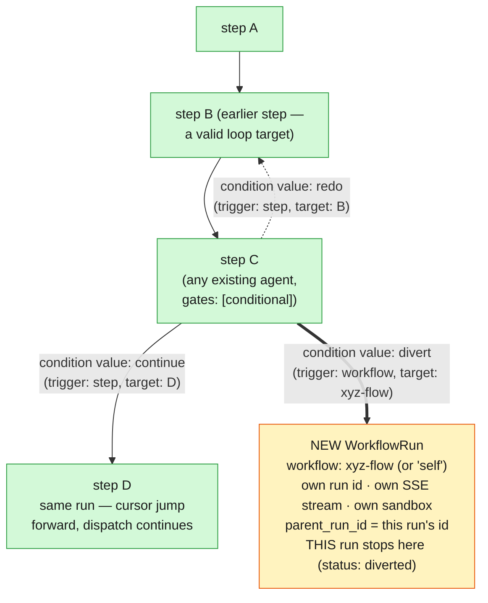

**On the canvas**, an existing agent node gains a route-target editor when its `conditional`
gate is enabled: each declared outcome is either an edge to an existing node on this canvas (the
`trigger: step` case — including a curved loop-back edge to an earlier node) or a link to an
external-pipeline reference card representing a different saved workflow (the `trigger: workflow`
case), picked from the existing "My Workflows" list. No new node kind for in-workflow routing;
one new node kind for the external-pipeline reference.

## 3. Verified mechanics — what is already true

Read from the repository on `feat/conditional-gates`, re-verified 2026-08-20 (see
`reports/conditional-gates.md` v3 for the full file/line audit). Facts, not preferences.

- `Step.gates: list[str]` (`plan.py:359`) and its compiler parsing (`compiler.py:747-750`) are a
  **flat list of bare capability names**, resolved against `capabilities/registry.py`'s `_KNOWN`
  set. This loop is unmodified by this feature — `"conditional"` is simply a new registered name
  in it, exactly like `"human"`.
- `fanout:` (`compiler.py:999-1030`, `plan.py:196` `FanoutSpec`) is the existing, working
  precedent for "a capability needs structured config beyond a bare name": it is a **sibling
  step key**, strict-key-validated, mapped to its own dataclass, with its own `_compile_fanout()`
  function — never nested inside the `gates:` list itself. This feature's `route:` key follows
  the identical pattern.
- `_validate_dag` (`compiler.py:1299`) builds its Kahn-algorithm cycle check exclusively from
  `step.depends_on`. `fanout` and `task_source.source_step` already carry step-to-step
  relationships that are deliberately invisible to this check. `route.outcomes` values will
  follow the same carve-out — never folded into `depends_on`.
- `WorkflowRun.parent_run_id` (`app/models/workflow.py:50`, FK + index) already exists and
  already links a child run to a parent for exactly one case today — `prototype_revision`,
  gated by `ectx.is_revision_workflow`. The column itself is general-purpose; only its current
  *gating condition* is narrow. This feature reuses the column unmodified.
- `run_fanout` (`kernel_services.py:1025`) spawns **worker agents within the same run**,
  recorded as `SubagentRun` rows — a structurally different mechanism from what `trigger:
  workflow` needs (a full second `WorkflowRun` with its own lifecycle). Confirmed the wrong
  primitive to extend for cross-workflow triggering.
- `launch_run` (`app/api/run_commands.py:2213`) is an HTTP-only handler (`Depends
  (get_current_user)`). Nothing in the codebase today calls its mint-and-spawn logic from
  anywhere other than an HTTP request.
- `state_machine.py`'s `TERMINAL_STATES` (`:45`) is currently `{"completed", "failed",
  "cancelled"}` — no terminal state exists yet for "this run intentionally handed off to
  another run."
- `previous_run.py` (context provider) is the existing, working pattern for one run reading
  another's artifacts, gated by `ScopedStore.assert_owns(parent_run_id)` (`authz.py:1486`) —
  the correct precedent to point to for any future context-seeding into a triggered run, though
  v1 does not use it (v1 triggered runs start fresh — see §4.3).

### The gaps, precisely

- No `route`/`RouteSpec`/`RouteOutcome` concept exists anywhere in `plan.py` or `compiler.py`.
- No `GATE_ROUTE` outcome exists in `gates/base.py` (today: `GATE_PASS`, `GATE_BLOCK`,
  `GATE_WAIT_HUMAN` only).
- No non-HTTP entry point into `launch_run`'s mint-and-spawn logic exists.
- No visit-count or trigger-depth bookkeeping exists on `ExecutionContext` — nothing today
  bounds re-entry into an already-visited step, and nothing bounds a chain of triggered runs.
- The engine's dispatch loop (`engine.py:2586`) is a `for`-loop over a fixed `enumerate()` —
  structurally unable to jump its cursor anywhere but forward by exactly one.
- Zero occurrences of `RouteSpec`, `GATE_ROUTE`, `ConditionalGate`, `loop_back_to`, or any
  trigger-workflow primitive in `backend/` or `frontend/src/` — implementation has not started.

## 4. Requirements

### 4.1 Data model — `RouteSpec` (in-workflow + cross-workflow, unified)

```python
# agents/workflows/plan.py

@dataclass
class RouteOutcome:
    trigger: str    # "step" | "workflow"
    target: str     # step_id (trigger="step") or workflow_id / "self" (trigger="workflow")

@dataclass
class RouteSpec:
    condition_agent: str | None = None   # None = this step's own artifact
    outcomes: dict[str, RouteOutcome] = field(default_factory=dict)
    default_next: str | None = None      # None = terminate here if no outcome matches
    loop_max_iterations: int = 5         # cap for any trigger="step" outcome pointing backward
    trigger_max_depth: int = 5           # cap for parent_run_id chain depth; FIXED at 5 in v1 (R-19)

# Step gains one field:
#   route: RouteSpec | None = None
```

Manifest authoring shape (matches the naming settled in the brainstorming conversation —
`outcomes` / `trigger` / `target`):

```yaml
- agent: custom-agent
  instance_id: branch
  produces: ["route_decision"]        # R-05b — required: the gate's decision source
  prompt: |
    Analyse the input. Output ONLY this JSON, nothing else:
    {"decision": "hotfix"}            # or "feature" / "revise" — matches route.outcomes below
  gates:
  - conditional
  route:
    outcomes:
      hotfix:  {trigger: workflow, target: hotfix_workflow}
      feature: {trigger: workflow, target: feature_workflow}
      revise:  {trigger: step,     target: validate}
```

**R-01**: `gates: [...]` stays exactly `list[str]`, unmodified. `"conditional"` is a new
registered `("gate", "conditional")` name, resolved identically to every other gate.

**R-02**: `route:` is a new sibling step key (alongside `fanout`, `validators`, `hooks`),
strict-key-validated against `_ALLOWED_ROUTE_KEYS`, mirroring `_compile_fanout`.

**R-03**: **The compiler REJECTS at compile time** a step that declares `route:` without
`"conditional"` present in that step's `gates:` list — dead config is a compile error, not
silently ignored. (Resolved via clarification — see decision log §8.)

**R-04**: A `RouteOutcome` is a single target in v1 (`target: str`, not `target: list[str]`).
Multi-target fan-out from one outcome is explicitly out of scope (§5) — the schema is shaped so
that widening `target` to a list later is additive, not a breaking migration.

**R-05**: `condition_agent` defaults to the step's own id when omitted. It MAY reference an
earlier step, including a step whose gate was `human` — the conditional gate reads that human
gate's captured response through the identical `_latest_typed_content` read path used for any
other upstream artifact. No new pause/HITL mechanism is introduced by this feature.

**R-05b (decision format)**: An agent that supplies a routing decision declares
`produces: ["route_decision"]` — a NEW, dedicated typed artifact kind (distinct from that
agent's normal deliverable output, if any). Its content is a small JSON object with a single
fixed key: `{"decision": "<value>"}`. The gate `json.loads`s the content and matches
`parsed["decision"]` against `route.outcomes`' keys — never free text, never a bare word, and
never the agent's whole raw output (which may still contain prose/reasoning as a SEPARATE
artifact if the agent also produces one). The `<value>` itself is workflow-author-defined and
open-ended — `"pass"`/`"fail"`, `"hotfix"`/`"feature"`/`"bug"`/`"restart"`, or any other set of
outcome keys the `route.outcomes` map declares; the gate has no built-in notion of boolean vs.
multi-value, it is always "one string, matched against a dict."

```mermaid
flowchart LR
    S["step X<br/>gates: [conditional]<br/>route.condition_agent: (unset)"] -.->|"R-01/R-02: gates: list\nunmodified; route: is a NEW\nsibling key, same shape as fanout:"| S
    S -->|"R-05: defaults to reading\nTHIS step's own artifact"| SELF["X's produces: [route_decision]\nartifact"]
    S -.->|"R-05: OR explicitly names\nan earlier step (agent OR\nhuman-gate response)"| OTHER["some earlier step Y's\nroute_decision (or captured\nhuman-gate) content"]
    SELF & OTHER --> PARSE["R-05b: content = {\"decision\": \"hotfix\"}\njson.loads -> parsed[\"decision\"]"]
    PARSE --> MATCH["R-04: match decision value against\nroute.outcomes — exactly ONE\ntarget per outcome in v1"]

    classDef samerun fill:#d3f9d8,stroke:#2f9e44,color:#1b1b1b;
    class S,SELF,OTHER,PARSE,MATCH samerun;
```
*(R-01 through R-05 — the data model and decision-source rules.)*

### 4.2 In-workflow routing (branch + loop) — same `WorkflowRun`

**R-06**: The engine's main dispatch loop (`engine.py:2586`) becomes an index-based `while` loop
with a mutable cursor, replacing the current `for i, spec in enumerate(ordered_agents):`. A
`trigger: step` outcome sets the cursor to the target step's index — forward (branch) or `<=`
current index (loop) are handled identically; there is no separate loop-back code path.

**R-07**: `ExecutionContext` gains `step_visit_counts: dict[str, int]`. Before a step is
re-dispatched (any visit beyond the first), the engine checks the count against
`route.loop_max_iterations` (default 5, UI-editable per gate per §4.5) and fails closed with the
existing `BudgetExceeded` pattern if exceeded.

**R-08**: Gate-firing keys and failure-tracking keys that are per-step today
(`gate_key = f"{run_id}:{agent_id}"` at `:6291`; `ectx.failed_invocations`) become
visit-count-aware (`f"{run_id}:{agent_id}:{visit_count}"`), so a revisited step's gate/failure
state cannot collide with or mask its own prior firing.

**R-09**: `route.outcomes` values are never folded into `step.depends_on` and never enter
`_validate_dag`'s Kahn-algorithm cycle check or `resolver.py::_detect_cycles` — identical
carve-out to `fanout`/`task_source.source_step` today. The DAG's genuine data-dependency cycle
rejection is untouched.

**R-10 (compile-time validation)**: Every `route.outcomes[...].target` with `trigger: "step"`
MUST resolve to a real step id in the same compiled workflow, and every `default_next` MUST
resolve to a real step id — checked once, after all steps compile (mirrors
`_validate_fanout_source_upstream`). An unresolvable reference is a compile error, not a
runtime failure.

**R-11 (v1 scope cut)**: Loops/branches are non-resumable across a process restart. Existing
resume machinery (`_first_incomplete_step` and companions) assumes each step id appears at most
once per run; reworking crash-resume for repeated step ids is out of scope for this spec.

**R-26 (leaf-step deliverable resolution — closes GAP-01)**: The compiler computes, for every
step, whether it is a **leaf** — a step with no `route` outcome or `depends_on` edge from any
OTHER step routing to something after it on every path it could be reached from; concretely,
a step with nothing compiled to run after it on ANY branch that could reach it. This is a
graph-shape property, computable once at compile time in the same pass as R-10's target
validation — it does not depend on which branch a given run actually takes. `Step` gains an
`is_leaf: bool` field. The engine's single_file deliverable readback
(`_deliverable_filename_override`) is changed from `index == len(ordered_agents) - 1` (array
position) to `step.is_leaf` (graph property) — every leaf step is told to write the declared
deliverable name, not only whichever step happens to be array-last. This requires no authoring
constraint (branches do not need to converge on one terminal step) and no sandbox change:
**the starter workflow's `RunSandbox` (keyed on `(user_id, run_id)`, per §3) is owned by the
RUN, not by any step or branch** — every step compiled for this run, on every declared path
(e.g. both `D,E` and `X,Y,Z` in an `ABC -> DE` / `ABC -> XYZ` workflow), already reads and
writes into that SAME one sandbox unconditionally. Only one branch's steps ever actually
execute per run (R-06's mutual exclusivity), so only one leaf ever actually writes the
deliverable on any given run — no collision, exactly as today, just computed correctly per
graph shape instead of by fixed array position.

**R-27 (compile-time `route_decision` check — closes GAP-03)**: `_validate_route_targets`
(R-10) is extended to also confirm that `route.condition_agent` (or the step itself, when
`condition_agent` is unset — R-05) declares `produces: ["route_decision"]` in the manifest.
Consistent with R-03's precedent (reject dead/misconfigured routing config at compile time
rather than let it surface as a confusing runtime failure): a `conditional` gate whose decision
source never declares the required typed artifact is a compile error.

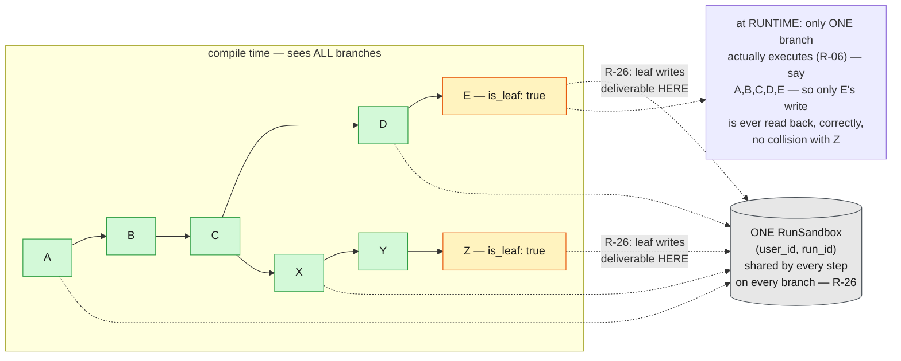
*(R-26/R-27 — leaf-step deliverable resolution and the compile-time `produces` check. Confirms
the fact settled in decision-log #14: the sandbox is owned by the RUN, not the branch.)*

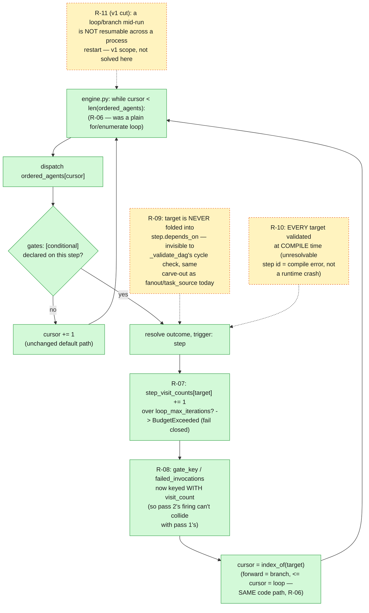
*(R-06 through R-11 — the engine's mutable-cursor dispatch mechanism, worked through concretely
in examples A1/A2/A4 above.)*

### 4.3 Cross-workflow triggering — new `WorkflowRun`

**R-12**: A `trigger: workflow` outcome mints a **new, independent `WorkflowRun`** — own id, own
SSE stream, own sandbox, own dispatch loop starting fresh at its own step 0. `target: "self"` is
valid and means "a fresh instance of this same workflow definition."

**R-13 (Option 2 — stop-and-hand-off, the only mode v1 supports)**: When a `trigger: workflow`
outcome fires, **the triggering run does not continue.** There is no `default_next` fallback
after a workflow-trigger outcome fires, and no synchronous wait on the new run's completion.
This is a deliberate v1 scope cut — see §5 for the deferred alternative (`wait: true`) and why.

**R-14**: The triggering run's `WorkflowRun.status` transitions to a new, distinct terminal
value — **`diverted`** (format: the run history / "my runs" UI reads it as "Diverted to
`{workflow_id}`") — not reused as `completed`. `state_machine.py`'s `TERMINAL_STATES` gains
`"diverted"` alongside `completed`/`failed`/`cancelled`. See R-28 for the LIVE (SSE/websocket)
event this transition emits, distinct from the persisted `status` column itself.

**R-28 (clarified 2026-08-20 — see Clarifications)**: The live run stream emits a new,
additive terminal event type, **`pipeline_diverted`**, alongside the existing
`pipeline_complete`/`pipeline_cancelled` vocabulary — not a repurposed `pipeline_complete`
with a status field. Payload: `{"pipeline_run_id": ..., "diverted_to_run_id": ...,
"diverted_to_workflow": ...}`. This lets the frontend distinguish a divert from a normal
completion at the event-TYPE level (existing `pipeline_complete` handlers that don't inspect a
status field are unaffected by construction, rather than silently mishandling a divert as a
normal completion).

**R-15**: The new run's `parent_run_id` is set to the triggering run's id (reusing the existing
column/index unmodified — no migration). Its `owner_id`/`workspace_id` unconditionally inherit
the triggering run's values — never independently specified, never left null. This is scoped to
user custom workflows and the framework's own built-in flows only; shared/team-owned workflow
triggering is explicitly out of scope (§5).

**R-15 clarified (2026-08-20 — see Clarifications)**: `workspace_id` inheritance means the
triggered run's spend counts against the SAME `BudgetManager.workspace_ceiling` aggregate
(OBS-01) as the triggering run and every other run in that workspace — not an independently
budgeted run. This requires no new mechanism: `reserve()`'s existing `workspace_spent +
requested > workspace_ceiling` check already reads spend by `workspace_id`, and R-15 already
mandates the triggered run's `ExecutionContext` carries the same `workspace_id`. Stated
explicitly here because it was previously an unstated consequence of R-15, not a decided fact.

**R-16**: `launch_run`'s mint-and-spawn logic (`app/api/run_commands.py:2213`) is extracted into
a plain async core callable both by the existing HTTP handler (thin wrapper, unchanged
behavior) and by a new kernel delegate. The exact extraction boundary is implementation-time
work — the report (`reports/conditional-gates.md` §"Open items") flags that `launch_run`'s full
body beyond `:2213-2260` was not read line-by-line during the impact analysis.

**R-17**: A new kernel delegate `run_trigger_workflow(step, ectx, *, workflow_ref)` on
`kernel_services.py`, parallel to `run_human_gate` and `run_fanout` — not folded into either.
Resolves `workflow_ref` (a saved `user_workflow_id`, or `"self"`), checks `trigger_max_depth`
(R-18), calls the R-16 core with `parent_run_id` set, and returns the new run's id.

**R-18**: `ExecutionContext` gains a trigger-depth check against `route.trigger_max_depth`
(default 5), evaluated by walking the `parent_run_id` chain at trigger time. Exceeding it fails
closed (same `BudgetExceeded`-style pattern as R-07's loop cap) — this bounds A-triggers-B-
triggers-A-triggers-B chains that R-07's per-run loop cap cannot see, since each hop is a fresh
`ExecutionContext` with its own budget.

**R-19 (clarified 2026-08-20 — see Clarifications)**: `trigger_max_depth` is **fixed at 5 in
v1** — the system ceiling equals the default, so it is not a tunable range. `RouteSpec` still
carries the field (so a future revision can raise the ceiling as a pure data/config change,
with no engine rework), but the compiler REJECTS any manifest-declared `trigger_max_depth`
value other than `5` in v1. This is a scope-down from the original framing ("author-configurable
per gate, UI-only knob") — raising the ceiling is explicitly deferred, not built here.

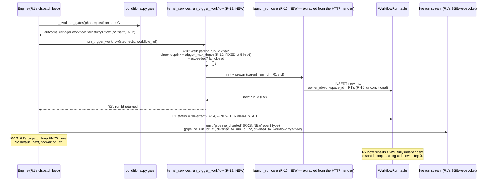
*(R-12 through R-19 — the cross-workflow trigger call chain, worked through concretely in
example A3 above.)*

### 4.4 Run-history UI for a diverted run

**R-20**: A diverted run's card in run history/"My Runs" shows a distinct terminal treatment
("Diverted to `{workflow_id}` →") linking to the triggered run's card. The triggered run's card
shows a reciprocal link ("← Continued from `{parent run}`, step `{step_id}`"). This is **two
linked run records**, not a single stitched timeline merging both runs' SSE streams into one
view — the stitched-timeline alternative was considered and explicitly deferred (§5).

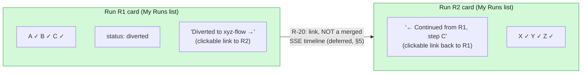
*(R-20 — two linked run-history cards, not a stitched timeline.)*

### 4.5 Canvas / composer

**R-21**: `frontend/src/types/index.ts` — `ManifestStep`/`AgentDef` gain a `route?: {
condition_agent?: string; outcomes: Record<string, {trigger: "step" | "workflow"; target:
string}>; default_next?: string; loop_max_iterations?: number; trigger_max_depth?: number }`
field, mirroring the backend `RouteSpec` shape exactly.

**R-22**: `CanvasNode.tsx` — the existing agent-card node gains a route-target editor,
surfaced when `"conditional"` is checked in that node's gates. **No new node kind is added for
in-workflow routing** — this is a correction from an earlier draft of the impact analysis, which
had proposed a separate diamond/decision node; the resolved design keeps the conditional gate on
the existing agent card, matching R-01/R-02's "gate type, not step kind" framing. One new node
kind IS added: an **external-pipeline reference card**, for `trigger: workflow` outcomes,
visually distinct from an agent card, showing the target workflow's name with a link/launch
affordance.

**R-23**: `CanvasView.tsx` gains a **connect-to-existing-node gesture** (distinct from the
current drag-reparent, which explicitly rejects a target that is an ancestor via
`isDescendant`) — a conditional-gate outcome edge MUST be able to target an ancestor (the loop
case) while a plain reparent still cannot. Loop-back edges render as curves around the row
rather than as a downward tree branch. This requires the current `chainEdges`/`treeEdges`
array-order layout to become a real layered/graph layout — the single largest frontend item in
this spec.

**R-24**: The external-pipeline picker (for selecting a `trigger: workflow` target) reuses the
existing "My Workflows" list component as its data source — no new filtered/purpose-built
picker.

**R-25**: `ComposerPage.tsx`'s `handleSave`/`handleRunOnce` and `buildWorkflowManifest` must
serialize the new `route` field per step; any node carrying a non-empty `route` forces the
full-manifest save/run path (`needsFullManifest`), the same trigger condition already used for
other non-flat-list step data.

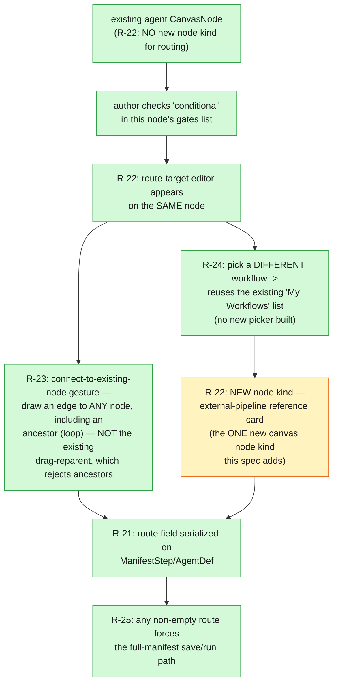
*(R-21 through R-25 — canvas/composer authoring surface. This is the piece the impact report
flags as the single largest frontend item, R-23 specifically.)*

### 4.6 Example workflows — in scope, traced during design

Every example below was walked through step-by-step in the design conversation and is fully
covered by the requirements above. Named `A1`–`A4` for stable future reference (e.g. "build
A2") — the letter/number is arbitrary, just a handle, not a priority order.

#### A1 — Loop back to an earlier step (illustrates R-06, R-07, R-08, R-09)

A gate on step 4 judges an upstream agent's result and, on a bad result, re-runs step 1 and
everything after it, within the SAME run.

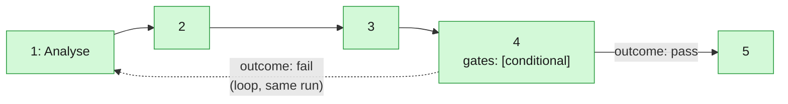

Mechanics: step 4 runs normally, `_evaluate_gates(phase=post)` reads its artifact, resolves
`outcome=fail`, engine cursor jumps to step 1's index (R-06). `step_visit_counts["step_1"]`
increments (R-07); the second pass's gate/failure keys carry the visit count so they cannot
collide with pass 1's (R-08). Step 4 itself does not re-run a second time inside the same
pass — only what the outcome names as its target and everything after it, in cursor order.

#### A2 — Mutually-exclusive forward branch, same workflow (illustrates R-06, R-09, R-10)

```
A -> B -> C -> D -> E
C -> X -> Y -> Z
```

C carries the conditional gate. Exactly ONE continuation runs per evaluation — never both, and
D/E never execute if X/Y/Z is chosen (or vice versa).

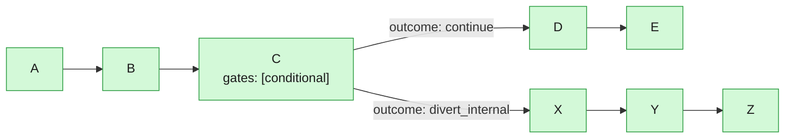

Answer settled in the design conversation: this is **neither** "ABCDE + CXYZ" (both) **nor**
"ABC + XYZ" (as if C had nothing else) — it is exactly one full run of A,B,C,D,E **or** exactly
one full run of A,B,C,X,Y,Z, decided once at C. D/E's `step_visit_counts` stay 0 if X,Y,Z is
taken, and vice versa (R-09/R-10 — both continuations must independently compile-validate as
real step ids, but only one is ever walked by the cursor at runtime).

#### A3 — Divert to a separate workflow, stop-and-hand-off (illustrates R-12, R-13, R-14, R-15, R-20)

Two separate workflow *definitions* — `ABCDE` (main) and `XYZ` (a different saved workflow).
C's gate diverts to XYZ; per the resolved Option 2, the main run does NOT continue to D, E.

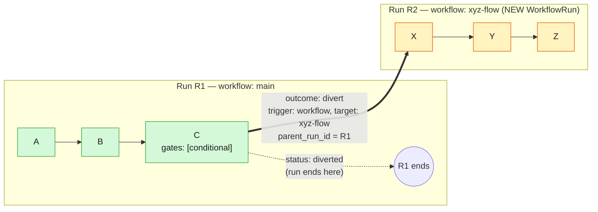

D and E (part of `main`'s own definition) never execute — not skipped-as-completed, genuinely
never dispatched. R1's `WorkflowRun.status` becomes `"diverted"` (R-14); R2 is a fully
independent run, `owner_id`/`workspace_id` inherited from R1 (R-15). Run history shows the two
as linked cards (R-20), not one merged timeline.

**`target: "self"` note**: R-12 allows `target` to be either a different saved workflow's id
(as drawn above, `xyz-flow`) or the literal string `"self"`, meaning "a fresh, independent run
of THIS SAME workflow definition." Mechanically this is identical to the diagram above — same
R-12/R-13/R-14/R-15 mechanics, same stop-and-hand-off, same new-`WorkflowRun`-with-`parent_run_id`
shape — just with the new run's workflow definition equal to the triggering run's own. No
separate diagram; A3 covers both values of `target`.

#### A4 — Loop back, judging a prior HUMAN gate's response, not the step's own output (illustrates R-05, R-06, R-07, R-08)

**A4 is A1's mechanism (an in-run loop), not A3's (a cross-workflow trigger) — corrected from an
earlier draft of this spec, which mis-scoped it as a `target: "self"` trigger.** The only thing
A4 adds beyond A1 is `condition_agent` pointing at an *earlier* step instead of defaulting to
itself — specifically, a step whose gate is `human`, not `conditional`.

Step B is an existing **human gate** — the run pauses, a user reviews output (e.g. a PPT draft)
and supplies free-text revision instructions. Step C is a conditional gate whose
`condition_agent` points at B. On `outcome: revise`, the run loops back to step 1 — the SAME run,
exactly like A1 — carrying whatever the workflow's steps naturally carry forward (there is no
new context-passing mechanism here; this is a plain cursor jump, same as A1).

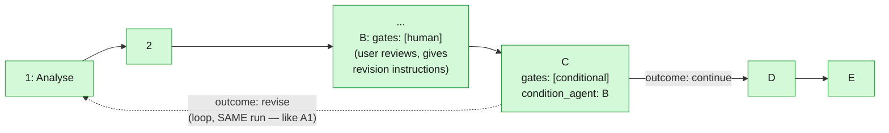

No new pause/HITL surface — C simply reads B's already-captured human response through the same
`condition_agent` mechanism any other upstream artifact is read through (R-05); the routing
itself is the identical cursor-jump-and-visit-count mechanism as A1 (R-06/R-07/R-08). There is
no B-catalog deferred continuation for A4 — unlike the earlier draft's assumption, nothing about
this example needs cross-workflow triggering or context-seeding into a new run at all.

## 5. Out of scope (this spec)

Explicitly deferred, with the reason each was deferred, so the next spec does not have to
re-derive the reasoning:

- **Multi-target fan-out from one outcome** (e.g. `trigger_workflows: [a, b, c]` all firing from
  one condition value) — R-04 shapes the schema so this is additive later, but v1 enforces
  exactly one target per outcome.
- **The Merge/Join Node** — a node that waits for multiple *triggered* workflow runs (not
  in-run `run_fanout` workers) to all reach a terminal state, then combines their outputs before
  continuing (the "ABC → triggers XYZ and KLM in parallel → P waits for both → combines → Q"
  case discussed and explicitly agreed to be documented-but-deferred). This requires the
  blocking-await machinery below, which does not exist and is not built by this spec.
- **`wait: true` / synchronous triggering** — the triggering run pausing until a triggered run
  reaches a terminal state before resuming. No precedent exists anywhere in the codebase for one
  run blocking on another's completion; this is the single largest piece of net-new plumbing
  that would be required, and neither the Merge Node nor a synchronous single-target wait is
  built here. R-13 codifies stop-and-hand-off (Option 2) as the only v1 mode.
- **Context-seeding a triggered run from its triggering run's artifacts.** v1 triggered runs
  start completely fresh (no `previous_run`-style seeding), even for `target: "self"`. The
  `previous_run.py` pattern is documented (§3) as the correct precedent to extend if/when
  seeding is added later.
- **Single stitched run-history timeline** merging a diverted run and its triggered run's SSE
  streams into one continuous view. R-20 ships the cheaper two-linked-cards version; the
  stitched version needs real new work to merge two independent event streams and was not
  chosen for v1.
- **Shared/team-owned workflow triggering.** R-15 restricts ownership inheritance to user
  custom workflows and the framework's own flows; a triggered run crossing ownership/workspace
  boundaries is not addressed.
- **Run-time (post-compile) editing of routing as a "lever"** via `selections.py`'s
  `_LEVER_KEYS`/`_synthesize_step` — this spec assumes routing is workflow-author-declared in
  `workflow.yaml` at design time, not an end-user-editable per-run override. Extending
  `selections.py` is out of scope unless a future need for run-time route editing arises.

### 5.1 Deferred example workflows — named for future reference

Every capability deferred above was discussed with a concrete example during design. Each is
named `B1`–`B4` here (continuing the `A#` scheme from §4.6 — `A#` = in scope now, `B#` =
discussed, diagrammed, and explicitly deferred) so a future request like "build B3" or "spec out
B1" has a stable, unambiguous handle instead of needing to be re-described from scratch. None of
these are built by this spec; nothing in §4's requirements implements them.

#### B1 — Parallel fan-out to multiple workflows from one outcome

The `trigger_workflows: [a, b, c]` shape the user originally proposed — one condition value
firing more than one workflow trigger at once. Deferred per the "Multi-target fan-out" bullet
above; blocked on `RouteOutcome.target` widening from `str` to `list[str]` (a schema change
this spec's R-04 deliberately makes non-breaking for later, but does not itself implement).

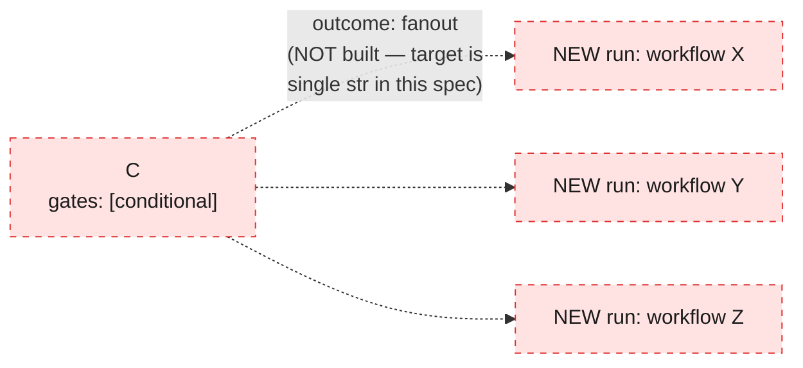

#### B2 — Merge/Join Node: parallel trigger, wait, combine (the P/Q example)

The concrete case that surfaced the need for synchronous waiting: user-stories output triggers
PPT and Prototype generation in parallel; a Merge Node (P) waits for BOTH triggered runs to
reach a terminal state, combines their outputs, then hands off to a final step (Q).

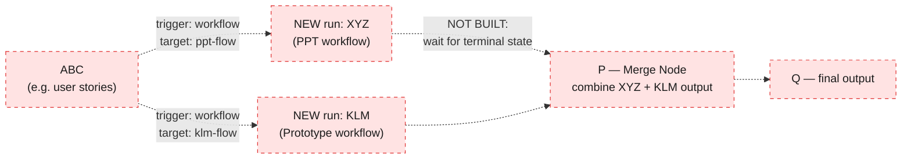

Explicitly agreed during design to be **documented, not implemented** — requires B3's
blocking-await machinery underneath it, which does not exist anywhere in the codebase today
(no precedent for one run blocking on another's completion).

#### B3 — Synchronous `wait: true` triggering (single target, no merge)

The simpler building block B2 depends on: a single `trigger: workflow` outcome that pauses the
triggering run until the triggered run reaches a terminal state, then resumes (as opposed to
R-13's stop-and-hand-off, which never resumes at all).

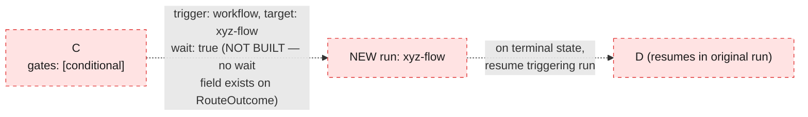

#### B4 — Context-seeded trigger (A3's deferred continuation)

A3 (§4.6) ends with the triggered run (whether a different workflow or `target: "self"`)
starting completely fresh — v1 seeds it with nothing from the triggering run. B4 is the deferred
alternative: the new run is seeded with the triggering run's artifacts (C's decision, and/or the
full prior run's state) via the same `previous_run.py` context-provider pattern already used for
`prototype_revision` — extended to a new case rather than reused as-is.

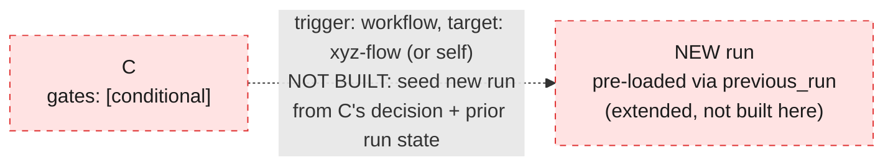

## 6. Acceptance criteria

- AC-01: A workflow author can declare `gates: [conditional]` + `route:` on any existing step
  and the workflow compiles, with `_validate_route_targets` rejecting any unresolvable
  `outcomes[...].target` or `default_next` at compile time.
- AC-01b: A step's `condition_agent` (or the step itself, if unset) declares
  `produces: ["route_decision"]` and writes `{"decision": "<value>"}`; the gate parses it via
  `json.loads` and matches `parsed["decision"]` against `route.outcomes` — free text or a bare
  word is never accepted as the decision source (R-05b).
- AC-02: A step whose `route:` block is present but whose `gates:` list omits `"conditional"`
  fails compilation with a clear error (R-03).
- AC-03: A run whose conditional gate resolves to a `trigger: step` outcome pointing at an
  earlier step re-executes that step and everything after it, within the SAME run id, up to
  `loop_max_iterations` times before failing closed.
- AC-04: A run whose conditional gate resolves to a `trigger: step` outcome pointing at a later
  step skips every step strictly between the gate and the target — those skipped steps never
  execute and their `step_visit_counts` remain 0.
- AC-05: A run whose conditional gate resolves to a `trigger: workflow` outcome ends with
  `status = "diverted"`, mints a new `WorkflowRun` with `parent_run_id` set to the triggering
  run and matching `owner_id`/`workspace_id`, and does not execute any further steps of its own.
- AC-06: A chain of `trigger: workflow` outcomes exceeding `trigger_max_depth` fails closed
  rather than recursing unboundedly.
- AC-07: The composer canvas can author all three outcome kinds (`trigger: step` forward,
  `trigger: step` backward/loop, `trigger: workflow`) using the existing agent node plus the one
  new external-pipeline reference node, and saving serializes them via the full-manifest path.
- AC-08: Run history shows a diverted run and its triggered run as two linked cards, each
  linking to the other.
- AC-09: A `single_file` workflow with a branch where different branches end at different steps
  (e.g. `ABC -> DE` vs. `ABC -> XYZ`, `E` and `Z` both terminal) correctly reads the deliverable
  from whichever leaf step actually ran on a given run — not only from whichever step happens
  to be array-last in the compiled step list (R-26).
- AC-10: A step declaring `gates: [conditional]` whose `route.condition_agent` (or the step
  itself) does not declare `produces: ["route_decision"]` fails compilation with a clear error
  (R-27).
- AC-11: When a `trigger: workflow` outcome fires, the triggering run's live SSE/websocket
  stream emits a `pipeline_diverted` event (not `pipeline_complete`) carrying the triggered
  run's id, before the stream closes (R-28).

## 6b. Reference fixtures

Five checked-in, hello-world-scale manifests, one per mechanism category — none executable
today (`user_launchable: false`; the compiler does not yet recognize `gates: [conditional]` or
the `route:` key), same convention as `sample_fanout`/`sample_subagents_parallel`. All use
`deliverable: serialized_sandbox` deliberately, to sidestep GAP-01 below rather than need a
workaround step in every fixture:

| File | Mechanism | Mirrors example |
|---|---|---|
| `backend/agents/workflows/ex_A1_loop/workflow.yaml` | Loop back to an earlier step, condition source = the gate's own step | A1 |
| `backend/agents/workflows/ex_A2_branch/workflow.yaml` | Mutually-exclusive forward branch to one of two new nodes | A2 |
| `backend/agents/workflows/ex_A3_divert/workflow.yaml` (+ its target, `ex_A3_target/workflow.yaml`) | Stop-and-hand-off to a different workflow | A3 |
| `backend/agents/workflows/ex_A4_human_gate/workflow.yaml` | Loop back, condition source = an earlier HUMAN gate's captured response | A4 |

## 6c. Open gaps — not yet resolved by any requirement above

Found while building the reference fixtures (§6b) — these are gaps in the SPEC, not risks in
an already-decided design. Each needs a decision before/during planning; none are blocking to
write the plan, but planning should not silently paper over them the way the fixtures above
sidestep GAP-01 by using `serialized_sandbox` instead of `single_file`.

All four gaps below were found while building the reference fixtures (§6b) and are now
**RESOLVED** — folded into R-26/R-27 and the decision log (§8, rows 14–16). Kept here as the
record of what was found and why, since the requirements alone don't explain the reasoning.

- **GAP-01 (single_file deliverable naming vs. routing) — RESOLVED, see R-26.** `engine.py`'s
  single_file deliverable readback (`_deliverable_filename_override`) only writes/expects the
  declared deliverable name from the LAST step in the COMPILED step order (`index ==
  len(ordered_agents) - 1`) — a check with zero knowledge of conditional routing. Once
  branching/looping exists, "the last step" is no longer a static, positional fact — different
  branches can end at different steps. Confirmed with the user this is compatible with how
  compilation already works: the compiler produces ALL steps on ALL declared paths (e.g. both
  `D,E` and `X,Y,Z` in an `ABC -> DE` / `ABC -> XYZ` workflow), sharing ONE sandbox for the
  whole run regardless of which branch a given run actually takes (`RunSandbox` is keyed on
  `(user_id, run_id)`, not per-step) — only ONE branch's steps ever execute per run (R-06), but
  the compiled graph and the sandbox both span every possible path. That is exactly the shape
  R-26's fix below relies on.
- **GAP-02 (`serialized_sandbox`/other deliverable strategies) — RESOLVED, verified NOT
  affected.** `serialize_sandbox_deliverable` reads the WHOLE sandbox, not one named step's
  output — it has no "last step" concept at all, so it is structurally immune to GAP-01's bug
  by design. No fix needed; recorded so this isn't re-investigated.

  ```mermaid
  flowchart LR
      SB[("RunSandbox — every file\nany step wrote")] -->|"single_file: reads ONE\nnamed file — needs R-26's\nleaf fix"| SF["deliverable = that file"]
      SB -->|"serialized_sandbox: reads\nEVERYTHING — no 'which\nstep' question exists"| SS["deliverable = whole sandbox,\nserialized"]
      classDef affected fill:#ffe3e3,stroke:#e03131,color:#1b1b1b;
      classDef safe fill:#d3f9d8,stroke:#2f9e44,color:#1b1b1b;
      class SF affected;
      class SS safe;
  ```
- **GAP-03 (compiler validation of `produces: ["route_decision"]`) — RESOLVED, see R-27.**
- **GAP-04 (loop cap interaction with token/wall-clock budget) — RESOLVED, verified NOT a
  gap.** `BudgetManager`'s `max_tokens` is check-at-boundary (not pre-reserved) and
  `wall_clock_seconds` is a plain per-run ceiling, so a `loop_max_iterations`-bounded re-run
  naturally spends more against the SAME existing budget with no code change required.

## 7. Risks

- **RISK-01 (compiler blast radius)**: R-02/R-03 add a cross-field validation
  (`route:` present ⇒ `"conditional"` in `gates:`) that no existing sibling key (`fanout`,
  `validators`) currently enforces against `gates:` — this is a new *kind* of compiler check,
  not just a new key. Worth confirming during planning that this doesn't need a more general
  "capability requires gate" mechanism rather than a one-off check.
- **RISK-02 (dispatch loop conversion)**: Converting `engine.py`'s 10,030-line-file main
  dispatch loop from `for`/`enumerate` to a mutable-cursor `while` loop is the single highest-risk
  code change in this spec — it is the busiest, most load-bearing loop in the engine, threading
  through resume offsets, sibling-group parallelism skips, and multiple gate-consumer arms
  (`reports/conditional-gates.md` R-06 through R-08 detail the specific call sites). Recommend
  this lands as its own isolated, heavily-tested plan phase before any routing logic is layered
  on top.
- **RISK-03 (new terminal state)**: R-14's new `"diverted"` status is a change to
  `state_machine.py`'s `TERMINAL_STATES`, a small set relied on elsewhere (any code doing
  `status in TERMINAL_STATES` or enumerating the three known values by name needs auditing
  during planning — not fully swept in this spec's grounding report).
- **RISK-04 (extraction boundary unconfirmed)**: R-16's `launch_run` core extraction has not
  been scoped line-by-line (see report's "Open items"). The actual boundary between
  "HTTP-specific" and "mint-and-spawn core" needs confirming during planning before estimating
  R-16/R-17's size.
- **RISK-05 (canvas layout rewrite)**: R-23 is explicitly the single largest frontend item —
  converting `CanvasView.tsx`'s array-order chain/tree layout to a real graph layout is not
  incremental; the report classifies it as "real new layout logic, not an extension."

## 8. Decision log

Every open item raised during the brainstorming conversation that produced this spec, and how
it was resolved, so nothing discussed is lost:

| # | Question | Resolution |
|---|---|---|
| 1 | Gate placement — before or after the agent it judges? | After — the agent runs, the gate is a `gates:[conditional]` entry on that same step (not a separate step), evaluated post-step. §2, R-05. |
| 2 | Diverted run status | New distinct `"diverted"` status, not reused `completed`. R-14. |
| 3 | Run-view UI for a divert | Two linked run cards, not a stitched timeline. R-20, deferred alternative in §5. |
| 4 | Self-trigger / pause-and-ask mechanism | No new pause mechanism — a conditional gate can read an earlier *human* gate's captured response as its `condition_agent` source. R-05. **Corrected mid-spec**: the PPT-revision example (A4) was initially mis-scoped as a `trigger: workflow, target: "self"` case; the user clarified it is actually a same-run LOOP (identical mechanism to A1), just with `condition_agent` pointing at an earlier human-gated step. A4 was rewritten accordingly (§4.6); A3 remains the sole worked example for `trigger: workflow`, and its note clarifies `target: "self"` is mechanically identical to targeting a different workflow. |
| 5 | Fan-out data-shape readiness | `RouteOutcome.target` kept single (`str`) in v1, shaped so a future widening to `list[str]` is additive. R-04. |
| 6 | Trigger-depth cap | Originally scoped as author-configurable with no ceiling; SUPERSEDED during `/speckit-clarify` — fixed at 5 in v1 (system ceiling = default), compiler rejects any other declared value. `RouteSpec` still carries the field for a future ceiling raise with no engine rework. R-18, R-19. |
| 7 | Trigger ownership | Always inherits the triggering run's owner/workspace, unconditionally; shared/team scope excluded. R-15, §5. |
| 8 | Workflow picker for the external-pipeline node | Reuses the existing "My Workflows" list, no new filtered picker. R-24. |
| 9 | Merge/Join Node (parallel trigger + combine) | Documented in §5 as explicitly deferred; requires the `wait: true` machinery this spec does not build. |
| 10 | `route:` present without `"conditional"` in `gates:` | Compiler rejects at compile time. R-03, AC-02. |
| 11 | Data-model shape — unified `RouteSpec`+`RouteOutcome` vs. separate `route`/`trigger` keys | Unified, matching the `outcomes`/`trigger`/`target` naming from the user's own manifest example, following the `fanout:`-as-sibling-key precedent rather than nesting structured config inside the flat `gates:` list. §4.1. |
| 12 | Decision-value format — how does an agent communicate its routing decision? | A NEW dedicated typed artifact kind, `produces: ["route_decision"]`, content = JSON `{"decision": "<value>"}` — not free text, not a bare word, not "whatever the agent last wrote." The `<value>` set (boolean-like `pass`/`fail` or multi-value `hotfix`/`feature`/`bug`/`restart`) is entirely workflow-author-defined; the gate has no built-in notion of the decision being boolean vs. multi-value. R-05b, AC-01b. |
| 13 | A1 vs A4 — are they the same example? | No — different `condition_agent` sources (A1: self; A4: an earlier human-gated step) exercising the SAME underlying loop mechanism (R-06/R-07/R-08). Both corrected/clarified together with #4 above. §4.6. |
| 14 | GAP-01 — single_file deliverable vs. routing: authoring constraint, deeper engine rework, or a third option? | Neither of the two originally scoped options — a THIRD option found during discussion: compute `is_leaf` per step at compile time (any step with nothing routed after it, on any path) and have every leaf write the deliverable, not just the array-last step. No authoring constraint needed, small contained engine change (one field, one check swapped). Confirmed during discussion: the compiler already compiles every step on every declared branch (not just the taken one), and the run's `RunSandbox` is owned by the RUN, not any branch — every branch already shares one sandbox unconditionally, which is exactly what makes leaf-write-collision impossible. R-26. |
| 15 | GAP-02 — does the same "last step" ambiguity affect `serialized_sandbox`? | No — verified `serialize_sandbox_deliverable` reads the whole sandbox, has no "last step" concept at all. Not affected, no fix needed. |
| 16 | GAP-03 — should `produces: ["route_decision"]` be compiler-validated? | Yes, reject at compile time — same precedent as R-03 (dead config = compile error, not silent runtime failure). R-27. |
| 17 | `trigger_max_depth` system ceiling (raised via `/speckit-clarify`) | Fixed at 5 in v1 — the ceiling equals the default, not a tunable range. Supersedes the earlier "author-configurable, UI-only knob" framing (decision-log #6, now marked superseded). R-19. |
| 18 | Live SSE/websocket event for a divert (raised via `/speckit-clarify`) | New additive terminal event type `pipeline_diverted`, not a repurposed `pipeline_complete`. R-28, AC-11. |
| 19 | Does a triggered run's spend count against the triggering run's workspace_ceiling? (raised via `/speckit-clarify`) | Yes — shared ceiling, no new mechanism; already implied by R-15's `workspace_id` inheritance + the existing `reserve()` check. Now stated explicitly as an R-15 addendum rather than left as an unstated consequence. |
