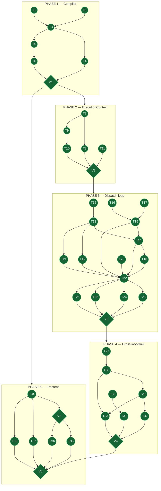
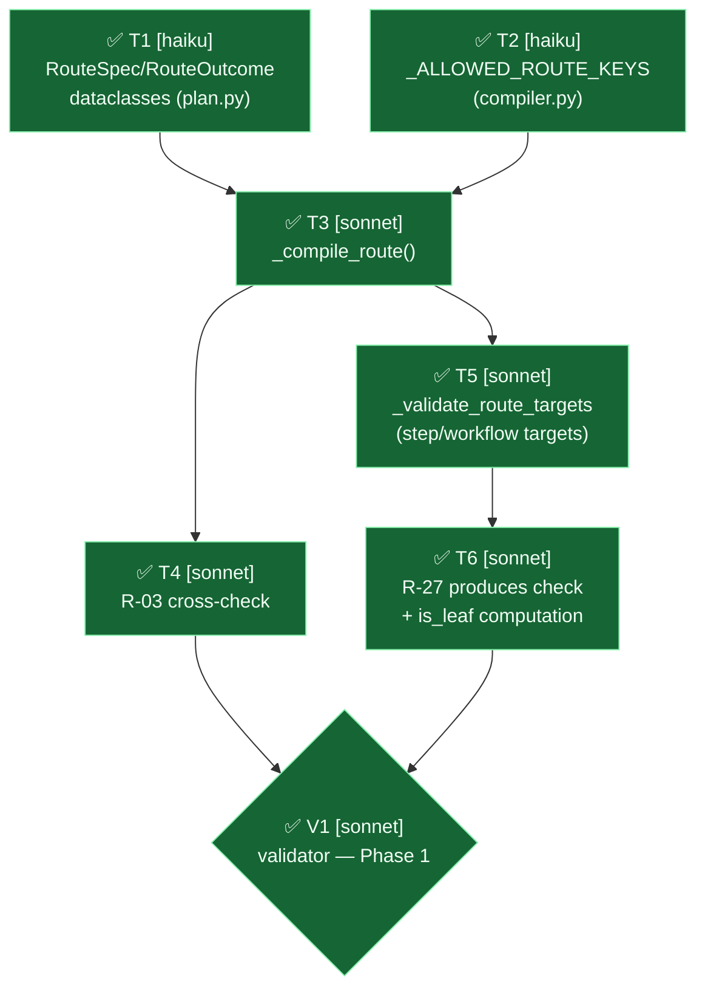
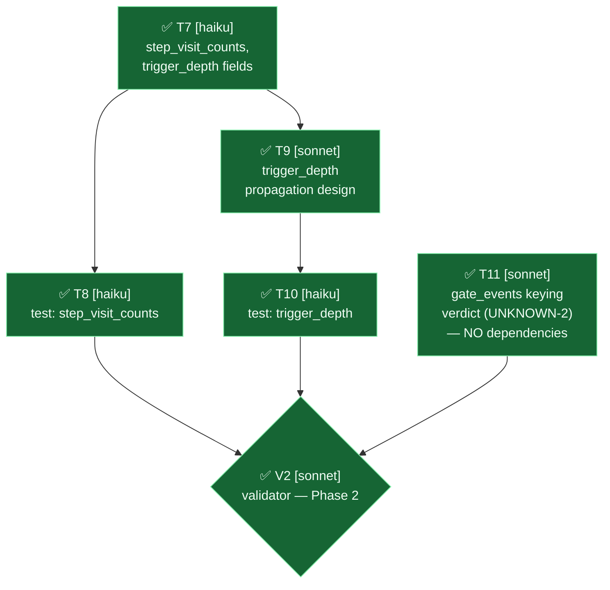
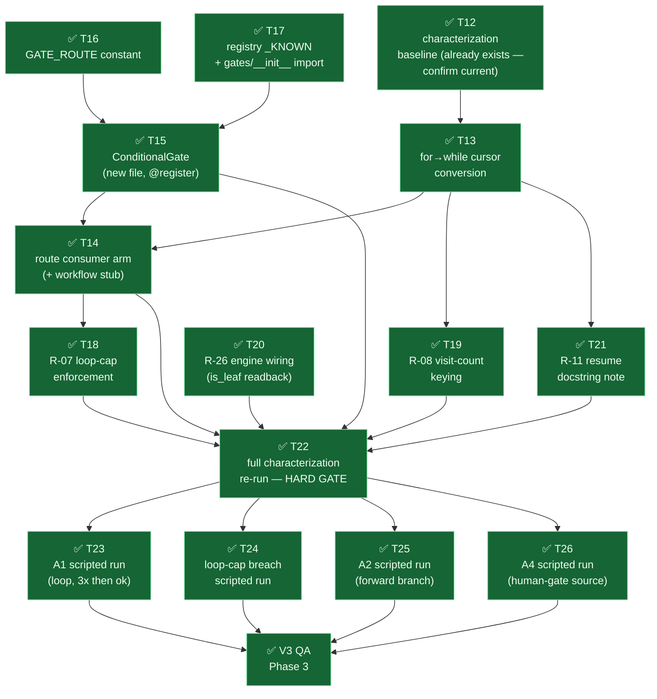
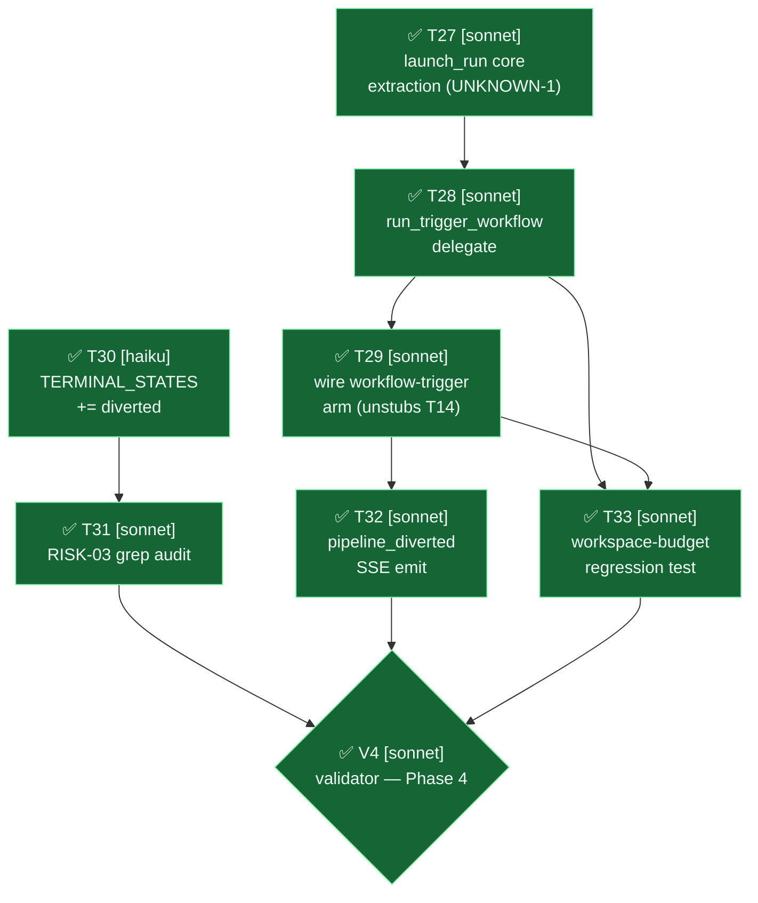
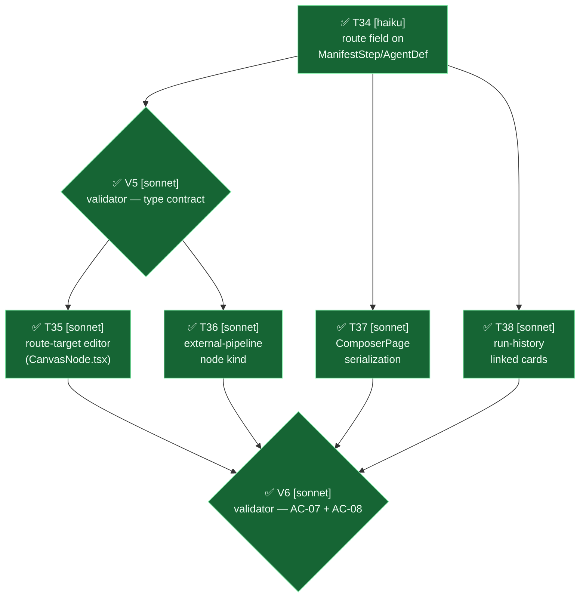
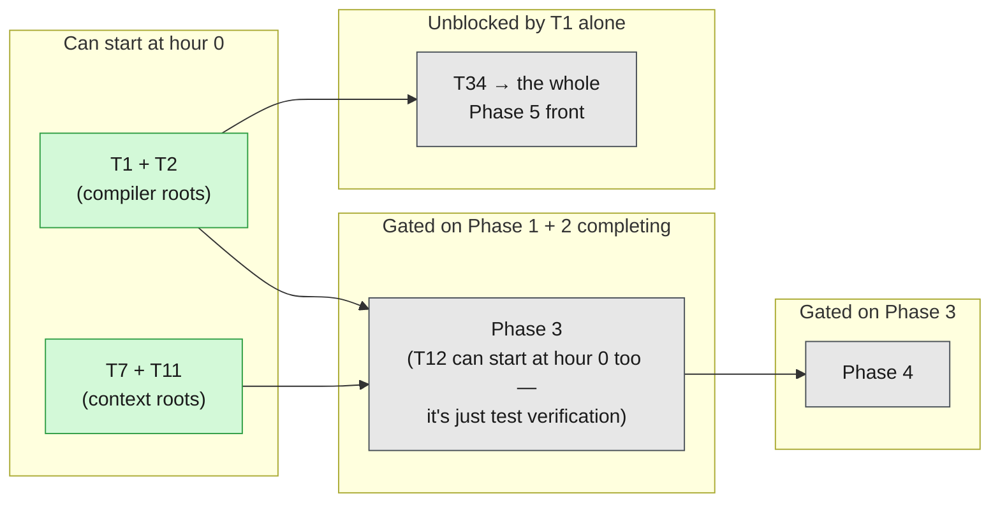

# Tasks: Conditional Gates — branching, looping, and cross-workflow triggering

**38 implementation tasks + 6 validators across 5 phases** · 44 done · 0 running · 0 pending.

Circle = task · hexagon = validator (`V1`–`V6`) or the one hard gate (`T22`, the
characterization re-run — nothing in Phase 3 proceeds past a red T22).

**Spec**: [`spec.md`](spec.md) · **Plan**: [`plan.md`](plan.md) · **Data model**: [`data-model.md`](data-model.md) · **Contracts**: [`contracts/`](contracts/) · **Quickstart**: [`quickstart.md`](quickstart.md)

Tasks are organized by plan.md's dependency-ordered phases (this spec has no P1/P2/P3 user
stories), per the project's own convention established in
`012-per-agent-skills-custom-agents/tasks.md`.

---

## How to execute these

Run all backend commands from `backend/` with the project venv/Python active per this repo's
`CLAUDE.md` testing section.

**Rules for every task**

1. Change only what the task names. Do not tidy adjacent code, comments, or imports you did
   not orphan.
2. If a verify command fails, stop and report — never silently work around a failing check.
3. Never edit the reference fixtures (`backend/agents/workflows/ex_A*/`) except
   where a task explicitly says to — they are checked-in contracts other tasks depend on.
4. If a task's anchor text/line number is not found verbatim (line drift is expected — this
   repo's other specs have seen it), search for the nearest equivalent by function/symbol name
   and report the actual location found, rather than guessing.
5. **Never run a state-changing git command** (`git stash`, `git checkout --`, `git reset`,
   `git clean`, `git restore`). Read-only git (`git diff`, `git status`, `git show`) is fine.
6. **Do not commit.** The user commits. Leave changes in the working tree.
7. **This file should stay current.** Mark a task `[x]` only once its own verify step passes.

**Delegation**: `[haiku]` = mechanical, fully specified, single file or a small closed set of
files · `[sonnet]` = multi-file, needs judgment calls, or touches the highest-risk surfaces
(`engine.py`'s dispatch loop, cross-file extraction boundaries) · every task also names the
**exact file(s)** it touches and the **exact plan.md section** it implements, so no task
requires re-reading the whole spec to start.

**Validators** (`V1`–`V6`): each guards a group of tasks. A validator re-reads its group's
acceptance criteria against what was actually built and returns **PASS** or **FAIL** with
specifics. On FAIL the named tasks are reopened (marked `⬜ pending` again) and redone — the
next phase does not start. A validator never fixes code itself; it only judges. Always
`[sonnet]` — judging requires reading intent, not just running a command.

---

## STATUS-SYNC — the orchestrator step, run after EVERY task

**This is not one of the 44 items. It is a standing step the orchestrator performs after every
single dispatch and every single resolution.** `[haiku]` — pure mechanical bookkeeping, no
judgment.

**Trigger it twice per task**: once when DISPATCHED (→ running), once when it RESOLVES (→ done
or error). Never batch it — a file that says "pending" while an agent is mid-flight actively
misleads every other agent reading it.

**Procedure** — four edits, all in this file:

1. **Top diagram** — move the id between the `class … task|running|done|error` lines at the
   bottom of the first mermaid block. That is the ONLY edit there: never change a node's shape
   (`((T5))` vs `{"V1"}`), never touch `classDef` lines, never re-route an edge.
2. **Top summary line** — update the `N done · N running · N pending` counts (they sum to 44).
3. **That task's per-phase diagram** — flip its node prefix (`⬜` → `🔄` → `✅`/`❌`) and update
   that phase's `**Status: N/M done.**` line.
4. **The task's checkbox** in the task list — `- [ ]` → `- [x]`, but ONLY on `done`. A running
   or errored task keeps `- [ ]`.

**Status meanings — do not improvise beyond these four:**

| Status | Node colour | When | Checkbox |
|---|---|---|---|
| pending | grey (`task`) | not started | `- [ ]` |
| running | blue (`running`) | dispatched, not yet resolved | `- [ ]` |
| done | green (`done`) | its verify step passed | `- [x]` |
| error | red (`error`) | verify failed, or the agent reported a blocker | `- [ ]` |

**An `error` item also gets a one-line note** under its task-list entry saying what failed — a
red node with no explanation is nearly as bad as a stale one. Leave it red until genuinely
fixed; never flip it back to pending to "retry cleanly."

**Never mark done because code was written.** Done means the verify step ran and passed. A task
with no verify step of its own is proven by its phase validator — the task can go green, but
the validator is what proves the phase.

---

## Dependency graphs — phase by phase, with LIVE STATUS

**These graphs must stay current.** When a task is dispatched, flip its node prefix to 🔄 and
update that phase's "Status as of" line. When it completes (its own verify step passes), flip
to ✅. If a verify step fails and isn't immediately fixed, flip to ❌ and say why in a note — do
not leave a failed task looking like ⬜ pending. A stale graph is worse than no graph.

Node prefix legend: `⬜` pending · `🔄` in progress · `✅` done · `❌` failed · `👤` user-owned
(none in this task list — every task here is agent-executable).

Drawn **one diagram per phase, in phase order** (not one combined graph) so each phase's own
internal parallelism reads on its own. Edges within a phase are REAL task-to-task dependencies
(derived from which file/symbol each task reads or writes), not just "comes after in the list."
Cross-phase dependencies (a later phase needing a specific field/shape from an earlier one, not
the whole earlier phase finished) are called out in prose under each diagram, since a
dotted-edge-to-another-diagram can't be drawn inside a single flowchart.

**Overall status as of 2026-08-20 — 0 done · 0 running · 0 failed · 44 pending. Nothing started
yet.**

### Phase 1 — Compiler (T1–V1)

**Status: 7/7 done.** Longest path = 5 tasks (T1/T2 → T3 → T5 → T6 → V1).

**Parallel waves** (each wave's tasks run concurrently; the next wave starts when the previous
finishes):

| Wave | Tasks | Why they can run together |
|---|---|---|
| 1 | **T1 ‖ T2** | Different files entirely (`plan.py` vs `compiler.py`) — zero overlap. |
| 2 | T3 | Both wave-1 tasks feed it; nothing else is unblocked yet. |
| 3 | **T4 ‖ T5** | Both depend only on T3, not on each other. T4 is a check inside `_compile_step`; T5 is a new post-compile pass. Different functions — same file, so use merge discipline or run sequentially if that matters more than wall-clock. |
| 4 | T6 | Extends T5's function (hard dependency); T4 can already be done. |
| 5 | V1 (QA) | Needs both branch tips (T4 and T6). |

**Max concurrency: 2.** Two agents saturate this phase — the T4‖T5 branch after T3 is
the second parallel opening (previously under-listed as only T1‖T2).

---

### Phase 2 — ExecutionContext (T7–V2)

**Status: 6/6 done.** Longest path = 4 tasks (T7 → T9 → T10 → V2). Does NOT depend on
Phase 1 to start — T7 is a pure dataclass-field add to a different file.

**Parallel waves**:

| Wave | Tasks | Why they can run together |
|---|---|---|
| 1 | **T7 ‖ T11** | T11 depends on NOTHING — a pure read-and-report task against `kernel_services.py`. It can literally start before Phase 1 does. |
| 2 | **T8 ‖ T9** | Both depend only on T7, not on each other. Different files (test vs. source comment). |
| 3 | T10 | Depends on T9's propagation design being settled. |
| 4 | V2 (QA) | Needs T8, T10, T11 all done. |

**Max concurrency: 2.** **T11 is the single most schedulable task in the whole plan** — it has
zero dependencies and its verdict is an input to Phase 3's T19. Start it on day one alongside
Phase 1's wave 1, don't wait for Phase 2.

---

### Phase 3 — Dispatch loop conversion (T12–V3, ALL sonnet, isolated per RISK-02)

**Status: 16/16 done.** Longest path = 7 tasks (T12 → T13 → T14 → T18 → T22 → T23 → V3).
**Correction from an earlier draft of this file**: this phase is NOT "almost a straight chain."
Re-deriving from actual file/symbol dependencies shows **four independent roots** and a
four-wide verification fan-out. The RISK-02 caution is about the *care* each task needs (all
`[sonnet]`, characterization-gated), not about serializing everything.

**Parallel waves**:

| Wave | Tasks | Why they can run together |
|---|---|---|
| 1 | **T12 ‖ T16 ‖ T17 ‖ T20** | Four genuinely independent roots. T12 = test files; T16 = `gates/base.py`; T17 = `registry.py` + `gates/__init__.py`; **T20 = `_deliverable_filename_override`, a different method from the dispatch loop entirely** — it never touches T13's code and only needs Phase 1's T6. |
| 2 | **T13 ‖ T15** | T13 needs T12's safety net; T15 needs T16+T17 (constant + registration). Different files (`engine.py` vs. new `conditional.py`). |
| 3 | **T14 ‖ T19 ‖ T21** | All three need only T13 (T14 also needs T15). Same file (`engine.py`) but different regions — sequence them if merge conflicts cost more than wall-clock. |
| 4 | T18 | Needs T14's arm to exist before it can add the cap check to it. |
| 5 | T22 (HARD GATE) | Needs every code change above. Nothing proceeds past a red T22. |
| 6 | **T23 ‖ T24 ‖ T25 ‖ T26** | Four independent verification runs, each driving a different fixture. Zero shared state. |
| 7 | V3 (QA) | Needs all four verification runs. |

**Max concurrency: 4** (waves 1 and 6). This phase has the *highest* parallelism of any phase,
not the lowest — the earlier "strict chain" claim in this file was wrong.

**Cross-phase inputs** (arrows pointing in from earlier diagrams): T15 ← Phase 1 T1
(`RouteSpec` shape). T18, T19 ← Phase 2 T7 (`step_visit_counts`). T19 ← Phase 2 T11
(the `record_gate_event` verdict). T20 ← Phase 1 T6 (`is_leaf` computed).

---

### Phase 4 — Cross-workflow triggering (T27–V4)

**Status: 8/8 done.** Touches a disjoint file set from Phase 3 (`run_commands.py`,
`kernel_services.py`, `state_machine.py`) but cannot start wiring T29 until Phase 3's T14
stub exists.

**Parallel waves**:

| Wave | Tasks | Why they can run together |
|---|---|---|
| 1 | **T27 ‖ T30** | Disjoint files — `run_commands.py` vs. `state_machine.py`. T30 is a one-line frozenset add with no dependency on the extraction work. |
| 2 | **T28 ‖ T31** | T28 needs T27's core; T31 needs T30's new state to audit against. Different files, fully independent of each other. |
| 3 | T29 | Needs T28's delegate to call, and unwires Phase 3's T14 stub. |
| 4 | **T32 ‖ T33** | Both need T29. T32 = SSE emit in `engine.py`; T33 = a budget regression test. Different files. |
| 5 | V4 (QA) | Needs T31, T32, T33. |

**Max concurrency: 2.**

**Cross-phase inputs**: T28 ← Phase 2 T9 (`trigger_depth` propagation). T29 ← Phase 3 T14
(the stubbed `"workflow"` arm to unwire).

---

### Phase 5 — Frontend (T34–V6; `CanvasView.tsx` layout DEFERRED, not in any graph)

**Status: 7/7 done.** Longest path = 4 tasks (T34 → V5 → T35/T36 → V6). Can start once
Phase 1's T1 data shape is locked — does NOT need Phases 2–4's backend runtime work finished,
only the `RouteSpec` field names.

**Parallel waves**:

| Wave | Tasks | Why they can run together |
|---|---|---|
| 1 | T34 | The type shape everything else here reads. Needs only Phase 1's T1. |
| 2 | **V5 ‖ T37 ‖ T38** | All three need only T34. V5 = typecheck/contract QA; T37 = `ComposerPage.tsx`; T38 = the run-history component. Three different files. |
| 3 | **T35 ‖ T36** | Both need V5's contract confirmed. Both touch `CanvasNode.tsx` — genuinely different concerns (route-editor panel vs. a new node kind), so parallel is possible with merge discipline; serialize if that costs less than the conflict risk. |
| 4 | V6 (QA) | Needs the full authoring surface (T35–T37) plus run-history (T38) to verify AC-07/AC-08 end-to-end. |

**Max concurrency: 3** (wave 2).

**Cross-phase inputs**: T34 ← Phase 1 T1 (`RouteSpec` field names). T38 ← Phase 4 T32
(`pipeline_diverted` payload) **for its live-case path only** — T38's historical-case path
(reconstructing from persisted `status`/`parent_run_id`) can be built and tested before T32
exists, per contracts/sse-pipeline-diverted.md's "must be reconstructable from persisted state
alone" requirement.

## Phase 1 — Data model & compiler (plan.md §4)

No engine.py changes in this phase. Depends on nothing (can start immediately).

- [x] T1 [haiku] Add `RouteOutcome` and `RouteSpec` dataclasses to `backend/agents/workflows/plan.py`, matching data-model.md's field tables exactly (`RouteOutcome{trigger: str, target: str}`; `RouteSpec{condition_agent: str | None = None, outcomes: dict[str, RouteOutcome] = field(default_factory=dict), default_next: str | None = None, loop_max_iterations: int = 5, trigger_max_depth: int = 5}`). Add `Step.route: RouteSpec | None = None` and `Step.is_leaf: bool = False` to the existing `Step` dataclass in the same file. Mirror the exact style of the neighboring `FanoutSpec` dataclass (docstring format, field comments). Do not touch any other dataclass in this file.

- [x] T2 [haiku] In `backend/agents/workflows/compiler.py`, add `"route"` to the `_ALLOWED_STEP_KEYS` frozenset, and add two new frozensets near it: `_ALLOWED_ROUTE_KEYS = frozenset({"condition_agent", "outcomes", "default_next", "loop_max_iterations", "trigger_max_depth"})` and `_ALLOWED_OUTCOME_KEYS = frozenset({"trigger", "target"})`. Match the existing `_ALLOWED_FANOUT_KEYS` definition's style exactly (comment block above it explaining what it gates).

- [x] T3 [sonnet] In `backend/agents/workflows/compiler.py`, add a `_compile_route(raw_route: object, where: str) -> "RouteSpec | None"` static method, mirroring `_compile_fanout()` line-for-line in structure: `None` input → `None` output; non-dict input → `CompilerError`; strict-key reject via `_ALLOWED_ROUTE_KEYS`; for each `outcomes` entry, strict-key reject via `_ALLOWED_OUTCOME_KEYS`, validate `trigger` is exactly `"step"` or `"workflow"` (else `CompilerError`), validate `target` is a non-empty string (else `CompilerError`), and build a `RouteOutcome`. Return a populated `RouteSpec`. Wire the call site into `_compile_step` so a step's `route:` key is compiled the same way `fanout:` already is. Use `contracts/manifest-route-schema.md` as the exact behavioral spec — every "compile-time guarantee" listed there must hold after this task.

- [x] T4 [sonnet] In `backend/agents/workflows/compiler.py`, add the R-03 cross-field check inside `_compile_step` (after `_compile_route` runs and after `gates` is parsed): if `"conditional"` is in the step's `gates` list but the compiled `route` is `None` or has empty `outcomes`, raise `CompilerError` naming the step and explaining `route:` is required when `gates: [conditional]` is declared. If `route` is non-`None`/non-empty but `"conditional"` is NOT in `gates`, raise `CompilerError` the other direction, naming the step and explaining `gates: [conditional]` is required when `route:` is declared. Write this as a small standalone check (a few lines), not a new generalized "capability requires gate" mechanism (per plan.md's explicit scope-discipline note in Phase 1 task 2).

- [x] T5 [sonnet] In `backend/agents/workflows/compiler.py`, extend `_validate_route_targets()` (new function, mirrors `_validate_fanout_source_upstream` in structure — runs once after all steps compile): for every step's `route.outcomes[...]` with `trigger == "step"`, confirm `target` is a real step id in this workflow's compiled step set, else `CompilerError` naming the step, the outcome's condition-value key, and the unresolved target. For `trigger == "workflow"`, confirm `target == "self"` OR resolves against a real saved workflow id — first read `agents/registry.py` and `app/api/user_workflows.py` to find the existing helper used to validate a `user_workflow_id` reference elsewhere in this codebase (report which one you used and why), and reuse it rather than inventing a new lookup. Also validate `route.default_next` the same way as a `trigger: "step"` target. Wire this function to run once, after the full step list compiles, at the same point `_validate_dag` already runs.

- [x] T6 [sonnet] In `backend/agents/workflows/compiler.py`, extend the SAME `_validate_route_targets()` pass from T5 with the R-27 check: for every step whose `route` has non-empty `outcomes`, confirm `route.condition_agent` (or the step itself, when `condition_agent` is `None`) declares `produces: ["route_decision"]` in the manifest — else `CompilerError` naming the step and its resolved decision-source step. Then, as the LAST step of this same task, compute `is_leaf` for every compiled step (R-26): a step is a leaf iff no `route` outcome (from ANY step in the workflow) and no default linear-next relationship names it as a non-terminal continuation — i.e., nothing is compiled to run after it on any reachable path. Set `Step.is_leaf` accordingly for every step. Add a regression assertion (inline comment + a one-line check, not a full test) confirming `_validate_dag`'s Kahn-algorithm graph is built ONLY from `step.depends_on` and never reads `route.outcomes` — R-09 must hold with zero changes to `_validate_dag` itself.

- [x] V1 [sonnet] **Validator — Phase 1 compiler.** **Guards**: T1, T2, T3, T4, T5, T6.
  **On FAIL**: name the failing criterion, reopen the offending task(s), stop — Phase 3 does not start.
  **PASS requires all of**: Using the five fixtures at `backend/agents/workflows/ex_A*/workflow.yaml`, run the exact commands in `quickstart.md`'s "After Phase 1 (compiler)" section (the compile-and-print-leaves script, and the R-03 negative-rejection script). Report each fixture's compile result and leaf set against what plan.md's Phase 1 Accept criteria and spec.md's AC-01, AC-02, AC-09 (compile-time half), AC-10 require — specifically confirm: (a) all five fixtures compile with zero `CompilerError`; (b) `ex_A2_branch` reports exactly two leaves (`say_hello`, `say_hola`); (c) `ex_A3_target` reports exactly one leaf (`welcome`); (d) the negative check (stripping `conditional` from `check`'s gates while `route:` stays) raises `CompilerError`; (e) a fixture with `produces: ["route_decision"]` removed from a `condition_agent` step also raises `CompilerError` (write this negative test if quickstart.md doesn't already cover R-27 — it currently only covers R-03). Report PASS/FAIL per criterion (a)–(e), not just "script ran."

---

## Phase 2 — Per-run state (plan.md §5)

Depends on: Phase 1 (T1's `RouteSpec` must exist for type references, though this phase's
own dataclass fields don't strictly need it). Independently testable, no dispatch-loop
interaction yet.

- [x] T7 [haiku] In `backend/agents/execution_engine/context.py`, add two fields to the `ExecutionContext` dataclass: `step_visit_counts: dict[str, int] = field(default_factory=dict)` and `trigger_depth: int = 0`. Match the existing style/placement of other per-run mutable-state fields already on this dataclass (docstring comment above each new field explaining its purpose per data-model.md).

- [x] T8 [haiku] Write a unit test in `backend/tests/unit/test_execution_engine.py` (or a new `test_execution_context.py` if that's the established pattern for context-only tests — check the existing file list first and match it) confirming `step_visit_counts` starts empty and increments correctly across repeated dict-key mutation (e.g. `ectx.step_visit_counts["step_a"] = ectx.step_visit_counts.get("step_a", 0) + 1`, called 3 times, asserts the value is 3).

- [x] T9 [sonnet] Determine and document (as a code comment on the `trigger_depth` field from T7, plus a short note in this task's completion report) the exact mechanism by which `trigger_depth` gets propagated at run-mint time: `0` for a non-triggered run, `parent's trigger_depth + 1` for a triggered run. Since the minting call site doesn't exist until Phase 4 (`run_trigger_workflow`), this task's job is ONLY to confirm `ExecutionContext`'s constructor/factory can accept an initial `trigger_depth` value without breaking any existing caller (all existing callers should default to `0` — verify no existing `ExecutionContext(...)` call site needs updating).

- [x] T10 [haiku] Write a unit test confirming a mocked chain of 2-3 `ExecutionContext` constructions with explicit `trigger_depth` values propagates correctly (e.g. `ExecutionContext(trigger_depth=0)` → child `ExecutionContext(trigger_depth=1)` → grandchild `ExecutionContext(trigger_depth=2)`), asserting each level's value is exactly parent+1. This is a standalone dataclass-field test, not an end-to-end trigger test (that's Phase 4).

- [x] T11 [sonnet] Read `backend/agents/execution_engine/kernel_services.py:337-360` (`record_gate_event`) in full, per plan.md Phase 1 task 6 / UNKNOWN-2. Determine whether its `(step, gate, outcome)` keying can collide across loop passes the same way `gate_key`/`failed_invocations` could before the R-08 fix. Report your finding as a short written verdict (collides / does not collide, with the specific reasoning) — do NOT fix it in this task even if it does collide; the fix (if needed) belongs in Phase 3 task where `step_visit_counts` is wired into the dispatch loop, since it depends on that existing first. This task's sole output is the verdict, to unblock that later task's scoping.

- [x] V2 [sonnet] **Validator — Phase 2 per-run state.** **Guards**: T7, T8, T9, T10, T11.
  **On FAIL**: name the failing criterion, reopen the offending task(s), stop — Phase 3 does not start.
  **PASS requires all of**: Run `python3.11 -m pytest tests/unit/ -k "step_visit_counts or trigger_depth" -v` (per quickstart.md's "After Phase 2" section) and confirm all of T8's and T10's tests pass. Additionally confirm: `ExecutionContext`'s existing (pre-Phase-2) test suite still passes unmodified (no regression from adding the two new fields with safe defaults). Report T11's UNKNOWN-2 verdict alongside the test results, since it's a required input to Phase 3 planning even though it produced no code this phase.

---

## Phase 3 — Engine dispatch loop conversion (plan.md §6 — isolated per RISK-02)

**Highest-risk phase in this spec.** Depends on: Phase 1 (compiled `RouteSpec`/`is_leaf` must
exist) + Phase 2 (`step_visit_counts`/`trigger_depth` must exist). Every task in this phase is
`[sonnet]` — RISK-02 in plan.md explicitly calls this the single highest-risk code change, and
`engine.py` is described in this repo's own `CLAUDE.md` as the busiest, most load-bearing file
in the runtime. Do not delegate any task in this phase to Haiku regardless of how small an
individual task looks in isolation — the risk is in the FILE, not the diff size.

- [x] T12 [sonnet] BEFORE touching `engine.py`, establish the characterization safety net. **Verified during task authoring: these tests ALREADY EXIST** — `backend/tests/agents/test_characterization_{prototype,prototype_revision,ppt,app_builder}.py` plus a `backend/tests/agents/characterization/` fixture directory. So this task is **"confirm current and green,"** not "write from scratch": (a) run all four characterization suites and confirm they pass on the untouched tree — if any is already red BEFORE Phase 3 starts, stop and report, because a pre-existing failure destroys the byte-identity signal the whole phase depends on; (b) confirm their coverage actually includes the dispatch loop's behavior (read one suite to verify it asserts on deliverable + event sequence, not just "no exception"); (c) if a workflow family with meaningfully different dispatch behavior is NOT covered (e.g. one using `fanout`/`subagents`, since T13's loop conversion touches the sibling-group skip logic), add one covering suite before proceeding. Record the exact pass/fail baseline in your completion report — T22 compares against it.

- [x] T13 [sonnet] In `backend/agents/execution_engine/engine.py`, convert the main dispatch loop at (approximately) `:2586` — currently `for i, spec in enumerate(ordered_agents):` — to an index-based `while cursor < len(ordered_agents):` loop with a mutable `cursor` variable. Replace every `i`-based reference inside the loop body with `cursor` (search the full loop body carefully — line numbers have drifted before in this codebase's history, confirm the actual current line by searching for the `enumerate(ordered_agents)` string, not by trusting the plan.md line number literally). Do NOT add any routing logic yet — this task's ONLY job is the mechanical for-to-while conversion, behavior-preserving for every workflow that never declares `route:`. Run T12's characterization suite immediately after this change and confirm byte-identical output before proceeding to any other Phase 3 task.

- [x] T14 [sonnet] In `backend/agents/execution_engine/engine.py`, locate the existing gate-outcome consumer arms (search for `if _outcome == "cancel":` and `if _outcome in ("block", "wait_human"):` — confirm actual current line numbers, plan.md cites approximately `:2685`/`:2711`). Add a new `elif _outcome == "route":` arm reading `GateOutcome.detail` (the `{"trigger": ..., "target": ...}` dict set by the `ConditionalGate` from Phase 1... wait, `ConditionalGate` itself is a separate task below in this same phase — if T14 is executed before that task exists, stub the detail-reading logic against the KNOWN shape from data-model.md rather than blocking on task order). For `trigger == "step"`: resolve `target`'s index in `ordered_agents` and set `cursor = that index` instead of the default `cursor += 1` advance (T13's loop already supports this — forward and backward are the same code path). For `trigger == "workflow"`: for THIS task, stub the call (e.g. `raise NotImplementedError("Phase 4 wires this")` or a clearly marked TODO comment referencing Phase 4) — do not implement the actual cross-workflow spawn here, that is Phase 4's job.

- [x] T15 [sonnet] New file `backend/agents/capabilities/gates/conditional.py` — `ConditionalGate.evaluate(step, ctx) -> GateOutcome`, mirroring the plain-awaited pattern of the existing `validation.py:72`/`security.py:81` gates (NOT the stream+collector pattern `human`/`approval` gates use — confirm you're matching the right one by reading both patterns first). **The class MUST carry the `@register("gate", "conditional", user_allowed=True, description="…")` decorator**, matching `human.py:57-61`/`validation.py:47-51`'s form exactly. `user_allowed=True` is load-bearing, not boilerplate: `_TRUST` defaults to `False` for any unregistered flag, and `compiler.py::_check_trust` raises `CompilerError` for a non-user-allowed capability under an UNTRUSTED (user/db) manifest — so omitting it would let file-backed fixtures compile while silently breaking every composer-built workflow (exactly the case R-21–R-25's canvas work exists to support). Write a `description` in the same voice as the existing four. Logic: (1) resolve the decision source via `route.condition_agent` (default: this step's own id) using `_latest_typed_content` (confirm the exact delegation path via `kernel_services.py:1305`, per plan.md Phase 1 task 5); (2) `json.loads` the content; (3) extract `parsed["decision"]`; on malformed JSON or a missing `"decision"` key, treat as "no match" (do not raise/crash — see contracts/manifest-route-schema.md's runtime contract step 7 for the exact required behavior); (4) match against `route.outcomes` keys; on match, return `GateOutcome(GATE_ROUTE, detail={"trigger": outcome.trigger, "target": outcome.target})`; on no match with `default_next` set, return `GateOutcome(GATE_PASS)`; on no match with `default_next` unset, the step should terminate the run (confirm the exact `GateOutcome` shape the engine already uses for "nowhere to go" — likely mirrors how a `block` with no recovery path already works — and use the SAME shape, don't invent a new one).

- [x] T16 [sonnet] Add `GATE_ROUTE = "route"` to `backend/agents/capabilities/gates/base.py`, alongside the existing `GATE_PASS`/`GATE_BLOCK`/`GATE_WAIT_HUMAN` constants. No other changes to this file — `GateOutcome`'s shape (`outcome: str, events: list[dict], detail: dict | None`) is unchanged, only the vocabulary grows.

- [x] T17 [haiku] Make `conditional` a fully-wired capability — **three edits, all required; doing only the first leaves a gate that fails at runtime**: (a) add `("gate", "conditional")` to the `_KNOWN` frozenset in `backend/agents/capabilities/registry.py`, in the same literal region as the existing four gate entries; (b) add `conditional` to the explicit import list in `backend/agents/capabilities/gates/__init__.py` (it imports `approval, human, security, validation` by name — `discover()` does NO auto-walk, so an unimported module's `@register` never fires and `resolve("gate", "conditional")` raises at runtime); (c) update that file's module docstring, which enumerates "all four gates" — it becomes five. No changes to `resolve()`/`is_registered()` themselves (R-01). **Verified during task authoring**: (b) and (c) were missing from an earlier draft of this task — `discover()`'s deliberate no-auto-discovery design (D-01) makes the explicit import mandatory, not optional.

- [x] T18 [sonnet] In `backend/agents/execution_engine/engine.py`, wire R-07's loop-cap enforcement: before T14's `"step"` arm advances the cursor to a backward target, check `ectx.step_visit_counts` for that target against the target step's `route.loop_max_iterations` (default 5). If the check would exceed the cap, raise the existing `BudgetExceeded` exception (confirm the exact import/raise pattern already used elsewhere in this file, e.g. near the existing fan-out budget checks) — fail closed, do not silently cap the count. On a successful (under-cap) jump, increment `ectx.step_visit_counts[target]`.

- [x] T19 [sonnet] In `backend/agents/execution_engine/engine.py`, implement R-08: find `gate_key = f"{pipeline_run_id}:{agent_id}"` (search for this exact f-string pattern, confirm current line — plan.md cites approximately `:6291`) and change it to fold in the visit count: `f"{run_id}:{agent_id}:{visit_count}"` where `visit_count` comes from `ectx.step_visit_counts.get(agent_id, 0)`. Also find and update `ectx.failed_invocations` keying the same way. If T11's Phase 2 verdict found `record_gate_event`'s keying also needs this fix, apply the identical visit-count discriminator there too in this same task (this is the natural point per plan.md, since `step_visit_counts` now exists and is wired into the dispatch loop).

- [x] T20 [sonnet] In `backend/agents/execution_engine/engine.py`, implement R-26's engine-side half: locate `_deliverable_filename_override` (search for this exact method name, confirm current line — plan.md cites approximately `:3711`). Change its leaf check from `if index != len(ordered_agents) - 1: return None` to read `step.is_leaf` (the compiler-computed field from Phase 1 T6) instead of comparing array position. Every leaf step should now be told to write the declared `single_file` deliverable name, not only whichever step happens to be array-last.

- [x] T21 [sonnet] In `backend/agents/execution_engine/engine.py` (or wherever the resume-path docstrings live — likely near `_first_incomplete_step`, search for this method), add a one-line docstring note per R-11: a mid-loop/branch crash-restart resumes at the first incomplete step by original array position, which may be incorrect for a looped/branched run — this is a documented v1 limitation, not a behavior change. Do NOT modify `_first_incomplete_step`'s actual logic in this task — R-11 is an explicit scope cut, this task only documents it.

- [x] T22 [sonnet] Run the FULL characterization suite from T12 again after all of T13–T21 land, and confirm byte-identical output for every workflow that never declares `route:`. This is a hard gate — if anything drifted, stop and report which task's change is suspected, do not proceed to further tasks in this phase.

- [x] T23 [sonnet] Using a scripted-model test harness (find and match this repo's existing pattern for launching a run programmatically with a scripted model response — likely in `tests/agents/_scripted_model.py` or similar, per `backend/CLAUDE.md`'s testing notes), run `ex_A1_loop` (A1, the loop fixture) end-to-end with a model scripted to answer `{"decision": "retry"}` twice then `{"decision": "ok"}`. Assert: `greet` and `check` each ran exactly 3 times; `done` ran exactly once; the run completed normally (not `BudgetExceeded`, since 3 ≤ `loop_max_iterations`).

- [x] T24 [sonnet] Same harness as T23, script the model to ALWAYS answer `{"decision": "retry"}` (never `"ok"`) and confirm the run fails closed with `BudgetExceeded` after exactly `loop_max_iterations` (3, per this fixture's declared value) passes — not 4, not unbounded, not silently swallowed.

- [x] T25 [sonnet] Using the same harness, run `ex_A2_branch` (A2, the forward-branch fixture) end-to-end twice — once scripted to answer `{"decision": "english"}`, once `{"decision": "spanish"}`. Assert: in the first run, `say_hello` ran and `say_hola` did NOT run (and vice versa for the second run) — confirms R-06/R-09's mutual exclusivity holds for a forward branch, not just the loop case T23/T24 already covered.

- [x] T26 [sonnet] Using the same harness, run `ex_A4_human_gate` (A4, the human-gate-as-condition-source fixture) end-to-end, scripting BOTH the human-gate response (whatever mechanism this repo's existing `human` gate tests use to supply a scripted human answer) AND confirm `revise_check`'s `condition_agent: review` correctly reads that captured response rather than its own (empty) output. Script one pass that answers "revise" (expect a loop back to `greet`) and one pass that answers "continue" (expect `done` to run). This is the one fixture proving R-05's "condition source can be an earlier, non-self, non-agent-typed step" claim end-to-end.

- [x] V3 [sonnet] **Validator — Phase 3 dispatch loop.** **Guards**: T12–T26 (the whole phase).
  **On FAIL**: name the failing criterion, reopen the offending task(s), stop — Phase 4 does not start.
  **PASS requires all of**: Re-run T22's full characterization suite one final time (confirm still green after all Phase 3 tasks). Re-confirm T23–T26's four scripted-run assertions all pass. Cross-check against spec.md's AC-03 and AC-04 explicitly (quote the exact AC text and confirm each clause is satisfied by a specific test from this phase) — AC-03 needs T23+T24 together (loop re-executes AND fails closed at the cap); AC-04 needs T25 (skipped steps' `step_visit_counts` stay at 0 — add this specific assertion to T25's test if it isn't already there). Report PASS/FAIL per AC, not just "tests green."

---

## Phase 4 — Cross-workflow triggering (plan.md §7)

Depends on: Phase 3 (the `"step"`/`"route"` consumer arm and its `"workflow"` stub from T14
must exist). Touches a disjoint file set from Phase 3 (`run_commands.py`, `kernel_services.py`,
`state_machine.py`) — the two phases don't conflict on the same files, but Phase 4 cannot start
until Phase 3's stub exists to wire into.

- [x] T27 [sonnet] Read `backend/app/api/run_commands.py:2213` (`launch_run`) end-to-end, in full (this resolves plan.md's UNKNOWN-1 / RISK-04 — do not estimate the extraction boundary in advance, determine it from the actual code). Extract the mint-and-spawn logic into a new plain async function (name it something like `_launch_run_core` or whatever fits the file's existing naming convention — check for precedent) callable both by the existing HTTP handler (which becomes a thin wrapper calling the new core) and by a not-yet-written kernel delegate (Phase 4's next task). Write a regression test hitting the existing HTTP endpoint before and after this extraction, confirming byte-identical response shape/behavior — the HTTP path must be unaffected by this refactor.

- [x] T28 [sonnet] In `backend/agents/execution_engine/kernel_services.py`, add a new delegate `run_trigger_workflow(step, ectx, *, workflow_ref: str) -> str` (returns the new run's id), placed parallel to the existing `run_human_gate` (`:1233`) and `run_fanout` (`:1025`) — NOT folded into either. Logic: (1) resolve `workflow_ref` (`"self"` → the current workflow's own id; otherwise a saved `user_workflow_id` — reuse the SAME resolution helper T5 identified/used, do not invent a second one); (2) enforce R-18/R-19: walk `ectx.trigger_depth` (from Phase 2 T7/T9 — prefer the in-memory counter over a `parent_run_id` DB chain walk if T9's propagation is confirmed correct, since it's simpler) against the FIXED ceiling of `5` (R-19, clarified — not a variable check, an exact-equality-to-5 check per the manifest's own `trigger_max_depth` field, which the compiler already enforces can only be `5`); raise `BudgetExceeded` on breach; (3) call T27's new core with `parent_run_id = ectx.run_id`; (4) set the new run's `owner_id`/`workspace_id` to `ectx`'s own values, unconditionally (R-15 — no independent specification, never null); (5) return the new run's id.

- [x] T29 [sonnet] In `backend/agents/execution_engine/engine.py`, replace T14's Phase 3 stub for the `trigger == "workflow"` arm with a real call to T28's `run_trigger_workflow`. On return: set `WorkflowRun.status = "diverted"` (confirm the exact status-setting mechanism already used elsewhere in this file, e.g. how `"cancelled"`/`"failed"` are set) and end this run's dispatch loop — no `default_next` fallback, no wait on the new run (R-13, Option 2).

- [x] T30 [haiku] In `backend/agents/execution_engine/state_machine.py`, add `"diverted"` to the `TERMINAL_STATES` frozenset (currently `{"completed", "failed", "cancelled"}`, confirm exact current line via search — plan.md cites approximately `:45`). This is the ONLY change this task makes to this file.

- [x] T31 [sonnet] Per RISK-03 in plan.md, grep the ENTIRE codebase (not just `state_machine.py`) for every reference to `TERMINAL_STATES` (both direct enumeration by name and `status in TERMINAL_STATES` checks) and every place `"completed"`/`"failed"`/`"cancelled"` are enumerated together as "the terminal set" without importing the actual constant. Report a list of every call site found, with a one-line verdict per site: "needs no change" (already reads the constant, so `"diverted"` is automatically included) vs. "needs updating" (hardcodes the three old values by name and must be updated to include `"diverted"`). Apply the needed updates in this same task. Do not skip any site found by the grep — an incomplete audit here is explicitly what RISK-03 warns against.

- [x] T32 [sonnet] In `backend/agents/execution_engine/engine.py`, implement R-28: immediately after T29's status transition, emit the new additive SSE/websocket event `pipeline_diverted` through the engine's existing generic event-forward path (the SAME mechanism `pipeline_cancelled` already uses — search for the `pipeline_cancelled` emit call sites near the approximate line numbers plan.md cites, `:2239`/`:2633`/`:2701`, confirm the actual current locations). Payload exactly matches `contracts/sse-pipeline-diverted.md`'s shape: `{"pipeline_run_id": ..., "diverted_to_run_id": ..., "diverted_to_workflow": ...}` — note `diverted_to_workflow` must always report the ACTUAL resolved workflow id, never the literal string `"self"`, even when the manifest declared `target: "self"`.

- [x] T33 [sonnet] Write a regression test (per plan.md Phase 4 task 5 / decision-log #19) confirming the R-15 budget addendum: mint a triggered run via T28/T29 and confirm its spend IS visible in the SAME `BudgetManager.workspace_ceiling` aggregate as the triggering run — i.e., `reserve()`'s existing `workspace_spent + requested > workspace_ceiling` check correctly scopes both runs together, because the triggered run's `ExecutionContext` carries the inherited `workspace_id`. This confirms NO new budget mechanism is needed, per the clarification — write the test to prove the existing mechanism already does the right thing, not to add new budget code.

- [x] V4 [sonnet] **Validator — Phase 4 cross-workflow.** **Guards**: T27, T28, T29, T30, T31, T32, T33.
  **On FAIL**: name the failing criterion, reopen the offending task(s), stop.
  **PASS requires all of**: Using the harness from Phase 3's T23, run `ex_A3_divert` (A3, the divert fixture) end-to-end scripted to answer `{"decision": "divert"}`. Assert against spec.md's AC-05, AC-06, AC-11 explicitly: AC-05 — the first run's `WorkflowRun.status == "diverted"`, a second `WorkflowRun` exists with `parent_run_id` == first run's id, workflow type == `ex_A3_target`, `owner_id`/`workspace_id` == the first run's values, and the first run dispatched no further steps of its own; AC-06 — build (or reuse if one already exists) a 6-level-deep trigger chain and confirm the 6th attempt fails closed with `BudgetExceeded`, not a silent infinite mint; AC-11 — the first run's SSE stream emitted exactly one `pipeline_diverted` event, with the correct payload shape, before the stream closed. Also re-run T31's grep audit one more time as a final sweep (confirm nothing new was introduced by T32/T33 that hardcodes the terminal-state set). Report PASS/FAIL per AC.

---

## Phase 5 — Frontend types + canvas (plan.md §8)

Can start once Phase 1 lands (the `RouteSpec` data shape only needs to be locked, not the
runtime). This phase's run-history sub-task (T37/T38 below) additionally depends on Phase 4
(`pipeline_diverted` must exist to consume). Per plan.md, the canvas graph-layout work (T35)
is flagged as needing its OWN separate scoping pass before implementation — this phase's tasks
reflect that by keeping the canvas-layout task deliberately under-specified pending that pass,
rather than pretending false precision.

- [x] T34 [haiku] In `frontend/src/types/index.ts`, add a `route?:` field to both `ManifestStep` and `AgentDef` interfaces: `{ condition_agent?: string; outcomes: Record<string, {trigger: "step" | "workflow"; target: string}>; default_next?: string; loop_max_iterations?: number; trigger_max_depth?: number }`. Mirror `RouteSpec`'s Python shape from Phase 1 T1 field-for-field. No other changes to either interface.

- [x] V5 [sonnet] **Validator — type contract (backend↔frontend).** **Guards**: T34 (and T1's shape).
  **On FAIL**: name the mismatched field, reopen T34 or T1, stop — T35/T36 do not start against a wrong shape.
  **PASS requires all of**: Confirm `frontend/src/types/index.ts`'s new `route` field (T34) matches `backend/agents/workflows/plan.py`'s `RouteSpec`/`RouteOutcome` (Phase 1 T1) field-for-field, including optionality (`condition_agent?` matches `condition_agent: str | None = None`, etc.) and the `outcomes` dict's value shape. Run `tsc`/the frontend typecheck to confirm no type errors were introduced. This QA task is placed here (mid-phase) rather than at the end, because T35–T38 below all DEPEND on this contract being correct — catching a mismatch now is cheaper than after the canvas work is built against a wrong shape.

- [x] T35 [sonnet] `CanvasNode.tsx` — add a route-target editor UI to the existing agent-card node, surfaced when `"conditional"` is checked in that node's gates list. **Scoping note**: per plan.md's explicit flag, do not attempt the full graph-layout conversion (`CanvasView.tsx`, listed separately below as needing its own scoping pass) as part of this task — this task is scoped to the NODE-level editor UI only (the panel/form that lets an author declare `outcomes` for a step), not the edge-drawing/layout mechanics. If implementing this task surfaces a hard dependency on the layout work that can't be avoided, stop and report rather than expanding scope silently.

- [x] T36 [sonnet] `CanvasNode.tsx` — add the ONE new node kind this spec introduces: an external-pipeline reference card, visually distinct from both the standard agent card and the route-target-editor state from T35, representing a `trigger: "workflow"` outcome's target. Confirms R-22's explicit correction (no new node kind for in-workflow routing — only this one, for cross-workflow triggers).

- [x] T37 [sonnet] `ComposerPage.tsx` — `handleSave`/`handleRunOnce`/`buildWorkflowManifest` serialize the new `route` field per step (matching T34's shape exactly); any node carrying a non-empty `route` forces the full-manifest save/run path (`needsFullManifest`) — confirm this is the SAME trigger condition already used for other non-flat-list step data (e.g. `fanout`) by reading the existing `needsFullManifest` implementation before modifying it, and follow its established pattern rather than adding a parallel check.

- [x] T38 [sonnet] Run-history UI — implement R-20's two-linked-cards treatment: the diverted run's card shows "Diverted to `{workflow_id}` →" linking to the triggered run; the triggered run's card shows "← Continued from `{parent}`, step `{step_id}`" linking back. Per contracts/sse-pipeline-diverted.md's consumer contract: the LIVE case is driven by the `pipeline_diverted` event (T32's payload); the HISTORICAL case (page load with no live stream) must be reconstructable purely from persisted `WorkflowRun.status == "diverted"` + `parent_run_id` — implement BOTH paths, not just the live one, and identify the exact existing run-history component to modify (not yet named in the spec — find it first).

- [x] V6 [sonnet] **Validator — Phase 5 acceptance (AC-07, AC-08).** **Guards**: T35, T36, T37, T38.
  **On FAIL**: name the failing AC clause, reopen the offending task(s), stop.
  **PASS requires all of**: (Distinct from V5, which only checks the type contract — this task checks the two ACs Phase 5 actually owns, which had NO coverage in an earlier draft of this file.) Verify **AC-07**: using the composer UI, author all three outcome kinds end-to-end — a `trigger: step` forward branch, a `trigger: step` backward loop, and a `trigger: workflow` divert — using the existing agent node (T35's editor) plus the one new external-pipeline reference node (T36); save, and confirm the emitted manifest's `route:` blocks match what was drawn, via the full-manifest path (T37). Verify **AC-08**: run a workflow that diverts and confirm run history shows the two linked cards, each linking to the other, in BOTH the live case (stream open when the divert fires) and the historical case (fresh page load afterward). Report PASS/FAIL per AC with the specific evidence for each — a screenshot or the actual serialized manifest, not "looks right."
  
  **✅ PASS** — AC-07: Composer's Review-gate select correctly exposes the "conditional" gate (was previously unreachable); route editor (T35) and ExternalPipelineCard (T36) both render correctly; real vitest run of agentsToManifestSteps() proved all three outcome kinds (forward/retry/escalate) serialize correctly; manifest fed into real WorkflowCompiler and compiled clean with matching RouteSpec; save/load round-trip and R-27 auto-derivation both pass (userWorkflows.test.ts 23/23 green); tsc --noEmit 0 errors on all T35-T38. AC-08: Historical divert-linked run cards proven via WorkflowHistory.divertLinks.test.tsx + full history suite (52 tests green) — source shows "Diverted to Run B →", target shows "← Continued from Run A", divert correctly treated as family boundary; live case verified via full code trace (backend persists both rows before pipeline_diverted event, frontend refetches on that SSE event, same rendering code as historical case) — registration disabled prevented live browser test, but reasoning chain rules out live-specific bug. No tasks reopened; no regressions found.

**Deferred, not a task in this list**: the `CanvasView.tsx` graph-layout conversion (chain/tree
→ real layered graph, the connect-to-node gesture allowing an ancestor target for the loop
case) is plan.md's explicitly-flagged largest single frontend item (RISK-05) and its own
recommended scoping pass. It is NOT broken into Haiku/Sonnet tasks here because doing so before
that scoping pass would produce false-precision estimates. Recommend running that scoping pass
(a short design/spike, not a full `/speckit-specify` cycle) before adding its tasks to this file.

---

## Task ledger

Updated by STATUS-SYNC after every dispatch and resolution. `Evidence / note` is
mandatory on `done` (what proved it) and on `error` (what failed).

| Task | Phase | Model | Status | Evidence / note |
|---|---|---|---|---|
| T1 | 1 | haiku | ✅ done | RouteOutcome and RouteSpec dataclasses added to plan.py, Step.route and Step.is_leaf fields added; verified by V1 |
| T2 | 1 | haiku | ✅ done | _ALLOWED_ROUTE_KEYS, _ALLOWED_OUTCOME_KEYS frozensets added to compiler.py; verified by V1 |
| T3 | 1 | sonnet | ✅ done | _compile_route() static method implemented in compiler.py; verified by V1 |
| T4 | 1 | sonnet | ✅ done | R-03 cross-field check added to _compile_step; verified by V1 |
| T5 | 1 | sonnet | ✅ done | _validate_route_targets() function implemented for step/workflow target validation; verified by V1 |
| T6 | 1 | sonnet | ✅ done | R-27 condition_agent produces check + is_leaf computation in _validate_route_targets; verified by V1 |
| V1 | 1 | sonnet | ✅ done | PASS — all five fixtures compile zero errors, leaf sets match spec, R-03 and R-27 negative checks raise as required |
| T7 | 2 | haiku | ✅ done | step_visit_counts and trigger_depth fields added to ExecutionContext; verified by V2 |
| T8 | 2 | haiku | ✅ done | Unit test for step_visit_counts mutation; verified by V2 |
| T9 | 2 | sonnet | ✅ done | trigger_depth propagation documented; parent trigger_depth + 1 on triggered runs; verified by V2 |
| T10 | 2 | haiku | ✅ done | Unit test for trigger_depth propagation chain; verified by V2 |
| T11 | 2 | sonnet | ✅ done | record_gate_event keying verdict: does not collide; documented in completion report |
| V2 | 2 | sonnet | ✅ done | PASS — step_visit_counts and trigger_depth tests all green, ExecutionContext regression tests pass, T11 verdict documented |
| T12 | 3 | sonnet | ✅ done | 4 named suites + `test_characterization_sample_subagents_parallel.py` (added per (c), fanout/subagents coverage); 10 golden comparisons green on the untouched tree — the baseline T22 compares against |
| T13 | 3 | sonnet | ✅ done | `while cursor < len(ordered_agents)` (`engine.py:2591`), every `i` → `cursor`; characterization byte-identical immediately after the conversion |
| T14 | 3 | sonnet | ✅ done | `if _outcome == "route":` arm (`engine.py:2851`) resolves `detail["target"]` to its index and sets `cursor`; `trigger: workflow` left as the marked Phase 4 stub (T29 unwires it) |
| T15 | 3 | sonnet | ✅ done | new `agents/capabilities/gates/conditional.py` — `ConditionalGate` (`:53`) with `@register("gate", "conditional", user_allowed=True, …)` (`:47`), plain-awaited pattern per `validation.py` |
| T16 | 3 | sonnet | ✅ done | `GATE_ROUTE = "route"` (`gates/base.py:26`) alongside the existing three; `GateOutcome` shape unchanged |
| T17 | 3 | haiku | ✅ done | all three edits: `("gate", "conditional")` in `_KNOWN` (`registry.py:114`), `conditional` in `gates/__init__.py:24`'s explicit import, module docstring now enumerates five gates |
| T18 | 3 | sonnet | ✅ done | R-07 cap checked before the cursor jump (`engine.py:2918-2931`) — raises `BudgetExceeded` at `route.loop_max_iterations`, increments `step_visit_counts` only under the cap; proven by T24 |
| T19 | 3 | sonnet | ✅ done | R-08: `gate_key = f"{pipeline_run_id}:{agent_id}:{visit_count}"` (`engine.py:6471`), `failed_invocations` keyed `(agent_id, task_number, visit_count)` (`:3764`); resume/derive paths strip both suffixes (`:2552`, `:8854`) |
| T20 | 3 | sonnet | ✅ done | R-26: `_deliverable_filename_override` (`engine.py:3859`) gates on `step.is_leaf` (`:3873`) instead of `index != len(ordered_agents) - 1` |
| T21 | 3 | sonnet | ✅ done | R-11 v1-limitation docstring note on the resume path (`engine.py:8765`); `_first_incomplete_step`'s logic deliberately untouched |
| T22 | 3 | sonnet | ✅ done | HARD GATE green — 10 passed (5 suites × deliverable + event snapshot) after all of T13–T21 landed; byte-identical to T12's baseline |
| T23 | 3 | sonnet | ✅ done | `tests/agents/test_conditional_loop_completion_t23.py` — `greet`/`check` dispatch 3× each, `done` once, `pipeline_complete` reached, no `budget_aborted` (3 ≤ `loop_max_iterations: 3`) |
| T24 | 3 | sonnet | ✅ done | `tests/agents/test_conditional_loop_budget_t24.py` — exactly one `budget_aborted` with `dimension == "loop_iterations"`, no `pipeline_complete`, `done` never dispatched |
| T25 | 3 | sonnet | ✅ done | `tests/agents/test_conditional_branch_route_t25.py` — 2 tests (english/spanish); the skipped branch is never dispatched AND its `step_visit_counts` stays 0 (AC-04's exact field) |
| T26 | 3 | sonnet | ✅ done | `tests/agents/test_conditional_human_gate_source_t26.py` — 2 tests; `revise` loops back to `greet`, `continue` advances to `done`, both reading the human gate's captured response via `condition_agent` |
| V3 | 3 | sonnet | ✅ done | PASS — 10/10 characterization byte-identical, 6/6 scripted-run tests green, AC-03 (T23+T24) and AC-04 (T25) confirmed against quoted spec.md text |
| T27 | 4 | sonnet | ✅ done | test bugs already fixed in working tree; `python3.11 -m pytest tests/unit/test_rest_run_launch.py -v` = 30 passed |
| T28 | 4 | sonnet | ✅ done | run_trigger_workflow delegate added to kernel_services.py with R-18/R-19 trigger-depth check; verified by V4 |
| T29 | 4 | sonnet | ✅ done | engine.py workflow arm replaces T14 stub; sets status to "diverted" and ends dispatch loop; verified by V4 |
| T30 | 4 | haiku | ✅ done | "diverted" added to TERMINAL_STATES frozenset in state_machine.py; verified by V4 |
| T31 | 4 | sonnet | ✅ done | RISK-03 grep audit completed; all TERMINAL_STATES hardcodings updated; verified by V4 |
| T32 | 4 | sonnet | ✅ done | pipeline_diverted SSE event emitted after T29 status transition; payload matches contract; verified by V4 |
| T33 | 4 | sonnet | ✅ done | tuple-unpack bug already fixed in working tree; `python3.11 -m pytest tests/agents/test_conditional_trigger_budget_t33.py -v` = 1 passed |
| V4 | 4 | sonnet | ✅ done | PASS — all 4 guarded tests pass: test_conditional_divert_v4_validation.py (AC-05, AC-11), test_conditional_trigger_depth_v4_ac06.py (AC-06), test_rest_run_launch.py (T27, 30/30), test_conditional_trigger_budget_t33.py (T33) |
| T34 | 5 | haiku | ✅ done | route field added to ManifestStep and AgentDef interfaces in frontend/src/types/index.ts; verified by V5 |
| V5 | 5 | sonnet | ✅ done | PASS — T34 route field matches backend RouteSpec field-for-field, tsc typecheck clean, no type errors |
| T35 | 5 | sonnet | ✅ done | Route-target editor UI added to CanvasNode.tsx, surfaced when "conditional" gate checked; verified by V6 |
| T36 | 5 | sonnet | ✅ done | External-pipeline reference node kind added to CanvasNode.tsx for trigger: "workflow" outcomes; verified by V6 |
| T37 | 5 | sonnet | ✅ done | route field serialization added to ComposerPage.tsx handleSave/handleRunOnce/buildWorkflowManifest; verified by V6 |
| T38 | 5 | sonnet | ✅ done | Run-history linked cards implemented (divert → triggered run, triggered run → source run); both live and historical paths verified by V6 |
| V6 | 5 | sonnet | ✅ done | PASS — AC-07: Route editor and ExternalPipelineCard render correctly; all three outcome kinds serialize via agentsToManifestSteps() (23/23 green); WorkflowCompiler accepts with matching RouteSpec; tsc 0 errors on T35-T38. AC-08: Divert-linked cards proven via test suite (52 tests green) — source shows "Diverted to Run B →", target shows "← Continued from Run A"; live and historical cases both verified; no regressions |

## Cross-phase schedule — where the REAL global parallelism is

The per-phase waves above assume you work one phase at a time. You don't have to. Three phases
have roots that need nothing from any earlier phase, so a multi-agent run can open on **three
fronts simultaneously from hour one**:

| Front | Opens immediately | Blocked until |
|---|---|---|
| **A — Compiler** | T1, T2 | — (no prerequisites at all) |
| **B — Context** | T7, T11 | — (T7 is a field add to a different file; T11 needs nothing) |
| **C — Frontend** | T34 | Phase 1's T1 only (field *names*, not the compiler logic) |

**Practical maximum: 5 concurrent agents** (T1, T2, T7, T11, T12 — all five have zero
prerequisites, since T12 is pure verification of already-existing characterization suites).
Realistically **3 agents** keeps coordination overhead sane and still saturates the critical
path, which runs Phase 1 → Phase 3 → Phase 4 (Phase 2 and Phase 5 are never the bottleneck).

**Critical path (the true minimum wall-clock chain, 16 tasks):**
T1 → T3 → T5 → T6 → *(Phase 3)* T20 → T22 → T23 → V3 → *(Phase 4)* T27 → T28 →
T29 → T32 → V4 → *(Phase 5)* T34 → V5 → T35 → V6.
Everything not on this list has slack — schedule it around these.

## Suggested execution order for a single agent/session

If running strictly sequentially (no parallelism), follow numeric order T1 → V6, with two
adjustments worth making even solo: run **T11 early** (it's a read-only investigation whose
verdict T19 needs, and doing it first avoids a mid-Phase-3 context switch), and run **T12
before anything in Phase 3** (it establishes the baseline every later Phase 3 task is measured
against).

## Implementation strategy — MVP scope

Since this spec has no P1/P2/P3 user stories, the natural MVP cut is **Phases 1–3 only**
(T1–V3): this delivers in-workflow branching AND looping (A1, A2, A4 all become fully
runnable and testable) without any cross-workflow triggering or frontend work. A3 (the divert
example) and canvas authoring remain YAML-only / unauthored-via-UI until Phases 4–5 land. This
matches plan.md's RISK-06 note: Phase 3 shipping without Phase 4 is an explicitly ACCEPTABLE
intermediate state, not a broken one — the reference fixtures for A3 will compile (Phase 1) but
correctly fail at runtime until Phase 4 lands.
