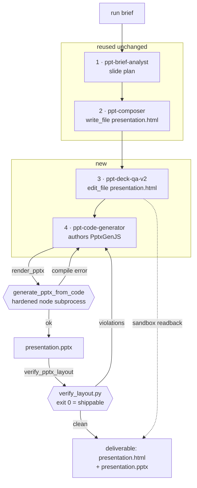

# Spec 017 — `ppt_v2`: an HTML deck *and* a real `.pptx`, from the workflow itself

## Goal

One run of `ppt_v2` produces **two artifacts**:

| artifact | how it is produced | how the user gets it |
|---|---|---|
| `presentation.html` | composer writes it, QA edits it in place | the run's deliverable — renders in Preview, downloads as `.html` |
| `presentation.pptx` | step 4 authors PptxGenJS and **calls a tool** that builds the real file | Download PPTX (phase 1) → Sandbox tab (phase 2) |

Hard constraints from the brief:

- **`agents/workflows/ppt/workflow.yaml` is not touched.** `ppt_v2` is a new, separate workflow.
- **The existing `ppt` workflow must not break** — nothing it depends on changes behaviour.
- **No hacks.** Where a good script already exists, it becomes a *tool* the agent calls.
- The **workflow itself** generates the pptx — not a download-time side effect.

---

## The one decision that shapes everything

`deliverable.strategy: ppt` resolves to `ctx.last_streamed` — **the last step's output**
(`engine.py:3516`). A 4th step emitting PptxGenJS would therefore *replace* the deck
with JavaScript.

`ppt_v2` instead declares:

```yaml
deliverable:
  strategy: single_file
  name: presentation.html
```

`single_file` reads a **named file back off the run sandbox**
(`agents/capabilities/deliverables/single_file.py:72`), so the HTML deliverable is
immune to step order. It also degrades well: if step 4 fails outright, the composer's
`presentation.html` is still on disk and the run still delivers a valid deck.

---

## Pipeline



**One writer per file.** `write_file` does not overwrite in deepagents'
`FilesystemBackend` (the prototype loop uses `write_file` for task 1 and `edit_file`
for every later task). So:

- `presentation.html` — **written** by step 2, **edited** by step 3, **read only** by step 4
- `presentation.pptx` — **written** only by the `render_pptx` tool

This is why `ppt-validator` cannot be reused for step 3: its prompt re-emits the deck as
*text*, so nothing ever writes the validated version back to disk. `ppt-deck-qa-v2` does
the same QA work but with `edit_file`.

---

## The retry loop lives inside step 4, not in the workflow

Both tools return actionable failure text, so the agent iterates without any workflow
branching, conditional gate, or engine change:

- `render_pptx` → `"ERROR line 42: pres.writeFile is not a function"` → agent fixes, retries
- `verify_pptx_layout` → `"slide 5 shape 'desc-row-B-1' bottom 7.214\" crosses footer rail 6.70\""` → agent fixes, retries

`verify_layout.py`'s own docstring makes the case for it being a gate rather than advice:

> *Use this as the gate for "this re-export is shippable". Don't claim the audit is fixed
> without running this script — the human eye misses 1–2 mm overflow at zoom-out, the
> script doesn't.*

---

## NEW files (10)

| # | path | what |
|---|---|---|
| 1 | `backend/agents/capabilities/tools/pptx.py` | `@register("tool", "pptx")` provider emitting 3 tool keys. Import-clean of `app.*` per the import-linter rule (`agents.capabilities ↛ app`), exactly like `providers.py`. |
| 2 | `backend/app/agents/tools/pptx_tools.py` | The 3 concrete `@tool` impls, sandbox-bound by the factory. |
| 3 | `backend/skills/global/html-deck-to-pptx/SKILL.md` | Output contract, px→inch/pt conversions, the five build-breaking rules. Adapted from the dry run that already proved it. |
| 4 | `backend/agents/prompts/ppt-deck-qa-v2/AGENT.md` | Step 3. Same QA as `ppt-validator` but `edit_file`s the deck in place. |
| 5 | `backend/agents/prompts/ppt-code-generator/AGENT.md` | Step 4. **Name is deliberate** — see below. |
| 6 | `backend/agents/workflows/ppt_v2/workflow.yaml` | The manifest. |
| 7 | `backend/tests/agents/test_pptx_tools.py` | Tool unit tests (compile ok / compile error / layout violation / traversal refusal). |
| 8 | `backend/tests/unit/test_ppt_v2_manifest.py` | Manifest compiles; `ppt` compiles byte-identically; one-writer-per-file invariant. |
| 9 | `specs/017-ppt-v2-pptx/design.md` | This document. |
| 10 | `specs/017-ppt-v2-pptx/tasks.md` | Task breakdown + verification per task. |

### Why the agent is named `ppt-code-generator`

`app/api/runs.py:410` already contains:

```python
_PPT_CODE_AGENT_IDS = {"ppt-code-generator"}
```

The export endpoint's **Strategy 1** looks up exactly that id in `agent_outputs`.
Naming the new agent to match means the existing **Download PPTX** button works with
**zero change** to `runs.py` and zero change to the frontend's fetch. The id is also
honestly descriptive — it is the agent that generates the deck code.

---

## MODIFIED files (5)

| # | path | change | why |
|---|---|---|---|
| 1 | `backend/agents/registry.py` | add `PIPELINE_AGENTS["ppt_v2"]` | The documented step for adding a pipeline. Required by `allowed_custom_agent_ids("ppt_v2")` — the same launch allow-list that rejected the custom agent earlier. Additive key; every existing entry untouched. |
| 2 | `backend/agents/factory.py` | `_resolve_custom_tool_keys(keys)` → `(keys, ctx)`; add 3 key branches | The pptx tools need the run sandbox to write into. Existing keys resolve identically; `ctx` is simply available now. One call site. |
| 3 | `backend/app/services/pptx_export.py` | resolve `node` via `shutil.which`, put its real dir on the child PATH | `_build_clean_env` hardcodes `PATH: "/usr/local/bin:/usr/bin:/bin"`. Homebrew node lives at `/opt/homebrew/bin`, so the executor dies `FileNotFoundError: node` on macOS. A hardcoded-Linux-path bug, not a workaround. **Env stays fully scrubbed** — no secrets added. |
| 4 | `frontend/src/components/preview/PreviewPanel.tsx` | map `ppt_v2 → ppt` in the `renderType` normalisation | The chain at `:568` normalises `ppt_revision → ppt` etc. Without a `ppt_v2` entry the deck would not route to `PPTPreview` and would render as raw text. One line, same shape as its neighbours. |
| 5 | `frontend/src/types/index.ts` | add `"ppt_v2"` to the `WorkflowType` union | Type-level only. |

**Note:** nothing else in the frontend changes in phase 1. The Download PPTX button in
`FilesTab`, `PreviewPanel` and `PPTPreview` already POSTs to `/api/runs/export-pptx`,
and Strategy 1 resolves it.

---

## REUSED unchanged (the majority of the work is already built)

| component | role |
|---|---|
| `app/services/pptx_export.py::generate_pptx_from_code` | Hardened node subprocess — scrubbed env, POSIX rlimits, semaphore(3), 120s wall clock, 50 MB cap, LLM-output sanitisers. **Verified working: produced a valid 45 474-byte, 1-slide .pptx.** |
| `POST /api/runs/export-pptx` | Endpoint + request caps + filename sanitisation. Strategy 1 finds `ppt-code-generator`. |
| `skills/opendesign/skills/pptx-html-fidelity-audit/scripts/verify_layout.py` | Deterministic geometry gate. Wrapped as a tool, script unmodified. |
| `skills/opendesign/skills/pptx-html-fidelity-audit/scripts/extract_pptx.py` | Shape/typography ground-truth dump. Wrapped as a tool, script unmodified. |
| `agents/prompts/ppt-brief-analyst/AGENT.md` | Step 1, verbatim. |
| `agents/prompts/ppt-composer/AGENT.md` | Step 2, verbatim. |
| `agents/capabilities/deliverables/single_file.py` | Sandbox readback deliverable. |
| `RunSandbox.path_for()` | Traversal-proof (`is_relative_to(root)`), per-user/per-run. |
| `frontend/node_modules/pptxgenjs` (3.12) | Already installed and resolving. |
| Download PPTX button (3 call sites) | Already wired. |

---

## Explicitly UNTOUCHED

- `backend/agents/workflows/ppt/workflow.yaml`
- `backend/agents/prompts/ppt-validator/AGENT.md`
- `backend/agents/prompts/ppt-brief-analyst/AGENT.md`, `ppt-composer/AGENT.md`
- The `ppt` pipeline's `PIPELINE_AGENTS` entry
- `agents/capabilities/deliverables/ppt.py` (the `ppt` strategy)

A pinned test asserts `compile_for_run("ppt")` is byte-identical before and after.

---

## Change budget

```
NEW       10 files   (2 code, 1 skill, 2 agents, 1 manifest, 2 tests, 2 spec docs)
MODIFIED   5 files   (3 backend, 2 frontend)  — all additive, no behaviour removed
UNTOUCHED  everything the existing ppt workflow reads
```

Backend code touched: **~3 functions** (`_resolve_custom_tool_keys`, `_build_clean_env`,
one `PIPELINE_AGENTS` dict literal). Frontend: **2 lines**.

---

## Risks and failure modes

| risk | containment |
|---|---|
| Step 4 authors invalid PptxGenJS | `render_pptx` returns the compile error; agent retries. Worst case: no pptx, **HTML deliverable unaffected**. |
| Model can't satisfy `verify_layout` | Bounded retries, then ship the pptx with a logged warning. The geometry gate is advisory-with-teeth, not a hard run failure. |
| `qwen3.5:4b` too weak for step 4 | Real risk locally. The design is provider-agnostic; the dry run proved it on a frontier model. Local runs may need `OLLAMA_MODEL=qwen3.5:9b`. |
| Sandbox TTL sweep | Phase 1 regenerates from stored JS at download, so old runs still work. |
| `ppt` regression | Pinned byte-identical compile test + a no-override `ppt` run compared against today's output. |

---

## Phase 2 — Sandbox tab (separate, not in this budget)

Replaces the need for a bolted-on `.pptx` row in FilesTab: both files appear naturally
in a real workspace view.

- `RunSandbox.list_files()` — walk root → relpath, size, mtime, is_dir
- `GET /api/runs/{id}/sandbox` — owner-scoped tree
- `GET /api/runs/{id}/sandbox/file?path=` — text inline, binary as attachment
- `SandboxTab.tsx` — tree lifted from `AppBuilderPreview.tsx` (`buildTree`, `FileTreeNode`), generalised to fetch lazily
- route + tab button alongside Preview / Steps / Files / Audit

**Security, built in from the start, not after:**

1. Owner scoping on every request — the sandbox path derives from `user_id`, so a miss here is cross-tenant.
2. `Content-Disposition: attachment` + `application/octet-stream` for anything not explicitly whitelisted. Serving agent-authored HTML inline from the API origin is stored XSS with the session in scope. The Preview iframe keeps using `srcdoc`, which is the safe path.
3. Size and file-count caps on both listing and read.
4. A real "workspace expired" empty state for TTL-swept runs.

## Deferred

**Visual screenshot diffing** (render both HTML and PPTX, compare per-slide). `render_check.py`
drives headless Chromium but is built for prototype nav-testing — pointing it at a deck
would be a misuse. Real visual diffing is its own build. The geometry gate catches the
failure that actually matters — overlapping and off-canvas text — deterministically and
cheaply.
