# Tasks: `ppt_v2` — an HTML deck *and* a real `.pptx`

Spec: [spec.md](spec.md) · Plan: [plan.md](plan.md).
Nine tasks, three checkpoints. Nothing here modifies `ppt`.

```mermaid
flowchart LR
    T1((T1)) --> V1{{V1}}
    V1 --> T2((T2)) --> T3((T3)) --> T4((T4)) --> V2{{V2}}
    V2 --> T5((T5)) --> T6((T6)) --> T7((T7)) --> T8((T8)) --> T9((T9)) --> V3{{V3}}

    classDef todo fill:#ffffff,stroke:#868e96,color:#1b1b1b;
    classDef inprogress fill:#4dabf7,stroke:#1971c2,color:#ffffff;
    classDef done fill:#40c057,stroke:#2f9e44,color:#ffffff;
    classDef error fill:#fa5252,stroke:#e03131,color:#ffffff;

    %% STATUS — move a task id between these lines on completion. Never change
    %% a node's shape, never edit the classDefs.
    class T1,V1,T2,T3,T4,V2,T5,T6,T7,T8,T9,V3 todo;
```

**9 tasks · 3 checkpoints · NOT STARTED**

---

## Foundation

### T1 — Resolve the `node` binary (FR-008)
`backend/app/services/pptx_export.py`

`_build_clean_env` hardcodes `PATH: "/usr/local/bin:/usr/bin:/bin"`. Homebrew node lives at
`/opt/homebrew/bin`, so the executor dies `FileNotFoundError: node` — which is why no `.pptx` has
ever been producible on a Mac dev box even with valid source. Resolve the real binary
(`shutil.which("node")`) and put its directory on the child PATH.

**The env must stay scrubbed.** Resolving a path adds no secrets; do not widen it further.

**Verify:** `generate_pptx_from_code` produces a valid `.pptx` locally — `python-pptx` opens it and
reports the expected slide count. (Baseline already captured: 45,474 bytes, 1 slide, text intact,
via direct node invocation.)

### V1 — Executor checkpoint
No agent/tool work starts until the hardened runner demonstrably produces a `.pptx` on this machine.

---

## Tools

### T2 — `render_pptx` (FR-004)
`backend/app/agents/tools/pptx_tools.py` (new)

Takes PptxGenJS source → `generate_pptx_from_code` → writes `presentation.pptx` into the run
sandbox → returns `"ok, N bytes"` or the compile error.

**This is what makes the workflow itself generate the pptx**, rather than the download path doing
it. The error string is the retry signal for T7's loop, so it must carry the actual failure, not a
generic message.

**Verify:** valid source → file on disk + byte count; invalid source → the compile error, no file,
no exception escaping the tool.

### T3 — `verify_pptx_layout` + `extract_pptx_shapes` (FR-005, FR-006)
`backend/app/agents/tools/pptx_tools.py`

Wrap `skills/opendesign/skills/pptx-html-fidelity-audit/scripts/verify_layout.py` and
`extract_pptx.py` **unmodified** — they are already the deterministic gate this needs
(`verify_layout.py`: *"exits 0 on no violations, 1 on any violation"*). Return violations as
actionable text.

**Verify:** a deck with a shape crossing the footer rail reports it with slide index and shape
name; a clean deck returns success.

### T4 — Register the tool set
`backend/agents/capabilities/tools/pptx.py` (new), `backend/agents/factory.py`

`@register("tool", "pptx")` emitting the three keys, plus their resolution in
`_resolve_custom_tool_keys`. The capability package must stay import-clean of `app.*`
(import-linter: `agents.capabilities ↛ app`) — the provider emits string keys, the factory
resolves them.

The tools need the run sandbox, so `_resolve_custom_tool_keys` gains `ctx`. Existing keys resolve
identically.

**Verify:** an agent declaring `tools: [pptx]` binds all three; the four existing tool sets bind
byte-identically (the parity snapshots stay green).

### V2 — Tool checkpoint
Tools work standalone against a fixture deck before any agent is asked to drive them.

---

## Pipeline

### T5 — `html-deck-to-pptx` skill
`backend/skills/global/html-deck-to-pptx/SKILL.md` (new)

The output contract, adapted from the dry run that already proved it: `pres` as the variable name,
`return pres.write("nodebuffer")`, hex without `#`, inches on 13.333 × 7.5, no `require`/`import`.
Plus px→inch (÷96) and px→pt (×0.75) conversions.

**Verify:** an agent handed this skill and a deck emits source that compiles first time on a
frontier model.

### T6 — `ppt-deck-qa-v2` agent (FR-003)
`backend/agents/prompts/ppt-deck-qa-v2/AGENT.md` (new)

`ppt-validator` cannot be reused: its prompt re-emits the deck as **text**, so nothing writes the
validated version back, and `single_file` would ship the composer's unvalidated deck. This agent
does the same QA but `edit_file`s `presentation.html` in place.

**Verify:** the on-disk `presentation.html` differs from the composer's when QA found defects.

### T7 — `ppt-code-generator` agent (FR-007, FR-009)
`backend/agents/prompts/ppt-code-generator/AGENT.md` (new)

Step 4. `pipeline_type: ppt_v2`, `tools: [pptx]`, `skills: [html-deck-to-pptx]`. Reads the deck,
authors PptxGenJS, calls `render_pptx`, then `verify_pptx_layout`, revising until clean.

**The id is deliberate** — `runs.py` already carries `_PPT_CODE_AGENT_IDS = {"ppt-code-generator"}`,
so the existing Download PPTX button resolves its output with zero change to `runs.py`.

**Verify:** the retry loop actually fires — inject a deliberately broken deck and confirm the agent
revises rather than giving up.

### T8 — `ppt_v2` manifest (FR-001, FR-002)
`backend/agents/workflows/ppt_v2/workflow.yaml` (new)

Steps 1–2 reuse `ppt-brief-analyst` / `ppt-composer` verbatim; 3–4 are T6/T7.
`deliverable: {strategy: single_file, name: presentation.html}` — **not** `ppt`, which would let
step 4's JavaScript become the deliverable.

**Verify:** compiles; `compile_for_run("ppt")` is byte-identical to before (pinned test).

### T9 — Register the pipeline (FR-010, FR-011)
`backend/agents/registry.py`

`PIPELINE_AGENTS["ppt_v2"]`, non-empty — required by `allowed_custom_agent_ids` because the wizard
sends `agent_ids`. An empty entry falls through to `∅` and every wizard launch 400s (the
`ex_A1_loop` pattern works only because those launch without `agent_ids`).

Also confirm the four steps satisfy `presort_specs`' produces/consumes DAG check — a **separate**
validator from the compiler, and one that rejected a 2-step `prototype` override the compiler had
accepted (spec 016 §6 G-2).

**Verify:** a wizard launch of `ppt_v2` reaches the engine; `ppt` still launches unchanged.

### V3 — Acceptance
- A `ppt_v2` run yields an HTML deck that renders **and** a `.pptx` `python-pptx` opens with the
  expected slide count and real text frames (SC-001)
- `verify_layout.py` exits 0 on the shipped file (SC-004)
- Download PPTX returns a valid file with no change to `runs.py` (SC-005)
- `compile_for_run("ppt")` byte-identical; a `ppt` run's output unchanged (SC-002)
- Step 4 emitting invalid JS costs the pptx only — the deck still resolves (SC-003)

---

## Notes

Tests run **one file at a time**, never the suite.

Out of scope per [spec.md](spec.md) §5: a deterministic HTML→PPTX converter, visual screenshot
diffing, binary storage in artifacts, retrofitting onto `ppt`. Phase 2 (Sandbox tab) is specified
in spec.md §6 and is **not** in this task list.

**Model caveat:** step 4 must author correct PptxGenJS for a full deck. On `qwen3.5:4b` that is a
stretch and may exhaust the retry budget; the dry run proved the approach on a frontier model.
