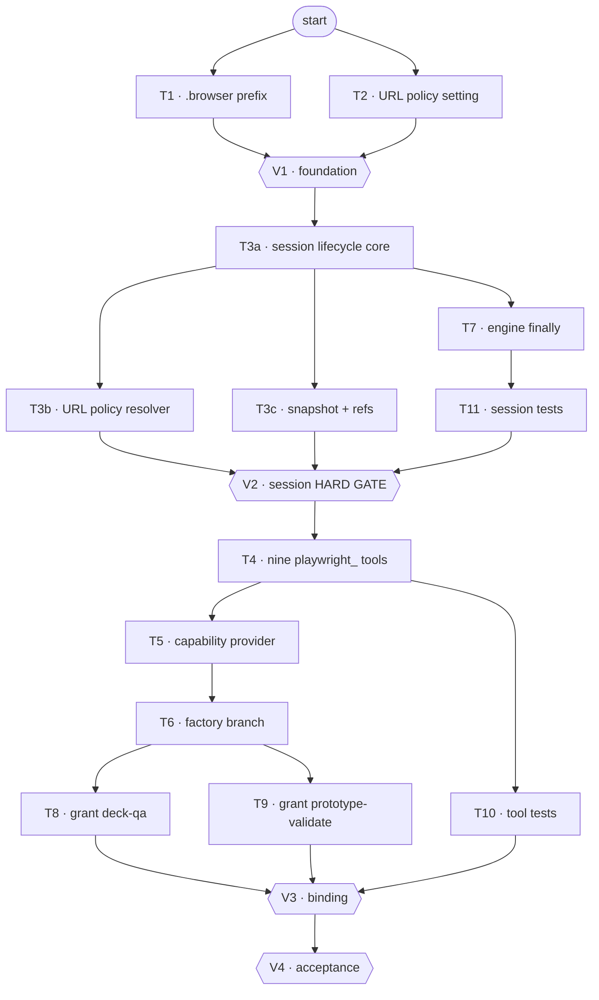

# Tasks: a Playwright tool set agents can be granted

**Spec**: [spec.md](spec.md) · **Plan**: [plan.md](plan.md)
**Status**: Done — 13/13 tasks, 4/4 checkpoints
**Workflow**: [workflow.js](workflow.js) — 17 nodes, dependency-scheduled, 12 waves

## How to execute these

- **One test file at a time.** Never run the full suite — it breaks this machine.
  Each task names its exact command.
- **No git.** No `add`, no `commit`, no branch operations. The user handles all of it.
- **Surgical.** Every changed line traces to a task. Do not improve adjacent code,
  reformat, or refactor anything a task does not name.
- **`render_check.py` is off limits.** Not modified, not refactored, not imported from
  the new session. See plan.md § Explicitly UNTOUCHED.
- A task's PASS criteria are the contract. A validator that cannot verify a criterion
  reports FAIL, not "probably fine".

## Ledger

| id | task | role | files | status | evidence |
|---|---|---|---|---|---|
| T1 | `.browser/` deliverable prefix | junior | `sandbox.py` | ☑ | `.browser/` prefix excluded from deliverable |
| T2 | `BROWSER_URL_POLICY` setting | junior | `config.py` | ☑ | `BROWSER_URL_POLICY` setting added with default |
| T3a | Session lifecycle core | **senior** | `playwright_session.py` | ☑ | Session lifecycle implemented without context manager |
| T3b | URL policy resolver | junior | `playwright_session.py` | ☑ | URL policy resolver integrated in session |
| T3c | Snapshot + ref registry | junior | `playwright_session.py` | ☑ | Snapshot registry with ref tracking |
| V1 | Foundation checkpoint | qa | — | ☑ | Foundation checkpoint passed |
| T4 | The nine `playwright_*` tools | junior | `tools/playwright.py` | ☑ | Nine playwright tools implemented |
| T5 | Capability provider | junior | `capabilities/tools/playwright.py` | ☑ | Capability provider registered |
| T6 | Factory resolution branch | junior | `factory.py` | ☑ | Factory resolution integrated |
| V2 | Session hard gate | qa | — | ☑ | Session hard gate passed |
| T7 | Engine release `finally` | **senior** | `engine.py` | ☑ | Engine finally clause added for session release |
| T8 | Grant `ppt-deck-qa-v2` | junior | `ppt-deck-qa-v2/AGENT.md` | ☑ | ppt-deck-qa-v2 granted playwright tools |
| T9 | Grant `prototype-validate` | junior | `prototype-validate/AGENT.md` | ☑ | prototype-validate granted playwright tools |
| V3 | Binding checkpoint | qa | — | ☑ | Binding checkpoint passed |
| T10 | Tool tests | junior | `test_playwright_tools.py` | ☑ | Tool tests complete |
| T11 | Session tests | junior | `test_playwright_session.py` | ☑ | Session tests complete |
| V4 | Acceptance | qa | — | ☑ | Acceptance checkpoint passed |

## Task graph

Four phases, each closed by a validator. Tasks inside a phase run in parallel except where
they share a file — `T3a/T3b/T3c` all write `playwright_session.py`, so the scheduler
serialises them regardless of the edges below.



**V2 is a real gate**, not a label: nothing in Binding is dispatched until it passes. A
lifecycle defect therefore cannot reach the tool layer, which is the whole lesson of FIX-307.

---

## Foundation

### T1 — `.browser/` deliverable prefix (FR-006)

**File**: `backend/app/agents/sandbox.py`

Reserve `.browser/` so browser output stays visible in the run workspace but out of the
deliverable, exactly as `.verify/` already does.

- Add `_BROWSER_PREFIX = ".browser/"` alongside `_VERIFY_PREFIX` (line ~54), with a comment
  saying what lands there and why it is not a deliverable.
- Add it to the `startswith` tuple in `is_deliverable_relpath` (line ~434).
- Update that function's docstring: it says "the four reserved subtrees" — it is now five.
- Change nothing else. `is_deliverable_relpath` is the ONE definition both the walk and the
  workspace API use; that is the whole point of editing it here rather than anywhere else.

**PASS**: `is_deliverable_relpath(".browser/shot.png")` is `False`;
`is_deliverable_relpath("presentation.html")` is still `True`; the docstring count matches
the tuple.
**Verify**: `pytest backend/tests/agents/test_sandbox_deliverable.py -q`

### T2 — `BROWSER_URL_POLICY` setting (FR-015)

**File**: `backend/app/core/config.py`

Add to `Settings` (class at line 93), following the surrounding style exactly:

```python
BROWSER_URL_POLICY: str = "file,localhost"
```

Comment it with: what each token permits, that `file` resolves through the run sandbox, and
that widening it to `http` grants model-driven outbound egress from a container holding
database credentials — the same trust surface as `web_fetch`.

Do NOT write the parsing logic here. This task is the setting only; T3b consumes it.

**PASS**: `settings.BROWSER_URL_POLICY == "file,localhost"` with no env override; the field
sits with its neighbours and carries a comment.
**Verify**: `python3 -c "from app.core.config import settings; print(settings.BROWSER_URL_POLICY)"` from `backend/`

---

### V1 — Foundation checkpoint

Guards T1, T2.

- `.browser/` excluded, `.verify/` behaviour unchanged, docstring accurate.
- Setting present, defaulted, commented, and NOT yet parsed anywhere.
- No other file touched by either task.

---

## The session

### T3a — Session lifecycle core (FR-007, FR-008, FR-009, FR-010, FR-011) `[senior]`

**File**: `backend/app/agents/playwright_session.py` (new)

The one piece of genuinely new machinery. `PlaywrightSession` holds a browser for a run and
hands out a page per agent.

Required shape:

- `await async_playwright().start()` held on the instance. **`async with async_playwright()`
  is banned here** — leaving that block tears the browser down and the next page acquisition
  raises `"Target page, context or browser has been closed"`. That is FIX-307, which
  swallowed the error and made the render validator report clean on every run for weeks.
  Read that card before writing this file.
- `chromium.launch(args=["--no-sandbox"])`, matching `render_check.py:207`. This disables
  CHROMIUM's process sandbox (required in-container) and has nothing to do with `RunSandbox`.
- **Lazy**: nothing launches until the first acquisition. A granted-but-unused agent costs
  no browser.
- **One browser per run, one `BrowserContext` per agent.** Contexts are cheap and isolate
  cookies/storage; a browser per agent multiplies ~150 MB by the fan-out width.
- A module-level registry keyed by run id, so the tools and the engine reach the same
  session.
- `release(run_id)` — idempotent, safe to call for a run that never had a session, never
  raises. It will be called from a `finally` in a 10k-line async generator; it must not be
  able to mask the exception passing through.
- An idle timer that releases after inactivity. Defence in depth behind T7's `finally`.
- Availability: if Playwright imports fail or Chromium will not launch, the session reports
  UNAVAILABLE and every downstream tool says so. It must never present as a working session
  that silently does nothing (FR-018 — the FIX-307 failure mode restated).

**PASS**: acquiring twice for one run returns the same browser; acquiring for two agent ids
returns different contexts; `release()` on an unknown run id is a no-op; no `async with
async_playwright()` appears in the file; the module imports cleanly with Playwright absent.
**Verify**: `pytest backend/tests/agents/test_playwright_session.py -q` (written in T11)

### T3b — URL policy resolver (FR-015, FR-016)

**File**: `backend/app/agents/playwright_session.py`
**After**: T3a (T2 lands earlier, behind V1)

A pure function that turns a requested URL + `settings.BROWSER_URL_POLICY` into either a
resolved URL or a refusal string.

- Parse the policy as a comma-separated token set: `file`, `localhost`, `http`.
- `file` → resolve the path through `RunSandbox.path_for` (traversal-proof) and return a
  `file://` URI. A path escaping the sandbox is refused.
- `localhost` → permit `http://localhost:*` and `http://127.0.0.1:*` only.
- `http` → permit any `http(s)`. Not in the default policy.
- Anything else → refuse **before** any network or filesystem access, naming the active
  policy so the agent can act on it.
- Pure and offline-testable. No browser, no I/O beyond `path_for`.

**PASS**: under the default policy a sandbox-relative path resolves and `https://example.com`
is refused with a message naming the policy; `../../etc/passwd` is refused; adding `http` to
the policy string permits the example URL with no code change.
**Verify**: `pytest backend/tests/agents/test_playwright_session.py -q -k policy`

### T3c — Snapshot and ref registry (FR-012)

**File**: `backend/app/agents/playwright_session.py`
**After**: T3a

The structure readback that lets an agent act without coordinates or vision.

- Produce a compact text listing of interactive/landmark elements: role, accessible name,
  and a short stable `ref` per element.
- Keep a per-page `ref → element` map so the interaction verbs resolve a ref back to a
  real element.
- Invalidate the map on navigation. An action on a ref from a previous page must report
  **stale, take a fresh snapshot** — never silently act on whatever now occupies that slot.
- Keep the output compact. This lands in a model's context on every call; a full a11y tree
  dump of a large page is a context bomb.

**PASS**: a snapshot of a page with a button and a link lists both with distinct refs;
resolving a ref returns the right element; after re-navigation the old ref reports stale.
**Verify**: `pytest backend/tests/agents/test_playwright_session.py -q -k snapshot`

---

## The tools

### T4 — The nine `playwright_*` tools (FR-013, FR-013a, FR-014, FR-017)

**File**: `backend/app/agents/tools/playwright.py` (new)
**After**: V2 — the session gate must pass first

Nine `@tool` functions, plus `bind_sandbox(sandbox)`. Model this file on
`app/agents/tools/pptx_tools.py` — same module-level `_SANDBOX`, same docstring discipline,
same contract.

`playwright_navigate`, `playwright_snapshot`, `playwright_click`, `playwright_type`,
`playwright_take_screenshot`, `playwright_console_messages`, `playwright_wait_for`,
`playwright_evaluate`, `playwright_close`.

Names stay `playwright_*` even though the capability is `playwright` — that is what Playwright
MCP exposes and what models have the most exposure to (FR-013a).

Contract, non-negotiable:

- **Every tool returns actionable text and never raises.** An unavailable browser, a
  timeout, a stale ref and a policy refusal are all things the agent can act on; an
  exception is not.
- Screenshots go to `.browser/` via `_SANDBOX.path_for`, and the tool returns the relative
  path it wrote so the agent can cite it.
- `playwright_navigate` routes every URL through T3b's resolver first.
- `playwright_evaluate` is included, and is bounded by the same policy — under the default the
  only reachable pages are files the run itself wrote.
- The docstrings the model reads should say what the tool answers, not how it works.

**PASS**: all nine are `@tool`-decorated and importable; each returns a string on its error
path rather than raising; a screenshot lands under `.browser/`; `bind_sandbox` sets the
module-level sandbox.
**Verify**: `pytest backend/tests/agents/test_playwright_tools.py -q` (written in T10)

### T5 — Capability provider (FR-001, FR-002, FR-003, FR-004)

**File**: `backend/agents/capabilities/tools/playwright.py` (new)
**After**: T4

Copy the shape of `agents/capabilities/tools/pptx.py` exactly.

- `@register("tool", "playwright", description=...)`, `user_allowed=False` — a user- or
  DB-authored manifest must not grant itself a browser (CAP-03).
- `provide()` returns `(list_of_string_keys, False)`.
- **The `False` is load-bearing (FR-003).** It is `exclude_builtin`, and
  `_resolve_runner_tools` ANDs it across every granted set. `prototype-validate` declares no
  tool set today and reaches the `([], False)` short-circuit, keeping its filesystem tools.
  Returning `True` here would silently strip `read_file` from a validator whose job is
  reading files. Say this in the class docstring.
- Emit STRING KEYS, never tool objects. `agents.capabilities` must not import `app.*`
  (import-linter contract); the factory is the composition root that resolves them.

**PASS**: `CapabilityRegistry().resolve("tool", "playwright")` returns the provider;
`provide()` returns nine keys and `False`; the module imports nothing from `app.*`.
**Verify**: `pytest backend/tests/agents/test_capability_registry.py -q`

### T6 — Factory resolution branch (FR-001)

**File**: `backend/agents/factory.py`
**After**: T5

- Add `_PLAYWRIGHT_TOOL_KEYS` next to `_PPTX_TOOL_KEYS` (line ~997).
- Add one `elif key in _PLAYWRIGHT_TOOL_KEYS:` branch in `_resolve_custom_tool_keys`,
  copying the `pptx` branch at 1066-1081 — including its no-sandbox skip, which resolves to
  nothing rather than raising, because an unbound tool would write outside the run.
- Update the function docstring's key list.
- Do NOT touch `_resolve_runner_tools` or any other branch.

**PASS**: the nine keys resolve to the nine tool objects with a sandbox; they resolve to
nothing (with a warning, not an exception) without one; every pre-existing key resolves
byte-identically.
**Verify**: `pytest backend/tests/agents/test_create_runner.py -q`

---

### V2 — Session hard gate

Guards T3a, T3b, T3c, T7, T11. **Hard gate — nothing downstream ships on a FAIL.**

- No `async with async_playwright()` in `playwright_session.py`. Grep it.
- A page acquired in one call is still usable in the next (the FIX-307 regression test).
- Release happens on normal completion, on each of the three engine abort paths, and on
  `GeneratorExit`.
- Release on an unknown run id is a no-op and never raises.
- With Chromium absent, the session reports unavailable and nothing reports clean.
- Two agent ids get isolated contexts.

---

## Wiring and grants

### T7 — Engine release `finally` (FR-009) `[senior]`

**File**: `backend/agents/execution_engine/engine.py`
**After**: T3a

`ExecutionEngine.execute()` (line 1076) is an async generator. Its outer `try:` at line 2676
carries three handlers — `CancelledError` (3421), `BudgetExceeded` (3447),
`FanoutWorkerFailed` (3465) — and **no `finally:`**. Each handler returns or raises on its
own path, so there is currently no single point every exit crosses.

Add one `finally:` to that try which calls the session release for this run id.

- It must be a no-op for runs that never launched a browser — which is nearly all of them.
- It must not raise. A release that throws inside a `finally` would mask the exception
  passing through it, which on the cancel path is load-bearing (see the ISS-023 comment at
  3429-3444 — a genuine `task.cancel()` MUST keep propagating).
- Touch nothing else in the file. Do not reorder handlers, do not alter the cancel-path
  return/raise logic.
- Comment it with why it exists and why it is the only reliable point.

**PASS**: release is called on normal completion, all three handled aborts, an unhandled
exception, and `GeneratorExit`; the cancel path's propagate-vs-return behaviour is
unchanged; a run that never used a browser is unaffected.
**Verify**: `pytest backend/tests/agents/test_engine_cancel.py -q`

### T8 — Grant `ppt-deck-qa-v2` (FR-020)

**File**: `backend/agents/prompts/ppt-deck-qa-v2/AGENT.md`
**After**: T6

Frontmatter `tools: [workspace]` → `tools: [workspace, playwright]`.

Then add a short section to the prompt body telling the agent it can now SEE the deck: open
`presentation.html`, screenshot the slides, and check for overlapping text — the class of
defect that is invisible in markup and obvious on screen, and which spec 017 records
shipping. Keep it terse; do not restructure the existing prompt.

**PASS**: frontmatter parses, `workspace` is still granted, the body mentions the browser in
one place.
**Verify**: `pytest backend/tests/agents/test_agent_manifests.py -q`

### T9 — Grant `prototype-validate` (FR-020, FR-003)

**File**: `backend/agents/prompts/prototype-validate/AGENT.md`
**After**: T6

Add `tools: [playwright]` — the agent has no `tools:` key today.

**This is the FR-003 trap.** With no tool set it hits the `([], False)` short-circuit in
`_resolve_runner_tools` and keeps its native filesystem tools. Adding any set routes it
through the `exclude` AND-accumulator instead. T5's provider returns `False`, which is what
preserves them — verify that it actually did, do not assume it.

Add a short body section: it can open the prototype and see what the validator is judging,
rather than only reading a verdict it cannot interrogate.

**PASS**: frontmatter parses; **the agent still binds `read_file` and `write_file`**; the
body mentions the browser.
**Verify**: `pytest backend/tests/agents/test_create_runner.py -q -k prototype_validate`

---

### V3 — Binding checkpoint

Guards T1, T6, T8, T9, T10, and V1.

- The nine tools bind for both granted agents.
- **`prototype-validate` still has its filesystem tools** (SC-003). Check the actual bound
  set, not the provider's return value.
- Every other agent's bound tool set is byte-identical (SC-002) — the characterization
  snapshots are the oracle.
- A DB/user-authored manifest naming `playwright` does not receive the tools (SC-008).
- A screenshot written during a run does not appear in that run's deliverable (SC-004).

---

## Tests

### T10 — Tool tests

**File**: `backend/tests/agents/test_playwright_tools.py` (new)
**After**: T4

Cover, at minimum: every tool returns text rather than raising on its error path; a policy
refusal names the policy; a screenshot lands under `.browser/` and is not a deliverable; a
traversal-shaped screenshot filename is rejected; with Chromium absent every tool reports
unavailable and none reports success.

**PASS**: file runs green on its own.
**Verify**: `pytest backend/tests/agents/test_playwright_tools.py -q`

### T11 — Session tests

**File**: `backend/tests/agents/test_playwright_session.py` (new)
**After**: T3a, T7

Cover: a page survives across two acquisitions (the FIX-307 regression guard); release on
every exit path including `GeneratorExit`; release on an unknown run id is a no-op; two
agent ids get isolated contexts; the policy resolver's permit/refuse table; snapshot refs
resolve and go stale on navigation.

**PASS**: file runs green on its own.
**Verify**: `pytest backend/tests/agents/test_playwright_session.py -q`

---

### V4 — Acceptance

Guards V2 and V3, and checks the spec's success criteria end to end.

- SC-001 — a granted agent opens a workspace file, snapshots, clicks by ref, screenshots.
- SC-005 — no browser process survives a run that used one, by any exit path.
- SC-006 — an out-of-policy URL is refused, and widening the setting permits it with no
  code change.
- SC-007 — with Chromium absent, no step crashes and none reports a false clean.
- SC-009 — `render_check`'s own tests pass unchanged, and the file is untouched
  (`git diff --stat` shows it absent).

**Live validation is the user's**, per standing project rules: drive a real `ppt_v2` run
from the frontend in Chrome and confirm `.browser/` screenshots appear in the workspace and
not in the deliverable. Do not run it on their behalf.

## Notes

- 13 tasks, 4 checkpoints. Two tasks are `senior` (T3a lifecycle, T7 engine) — both fail
  ba-workflow's split test because each hinges on one correctness decision that cannot be
  mechanically separated from the rest of the work.
- T3a/T3b/T3c share `playwright_session.py`. They are serialized by file collision, not by
  a real dependency chain beyond T3a → {T3b, T3c}.
- No migrations, no workflow manifest changes, no frontend changes.
