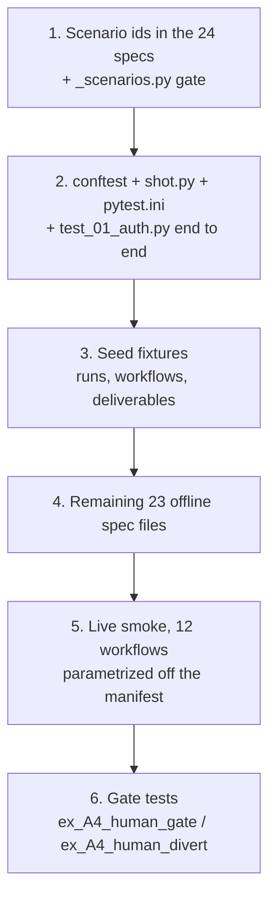

# Integration tests — implementation plan

Phase 2 of the integration-test effort. Phase 1 produced the specs
(`../screens/*.feature.md`, 480 scenarios across 24 files) and the static gates
(`../capture/`). This plan turns those specs into a runnable suite.

**Status:** agreed, not yet built.

---

## 1. Scope

| In | Out |
|---|---|
| Runnable pytest suite driving real Chrome | Unit tests (backend owns its own) |
| Screenshot capture per step, as evidence | Screenshot *analysis* — separate, later, not part of the run |
| Offline tests over seeded state | Pixel-diff baselines / visual regression |
| Live smoke tests that really call Bedrock | Load, performance, security scanning |
| Every user-launchable workflow | Responsive breakpoints (still unspecified) |

**A run is green when `pytest` exits 0.** Screenshots are artifacts left behind for
a human or a later analysis pass. They are never the pass/fail signal.

---

## 2. Language: Python

`pytest` + `pytest-playwright`. One language for the whole suite.

The alternative considered was TypeScript `@playwright/test`, which has nicer
ergonomics — `test.step()`, a built-in HTML report. It was rejected because the
ergonomic gap is small and the toolchain cost is not:

- the backend is FastAPI (Python)
- all five gates in `../capture/` are Python
- `playwright-python` has parity on what matters: locators, auto-retrying
  `expect()`, tracing, video, and `channel="chrome"`
- `pytest-playwright` is Microsoft-official, not a community port
- pytest markers express the live/offline split more simply than Playwright projects

What we give up and how it is replaced:

| Lost | Replacement |
|---|---|
| `test.step()` | `shot()` — a ~15-line context manager we need anyway, because it must emit the PNG *and* its metadata |
| Playwright HTML report | `pytest-json-report`, which the run folder wants regardless |

**Real Chrome, not bundled Chromium.** `channel="chrome"` →
`/Applications/Google Chrome.app`. Playwright still supplies a clean temporary
profile, so the developer's own tabs, history and logins are untouched.

---

## 3. Directory structure

```
tests/integration/
├── screens/              # 24 spec files — the source of truth, unchanged
├── capture/              # static gates: read source, assert the specs name it
│   ├── _coverage.py      #   312 controls
│   ├── _api.py           #   111 endpoints
│   ├── _verify.py        #   screenshot references resolve
│   ├── _gaps.py          #   interaction categories
│   ├── _deadcode.py      #   components nothing imports
│   └── _scenarios.py     #   NEW — every scenario id has a test, and vice versa
├── docs/
│   └── plan.md           # this file
├── e2e/                  # the runnable suite
│   ├── pytest.ini
│   ├── conftest.py       # fixtures: auth roles, page, shot, seed, run dir
│   ├── shot.py           # step wrapper + shot_transitions + approve_gate
│   ├── selectors.py      # every testid in one place
│   ├── workflows.py      # reads the manifest -> the launchable list
│   ├── test_01_auth.py   # 1:1 with screens/01-auth.feature.md
│   └── ...               # 24 files, same numbering as the specs
└── runs/                 # gitignored output
```

`capture/` keeps its name for now; `gates/` would be more accurate but a rename is
cosmetic churn.

### Why `capture/*.py` exists at all

They are not tests. They are the reason the spec coverage numbers are trustworthy.
Coverage was claimed at 100% twice during phase 1 and was wrong both times — the
second time the real figure was 49%. Each gate reads app source and answers one
question, in about a second, with no browser and no server:

> does any spec name this thing?

`_scenarios.py` extends the same idea to phase 2: does every spec scenario have a
test, and does every test name a real scenario.

---

## 4. Run output

```
runs/2026-08-27T02-14-smoke/
├── manifest.json                          # git sha, flags, env, app version, start/end
├── report.json                            # pytest-json-report
└── 01-auth/
    └── S-01-03-signs-in-with-valid-credentials/
        ├── 01-credentials-entered.png
        ├── 02-dashboard.png
        └── steps.json
```

Names are zero-padded so lexical sort is chronological, and slugged so the filename
says what it is meant to show before anyone opens it.

`steps.json`, one row per shot:

```json
{"n": 2, "slug": "dashboard",
 "gherkin": "Then the dashboard loads with the run history visible",
 "shot": "02-dashboard.png", "url": "/dashboard",
 "console": [], "failed_requests": [], "outcome": "passed", "ms": 812}
```

This costs about five lines inside a wrapper being written regardless, and any later
analysis pass needs it — a bare PNG forces the reader to guess what it was supposed
to prove.

---

## 5. The `shot()` contract

```python
with shot("dashboard", "Then the dashboard loads"):
    page.click(SIGN_IN)
    expect(page).to_have_url(re.compile(r"/(dashboard|admin)"))
```

- runs the block, then screenshots **on exit** — so the image is of the settled
  state, not mid-action
- on exception: shoots `NN-slug-FAILED.png` first, then re-raises. A failure is
  exactly when the picture is worth most
- appends its row to `steps.json`
- records console errors and failed network requests seen during the block

**No fixed sleeps.** `expect()` polls until it matches or times out, so the wait and
the assertion are the same line. Faster when the app is quick, still correct when it
is slow, and never a hardcoded `sleep(2)` repeated 480 times.

---

## 6. What to assert

| Assert on | Example |
|---|---|
| Process / state | run reaches `completed`, step count advances, deliverable count > 0 |
| Static UI text | `expect(heading).to_have_text("Security")` on a settings page |
| URL, testid presence, control enablement | `expect(page).to_have_url(...)` |
| **Never:** model-generated content | not "the deck says hello" — that varies per run |

Process assertions where the product exposes state; content assertions where it does
not — a settings page has no state machine, so its headings and field labels are the
only handle, and asserting on them is correct. The line is *static UI text* versus
*LLM output*, not content versus process.

---

## 7. Offline vs live

Split by pytest marker, so the skip is declarative and the default is safe.

`e2e/pytest.ini`:

```ini
[pytest]
addopts = -m "not live" --json-report
timeout = 180
markers =
    live: really calls Bedrock — costs money, skipped by default
    destructive: mutates shared state, needs a reset first
    defect: asserts today's wrong behaviour, not the desired one
    scenario(id): the spec scenario this test implements
```

```
pytest                          # offline only — skipping is the default, no flag needed
pytest -m live                  # live smoke (CLI -m overrides addopts)
pytest -m live -k ppt           # one workflow
pytest -m "live or not live"    # everything
```

Its own `pytest.ini` in `e2e/`, so it does not collide with the backend's config.

| | timeout | retries |
|---|---|---|
| offline | 180s | default |
| live | 600s, via `@pytest.mark.timeout(600)` | **0** — a retry doubles the Bedrock bill |

### Offline tests get their state from fixtures, not from an LLM

Most scenarios are about *viewing* state: run pages, results, exports, history,
versions, files, library, settings, admin. None of those need a model — they need
rows in the database. Those are seeded directly (the seed script that provisions the
three QA accounts is the natural home) and the tests run fully offline.

**No Bedrock stub is built.** Anything that genuinely traverses the model is a live
test. That keeps the offline suite honest — it never asserts against a fake response
that could drift from what Bedrock really returns.

---

## 8. Live smoke tests

Live tests drive the real UI and start a real run. The brief is deliberately trivial:

```python
SMOKE_BRIEF = "One-page HTML greeting. No framework, no CSS library."
```

One constant, one place, so the cost of a live pass is auditable at a glance. These
are smoke tests — they prove the pipeline works end to end. They are not there to
build a real application.

The screenshots are the *process*, so they are time-sequenced through the run:

```python
@pytest.mark.live
@pytest.mark.timeout(600)
@pytest.mark.parametrize("wf", launchable_workflows())
def test_workflow_smoke(page, shot, wf):
    with shot("brief-entered", f"Given a hello-world brief for {wf.id}"):
        page.goto("/workflows")
        page.fill(BRIEF, SMOKE_BRIEF)

    with shot("launched", "When the run is launched"):
        page.click(RUN)
        expect(page).to_have_url(re.compile(r"/runs/"))

    shot_transitions(page, until="completed")   # queued, running, step-N, ...

    with shot("completed", "Then deliverables are produced"):
        expect(page.get_by_test_id("run-status")).to_have_text("completed")
        expect(page.get_by_test_id("deliverable")).not_to_have_count(0)
```

`shot_transitions()` watches the run-status testid and shoots on every change. It is
one helper, reused by every live test, and it is what produces the process evidence.

### Human gates

A gate is approved by the test, with proof either side of the click:

```python
def approve_gate(page, label):
    expect(page.get_by_test_id("gate-prompt")).to_be_visible()
    shot_now(f"{label}-gate-awaiting")     # what was asked, before anything is touched
    page.click(GATE_APPROVE)
    shot_now(f"{label}-gate-approved")
```

Approve is the happy path. Reject and revise, where a spec has them, are separate
tests.

### Workflow coverage

Parametrized off the manifest, never a hardcoded list — so a newly added workflow
gets a smoke test by construction rather than by someone remembering:

```python
def launchable_workflows():
    """user_launchable: true AND is_beta: false — the rows a user can actually click."""
```

`is_beta` renders a `user_launchable` workflow as greyed-out "Coming Soon" in the
catalog, so beta rows are listed but not clickable.

17 are `user_launchable: true`; 4 of those are beta. **13 are launchable today:**

| Workflow | Display name |
|---|---|
| `ppt` | Pitch an idea |
| `ppt_v2` | Pitch an idea (v2) |
| `prototype` | Build an interactive prototype |
| `app_builder` | Build an end-to-end application |
| `user_stories` | Generate product requirements |
| `custom` | Compose a custom workflow |
| `ex_A1_loop` | Retry Until It Passes |
| `ex_A2_branch` | Branch by Language |
| `ex_A3_b_spanish` | Spanish Greeter |
| `ex_A3_c_dutch` | Dutch Greeter |
| `ex_A3_divert` | Hand Off to Another Workflow |
| `ex_A4_human_divert` | Ask a Human, Then Hand Off |
| `ex_A4_human_gate` | Ask a Human, Then Decide |

Beta, listed but not clickable — excluded until the flag flips:
`mulesoft_to_springboot`, `dotnet_to_azure`, `reverse_engineer`,
`sample_subagents_parallel`.

The two `ex_A4_human_*` workflows are the natural home for the gate helper, since a
gate is their whole point.

---

## 9. Scenario ids — the link between spec and test

The specs are markdown, so nothing can currently pair a run folder with a spec block.
Each `Scenario:` gets a stable id, and each test carries it:

```gherkin
@S-01-03
Scenario: Signs in with valid credentials
```

```python
@pytest.mark.scenario("S-01-03")
def test_signs_in_with_valid_credentials(page, shot, user):
```

`_scenarios.py` then asserts, and exits non-zero on any of:

- a spec scenario with no test
- a test naming a scenario id that does not exist
- a scenario tagged `@live` whose test is not marked `live` — that one silently burns
  money on every default run

Ids are permanent. A renamed scenario keeps its id.

---

## 10. Build order



1. **Ids and the gate first.** Coverage becomes measurable before a single test
   exists, which is the mistake phase 1 made and had to correct twice.
2. **One file end to end** — `01-auth`, offline. Proves `shot()`, the run folder, the
   auth fixture and the config on eight scenarios rather than 480.
3. **Seed fixtures** — this unblocks the bulk of the offline suite.
4. **Fan out** the remaining spec files.
5. **Live smoke** last, once the offline suite is stable.

---

## 11. Open decisions

| # | Question | Note |
|---|---|---|
| 1 | ~~`ppt_v2` does not exist~~ | **Resolved by the merge at `9b0fb8c79`.** `ppt_v2` now ships, `user_launchable: true`, `is_beta: false`, "Pitch an idea (v2)". It is in the table above |
| 2 | Do the seven `*_revision` workflows get smoke tests? | They are launched by a user, but from a run page rather than the catalog, so `user_launchable: true` does not select them. Including them needs a completed parent run as a fixture |
| 3 | Reject / revise paths on gates | Approve is specified. Do the negative paths get tests too? |
| 4 | Responsive breakpoints | Still unspecified in phase 1. Needs target viewports before it can be either specced or tested |
| 5 | Does `SandboxTab` get testids added before it is specced? | See §12 — 1354 lines with no addressable attribute at all |

## 12. Spec drift from the merge at `9b0fb8c79` — CLOSED

`feat/conditional-gates` (183 files, +11,920 / −1,633) landed on this branch after the
specs were written. Re-running the gates gave the delta below; §12.1–12.4 have since
been closed as spec work, and all three gates are green again.

| Gate | Before merge | After merge | Now |
|---|---|---|---|
| `_api.py` | 108 endpoints, 108 named | 111, **3 unspecified** | **111 / 111** |
| `_coverage.py` | 307 controls, 100% | 312, **5 uncovered (98%)** | **312 / 312** |
| `_verify.py` | no problems | no problems | no problems |

507 scenarios across 24 files, up from 480.

### 12.1 One spec is now WRONG, not merely incomplete

`07-run-detail.feature.md` carries a `@defect` scenario for **D-02**:

> `Scenario: The Workspace tab has a URL the router does not know`
> `But parseViewPath(["runs", "{id}", "workspace"]) returns screen "unknown"`
> `And routes.ts exposes no builder for it`

The merge fixed both halves. `routes.ts` now has
`runWorkspace: (id) => /runs/${id}/workspace`, a `run-workspace` variant in
`ParsedView`, and a `subpath === 'workspace'` branch in `parseViewPath`. The scenario
now asserts behaviour that no longer exists, and would fail as written.

A `@defect` scenario that outlives its defect is the worst kind of stale spec — it
fails on a *correct* build.

**Closed.** The scenario is now `The Workspace tab is in the routing contract` and
asserts the fixed behaviour, so a regression fails rather than passing quietly. The
`⚠` is off the tab table, and D-02 is marked **RESOLVED** in `DEFECTS-OBSERVED.md`
with the original report kept, because screenshot `05-runs/p27` predates the fix.

### 12.2 The new Workspace surface has no handles at all

`components/results/SandboxTab.tsx` is **1354 lines, imported by `PreviewPanel.tsx`,
and contains zero `data-testid` and zero `aria-label`.** Its only addressable string
is one `title="Download the whole workspace as a zip"`.

`07-run-detail.feature.md` still describes the old tab — "a flat list of workspace
files with sizes" — which is not what a 1354-line component with a sandbox API behind
it now does.

**`_coverage.py` cannot see this, and that is a blind spot in the gate**, not an
oversight in the app. The gate counts controls that *exist* and asks whether a spec
names them; a component with no addressable attributes contributes nothing to the
denominator, so it raises the coverage percentage by being untestable. 98% is measured
over a set that excludes the single largest new surface on the branch.

Options, in order of preference:

1. add testids to `SandboxTab` first, then spec and test it
2. spec it against visible text and structure, and accept brittle selectors
3. record it as knowingly untested, in `GAPS.md`, with the reason

**Closed as (2) + (3), not (1).** Option 1 is an app change and needs a decision, so
it was not made here. `07-run-detail.feature.md` § Workspace now describes the real
component — the rail/viewer split, the `Artifacts` / `All files` panes and their
opposite default collapse states, the sort cycle, the four render kinds, the four
distinct empty states — with 11 scenarios covering it, **all text-selected**. The
weaker standard is stated in the spec itself and registered in `GAPS.md` §
*Workspace tab*, including the note that `_coverage.py` cannot measure this.

**Still open:** whether testids get added. That is #5 in §11.

### 12.3 Three unspecified endpoints

All `user`, all in `backend/app/api/run_files.py`, all backing the new Workspace tab:

```
GET /api/runs/{run_id}/sandbox
GET /api/runs/{run_id}/sandbox/file
GET /api/runs/{run_id}/sandbox/zip
```

**Closed.** All three are in `24-api-contract.feature.md` — tabled in `runs` (now 26)
and given a `Feature: The run sandbox` block of 12 scenarios. `API-CONTRACT.json` is
regenerated; `_api.py` reports **111 / 111**.

Reading the source turned up more worth asserting than the three rows suggested:

- **`.html` from the sandbox is never served inline.** Only `txt md json jsonl csv
  log yaml yml` come back as `text/plain`; everything else is
  `application/octet-stream` + `attachment` + `nosniff`. Sandbox files are
  agent-authored, so serving one inline from the API origin with an executable
  content type is stored XSS with the caller's session in scope. This is the single
  most important assertion on the endpoint and it now has a `@security` scenario.
- **Traversal**, as `..`, absolute, and percent-encoded forms, plus the reserved
  `.uploads/` and `.logs/` prefixes, plus a symlink pointing out of the run dir.
- **Cross-owner access answers 404, never 403** — a 403 would confirm the id exists.
- Both refusal caps: 8 MB per file, 64 MB per zip, each a 413 rather than a stream.
- `expired` is a real field, not an inference — a TTL-swept run and a run that wrote
  nothing are otherwise identical on the wire.

### 12.4 Five unspecified controls

| Testid | File |
|---|---|
| `chat-clarify-text` | `components/chat/InlineClarifyActions.tsx` |
| `chat-gate-cancel` | `components/chat/InlineGateActions.tsx` |
| `gate-well`, `gate-well-copy`, `gate-well-verdict` | `components/results/artifactPreview.tsx` |

**Closed** — all five in `22-handoff-and-gates.feature.md`, which is where the gate and
clarify inventories live (not `18-chat-lane`, which only ever captured their
aftermath). `_coverage.py` reports **312 / 312**.

- `chat-gate-cancel` — `Cancel run`, a two-step confirm since KAN-95, and the only
  destructive control sitting inline among ordinary gate decisions.
- `chat-clarify-text` — free-text answers. It exists because `clarify_engine.py` has
  two modes that offer no chips at all (`short_text`, `hybrid`); before it, a
  `short_text` question rendered as a question with nothing to answer it with. Typing
  **replaces** a chip selection, which now has its own scenario.
- `gate-well*` — the evidence block inside `InlineGateActions`, height-capped and
  internally scrolling by design. `gate-well-verdict` hoists the analyzer's readiness
  line *out of the prose and above it*: on an approval gate "CAUTION advised" is the
  most decision-relevant line in the artifact, and it was lost once already by being
  left inside the body.

**One contradiction resolved.** That file's phase-2 notes said *"Do not build an
auto-approver."* The `approve_gate()` helper in §8 contradicts it. The note is
rewritten to record the decision and its limits: the helper answers only the approve
path, only on workflows whose gate exists to be exercised, and screenshots before and
after. The scenario asserting the **product** never self-approves stays — that is a
different claim from a fixture supplying a human's input, and both are now stated.

### 12.5 Order

Close 12.1 through 12.4 as phase-1 spec work **before** step 1 of §10. The scenario ids
added in step 1 are permanent, so the spec set should be correct before ids are minted
against it.

**Done.** 12.1–12.4 are closed, all three gates green, 507 scenarios. §10 step 1 is
unblocked.

---

## 13. Known blocker

The dev server in the main checkout returns HTTP 500 across the whole `[...view]`
catch-all — `ReferenceError: require is not defined` from the Turbopack SSR bundle.
Unrelated to this suite, but nothing here runs until it is restarted.
