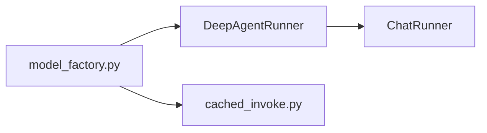

# Prompt — draw or redraw a module's diagram

You are adding (or correcting) the diagram inside the `## Shape` section of ONE
architecture card. Substitute `{{CARD}}` (repo-relative path to the `MOD-*.md`)
and `{{SIGNATURE}}` (that card's current `code_signature`) before running.

The diagram exists so a reader — human or agent — can see the module's internal
wiring without opening 30 files. It is not decoration and it is not a file tree.

---

## First decide whether to draw one at all

**Draw a diagram when at least one is true:**

- Calls funnel through a chokepoint, and which path a caller takes matters.
- There is a pipeline or lifecycle with more than two stages.
- Two or more things fan out from, or in to, a single component.
- Getting the module wrong means calling the wrong one of several look-alikes.

**Do NOT draw one when:**

- The module is a flat bag of independent files — types, constants, styles,
  unrelated UI components. A diagram of things that do not talk to each other
  is noise, and it goes stale on every file addition for no benefit.
- The module has fewer than four meaningful files.
- The only relationship is "everything imports this one helper". Say that in a
  sentence instead.

**A card with no diagram is a correct outcome.** Roughly a third of this
corpus's modules should have one. If this module should not, say so in one
line, change nothing, and stop — do not stamp `prose_signature`, since you did
not revise the prose.

## Draw it

Mermaid, fenced as ` ```mermaid `, placed in `## Shape` directly under the
opening statement of the module's load-bearing structure.



- `flowchart LR` or `TD` for structure and call flow — this is the default.
- `sequenceDiagram` only when the ORDER of interactions is the point (a
  handshake, a retry, a gate pause and resume).
- `stateDiagram-v2` only for a real lifecycle with named states.

Constraints, all of them load-bearing:

- **8–14 nodes.** Fewer is not worth a diagram; more is unreadable and
  guarantees churn. Collapse a group of siblings into one node
  (`validators["validators/*.py"]`) rather than drawing each.
- **Node ids are the identifier; labels are the file or symbol.** Use
  `chat_runner["ChatRunner"]` — a bare id renders, but the label is what makes
  the picture legible.
- **Every node must be a real file or symbol in this module**, or a named
  external boundary the module talks to. No conceptual boxes ("Business
  Logic", "Data Layer") — they are unverifiable and they never go stale, which
  makes them worse than nothing.
- **Edges are real relationships** — imports, calls, or data handoff — that you
  confirmed in the source. If an edge means something specific, label it:
  `A -->|"registers"| B`.
- **No styling, no colours, no subgraph nesting deeper than one level.** The
  diagram is read in a terminal, an editor preview and by an agent parsing
  text; keep it plain.
- **Do not draw the module's external dependency edges.** Those are already
  listed, with links, in the generated block above.

## If you are REDRAWING

An existing diagram is stale, not wrong-headed. Read it first and preserve the
structural story it tells wherever the code still supports it. Change only the
nodes and edges the code actually moved — a renamed symbol becomes its new
name, a deleted file's node comes out, a new chokepoint goes in. A wholesale
redraw for an unchanged module discards a prior author's judgement about what
was worth showing.

Cross-check the surrounding `## Shape` prose while you are in there: if it
names something the diagram no longer does, the prose is stale too — fix it.
The diagram and the prose describing it must agree.

## Then stamp it

Set `prose_signature: {{SIGNATURE}}` in the card's frontmatter, immediately
after `code_signature`, replacing any existing value. Only do this if you
actually revised the diagram or the prose. Stamping an unchanged card marks
stale analysis as current, which is exactly the failure this mechanism exists
to catch.

Touch nothing between `<!-- AUTO-GENERATED BELOW THIS LINE` and
`<!-- /AUTO-GENERATED -->`, and touch no other file.
